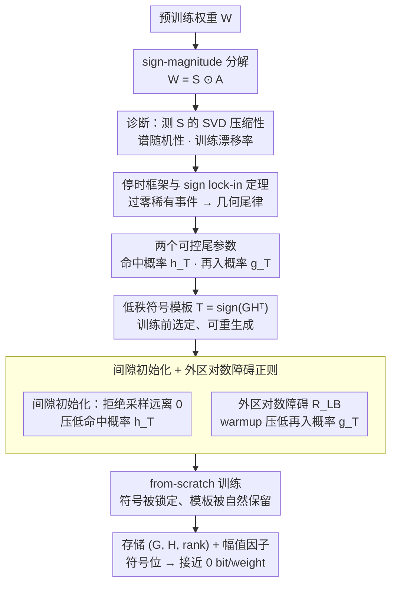

# Sign Lock-In: Randomly Initialized Weight Signs Persist and Bottleneck Sub-Bit Model Compression

**会议**: ICML2026  
**arXiv**: [2602.17063](https://arxiv.org/abs/2602.17063)  
**代码**: 待确认  
**领域**: 模型压缩 / 量化 / 优化动力学  
**关键词**: 亚比特压缩, 符号位, 锁定理论, 几何尾律, 低秩模板  

## 一句话总结
本文揭示训练后的权重符号矩阵在所有架构上都与 i.i.d. Rademacher 噪声难以区分，从而构成亚比特压缩的"一比特墙"，并用停时分析证明这种伪随机性其实是初始化符号的"锁定"——再据此提出低秩符号模板 + 间隙初始化 + 边界对数障碍正则的从头训练方案，把符号位摊销到接近 0 bit/weight。

## 研究背景与动机

**领域现状**：模型压缩主流走在"few-bit"路线，把权重量化到 2~4 bit、做低秩分解、剪枝、熵编码等组合，把幅值 $A=|W|$ 压到每权重 1 bit 以下并不困难。在这种规模下，符号位 $S=\mathrm{sign}(W)$ 只是相对小的固定开销，几乎不被讨论。

**现有痛点**：一旦把目标降到"sub-bit"区（每权重平均 <1 bit），符号位反而变成不可压缩的瓶颈。作者在 MLP-Mixer / ResNet18 / TinyLlama-1.1B 上系统测了三件事：(i) 符号矩阵 $S$ 的最佳秩-$r$ Frobenius 逼近误差 $E_r(S)$ 衰减明显比 $E_r(A)$ 慢；(ii) 用两样本 Kolmogorov–Smirnov 检验 $S$ 的归一化奇异值与 i.i.d. Rademacher 几乎不可区分；(iii) Shannon 率失真下界给出的熵率代理 $\widehat{H}_{\mathrm{RD}}\approx 1$，意味着符号几乎没有冗余。

**核心矛盾**：训练后的符号矩阵"看起来像噪声"，但同一篇里又观测到——单坐标视角下，绝大多数权重一直保持初始化时的符号，flip 比例长期低于 0.5。即"边际分布像 i.i.d. Rademacher"和"逐坐标轨迹高度持久"这两件事必须共存。

**本文目标**：(1) 找一个数学机制同时解释"伪随机分布 + 强持久轨迹"；(2) 用这个机制把符号位从瓶颈变成可控变量。

**切入角度**：把单个标量权重看成一维适配过程 $(w_t)$，sign 改变只能通过过 0 边界。如果训练动力学常把权重维持在远离 0 的"外区"，那么符号翻转必然由对零的稀有偏离事件触发——这正是 Freidlin–Wentzell 类型的停时/首次穿越问题。

**核心 idea**：用"外区 → 边界邻域 → 外区"的有效翻转计数 $K_T^{\mathrm{eff}}(\rho)$ 替代逐步翻转计数，证明它服从几何尾分布；既然初始符号会被锁住，那干脆把"初始符号"设成低秩可复现的模板，让锁定从 bug 变成 feature。

## 方法详解

### 整体框架
全文分两段：诊断段 + 干预段。诊断段把权重做 sign–magnitude 分解 $W=S\odot A$，分别测 $S$ 和 $A$ 的 SVD 压缩性、谱随机性、训练中漂移率；接着用一维停时分析得到 sign lock-in 定理。干预段把诊断段的两个关键量——初始命中概率 $h_T$ 和再入概率 $g_T$——作为可控旋钮，提出"低秩符号模板初始化 + 间隙采样 + 外区对数障碍正则"的从头训练 pipeline，使训练完成后符号矩阵仍是初始模板的浅层扰动，存储时只保留 $(G,H,\text{rank})$ 即可。

### 关键设计

**1. 一维停时框架与 sign lock-in 定理：用"过零边界"的稀有事件解释符号既像噪声又持久**

谱随机性测试说符号矩阵长得像 i.i.d. Rademacher，但逐坐标又观测到符号长期不翻——这对悖论用传统的泛函渐近分析根本拼不到一起，因为它平均掉了恰恰最关键的稀有边界穿越事件。作者把单个标量权重看成一维过程 $(w_t)$，注意到符号翻转只能由 $w_t$ 穿过 0 触发，于是把"训练后是否翻转"重述成停时问题：固定外阈值 $\rho>0$ 和边界半径 $\epsilon=\max\{\epsilon_0,\Delta\}$，递归定义

$$\sigma_0=\inf\{t:|w_t|\ge\rho\},\quad \tau_k=\inf\{t>\sigma_{k-1}:|w_t|\le\epsilon\},\quad \sigma_k=\inf\{t>\tau_k:|w_t|\ge\rho\}.$$

在"有界更新假设"（每步增量 $|w_{t+1}-w_t|\le\Delta$ 以概率 $\ge 1-\delta_{\mathrm{upd}}$）和"再入率假设"（$\mathbb{P}[\tau_{k+1}\le T\mid\mathcal{F}_{\sigma_k}]\le g_T$）下，有效外到外翻转计数服从几何尾律

$$\mathbb{P}[K_T^{\mathrm{eff}}(\rho)\ge k]\le h_T\, g_T^{k-1}+\delta_{\mathrm{upd}},\qquad h_T=\mathbb{P}[\tau_1\le T].$$

这样写的好处是两个参数都能被实验直接量到 $(\hat h,\hat g)$ 验证，而且 SGD 版的命题 3.5 把再入率 $g_T^{\mathrm{SGD}}$ 与边界 margin $\rho-\epsilon$、学习率平方和 $\sum_t\eta_t^2$、batch noise 三者挂钩——等于给出了"什么训练 recipe 会让符号锁得更死"的可操作刻度，后续两个工程设计正是按这把刻度去压 $h_T$ 和 $g_T$。

**2. 低秩符号模板 $T=\mathrm{sign}(GH^\top)$：把不可压缩的随机符号换成可重生成的结构**

sub-bit 区的根本死结是 sign 矩阵 $S$ 几乎不可低秩近似（$E_r(S)$ 衰减极慢，谱又像噪声），所以无论训练后怎么压都抵在"一比特墙"上。既然定理保证训练几乎不改符号，作者干脆把死结搬到训练之前：对每层 $W^{(l)}\in\mathbb{R}^{m\times n}$，采 $G\in\mathbb{R}^{m\times r}$、$H\in\mathbb{R}^{n\times r}$（i.i.d. 标准正态，$r\ll\min(m,n)$，论文取 $r=2$），令模板 $T^{(l)}=\mathrm{sign}(GH^\top)$，幅值 $A^{(l)}$ 从任意正分布采样，初始权重 $W^{(l)}=T^{(l)}\odot A^{(l)}$。因为符号会被锁住，训练前选的模板训练后照样能用，推理时只需存 $(G,H,r)$ 加幅值的 SVD 因子，符号的每权重比特数就趋近 0。关键在于它没有去近似那个不可低秩的 $S$，而是把"低秩"直接定义进 $\mathrm{sign}(GH^\top)$，从源头绕开了一比特墙。

**3. 间隙初始化 + 外区对数障碍正则：把"是否被锁住"从默认行为变成可调旋钮**

模板要真被锁住，得主动压小定理里的 $h_T$ 和 $g_T$，而这两者恰好分别由初始化和早期动力学决定，所以工程上也分两路下钳。一路是间隙初始化：对每个 entry 做拒绝采样 $z\sim\mathcal{N}(0,\sigma_{\mathrm{init}}^2)$，若 $|z|<a_{\mathrm{init}}=c_{\mathrm{gap}}\sigma_{\mathrm{init}}$ 就重采，等价于支撑在 $\mathbb{R}\setminus[-a_{\mathrm{init}},a_{\mathrm{init}}]$ 上的双侧截断高斯，让权重一开始就远离 0，直接压低首次命中边界概率 $h_T$。另一路是外区对数障碍

$$R_{\mathrm{LB}}(W)=\frac{1}{mn}\sum_{i,j}\log\max\Big\{1,\ \frac{a_{\mathrm{init}}}{|W_{ij}|+\epsilon_{\mathrm{lb}}}\Big\},$$

权重在外区时它恒为 0、靠近边界时才光滑增大，总损失为 $\mathcal{L}_{\mathrm{total}}=\mathcal{L}_{\mathrm{task}}+\lambda(t)\sum_{l\in\mathcal{M}}R_{\mathrm{LB}}(W^{(l)})$，warmup 后 $\lambda(t)$ 退到 0，专门压住早期的再入概率 $g_T$。两个旋钮独立、各管一个尾系数，于是"符号被不被锁住"不再是听天由命的默认行为，而成了能调的训练超参。

### 损失函数 / 训练策略
任务损失外只加一项 $\lambda(t)\sum_{l\in\mathcal{M}}R_{\mathrm{LB}}(W^{(l)};a_{\mathrm{init}},\epsilon_{\mathrm{lb}})$；$\lambda(t)$ 在 warmup 阶段保持常值，之后退到 0。模板 $T^{(l)}$ 仅在初始化时使用，训练过程中不显式约束符号——完全依赖几何尾律保证模板被自然保留。

## 实验关键数据

### 主实验

| 任务 / 数据 | 度量 | Vanilla SVD on raw $W$ | Hashing / 1-bit baselines | **SVD on $\lvert W_{\mathrm{lockin}}\rvert$ (本文)** |
|--------|------|------|------|------|
| CharLM | 困惑度（越低越好，$<1$ bpw 区） | 急剧上升 / 抵在 1 bpw | 接近 1 bpw 即停滞 | 持续下降，sub-bit 区显著最佳 |
| Text8-Char | 困惑度 | 同上 | 同上 | 同上 |
| DBPedia14 | 分类准确率（越高越好） | 在 1 bpw 附近塌方 | 1 bpw 即上限 | 在 sub-bit 仍保持竞争力 |

（数值见 Figure 8；模型规模从 30M 到 10B 的 sweep 中 $\hat h$ 与 $\hat g$ 都随规模单调下降，最大模型上 $\hat g$ 接近 0，意味着大模型天生强锁定。）

### 消融实验

| 配置 | mean flip rate | 验证困惑度变化 | 说明 |
|------|---------------|-----------------|------|
| baseline（普通初始化 + 无正则） | $\sim 10^{-1}$ | 参考线 | sign 矩阵几乎不可低秩近似 |
| 仅 gap init（$a_{\mathrm{init}}$ 适中） | 中等下降 | 几乎不变 | $h_T$ 被压小，$g_T$ 不变 |
| 仅 log-barrier（$\lambda$ 大） | 显著下降 | 略升 | $g_T$ 被压小，$h_T$ 不变 |
| **gap + log-barrier（Pareto 前沿）** | $\sim 10^{-3}$ | 仅 $\approx +1$ ppl | 两个旋钮叠加，符号结构被保留 |

### 关键发现
- 几何尾律 $\mathbb{P}[K_T^{\mathrm{eff}}\ge k]\approx \hat h\hat g^{k-1}$ 在多种学习率下被半对数 tail plot 验证；扫描 lr 改变有效步长 $\Delta$，只动尾系数不动几何形状。
- 锁定强度顺序：inverse decay $\to$ cosine $\to$ exponential $\to$ constant 学习率，依次变弱；ReLU 正齐次性、归一化层、增大 batch / 模型规模都增强锁定。
- 模板 + 间隙 + 对数障碍组合训练后，幅值矩阵的低秩结构与 baseline 几乎一致（Figure 7），但符号矩阵从"几乎不可低秩"变成"明显低秩"，证明干预没有牺牲幅值可压性。

## 亮点与洞察
- 把"经验上 sign 矩阵长得像噪声"和"逐坐标 sign 又长期不变"这对悖论用停时给出统一解释——边际分布是稀有边界事件的轨迹平均，逐坐标轨迹则被 $\sigma_k$ 序列锁住，两者只在停时语言里自洽。
- 几何尾律的两个参数 $(h_T,g_T)$ 直接对应工程旋钮：拒绝采样调 $h_T$、对数障碍调 $g_T$，这把传统"训练后量化"问题转译成"训练前选模板 + 训练中钳边界"，思维范式可迁移到 ternary / 多比特码本设计。
- 大模型天然强锁定（Figure 4 显示 10B 上 $\hat g\to 0$）暗示 sub-bit 方向其实越大越友好，与"模型越大越难压"的直觉相反，给后续 LLM 极致压缩留了一个理论锚点。

## 局限与展望
- 只适用于 from-scratch 训练：模板必须在优化开始前选好；任意已训练 checkpoint 无法直接套用，post-training 版本仍是 open problem。
- 在极强的幅值侧正则下系统会进入 "sign floating mode"（附录 D.6），权重持续被吸向 0，几何尾律不再成立——理论假设 3.4 失效场景需要使用者自查。
- 当前只测了对数障碍这一种 enforcement，三角障碍、stop-gradient、直接 sign-STE 等其他策略未做对比。
- 没有讨论符号位作为"自由度"对表达能力的潜在贡献，把符号完全固定可能在某些任务上限上表现力——文中未给上限。

## 相关工作与启发
- **vs 经典 post-training quantization（GPTQ / AWQ 等）**: 它们假设可任意操作训练后的 $S$ 和 $A$，但在 sub-bit 区遇到"$S$ 几乎是 i.i.d. 噪声"的硬墙；本文从训练前介入，直接绕开这堵墙。
- **vs 1-bit / Sign-SGD 系列**: 这些方法默认 sign 是承载信息的核心，但本文证据指出训练几乎不改 sign，所以"省 sign"比"训 sign"更高效——这与 BitNet b1.58 等强调三态权重的做法形成互补。
- **vs SDE / diffusion 视角的 SGD 理论（Mandt 等）**: 那些工作分析的是平均轨迹，本文则把视角推到首次穿越和稀有事件，这条停时路线给"如何在工程中诱导 / 抑制特定动力学事件"提供了新切入。

## 评分
- 新颖性: ⭐⭐⭐⭐⭐ 把停时分析、谱随机性、sub-bit 压缩三条线第一次拼到一起，并给出可执行的旋钮。
- 实验充分度: ⭐⭐⭐⭐ MLP/CNN/Transformer 全覆盖 + 30M 到 10B 规模扫到，但下游任务仍以语言建模 / 文本分类为主。
- 写作质量: ⭐⭐⭐⭐ 定义与命题严谨，主线推进非常清晰；附录引用较多，正文读起来略密。
- 价值: ⭐⭐⭐⭐⭐ 直击 sub-bit 区的"一比特墙"，并提供训练侧第一性原理解释，对大模型部署有直接工程意义。
- 综合判断: 这是一篇典型的"理论 + 工程闭环"工作，理论部分用停时刻画稀有事件，工程部分把理论参数 $(h_T,g_T)$ 直接变成两个可调旋钮，并通过 from-scratch 训练验证理论预测的趋势。

<!-- RELATED:START -->

## 相关论文

- [\[AAAI 2026\] Personalized Federated Learning with Bidirectional Communication Compression via One-Bit Random Sketching](../../AAAI2026/optimization/personalized_federated_learning_with_bidirectional_communication_compression_via.md)
- [\[CVPR 2026\] Defending Unauthorized Model Merging via Dual-Stage Weight Protection](../../CVPR2026/optimization/defending_unauthorized_model_merging_via_dual-stage_weight_protection.md)
- [\[ICML 2026\] Limits of Convergence-Rate Control for Open-Weight Safety](limits_of_convergence-rate_control_for_open-weight_safety.md)
- [\[ICML 2026\] Automatic Unsupervised Ensemble Outlier Model Selection–Extended Version](automatic_unsupervised_ensemble_outlier_model_selection--extended_version.md)
- [\[ICML 2026\] On the Interaction of Batch Noise, Adaptivity, and Compression, under $(L_0,L_1)$-Smoothness: An SDE Approach](on_the_interaction_of_batch_noise_adaptivity_and_compression_under_l_0l_1-smooth.md)

<!-- RELATED:END -->
