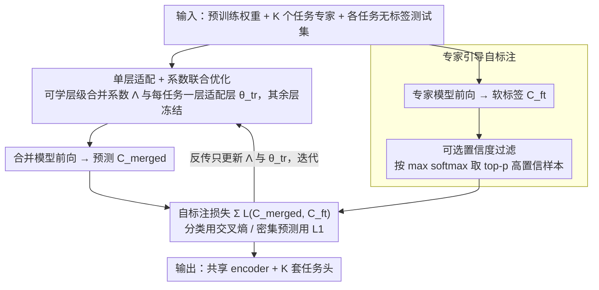

# SyMerge: From Non-Interference to Synergistic Merging via Single-Layer Adaptation

**会议**: ICML 2026  
**arXiv**: [2412.19098](https://arxiv.org/abs/2412.19098)  
**代码**: https://aim-skku.github.io/SyMerge (有)  
**领域**: 模型压缩 / 模型合并  
**关键词**: 模型合并、任务协同、测试时自适应、单层适配、专家自标注

## 一句话总结
本文把"模型合并"的目标从"避免任务干扰"重新定义为"促进任务协同"，提出 SyMerge：只联合优化每个任务的一个 task-specific 层和编码器的层级 merging 系数，再用 fine-tuned 专家模型当软标签老师，避免熵最小化在测试时漂移，从而在视觉/密集预测/NLP 三类基准上把合并模型推到接近单任务上限的水平。

## 研究背景与动机
**领域现状**：模型合并（model merging）流派把多个独立微调好的同架构模型在参数空间直接相加，复用任务向量 $\tau_k = \Theta_k - \Theta_{\text{pre}}$ 得到一个多任务模型，免去联合训练的代价。主流路线分两支：训练无关（Task Arithmetic、Ties-Merging、PCB、Consensus 等）靠启发式或网格搜索定系数；测试时自适应（AdaMerging、WEMoE、Surgery 等）用无标签测试数据通过熵最小化等代理目标学合并系数或后置 adapter。

**现有痛点**：作者通过把 4 个任务的数据按 Hendrycks 标准做 corruption 测试发现，训练无关方法在轻微分布漂移下就崩塌；而测试时方法虽然鲁棒一点，但仍把"避免干扰"当成唯一目标——所有 SVD 截断、参数掩码、weight disentanglement 的工作都在做同一件事：让 $\tau_i$ 不要破坏任务 $j$，本质上是在追求 $L_j[f(x;\theta_0+\tau_i)] = L_j[f(x;\theta_0)]$。

**核心矛盾**：非干扰目标天生有天花板——合并模型在任务 $j$ 上的性能最多追平 pretrain 模型，因为目标只是"不让别的任务损害我"，没有任何机制让别的任务"帮助我"。同时，作者在 20 个视觉任务上做了一项关键 pilot 实验：cross-task performance（用任务 A 的 encoder 配任务 B 的 classifier）和 merge 后的性能在 ViT-B/32 上呈现 $r=0.863, p<0.001$ 的强正相关。这说明合并质量的真正瓶颈是不同任务 encoder/predictor 之间的功能对齐（functional alignment），而不是干扰。

**本文目标**：把目标从非干扰升级为正向协同 $L_j[f(x;\theta_0+\tau_i)] < L_j[f(x;\theta_0)]$；找到一种最小化代价就能提升 cross-task 对齐、又能在无标签测试场景下稳定工作的方法。

**切入角度**：作者做了第二个 pilot——用有标签数据在固定的合并 encoder 上重训练任务 $k$ 的最后一层，然后把这个新 classifier 接到任务 $m\neq k$ 的 encoder 上做测试，发现 8 个任务全部出现 cross-task 准确率显著提升。这暗示只要调一层（哪怕是中间块），就能拉齐 encoder 与 predictor 在不同任务上的功能对齐。

**核心 idea**：把"调一层"这个发现搬到无标签测试时场景，联合优化层级合并系数 $\{\lambda_k^l\}$ 和每任务一个 task-specific 层 $\theta_k^{\text{tr}}$，用预先 fine-tuned 的专家模型预测当作"软标签老师"，把熵最小化替换成更稳定的专家引导自标注交叉熵。

## 方法详解

### 整体框架
输入：预训练权重 $\Theta_{\text{pre}}$、$K$ 个独立 fine-tuned 的任务专家 $\{\Theta_k\}_{k=1}^K$、每个任务的无标签测试集 $\mathcal{X}_k^{te}$；输出：一个共享 encoder $\Theta_{\text{MTL}}^{\text{enc}}$ 加上 $K$ 套任务头。pipeline 走三步：(1) 把每层编码器权重写成 $\theta_{\text{MTL}}^l = \theta_{\text{pre}}^l + \sum_k \lambda_k^l \tau_k^l$，把 $\Lambda = \{\lambda_k^l\}$ 设为可学习的层级×任务系数矩阵（沿用 AdaMerging 的参数化）；(2) 在每个任务上挑一个 task-specific 适配层 $\theta_k^{\text{tr}}$，初始化为该任务专家的原层；(3) 联合优化 $\Lambda$ 和 $\{\theta_k^{\text{tr}}\}$，使合并模型在 $\mathcal{X}_k^{te}$ 上的预测尽量逼近专家模型的预测。整个过程只动这两组参数，其它层全部冻结。

### 关键设计

**1. 单层适配 + 系数联合优化：用最少的可训参数同时改造 encoder 混合方式和任务输出端**

cross-task pilot 已经证明"调一层"就足以拉齐 encoder 与 predictor 的功能对齐，SyMerge 要把这个发现搬到无标签测试时场景。具体做法是同时放开两组参数：共享 encoder 的层级合并系数 $\Lambda=\{\lambda_k^l\}$（每层权重写成 $\theta_{\text{MTL}}^l=\theta_{\text{pre}}^l+\sum_k\lambda_k^l\tau_k^l$，沿用 AdaMerging 的参数化），加上每个任务一层 task-specific 适配层 $\theta_k^{\text{tr}}$（默认是分类头或最后一个 transformer block，用该任务专家的原层初始化），两者同步反传同一个自标注 loss、其余层全部冻结。和只学 $\Lambda$ 的 AdaMerging 相比，把适配层一起放开才能稳住——作者发现"只调系数"在不同初始化（disjoint basins）下会塌掉，平均跌到 30% 以下，而 SyMerge 靠放开的适配层仍能恢复出可用模型；现实中大量开源 fine-tuned 模型并不共享 pretrain，能合并这类异源专家才有实用价值，而这恰是只调系数的方法触不到的边界。和 Surgery/ProbSurgery 那种额外叠 adapter 的做法相比，SyMerge 不引入任何新模块，只是让本来就存在的一层从冻结变可训。把适配层放开还有一层隐含好处——当 encoder 系数被调向某个不友好的混合方向时，task-specific 层能把信息反向修回来，形成 encoder–predictor 的协同更新，这正是标题里 "Synergistic" 的由来。

**2. 专家引导自标注目标：把不稳定的熵最小化换成"专家当老师"的软标签监督**

测试时合并没有标签，AdaMerging 这类方法只能用熵最小化当代理目标，但作者发现这个代理并不靠谱——他们用 Spearman 相关系数衡量"代理 loss"和真实监督交叉熵的一致性，结果熵最小化在训练前还有中等相关、训练后就显著漂移（Cars 上甚至反向），这正是 AdaMerging 类方法不稳的根源。SyMerge 的替代方案很直接：每个任务的 fine-tuned 专家本来就在硬盘上躺着，且在自己任务上已是 SOTA，那就把它的输出 $C_k^{\text{ft}}(x)$（分类是 softmax 概率向量，回归是连续输出）当软标签老师，让合并模型 $C_k^{\text{merged}}(x)$ 去逼近它，最小化 $\sum_k \mathcal{L}_{CE}(C_k^{\text{merged}}, C_k^{\text{ft}})$。对分割、深度、表面法向量这类不能算熵的密集预测任务，交叉熵换成对应的 L1 损失即可，所以这个目标天然覆盖各类任务。让专家做老师比让模型自己猜伪标签可靠得多，相关性度量也显示它在训练全程都和真监督高度一致。在此之上，作者还提供一个可选、与主目标解耦的置信度过滤：每个 batch 按专家预测的最大 softmax 概率排序，只用 top-$p$ 的高置信样本反传，避免少数被专家判错的软标签污染优化——这是 test-time learning 里的标准低代价技巧。

### 损失函数 / 训练策略
统一的目标是 $\min_{\{\lambda_k^l\}, \{\theta_k^{\text{tr}}\}} \sum_{k=1}^K \mathcal{L}_k(C_k^{\text{merged}}, C_k^{\text{ft}})$，分类用交叉熵，回归任务用 L1。优化器与学习率沿用 AdaMerging 的设置（详见附录 E.2），$\Lambda$ 初始化为均匀分配，task-specific 层 $\theta_k^{\text{tr}}$ 用专家模型的对应层初始化。论文报告所有结果都是 5 个随机种子的均值±标准差。

## 实验关键数据

### 主实验
覆盖三大类：视觉分类（ViT-B/32 与 ViT-L/14，分别合并 8 / 14 / 20 个任务）、密集预测（NYUv2 上 ResNet-50 合并 segmentation/depth/normal 3 个任务）、NLP（RoBERTa 合并 GLUE 8 个任务）。下表汇总最具代表性的视觉与 NLP 主结果：

| 基准设置 | 关键指标 | AdaMerging | EMR-Merging | ProbSurgery | SyMerge | Individual 上限 |
|----------|----------|------------|-------------|-------------|---------|-----------------|
| ViT-B/32 / 8 任务 | 平均准确率 | 80.1 | 88.7 | 87.4 | **90.1 ±0.1** | 90.5 |
| ViT-B/32 / 20 任务 | 平均准确率 | 69.6 | 86.6 | 84.5 | **88.6 ±0.4** | 90.4 |
| ViT-L/14 / 20 任务 | 平均准确率 | 82.1 | 92.0 | 90.2 | **93.2 ±0.1** | 94.0 |
| NYUv2 / 分割 | mIoU↑ | — | 41.5 | 43.6 | **49.8 ±0.3** | 52.0 |
| GLUE / 8 任务 | 平均 | — | 80.2 | 81.6 | **83.9 ±0.2** | 85.6 |

ViT-B/32 在 20 任务设置下，SyMerge 离单任务上限只差 1.8 个点，把之前最好的 EMR-Merging（86.6）拉开 2 个点；密集预测的分割 mIoU 从 ProbSurgery 的 43.6 直接拉到 49.8，差不多吃掉了到上限 52.0 的 70% gap；GLUE 上 SyMerge 平均 83.9 与单任务 85.6 只差 1.7 个点，多数子任务（如 CoLA、STSB、QNLI、RTE）已经完全追平甚至超越 Surgery 系列。

### 消融实验

| 配置 | ViT-B/32 8 任务平均 | 说明 |
|------|---------------------|------|
| Task Arithmetic（baseline） | 69.1 | 训练无关，固定 $\lambda$ |
| AdaMerging（只学 $\Lambda$） | 80.1 | 只优化层级系数 + 熵最小化 |
| 只学 $\Lambda$ + 自标注 loss | ~85 | 把熵换成专家自标注，已显著回升 |
| 只学 $\theta_k^{\text{tr}}$ | ~83 | 只放开适配层，固定 $\Lambda$ |
| **SyMerge（联合 + 自标注）** | **90.1** | 论文完整方案 |
| 同上 + 置信度过滤 | 90.1+ | 可选项，附录里另有约 0.2-0.5 提升 |

（中间两行数字是从论文 Fig 4 / Sec 4.3 的曲线和文本中读到的近似量，没有直接表格列出，仅用于体现两个组件各自的贡献。）

### 关键发现
- 单独把熵最小化换成专家自标注，就能从 80 跳到 85 左右，证明监督信号稳定性比系数搜索精细程度更关键。
- 单独放开适配层不动 $\Lambda$，也能从 69 跳到 83 左右，但天花板比联合优化低；只有两者一起动才能突破 90，验证了"协同"的存在。
- 在 disjoint-basin（专家来自不同 pretrain）的极端 setting 下，AdaMerging 等系数法平均跌到 30% 以下，SyMerge 因为有适配层兜底仍能保持可用性能（详见论文 Sec 4.3）。
- 跨任务相关 $r=0.863$ 的 pilot 不仅是动机，也意味着未来评估合并方法时 cross-task accuracy 可以当成一个 cheap proxy。

## 亮点与洞察
- 把模型合并的目标从"非干扰"重新定义为"协同"是一次很干净的概念升级——之前所有 SVD/掩码/disentanglement 工作都在做同一件事（让 $\tau_i$ 别坏事），而本文用 $r=0.863$ 的 pilot 直接说明"光不坏事"有天花板，必须主动促对齐。
- "用专家模型当软标签老师"在测试时自适应这条线里是一个被忽视的简单选项：fine-tuned 专家本来就在硬盘里躺着，作者第一次系统论证它做自标注比熵稳定得多，这个思路完全可以迁移到任意 test-time adaptation 场景（领域自适应、TTA、prompt tuning 都能用同款）。
- "调一层就够了"是一个反直觉的最小化结论。之前 Surgery/WEMoE 都在加各种额外 adapter，本文证明任务专家原本就有的最后一层放开就够用，不需要扩参数也不需要换架构。

## 局限与展望
- 方法依赖每个任务的 fine-tuned 专家模型同时驻留——专家越多越费显存，相当于把"训一个多任务模型"的代价换成了"测试时同时跑 $K$ 个专家做老师"，对 $K$ 很大的场景不一定友好。
- 论文把"调哪一层"当成超参（默认最后一层或最后一个 block），没有给出自动选择策略；在不同架构上需要少量调试。
- 实验主要在 ViT、ResNet、RoBERTa 这类中等规模模型上做，对 LLM 合并（>7B 参数）只能从 AdaMerging 这一支外推，专家自标注是否会在 LLM 上同样稳定还有待验证。
- "协同"的定义偏经验（用 cross-task perf 和最终合并 perf 的相关性来表征），理论 Proposition 3.1 给的是收紧凸上界的论证，离严格意义下的"任务间正向迁移"还有距离。

## 相关工作与启发
- **vs AdaMerging**：AdaMerging 只学层级系数 $\Lambda$ 并用熵最小化监督，SyMerge 增加了 task-specific 层联合优化、并把熵换成专家自标注；本文实验显示这两处改动各贡献约 5–10 个点的提升，是直接 strict-superset。
- **vs Surgery / ProbSurgery**：这两类方法在合并 encoder 之后再叠加一个 adapter 网络来做后置校正，参数量更多且需要额外推理开销；SyMerge 不引入新模块，只在原架构里放开一层，参数更少而效果更好。
- **vs EMR-Merging**：EMR 用 expert routing 思路在推理时按任务切换权重，更接近 mixture-of-experts；SyMerge 仍是"一个共享 encoder + 任务头"的传统形态，部署更简单。
- **vs 非干扰路线（Ties-Merging / TSV-M / ISO-Merging）**：这些工作都在算如何让 $\tau$ 之间正交或互不冲突，SyMerge 直接放弃这条路，证明"主动调一层促对齐"比"被动避免冲突"上限更高。

<!-- RELATED:START -->

## 相关论文

- [\[NeurIPS 2025\] Quantitative Convergence of Trained Single Layer Neural Networks to Gaussian Processes](../../NeurIPS2025/optimization/quantitative_convergence_of_trained_single_layer_neural_networks_to_gaussian_pro.md)
- [\[CVPR 2026\] ACE-Merging: Data-Free Model Merging with Adaptive Covariance Estimation](../../CVPR2026/optimization/ace-merging_data-free_model_merging_with_adaptive_covariance_estimation.md)
- [\[ICML 2026\] Bayesian Gated Non-Negative Contrastive Learning](bayesian_gated_non-negative_contrastive_learning.md)
- [\[CVPR 2026\] Model Merging in the Essential Subspace](../../CVPR2026/optimization/model_merging_in_the_essential_subspace.md)
- [\[ICML 2026\] SPSsafe: Safeguarded Stochastic Polyak Step Sizes for Non-smooth Optimization](safeguarded_stochastic_polyak_step_sizes_for_non-smooth_optimization_robust_perf.md)

<!-- RELATED:END -->
