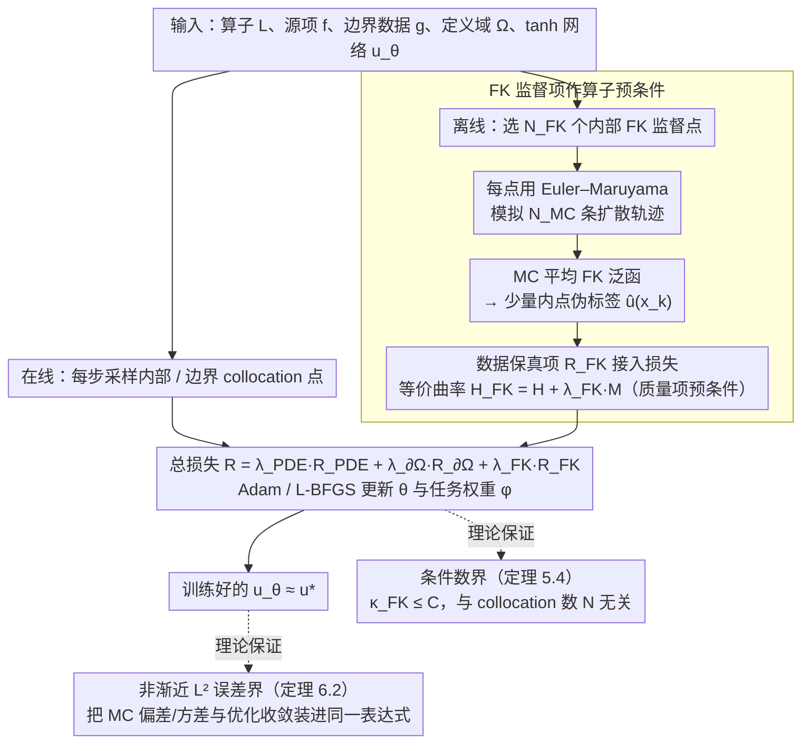

# Taming the Loss Landscape of PINNs with Noisy Feynman-Kac Supervision: Operator Preconditioning and Non-Asymptotic Error Bounds

**会议**: ICML 2026  
**arXiv**: [2606.00643](https://arxiv.org/abs/2606.00643)  
**代码**: 无  
**领域**: 优化理论 / 物理信息神经网络 / 损失景观  
**关键词**: PINN, Feynman-Kac, 算子预条件, 条件数, 损失景观  

## 一句话总结
在 PINN 损失里加入由 Feynman–Kac 公式蒙特卡洛模拟得到的少量内点伪标签，本质上就是给 PDE 算子做了一次预条件——本文同时给出"条件数在 collocation 数 $N$ 上保持有界"的算子级证明和带 $\tanh$ 激活的非渐近 $L^2$ 误差界，且在 Schrödinger、Poisson、committor 等问题上让本来彻底失败的 PINN 重新可解。

## 研究背景与动机

**领域现状**：PINN 用神经网络近似 PDE 解 $u_\theta$，靠在内点和边界上惩罚残差 $\mathcal{L}u - f$ 和边界违例来训练，是一类无网格的求解范式，已被广泛用于正/反问题、参数估计和多物理耦合等场景。

**现有痛点**：在中等刚性或高频问题上，PINN 经常训练极慢甚至完全无法收敛；同一份代码换组超参或换种采样策略，效果就天差地别。已有缓解手段（自适应采样、课程式训练、残差/梯度重权、域分解、专门架构）只在特定问题上有效，没有通用且可解释的修复方案。

**核心矛盾**：近年的算子条件数视角（De Ryck et al. 2024、Rathore et al. 2024 等）指出 PINN 训练困难来自 PDE 算子 $\mathcal{L}$ 的 Hermite 平方 $\mathcal{L}^*\mathcal{L}$ 谱严重病态——这是问题本身的性质，不是网络容量不足，因此再大的网络、再密的 collocation 也救不回来。已有补救多停留在改优化器（自然梯度、二阶法、隐式预条件），而不是改训练目标本身。

**本文目标**：(1) 给出一类**修改训练目标**而非优化器的预条件方案：在 PINN 损失上加一个数据保真项，且这项数据来源任意（FEM、实验、MC 模拟皆可）；(2) 严格证明这一项把损失的 PL$^*$ 条件数从随 $N$ 多项式爆炸压回**一致有界**；(3) 用 Feynman–Kac 公式给出零网格、零额外网络、与 PINN 完全兼容的标签生成方案；(4) 推出端到端、带 $\tanh$ 激活的非渐近 $L^2$ 误差界。

**切入角度**：作者注意到 PINN 的算子谱里"质量项"通常被忽略——加上一个 $\sum_k (u_\theta(x_k) - \hat u(x_k))^2$ 等价于在曲率矩阵上加正定项 $\lambda_{\mathrm{FK}}M$，相当于经典数值分析里的"质量矩阵"预条件，能够补足小特征值方向；而 Feynman–Kac 公式正好提供了一种几乎无成本的、可并行的伪标签生成方式。

**核心 idea**：把 PDE 解的 FK 概率表示 $u^\star(x) = \mathbb{E}_x[\int_0^\tau r(X_t)\mathrm{d}t + h(X_\tau)]$ 用 Euler–Maruyama 模拟若干轨迹做 MC 估计，得到极少量但有用的"内点伪标签"，再把这些伪标签作为辅助损失项接入标准 PINN，就在不动网络架构和优化器的前提下显著改善条件数和稳定性。

## 方法详解

整个 FK-PINN 由"离线 FK 标签生成"和"在线带数据增项的 PINN 训练"两阶段组成；理论部分则在 PL$^*$ 框架下证明条件数有界，并把 MC 噪声塞进学习理论的逼近-估计-优化分解，给出非渐近误差界。

### 整体框架

输入为：定义域 $\Omega\subset\mathbb{R}^d$、边界 $\partial\Omega$、二阶线性椭圆/抛物算子 $\mathcal{L}$、源项 $f$、Dirichlet 数据 $g$、$\tanh$ 网络 $u_\theta$。流水线如下：

1. **离线**：选 $N_{\mathrm{FK}}$ 个内部 FK 监督点 $\{x_k^{\mathrm{FK}}\}$（均匀/低差异/自适应均可）；对每个点用 Euler–Maruyama 跑 $N_{\mathrm{MC}}$ 条带 step $\Delta t$、最长时间 $T_{\max}$ 的扩散轨迹，按算法 1 的累加公式 $\hat u^{\mathrm{MC}}(x) = \frac{1}{N_{\mathrm{MC}}}\sum_m(\sum_{n=0}^{\hat\tau^{(m)}-1} r(X_n^{(m)})\Delta t + h(X_{\hat\tau^{(m)}}^{(m)}))$ 估出 $\hat u^{\mathrm{MC}}(x_k^{\mathrm{FK}})$。这一步**完全离线、可并行**，且不依赖网络。
2. **在线**：每一步采样新的内部 / 边界 collocation 点，连同已有的 FK 数据集一起算总损失（4.2），用 Adam/SGD 更新 $\theta$ 和任务权重 $\phi$；总损失退化为标准 PINN 当且仅当 $\lambda_{\mathrm{FK}} = 0$。

### 关键设计

**1. Feynman–Kac 监督项作算子预条件：在训练目标里加质量项把病态谱拉起来**

近年研究指出 PINN 训练难的根源是 PDE 算子的 $\mathcal{L}^*\mathcal{L}$ 谱严重病态，而已有补救多在改优化器（自然梯度、Newton），换起来成本高。作者注意到 PINN 的算子谱里"质量项"通常被忽略，于是在损失上接入数据保真项

$$\mathcal{R}_{\mathrm{FK}}(\theta)=\frac{1}{N_{\mathrm{FK}}}\sum_k\big(u_\theta(x_k^{\mathrm{FK}})-\hat u^{\mathrm{MC}}_\Gamma(x_k^{\mathrm{FK}})\big)^2,$$

总损失 $\mathcal{R}_{\mathrm{FK\text{-}PINN}}=\lambda_{\mathrm{PDE}}\mathcal{R}_{\mathrm{PDE}}+\lambda_{\partial\Omega}\mathcal{R}_{\partial\Omega}+\lambda_{\mathrm{FK}}\mathcal{R}_{\mathrm{FK}}$。这等价于把曲率矩阵 $H$ 改成 $H_{\mathrm{FK}}=H+\lambda_{\mathrm{FK}}M$（$M$ 半正定），相当于经典数值分析里的 mass-matrix 预条件，专门补足 $\mathcal{L}^*\mathcal{L}$ 小特征值方向。改训练目标而非优化器，让它完全兼容现有 PINN pipeline，而且理论保证预条件效果与数据来源无关——FK 只是一种零网格、可并行的实现，粗 FEM 或实验数据同样适用。

**2. 基于 PL$^*$ 框架的条件数界（定理 5.4）：把"加 FK 项→条件数好转"证成不等式**

直接证深网络的 Hessian 谱几乎不可行，作者改用更弱、对非孤立最小子流形仍成立的 PL$^*$ 条件，定义 $\kappa_{\mathrm{PL}}(\mathcal{J})=L(\mathcal{J})/\mu(\mathcal{J})$。Rathore 等已证 PINN 一侧 $\kappa_{\mathrm{PINN}}\ge cN^{\beta/2}$ 随 collocation 数多项式爆炸。本文引入"兼容性条件"（假设 5.2：把参数扰动拆成改变监督项与不改变两类，要求后者上 PDE 项仍良态、两类相互作用不太大），从而证明存在与 $N$ 无关的常数 $\mu_0,L_0,C$ 使 $\mathcal{R}_{\mathrm{FK\text{-}PINN}}$ 是 $L_0$-smooth 且满足 $\mu_0$-PL$^*$，于是 $\kappa_{\mathrm{FK}}\le C$。配合 PL$^*$ 收敛定理，GD 迭代复杂度从 $\mathcal{O}(N^{\beta/2}\log(1/\varepsilon))$ 降到 $\mathcal{O}(\log(1/\varepsilon))$——条件数从随 $N$ 爆炸变成一致有界，这正是训练对超参/采样不再敏感的理论解释。

**3. 带 $\tanh$ 的非渐近 $L^2$ 误差界（定理 6.2）：把条件数提升翻译成解的精度**

条件数好了还要回答"训完离真解多远"。作者先把 FK 蒙特卡洛标签分解为 $Y_i^{\mathrm{FK}}=u^\star(X_i^{\mathrm{FK}})+b(X_i^{\mathrm{FK}})+\zeta_i$，偏差 $|b(x)|\le C_{\mathrm{bias}}\sqrt{\Delta t}+C_T e^{-\kappa T_{\max}}$ 由 Euler–Maruyama 步长和截断时间控制、$\zeta_i$ 条件子指数；再走逼近-估计-优化分解。关键技术贡献是首次给出 $\tanh$ 网络一阶/二阶导数的伪维数界——以往 PINN 非渐近界基本只对分段多项式激活成立，而 $\tanh$ 才是工程默认，有了这个界才能让 Rademacher/PAC 估计延伸到 PDE 残差里的二阶项。最终在适当宽度/采样预算下，深度 $L=3$ 的 FK-PINN 经 $T\gtrsim\log N_{\mathrm{FK}}$ 步 GD 后以 $1-\delta$ 概率满足

$$\|u_{\theta_T}-u^\star\|_{L^2(\Omega)}\le C\big(N_{\mathrm{FK}}^{-\beta}+e^{-c_{\mathrm{opt}}T}+\varepsilon_{\mathrm{bias}}+\varepsilon_{\mathrm{bias}}^{1/2}\big),\qquad \beta=\frac{s-2}{2d+4(s-2)}.$$

这一束界把 MC 偏差/方差和优化收敛装进同一个表达式，能直接读出"FK 预算如何换误差"的工程指南。

### 损失函数 / 训练策略

总损失沿用不确定性加权（Kendall et al. 2018，Niu et al. 2025 在 PINN 上的版本）：把每个任务的 log 方差 $s_j = \log\sigma_j^2$ 设为可学权重 $\lambda_j(\phi) = \exp(-s_j)$，并把 $s_j$ 截断在有界区间以防 FK 这种噪声较大的项被自动忽略。优化器为 Adam + L-BFGS（实验中常用组合），网络为 $\tanh$ 全连接，无新增结构。

## 实验关键数据

### 主实验

| 问题 | 指标 | 标准 PINN | FK-PINN | 提升 |
|--------|------|------|----------|------|
| Poisson | $L^2$ 相对误差 | $0.322\pm 0.149$ | $0.118\pm 0.003$ | 误差降至 1/3，方差降 1 个量级 |
| Schrödinger-type（高频势 + 强源项） | $L^2$ 相对误差 | $0.624\pm 0.195$ | $0.096\pm 0.010$ | PINN 几乎彻底失败；FK-PINN 完整恢复波函数结构 |
| Mean Exit Time | $L^2$ 相对误差 | $1.007\pm 0.003$ | $0.107\pm 0.006$ | PINN 输出基本无意义；FK-PINN 误差降一个量级 |
| Committor | $L^2$ 相对误差 | $0.839\pm 0.661$ | $0.030\pm 0.008$ | 提升超过 27 倍，且方差从 0.66 降到 0.008 |

### 消融 / 分析实验

| 配置 | 关键指标 | 说明 |
|------|---------|------|
| Schrödinger 上 Adam 30000 + L-BFGS 15000 步定性可视化 | 标准 PINN 的预测彻底失真，绝对误差与波函数同阶 | 高频势让 PINN 损失景观完全不可优化，加 FK 后恢复 |
| 5 个随机种子的均值/方差 | FK-PINN 在所有问题上方差都比 PINN 小 1–2 个量级 | 印证条件数有界 → 训练对超参/采样不敏感 |
| FK 预算 $N_{\mathrm{FK}}$ 与轨迹数 $N_{\mathrm{MC}}$ 的权衡（见附录 E） | $N_{\mathrm{FK}}$ 决定覆盖范围、$N_{\mathrm{MC}}$ 决定每点方差 | 与定理 6.2 中"$m\asymp N_{\mathrm{FK}}^{d/(4d+8(s-2))}$、$T\gtrsim \log N_{\mathrm{FK}}$"的尺度匹配 |
| $\lambda_{\mathrm{FK}} = 0$（退化为 PINN） | 性能立刻退回基线水平 | 验证收益完全来自 FK 项，而非新架构或新优化器 |

### 关键发现

- 在所有 4 个问题上，FK-PINN 都比 PINN 大幅领先；**Schrödinger、Mean Exit Time、Committor 是 PINN 直接失败的硬题**，加 FK 项后从"不可解"变成"可解到 $10^{-1}$ 量级"。
- 标准 PINN 的方差通常和均值同量级，意味着结果几乎随机；FK-PINN 的方差小 1–2 个量级，说明条件数有界的理论预言在实测中成立。
- 算子预条件的效益对监督数据来源不敏感，FK 只是一种零网格、可并行的实现；这意味着只要能搞到少量真值点（哪怕是粗 FEM），就能复用 FK-PINN 的全部理论与训练框架。

## 亮点与洞察

- "把数据保真项重新解读为算子预条件"是这篇论文的核心叙事——它把传统数值分析里非常老的 mass-matrix preconditioning 思想，干净地嫁接到现代 PINN 的算子条件数分析上，理论可读性极高。
- 给出 $\tanh$ 网络一阶/二阶导数的伪维数界是一个独立有用的副产品，未来想做带二阶残差的 PINN 学习理论的工作都会用到。
- 实验设计有"逼问"的味道：作者专门挑了 PINN 已知会失败的多尺度 / 长时间扩散问题来证伪——只要 FK 项真的预条件了算子，就应该把这些刁钻问题从"无解"变成"可解"，而非只是把简单 Poisson 的误差再压几个百分点。
- "预条件效果与数据来源无关"这一论断给工程上很大的灵活度：可以把 FK MC、稀疏 FEM、真实测量数据混在一起，只要保证 Assumption 5.2 的兼容性，理论就立刻覆盖。

## 局限与展望

- 全部理论假设 $\mathcal{L}$ 是线性二阶椭圆/抛物算子，且能写出 FK 表示；对一般非线性 PDE 只能借助分支扩散等扩展方案（论文留作展望）。
- 假设 5.2 的"兼容性"在抽象层面很自然，但在具体问题上需要逐案验证，目前没有可操作的检查工具。
- 误差界依赖深度 $L = 3$ 的具体设定，深层网络的 $\tanh$ 伪维数估计仍有缩紧空间；同时 FK MC 的偏差项 $\varepsilon_{\mathrm{bias}}$ 是误差界的硬下界，意味着 $\Delta t$ 必须充分小才能享受全部收益。
- 在 $N_{\mathrm{FK}}$ 固定、$N_{\mathrm{int}}$ 增多的"真稀疏"区，误差被 FK 项饱和，无法消失——这是预条件思路必须付出的统计代价，作者也明确指出。

## 相关工作与启发

- **vs De Ryck et al. 2024（算子预条件视角）**：本文继承其 $\mathcal{L}^*\mathcal{L}$ 谱与训练动力学挂钩的分析框架，但把改进位置从"优化器"挪到了"训练目标"——后者实现成本远低，且理论结论更干净。
- **vs Rathore et al. 2024（PINN 损失 Hessian 谱）**：复用其 PL$^*$ + 核积分算子工具链证明 $\kappa_{\mathrm{PINN}}\geq cN^{\beta/2}$，本文给出对偶结论：加上数据项后 $\kappa_{\mathrm{FK}}\leq C$，两端合在一起说明问题既能恶化也能被治。
- **vs Han et al. 2020 等"FK + 神经网络"方法**：那一类工作把 FK 直接当神经 PDE 求解器，需要对每个 $x$ 重新 MC；本文只用 FK 做稀疏监督，主体仍是 PINN 拟合，把 MC 成本压到最小且保持了 PINN 的连续解优势。
- **vs PINN 自适应采样/重权类（Wu et al. 2023, Krishnapriyan et al. 2021）**：这些方法都是"在原算子谱上做小修补"，对真正病态算子无能为力；本文用质量项直接改谱，故能解决前者解决不了的多尺度问题。

<!-- RELATED:START -->

## 相关论文

- [\[ICML 2026\] FOAM: Frequency and Operator Error-Based Adaptive Damping Method for Reducing Staleness-Oriented Error for Shampoo](foam_frequency_and_operator_error-based_adaptive_damping_method_for_reducing_sta.md)
- [\[CVPR 2026\] Globscope: Toward a Global View of the Loss Landscape](../../CVPR2026/optimization/globscope_toward_a_global_view_of_the_loss_landscape.md)
- [\[ICML 2026\] Interpretability and Generalization Bounds for Learning Spatial Physics](interpretability_and_generalization_bounds_for_learning_spatial_physics.md)
- [\[ICLR 2026\] Non-Asymptotic Analysis of Efficiency in Conformalized Regression](../../ICLR2026/optimization/non-asymptotic_analysis_of_efficiency_in_conformalized_regression.md)
- [\[ICML 2026\] Sharp Description of Local Minima in the Loss Landscape of High-Dimensional Two-Layer ReLU Networks](sharp_description_of_local_minima_in_the_loss_landscape_of_high-dimensional_two-.md)

<!-- RELATED:END -->
