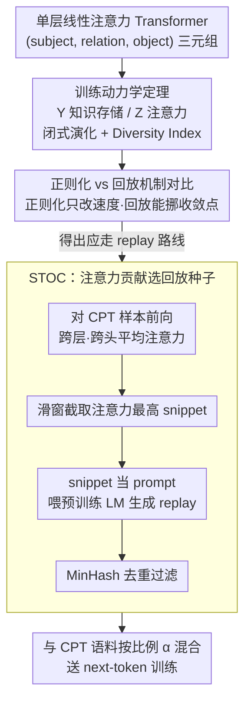

# Towards Understanding Continual Factual Knowledge Acquisition of Language Models: From Theory to Algorithm

**会议**: ICML 2026  
**arXiv**: [2605.10640](https://arxiv.org/abs/2605.10640)  
**代码**: https://github.com/WhyDwelledOnAi/continual_Factual_Knowledge_Acquision (有)  
**领域**: 持续预训练 / 语言模型理论 / 灾难性遗忘  
**关键词**: 持续预训练、灾难性遗忘、Transformer 训练动力学、数据回放、注意力归因

## 一句话总结
作者在简化单层线性注意力 Transformer 上推出闭式训练动力学，证明正则化方法只能改变收敛速度而无法挪动收敛点（因此在 cFKA 场景几乎注定失效），数据回放则能直接改变收敛点并加大震荡幅度从而稳住旧知识，进而提出按 token 注意力贡献裁切片段、引导预训练模型生成回放语料的 STOC，在合成 + KnowEdit + IndustryCorpus 法律语料上一致比 LAMOL 更能压制遗忘。

## 研究背景与动机

**领域现状**：LLM 在开放域预训练 (PT) 中已经积累了海量事实知识，但工业落地常常需要持续预训练 (CPT) 注入领域知识（如法律语料）或新事实。CPT 与传统持续学习一样会遭遇 catastrophic forgetting：旧知识在新数据的冲刷下被覆盖。

**现有痛点**：现有 CPT 缓解方案主要分两类——基于正则化 (EWC 等) 与基于数据回放 (replay / LAMOL)。在 LLM 上实验普遍发现正则化效果有限、回放即使比例很小也能显著缓解遗忘，但社区缺少一套统一的理论解释为什么——所以做工程时只能靠玄学调比例。

**核心矛盾**：连续 Factual Knowledge Acquisition (cFKA) 本质是"在共享 next-token-prediction 目标下，把同一 token 的输出分布往新事实那侧拉，又不能让旧事实那侧的概率塌掉"，但学习率、token 频率、注意力分配的相对大小到底如何决定遗忘与否，缺乏一个 transformer-specific 的动力学描述。

**本文目标**：（a）给 cFKA 写一个可解析的训练动力学框架，刻画 $\mathbf{Y}$（类 FFN 知识存储）和 $\mathbf{Z}$（注意力）参数的演化；（b）用这套理论解释正则化为何失败、replay 为何起效；（c）从分析中导出一个 transformer 原生的、基于 token-level attention 的生成式 replay 方法 STOC，并在合成 + 真实场景上验证。

**切入角度**：参考 Allen-Zhu & Li 的"Physics of Language Models"系列，把事实表示成 (subject, relation, object) 三元组并喂给单层线性注意力 Transformer，再假设 $\eta_Y \gg \eta_Z$ 把 $\mathbf{Z}$ 视为缓变，从而把多体非线性优化简化成可控的 Taylor 展开。

**核心 idea**：与其修补已有 CPT 算法，不如先从 transformer 训练动力学出发证明正则化是"动不了收敛点"的方法，而 replay 是"既能挪点又能放大震荡保旧"的方法；再用 token 注意力归因来挑选回放原料 → 让生成式 replay 真的产出包含旧知识的样本。

## 方法详解

### 整体框架
分析体系：把模型重参数化为 $\mathbf{Y} := \mathbf{E}\mathbf{W}_O\mathbf{W}_V^\top \mathbf{E}^\top$（类 FFN 的知识存储）和 $\mathbf{Z} := \mathbf{E}\mathbf{W}_K\mathbf{W}_Q^\top \mathbf{E}^\top / \sqrt{d}$（注意力），交叉熵优化下用 SGD 推 $\mathbf{Y}$ 的演化定理与 $\mathbf{Z}$ 的守恒量；接着把正则化和 replay 写入梯度方程，对比两者对收敛点、收敛速度、震荡幅度的影响；最后基于"注意力分数高的 token 携带更多事实信息"这个推论，设计 STOC：对每条 CPT 样本做一次前向得到 token-level 注意力分数 → 跨层求均 → 滑窗截取注意力最高的固定长度 snippet → 把它作为 prompt 喂给预训练 LM 生成 replay → MinHash 去重过滤 → 与新数据按比例 $\alpha$ 混合喂给 CPT 流程。整篇沿"先在 PT 阶段验证理论、再在 CPT 阶段分析机制、最后导出算法"的链条推进，下图把这条"理论 → 机制对比 → 算法"的主线画出来。

### 关键设计

**1. 单层 Transformer 的 cFKA 训练动力学定理：把事实存储拆到 token 级**

之前的 transformer 优化理论要么只盯 ICL、要么忽略多 token 的知识结构，没法回答"事实如何被各 token 分摊存储"。作者把模型重参数化为知识存储 $\mathbf{Y}$ 和注意力 $\mathbf{Z}$ 两块，在 $\eta_Y\gg\eta_Z$（把 $\mathbf{Z}$ 视为缓变）的假设下，$\mathbf{Y}$ 对损失凸，其参考最优解就是 Bayes 最优预测 $\mathbf{U}=\sum_{o,s}\frac{1}{a_s}[\ln\Pr(s\mid o)+\frac{1}{L}\ln\Pr(o)]\,\mathbf{x}_o\mathbf{x}_s^\top$。误差演化写成 Taylor 形式

$$\mathbf{e}_s(T)\approx\Big[\prod_{t=1}^T(\mathbf{I}-\eta_Y z_s\delta_s(t)\tilde{\mathbf{H}}(t))\Big]\mathbf{e}_s(0)+\sum_t\eta_Y z_s\delta_s(t)\Big[\prod(\cdot)\Big]\bm{\xi}(t),$$

第一项指数衰减决定收敛速度（由 $\tilde{\mathbf{H}}$ 最大特征值控制），第二项是固定幅度的震荡（由最小正特征值控制）。同时 $\mathbf{Z}$ 满足守恒律 $\frac{d}{dt}[(\tfrac{z_s}{\eta_Z})^2-\sum_o(\tfrac{y_{o,s}}{\eta_Y})^2]=0$，由此推出 token $s$ 的注意力由其 Diversity Index $\mathrm{DI}(\overline{\mathbf{x}}_s)\propto-\sqrt{\eta_Z/\eta_Y}\sqrt[4]{\sum_o[\ln\Pr(s\mid o)+L^{-1}\ln\Pr(o)]^2}+C$ 决定——分布越窄、信息越独占的 token 注意力越高。把动力学拆到 token 级是后续两步的根基：只有看清每个量的演化，才能在 CPT 里精准地只动该动的那一项。

**2. 正则化 / 数据回放的机制对比：证明谁能挪收敛点、谁只能改速度**

社区早就知道"正则化没什么用、replay 哪怕 10% 也好用"，但缺一个解释。作者把两类方法各自代入上面的动力学。对 EWC 风格目标 $\mathcal{L}=\mathcal{L}_{\text{new}}+\frac{k}{2}\sum_i w_i(\theta_i-\theta_i^*)^2$，误差多出一项 $-\sum_t k\eta_Y[\prod(\cdot)]\,\tilde{\mathbf{u}}$，但它被 $\lambda^+_{\min}(\mathrm{diag}(\mathbf{w}_s))=\min_o w_{o,s}$ 卡住——事实知识只由 token 中少数维度承担时，这个最小特征值小到几乎为零，于是收敛点几乎不动，只是速度变慢。对 replay，频率分布变成 $\Pr(\mathbf{x}_s)=\frac{1-\alpha}{|\mathcal{O}_s^{\mathrm{old}}|}\sum_{o\in\mathcal{O}_s^{\mathrm{old}}}\mathbf{x}_o+\frac{\alpha}{|\mathcal{O}_s^{\mathrm{new}}|}\sum_{o\in\mathcal{O}_s^{\mathrm{new}}}\mathbf{x}_o$，第一项直接把旧知识写回收敛点，同时震荡项 $\lambda^+_{\min}(\tilde{\mathbf{H}})$ 在新旧混合后被放大，对旧知识起"提醒"作用。结论很硬：要彻底抑制遗忘必须挪收敛点，正则化做不到，只有 replay 能做到——这就把算法设计逼向了 replay 路线。

**3. STOC：用注意力贡献挑回放种子，让原模型沿熟悉方向回忆**

LAMOL 等用特殊 token 当 prompt 启动生成，没利用 transformer 的注意力结构，生成内容容易跑偏到模型并不真正"会"的地方。STOC 改用动力学给出的信号选种子：对每条 CPT 样本做一次 forward，取所有 layer×head 的注意力分数求均得 token 级重要性 $a_t$；用滑动窗口找连续段内 $\sum_t a_t$ 最高的固定长度 snippet（典型 16–32 token）；把它当 prompt 喂给预训练原模型续写。根据动力学，注意力高的 token 恰是 Diversity Index 低、最能锁定一组旧事实的 token，所以续写大概率覆盖旧知识；再用 MinHash 去重保多样性，最后以比例 $\alpha\in\{0.5,0.67,0.8,0.9\}$ 与 CPT 语料混合。等价于让模型沿自己最熟悉的方向回忆，replay 质量自然比随机 prompt 高，而且只在原 forward 上多采一次 attention、零额外训练成本。

### 损失函数 / 训练策略
基础 CPT 用 cross-entropy $\mathcal{L} = -\mathrm{logit}(x_{T+2}\mid \mathbf{X}) + \log\sum_o \exp(\mathrm{logit}(x_o\mid \mathbf{X}))$。在合成 Biography 实验里假设 $\eta_Y \gg \eta_Z$ 做 SGD；在真实 LLM 实验中用 Pythia-160M / Qwen2.5-0.5B-1.7B，分别尝试全参数、rank-128 LoRA、冻结前 6 层三种更新策略。EWC 用 Fisher Information 估计参数重要性；STOC 与 LAMOL 都把新旧数据按 $\alpha$ 混合后送 next-token loss。

## 实验关键数据

### 主实验
Pythia-160M 在 Biography 合成数据上的对比，"Original" 表示对旧（PT 阶段）知识的保留，"Continual" 表示新（CPT 阶段）的吸收，$\alpha$ 为 CPT 数据混合比；越高越好。

| 配置 ($\alpha$) | Replay | Update | Original sFTA | Original EM | Continual sFTA |
|---|---|---|---|---|---|
| 0.5 | Random | Full | 17.68 | 3.14 | 90.37 |
| 0.5 | LAMOL | Full | 19.90 | 5.95 | 92.58 |
| **0.5** | **STOC** | **Full** | **51.54** | **29.84** | 90.47 |
| 0.67 | Random | Freeze | 21.02 | 6.43 | 91.67 |
| 0.67 | LAMOL | Freeze | 21.69 | 9.47 | 92.62 |
| **0.67** | **STOC** | **Freeze** | **53.80** | **32.83** | 92.04 |
| 0.9 | LAMOL | Freeze | 18.88 | 7.58 | 92.06 |
| **0.9** | **STOC** | **Freeze** | **40.54** | **21.62** | 91.96 |

### 消融实验
KnowEdit (ZSRE / Wiki_Bio / Wiki_Recent) 上 Qwen2.5-0.5B 的平均 soft token accuracy（越高越好）：

| 方法 | ZSRE Orig | ZSRE Cont | Wiki_Bio Orig | Wiki_Bio Cont | Wiki_Recent Orig | Wiki_Recent Cont |
|---|---|---|---|---|---|---|
| Naive | 34.58 | 63.28 | 32.33 | 35.50 | 19.28 | 28.42 |
| LAMOL ($\alpha{=}0.5$) | 37.54 | 58.37 | 31.29 | 34.49 | 20.48 | 27.19 |
| **STOC ($\alpha{=}0.5$)** | **37.12** | **62.26** | **35.57** | 35.46 | **21.40** | **28.75** |
| STOC ($\alpha{=}0.8$) | 37.47 | 62.59 | 35.28 | 33.16 | 20.12 | 27.34 |

法律领域 IndustryCorpus2 1B token 真实 CPT 评测（MMLU / MMLU-Redux-2.0 / SuperGPQA）上，STOC 在 0.6B 和 1.7B 模型上都比 LAMOL 高 1–4 个百分点，在 SuperGPQA 上 Continual 子集从 LAMOL 的 13.35% 提升到 15.85%。

### 关键发现
- 即使 replay 比例只占 10%，模型也能保留显著旧知识——这与理论里"replay 直接改频率分布、挪收敛点"完全吻合。
- 两种 replay 选取策略中，"每个个体保留一条传记"比"一半个体保留两条"效果更好，说明 replay 数据应**广覆盖**而非局部加深。
- STOC 用注意力裁切的 snippet 当 prompt 优于随机 snippet（消融），证实 attention-based 选择是真因果而非启发式偶然。
- 在合成 1-Aug 设定上（每人只生成 1 篇传记），LM 训练集 EM 87% 但测试集仅 8.85%，说明数据增强对泛化的关键作用——同时验证了 Diversity Index 理论：增强让 relation token 的 $\overline{\mathbf{x}}_s$ 更均匀 → 注意力降低 → 模型更依赖 subject token → 跨模板泛化更好。
- LoRA 在低 $\alpha$ 时反而最糟，全参数和冻结前 6 层差异不大，提示对 cFKA 来说参数量限制比"动哪几层"更敏感。

## 亮点与洞察
- "正则化在 LLM 上不灵"这一长期工程经验首次被一个干净的特征值论证解释：$\lambda^+_{\min}(\mathrm{diag}(\mathbf{w}_s))$ 接近零意味着 regularization 项压根挪不动 $\mathbf{y}_s$ 的收敛位置。这种"用动力学解释失败方法"的视角对其他持续学习场景同样适用。
- Diversity Index 把 token 在事实表达中的角色量化到 $\sqrt[4]{\sum_o[\ln\Pr(s\mid o)+L^{-1}\ln\Pr(o)]^2}$ 这种封闭形式上，并且与多层 LM 实测注意力强相关（Pearson $<-0.8$），值得迁移到 attention probing / interpretability 研究。
- STOC 是个"零额外训练成本"的工程组件——只在原 forward 上多采集一次 attention，就能给现有 CPT pipeline 加上一个高质量 replay 来源；和 freezing / LoRA 都正交，可组合。

## 局限与展望
- 理论建立在单层线性注意力 + structured-input 假设上，softmax / 多头 / 多层 / 多 stage 训练只是经验上得到呼应，没有形式化扩展。
- 事实只用 (subject, relation, object) 三元组建模，对常识、链式推理、长上下文等知识形式覆盖有限。
- STOC 选片段时只在 sequence 维度滑窗、跨层取均值，没探索 layer-specific 或 head-specific 的选择策略——可能存在更精的 attention 归因方法。
- 真实场景实验最大模型只到 Qwen2.5-1.7B，对 10B+ 规模能否扩展、replay 比例与 model size 的标度律仍是开放问题。

## 相关工作与启发
- **vs LAMOL (Sun 2020)**：同样是生成式 replay，但 LAMOL 用 special token 作 prompt 让 LM 自由生成；STOC 用注意力归因找出真正"知识密度高"的 snippet，生成内容更贴近旧分布。
- **vs EWC (Kirkpatrick 2017)**：经典正则化方法；本文从特征值角度证明在 cFKA 下它注定只能"减速遗忘"而不能"抑制遗忘"。
- **vs Allen-Zhu & Li "Physics of LM" 系列**：本文沿用同一类合成 Biography 任务和 hFTA/sFTA/EM 指标体系，但首次把训练动力学推到 CPT 阶段并据此设计新算法。

## 评分
- 新颖性: ⭐⭐⭐⭐ 既给出针对 cFKA 的封闭形式动力学，又据此设计了 attention-based replay，理论 → 算法的链条很完整。
- 实验充分度: ⭐⭐⭐⭐ 合成 + KnowEdit + IndustryCorpus 真实法律语料 + Pythia/Qwen 多规模 + 三种参数更新策略，覆盖到位但最大规模偏小。
- 写作质量: ⭐⭐⭐⭐ 理论部分推导清晰，图 1 的"PT validate → CPT analyze → algorithm propose"路线图让长篇论文易读。
- 价值: ⭐⭐⭐⭐ 对工业 CPT 团队是直接可用的工具（STOC 可即插即用），同时给出"为什么 EWC 没用"的可引用论证，理论 / 工程双价值。

<!-- RELATED:START -->

## 相关论文

- [\[NeurIPS 2025\] The Trilemma of Truth in Large Language Models](../../NeurIPS2025/optimization/the_trilemma_of_truth_in_large_language_models.md)
- [\[ICML 2026\] Adaptive Sharpness-Aware Minimization with a Polyak-type Step size: A Theory-Grounded Scheduler](adaptive_sharpness-aware_minimization_with_a_polyak-type_step_size_a_theory-grou.md)
- [\[NeurIPS 2025\] Doubly Robust Alignment for Large Language Models](../../NeurIPS2025/optimization/doubly_robust_alignment_for_large_language_models.md)
- [\[ICCV 2025\] Federated Continual Instruction Tuning](../../ICCV2025/optimization/federated_continual_instruction_tuning.md)
- [\[ICML 2026\] Towards Understanding Adam Convergence on Highly Degenerate Polynomials](towards_understanding_adam_convergence_on_highly_degenerate_polynomials.md)

<!-- RELATED:END -->
