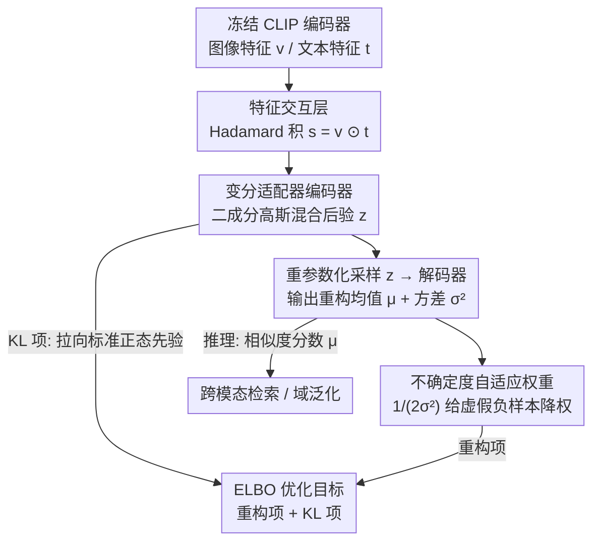

# 变分适配器跨模态相似度表示

**会议**: ICML 2026  
**arXiv**: [2605.30968](https://arxiv.org/abs/2605.30968)  
**代码**: 待确认  
**领域**: 多模态 VLM  
**关键词**: 跨模态检索, 变分自编码器, 二元标注问题, 虚假负样本, CLIP 微调

## 一句话总结
通过变分推理框架学习连续的跨模态相似度分布——用自适应不确定度权重缓解二元标注导致的虚假负样本问题，显著提升 VLM 在跨模态检索和域泛化任务中的性能。

## 研究背景与动机

**领域现状**：CLIP 等 VLM 在统一表示空间中对齐图像和文本，已广泛应用于零样本分类、跨模态检索和开放词汇检测。然而现有方法在微调阶段往往面临数据标注的局限。

**现有痛点**：MS-COCO 等多模态数据集通常采用二元稀疏标注（"匹配"或"不匹配"），将连续相似度空间强行分割为两类，导致模型无法捕捉样本间的细粒度语义关系。特别是在样本有限的微调场景中严重损害模型泛化性能。

**核心矛盾**：图像-文本对间的匹配关系本质上是连续且复杂的（蒙娜丽莎与"神秘微笑"的匹配既涉及对象层面又涉及主观感知）。二元标注的粗糙性导致虚假负样本（语义相关但被标为不匹配）大量产生，破坏表示空间的语义一致性。

**本文目标**：在保持 CLIP 基础模型不变的前提下，通过微调适配器显式在隐空间中建模跨模态相似度的连续分布，使模型能够为虚假负样本分配更高的不确定度。

**核心 idea**：用 VAE 框架将二元监督学习问题转化为隐变量生成模型，自然引入基于不确定度的自适应样本权重，实现"根据标注置信度调节学习强度"。

## 方法详解

### 整体框架
VACSR 由三关键模块组成——（1）**特征交互层**：使用 Hadamard 积将编码器输出图像特征 $\bm{v}_i$ 和文本特征 $\bm{t}_j$ 融合为相似度向量 $\bm{s}_{i,j} = \bm{v}_i \odot \bm{t}_j$；（2）**变分适配器**：通过编码器网络将相似度向量映射到二成分高斯混合分布的隐空间 $\mathbf{z}_{i,j}$；（3）**解码器网络**：从隐变量重构相似度分数并输出不确定度 $\sigma^2(\mathbf{z}_{i,j})$。CLIP 主干全程冻结，只训练这三块轻量适配器，训练目标是 ELBO（重构项 + KL 项）。

### 关键设计

**1. 二成分高斯混合后验：让隐空间同时容纳"匹配"和"非匹配"两种语义**

单峰高斯没法同时刻画"匹配"和"非匹配"两种差异很大的语义分布，表达力受限。VACSR 把后验近似为两成分混合

$$p_\phi(\mathbf{z}_{i,j}\mid\bm{s}_{i,j})=\sum_{k=1}^{2}\alpha_k\,\mathcal{N}(\mathbf{z}_{i,j}\mid\mu_k,\sigma_k^2),$$

其中混合权重 $\alpha_1,\alpha_2$ 可学，编码器据输入自动选择合适分量。混合分布的 KL 项不可直接闭式，作者用 Jensen 不等式取可计算上界 $\text{KL}[\sum_k\alpha_k p_k\,\|\,q]\le\sum_k\alpha_k\text{KL}[p_k\,\|\,q]$，让训练目标仍可优化。

**2. 不确定度自适应权重：用学到的方差给虚假负样本自动降权**

二元标注会把语义相关却被标"不匹配"的虚假负样本硬塞进负类，破坏表示一致性，而传统对比损失只能靠手调温度 $\tau$ 去平衡。VACSR 让模型同时学均值 $\mu(\mathbf{z}_{i,j})$ 和方差 $\sigma^2(\mathbf{z}_{i,j})$，重构损失为

$$\mathcal{L}_{\text{recon}}=\frac{1}{2\sigma^2}\|\hat y-\mu\|^2+\log\sigma+\frac{1}{2}\log 2\pi.$$

从极限行为看：$\sigma^2\to 0$ 时模型完全遵从二元标注，$\sigma^2\to\infty$ 时标注信号被噪声淹没。于是虚假负样本会被分到高不确定度（前面 $1/(2\sigma^2)$ 权重小、学习弱），确定的正样本和困难样本被分到低不确定度（权重大、学习强）。把不确定度理解成"标注质量的度量"而非"语义模糊性"，模型就能动态适应标注噪声，省掉手工调温度。

**3. ELBO 优化目标：用重构 + KL 把不确定度加权和隐空间正则一起拿下**

需要一个目标同时最大化数据拟合并约束隐空间，避免模型用方差"作弊"。VACSR 套标准 VAE 的 ELBO

$$\text{ELBO}=\mathbb{E}_{p_\phi}[\log q_\theta(\hat y\mid\mathbf{z})]-\text{KL}[p_\phi\,\|\,q],$$

重构项采用高斯似然（等价 MSE），自然给出上面那套不确定度加权、无需额外设计；KL 项把隐表示拉向标准正态先验，防止模型一味放大隐空间方差来逃避拟合。两项合起来，让"按标注置信度调节学习强度"成为目标内生的行为而不是外挂规则。

## 实验关键数据

### 主实验（COCO 数据集，1K 和 5K 测试集）

| 模型 | 1K R@1(I→T) | 1K R@1(T→I) | 5K R@1(I→T) | 5K R@1(T→I) | 改进 |
|------|-------------|-------------|-------------|-------------|------|
| PCME++ (ViT-B/32) | 81.6 | 69.2 | 62.1 | 48.1 | baseline |
| **VACSR (ViT-B/32)** | **84.2** | **70.3** | **66.5** | **49.8** | +3.2%, +1.6% |
| PCME++ (ViT-B/16) | 85.3 | 73.4 | 68.7 | 53.4 | baseline |
| **VACSR (ViT-B/16)** | **87.4** | **74.3** | **71.6** | **54.5** | +2.5%, +1.6% |

### 噪声鲁棒性（COCO 20% 噪声标注）

| 方法 | 1K R@1 | 5K R@1 | RSUM | 对 PCME++ 的改进 |
|------|---------|---------|-------|----------------|
| PCME++ | 71.6 | 50.4 | 524.6 | baseline |
| **VACSR** | **76.4** | **57.1** | **539.0** | +4.8% (R@1), +13.2% (RSUM) |

### 关键发现
- 干净标注下 VACSR 相比 PCME++ 平均提升 2-3%。
- 20% 噪声注入场景中优势更明显（提升达 5%+），说明自适应不确定度确实有效缓解标注噪声。
- 跨数据集（EC/CxC）测试验证泛化性能。

## 亮点与洞察
- **理论深度**：通过梯度分析严格证明二元标注对对比损失和 sigmoid 损失的具体危害，量化"梯度相对惩罚"$r_i$。
- **优雅的不确定度设计**：将不确定度理解为"标注质量的度量"而非"语义模糊性"，这一视角转变使模型能更合理处理虚假负样本。
- **轻量级适配器**：仅在 CLIP 冻结特征之上添加两个 MLP，参数量和计算开销极低。

## 局限与展望
- Hadamard 积选择未系统比较不同特征交互方式（双线性池化、外积等）。
- 混合分量数固定（二成分），可能限制对高度复杂标注模式的建模。
- 标注纠正限制——若虚假负样本过度集中仍可能导致学习偏差。
- 改进：动态分量数；其他灵活后验形式；结合主动学习或手工数据清洗。

## 相关工作与启发
- **vs 概率嵌入方法（PCME/PCME++）**：PCME 将不确定度归因于样本语义模糊；VACSR 归因于标注噪声，更符合实际数据标注场景。
- **vs 对比学习温度调参**：传统方法需精心调整温度系数；VACSR 通过自学习方差参数实现自适应。

## 评分
- 新颖性: ⭐⭐⭐⭐  将二元标注问题重新建模为变分推理新颖；VAE 在表示学习中应用已有先例创新中等。
- 实验充分度: ⭐⭐⭐⭐⭐  COCO/EC/CxC + 1K/5K + 噪声鲁棒性 + 域泛化。
- 写作质量: ⭐⭐⭐⭐  逻辑清晰，理论推导严谨。
- 价值: ⭐⭐⭐⭐⭐  解决 CLIP 微调中的实际问题，方法轻量可集成。

<!-- RELATED:START -->

## 相关论文

- [\[ICML 2026\] URS：统一的神经路由求解器](urs_a_unified_neural_routing_solver_for_cross-problem_zero-shot_generalization.md)
- [\[ICML 2026\] Accelerated Multiple Wasserstein Gradient Flows for Multi-objective Distributional Optimization](accelerated_multiple_wasserstein_gradient_flows_for_multi-objective_distribution.md)
- [\[ICML 2026\] Adaptive Estimation and Inference in Semi-parametric Heterogeneous Clustered Multitask Learning via Neyman Orthogonality](adaptive_estimation_and_inference_in_semi-parametric_heterogeneous_clustered_mul.md)
- [\[ICML 2026\] On the Convergence Rate of LoRA Gradient Descent](on_the_convergence_rate_of_lora_gradient_descent.md)
- [\[ICML 2026\] Test time training enhances in-context learning of nonlinear functions](test_time_training_enhances_in-context_learning_of_nonlinear_functions.md)

<!-- RELATED:END -->
