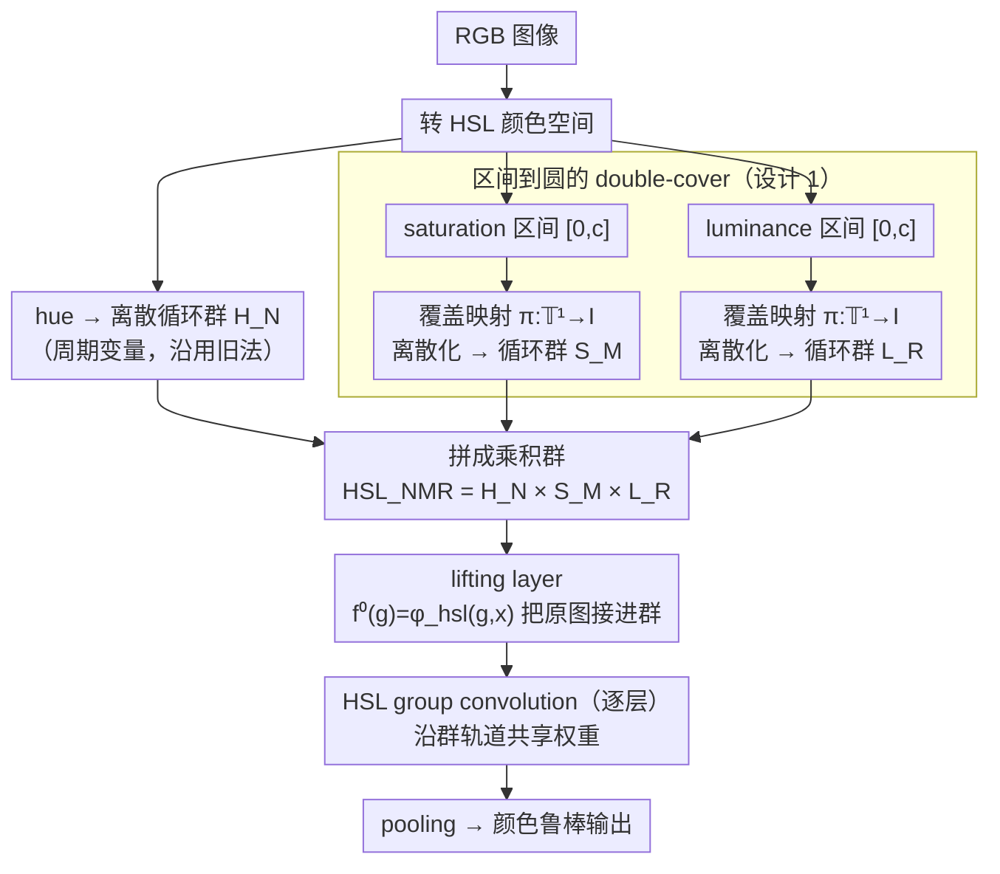

# A Hypertoroidal Covering for Perfect Color Equivariance

**会议**: ICML2026  
**arXiv**: [2603.04256](https://arxiv.org/abs/2603.04256)  
**代码**: 论文未提供代码  
**领域**: 计算机视觉 / 颜色等变 / 鲁棒分类  
**关键词**: 颜色等变、群卷积、拓扑覆盖、HSL 颜色空间、分布外泛化  

## 一句话总结
这篇论文用双覆盖把 HSL 中本来是区间值的饱和度和亮度提升到圆群上，构造 $\mathbb{T}^3$CEN，使网络对 hue、saturation、luminance shift 都能实现精确颜色等变，并在颜色偏移和医学图像等任务上提升鲁棒性。

## 研究背景与动机
**领域现状**：卷积网络天然对平移等变，但对颜色变化没有结构性保证。普通数据增强可以扩大训练分布，颜色不变网络可以消除颜色影响，颜色等变网络则希望在保留颜色信息的同时，让特征随颜色变换以可预测方式变化。

**现有痛点**：已有颜色等变方法能较好处理 hue，因为 hue 本来接近周期变量，可以用循环群建模；但 saturation 和 luminance 是有界区间。把它们强行当作一维平移群，会遇到边界裁剪和 zero padding，导致表示中出现伪影，等变性只能近似成立。

**核心矛盾**：颜色变化既可能是干扰，也可能是有用信息。完全不变会丢掉 fine-grained classification 中的重要颜色线索；近似等变又会在区间边界产生结构错误。需要一个既保留颜色信息、又能对有界通道实现严格群结构的表示方式。

**本文目标**：作者希望为 HSL 三个通道都定义可用于 group convolution 的群动作，使网络对 hue、saturation、luminance shift 全部精确等变，并验证这种结构能提升 OOD color shift、Camelyon17 颜色不平衡和多种自然图像数据集上的泛化。

**切入角度**：拓扑覆盖可以把一个不具备群结构的区间提升到具有周期结构的圆上。饱和度和亮度虽然是 $[0,c]$ 上的值，但可以通过 double-cover map 映射到 $\mathbb{T}^1$，再用循环群做卷积。

**核心 idea**：不要在 saturation/luminance 的区间边界做裁剪平移，而是先把区间双覆盖到圆，再在 $H\times S\times L$ 的 hypertorus 上做群提升和群卷积。

## 方法详解

### 整体框架
$\mathbb{T}^3$CEN 是一个颜色等变卷积架构，目标是让网络对 HSL 三个通道的颜色变换都精确等变，而不止 hue。它继承 HSL 的直观分解——hue 控色相、saturation 控纯度、luminance 控亮度——但关键改动在于：不再把有界的 saturation/luminance 当作实线平移群，而是各自提升成离散圆群，从而绕开区间裁剪。整条 pipeline 是：RGB 图像先转 HSL；hue 沿用离散循环群 $H_N$，saturation 和 luminance 先经 double-cover 把区间值提升到圆 $\mathbb{T}^1$、再离散化成循环群 $S_M$ 与 $L_R$，三者拼成乘积群 $HSL_{NMR}=H_N\times S_M\times L_R$；lifting layer 把原图映射成定义在该群上的特征 $f^0(g)=\varphi_{hsl}(g,x)$，之后各层全部走 HSL group convolution；分类任务最后用合适的 pooling 得到对颜色变化鲁棒的输出。

### 关键设计

**1. 区间到圆的 double-cover：给有界颜色通道补上群结构**

saturation 和 luminance 是 $[0,c]$ 上的有界区间，hue 那种循环群套不进来——旧方法只能把它们当一维平移再做裁剪和 zero padding，结果边界处信息被切掉、等变只能近似成立。作者的做法是为区间 $I=[0,c]$ 构造一个覆盖映射 $\pi:\mathbb{T}^1\rightarrow I$，把区间值搬到一个圆上，例如 saturation 中心化后用类似 $\pi(\theta)=c\sin\theta/2$ 的形式；离散化之后，群运算就退化成角度相加再 modulo $2\pi$。圆上没有"端点"，循环移位永远落回圆内，于是 group action 能严格对应特征的循环置换，等变性从近似变成精确——这正是后面等变误差掉到 $10^{-6}$ 量级的根源。

**2. HSL 乘积群上的 lifting layer：把原图接进群卷积**

group convolution 要求输入是定义在群上的函数，而原始图像不是，所以需要一层桥梁先把图像"提升"到群上。lifting layer 对每个群元素 $g_{ijk}$ 施加对应的 HSL 颜色变换，得到 $f^0(g_{ijk})=\varphi_{hsl}(g_{ijk},x)$，即沿 H/S/L 三条群轴枚举颜色变换后的响应。它的好处直接体现在等变上：当输入图像发生一次颜色 shift，提升后的表示并不会乱变，而只是沿对应群轴循环平移一格——第一层的等变性就此被锁定。

**3. HSL group convolution 与等变特征：把颜色对称性写进每一层**

提升之后，每一层都用群卷积 $[f*\psi](a)=\sum_{r\in HSL}\sum_k f_k(r)\psi_k(r^{-1}a)$ 取代普通卷积。卷积核沿整条群轨道共享权重，因此输入颜色一旦变化，输出特征会以同构方式整体跟着变，而不是被网络近似学出来。相比单纯 augmentation 靠扩训练分布去"碰运气"，这里把颜色不变/等变的归纳偏置直接写进了网络结构；相比颜色不变网络一上来就抹掉颜色，它一路保留颜色通道信息，直到任务头才决定要不要 pool 成不变表示——这也是它能在"颜色是有用线索"的任务上不吃亏的原因。

### 损失函数 / 训练策略
论文没有提出新的监督损失，改动集中在网络结构本身；分类和分割任务仍用标准任务损失训练。公平比较时作者把参数量大致固定，因此增大 HSL lifting cardinality 时会相应减少 filter depth。这带来一个容量-等变性的 trade-off：群阶数越大覆盖越细，但每层通道数被挤掉，过大反而掉点——后面消融里 order 4 通常优于更大阶数，正是这个权衡的体现。

## 实验关键数据

### 主实验
实验分成两类：第一类直接测等变误差和 lifting 误差，验证结构是否真正解决 saturation/luminance 边界伪影；第二类测 OOD color shift 下的分类/医学图像泛化。

| 数据集 / 任务 | 指标 | $\mathbb{T}^3$CEN | 主要对比 | 结论 |
|---------------|------|------------------|----------|------|
| 3D Shapes saturation equivariance | 平均等变误差 | $4.66\times 10^{-6}$ | LCER 0.445 | 双覆盖几乎消除 saturation 等变误差 |
| Lifting error | 8-bit RGB 平均误差 | $6.33\times 10^{-6}$ | LCER 8.65 | 往返 shift 后几乎无重构伪影 |
| 3D Shapes saturation shift | A/B, A/C error | 0.00, 0.00 | ResNet 41.40, 42.20；LCER-S3 0.00, 0.04 | 对 saturation shift 达到更稳泛化 |
| small NORB luminance shift | low lighting error | 11.09 到 14.42 | ResNet18 37.70；LCER-L3 34.83 | 对亮度变化显著更鲁棒 |
| HSL-shift 3D Shapes | error | 0.00 | LCER-H4S3 9.76；ResNet44 55.40 | 三通道联合等变优势明显 |
| Camelyon17 | error | S4: 12.11 | ResNet50 28.91；LCER-S3 16.08 | 在颜色不平衡的医学图像上更好 |

### 消融实验
论文的分析重点是 lifting cardinality、颜色是否为标签信号、以及是否存在 train-test color shift。

| 配置 / 场景 | 关键指标 | 说明 |
|-------------|----------|------|
| 增大 hue cardinality 到 20 | hue-shift MNIST error 9.19 | 群阶过大时固定参数预算下通道数下降，容量损失压过等变收益 |
| 最佳 cardinality 约为 4 | hue-shift MNIST error 1.96 | 覆盖熵密度最高的阶数往往对应最好性能 |
| color 是标签信号 | KUTomaData error 31.75 vs ResNet18 19.13 | 番茄成熟度依赖绝对颜色，颜色不变 pooling 会伤害任务 |
| 无 train-test color shift | hue shift 0° 时 94.18 vs ResNet44 98.38 | 没有颜色分布偏移时，等变约束主要体现为容量成本 |
| shift 增大到 15° | 97.75 vs ResNet44 97.06 | 当颜色偏移足够大，结构化等变开始超过普通 CNN |

### 关键发现
- saturation/luminance 的主要问题不是“缺少数据增强”，而是区间边界没有群结构；double-cover 从拓扑上解决了这个问题。
- 颜色等变不是无条件更好。它最适合颜色变化是 nuisance 且 train-test color distribution 会变的场景；如果颜色本身就是类别证据，则 invariant pooling 会丢信息。
- 固定参数预算下，群阶数不能盲目增大。论文用覆盖熵密度解释了为什么 order 4 往往比更大阶数更合适。

## 亮点与洞察
- 这篇论文的核心洞察很干净：saturation/luminance 的失败来自“把区间当平移群”的建模错误，而不是简单的网络容量不足。用拓扑覆盖重建群结构，比在损失或增强上打补丁更根本。
- 它保留了颜色信息的可解释结构。lifted feature map 沿 H/S/L 群轴的循环置换可以直接对应输入颜色 shift，这比普通 augmentation 学到的鲁棒性更容易分析。
- 限制条件写得比较诚实。作者明确指出 color-as-signal 和 no-shift 两种失败模式，这对判断是否该在真实任务中使用颜色等变网络很有帮助。

## 局限与展望
- 群卷积带来计算开销，filter orbit 越大成本越高；固定参数时还要减少通道数，可能损失表达能力。
- 对分类任务使用 invariant pooling 会让模型弱化绝对颜色。如果任务标签本身依赖颜色，例如成熟度、材质或病理染色强度，必须谨慎选择 pooling 或保留颜色条件分支。
- 实验虽覆盖多个图像数据集和 Camelyon17，但还缺少大型现代 backbone、真实部署色彩校准误差、以及分割/检测等 dense prediction 场景的系统验证。
- double-cover 会产生冗余表示，尤其某些输入值会映射到重复 lifted values。如何用更高效的离散化或可学习采样减少冗余，是后续值得做的方向。

## 相关工作与启发
- **vs LCER / HSL translation lifting**: LCER 用平移和 zero padding 处理 saturation/luminance，因此边界处只能近似等变；本文用循环群替换区间平移，等变误差下降到数值误差级别。
- **vs CEConv / hue-equivariant CNN**: hue-only 等变适合色相变化，但不能处理亮度和饱和度偏移；$\mathbb{T}^3$CEN 把 HSL 三个通道统一到乘积群上。
- **vs 数据增强方法**: AugMix、DeepAugment、颜色 jitter 依赖训练覆盖，不能保证结构等变；本文把 inductive bias 写入架构，在分布偏移较大时更稳定。
- **对其他任务的启发**: double-cover 不限于颜色。论文还展示了 RGB shift 和 scale equivariance 的构造思路，说明“区间变量先覆盖成圆再做群卷积”可能是一类通用工具。

## 评分
- 新颖性: ⭐⭐⭐⭐⭐ 用拓扑覆盖解决区间颜色通道的精确等变，想法非常集中且有辨识度。
- 实验充分度: ⭐⭐⭐⭐☆ 等变误差、OOD shift、Camelyon17、多数据集和失败模式都有覆盖，但现代大模型实验不足。
- 写作质量: ⭐⭐⭐⭐☆ 动机和限制讲得清楚，数学定义完整；部分背景章节编号有些重复，读起来略绕。
- 价值: ⭐⭐⭐⭐☆ 对颜色分布偏移明显的视觉任务很有价值，也给 interval-valued symmetry 建模提供了可迁移范式。

<!-- RELATED:START -->

## 相关论文

- [\[CVPR 2026\] Tunable Soft Equivariance with Guarantees](../../CVPR2026/others/tunable_soft_equivariance_with_guarantees.md)
- [\[CVPR 2025\] Integral Fast Fourier Color Constancy](../../CVPR2025/others/integral_fast_fourier_color_constancy.md)
- [\[NeurIPS 2025\] Equivariance by Contrast: Identifiable Equivariant Embeddings from Unlabeled Finite Group Actions](../../NeurIPS2025/others/equivariance_by_contrast_identifiable_equivariant_embeddings_from_unlabeled_fini.md)
- [\[ECCV 2024\] Real-Data-Driven 2000 FPS Color Video from Mosaicked Chromatic Spikes](../../ECCV2024/others/real-data-driven_2000_fps_color_video_from_mosaicked_chromatic_spikes.md)
- [\[ICML 2026\] Beyond Model Readiness: Institutional Readiness for AI Deployment in Public Systems](beyond_model_readiness_institutional_readiness_for_ai_deployment_in_public_syste.md)

<!-- RELATED:END -->
