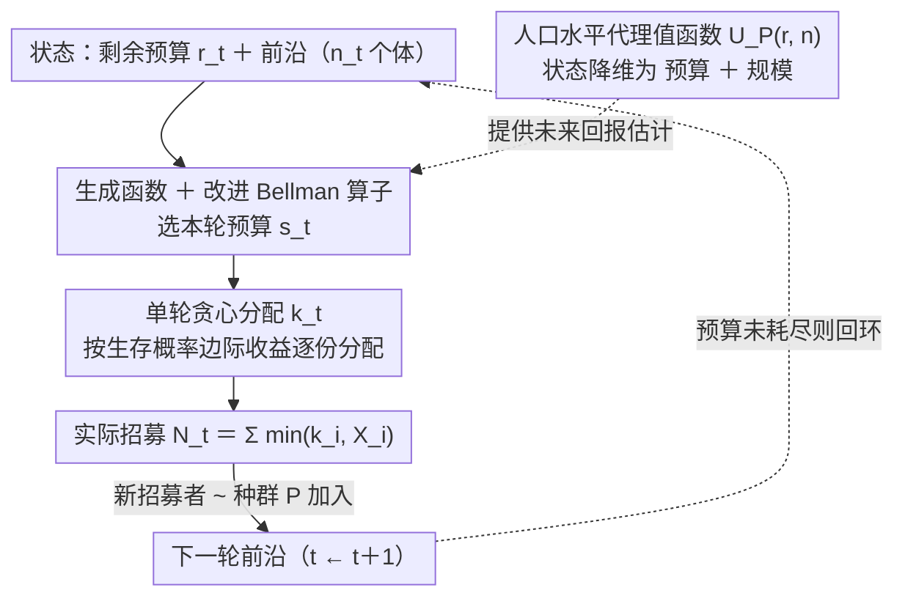

# Adaptive Multi-Round Allocation with Stochastic Arrivals

**会议**: ICML 2026  
**arXiv**: [2605.12111](https://arxiv.org/abs/2605.12111)  
**代码**: 可公开获取  
**领域**: 顺序决策 / 预算约束优化 / 随机控制  
**关键词**: 自适应招募, 多轮分配, 随机到达, 动态规划, 人口代理值函数

## 一句话总结
本文形式化网络招募为预算约束的顺序控制问题，证明单轮最优分配是贪心的；通过人口水平代理值函数将多轮规划降维到 $O(b^5\log b)$ 复杂度，并给出在模型误差下分解为前沿/人口/逼近三类误差的鲁棒性保证。

## 研究背景与动机

**领域现状**
自适应网络招募广泛应用于公共卫生（HIV 95-95-95、接触追踪、调查采样）、流行病学和社会科学。在资源稀缺下，如何把有限激励（推荐券、测试工具）分配出去以最大化参与覆盖与早期招募是核心问题。

**现有痛点**
1. **内生性动态**：与随机背包或 bandit 不同，本问题中分配既消耗预算获得即时奖励，又通过新人招募改变未来决策机会的分布，形成复杂状态演化。
2. **高维不可处理**：个体特征高维（人口学、网络位置等），精确值函数必须跟踪整个前沿分布，计算不可行。
3. **最优规划困难**：即使分布完全已知，Bellman 递推也涉及无限维连续状态空间，传统 DP 无法直接套用。

**核心矛盾**
想根据个体特征做精细自适应分配，又要在有限计算预算内求解最优策略——精确规划与可扩展之间的权衡。

**本文目标**
设计可计算策略，在多轮预算约束下最大化招募，并对模型误差鲁棒。

**切入角度**
从单轮组合结构入手：对固定轮预算，通过生存概率边际分解推出贪心最优性；分离"轮内分配"与"轮间预算"两个子问题。多轮再引入人口水平代理值函数，把个体异质性折叠为群体统计。

**核心 idea**
单轮最优（贪心）+ 人口代理值函数（状态降维）→ 精确但可计算的多轮 DP。通过概率生成函数精确计算代理 Bellman 方程，复杂度 $O(b^5\log b)$；鲁棒性误差分解为前沿级、人口级和逼近三项。

## 方法详解

### 整体框架
时刻 $t\geq 1$ 系统处于状态 $(r_t,\mathcal D_{1:n_t}^{(t)})$（剩余预算 $r_t$，前沿 $n_t$ 个个体的到达分布）。策略 $\pi$ 每轮选择：(i) 轮预算 $s_t\in\{0,\ldots,r_t\}$，(ii) 分配向量 $\mathbf k_t=(k_1,\ldots,k_{n_t})$，$\sum_i k_i\leq s_t$。个体 $i$ 受其到达容量 $X_i\sim\mathcal D_i$ 限制，实际招募 $\min\{k_i,X_i\}$；新招募个体进入下一轮前沿，分布从种群 $\mathcal P$ 抽样。目标 $\max_\pi\mathbb E[\sum_{t\geq 1}\gamma^{t-1}N_t]$。整篇方法沿三条主线展开：单轮怎么分（贪心轮内分配）、多轮状态怎么压（人口水平代理值函数）、代理递推怎么精确算并插回原问题（生成函数 + 改进 Bellman 算子）。

### 关键设计

**1. 单轮最优贪心分配：把随机约束的轮内问题化成离散凹优化**

对固定轮预算与前沿，本来要在组合空间里搜最优分配。作者用生存概率边际分解把它拆开：$\mathbb E[\sum_i\min\{k_i,X_i\}]=\sum_i\sum_{\ell=1}^{k_i}p_i(\ell)$，目标被写成一堆生存概率之和——离散凹、边际递减。于是贪心就最优：按每单位的最高边际收益排序逐份分配（定理 4.2 证明最优性）。这一步利用离散凹结构彻底避开了组合爆炸，而且边际分解只需生存概率即可计算，直观又便宜。

**2. 人口水平代理值函数：把高维个体状态降维成一维人口统计**

多轮规划的精确值函数 $V_{\mathcal P}(r,\mathcal D_{1:n})$ 必须跟踪整个前沿分布，状态空间无限维、DP 算不动。关键观察是：未来新个体 ex ante 不可区分——都来自同一种群分布 $\mathcal P$，一致对待才是最优的。据此定义代理值函数 $U_{\mathcal P}(r,n)$ 为剩余预算 $r$、规模 $n$（个体 i.i.d. 来自 $\mathcal P$）下的最优期望招募，把状态从"整个前沿"压成"预算 + 规模"两维。递推 $U_{\mathcal P}(r,n)=\max_{0\leq s\leq r}\mathbb E[N_s^e+\gamma U_{\mathcal P}(r-s,N_s^e)]$，其中 $N_s^e$ 是均匀分配 $s$ 到 $n$ 个体的期望招募；命题 6.1 由交换性 + 边际递减证明人口模型下均匀分配最优。这个抽象既抓住了规划本质、又扔掉了无关的个体细节。

**3. 生成函数计算 + 改进 Bellman 算子：精确算递推并插回原问题**

代理值函数的递推还得能精确、快速地算出来，且插回原 Bellman 方程时不能破坏轮内最优。作者用人口生存概率 $\bar p(\ell)$ 的截断概率生成函数描述 $N_s^e$ 的分布，借多项式算术避免离散卷积枚举，复杂度做到 $O(b^2)$ 空间、$O(b^5\log b)$ 时间（定理 6.2）。在每个实际前沿 $\mathcal D_{1:n}$ 上用贪心分配 $\mathbf k^{\text{greedy}}$ 得本轮 $N_s^g$，未来期望则用 $U_{\mathcal P}(r-s,N_s^g)$ 替代精确 $V$，形成修改的 Bellman 算子 $\widetilde V_{\mathcal P;U_{\mathcal P}}$。代理插入是 value function approximation 的原则化形式，既保留轮级最优又让多轮可计算。

### 损失函数与训练策略
目标 $\sum_{t\geq 1}\gamma^{t-1} N_t$。多轮误差分解（定理 7.2）：估计噪声下 suboptimality $\leq 2(1+\gamma)r\sum_i\|\mathcal D_i-\hat{\mathcal D}_i\|_{\text{TV}}+c_{r,\gamma}\|\mathcal P-\hat{\mathcal P}\|_{\text{TV}}+c_{r,\gamma}r\mathbb E\|\mathcal D-\bar{\mathcal D}\|_{\text{TV}}$，$c_{r,\gamma}=2\gamma r/(1-\gamma)$。分别对应前沿误差、人口分布误差、代理逼近误差。

## 实验关键数据

### 主实验（ICPSR HIV 社交网络，模拟 RDS）

| 初始前沿 | $\gamma$ | 总预算 $b$ | Const(k=3) | Greedy(α=0.5) | GreedyRem | TAP（本文） |
|---------|----------|----------|-----------|--------------|-----------|--------|
| n=5 | 0.5 | 200 | 32.1 | 35.4 | 36.2 | **39.8** |
| n=5 | 0.7 | 200 | 28.3 | 31.1 | 31.7 | **34.5** |
| n=5 | 0.9 | 200 | 24.1 | 26.8 | 27.3 | **29.1** |
| n=10 | 0.5 | 200 | 58.2 | 62.1 | 63.5 | **68.3** |
| n=10 | 0.7 | 200 | 51.4 | 55.3 | 56.4 | **61.2** |
| n=15 | 0.5 | 200 | 79.5 | 85.3 | 87.1 | **94.2** |
| n=15 | 0.9 | 200 | 42.7 | 46.5 | 47.2 | **51.8** |

Const(k) 固定每人分配 $k$（事后调优），Greedy 类方法用固定/剩余预算比例但无跨轮规划。TAP 融合贪心轮内分配与人口水平多轮规划。

### 模拟 vs 真实网络

| 设置 | 方法 | HIV | Chlamydia | Gonorrhea |
|------|------|-----|-----------|-----------|
| 模拟分布 | TAP | **68.3** | 72.1 | 65.4 |
| 模拟分布 | Const(3) | 58.2 | 63.5 | 58.1 |
| 真实网络 | TAP | **67.5** | 71.2 | 64.8 |
| 真实网络 | Const(3) | 57.1 | 62.8 | 57.3 |

模拟与真实结果接近，验证了 $\mathcal P$ 学习的有效性；个别（Gonorrhea, $\gamma=0.9$）贪心更优，提示模型误差下的鲁棒性仍是真挑战。

### 消融实验

| 组件 | 变更 | 平均招募 | 说明 |
|------|------|---------|------|
| 完整 TAP | - | 68.3 | 基线 |
| 去掉多轮规划 | 固定轮预算 0.5 倍 | 62.1 | 无跨轮优化 |
| 去掉人口代理 | 枚举所有前沿配置 | 68.1 | 计算昂贵无可扩展性 |
| 无贪心轮内 | 随机轮内 + 人口规划 | 55.3 | 轮内最优性关键 |
| 均衡基线 | 所有人同样数量 | 51.2 | 忽视异质性 |

### 关键发现
- **贪心轮内 + 多轮规划均必要**：单独保留任一组件都明显劣于完整 TAP。
- **人口代理几乎无损**：与枚举前沿（68.1）对比，TAP（68.3）甚至略优——代理避免了过拟合到具体配置。
- **真实网络稳健**：模拟 vs 真实差距 < 2 招募，验证模型迁移到真实数据的可行性。
- **某些设置基线更优**：在 Gonorrhea + 高折扣下贪心胜出，揭示模型误差未被完全消除。

## 亮点与洞察
- **贪心单轮最优性的优雅性**：生存概率分解把复杂的随机约束转化为离散凹目标，是对随机背包问题的精致改进。
- **人口代理的创意**：把"新个体 ex ante 同分布"这一建模假设转化为状态降维工具，既有理论支撑又契合实际。
- **误差分解透明**：定理 7.2 清晰拆出三类误差，给从业者明确知道哪类输入的精度最敏感。
- **真实网络验证**：HIV 网络应用说明该框架在公共卫生应用中的现实价值。

## 局限与展望
- **规模性问题**：$O(b^5\log b)$ 在大预算下仍偏高，需进一步逼近或启发式。
- **模型误差挑战**：在某些病种 + 折扣组合下贪心更优，提示模型学习的自适应策略可能更有价值。
- **数据可获得性**：假设可获得到达分布或充分统计量；新发传染病等场景下历史数据可能不足。

## 相关工作与启发
- **vs 随机背包 / Bandit**：经典问题行动集不变；本问题行动空间内生演变，必须考虑跨轮动态。
- **vs 预言不等式**：先知不等式假设候选无相关；本文招募产生相关未来候选，依赖结构更复杂。
- **vs 启发式 RDS 方法**：实务中 RDS 多用固定每轮分配；本文给出自适应多轮规划的理论改进。

## 评分
- 新颖性: ⭐⭐⭐⭐⭐ 贪心单轮 + 人口代理值函数的组合形成新颖的可计算多轮规划框架。
- 实验充分度: ⭐⭐⭐⭐ 真实 HIV 网络 + 两个其他传染病 + 模拟/真实对比 + 多基线 + 充分消融。
- 写作质量: ⭐⭐⭐⭐ 问题形式化清晰，主要算法与定理表述严谨。
- 价值: ⭐⭐⭐⭐ 在自适应网络招募与公共卫生场景有直接价值，理论与实践结合紧密。

<!-- RELATED:START -->

## 相关论文

- [\[ICML 2026\] Envy-Free Allocation of Indivisible Goods via Noisy Queries](envy-free_allocation_of_indivisible_goods_via_noisy_queries.md)
- [\[CVPR 2026\] Cross-View Distillation and Adaptive Masking for Incomplete Multi-View Multi-Label Classification](../../CVPR2026/others/cross-view_distillation_and_adaptive_masking_for_incomplete_multi-view_multi-lab.md)
- [\[AAAI 2026\] Center-Outward q-Dominance: A Sample-Computable Proxy for Strong Stochastic Dominance in Multi-Objective Optimisation](../../AAAI2026/others/center-outward_q-dominance_a_sample-computable_proxy_for_strong_stochastic_domin.md)
- [\[ICML 2026\] Theoretical Analysis of Sparse Optimization with Reparameterization, Weight Decay, and Adaptive Learning Rate](theoretical_analysis_of_sparse_optimization_with_reparameterization_weight_decay.md)
- [\[AAAI 2026\] Online Linear Regression with Paid Stochastic Features](../../AAAI2026/others/online_linear_regression_with_paid_stochastic_features.md)

<!-- RELATED:END -->
