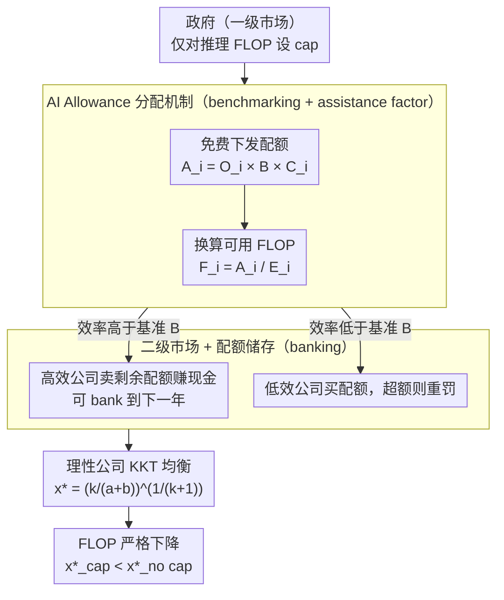

# AI Cap-and-Trade: Efficiency Incentives for Accessibility and Sustainability

**会议**: ICML 2026  
**arXiv**: [2601.19886](https://arxiv.org/abs/2601.19886)  
**代码**: 无（立场+理论分析论文）  
**领域**: AI 治理 / 经济学 / 可持续性  
**关键词**: 排放交易, FLOP 配额, AI 可及性, 能耗激励, KKT 分析

## 一句话总结
作者借鉴碳排放 cap-and-trade，提出针对 AI 推理 FLOP 的配额-交易市场（AI Allowance），用 KKT 条件证明其能在合理参数下严格减少各公司 FLOP 使用，从而同时缓解大模型时代的能耗与小公司被挤出市场两大问题。

## 研究背景与动机

**领域现状**：大模型走超大规模路径——更大模型、更多数据、更多 GPU。OpenAI 一天处理 ~25 亿次 query，单年推理就消耗约 1 ronnaFLOP ($10^{27}$ FLOPs)，需要约 12 万块 H100；同时单条 ChatGPT/Gemini 查询用 0.24–0.34 Wh，OpenAI 每天 ~85 万 kWh、~350 吨 CO₂，远超 EPA "major polluter" 阈值 (100 吨/年)。

**现有痛点**：(1) 学术界 / 小公司被 GPU 成本挤出竞争，70% AI PhD 流向工业界；(2) 数据中心能耗预计到 2030 年翻倍至 1000 TWh，水耗到 1200 亿升；(3) 现有 AI 治理（EU AI Act、加州 SB-1047）以合规和安全为主，几乎没有市场化的"效率激励"机制。

**核心矛盾**：当下 AI 行业天然倾向"hyper-scaling > efficiency"——只要算力买得起，没有任何外部成本让你必须节能。能耗负外部性没被定价。

**本文目标**：设计一种市场化机制，让效率内生地产生经济价值，并把"用更少 FLOP 完成同等推理"变成可交易的资产，同时拒绝沿用 Pigouvian 税（"AI leakage" 风险）和直接禁令（伤害创新）这两条粗暴路径。

**切入角度**：把 carbon cap-and-trade（EU ETS、加州、中国、韩国）的成熟机制照搬到 AI——核心单元从"碳排放"换成"AI Allowance"（推理用的电力 / FLOP 配额）；分配方法采用 benchmarking 而非 grandfathering，规避 AI 版"carbon leakage"。

**核心 idea**：政府按各公司 FLOP 输出量 × 行业 watts-per-FLOP 基准 × 公司 specific assistance factor 免费下发 AI Allowance（$A_i = O_i \cdot B \cdot C_i$），公司可买卖 / 储存配额；理论可证明：在加入交易约束后，理性公司的最优 FLOP 使用 $x^\ast$ 严格小于无机制场景下的值。

## 方法详解

### 整体框架
论文先用三节量化"为什么需要市场化激励"（Sec 1–3），再综述现有市场化方法（Sec 4：Pigouvian 税、user fee、credit/subsidy、deposit-refund、tradable permits），最后提出 AI 版 cap-and-trade（Sec 5）：仅对推理 FLOP 设 cap、benchmarking 分配 + 二级市场交易、用 KKT 条件证明 FLOP 严格下降，并用数值实验在两种 buy/sell 价格下验证。机制本身是一条"政府发配额 → 公司按效率买卖/储存 → 理性公司重新求最优 → FLOP 下降"的多方流程，三个关键设计正好对应这条流程的三段。

### 关键设计

**1. AI Allowance 分配机制（Benchmarking + Assistance Factor）：避免锁死历史不公又不一刀切均分**

碳市场分配配额有两种老路：grandfathering 按历史排放免费发，会把过去的不公平锁死；均匀均分又会让 OpenAI 这种亿级用户公司被迫限流，造成"配额造成的革命退步"。本文照搬碳 ETS 的 benchmarking 思路：对每家被纳管公司 $i$，配额 $A_i = O_i \cdot B \cdot C_i$。$O_i$ 是其 FLOP 输出（如两年滚动均值并按 15% 调整），$B$ 是行业基准 watts-per-FLOP（参照碳市"行业前 10% 最优 / 平均 90%"的设法），$C_i$ 是公司专属 assistance factor——用清洁能源 $C_i > 1$、化石能源或违规者 $C_i < 1$；给定自身效率 $E_i$（watts/FLOP），实际允许 FLOP 数 $F_i = A_i / E_i$。这样大公司有合理 FLOP 空间但效率不达标就得花钱买配额，小公司效率高就有富余配额可卖——既不挤出 incumbents，也不锁死新创。

**2. 二级市场 + 配额储存（Allowance Banking）：让效率本身具有可交易的现金价值**

当下 AI 行业的激励扭曲在于"只要算力买得起就没人逼你节能"，能耗负外部性没被定价。这个设计就是给效率定价：政府作为一级市场免费下发配额，公司之间在二级市场（类似 European Energy Exchange / Korea Exchange）自由买卖，超额公司须采购配额或被重罚，剩余配额还能 bank 到下一年平滑波动。论文把这种新现金流定位为初创公司在 burn rate 期的"breathing room revenue stream"。碳市场实证（如 EU ETS）已经证明，二级市场把"减排"变成赚钱机会是激励效率创新最有效的杠杆；迁移到 AI 后，"训练高效率小模型"本身就有市价，足以逆转"只要算力够就行"的扭曲。

**3. 理性公司均衡 & 减 FLOP 证明（KKT 条件）：给立法者一个数学背书**

很多 AI 治理提案停留在政治论证，缺乏经济学验证；闭式解能让立法者直接看到"减多少"对参数的敏感性。作者把单公司效用建模为 $u(x) = -x^{-k} - ax$（$x$ 是 FLOP，$-x^{-k}$ 反映性能改进的递减回报，$a$ 是 cost-per-FLOP），无机制下 $\nabla u = 0$ 得 $x^\ast = (k/a)^{1/(k+1)}$。引入交易变量 $y$（>0 卖、<0 买）、价格 $b$ 与配额上限 $F_i$ 后，约束问题变成

$$\max u(x,y) = -x^{-k} - ax + by\quad\text{s.t.}\ x+y \le F_i,\ x \ge 0.$$

Lagrangian 一阶条件给出 $\mu_1 = b$，结合 complementary slackness 解出 $x^\ast = (k/(a+b))^{1/(k+1)}$、$y^\ast = F_i - x^\ast$。因为 $b > 0$，所以 $x^\ast_{\text{cap}} < x^\ast_{\text{no cap}}$——交易价格 $b$ 把买卖配额的机会成本叠加到 cost-per-FLOP 上，让最优 FLOP 严格减少。有了闭式解，立法者既能判断"减排目标在什么 $b$ 下生效"，也能识别哪些参数（$b$ 太低、$a$ 太高）会让机制形同虚设。

### 损失函数 / 训练策略
不适用。论文是 position + 经济建模，"训练"只发生在数值实验里——对不同 $a$（cost-per-FLOP）扫描 $x^\ast_{\text{no cap}}$ vs $x^\ast_{\text{cap}}$，在两种价格设定 $b=10^{-2}$（固定）和 $b = \sqrt{a}$（按成本缩放）下绘曲线（Fig 1）。

## 实验关键数据

### 主实验
作者画出公司在不同 cost-per-FLOP $a$ 下的均衡 FLOP 使用 $x^\ast$（Fig 1）：

| 场景 | 关键参数 | $x^\ast_{\text{no cap}}$ vs $x^\ast_{\text{cap}}$ | 结论 |
|------|----------|---------------------------------------------------|------|
| 固定买卖价 $b=10^{-2}$ | 扫描 $a \in [10^{-4}, 10^{-1}]$ | $x^\ast_{\text{cap}} < x^\ast_{\text{no cap}}$ 恒成立 | 任何 $a > 0$ 都减 FLOP |
| 按成本缩放 $b=\sqrt{a}$ | 同上 | $x^\ast_{\text{cap}} < x^\ast_{\text{no cap}}$，缩减比例更大 | 让 $b$ 与 $a$ 协同上调可加大效率压力 |

### 消融实验

| 配置 | 关键发现 | 解读 |
|------|----------|------|
| 无 cap（baseline） | $x^\ast = (k/a)^{1/(k+1)}$ | 公司只权衡 performance vs 直接成本 |
| 加 cap，$b \to 0$ | $x^\ast \to x^\ast_{\text{no cap}}$ | 配额没价时机制失灵 |
| 加 cap，$b$ 较大 | $x^\ast$ 显著减小 | 价格越高减排越多，但要警惕产业打击 |
| benchmarking vs grandfathering | benchmarking 更激励效率 | 与现实碳市观察一致（Yang 2020, Wang 2022） |
| 只 cap 训练 vs 只 cap 推理 | 只 cap 推理更现实 | 训练 cap 会扼杀前沿研究；推理 cap 既减排又把成本压力转移给最大现金流源 |

### 关键发现
- 闭式解明确指出 $b$（交易价格）是最敏感的参数：太低则机制接近"形同虚设"，太高则压制产业。
- 选择"只 cap 推理 FLOP" 是关键政策权衡——既因为推理才是占 emission 的绝大头（Schmidt 2021、De Vries 2023、Jegham 2025），也保护训练侧创新。
- DeepSeek 是天然实证：美国对华芯片出口限制变相形成 cap，逼出 MoE + MLA 等效率创新；本文用经济学正式化"市场约束 → 效率创新"的因果路径。
- 借鉴 carbon leakage 的教训，免费 + benchmarking 配额是减少"AI leakage"（公司搬到无管辖地区）的关键设计。

## 亮点与洞察
- 把成熟的 carbon cap-and-trade 机制 "翻译" 到 AI，落子精准——保留 benchmarking + secondary market + banking 三大核心机制，并在 AI 上下文加入 assistance factor for clean energy，可执行性强。
- 在 ML 顶会发一篇治理+经济学论文本身少见；用 KKT 给出闭式解是给立法者最直接的"数学证据"，把通常的政策口水转成了可量化模型。
- "AI leakage" 概念的命名和类比让经济学家、政策研究者立刻能套用现有 carbon leakage 工具箱——这种概念迁移的"接口设计"对跨学科推动很有价值。
- 把效率本身货币化——小公司的"效率剩余"变成可卖现金，扭转了当下"算力差异 → 不可逆产业集中"的格局，思路可启发到云算力 / 模型 hosting 等领域。

## 局限与展望
- 模型把性能-FLOP 关系简化为 $-x^{-k}$，缺乏 LLM 真实 scaling law 的多 break-point 结构；现实里 $k$ 也随 task 变化，可能让结论在某些 regime 不稳健。
- 没建模"公司之间的策略博弈"（如 incumbent 通过囤配额压制 entrant）；只分析了单公司 KKT。
- 价格 $b$ 由二级市场内生确定，论文取作外生常数，没建模供需均衡；真实排放市场常出现价格剧烈波动。
- 监管成本（FLOP 计数、第三方审计、跨境配额承认）几乎没讨论；落地工程门槛可能比碳市还高。
- 配额对 emerging modalities（如视频生成 FLOP 数倍于文本）如何统一计量也未处理。

## 相关工作与启发
- **vs Pigouvian 税 / token tax（Hebous & Vernon-Lin、Korinek & Lockwood）**：他们直接对电力 / token 收税；本文用 cap-and-trade，因为 cap-and-trade 在碳市实践中已被证明在低成本下减排更有效，且不会引发地理转移（leakage）。
- **vs 用户端 fee（如 UN UNEP 2025）**：用户端收费只激励用户少用，未推动公司端做效率优化；cap-and-trade 同时推动两端。
- **vs Insurance / Certification（Lior 2021、Ball 2025）**：那些方案关注 misuse 责任；本文专注 efficiency / sustainability。
- **vs AGI safety market（Tomašev 2025）**：他们讨论 agent-to-agent 市场以缓解 AGI 风险；本文是公司层级的配额市场，互补。

## 评分
- 新颖性: ⭐⭐⭐⭐ 把 cap-and-trade 完整移植到 AI 并给 KKT 证明在 ML 圈是少见角度，但机制本身是成熟借鉴。
- 实验充分度: ⭐⭐⭐ 仅有玩具级数值实验（Fig 1 两条曲线），没用真实公司能耗数据校准；治理模拟和博弈仿真缺位。
- 写作质量: ⭐⭐⭐⭐ 结构清晰、引用扎实、术语类比（AI leakage、AI Allowance）非常精炼。
- 价值: ⭐⭐⭐⭐ 在 AI 治理愈发紧迫的当下，提供了一个可立刻被立法者引用的具体方案——这类跨学科 manifesto 论文的实际影响往往超过其技术新意。

<!-- RELATED:START -->

## 相关论文

- [\[AAAI 2026\] Forest vs Tree: The (N, K) Trade-off in Reproducible ML Evaluation](../../AAAI2026/others/forest_vs_tree_the_n_k_trade-off_in_reproducible_ml_evaluation.md)
- [\[ICCV 2025\] On the Complexity-Faithfulness Trade-off of Gradient-Based Explanations](../../ICCV2025/others/on_the_complexity-faithfulness_trade-off_of_gradient-based_explanations.md)
- [\[ICML 2026\] Mapping Human Anti-collusion Mechanisms to Multi-agent AI Systems](mapping_human_anti-collusion_mechanisms_to_multi-agent_ai_systems.md)
- [\[ICML 2026\] Comprehensive AI Governance Requires Addressing Non-Model Gains](comprehensive_ai_governance_requires_addressing_non-model_gains.md)
- [\[ICML 2026\] Beyond Model Readiness: Institutional Readiness for AI Deployment in Public Systems](beyond_model_readiness_institutional_readiness_for_ai_deployment_in_public_syste.md)

<!-- RELATED:END -->
