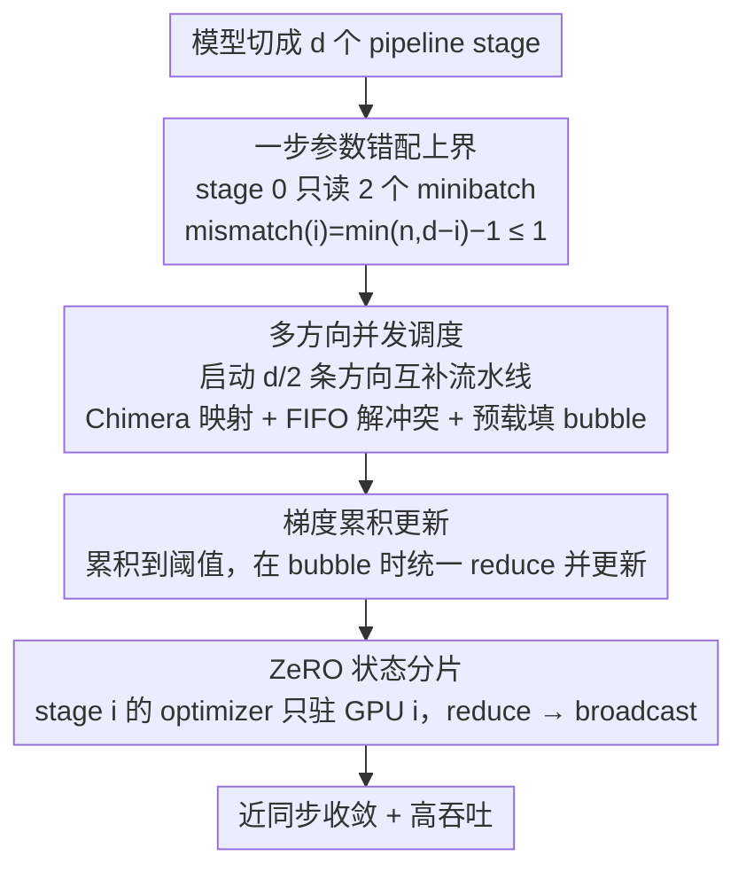

# AMDP: Asynchronous Multi-Directional Pipeline Parallelism for Large-Scale Models Training

**会议**: ICML 2026  
**arXiv**: [2605.29664](https://arxiv.org/abs/2605.29664)  
**代码**: https://github.com/Vinsmoke86/AMDP  
**领域**: LLM效率 / 分布式训练  
**关键词**: pipeline parallelism, 异步训练, 参数错配, 梯度累积, ZeRO  

## 一句话总结
AMDP 用多方向异步流水线、一步参数错配上界、梯度累积和 ZeRO 状态分片，在保持近同步收敛的同时提升大模型流水线并行训练吞吐，在 8 GPU GPT/BERT 实验中相对最强异步基线最高提升约 17%。

## 研究背景与动机
**领域现状**：大模型训练通常需要 pipeline parallelism 把网络层切分到多张 GPU 上。同步流水线如 GPipe、DAPPLE、Inter-1F1B 收敛稳定，但受前后依赖影响会产生 pipeline bubble；异步流水线如 PipeDream 能提高利用率，但前向和反向之间参数版本不一致，可能损害收敛。

**现有痛点**：传统异步 1F1B 为了消除 bubble，会持续向流水线喂 minibatch。随着 pipeline depth 增加，早期 stage 在某个 minibatch 的前向和反向之间可能经历多次参数更新，导致 stale gradient 或 parameter mismatch。参数缓存能保证一致但带来延迟梯度和内存开销，参数预测又依赖近似未来权重，误差难控。

**核心矛盾**：训练系统既想要异步流水线的高吞吐，又想要同步训练的收敛稳定。真正的问题不是“异步是否可用”，而是如何结构性地限制前向-反向之间的参数错配，同时填掉由限制喂入速度带来的 bubble。

**本文目标**：AMDP 希望把每个 stage 的参数错配限制在一步以内，并用多条互补方向的流水线补齐空闲时间，再通过梯度累积和 ZeRO 控制通信与内存成本。

**切入角度**：作者先分析参数错配的结构来源：stage 0 在第一次 backward 前读入的 minibatch 数越多，最深的错配越大。若强制 stage 0 最多读两个 minibatch，则所有 stage 的错配都不超过一步。

**核心 idea**：用“少读入以控错配，多方向并发以补利用率”的方式，把异步训练的收敛风险从随深度增长压到常数级。

## 方法详解
AMDP 可以看作对异步流水线的重新排程。它没有单纯追求让一条流水线满负载，而是让每条流水线都保持受控错配，然后用多条方向不同的流水线相互填补空闲。这样系统层面的利用率仍然高，但优化层面看到的是接近同步的一步延迟。

### 整体框架
模型被切成 $d$ 个 pipeline stage。普通异步 1F1B 为消除 bubble 会让 stage 0 在第一轮 backward 前读入接近 $d$ 个 minibatch，于是 stage 0 的参数错配约为 $d-1$。AMDP 固定 stage 0 只读两个 minibatch，因此任意 stage $i$ 的 mismatch 为 $\min(n,d-i)-1$，当 $n=2$ 时上界为 1。

限制读入会引入空闲，因此 AMDP 同时启动多条 pipeline。对于深度 $d$，单条受控流水线活跃比例约为 $2/d$，因此启动 $d/2$ 条方向互补的流水线即可填满设备。不同流水线按 Chimera 风格映射到 GPU，但 AMDP 是异步执行，并用 FIFO 规则解决多条流水线在同一 GPU 上的操作冲突。

为了降低每次 backward 后 all-reduce 的通信频率，AMDP 不立即更新参数，而是把多个 minibatch 的梯度累积到阈值后统一 reduce 和 update。最后，AMDP 用 ZeRO 思路让每个 stage 的 optimizer state 只由一个 GPU 持有，其他副本发送梯度并接收更新参数，从而避免多条 pipeline 带来的 optimizer state 复制。整个方法由四个相互衔接的组件构成，下图按数据流向把它们串起来。

### 关键设计

**1. 一步参数错配上界：从源头把异步扰动钉死在常数级**

异步流水线的收敛风险全部来自 forward 和 backward 之间参数被更新过几次（参数错配）。作者先把这个量写成结构公式：stage $i$ 的错配等于「第一次 backward 前读入的 minibatch 数减一」，受两个约束限制——为保持 backward 不出 bubble，stage $i$ 最多读 $d-i$ 个；同时任意 stage 的读入数不超过 stage 0 的读入数 $n$，于是 $\mathrm{mismatch}(i)=\min(n,d-i)-1$。此前方法为消 bubble 令 $n=d$，错配随深度线性增长到 $d-i-1$，深模型上 stale gradient 越来越严重。AMDP 直接令 $n=2$，于是所有 stage 的错配都不超过 1，与 pipeline 深度、多节点部署、多方向放置都无关。理论上这把 AMDP 的平均梯度范数上界压到只比同步 SGD 多 $O(\eta^2)$ 的二阶扰动。

**2. 多方向并发流水线调度：用互补方向填掉少读入留下的 bubble**

令 $n=2$ 控住了错配，却让单条流水线大量空闲——单条受控流水线对 GPU 的活跃比例只有 $r=2/d$。AMDP 不追求让一条流水线满负载，而是同时启动 $d/2$ 条方向互补的流水线，让彼此的空闲时段相互重叠填满设备。流水线方向沿用 Chimera 映射：偶数流水线 stage $i$ 映射到 GPU $(2j+i)\bmod d$，奇数流水线反向映射，使不同流水线错峰占用 GPU。但与同步的 Chimera 不同，AMDP 是异步执行、且 forward/backward 耗时不对称，多条流水线会在同一 GPU 抢占资源，AMDP 用 FIFO 规则解决：先到的操作先做、后到的延后。每段 $d$ 个 minibatch 的边界处还会按 backward/forward 耗时比预载额外的 forward，消掉首尾的 leading/trailing bubble。

**3. 梯度累积更新：降通信频率，并把错配窗口限制在每窗前 $d$ 个 minibatch**

逐 backward 立即更新有两个副作用：每次 backward 后都要 all-reduce，通信开销大；且 bubble 填充会打乱 1F1B，反而引入多步错配（如 GPU 0 上 minibatch 6 的 forward 与 backward 之间夹了 minibatch 2、4 两次更新）。AMDP 改为把多个 minibatch 的梯度累积到阈值后，在下一个 bubble 时统一 reduce 并更新。这既把 all-reduce 频率降下来，又让每个累积窗口内只有前 $d$ 个 minibatch 经历一步错配、其余都用一致参数。实践中阈值远大于 $d$，错配影响可忽略——这正是 AMDP 与 PipeDream 类方法的本质区别：后者错配随 stage 数增长，AMDP 把它锁死在每窗口前 $d$ 个。

**4. ZeRO 状态分片：让多流水线副本可扩展的必要条件**

多方向调度让每张 GPU 要为多个 stage 存参数、梯度和 optimizer state，朴素实现会被 optimizer state 复制吃掉吞吐收益。AMDP 引入 ZeRO：stage $i$ 的 optimizer 只驻留在 GPU $i$，由它独家负责更新 stage $i$ 的参数；其他持有 stage $i$ 副本的 GPU 把梯度发给 GPU $i$ 做 reduce，更新后再 broadcast 回来。这把每张 GPU 的 optimizer state 内存降到朴素方案的 $2/d$，且 reduce + broadcast 的总通信量与 all-reduce 相同、不增开销，同步每次更新只发生一次、不随流水线数增长。消融显示去掉 ZeRO 吞吐约低 4%，它不是附加优化，而是多流水线能扩展的前提。

### 损失函数 / 训练策略
AMDP 不改变模型训练目标，只改变流水线执行和更新语义。理论部分在 $L$-smooth 非凸目标、随机梯度无偏且方差有界的假设下，证明一步错配带来的平均梯度范数上界与同步 SGD 相比只多 $O(\eta^2)$ 扰动。实验使用 AdamW、混合精度、microbatch size 4，并在 GPT-style 和 BERT-style 模型上比较吞吐、显存和收敛。

## 实验关键数据

### 主实验
实验硬件为 8 张 NVIDIA A800 80GB GPU，NVLink 3.0 互联；模型包括约 1.56B 参数 GPT-style 模型和约 1.04B 参数 BERT-style 模型。下表摘取 8 GPU 吞吐结果，单位为 ktokens/s。

| 模型 | $d$ | $b$ | PipeDream-2BW | XPipe | Inter-1F1B | AMDP | 相对最强基线 |
|------|-----|-----|---------------|-------|------------|------|--------------|
| GPT-style | 4 | 16 | 38.6 | 38.5 | 35.4 | 39.1 | +1.3% |
| GPT-style | 4 | 64 | 41.0 | 40.7 | 39.8 | 42.1 | +2.7% |
| GPT-style | 8 | 32 | 70.3 | 66.0 | 57.0 | 75.5 | +7.4% |
| GPT-style | 8 | 128 | 71.6 | 69.7 | 67.5 | 83.7 | +16.9% |
| BERT-style | 8 | 32 | 74.3 | 73.6 | 37.5 | 78.5 | +5.7% |
| BERT-style | 8 | 128 | 75.8 | 75.6 | 58.8 | 86.1 | +13.6% |

### 消融实验
作者进一步考察了梯度累积阈值和 ZeRO 的作用，并报告训练质量指标。

| 配置 | 关键指标 | 说明 |
|------|---------|------|
| GPT, AMDP, $d=8,b=128$ | 40k iter train loss 2.90 | 接近 Inter-1F1B 的 2.88 |
| BERT, AMDP, $d=8,b=128$ | 40k iter train loss 2.36 | 与 DAPPLE 持平 |
| GPT, 达到 loss 2.9 | 比 Inter-1F1B 快 23% | 高吞吐没有明显牺牲收敛 |
| BERT, 达到 loss 2.4 | 比 DAPPLE 快 22% | wall-clock 收敛优势明显 |
| 梯度累积阈值 1/2/4/8, GPT | 75.5 / 78.9 / 83.7 / 83.3 | 中等阈值最优 |
| 梯度累积阈值 1/2/4/8, BERT | 78.5 / 81.0 / 86.1 / 84.6 | 继续增大收益递减 |
| w/o ZeRO, GPT/BERT | 80.3 / 82.7 | 吞吐约低 4% |
| with ZeRO, GPT/BERT | 83.7 / 86.1 | 减少冗余 optimizer state 并提升吞吐 |

### 关键发现
- AMDP 的吞吐优势随 pipeline depth 和 update batch size 变大而更明显，因为深流水线和大累积窗口更容易暴露基线的 stage imbalance 与 bubble。
- 收敛曲线接近同步方法，说明一步错配上界比“完全异步但事后补救”更可靠。
- AMDP 的峰值显存略高于 XPipe 和 PipeDream-2BW，但低于 Inter-1F1B 的高激活峰值，并且显存分布更均衡。
- 16 GPU 两节点实验中，AMDP 在纯 pipeline 和 hybrid pipeline+data parallel 配置上也保持最高吞吐，例如 $d=8,b=128$ 达到 159.8 ktokens/s。

## 亮点与洞察
- 论文最好的地方是先把错配量写成一个结构公式，再围绕这个公式设计系统。它不是经验性调度，而是从“第一次 backward 前读了多少 minibatch”这个根因入手。
- 多方向调度把 Chimera 的直觉迁移到异步训练，但目标从“同步填 bubble”变成“在受控错配下填 bubble”，设计目标更贴合异步稳定性。
- ZeRO 在这里不是附加优化，而是让多 pipeline replica 可扩展的必要条件。否则多方向带来的吞吐会被 optimizer state 复制吃掉。

## 局限与展望
- AMDP 的效果依赖 pipeline stage 划分和前后向耗时比例；极端不均衡、通信瓶颈很强或非 Transformer 架构下需要更多验证。
- 理论分析基于平滑目标和 SGD 式假设，实际实验使用 AdamW，虽然 appendix 扩展到 Adam 类优化器，但仍是近似解释。
- 多方向调度实现复杂度高于常规 1F1B，和现有训练框架的集成、调试、容错成本需要考虑。
- 未来可以把 mismatch-aware learning rate、自动 stage partition 和动态 pipeline 数量选择结合起来，让调度更自适应。

## 相关工作与启发
- **vs DAPPLE / Inter-1F1B**: 同步方法收敛稳定但 bubble 明显；AMDP 用受控异步和多方向调度换取更高吞吐。
- **vs PipeDream / PipeDream-2BW**: PipeDream 系列消 bubble 但需要处理延迟梯度或参数版本；AMDP 直接把错配限制在一步，从源头降低收敛风险。
- **vs XPipe / vNAG**: 参数预测类方法试图估计未来权重；AMDP 不预测参数，而是通过 schedule 结构减少不一致发生的程度。
- **vs Chimera**: Chimera 是同步双向流水线，AMDP 借鉴多方向思想但用于异步场景，并加入梯度累积与 ZeRO。

## 评分
- 新颖性: ⭐⭐⭐⭐☆ 多方向异步加一步错配上界的组合很有系统设计价值，建立在成熟 pipeline parallelism 思路之上。
- 实验充分度: ⭐⭐⭐⭐☆ 覆盖多模型、多深度、多 batch、显存、收敛和 16 GPU 扩展，但真实超大模型规模仍可继续验证。
- 写作质量: ⭐⭐⭐⭐☆ 问题分解清楚，理论、调度图和系统实验能互相支撑。
- 价值: ⭐⭐⭐⭐☆ 对大模型训练系统很实用，尤其适合追求吞吐但不能接受异步收敛崩坏的场景。

<!-- RELATED:START -->

## 相关论文

- [\[ICML 2026\] Torus Graphs for Large-Scale Neural Phase Analysis](torus_graphs_for_large_scale_neural_phase_analysis.md)
- [\[CVPR 2026\] MSPT: Efficient Large-Scale Physical Modeling via Parallelized Multi-Scale Attention](../../CVPR2026/others/mspt_efficient_large-scale_physical_modeling_via_parallelized_multi-scale_attent.md)
- [\[ICML 2026\] HASTE: Hardware-Aware Dynamic Sparse Training for Large Output Spaces](haste_hardware-aware_dynamic_sparse_training_for_large_output_spaces.md)
- [\[CVPR 2026\] Accelerating Diffusion via Hybrid Data-Pipeline Parallelism Based on Conditional Guidance Scheduling](../../CVPR2026/others/accelerating_diffusion_via_hybrid_data-pipeline_parallelism_based_on_conditional.md)
- [\[CVPR 2026\] Large-scale Robust Enhanced Ensemble Clustering via Outlier Decoupling](../../CVPR2026/others/large-scale_robust_enhanced_ensemble_clustering_via_outlier_decoupling.md)

<!-- RELATED:END -->
