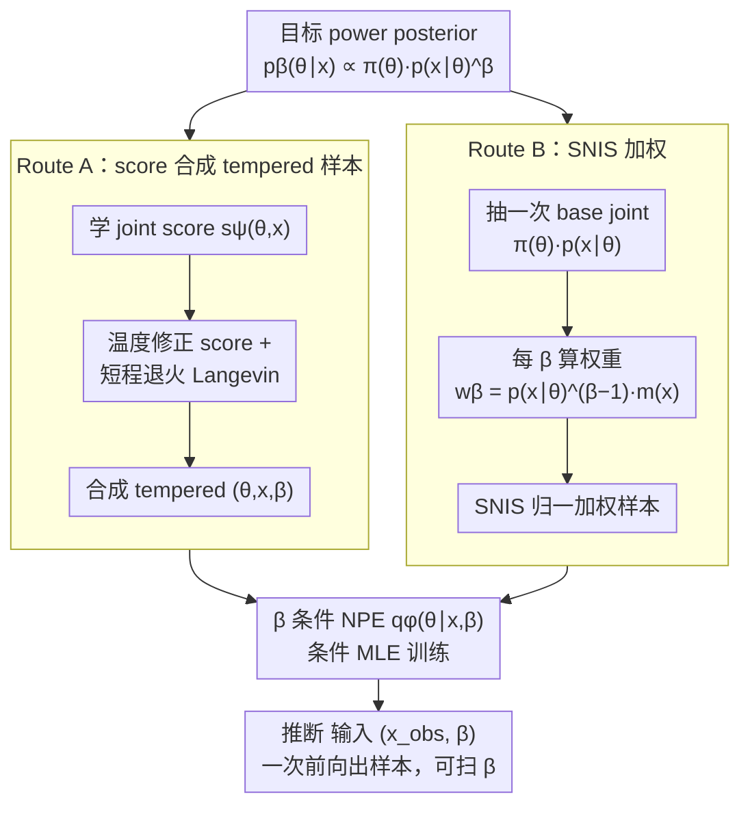

# Amortized Simulation-Based Inference in Generalized Bayes via Neural Posterior Estimation

**会议**: ICML 2026  
**arXiv**: [2601.22367](https://arxiv.org/abs/2601.22367)  
**代码**: https://github.com/Komorebiww/amortized-generalized-bayes  
**领域**: 科学计算 / 仿真推断  
**关键词**: simulation-based inference, generalized Bayes, power posterior, neural posterior estimation, SNIS  

## 一句话总结
这篇论文把 generalized Bayes 中的 power posterior 家族直接摊销到一个同时以观测 $x$ 和温度 $\beta$ 为条件的 neural posterior estimator 上，使不同观测和不同 $\beta$ 下的后验采样可通过一次前向传播完成，而不再需要每次运行 MCMC。

## 研究背景与动机
**领域现状**：Simulation-based inference 处理的是有模拟器但无显式似然的科学问题。现代 SBI 常用 NPE、NLE 或 NRE 从模拟样本中学习后验、似然或似然比，从而在新观测上快速推断参数。

**现有痛点**：标准 SBI 通常目标是普通 Bayes posterior，也就是 $\beta=1$。真实科学模拟器经常 misspecified，普通 posterior 可能过度自信。Generalized Bayes 通过温度 $\beta$ 或 loss-based update 调节数据和先验的权重，但已有方法往往需要对每个新观测、每个 $\beta$ 重新运行 MCMC、SDE sampler 或其他迭代推断。

**核心矛盾**：GBI 的鲁棒性来自能扫不同 $\beta$、检查 posterior 稳定性，但恰恰这个扫温度过程最耗推断成本。若每个 $x$ 和 $\beta$ 都要单独采样，GBI 很难用于大量观测或交互式科学分析。

**本文目标**：作者希望训练一个 $q_\phi(\theta\mid x,\beta)$，直接近似 power posterior $p_\beta(\theta\mid x)\propto\pi(\theta)p(x\mid\theta)^\beta$，从而把对观测和温度的推断都摊销掉。

**切入角度**：论文聚焦 tempered posterior 这一 GBI 特例，保留似然结构但引入可调温度。它不再摊销 cost function 后用 MCMC 采样，而是直接摊销后验采样器本身。

**核心 idea**：用两条互补路线构造带 $\beta$ 的 NPE 训练目标：Route A 通过 score-assisted Langevin 合成 tempered joint 样本，Route B 用 SNIS 对固定 simulator joint 数据重加权，二者都训练同一个 $\beta$ 条件后验网络。

## 方法详解
论文的核心是把“给定 $x$ 和 $\beta$ 后采样 power posterior”变成一个条件密度估计问题。训练完成后，用户输入一个观测和温度，NPE 直接输出参数分布样本；这把原本昂贵的每实例采样成本挪到了离线训练阶段。

### 整体框架
设先验为 $\pi(\theta)$，模拟器隐式定义 $p(x\mid\theta)$。Power posterior 为 $p_\beta(\theta\mid x)\propto\pi(\theta)p(x\mid\theta)^\beta$，其中 $\beta<1$ 会弱化数据、提升鲁棒性，$\beta>1$ 会强化数据、得到更集中的后验。目标是在一个有界温度区间或网格上训练单个 $q_\phi(\theta\mid x,\beta)$。

Route A 先从普通 simulator joint $\pi(\theta)p(x\mid\theta)$ 学一个 joint score，再用温度修正后的 score 跑短程退火 Langevin，合成近似来自 $\pi(\theta)p(x\mid\theta)^\beta$ 的 $(\theta,x,\beta)$ 三元组。随后用这些样本做条件 MLE 训练 NPE。

Route B 不合成新样本，而是一次性抽取 base joint 数据并复用。对每个 $\beta$，它用 NLE 或 NRE 估计 $p(x\mid\theta)^{\beta-1}$ 或似然比权重，再用 self-normalized importance sampling 得到加权 NPE 目标。理论上，这个目标等价于用 forward KL 拟合目标 power posterior。两条路线产出的训练信号都喂给同一个 $\beta$ 条件 NPE，训练完后推断时只需对给定 $(x_{obs},\beta)$ 做一次前向。

### 关键设计

**1. $\beta$ 条件化的 NPE 目标：一张网覆盖所有观测和所有温度**

GBI 的鲁棒性分析离不开扫温度——要看后验在不同 $\beta$ 下稳不稳、做 posterior predictive check 和校准。但已有方法每换一个观测、每换一个 $\beta$ 都得重跑一次采样，扫温度因此成了最贵的一步。本文把 $\beta$ 和观测 $x$ 一起作为条件喂进后验网络，训练 $q_\phi(\theta\mid x,\beta)$ 直接逼近 power posterior $p_\beta(\theta\mid x)$。训练好后，扫温度只是改一个输入标量再做一次前向，原本每实例的采样成本被整体挪到了离线训练阶段——这也是图里两条路线最终汇聚的那个网络。

**2. Route A：用 score 合成 tempered 训练样本**

要训练上面那张网，先得有服从 $\pi(\theta)p(x\mid\theta)^\beta$ 的 $(\theta,x,\beta)$ 样本，可这个 tempered joint 没法直接采。Route A 的做法是先用 denoising score matching 从普通 simulator joint 学一个 joint score $s_\psi(\theta,x)$，再用温度修正后的 score $\beta s_\psi(\theta,x)-(\beta-1)(\nabla_\theta\log\pi(\theta),0)$ 跑短程退火 Langevin，主动合成接近 tempered joint 的样本，最后拿它们做条件 MLE 训练 NPE。它的价值在于能覆盖 base joint 够不到的 off-manifold 区域——当 $\beta$ 很小、或 Route B 的重要性权重退化时，这种显式合成往往更稳，代价是依赖 score 准确性和 Langevin 步长调参。

**3. Route B：对固定数据做 SNIS 加权**

Route B 走另一条更省事的路：不合成新样本，只把 base joint $\pi(\theta)p(x\mid\theta)$ 抽一次、跨所有温度复用。对每个 $\beta$，给样本赋自归一重要性权重 $w_\beta(\theta,x)=p(x\mid\theta)^{\beta-1}m(x)$（NLE 取 $m(x)=1$，NRE 取 $m(x)=p(x)^{1-\beta}$），归一化后最小化 $\sum_i\tilde w_{\beta,i}[-\log q_\phi(\theta_i\mid x_i,\beta)]$。论文证明这个加权目标等价于对 power posterior 做 forward KL 拟合（mass-covering），所以它不是纯工程 trick 而是有理论依据，且 NRE 权重在 $\beta\in[1/2,1]$ 时方差有限。它部署简单、推断快，但当 $|\beta-1|$ 大时权重会变尖、ESS 下降，也无法恢复 base joint 完全没覆盖的后验区域。

### 损失函数 / 训练策略
Route A 的训练分三步：先用 denoising score matching 学 joint score，再对每个 $\beta$ 用退火 Langevin 合成 tempered pairs，最后最小化条件负对数似然 $\mathbb{E}[-\log q_\phi(\theta\mid x,\beta)]$。Route B 先训练 NLE 或 NRE，再用每个温度的 SNIS 权重训练 NPE。后验网络可以用 MDN、MAF 或 NSF；低维多峰后验适合 MDN，高维任务更适合 flow-based estimator。推断时对给定 $x_{obs}$ 和 $\beta$ 一次前向采样，不调用 simulator，也不运行 MCMC。

## 实验关键数据

### 主实验
论文在 Gaussian Mixture、Two Moons、SLCP 和 Lorenz-96 四个 SBI benchmark 上评估，用 MMD 和 C2ST 比较 amortized samples 与 reference power posterior samples。reference posterior 在每个 $\beta$ 上由高质量 MCMC、parallel tempering 或 rejection sampler 构造。

| 任务 | 后验特点 | 评估温度 | 主要观察 | 适合路线 |
|------|----------|----------|----------|----------|
| Gaussian Mixture | 低维多峰，reference 可精确 rejection sampling | $\beta\in\{0.1,0.3,0.5,0.7,0.9,1.0,1.1,1.3,1.5\}$ | Route A 在小 $\beta$ 更稳，Route B 在接近 1 时有效 | Route A / Route B 均可 |
| Two Moons | 折叠形几何，多峰支撑 | 同上 | Route A 受 score error 和 Langevin 步长影响更明显 | 需要调 Route A 步长 |
| SLCP | 5 维复杂后验 | 同上 | SNIS 在远离 $\beta=1$ 时 ESS 下降，误差上升 | Route A 更有覆盖优势 |
| Lorenz-96 | 混沌动力系统，科学模拟场景 | 同上 | 更难的结构化后验上差距更明显，但 amortized 方法仍具竞争力 | 依赖诊断选择 |
| Hodgkin-Huxley | 8 参数神经元电生理模型 | $\beta=0.1,1.0,2.0$ | 10K 模拟训练的 RouteB_NLE 产生稳定边缘后验和合理预测轨迹 | RouteB_NLE |

### 消融实验
论文没有传统模块表格，但给出了 Route A 步长敏感性、Route B ESS 诊断和 HH 温度分析。下面按“分析项”整理。

| 分析项 | 关键指标 / 现象 | 说明 |
|--------|----------------|------|
| Route A 步长 | Gaussian mixture, $\beta=0.9$ 下 C2ST 对 Langevin step size 呈非单调 | 步长太大有离散化偏差，太小混合不足 |
| Route B nESS | 每个任务用 $K=2000$ importance samples，30 个 held-out tasks | nESS 在 $\beta=1$ 附近最高，远离 base proposal 后下降 |
| SLCP / Lorenz-96 | 小 $\beta$ 或极端温度下 ESS 更容易 collapse | reweighting 很难覆盖 base joint 缺失区域 |
| HH RouteB_NLE | 10,000 次 prior simulations | $g_{Na}$、$g_K$ 随温度有尾部/峰值变化，$E_{leak}$ 基本稳定 |
| HH posterior predictive | 3 个 Allen Cell Types 观测 | $\beta=0.1$ 样本能定性复现主要 spike timing |

### 关键发现
- 这篇论文不声称 amortized 方法在所有温度和任务上都优于非摊销 reference，而是证明它们在许多设置中能达到竞争性近似，同时大幅降低多 $x$、多 $\beta$ 查询成本。
- Route B 靠近 $\beta=1$ 时最自然，因为 base joint 与 target 最接近；当 $\beta$ 远离 1，importance weights 变尖，ESS 下降，误差变大。
- Route A 能主动生成 tempered joint 样本，在小 $\beta$ 或 SNIS 失稳时可能更好，但它依赖 score 准确性和 Langevin 调参。
- HH 实验说明该框架不只是 toy benchmark：在真实神经电生理记录上，$\beta$ 条件后验能用于观察温度如何影响生物物理参数不确定性。

## 亮点与洞察
- 论文最重要的价值是把 GBI 的温度维度真正放进 amortization。过去很多方法摊销了 cost 或 likelihood，但最后仍要每个观测跑 MCMC；这里直接摊销 sampler。
- Route A 和 Route B 的互补关系讲得比较诚实。Route B 快但受权重退化限制，Route A 覆盖更灵活但受 score 和采样误差限制，这比单推一种方案更可信。
- 用 forward KL 解释 SNIS-weighted NPE 很关键。它说明加权 MLE 不只是工程技巧，而是在拟合 mass-covering 的 tempered posterior。

## 局限与展望
- Route A 离线成本高，并且短程 Langevin 对步长、噪声 schedule 和 score 误差敏感，复杂多峰后验上可能不稳。
- Route B 无法恢复 base joint 完全没有覆盖的后验区域；当 $|\beta-1|$ 大、likelihood ratio 估计不准或 ESS collapse 时，NPE 会继承偏差。
- 所有路线都依赖 $q_\phi$ 同时泛化到观测和温度，超出训练温度区间或遇到分布外观测时可能校准失效。
- 实验更多展示趋势和诊断，缺少一张统一量化表对比所有任务所有温度的平均 MMD/C2ST，读者需要从曲线中综合判断。

## 相关工作与启发
- **vs ACE + MCMC**: ACE 摊销 expected cost，但每个观测仍用 MCMC 抽 generalized posterior；本文直接学习 $q_\phi(\theta\mid x,\beta)$，推断阶段不再采样链。
- **vs scoring-rule posterior**: scoring-rule GBI 对 misspecification 很有吸引力，但通常要 pseudo-marginal 或 SG-MCMC；本文限制在 power posterior，但换来全摊销采样。
- **vs 标准 NPE / SNPE**: 标准 NPE 主要学 $\beta=1$ 后验；本文把温度作为条件变量，让一个网络覆盖鲁棒 Bayes 分析中的一族目标。
- **启发**: 对需要 sweep 超参数的 Bayesian workflow，可以把超参数直接作为 amortized posterior 的条件，而不是为每个超参数重新跑推断。

## 评分
- 新颖性: ⭐⭐⭐⭐☆ 将 generalized Bayes 的温度家族直接摊销进 NPE 很有价值，Route B 的 SNIS/fKL 连接也比较扎实。
- 实验充分度: ⭐⭐⭐☆☆ 覆盖多个 SBI benchmark 和 HH 案例，但主结果主要是曲线和定性诊断，统一表格化量化略少。
- 写作质量: ⭐⭐⭐⭐☆ 方法路线和权衡讲得清楚，理论命题能解释训练目标，但符号密度较高。
- 价值: ⭐⭐⭐⭐☆ 对科学推断中需要大量观测或扫温度的场景很实用，尤其适合作为 GBI 与 amortized SBI 的桥梁。

<!-- RELATED:START -->

## 相关论文

- [\[ICML 2026\] TabMGP: Martingale Posterior with TabPFN](tabmgp_martingale_posterior_with_tabpfn.md)
- [\[ICLR 2026\] Neural Force Field: Few-shot Learning of Generalized Physical Reasoning](../../ICLR2026/others/neural_force_field_few-shot_learning_of_generalized_physical_reasoning.md)
- [\[AAAI 2026\] Bilevel MCTS for Amortized O(1) Node Selection in Classical Planning](../../AAAI2026/others/bilevel_mcts_for_amortized_o1_node_selection_in_classical_planning.md)
- [\[AAAI 2026\] ParaRevSNN: A Parallel Reversible Spiking Neural Network for Efficient Training and Inference](../../AAAI2026/others/pararevsnn_a_parallel_reversible_spiking_neural_network_for_efficient_training_a.md)
- [\[NeurIPS 2025\] Scalable Inference of Functional Neural Connectivity at Submillisecond Timescales](../../NeurIPS2025/others/scalable_inference_of_functional_neural_connectivity_at_submillisecond_timescale.md)

<!-- RELATED:END -->
