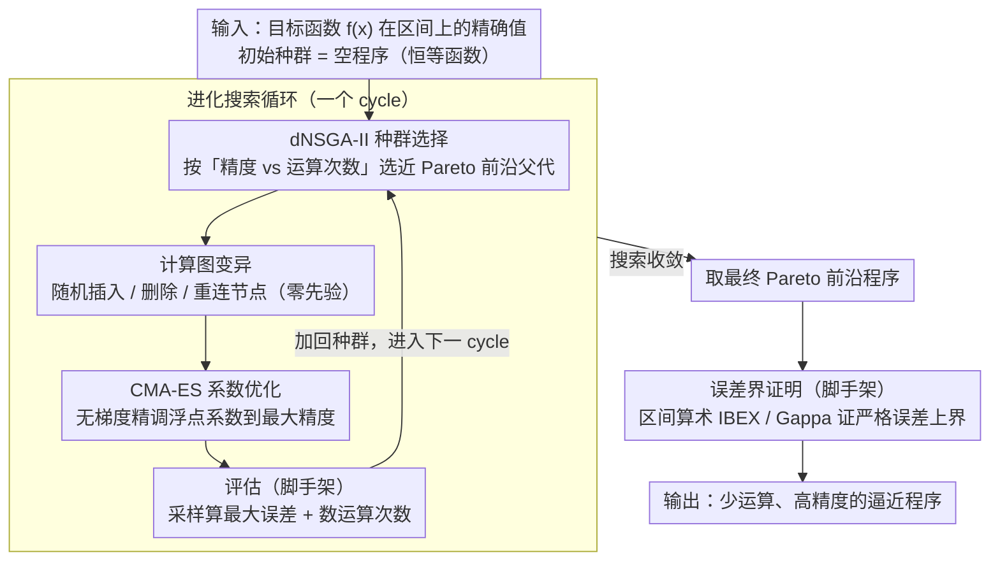

# AutoNumerics-Zero: Automated Discovery of State-of-the-Art Mathematical Functions

**会议**: ICML2026  
**arXiv**: [2312.08472](https://arxiv.org/abs/2312.08472)  
**代码**: https://github.com/google-deepmind/autonumerics_zero  
**领域**: others  
**关键词**: 符号回归, 进化搜索, 超越函数逼近, 程序发现, 数值计算

## 一句话总结
提出 AutoNumerics-Zero，一种零先验知识的进化符号回归方法，从空程序出发自动发现逼近超越函数（如指数、余弦）的算术程序，在有限精度目标下以更少的运算次数超越了数百年来数学家设计的经典逼近方法。

## 研究背景与动机

**领域现状**：超越函数（指数函数、对数、三角函数等）是科学计算的基石，但数字硬件无法原生计算它们，必须通过 $\{+,-,\times,\div\}$ 等基本运算的有限组合来逼近。经典方法包括 Taylor 展开、Chebyshev 逼近、Padé 近似和 Remez 极小化极大算法，这些方法经过数百年发展已相当成熟。

**现有痛点**：经典数学逼近方法追求的是"任意精度"——即通过增加项数可以无限提高精度。然而，现代计算机使用的 float32 等有限精度数据类型已足以满足绝大多数应用，超出数据类型精度上限的准确度实际上被浪费了。此外，经典方法被限制在特定的函数形式内（如多项式、有理函数），无法探索所有可能的运算组合。

**核心矛盾**：经典方法的设计目标（任意精度）与实际需求（有限精度）之间存在错配。如果将优化目标从"无限精度"转为"足够高但有限的精度"，是否能发现运算次数更少的逼近方案？

**本文目标**：探索在有限精度目标下，能否通过大规模进化搜索自动发现比经典方法更高效的超越函数逼近程序。

**切入角度**：作者观察到符号回归可以搜索任意运算组合（不受多项式/有理函数等固定形式约束），且能优化不可微目标（如运算次数）。将函数表示为程序而非公式，还允许复用中间计算值，从而进一步减少运算量。

**核心 idea**：用大规模进化符号回归从空程序出发，在 $\{+,-,\times,\div\}$ 运算空间中搜索超越函数的高效有限精度逼近程序，以"零数学先验"的方式超越数百年的人工设计。

## 方法详解

### 整体框架
AutoNumerics-Zero 是一个多目标进化搜索系统，输入是目标超越函数 $f(x)$（如 $2^x$）在指定区间上的精确值作为训练数据，输出是一组逼近程序，每个程序用尽可能少的基本运算达到尽可能高的精度。整个搜索过程从空程序（恒等函数）出发，通过嵌套的两层优化迭代改进种群：外层遗传编程发现程序结构，内层 CMA-ES 优化浮点系数。搜索循环的一个 cycle 由四步串成——dNSGA-II 选近 Pareto 前沿的父代、计算图变异生成子代、CMA-ES 精调子代系数、评估其精度与运算次数后加回种群，如此往复。搜索收敛后，对最终 Pareto 前沿上的最佳程序用区间算术进行严格的误差界证明。

### 关键设计

**1. 分布式多目标种群选择（dNSGA-II）：把 NSGA-II 改成去中心化版本，在大规模集群上维护"精度 vs 运算次数"的 Pareto 前沿**

经典 NSGA-II 需要集中式种群管理，不适合大规模并行搜索。dNSGA-II 是它的分布式变体：每个 worker 从随机的其他 worker 接收 $2S$ 个程序，通过 SelectNearPareto 选出 $S$ 个接近 Pareto 前沿（精度对运算次数）的父程序，对每个父程序变异两次产生 $2S$ 个子代再发给其他 worker，精度以 $a = -\log_{10}(E)$ 衡量（$E$ 为最大误差）。这种 worker 间随机通信实现的去中心化种群演化，既避免了集中式种群瓶颈、支持异步更新，又能保持 Pareto 前沿上程序的均匀分布，让搜索在算力和解多样性之间都站得住。

**2. 计算图变异策略：用纯随机的"插入/删除/重连"在程序结构空间里探索，不注入任何数学先验**

程序被表示为计算图——输入节点是程序输入和系数，中间节点是 $\{+,-,\times,\div\}$ 运算，输出节点是结果。变异每次随机执行三种操作之一：在随机位置插入一个随机运算节点、删除一个随机节点、或随机重连一条边，所有选择都是随机的。之所以坚持这种"零知识"变异，是为了让搜索不偏向任何已知逼近形式（如多项式），从而有机会发现全新的、非常规的表达式——比如最终找到的那个"嵌套的除法-加法组合后取 8 次方"，几乎不可能从人工设计的 ansatz 里冒出来。

**3. CMA-ES 系数内层优化：变异只改结构，系数交给无梯度优化器精细调到最大精度**

变异改变的是程序结构，固定结构后的浮点系数还需要精调。本文对每个变异后的子程序用 CMA-ES（协方差矩阵自适应进化策略）优化系数，目标是最小化一批随机采样输入-输出示例上的最大误差。选 CMA-ES 是因为它是无梯度连续优化、在低参数量下表现优异，又能避开局部最优——更关键的是它与整个系统的黑盒特性一致，意味着未来可以往运算集里加入不可微操作（如位移指令）而完全不用修改优化器，这正是基于梯度的方法做不到的。

### 误差界证明
搜索完成后，对最佳程序使用区间算术（IBEX 库）迭代细分定义域，在每个子区间上证明误差上界，全局界取所有子区间的最大值。对硬件感知的 float32 程序，使用 Gappa 证明器处理中间舍入误差。这确保了发现的程序具有严格的数学保证。

## 实验关键数据

### 主实验：指数函数逼近

| 方法 | 运算次数 | 精度（有效数字位数） | 与基线差距 |
|------|---------|-------------------|-----------|
| AutoNumerics-Zero (最佳) | 10 | 14.3 | 超越基线 6+ 个数量级 |
| Ratio/Minimax | 10 | ~8 | 基线最佳 |
| Ratio/Padé | 10 | ~7 | — |
| Poly/Taylor (Horner) | 10 | ~6 | — |
| Chebyshev | 10 | ~7 | — |
| Poly/Minimax | 10 | ~8 | — |

发现的 10 运算程序 $f(x) = \left(\frac{c_4}{\frac{c_1}{\frac{c_3}{x}+x}+c_2+\frac{c_3}{x}+x}-c_5\right)^8$ 逼近 $2^x$，在全实数线上保证 14 位有效数字，经区间算术严格证明最大相对误差低于 $5.4\times 10^{-15}$。

### 硬件感知指数函数与其他函数

| 目标函数 | 场景 | AutoNumerics-Zero | 最佳基线 | 优势 |
|---------|------|-------------------|---------|------|
| $2^x$ (硬件感知, Skylake) | float32 吞吐 | 3x+ 更快 | Poly/Minimax | 误差 <1 ULP，跨 6 代 Intel/AMD 平台迁移 |
| $\cos(x)$ | 绝对误差 | 更高精度 | Chebyshev | 相同运算次数下精度更优 |
| Airy $\text{Ai}(-7x)$ | 振荡函数 | 19 运算, 精度 4.2 | 20 运算基线 | 误差减少 2 个数量级 |
| Bessel $I_{1/2}(x)$ | 含 $\sqrt{\cdot}$ | 8 运算, 精度 8.1 | 9 运算, 精度 7.8 | 少 1 运算且更准确 |
| $\text{erf}(x)$ | $(0,2]$ | 低精度区间更优 | Padé（高精度更优） | 高精度下 Padé 占优 |

### 消融实验

| 配置 | 效果 | 说明 |
|------|------|------|
| 完整方法 | 最佳 Pareto 前沿 | dNSGA-II + 变异 + CMA-ES |
| 去掉 dNSGA-II（随机搜索） | 显著退化 | 无种群选择压力导致搜索效率大幅下降 |
| 去掉 CMA-ES | 显著退化 | 系数未优化导致精度受限 |
| 随机图替代变异 | 显著退化 | 等效于完全随机搜索 |

### 关键发现
- 在指数函数逼近中，进化发现的程序在所有运算次数级别上均超越了包括 Taylor、Padé、Chebyshev 和 Minimax 在内的全部经典基线，且优势经数学证明确认
- 硬件感知搜索发现了触发编译器异常但有益编译路径的代码，手动编写这样的代码几乎不可能
- 进化程序在跨 8 年的 Intel 和 AMD 架构上保持至少 80% 的加速，展现出良好的硬件迁移性
- 不同搜索实验中出现了趋同进化现象：最优程序展现出相似的结构特征，类似自然界中鳍的独立演化

## 亮点与洞察
- **零知识发现超越人工设计**：整个搜索过程不使用任何数学先验（无渐近展开、无导数计算、无预训练），却发现了优于数百年数学家积累的逼近方法。这证明了进化搜索在结构化数学问题上的强大探索能力
- **程序表示优于公式表示**：通过将函数表示为程序（计算图）而非数学公式，允许中间值复用，从而以更少的运算达到更高精度。发现的最优程序形式既非多项式也非连分数，而是全新的嵌套结构
- **黑盒优化的可扩展性**：由于 dNSGA-II 和 CMA-ES 都是黑盒方法，整个框架可以轻松扩展到新的运算集合（如 $\sqrt{\cdot}$）、新的优化目标（如硬件执行速度）和新的目标函数，这是基于梯度的方法无法实现的

## 局限与展望
- **依赖区间约简**：搜索过程在有界区间内是零知识的，但扩展到全实数线仍依赖标准的 range reduction 技术，这与所有基线方法共有此限制
- **搜索计算开销大**：需要 100-10k 个进程运行 1-4 天。但这是一次性成本，发现的程序可以在所有未来使用中分摊此开销
- **并非所有函数都占优**：erf 函数在高精度区间下不如 Padé 近似，说明该方法并非对所有目标函数都有优势
- **可解释性-质量权衡**：发现的程序形式非常规，缺乏 Taylor 展开那样直观的数学解释。可以尝试对发现的程序进行事后分析以提取结构规律
- 未来方向包括将 range reduction 纳入搜索过程、加入位操作等非浮点指令、以及探索向后稳定性优化

## 相关工作与启发
- **AlphaTensor**（Fawzi et al., 2022）和 **AlphaDev**（Mankowitz et al., 2023）分别用 RL 发现了矩阵乘法和排序的最优算法，但它们搜索小规模问题后解析推广；AutoNumerics-Zero 直接在实用尺度搜索
- 与传统符号回归工作不同，本文发现的是前所未知的数学关系并通过数学证明验证，而非恢复已知公式
- 与超优化（superoptimization）互补：超优化从已有正确程序出发优化，AutoNumerics-Zero 从空程序出发发现全新程序

<!-- RELATED:START -->

## 相关论文

- [\[ACL 2025\] Limited Generalizability in Argument Mining: State-Of-The-Art Models Learn Datasets, Not Arguments](../../ACL2025/others/limited_generalizability_in_argument_mining_state-of-the-art_models_learn_datase.md)
- [\[ECCV 2024\] Auto-GAS: Automated Proxy Discovery for Training-Free Generative Architecture Search](../../ECCV2024/others/auto-gas_automated_proxy_discovery_for_training-free_generative_architecture_sea.md)
- [\[AAAI 2026\] Agent-SAMA: State-Aware Mobile Assistant](../../AAAI2026/others/agent-sama_state-aware_mobile_assistant.md)
- [\[ICLR 2026\] The Expressive Limits of Diagonal SSMs for State-Tracking](../../ICLR2026/others/the_expressive_limits_of_diagonal_ssms_for_state-tracking.md)
- [\[ICLR 2026\] Bayesian Influence Functions for Hessian-Free Data Attribution](../../ICLR2026/others/bayesian_influence_functions_for_hessian-free_data_attribution.md)

<!-- RELATED:END -->
