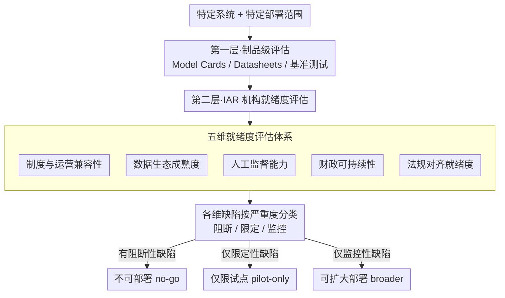

# Beyond Model Readiness: Institutional Readiness for AI Deployment in Public Systems

**会议**: ICML2026  
**arXiv**: [2605.17203](https://arxiv.org/abs/2605.17203)  
**代码**: 无  
**领域**: AI治理/部署政策  
**关键词**: 机构就绪度, AI部署, 公共部门, 负责任AI, 部署治理  

## 一句话总结
针对公共部门AI系统"技术上可行但部署上失败"的普遍现象，提出**机构对齐就绪度 (Institutional Alignment Readiness, IAR)** 五维评估框架，从制度兼容性、数据生态成熟度、人工监督能力、财政可持续性和法规对齐五个维度评估接收机构是否具备负责任部署AI系统的条件。

## 研究背景与动机

**领域现状**：当前负责任AI领域已产出大量原则、检查清单和文档工具，如Model Cards、Datasheets for Datasets、NIST AI RMF等，用于评估模型和数据集的技术属性。这些工具在评估模型准确性、鲁棒性、公平性等方面非常成熟。

**现有痛点**：公共部门的AI系统频繁在"原型→规模化"之间停滞，而瓶颈往往不是模型质量本身。在内部测试中表现良好的系统，可能因为接收机构缺乏审批流程、数据共享协议、人工监督能力、运营预算或法律依据而无法推广。现有框架评估的是模型和开发者侧流程，而非实际使用系统的机构是否具备部署条件。

**核心矛盾**：现有评估工具与真实部署需求之间存在系统性错位——它们评估的对象是"制品 (artifact)"，而决定部署成败的是"机构 (institution)"。一个通过了所有技术评估的系统，仍可能因为跨机构数据共享的法律不明确、转介路径缺失、或前线人员培训不足而无法落地。

**本文目标**：构建一个实用的、面向具体部署决策的制度就绪度评估框架，帮助团队在更大范围推广前回答一个关键问题——"这个机构现在是否准备好在这个范围内部署这个系统？"

**切入角度**：作者基于两个匿名化的大规模公共教育系统AI部署案例（图像人体测量筛查工具和语音分析早期学习风险识别系统），从实际部署受阻的经验中归纳出制度性障碍的共性维度。

**核心 idea**：将部署就绪度的评估对象从"AI制品"转向"接收机构"，提出IAR五维框架作为现有模型评估工具的补充层。

## 方法详解

### 整体框架
IAR是一个预部署 (pre-deployment) 评估框架，在已有的制品级评估（Model Cards、Datasheets、基准测试等评模型与数据集的工具）之上增加**第二层评估**，把评估对象从"AI制品"换成"接收机构"，沿五个制度维度审查机构是否具备负责任使用该系统的条件。它刻意不给单一分数，而是把发现的缺陷按严重度三类（阻断/限定/监控）分流，据此把系统定位到部署生命周期的某一阶段，最终输出一句可执行的部署建议：**不可部署 (no-go)**、**仅限试点 (pilot-only)** 或 **可扩大部署 (broader deployment)**。

### 关键设计

**1. 五维就绪度评估体系：从五个独立且必要的维度系统评估机构部署能力**

公共部门 AI 卡在"原型→规模化"之间，瓶颈往往不在模型而在接收机构，可现有工具（Model Cards 评模型、Datasheets 评数据集、NIST RMF 评治理流程）都答不出"这个机构准备好了吗"。IAR 把评估对象换成机构，拆出五个在两个真实案例里反复出现的部署约束维度，每一维都对应一类能让技术就绪的系统照样落不了地的硬条件：(1) 制度与运营兼容性——审批链、工作流适配、操作员培训、部署时间窗口；(2) 数据生态成熟度——目标群体代表性、数据共享协议、标注能力；(3) 人工监督能力——合格审查人员、转介路径、反歧视协议；(4) 财政可持续性——试点后预算、维护和再训练计划；(5) 法规对齐就绪度——隐私合规、同意程序、可申诉路径。五维之所以是"独立且必要"，是因为它们各自覆盖现有制品级评估的一块盲区，缺任何一维系统都可能在那一点上停摆，而其中"财政可持续性"是唯一完全没有对应标准 ML 评估机制的维度——也是技术团队最容易忽视的非技术风险。

**2. 分阶段部署决策逻辑：把就绪度从二元判断转为渐进式阶段管理**

公共部门部署在实践里是增量、有条件的，强行套一个硬阈值或加权总分，反而会让框架在不同机构和系统类型间失去适用性。所以 IAR 刻意不做量化评分，而是把发现的缺陷按严重度分三类——阻断性（blocking，必须停止）、限定性（scoping，只能试点）、监控性（monitoring，可推进但需跟踪），据此把系统定位到"未就绪→内部验证→有限试点→更大范围部署"四个阶段中的某一个。输出也因此不是一个分数，而是一句可执行的部署建议：不可部署、仅限试点、或可扩大部署。这种"够用就好"的设计贴合真实决策节奏，也避免了给本质上定性的制度约束强行编一个会误导人的精确数字。

**3. 双案例驱动的归纳式构建：维度从真实部署失败里提取，而非抽象推导**

为了保证框架的实践相关性，五个维度不是凭空设计的，而是从大规模公共教育系统里两个达到技术可行却因制度原因停滞的 AI 项目反推出来的。案例 A（图像人体测量筛查）卡在数据代表性不足、转介路径缺失和跨部门数据共享的法律问题上；案例 B（语音分析早期风险识别）则因所需数据根本不可行被迫整体转向，转向后又受利益相关方协调和治理要求制约。两个案例共同坐实了一件事：技术评估解释不了部署轨迹——真正决定系统能否从验证走到试点再走到规模化的，是审批延迟、转介缺口、数据共享限制这些制度因素。从失败模式里归纳维度，也让每一维都自带可观测的失败信号，而不是一句空泛的原则。

## 实验关键数据

### IAR五维度评估矩阵

| IAR维度 | 可观测指标 | 典型失败模式 |
|---------|-----------|-------------|
| 制度与运营兼容性 | 审批链文档化、工作流适配、操作员培训计划、部署时间窗口 | 系统技术就绪但因审批未决、工作流不匹配、操作员未准备好而无法推出 |
| 数据生态成熟度 | 数据集代表性、数据共享协议、标注能力、保留/删除策略 | 模型在开发中表现好但因目标群体数据缺失或获取太慢而无法扩大部署 |
| 人工监督能力 | 合格审查员、明确的否决权、转介路径、反歧视协议、人员连续性 | 人在回路变为形式、边缘案例未上报、有害输出无合格人员干预 |
| 财政可持续性 | 试点后预算、维护/再训练计划、基础设施成本估算、领导交替应急 | 试点期间运行良好但初始资金耗尽后无法维护、再训练或扩展 |
| 法规对齐就绪度 | 隐私合规、收集/共享法律依据、伦理审查、同意与通知程序、申诉路径 | 因法律分类、同意或跨部门数据使用问题导致部署延迟、缩减或暂停 |

### 评估盲区对比（现有框架 vs IAR）

| IAR维度 | 现有机制示例 | 现有机制评估对象 | 部署中通常遗漏的问题 |
|---------|------------|----------------|-------------------|
| 制度兼容性 | Model Cards, NIST AI RMF | 模型行为、预期用途、治理建议 | 具体审批链是否存在、一线工作流是否适配、培训是否可行 |
| 数据生态 | Datasheets, 公平性指标 | 给定数据集属性、分布稳健性 | 目标群体数据能否在所需规模上被访问、共享、标注和更新 |
| 人工监督 | 人在回路设计指南, 影响评估 | 是否设计了人工审查环节 | 合格审查员、转介路径、否决权和申诉机制是否实际存在且可持续 |
| 财政可持续性 | **无标准ML评估机制** | 超出技术评估范围 | 系统能否在试点后存续，包括维护、再训练和跨领导周期的连续性 |
| 法规对齐 | 隐私保护ML技术, 法律检查清单 | 数据处理层面的隐私属性 | 辖区特定的同意、数据分类、跨机构共享等要求是否已解决 |

### 关键发现
- **案例A**（图像人体测量筛查）：初始开发仅用2个月即达技术就绪，但将数据采集扩展到更多学校需要额外6个月以上，因为审批、协调和访问必须逐站点协商，且受制于学校校历
- **案例B**（语音分析风险识别）：在部署前因所需数据不可用而被迫整体转向，数据可行性充当了决定性的制度约束；转向后的利益相关方对齐仍是核心挑战
- 两个案例的共同模式：**技术评估无法解释部署轨迹**——决定系统能否从验证走向试点再走向规模化的，是审批延迟、转介缺口和数据共享限制等制度因素
- 五个维度之间存在前置依赖关系，例如法规对齐通常是数据生态成熟度的部分前提——Case A中健康相关学生数据的跨部门共享需先建立法律基础

## 亮点与洞察
- **评估对象的范式转移**：将部署就绪度评估从"制品 (artifact)"转向"机构 (institution)"，这一视角转换虽然看似简单，但精准填补了现有负责任AI框架的结构性盲区——没有一个现有工具能回答"这个机构准备好了吗"
- **不追求量化评分的务实设计**：刻意不将IAR设计为加权评分工具，而是将缺陷分为阻断/限定/监控三类，贴合公共部门增量式决策的实际需求。这种"够用就好"的框架设计思路值得ML社区在构建评估工具时借鉴
- **"财政可持续性"维度的独特贡献**：在所有五个维度中，财政可持续性是唯一完全没有对应标准ML评估机制的维度，揭示了AI部署中最容易被技术团队忽视的非技术风险

## 局限与展望
- **验证范围有限**：框架仅基于同一国家公共教育系统中的两个匿名案例构建，尚未在医疗、社会服务等其他公共部门或跨国环境中验证
- **缺乏量化工具**：当前IAR是定性评估框架，没有提供标准化的评分量表、阈值设定或维度权重指导，实际应用时评估结果的一致性和可比性可能受限
- **未覆盖供应方就绪度**：框架仅评估接收机构，未评估开发者/交付团队的维护能力、审计响应能力和知识转移协议，作者自己也将此列为下一步工作
- **未来可扩展方向**：针对不同风险等级的AI系统定制不同的就绪度期望（如筛查系统 vs 行政工具）；跨领域验证以确定哪些维度具有普适性

## 相关工作与启发
- Selbst et al. (2019) 的社会技术批判：警告不能假设系统可以在不重建组织支撑的情况下跨情境迁移，为IAR的制度聚焦提供理论基础
- Sambasivan et al. (2021) 的数据级联研究：证明高风险AI中的数据失败反映的是上游组织条件而非数据集本身的缺陷
- AI成熟度模型 (Dreyling et al., 2024) 与IAR的区分：成熟度模型评估组织整体AI能力，IAR评估特定系统的特定部署条件——一个组织可能在宏观上"AI就绪"，但仍缺乏特定模型所需的转介路径或法律基础

<!-- RELATED:START -->

## 相关论文

- [\[ICML 2026\] Comprehensive AI Governance Requires Addressing Non-Model Gains](comprehensive_ai_governance_requires_addressing_non-model_gains.md)
- [\[ICML 2026\] Mapping Human Anti-collusion Mechanisms to Multi-agent AI Systems](mapping_human_anti-collusion_mechanisms_to_multi-agent_ai_systems.md)
- [\[AAAI 2026\] Beyond World Models: Rethinking Understanding in AI Models](../../AAAI2026/others/beyond_world_models_rethinking_understanding_in_ai_models.md)
- [\[NeurIPS 2025\] Reliably Detecting Model Failures in Deployment Without Labels](../../NeurIPS2025/others/reliably_detecting_model_failures_in_deployment_without_labels.md)
- [\[AAAI 2026\] Designing Incident Reporting Systems for Harms from General-Purpose AI](../../AAAI2026/others/designing_incident_reporting_systems_for_harms_from_general-purpose_ai.md)

<!-- RELATED:END -->
