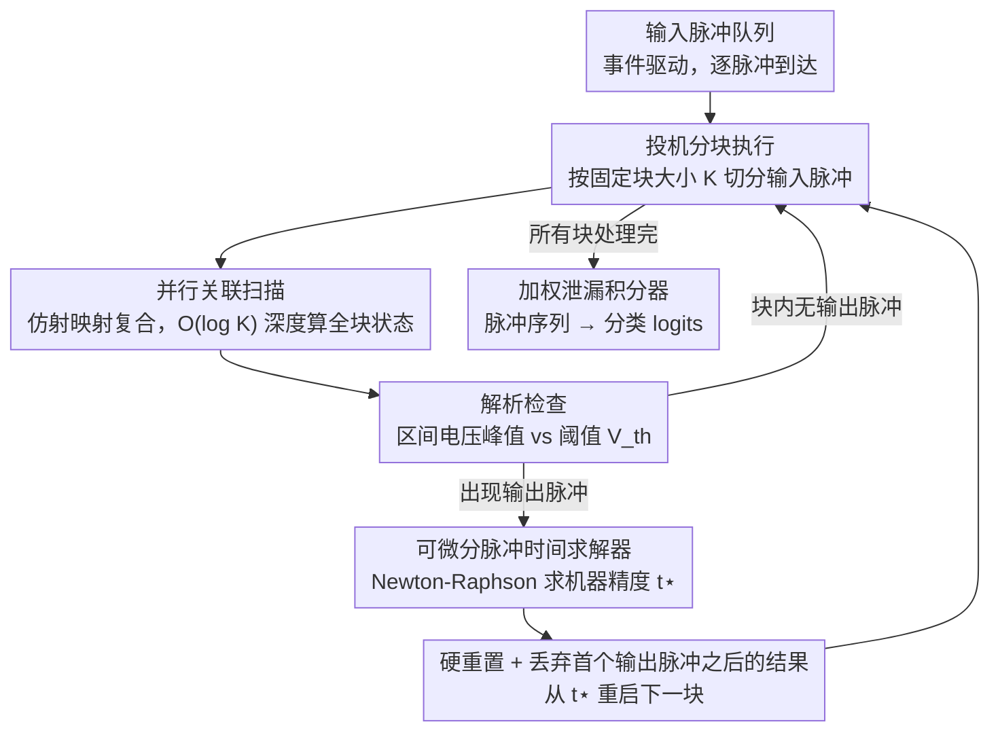

# Bullet Trains: Parallelizing Training of Temporally Precise Spiking Neural Networks

**会议**: ICML 2026  
**arXiv**: [2603.13283](https://arxiv.org/abs/2603.13283)  
**代码**: https://github.com/ToddMorrill/snn-bullet-trains  
**领域**: 脉冲神经网络 / 并行训练  
**关键词**: 脉冲神经网络, 并行关联扫描, 精确脉冲时间, 事件驱动, 神经形态计算

## 一句话总结

提出基于并行关联扫描（parallel associative scan）的脉冲神经网络并行训练方法，在保持精确硬重置动力学的同时实现最高 44 倍加速，并用可微分数值根求解器实现机器精度的脉冲时间计算。

## 研究背景与动机

**领域现状**：脉冲神经网络（SNN）以事件驱动方式处理信息，仅在脉冲出现时进行计算，这与生物神经计算和神经形态硬件的工作方式天然契合。然而当前 SNN 研究主要在 GPU 上进行训练，面临严重的并行化瓶颈。

**现有痛点**：SNN 的"充电—放电—重置"（charge–fire–reset）动力学本质上是顺序处理的——每消费一个输入脉冲后，神经元必须判断是否在下一个输入脉冲到达前产生输出脉冲。这导致训练时间与脉冲数量线性增长 $O(N)$，在 GPU 上效率极低。现有并行化方法要么完全移除重置机制（PSN），要么使用软重置近似（SPikE-SSM），要么将不连续的脉冲生成松弛为连续 sigmoid 代理（FPT），都偏离了精确的硬重置语义。

**核心矛盾**：并行化与精确硬重置动力学之间存在根本性矛盾——硬重置引入的非线性依赖阻断了完全并行化，而放弃硬重置会降低神经元的非线性表达力和生物保真度。此外，几乎所有现有实现都依赖离散时间网格，脉冲时间精度受限于时间步长，且同一时间窗内的脉冲顺序无法区分。

**本文目标**：(1) 在保持精确硬重置的前提下实现 SNN 脉冲事件的并行处理；(2) 实现不依赖离散时间近似的机器精度脉冲时间求解。

**切入角度**：作者观察到 LIF 神经元的亚阈值状态转移可以表示为仿射映射（affine map），而仿射映射的复合仍然是仿射映射，这天然满足关联扫描所需的结合律。通过分块投机执行（speculative chunked execution），可以在块内并行处理脉冲，同时通过解析检查快速定位输出脉冲。

**核心 idea**：用并行关联扫描一次性消费多个输入脉冲，结合 Newton-Raphson 根求解器精确定位脉冲时间，在完全保持硬重置语义的同时实现 GPU 上的大幅加速。

## 方法详解

### 整体框架

系统以事件驱动方式运行：每个 LIF 神经元维护一个输入脉冲队列，将输入脉冲按固定大小 $K$ 分块（chunk），每块内使用并行关联扫描一次性计算所有未来状态。通过解析检查判断块内是否存在输出脉冲，若存在则用 Newton-Raphson 求解器定位精确脉冲时间，执行硬重置后进入下一块。最终层使用加权泄漏积分器将脉冲序列转化为分类 logits。整个流程的计算深度为 $O(C \log K)$，其中 $C$ 为块数，$K$ 为块大小。

### 关键设计

**1. 并行关联扫描：把硬重置的顺序依赖绕过去**

SNN 训练慢的根子在于"充电—放电—重置"是逐脉冲串行的——每消费一个输入脉冲就要判断会不会在下一个输入到来前放电，于是训练时间随脉冲数 $O(N)$ 线性增长。本文的突破口是注意到 LIF 神经元的亚阈值状态转移可以写成仿射映射：从 $\mathbf{s}_0=[V_0,I_0]^\top$ 到 $\mathbf{s}_1=[V_1,I_1]^\top$ 满足 $\mathbf{s}_1=M_1\mathbf{s}_0+\mathbf{b}_1$，其中衰减矩阵 $M_1$ 由膜时间常数和突触时间常数决定、$\mathbf{b}_1$ 编码突触权重注入。仿射映射的复合仍是仿射映射

$$\text{Combine}\big((M_2,\mathbf{b}_2),(M_1,\mathbf{b}_1)\big)=(M_2M_1,\ M_2\mathbf{b}_1+\mathbf{b}_2)$$

天然满足关联扫描所需的结合律，于是一整块 $K$ 个脉冲的所有中间状态可以用 JAX 的 `associative_scan` 以 $O(\log K)$ 深度并行算出，把 $O(N)$ 串行压成 $O(C\log K)$ 并行深度。关联扫描本身在状态空间模型（SSM）里早已成熟，本文真正的贡献是把它搬进**带非线性硬重置**的 SNN——靠后面两个设计绕开重置带来的顺序依赖。

**2. 可微分脉冲时间求解器：用数值根求解换来机器精度与模型自由**

绝大多数 SNN 实现把时间离散成网格，脉冲精度受步长限制、同一时间窗内的脉冲先后还无法区分；而想要解析的脉冲时间又得对神经元模型施加 $\tau_m=2\tau_s$ 这类约束，把模型锁死。本文两头都不要：定义根函数 $R(\mathbf{p},t)=V(V_0,I_0,t)-V_{\text{th}}=0$，在每对相邻输入脉冲的区间里先解析算出电压峰值时刻 $t_{V_{\max}}$ 和峰值 $V(t_{V_{\max}})$ 判断有没有脉冲，再用 Newton-Raphson 迭代把精确脉冲时间 $t^\star$ 求到机器精度。区间内电压函数的单峰性保证了脉冲时间唯一、求解器收敛。梯度则不回溯求解器的每步迭代，而是由隐函数定理从 $R(\mathbf{p},t^\star)=0$ 直接得到 $\partial t^\star/\partial\mathbf{p}$，既简洁又省内存。这样既摆脱了离散化的时间分辨率损失和随步数线性增长的开销，又把神经元模型从解析约束里解放出来，允许异构时间常数。

**3. 投机分块执行：用 GPU 的并行红利兑掉硬重置的正确性代价**

关联扫描要求整块并行，可块内到底哪一步会放电、放电后要在何处硬重置，事先并不知道——这正是硬重置与并行的根本矛盾。本文的解法是"先投机、后验证"：预设固定块大小 $K$（如 128），对整块跑完关联扫描，再并行检查每对相邻输入区间是否触发输出脉冲；一旦块内出现输出脉冲，就丢弃首个输出脉冲之后的所有结果，在该脉冲时刻执行硬重置并从那里重启下一块，同时用每神经元最大输出脉冲数 $S_{\max}$ 配合脉冲计数正则保持稀疏发放。这套策略之所以划算，是因为神经元发放相对输入脉冲通常很稀疏，大多数块根本不产生输出脉冲、被丢弃的计算量极小，于是即便偶尔白算一点，整体吞吐量仍远超串行处理——这也是 44 倍加速的直接来源。

### 损失函数 / 训练策略

输出层使用 $N_{\text{cls}}$ 个加权泄漏积分器，通过指数衰减加权积分 $\int_0^{\tau_{\max}} e^{-t/\tau_{\text{LI}}} V(t) dt$ 将脉冲序列转化为 logits，早到的脉冲获得更高权重。使用交叉熵损失训练，辅以脉冲计数正则化器控制发放稀疏性。突触权重 $w_{ij}$ 和可学习突触延迟 $d_{ij}$ 通过精确梯度（非代理梯度）端到端优化。

## 实验关键数据

### 主实验

| 数据集 | 方法 | 精确梯度 | 连续脉冲时间 | 并行化 | 准确率 |
|--------|------|---------|-------------|--------|--------|
| MNIST | Göltz et al. (1F350H, $\tau_m=2\tau_s$) | ✓ | ✓ | ✗ | 97.20% |
| MNIST | Wunderlich & Pehle (1F350H) | ✓ | ✓ | ✗ | 97.60% |
| MNIST | **Ours** (1F350H) | ✓ | ✓ | ✓ | **98.04%** |
| SHD | Hammouamri et al. (2F256HD) | ✗ | ✗ | ✗ | **95.07%** |
| SHD | Mészáros et al. (2F512HD) | ✓ | ✗ | ✗ | 93.10% |
| SHD | **Ours** (2F512HD) | ✓ | ✓ | ✓ | 94.96% |
| SSC | Hammouamri et al. (2F512HD) | ✗ | ✗ | ✗ | **80.69%** |
| SSC | Mészáros et al. (2F512HD) | ✓ | ✗ | ✗ | 76.10% |
| SSC | **Ours** (2F512HD) | ✓ | ✓ | ✓ | 77.79% |

### 加速与消融

| 配置 | 加速倍数 | 说明 |
|------|---------|------|
| 最大加速（SHD） | 44× | 相对于顺序事件驱动基线 |
| chunk size = 128 | 最优 | 在多种 batch size 和隐藏维度下表现稳定 |
| Yin-Yang, $\Delta t \to 0$（连续） | 最高精度 | 完整时间分辨率 |
| Yin-Yang, $\Delta t = 1$ ms | 明显下降 | 离散化导致精度损失 |
| Yin-Yang, $\Delta t \geq 2$ ms | ~33%（随机） | 完全丧失时间编码能力 |

### 关键发现

- **并行关联扫描在保持精确硬重置的同时实现了高达 44 倍加速**，尤其在大 batch size 和大隐藏维度下优势显著，顺序方法在此场景下训练时间急剧增长
- **chunk size 128 是一个鲁棒的选择**，更大的 chunk 可提高并行度但也增加内存带宽压力和被丢弃计算量；实践中由于神经元稀疏发放，浪费计算不到总量的少数
- **连续脉冲时间对时间编码任务至关重要**：在 Yin-Yang ITD 任务上，$\Delta t \geq 2$ ms 的离散化导致准确率降至随机水平，而连续方法保持最高精度
- 在 SHD/SSC 上，本文方法略低于代理梯度方法（Hammouamri et al.），作者分析原因是当前基准主要依赖速率编码（rate-coding），代理梯度的平滑性在此类任务上有优势

## 亮点与洞察

- **从 SSM 到 SNN 的关联扫描迁移**：将状态空间模型中成熟的并行关联扫描技术迁移到具有非线性硬重置的 SNN，投机执行策略是关键的适配创新——这是一种"先并行后修正"的范式，在其他存在条件性分支的并行问题中也有潜在应用
- **隐函数定理求梯度**：不回溯求解器迭代步骤，而是通过 $R(\mathbf{p}, t^\star) = 0$ 的隐函数定理直接获得脉冲时间对参数的梯度，既简洁又高效。这一技术可迁移到任何涉及可微分根求解的场景
- **数值求解器解放神经元模型**：传统解析方法要求 $\tau_m = 2\tau_s$ 等约束，数值方法打破了这一限制，使得异构时间常数和更复杂的神经元模型成为可能

## 局限与展望

- 目前仅验证了全连接前馈架构，**未扩展到卷积或递归 SNN**——递归网络中每个神经元的输入队列是动态的，并行化更具挑战性
- 当前基准（SHD, SSC）**主要依赖速率编码**，未能充分发挥连续脉冲时间的优势。社区缺乏大规模的严格时间编码基准
- 固定计算预算（chunk 数量 $C$ 和输出脉冲上限 $S_{\max}$）在极端高发放率场景下可能导致部分输入脉冲未被处理
- 未在实际神经形态硬件上验证连续脉冲时间训练对部署的影响

## 相关工作与启发

- **PSN** (Fang et al., 2023)：移除重置机制，退化为可用卷积求解的线性滤波器，高效但丧失非线性表达力
- **SPikE-SSM** (Zhong et al., 2024)：解耦重置与积分，使用软重置（线性减法）而非硬重置
- **FPT** (Feng et al., 2025)：通过不动点迭代扫描建模硬重置，但前向传播需松弛为连续 sigmoid 以保证收敛
- **EventProp** (Wunderlich & Pehle, 2021)：连续时间精确梯度 SNN 训练，但顺序处理，本文的并行化方法可视为其加速版本

<!-- RELATED:START -->

## 相关论文

- [\[ICLR 2026\] Training Deep Normalization-Free Spiking Neural Networks with Lateral Inhibition](../../ICLR2026/others/training_deep_normalization-free_spiking_neural_networks_with_lateral_inhibition.md)
- [\[CVPR 2026\] Robust Spiking Neural Networks by Temporal Mutual Information](../../CVPR2026/others/robust_spiking_neural_networks_by_temporal_mutual_information.md)
- [\[CVPR 2026\] On the Role of Temporal Granularity in the Robustness of Spiking Neural Networks](../../CVPR2026/others/on_the_role_of_temporal_granularity_in_the_robustness_of_spiking_neural_networks.md)
- [\[AAAI 2026\] ParaRevSNN: A Parallel Reversible Spiking Neural Network for Efficient Training and Inference](../../AAAI2026/others/pararevsnn_a_parallel_reversible_spiking_neural_network_for_efficient_training_a.md)
- [\[AAAI 2026\] TDSNNs: Competitive Topographic Deep Spiking Neural Networks for Visual Cortex Modeling](../../AAAI2026/others/tdsnns_competitive_topographic_deep_spiking_neural_networks_for_visual_cortex_mo.md)

<!-- RELATED:END -->
