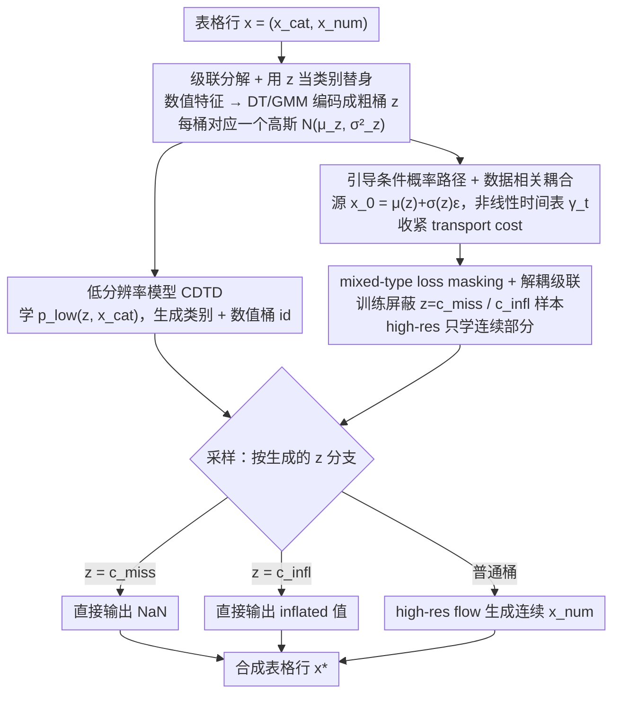

# Cascaded Flow Matching for Heterogeneous Tabular Data with Mixed-Type Features

**会议**: ICML 2026  
**arXiv**: [2601.22816](https://arxiv.org/abs/2601.22816)  
**代码**: https://github.com/muellermarkus/tabcascade  
**领域**: 扩散模型 / 表格数据生成 / 生成式建模  
**关键词**: Flow matching、级联扩散、表格数据、混合型特征、缺失值生成

## 一句话总结
TabCascade 把表格行拆成"低分辨率（类别 + 数值的离散化版本）"与"高分辨率（连续数值）"两段级联：先用 CDTD 学低分辨率联合分布，再用 flow matching 在低分辨率引导下生成数值细节，并通过数据相关耦合 + 可学非线性时间表收紧 transport cost；天然支持缺失值、零膨胀等"混合型特征"的生成，在 12 个数据集上 detection score 比 SOTA 提升 51.9%。

## 研究背景与动机
**领域现状**：表格数据生成是金融、医学、问卷等场景的核心需求。主流方法（TabDDPM、TabSyn、CDTD、TabDiff）把类别和数值特征塞进一个共享 diffusion/flow 目标里。

**现有痛点**：(1) 类别和数值结构截然不同（离散支撑 vs 连续密度、概率质量 vs 概率密度），用单一目标会让某些特征隐式主导训练；(2) **混合型特征**（mixed-type，如零膨胀工资、缺失值、删失值）是连续密度叠加离散点质量的分布，现有扩散模型完全无法处理 —— 它们能 train 在含缺失值的数据上但生成时只会吐出连续值，不会输出 NaN 或精确的零；(3) 文献证据显示数值特征比类别特征明显更难学（detection score 在 num 上远低于 cat）—— 但当前模型用同一容量处理两者。

**核心矛盾**：异质特征 + 混合型分布的双重困难 —— 单一统一目标无法同时 (a) 平衡类别 vs 数值的相对重要性、(b) 精确放置点质量在特定离散值（如 0、NaN）、(c) 让数值的剩余连续部分有足够表达力。

**本文目标**：(1) 把"难学的数值细节"与"易学的类别结构"解耦，让每种特征用专门模型；(2) 在生成 pipeline 中显式编码"该位置是缺失/零膨胀/正常值"的离散决策；(3) 借鉴图像 cascaded diffusion 的思路引入"低分辨率引导高分辨率"机制以减小 transport cost。

**切入角度**：图像 cascaded diffusion (Imagen) 用低分辨率版本指导高分辨率细节生成。作者把这个 metaphor 移植到表格 —— 把"类别特征 = 低分辨率"+"数值特征 = 高分辨率"两类信息分别建模。

**核心 idea**：分解 $p_\theta(x_{cat}, x_{num}) = \sum_z p_\theta^{\text{high}}(x_{num} | z, x_{cat}) p_\theta^{\text{low}}(z, x_{cat})$，其中 $z$ 是数值特征的离散化版本（用 decision tree 或 GMM 求得），既作 conditioning 又能表达 mixed-type 的离散状态。

## 方法详解

### 整体框架
TabCascade 把表格行 $x = (x_{cat}, x_{num})$ 扩展为 $x_{low} = (x_{cat}, z)$ 与 $x_{num}$ 两部分。**(1) 离线**：对每个数值特征 $x^{(i)}_{num}$ 训 Distributional Regression Tree (DT) 或 GMM 编码器 $\text{Enc}_i$，输出 $z^{(i)} = \text{Enc}_i(x^{(i)}_1)$ 作为粗桶 id；每个桶对应一个高斯组件 $\mathcal{N}(\mu_{z^{(i)}}, \sigma^2_{z^{(i)}})$。**(2) Low-resolution model**：用 CDTD 学 $p_\theta^{\text{low}}(z, x_{cat})$，generate categorical + 数值桶 id。**(3) High-resolution model**：以 $z, x_{cat}$ 为条件用 flow matching 生成数值细节 $x_{num}$。**(4) Sampling**：先采 $z, x_{cat} \sim p_\theta^{\text{low}}$；若 $z^{(i)} = c_{miss}$ 直接输出 NaN，若 $= c_{infl}$ 直接输出 inflated 值，否则用 high-res flow 生成连续值。

### 关键设计

**1. 级联分解 + 用 $z$ 当类别替身：把难学的数值生成拆成"先定粗桶、再补细节"**

表格扩散的真正瓶颈在数值特征——它比类别难学得多，而把缺失值、零膨胀这类离散点质量混进连续密度里更是单一目标搞不定的。本文借图像 cascaded diffusion 的思路把数值特征 $x^{(i)}_{num}$ 先用 Distributional Regression Tree（或 GMM）编码成粗桶 id $z^{(i)}=\text{Enc}_i(x^{(i)})$，每个 leaf 对应一个高斯分量 $\mathcal{N}(\mu_{z},\sigma^2_{z})$。这一步同时干了两件事：链规则保证当 $z$ 与 $x_{num}$ 不独立时 $H(x_{num}|z,x_{cat})<H(x_{num}|x_{cat})$，于是高分辨率模型的任务变简单；而 mixed-type 的离散状态被自然装进 $z$——遇到缺失值就开一个独立类别 $c_{miss}$、推断到 $\sigma_z^2\approx0$ 的桶就当 inflated value 直接输出 $\mu_z$。把整个分布写成

$$p_\theta(x_{cat},x_{num})=\sum_z p_\theta^{\text{high}}(x_{num}\mid z,x_{cat})\,p_\theta^{\text{low}}(z,x_{cat})$$

类别 / 数值各用专门模型，既消掉了 CDTD 那种"必须调相对 loss 权重"的难题，又把离散点质量卸载给低分辨率模型、让高分辨率模型只管连续部分。

**2. 引导条件概率路径 + 数据相关耦合：用 $z$ 把源分布绕到目标桶附近**

标准 flow matching 从各向同性高斯 $x_0\sim\mathcal{N}(0,I)$ 出发，源和目标隔得远、传输距离大。TabCascade 用低分辨率信息 $z$ 引导高分辨率 flow 的源分布与时间表来收紧 transport cost：一是数据相关耦合 $x_0=\mu(z)+\sigma(z)\varepsilon$，让源直接落在目标桶附近；二是特征专属的非线性时间表 $\gamma_t(x_{low}):t\to[0,1]^{K_{num}}$，用 5 阶多项式参数化、闭式可导。最终概率路径与引导 vector field 为

$$x_t=\gamma_t(x_{low})x_1+(1-\gamma_t(x_{low}))[\mu(z)+\sigma(z)\varepsilon],\quad u_t(x_t\mid x_1,x_{low})=\frac{\dot{\gamma}_t(x_{low})(x_1-x_t)}{1-\gamma_t(x_{low})}$$

Theorem 1 证明 DT 派生的耦合严格收紧了 transport cost bound、比独立耦合更易学，图 3 也直观显示这种耦合下 $p_0$ 已非常接近 $p_1$——省下来的模型容量正好用来学数值细节。

**3. mixed-type loss masking + 解耦级联：让高分辨率模型完全不碰离散状态**

传统模型必须同时学"该不该缺失"和"非缺失时是多少"，两者梯度互相干扰。既然离散决策已经被 $z$ 和低分辨率模型完全接管，高分辨率模型就该专注连续细节。具体做法是训练 high-res 时把 $z=c_{miss}$ 或 $c_{infl}$ 的样本的 CFM loss 直接屏蔽（不参与），因为它们已被 $p_\theta^{\text{low}}$ 决定；生成时也按 $z$ 走分支——离散就直接吐固定值（NaN / inflated），连续才跑 flow。这种"分而治之"把两件本质不同的事彻底拆开，是 TabCascade 既能原生生成混合型特征、又不需要跨类型 loss 平衡的根本原因。

### 损失函数 / 训练策略
Low-res：复用 CDTD 的 score interpolation loss。High-res：CFM loss $\mathcal{L}_{\text{CFM}} = \mathbb{E} \| u_t^\theta(x_t | x_{low}) - \dot{\gamma}_t(x_{low})(x_1 - [\mu(z) + \sigma(z) \varepsilon]) \|^2$，其中 $u_t^\theta = \dot{\gamma}_t \cdot f^\theta(x_t, x_{low}, t)$。两段独立训练，无需平衡跨类型 loss 权重 —— 这是相比 CDTD 的关键工程简化。

## 实验关键数据

### 主实验
12 个标准表格数据集 × 7 个 SOTA 对比，平均结果：

| 指标 | TabDDPM | TabSyn | TabDiff | CDTD | **Ours (DT)** |
|------|---------|--------|---------|------|-------|
| Detection Score↑ | 0.478 | 0.202 | 0.430 | 0.518 | **0.787** |
| Shape↑ | 0.938 | 0.927 | 0.954 | 0.970 | **0.984** |
| Shape (num)↑ | 0.943 | 0.918 | 0.952 | 0.962 | **0.985** |
| WD (num)↓ | 0.015 | 0.031 | 0.016 | 0.009 | **0.004** |
| JSD (cat)↓ | 0.083 | 0.063 | 0.030 | 0.020 | **0.018** |
| Trend↑ | 0.900 | 0.893 | 0.924 | 0.956 | **0.965** |

Detection score 从 CDTD 的 0.518 提升到 0.787，相对提升约 52%（论文摘要里 51.9% 的数字来源）；数值特征的 WD 比 CDTD 砍掉一半以上 (0.009→0.004)。

### 消融实验
动机性实验（来自 Figure 2）：

| 配置 | 检测分数 | 说明 |
|------|---------|------|
| 平均 diffusion baseline 在仅 cat 特征上 | ~0.85 | 类别简单 |
| 平均 diffusion baseline 在仅 num 特征上 | ~0.55 | 数值难 |
| Ours 在 cat / num / 全部 上 | ~0.85+ 全段 | 解耦后 num 不再拖后腿 |
| CDTD adult 上调 cat loss weight=1×→4× | 0.72 → 0.76 | 必须人工 tune balance |

### 关键发现
- **数值生成质量是表格扩散的真正瓶颈**：解耦后数值的 WD 从 0.009 直接降到 0.004，是过去几代模型挤不出来的进步；类别本来就接近 1，能保持持平已是 SOTA。
- **mixed-type 支持是质变能力**：所有 baseline（包括最强的 CDTD/TabDiff）在原生形态都不能生成 NaN / 精确 0；TabCascade 是首个原生支持的扩散模型。
- **DT 编码器优于 GMM**（论文 appendix），因为 DT 的 leaf 节点能依赖其他特征划分，提供更有信息量的 $z$。
- **无需 tune loss balance**：CDTD 要 grid-search 相对权重才能涨点，TabCascade 因为两段独立训练完全规避了这一痛点。
- 12 个数据集上方差小（detection std 仅 0.243 vs CDTD 0.296）—— 说明方法更稳健。

## 亮点与洞察
- **"图像 cascaded diffusion 移植到表格"的概念翻译**非常聪明：表格本来没有"分辨率"概念，作者用"类别 = 低分辨率"+"数值 = 高分辨率"把这个 metaphor 落地，理论上 $H(x_{num} | z, x_{cat}) < H(x_{num} | x_{cat})$ 严格证明任务变简单。
- **Mixed-type generation 真正打到痛点**：现实表格里缺失值往往是 informative 的（问卷拒答暗示性格、医疗缺测暗示风险），生成时能精确放置 NaN 对下游 imputation / counterfactual analysis 是颠覆性的。
- **数据相关耦合的 Theorem 1**：DT 编码器派生耦合严格收紧 transport cost bound —— 与近来 mini-batch OT couplings (Tong 2024) 同向但零额外开销，可以直接迁移到任何 flow matching 场景。
- **彻底规避"loss balance"困扰**：CDTD 系列工作花了大量心思设计跨类型 loss 平衡，TabCascade 用 cascade 一刀切，提示我们在异质数据上"分而治之"往往比"统一目标"工程上更可行。
- 整体思路（cascade + 离散状态显式建模 + 引导路径）可迁移到：时间序列含缺失、电子病历多模态、多模态推荐特征。

## 局限与展望
- **两段训练增加复杂度**：要先训 encoders → 训 low-res → 训 high-res，pipeline 长；与一段式 CDTD 相比工程上重一些。
- **encoder 质量决定上限**：若 DT 桶划分不好，$z$ 不能提供有效引导，level 2 cascade 失效；高基数 (cardinality) 类别上 DT 可能过拟合。
- **对相关性破坏的风险**：把数值离散化为 $z$ 时若 binning 太粗，跨特征的细粒度相关性会丢失；论文 Trend (mixed) 仅 0.928，比 cat-only Trend 略低。
- **生成 latency 翻倍**：两个模型串行采样比单模型慢；缺乏速度对比数据。
- 改进方向：(a) 把 encoder 学到 end-to-end；(b) 探索更多级 cascade（粗 → 中 → 细）；(c) 把 mixed-type 框架推广到 censored survival data；(d) 联合 imputation 模型实现"生成 + 补全"统一。

## 相关工作与启发
- **vs TabDDPM / CoDi**：那些把多项式扩散和 DDPM 拼一起，没解决数值难学问题；TabCascade 显式分阶段。
- **vs TabSyn**：用 latent diffusion 把所有特征压到连续空间，但 (Mueller 2025) 已证明 latent diffusion 在表格不如 data space；TabCascade 留在 data space 同时分级。
- **vs CDTD / TabDiff**：同 Mueller 团队的前作，TabDiff/CDTD 学 joint noise schedule 解决异质性；TabCascade 把"异质性"重新定义为"分辨率"问题，思路更彻底。
- **vs Cascaded Diffusion (Ho 2022) / Imagen**：方法学谱系直接来自图像 cascade，但表格里没有"super resolution"的物理意义，作者通过特征类型重新解释；同时引入 mixed-type 生成是表格独有的贡献。
- **vs Sahoo 2024 (latent noise schedule)**：那个工作让 noise schedule 依赖于 latent，是 cascade 的弱化版；TabCascade 显式生成 $z$ 而不是隐变量化，更可解释。

## 评分
- 新颖性: ⭐⭐⭐⭐⭐ 首个表格 cascaded diffusion + 首个能生成混合型特征 (NaN / inflated) 的方法，概念翻译漂亮、理论扎实。
- 实验充分度: ⭐⭐⭐⭐⭐ 12 个数据集、7 个 SOTA、动机/主结果/MIA/MLE/消融全覆盖，方差也报齐。
- 写作质量: ⭐⭐⭐⭐⭐ 动机有 Figure 2 数据驱动支撑、理论有 Theorem 1 严格论证、流程图清晰，是表格生成论文里少见的"全栈水准"。
- 价值: ⭐⭐⭐⭐⭐ 解决了表格生成两个长期未解的痛点 (mixed-type + 数值精度)，detection score 跳跃式提升 52%，对合成数据 / privacy-preserving release / imputation 产业链是颠覆性进展。

<!-- RELATED:START -->

## 相关论文

- [\[CVPR 2026\] Bidirectional Normalizing Flow: From Data to Noise and Back](../../CVPR2026/others/bidirectional_normalizing_flow_from_data_to_noise_and_back.md)
- [\[ICLR 2026\] TabStruct: Measuring Structural Fidelity of Tabular Data](../../ICLR2026/others/tabstruct_measuring_structural_fidelity_of_tabular_data.md)
- [\[ICML 2025\] Score Matching with Missing Data](../../ICML2025/others/score_matching_with_missing_data.md)
- [\[NeurIPS 2025\] Radar: Benchmarking Language Models on Imperfect Tabular Data](../../NeurIPS2025/others/radar_benchmarking_language_models_on_imperfect_tabular_data.md)
- [\[AAAI 2026\] Cash Flow Underwriting with Bank Transaction Data: Advancing MSME Financial Inclusion in Malaysia](../../AAAI2026/others/cash_flow_underwriting_with_bank_transaction_data_advancing_msme_financial_inclu.md)

<!-- RELATED:END -->
