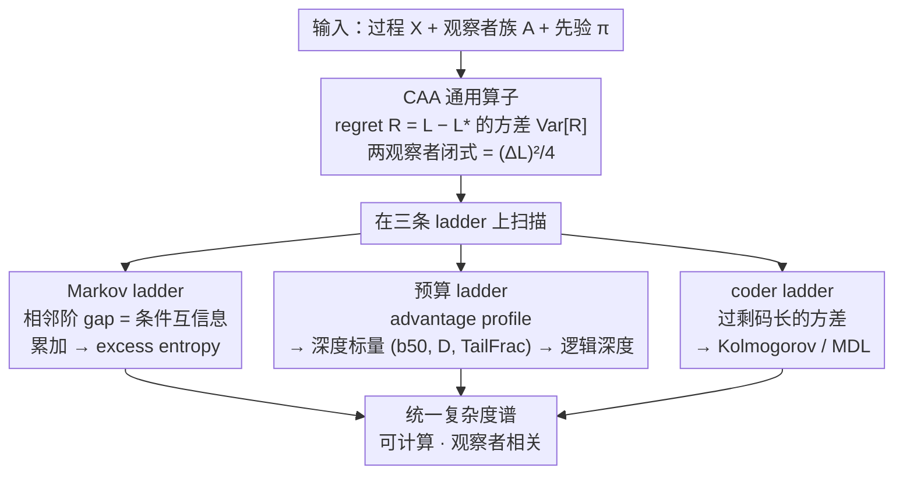

# Complexity as Advantage: A Regret-Based Perspective on Emergent Structure

**会议**: ICML 2026  
**arXiv**: [2511.04590](https://arxiv.org/abs/2511.04590)  
**代码**: 无  
**领域**: 理论/ML 基础  
**关键词**: 复杂度度量, 后悔分散, 信息论, 逻辑深度, MDL

## 一句话总结
本文提出 Complexity-as-Advantage (CAA)：把"复杂度"重新定义为一族**资源受限观察者**在同一过程上的**后悔（regret）分散程度**，并证明它在 log-loss + Markov 框架下等价于条件互信息原子之和（恰好恢复 excess entropy），在编码视角下等价于过剩描述长度的方差（MDL），从而把 Kolmogorov 复杂度、Bennett 逻辑深度、excess entropy 统一成一个**可计算、可经验估计**的标量谱。

## 研究背景与动机

**领域现状**：复杂度有一堆经典定义——Shannon 熵刻画不确定性、Kolmogorov 复杂度 $K(x)$ 是最短程序长度、Bennett 逻辑深度刻画"展开结构所需的计算量"、Crutchfield 的 excess entropy 度量预测信息。每个都从某个角度抓住了"结构"的一面。

**现有痛点**：作者用一个直觉问题点出问题——为什么 Shakespeare 文本和随机噪声在 gzip 下压缩比相近，但大语言模型能轻松学前者却束手于后者？经典度量要么把这两类**混为一谈**（如熵率），要么**不可计算**（如 $K(x)$），要么**不依赖观察者资源**（看不到"谁能挖出结构"这件事）。

**核心矛盾**：复杂度的"有用性"本质上是**相对于观察者能力**的——只有当强观察者能稳定地比弱观察者预测得更好时，这个源才"有结构可挖"。而经典定义大多是**单一标量**或**绝对量**，无法表达"结构对谁可见"。

**本文目标**：构造一种复杂度度量，使其同时满足 (i) 可计算（用 regret 估计）；(ii) 观察者相关（显式依赖观察者族）；(iii) 兼容经典理论（极限下能回到熵、MI、逻辑深度）；(iv) 能在经验上分离 shallow / chaotic / deep 三类过程。

**切入角度**：与其问"这个序列有多复杂"，不如问"在一族观察者上，他们的后悔分散有多大"。如果所有观察者后悔相同（一齐弱或一齐强），说明这个源的结构对该观察者族**不区分**；只有当存在显著的 regret 散布时，结构才真正"可被利用"。

**核心 idea**：将复杂度定义为 regret 在观察者分布上的**方差**（或最大 gap），即把"结构"刻画为"哪些观察者能比哪些观察者占到便宜"的**分散程度**。

## 方法详解

### 整体框架

CAA 是一个**通用算子**，输入三要素：
- 过程 $X = (X_u)_{u \in I}$（时间序列、空间格点、图节点皆可）；
- 观察者族 $\mathcal{A}$（任意一组预测器/编码器）；
- 观察者上的参考分布 $\pi$。

输出一个标量 $\mathrm{CAA}(X; \mathcal{A}, \pi)$，刻画该过程在这一族观察者上的 regret 分散。论文不引入新模型、不训练新网络，而是把"复杂度"翻译成一个**可估计的统计量**，再证明它在三种特化场景（Markov ladder、预算 ladder、coder ladder）下分别等价于经典量。

整体管线：
1. 选定 $X$ 与 $\mathcal{A}$；
2. 对每个 $A \in \mathcal{A}$ 估计平均损失 $L(A; X)$ 与 regret $R(A;X) = L(A;X) - L^*(X)$；
3. 在 $\pi$ 下计算 $\mathrm{Var}_{A \sim \pi}[R(A;X)]$ 或最大 gap，得到 CAA；
4. 在不同 ladder（Markov 阶数、计算预算、编码器集合）上扫描，得到"advantage profile"，进一步抽取标量指标。

全文的骨架就是一个**共同定义 → 三条 ladder → 各自回到一个经典量**的分叉收敛结构：一个 regret 方差算子，在 Markov ladder 上回到 excess entropy、在预算 ladder 上回到逻辑深度、在 coder ladder 上回到 Kolmogorov/MDL，最终汇成一个可计算、观察者相关的复杂度谱。

### 关键设计

**1. CAA 的通用定义与两观察者闭式解：把"结构对谁可见"变成一个可算的标量**

经典复杂度要么不可计算（$K(x)$）、要么看不见观察者（熵率），于是 Shakespeare 和噪声在 gzip 下被混为一谈。CAA 的破局点是换问题：不问"这序列有多复杂"，而问"一族观察者在它上面的后悔分散有多大"。形式上，渐近平均损失 $L(A;X) = \limsup_{|\Lambda|\to\infty}\frac{1}{|\Lambda|}\sum_{u\in\Lambda}\ell(\hat{y}^A_u, X_u)$，最优损失 $L^*(X) = \inf_A L(A;X)$，regret $R(A;X)=L(A;X)-L^*(X)$，复杂度就定义为后悔在观察者分布上的方差

$$\mathrm{CAA}(X;\mathcal{A},\pi) = \mathrm{Var}_{A\sim\pi}[R(A;X)],$$

并配一个 max-gap 变体 $\mathrm{CAA}_{\max}(X) = \sup_{A,B}|R(A;X)-R(B;X)|$。对两观察者 $\{A_{\text{naive}},A_{\text{soph}}\}$ 在 uniform prior 下有干净闭式 $\mathrm{CAA}(X)=\tfrac14(\Delta L)^2$（$\Delta L=L_{\text{naive}}-L_{\text{soph}}$），直接把 CAA 和大家熟悉的 "performance gap" 接通。这样设计的好处是一石二鸟：把绝对属性改写成相对一族观察者的统计量，既绕开了不可计算性，又把"资源受限"显式编码进去——观察者族本身就是资源。

**2. Markov ladder 下的 CAA 分解：CAA gap 即条件互信息原子，累加即 excess entropy**

光给个新定义还不够，得证明它不是凭空发明、而能接回信息论。在 log-loss 下，order-$m$ Markov 预测器的损失恰是条件熵 $L(A^{(m)};X)=H(X_t\mid X_{t-1},\dots,X_{t-m})$，于是相邻阶之差

$$\Delta L_m = L(A^{(m-1)};X)-L(A^{(m)};X) = I(X_t; X_{t-m}\mid X_{t-1}^{t-m+1})$$

正好是一个条件互信息原子。累加可望远镜消去成 $\sum_{m=1}^{M}\Delta L_m = H(X_t)-H(X_t\mid X_{t-1}^{t-M})$，$M\to\infty$ 时收敛到 excess entropy $E=I(X_{-\infty}^{t-1};X_t)$（$K$-阶 Markov 源在 $m=K$ 处精确截断）。这条等式的意义在于把"每延伸一格上下文带来的实际预测红利"和"整源可预测信息总量"等同起来——CAA 因此不是工程量，而是 excess entropy 的细粒度版，能告诉你那点红利究竟在哪一阶才被解锁。

**3. 预算 ladder + 标量深度指标：把不可计算的 Bennett 逻辑深度变成可测量**

Bennett 逻辑深度（展开结构所需的计算量）理论漂亮但既要 $K$ 又要时间，根本算不出来。CAA 用"计算预算"作观察者梯子来操作化它：取观察者族 $\{A^{(b)}\}$，$b$ 表示搜索深度、rollout 长度、CA 邻域半径等预算，相邻预算的 gap $\Delta L_b=L(A^{(b-1)};X)-L(A^{(b)};X)\ge 0$ 都是一个两阶 CAA gap。从 profile $\{\Delta L_b\}$ 抽三个标量——tail 占比 $\mathrm{TailFrac}_\alpha=\sum_{j>\lfloor\alpha B\rfloor}\Delta L_j/\sum_j\Delta L_j$、半质量预算 $b_{50}=\min\{b:\sum_{j\le b}\Delta L_j\ge M/2\}$、归一化深度分 $D=\frac{1}{B}\sum_b b\,\Delta L_b/\sum_b\Delta L_b$。三者一起就能把过程干净分类：shallow（如 Rule 90）红利前置，$b_{50}$ 与 $D$ 都小；deep（如 Rule 110）红利后置，tail fraction 与 $D$ 都大；chaotic（Rule 30）整体红利都很小。它保留了"deep = 晚才能挖出"的直觉，却第一次能在元胞自动机、密码学等具体场景上真的算出数。

**4. coder ladder 下的 CAA：过剩码长的方差，把 Kolmogorov/MDL 从"绝对复杂度"改写成"优势势能"**

第三条 ladder 把 CAA 接回 Kolmogorov 复杂度与 MDL。经典的 $K(x^n)$ 是最短程序长度、不可计算，实用压缩器只能给上界 $K(x^n)\le L_n(A;x^n)+O(1)$；MDL 用一个编码器近似但只吐出单一标量。CAA 的做法是把"损失"换成码长——无损编码器 $A$ 的 per-symbol 码长 $\bar L_n(A;x^n)=\tfrac1n L_n(A;x^n)$（概率编码器下恰等于 log-loss），过剩码长 $R_n(A;x^n)=\bar L_n(A;x^n)-\min_{B\in\mathcal{A}}\bar L_n(B;x^n)$，在一族编码器上取方差就是 CAA。它度量的是"不同编码策略能差多远"：所有编码器都渐近最优、或都对 i.i.d. 噪声无能时 regret 一致、CAA$\approx 0$，只有当某些编码器能挖到别人挖不到的结构时 CAA 才显著。这一步把 KC/MDL 从"这串序列有多复杂"重新定义为"哪种编码器能占到多少便宜"，也正是 gzip/bz2/huffman 消融的理论依据——Huffman 只抓零阶频率、LZ 类能用长程依赖，于是一旦把 Huffman 加进观察者集合，周期串和自然文本上的 CAA 立刻被拉开、纯噪声却纹丝不动。至此三条 ladder（Markov / 预算 / coder）在同一个方差公式下分别恢复 excess entropy、逻辑深度、Kolmogorov/MDL，构成本文"理论三合一"的核心。

### 损失函数 / 训练策略

本文是理论 + 经验诊断框架，**没有训练任何模型**。所有"损失"都是观察者预测的 log-loss $\ell(x, \hat{P}) = -\log_2 \hat{P}(x)$（或编码器的 bits-per-symbol）。估计协议是经典的在线平均：对 $N$ 长序列计算 online log-loss 均值，对 $B$ 条独立重采样求 $\Delta L$ 与 CAA 的均值/std。Markov 预测器用 Laplace 平滑 $\alpha = 1$；密码学 ladder 中关键的"对齐"细节是把 burn-in 与加密起点对齐，并对 Search 观察者重置 key phase。

## 实验关键数据

### 主实验

实验 I：可调源上 CAA 的 U 形曲线。源是 Bernoulli 混合——以概率 $p$ 输出固定周期模板，以概率 $1-p$ 输出公平硬币，因此 $p=0$ 是纯噪声、$p=1$ 是纯周期、中间是带噪周期。两对观察者：Pair A（period-2 上 order-1 vs order-3）、Pair B（period-6 上 order-3 vs order-5）。

| 观察者对 | $p \approx 0$（纯噪声） | $p \approx 1$（纯周期） | 中间区间 | 行为 |
|---|---|---|---|---|
| Pair A (k=1 vs k=3, period-2) | $\Delta L$ 小 | $\Delta L$ 大（order-1 锁不住相位） | 单调上升 | 近乎单调，反映强观察者一直占优 |
| Pair B (k=3 vs k=5, period-6) | $\Delta L$ 小 | $\Delta L$ 小（两阶都够用） | 峰值在中间 | 经典 U 形：CAA 仅在"半结构"区显著 |

→ 验证 CAA 抓住了"结构是否可被利用"——既不是噪声也不是平凡周期，而是**中等强度的潜在规律**才让强观察者真正占便宜。

实验 II：相对论性复杂度（HMM vs 密码源 × 统计 vs 搜索观察者）。HMM 是 sticky transition + 偏射出，crypto 源是周期密钥 XOR 交替明文。

| 源 \ 观察者 | Stat | Search | CAA$_{\max}$ |
|---|---|---|---|
| HMM | order-$k$ Markov | XOR-seeker（无 key 退化为 Markov） | Stat/Stat=0.135, Stat/Search=0.135（几乎相同） |
| Crypto | order-$k$ Markov | XOR-seeker（有 key 后立即解密） | Crypto/Stat=0.536, Crypto/Search=**0.963** |

→ 同一个密码源，对统计观察者几乎"无结构"（看着像 i.i.d.），但对搜索观察者结构**全开**，CAA gap 高达 0.963 bits，直接展示"复杂度是观察者相关的"这一核心论点。

### 消融实验

CA ladder 上的标量深度指标（$k=20$）：

| 过程 | TailFrac$_{2/3}$ | $b_{50}$ | $D$ | 解读 |
|---|---|---|---|---|
| Rule 90 (shallow, additive) | 1.00 | 20 | 1.00 | gain 全堆在小 $b$ 上，前置 |
| Rule 30 (chaotic) | 0.22 | 2 | 0.29 | 几乎无 gain，整体噪声化 |
| Rule 110 (deep, Turing-complete) | 0.40 | 7 | 0.42 | gain 延迟到大 $b$ 才显现 |

→ 三个标量同时能干净地把 shallow / chaotic / deep 分开，Rule 110 的 deep 特征（gain 后置）在 $b_{50}$ 和 $D$ 上都比 Rule 30 高。

观察者集合消融（gzip/bz2 编码视角）：

| 源 | $\mathcal{A}_1=\{$gzip, bz2$\}$ | $\mathcal{A}_2=\{$huffman, gzip, bz2$\}$ | 变化 |
|---|---|---|---|
| Simple order | 0.000 | 1.269 | +1.269 |
| Chaos (i.i.d.) | 0.002 | 0.002 | 0.000 |
| Structured text | 0.194 | 1.203 | +1.009 |

→ Huffman 只看零阶频率，LZ 类（gzip/bz2）能用长程依赖，加入 Huffman 后 CAA 在"周期"和"自然文本"上大幅上升，但对纯噪声不动。直接证明 CAA 对观察者族敏感、对"哪种结构对哪种观察者可见"诊断准确。

### 关键发现

- **U 形曲线是 CAA 的指纹**：纯噪声/纯结构都让 CAA 趋零，只有"半可学"区间才显著——这正是机器学习中"有趣数据集"出现的位置。
- **CAA 是观察者相对的**：同一密码源，加 / 不加密钥搜索能让 CAA 从 0.536 跳到 0.963；加 / 不加 Huffman 能让 CAA 从 0 跳到 1.27。复杂度不是源的孤立属性，而是源 × 观察者族的联合产物。
- **预算阶梯几乎完美对应逻辑深度**：Rule 110 的 deep 性质（计算复杂、Turing-complete）通过 $b_{50}, D, \mathrm{TailFrac}$ 三个标量一致地被刻画出来，验证了"深度 = gain 出现得晚"这一操作化解读。
- **截断与控制实验显示鲁棒性**：block-shuffle 会拆散长程依赖、把 Huffman–LZ 之间的 gap 抹平，CAA 相应下降；加 run-length encoder 会闭合周期串上的 gap。CAA 的变化方向严格符合"是否还有结构可挖"的直觉。

## 亮点与洞察

- **把"观察者依赖"提升为一等公民**：传统复杂度要么忽视观察者，要么藏在"通用图灵机选择"里。CAA 干脆把观察者族 $\mathcal{A}$ 和先验 $\pi$ 写进定义本身，于是同一个源在不同 $\mathcal{A}$ 下可以有完全不同的复杂度——这与机器学习里"数据集对不同架构难度不同"的直觉完美贴合。
- **统一性极强但又非平凡**：CAA 在 log-loss + Markov 极限下等于 excess entropy 的分解，在 MDL 视角下等于过剩描述长度的方差，在预算阶梯上恢复 Bennett 逻辑深度——三条等价路径在同一个方差公式下汇合，是少见的"理论三合一"。
- **可迁移到 ML 实务**：作者已经勾出三个方向——dataset difficulty（scaling laws 缺的"结构判据"）、inductive bias（架构 = 观察者族，bias 有效 ⇔ 该族的 regret 显著低）、intrinsic motivation（curiosity 奖励 = advantage potential）。每条都把现有启发式 grounded 到一个信息论标量上。
- **CA 案例堪称教学样板**：Rule 90 / 30 / 110 这三个早被研究透的元胞自动机，第一次有了一个统一标量框架同时刻画"前置 gain / 无 gain / 后置 gain"，比传统 Lyapunov 或 entropy rate 更直接、更"机器学习味"。

## 局限与展望

- **观察者族 + 先验的选择高度主观**：CAA 的数值强烈依赖 $\mathcal{A}$ 和 $\pi$，论文给了"对齐预算"和"trimmed variance"两条稳定化建议，但缺少"标准观察者族"的概念，跨论文/跨数据的可比性弱。
- **实验规模偏小**：所有实验都是合成源（Bernoulli 混合、HMM、XOR 密码、CA、gzip/bz2/huffman），没有真实数据集或现代神经预测器。论文自己承认这是 future work，但目前"对 ML 实务的诊断"仍停留在论证层。
- **有限样本下的偏差未严格分析**：短序列的 header/warmup overhead、Laplace 平滑参数 $\alpha$、有限 $B$ 下的方差估计稳定性，论文都只在"reproducibility"段一笔带过；做严格的方差/偏差分析才能让 CAA 成为可信指标。
- **缺乏与最小描述长度估计算法的对接**：CAA 在 MDL 视角下是"过剩描述长度的方差"，但实际工程中怎么处理 finite-size MDL bias（如 NML、Bayesian mixture code）没有讨论，直接用 gzip 这种工程压缩器估计可能有系统性偏差。
- **可改进方向**：(i) 把观察者族换成 transformer 不同 scale，验证 scaling laws 中"哪段数据贡献了最大 advantage dispersion"；(ii) 把 CAA 反过来用作 curriculum / data pruning 信号；(iii) 在多模态数据上比较不同模态的 advantage profile；(iv) 用 RL 中不同 rollout 长度做 budget ladder，把 CAA 当 intrinsic reward 的 grounded 版本。

## 相关工作与启发

- **vs Kolmogorov 复杂度 / MDL**：经典 $K(x)$ 是单一最短描述长度，不可计算；MDL 用编码器近似但只输出一个标量。CAA 把它们扩展为"一族编码器的过剩长度方差"，既可计算又显式刻画结构对哪类编码器可见。CAA 的优势是不再追求"绝对压缩率"，而是诊断"哪个 coder 能把谁压垮"。
- **vs Bennett 逻辑深度**：Bennett 定义 deep = "最短程序最少步数才能输出"，理论漂亮但不可算。CAA 用"在哪个预算 $b$ 才出现显著 $\Delta L_b$"操作化之，CA 案例直接给出 $b_{50}, D$ 等标量。
- **vs excess entropy / computational mechanics**：Crutchfield 等人的 excess entropy 是单一标量。CAA 在 Markov ladder 下把它**分解成观察者依赖的 atom**，于是同一源的预测信息可以分清"哪一阶贡献多少"。
- **vs scaling laws (Kaplan et al., 2020)**：scaling laws 只描述性能随数据/算力增长的曲线，没有结构判据。CAA 解释**为什么**有些数据集 gap 大有些 gap 小——前者 advantage dispersion 高，结构对强模型偏向更明显。
- **vs curiosity / RND (Pathak et al., Burda et al.)**：好奇心驱动 RL 把 surprise / prediction error 当内在奖励，但缺乏理论根基。CAA 把它 grounded 成"advantage potential = 强观察者比弱观察者超出的部分"，给 curiosity 一个清晰的信息论目标。

## 评分

- 新颖性: ⭐⭐⭐⭐⭐ 用 regret 方差作为复杂度，把 Kolmogorov / Bennett / excess entropy 在一个公式下统一，且自然带出"观察者相对论"，是真正的概念级原创。
- 实验充分度: ⭐⭐⭐ 概念实验设计很巧（U 形、CA 三规则、crypto/HMM 对照），但全是合成源 + 小规模 coder，没有真实数据集和神经网络验证，对 ML 实务的承诺暂未兑现。
- 写作质量: ⭐⭐⭐⭐ 思路推进清晰，理论命题与经验图表相互呼应，但部分公式排版（如 $\Delta L_m$ 的多步望远镜推导）稍显跳跃，参考文献使用比较守旧。
- 价值: ⭐⭐⭐⭐ 给"复杂度"一个可计算、可比较、可解释的新视角，对理论圈、信息论圈和 ML scaling/inductive bias 研究都有启发，未来若在大模型上做出 advantage profile 将极具影响力。

<!-- RELATED:START -->

## 相关论文

- [\[CVPR 2026\] Rethinking Knowledge Transfer in Image Quality Assessment: A Perceptual Preference Structure Alignment Perspective](../../CVPR2026/others/rethinking_knowledge_transfer_in_image_quality_assessment_a_perceptual_preferenc.md)
- [\[ICML 2026\] Structure-Induced Information for Rerooting Levin Tree Search](structure-induced_information_for_rerooting_levin_tree_search.md)
- [\[AAAI 2026\] An Epistemic Perspective on Agent Awareness](../../AAAI2026/others/an_epistemic_perspective_on_agent_awareness.md)
- [\[CVPR 2026\] Affine Perspective-Three-Point Problem](../../CVPR2026/others/affine_perspective-three-point_problem.md)
- [\[AAAI 2026\] How to Marginalize in Causal Structure Learning?](../../AAAI2026/others/how_to_marginalize_in_causal_structure_learning.md)

<!-- RELATED:END -->
