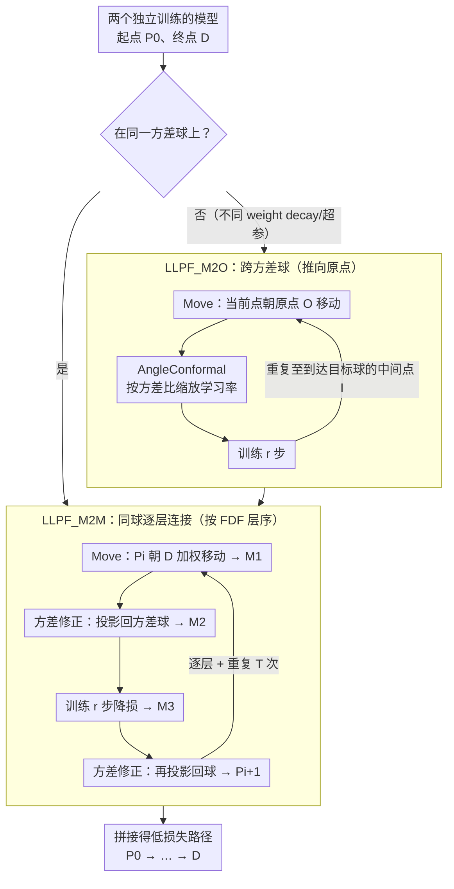

# Connecting Independently Trained Modes via Layer-Wise Connectivity

**会议**: ICML2026  
**arXiv**: [2505.02604](https://arxiv.org/abs/2505.02604)  
**代码**: https://github.com/twoentartian/DFL_torch  
**领域**: 优化理论  
**关键词**: 模态连通性, 损失景观, 方差球, 逐层连接, 低损失路径  

## 一句话总结

提出 Low-Loss Path Finding (LLPF) 算法，通过逐层连通性和方差球约束，可靠地在独立训练的神经网络模型之间构建低损失路径，支持 MobileNet、EfficientNet、CCT 等现代架构，且结果高度可复现。

## 研究背景与动机

**领域现状**：模态连通性（mode connectivity）是近年来损失景观研究的重要发现——两个独立训练的低损失模型之间可以通过一条连续路径相连，路径上所有中间模型也保持低损失。已有方法如 FGE（Bézier 曲线拟合）和 AutoNEB（逐步弯曲线性插值）奠定了这一方向的基础。

**现有痛点**：FGE 原始训练脚本存在 bug，实际只能连接权重空间中距离较近的模式，无法真正连接独立训练的模型。AutoNEB 在四次重复实验中路径最大训练损失从 0.5 到 1.5 剧烈波动，可靠性不足。此外，这些方法仅在 basic CNN、VGG、ResNet 等相对老旧的架构上验证过，对 MobileNet、EfficientNet、CCT 等现代架构的适用性未知。

**核心矛盾**：全参数空间中两个独立模型的线性插值通常产生高损失屏障，但逐层分析发现，两个模型在单层参数空间中可能是线性连通的——全局不连通的根源在于层间参数的耦合效应。

**本文目标**：设计一种通用且可复现的模态连通算法，能跨越不同架构、不同训练超参数的独立训练模型。

**切入角度**：作者从"方差球"的几何视角出发，观察到独立训练的模型在每一层的参数方差近似相等，因此可以在方差球的约束下逐层移动，避免方差消失问题。

**核心 idea**：将全参数空间的模态连通问题分解为逐层的局部移动，结合方差修正投影和少量 SGD 训练步骤，在方差球上可靠地构建低损失路径。

## 方法详解

### 整体框架

LLPF 由两个互补算法组成：**LLPF_M2M**（Model-to-Model）在同一方差球上连接两个模型；**LLPF_M2O**（Model-to-Origin）将模型沿低损失路径推向原点方向，实现跨方差球连接。对于处在不同方差球上的模型（如不同 weight decay 训练），先用 M2O 到达目标方差球，再用 M2M 在该球上完成最终连接。

### 关键设计

1. **方差球约束与方差修正（Variance Correction）**

   独立训练的模型在每层参数的方差近似相等（$\text{Var}(\theta_n) \approx \text{Var}(\theta_n')$），定义方差球 $S_{\text{var}=v} = \{P_{l_x} \in \mathbb{R}^{d_{l_x}} \mid \text{Var}(P_{l_x}) = v\}$。当对两个模型做加权平均时，参数方差会缩小（方差消失问题），导致后续训练困难。方差修正通过缩放将参数重新投影回方差球：$W'[i] = \bar{W} + \sqrt{v / \sigma_W^2} \cdot (W[i] - \bar{W})$，确保每一步移动后参数始终保持在正确的方差球面上。

2. **LLPF_M2M 的逐层迭代移动与 Follow Data Flow（FDF）层序**

   M2M 在同一方差球上连接两个模型，靠的是一个迭代循环而非一次性移动。每次迭代分四步几何操作：先用 Move 把当前路径点 $P_i$ 朝终点 $D$ 加权移动一小步得到 $M_1$（步长由 $\text{step}_f, \text{step}_a, \text{step}_c$ 控制，越小则相邻路径点越密、连续性越好）；再用方差修正把 $M_1$ 投影回方差球得到 $M_2$；对 $M_2$ 训练 $r$ 步把损失压回低位得到 $M_3$；最后再做一次方差修正得到下一个路径点 $P_{i+1}$。重复 $T$ 次即得到从 $P_0$ 到 $\approx D$ 的低损失路径。关键约束在于**逐层、按序处理**：方差球是按层定义的，必须一层一层地做上述迭代，而层序遵循 FDF 策略——(1) 按数据流方向从浅层到深层依次处理；(2) 并行层（如 patch 后的多个 attention 模块）可任意顺序逐个处理，但须在进入下游层之前全部完成。同时移动所有层在 LeNet5 等简单模型上可行，但在 ResNet18、DLA、CCT 等复杂架构上会失败——FDF 层序是 M2M 成败的决定性超参，其余超参只影响路径质量而非可行性。

3. **LLPF_M2O 跨方差球与角度保形学习率缩放（AngleConformal）**

   当两个模型处在不同方差球上（如用不同 weight decay 训练，更强的 weight decay 把模型推近原点、方差更小），M2M 无法直接连接，需由 M2O 跨球。M2O 把模型沿低损失路径朝原点 $O$ 移动，从大方差球逐步走到小方差球。它与 M2M 有两点不同：去掉方差修正、加入 AngleConformal——直接把大方差球的学习率套到小方差球上会让模型偏离低损失路径，AngleConformal 按方差比缩放学习率 $\eta = \eta_{\text{base}} \cdot w / v$（$w$ 为当前方差、$v$ 为参考方差），使不同半径球面上 SGD 更新的"角位移"保持一致。完整的跨球连接因此分两步：先用 M2O 把起点 $P$ 推到目标球上的中间点 $I$，再用 M2M 在该球上把 $I$ 连到终点 $D$，拼接两段即得整条路径。注意 M2O 只支持大球→小球，反向因梯度爆炸问题不可行。

## 实验关键数据

| 方法 | 支持架构 | 结果一致性 | 跨方差球 | 最差训练损失（CIFAR10） |
|------|---------|-----------|---------|----------------------|
| AutoNEB | Basic CNN, ResNet, DenseNet | 不一致 | 未报告 | 0.0324 (ResNet20) |
| FGE | ResNet, VGG, WideResNet | 未报告 | 未报告 | 0.022 (ResNet158) |
| **LLPF** | **+MobileNet, ShuffleNet, EfficientNet, RegNet, DLA, CCT** | **一致** | **支持** | **0.006 (ResNet18)** |

| 实验设定 | 训练损失 | 测试准确率 | 重复次数 |
|---------|---------|-----------|---------|
| ResNet18@CIFAR10 M2M | < 0.1（路径最大值） | 收敛到终点模型水平 | ≥ 10 次 |
| DLA@CIFAR10 M2M | < 0.1 | 一致收敛 | ≥ 10 次 |
| CCT7@CIFAR10 M2M | < 0.1 | 一致收敛 | ≥ 10 次 |
| ResNet18 精调 | **< 0.006** | — | 专门调参 |
| DLA 跨方差球 | 全程低损失 | 训练准确率保持高位 | M2O + M2M 两阶段 |

连续性验证：对 CCT7 路径相邻点做线性插值（50 个采样），插值路径训练损失始终保持低值，支持路径连续性假设。

## 亮点与洞察

- **几何直觉清晰**：将模态连通问题转化为方差球上的逐层移动，每步由"移动→方差修正→少量训练→再修正"四个几何操作组成，物理含义直观。
- **可复现性突破**：在 ≥10 次不同随机种子的重复实验中，LLPF 的路径损失/准确率轨迹几乎完全重合（标准差极小），这是 AutoNEB 和 FGE 不具备的特性。
- **架构泛化性强**：首次在 MobileNet、ShuffleNet、EfficientNet、RegNet、DLA、CCT 上验证模态连通性，将这一现象的适用范围大幅扩展。
- **暗示损失景观的全局结构**：实验结果暗示 SGD 训练的所有模式可能位于一个单一的路径连通低损失流形上，这一猜想若成立将深刻改变我们对损失景观的理解。

## 局限性 / 可改进方向

- 算法不保证测试损失低——在 ResNet18 实验中训练损失低但测试损失上升，说明路径可能穿越泛化性较差的区域。
- LLPF_M2O 仅支持从大方差球向小方差球移动，反向移动因梯度爆炸问题不可行。
- 超参数较多（$\text{step}_f$, $\text{step}_a$, $\text{step}_c$, $r$, 层顺序），虽然作者声称只有层选择/顺序决定成败，但实际调参仍需经验。
- 目前仅在 CIFAR10/CIFAR100/ImageNet10 等小数据集上验证，大规模模型（如 ViT-Large、LLM）的适用性未知。
- 缺乏理论保证，全局路径连通猜想目前仅有实验支撑。

## 相关工作与启发

- **FGE**（Garipov et al., 2018）用 Bézier 曲线连接模式，是模态连通性的开创性工作，但实际仅连接近距离模式。
- **AutoNEB**（Draxler et al., 2018）用 NEB 方法弯曲插值路径，但结果不一致。
- **Layer-wise LMC**（Adilova et al., 2024）提出逐层线性模态连通性的概念，为本文的逐层策略提供了理论基础。
- **Git Re-Basin**（Ainsworth et al., 2023）通过神经元排列对齐实现线性插值连通，但属于排列对齐而非独立训练的模态连通。
- 本文的方差球视角可能对**模型融合/模型汤（model soups）**和**联邦学习中的模型聚合**提供新的几何理解。

## 评分

- 新颖性: 8/10 — 方差球+逐层移动的框架设计新颖，几何直觉清晰  
- 实验充分度: 8/10 — 覆盖多种架构且每个实验重复 ≥10 次，一致性验证充分  
- 写作质量: 7/10 — 符号体系严谨但算法描述略显冗长  
- 价值: 7/10 — 推进了对损失景观的理解，但实际应用场景有待探索

<!-- RELATED:START -->

## 相关论文

- [\[ICLR 2026\] Entropic Confinement and Mode Connectivity in Overparameterized Neural Networks](../../ICLR2026/others/entropic_confinement_and_mode_connectivity_in_overparameterized_neural_networks.md)
- [\[ICLR 2026\] Do We Really Need Permutations? Impact of Model Width on Linear Mode Connectivity](../../ICLR2026/others/do_we_really_need_permutations_impact_of_model_width_on_linear_mode_connectivity.md)
- [\[NeurIPS 2025\] Impact of Layer Norm on Memorization and Generalization in Transformers](../../NeurIPS2025/others/impact_of_layer_norm_on_memorization_and_generalization_in_transformers.md)
- [\[ICCV 2025\] LaCoOT: Layer Collapse through Optimal Transport](../../ICCV2025/others/lacoot_layer_collapse_through_optimal_transport.md)
- [\[NeurIPS 2025\] Generalized Linear Mode Connectivity for Transformers](../../NeurIPS2025/others/generalized_linear_mode_connectivity_for_transformers.md)

<!-- RELATED:END -->
