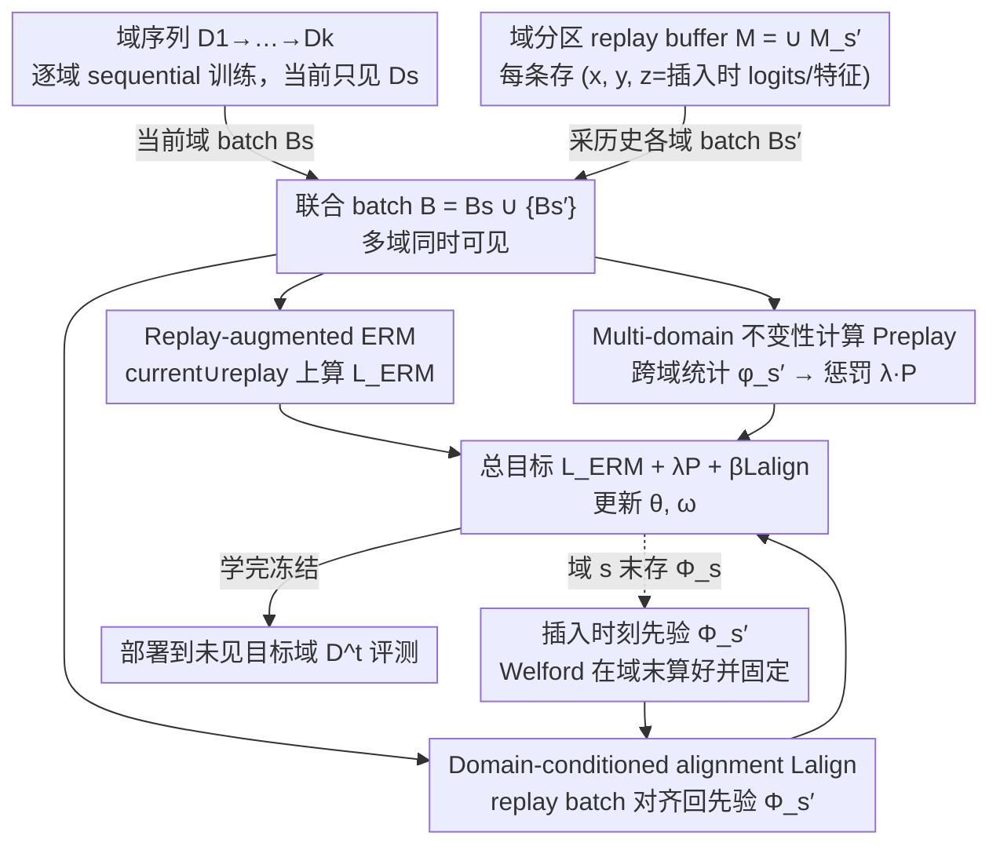

# Continual Learning of Domain-Invariant Representations

**会议**: ICML 2026  
**arXiv**: [2605.15775](https://arxiv.org/abs/2605.15775)  
**代码**: 无  
**领域**: 持续学习 / 自监督表示学习 / 域泛化  
**关键词**: continual learning, domain-invariant representation, replay buffer, VREX, Fishr / CORAL / MMD / ANDMask

## 一句话总结
作者首次把"域不变表示学习（DIRL）"显式注入到持续学习里：以 replay buffer 为载体做 multi-domain 不变性计算 + 域条件对齐，提出 ⋆-CL-{VREX, Fishr, CORAL, MMD, ANDMask} 五个方法，在六个跨视觉/医学/制造/生态的数据集上把目标域准确率推到 SOTA。

## 研究背景与动机

**领域现状**：主流持续学习（CL）方法可分四类——optimization-based（AGEM、UPGD）、regularization-based（EWC、SI、SNR）、architecture-based（progressive nets）、replay-based（ER-ACE、FDR、LODE、STAR）。它们的共同目标是 stability-plasticity trade-off：在已见训练域上不遗忘，并把 backwards transfer（BWT）做好。

**现有痛点**：所有这些方法只优化"已见域"性能，模型很容易学到 domain-specific 的捷径（如颜色、纹理、医院级偏置），导致部署到一个全新的目标域时崩盘。这就是 shortcut learning 在 CL 场景下的具体表现——in-domain 高 acc、out-of-domain 烂。

**核心矛盾**：现有 DIRL 方法（VREX、Fishr、CORAL、MMD、ANDMask）依赖 joint access 多域来同时优化不变性约束；而 CL 是 sequential，过去域的数据不再可见。简单地存一个域级统计量 $\Phi_{s'}$ 作"锚点"再让当前 batch 去匹配（naïve 扩展），并不能复现多域联合优化的语义，提升有限。

**本文目标**：(i) 在 sequential 数据流上学到真正的 domain-invariant 表示；(ii) 在一个 deployment-oriented 协议下评测——sequential train → deploy → 新目标域测；(iii) 在不放弃 CL 经典 buffer 预算的前提下兼顾多域不变性与不遗忘。

**切入角度**：CL 的 replay buffer 天然就是"多域同时存在"的载体。作者把不变性计算搬到 replay batch 上做（而不是只在当前域），并加一项 alignment loss 防止 replay 表示随后续训练而漂移。

**核心 idea**："replay-augmented ERM" + "在 replay batch 上做 multi-domain 不变性惩罚" + "域条件不变性对齐"三件套，把任意一个 DIRL 不变量（risk、gradient、feature、kernel embedding、gradient-sign mask）改写成 CL 友好版本。

## 方法详解

### 整体框架
设定：模型 $h=g_\omega\circ f_\theta$，按域序 $S=\{D_1,\dots,D_k\}$ sequential 训练，每个域只能看自己的数据 + 一个小 buffer $M$（$|M_{s'}|\ll|D_{s'}|$），部署到完全未见的目标域 $D^t$ 上评测。整体训练目标为 $\min_{\theta,\omega} L^{\text{replay}}_{\text{ERM}}(\theta,\omega)+\lambda P^{\text{replay}}_s(\theta,\omega)+\beta L^{\text{align}}(\theta,\omega)$，其中 ERM 在 current ∪ replay 上做，第二项是多域不变性惩罚，第三项是"域条件"对齐项。整条 pipeline 是：当前域数据 + 按域分区的 replay buffer 拼成"多域同时可见"的联合 batch，并行算出三项损失合成总目标更新模型；每个域训练完把不变性先验 $\Phi_{s'}$ 存回 buffer 供后续对齐；全部域学完后冻结模型，部署到未见目标域评测。

### 关键设计

**1. Replay-augmented ERM + 域分区 buffer：让"多域同时存在"成为每一步训练的真实条件**

DIRL 假设能同时拿到多个域来联合优化不变性，可 CL 是 sequential，过去域的数据不再可见。作者注意到 replay buffer 天然就是个"多域同时存在"的载体，于是把它从单纯防遗忘的工具升级成不变性证据的来源。buffer 按域切成 $M=\bigcup_{s'<s}M_{s'}$，每条样本存为 $(x,y,z)$，$z$ 是插入时刻的辅助信息（如 logits $h(x;\theta_{s'},\omega_{s'})$ 或特征 $f_{\theta_{s'}}(x)$）；ERM 项扩为 $L^{\text{replay}}_{\text{ERM}}=\mathbb{E}_{(x,y)\sim B}[L(h(x),y)]$，$B=\bigcup_{e\le s}B_e$ 同时含当前域 batch $B_s$ 与所有 replay batch $B_{s'}$。这样 replay 一肩挑起"提供多域不变性证据"和"防遗忘"两个任务，把 DIRL 的 joint-access 假设近似复活。

**2. Multi-domain 不变性计算（Preplay）：把 5 个 DIRL 方法统一搬进 CL**

光有多域 batch 还不够，得给每个候选不变量定义"在 replay+current batch 上的"统一惩罚算子。每个域用一份统计量 $\widehat\phi_{s'}=\phi(\theta,\omega;B_{s'})$，惩罚 $P^{\text{replay}}_s=\textsc{InvPenalty}(\{\widehat\phi_{s'}\}_{s'\le s})$。五种实例分别是：

- ⋆-CL-VREX：$\phi_{s'}=\widehat r_{s'}=\mathbb{E}_{B_{s'}}[L(h(x),y)]$，惩罚 $\frac{1}{s}\sum_{s'\le s}(\widehat r_{s'}-\bar r)^2$，即跨域风险方差。
- ⋆-CL-Fishr：$\phi_{s'}=\widehat v_{s'}=\mathrm{Var}_{B_{s'}}(\nabla_\omega L)$，惩罚 $\frac{1}{s}\sum\|\widehat v_{s'}-\bar v\|_2^2$，匹配分类头梯度方差。
- ⋆-CL-CORAL：$\phi_{s'}=(\widehat\mu_{s'},\widehat\Sigma_{s'})$ 特征一阶/二阶矩，惩罚均值差 + Frobenius 协方差差。
- ⋆-CL-MMD：$\phi_{s'}=\widehat\mu^z_{s'}=\mathbb{E}_{B_{s'}}[z(f_\theta(x))]$，$z$ 是 RBF 核的 random Fourier features，惩罚 mean embedding 距离。
- ⋆-CL-ANDMask：取域级梯度 $g_{s'}=\nabla_{\theta,\omega}L^{\text{ERM}}(B_{s'})$，构造符号一致掩码 $m=\mathbb{I}(\frac{1}{s}|\sum_{s'}\mathrm{sgn}(g_{s'})|\ge\tau)$，更新 $\nabla\leftarrow m\odot\frac{1}{s}\sum_{s'}g_{s'}$。

把 invariance 计算放到"同步可见的多域 batch"上，本质就是恢复原始 DIRL 的多域联合语义——只要 buffer 能采到代表性 batch，就比"只用静态先验"准得多。

**3. Domain-conditioned invariance alignment（Lalign）：抵消 replay 表示的漂移**

仅有 Preplay 时，replay 样本的表示会被新域优化拽偏，过去几步学到的不变性被"悄悄遗忘"。Lalign 用知识蒸馏风格的锚点把它拉回来：调用插入时刻的先验 $\Phi_{s'}$（用 Welford 在线均值在域 $s'$ 末尾算好），让当前模型在 $B_{s'}$ 上的同款统计量对齐回去，$L^{\text{align}}=\sum_{s'<s}d(\widehat\phi_{s'}(\theta,\omega;B_{s'}),\Phi_{s'})$。这里和 naïve 法（Eq. 4）有个关键差别：naïve 把"当前域 batch"匹配到"过去域先验"，会强行抹平真正的跨域差异；本文是把"replay 出来的过去域 batch"匹配回"它自己当年的统计量"，保的是 invariance 的历史身份而非抹平差异。

### 损失函数 / 训练策略
总目标 $L^{\text{replay}}_{\text{ERM}}+\lambda P^{\text{replay}}_s+\beta L^{\text{align}}$。所有大图像数据集用 ImageNet 预训练 ResNet18，RotatedMNIST 用 4 层 CNN，Covertype 用 4 层 MLP；buffer 大小 1000（小数据集）或 5000（其它），$\lambda,\beta$ 经数据集级 HP 搜索。upper bound 用 URM（同时拿到全部源域的 offline DIRL），baselines 涵盖 13 个 SOTA CL 方法 + 3 个 CDA/CTTA（TENT、SHOT++、CoTTA）。

## 实验关键数据

### 主实验
六数据集：RotatedMNIST、CIFAR10C、TinyImageNetC、WM811K（wafer 制造缺陷，宏 F1）、Covertype、Camelyon17（医学）。报均值±标准误，3 次独立实验。⋆-CL-CORAL / ⋆-CL-MMD / ⋆-CL-VREX 拿到平均第 1 / 2 / 3。

| 数据集 | 指标 | 本文 ⋆-CL-CORAL | 之前最强 baseline | 提升 |
|--------|-----|----------------|------------------|------|
| RotatedMNIST | acc (%) | 72.8 | 68.7 (CoPE) | +4.1 |
| CIFAR10C | acc (%) | 68.5 | 69.5 (STAR) | -1.0（CORAL 排第 2，⋆-CL-MMD 69.0） |
| TinyImageNetC | acc (%) | 25.0 | 29.0 (ER-ACE) | -4.0（⋆-CL-Fishr 29.0 / ⋆-CL-VREX 26.3 同档） |
| WM811K | 宏 F1 (%) | 84.8 | 85.4 (ER-ACE) | -0.6（⋆-CL-MMD 85.5 最高） |
| Covertype | acc (%) | 45.2 | 41.2 (SARL) | +4.0 |
| Camelyon17 | acc (%) | 91.7 | 91.0 (AGEM) | +0.7 |
| **平均** | acc/F1 (%) | **64.7** | 62.8 (ER-ACE) | **+1.9** |

总平均看，⋆-CL-CORAL 64.7 > ⋆-CL-VREX 63.4 > ⋆-CL-MMD 63.1 > ER-ACE 62.8 > STAR 62.1，把 finetune 50.4 和 SARL 54.0 拉开 10+ pp；相对 optimization-based 提升约 6 pp、regularization-based 约 10 pp、replay-based 约 2 pp，相对 URM upper bound 仍有约 8.6 pp 差距。

### 消融实验

| 配置 | 关键指标 | 说明 |
|------|---------|------|
| Full ⋆-CL（含 Preplay + Lalign） | 平均 64.7 | 完整方法 |
| naïve-CL-{VREX,Fishr,CORAL,MMD,ANDMask} | 仅小幅高于 finetune | 静态先验 Φ 失忠于多域联合语义 |
| 去 $L^{\text{align}}$（β=0） | 掉点 | 表明 alignment 对泛化（不只是不遗忘）很关键 |
| 动态在每个域末重算 $\Phi_{s'}$ | 同样掉点 | 锚点失效，证明 Lalign 必须用插入时刻的先验 |
| Buffer 缩到 50% / 25% | 平均仍领先 replay baseline 约 4 pp | 不变性约束让小 buffer 也能撑住 |
| CDA / CTTA 基线（TENT/SHOT++/CoTTA） | 平均落后达 10 pp | 表示 CL+DIRL 比 test-time adaptation 更具备根本性优势 |

### 关键发现
- **Lalign 不是单纯防遗忘，而是泛化关键**：传统观点把 alignment 视作 stability 工具，本文实验证明它同时支撑 OOD 泛化——一旦关掉，跨域准确率明显回落。
- **不同不变性各有所长**：⋆-CL-CORAL 在低数据/统计偏移强的场景胜出，⋆-CL-Fishr 在像素破坏（TinyImageNetC）类强非平稳上更稳，⋆-CL-MMD 在分布对齐型任务上几乎平 CORAL；ANDMask 因符号一致掩码过于稀疏，TinyImageNetC 上崩盘到 11.8%。
- **In-domain 不掉、out-of-domain 大幅升**：所有 ⋆-CL 在 in-domain 也优于 finetune/regularization baseline，说明学到的不变结构对源域同样有益，验证"DIRL 不必牺牲 in-domain 性能"的假设。
- **BWT 几乎正向**：⋆-CL 系列的 backwards transfer 非负甚至为正，意味着学新域反而能提升旧域准确率，这是 CL 文献里很罕见的现象，作者归因于"不变结构是跨域共享的因果机制"。

## 亮点与洞察
- **第一次把 DIRL 系统化地嵌进 CL**：之前 DIRL 都假设 joint access，作者用 replay+多域 batch 把这个假设近似复活，并明确指出 naïve "静态先验" 不能复现联合优化语义——这个 negative result 也写进了 ablation。
- **deployment-oriented 评测协议很有价值**：把 CL 评测从"在 held-out 旧域上"改成"在完全未见目标域上"，这一改动揭示了"看似不忘"的方法其实根本没学到不变结构；这一协议本身值得整个 CL 社区采纳。
- **Lalign 的 anchor 设计可迁移**：用"插入时刻"的统计量作锚点（而非随训练动态重算），其实是一种轻量级 distillation，对其他需要保持"历史身份"的在线场景（联邦、self-supervised pretrain）都可借鉴。

## 局限与展望
- **离 URM upper bound 仍有约 8.6 pp 差距**：在 RotatedMNIST 上 URM 81.3 vs ⋆-CL-CORAL 72.8，说明 replay-based 多域不变性近似 joint-DIRL 还远不到上限；下一步可能要更聪明的样本选择或 generative replay。
- **依赖 buffer，且对 buffer 内容多样性敏感**：buffer 缩到 25% 仍能领先，但绝对值掉到 50–60%；buffer-free 设置完全没有讨论。
- **5 个具体不变量各有 trade-off，缺通用准则**：什么任务该选哪一种 ⋆-CL，论文给的是"试一遍看排名"，没有给出基于数据特性（如域间漂移类型）的指导。
- **ANDMask 在硬任务上崩盘**：TinyImageNetC 11.8% 比 finetune 还差，作者承认 sign-agreement 在异构域上过严，未来工作可考虑软化或自适应阈值。

## 相关工作与启发
- **vs 经典 CL（EWC、SI、ER-ACE、STAR）**：经典方法的目标函数里没有"跨域不变性"这个项，本文证明加一个 Preplay+Lalign 即可在不动 buffer 预算的情况下平均涨 2 pp；这是对 stability-plasticity 框架的明确扩展。
- **vs DIRL（VREX、Fishr、CORAL、MMD、ANDMask）**：本文把这五种 invariance 全部"CL 化"，每个对应一个 ⋆-CL 方法，且用 negative naïve baseline 说明"光存先验不够"。
- **vs CDA/CTTA（TENT、SHOT++、CoTTA）**：CDA/CTTA 假设部署时还能在目标域无监督更新，本文 setting 更严格（部署后冻结），却仍领先 10 pp，说明"先把不变性学好"比"事后适配"更根本。
- **vs URM (Krishnamachari 2024)**：URM 拿到全部源域 offline 联合优化，被本文当作 upper bound；⋆-CL-CORAL 是当前 sequential 设置下离它最近的方法。

## 评分
- 新颖性: ⭐⭐⭐⭐ 第一次把 DIRL 系统化地嫁接到 CL，并用 Preplay+Lalign 的两层结构解决了"naïve 静态先验"的根本缺陷。
- 实验充分度: ⭐⭐⭐⭐⭐ 6 数据集 × 17 baselines × 3 runs + 5 个独立 ⋆-CL 方法 + naïve 扩展 ablation + buffer 缩减/不同目标域/CDA/CTTA/in-domain/BWT 全套，覆盖度罕见。
- 写作质量: ⭐⭐⭐⭐ 表 1 把五种方法对齐到统一模板讲得很清晰；deployment-oriented 协议图 1 立刻让读者明白动机；不过 ANDMask 的 TinyImageNetC 崩盘没深入讨论。
- 价值: ⭐⭐⭐⭐ 对医学/制造/自动驾驶等"必须部署到新机器/新医院"的 CL 应用直接有用；deployment-oriented 评测协议本身可能影响后续 CL 论文写法。

<!-- RELATED:START -->

## 相关论文

- [\[ICML 2026\] Learning Permutation-Invariant Macroscopic Dynamics](learning_permutation-invariant_macroscopic_dynamics.md)
- [\[CVPR 2026\] A Faster Path to Continual Learning](../../CVPR2026/others/a_faster_path_to_continual_learning.md)
- [\[CVPR 2026\] Spectral Mixture-of-Experts for Continual Learning](../../CVPR2026/others/spectral_mixture-of-experts_for_continual_learning.md)
- [\[CVPR 2025\] Sufficient Invariant Learning for Distribution Shift](../../CVPR2025/others/sufficient_invariant_learning_for_distribution_shift.md)
- [\[CVPR 2026\] Back to Source: Open-Set Continual Test-Time Adaptation via Domain Compensation](../../CVPR2026/others/back_to_source_open-set_continual_test-time_adaptation_via_domain_compensation.md)

<!-- RELATED:END -->
