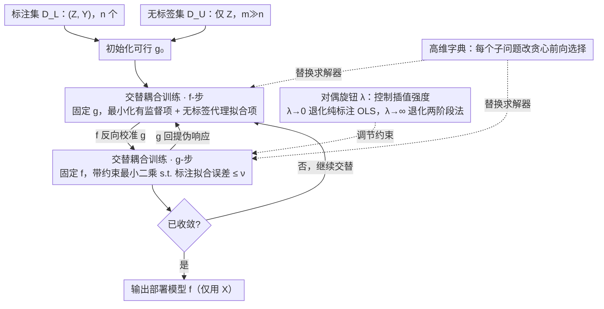

# Coupled Training with Privileged Information and Unlabeled Data

**会议**: ICML2026  
**arXiv**: [2605.23268](https://arxiv.org/abs/2605.23268)  
**代码**: 暂未公开  
**领域**: 半监督学习 / 特权信息 / 统计学习理论  
**关键词**: privileged information, semi-supervised learning, negative transfer, coupled training, greedy selection

## 一句话总结
针对"训练时能用、部署时拿不到"的特权特征 $W$，作者提出一种**部署模型 $f$ 与富视图模型 $g$ 联合训练**的框架，通过显式约束 $g$ 在标注数据上的拟合误差来自适应控制特权信息的影响强度，从而在 $W$ 信号弱或带噪时避免传统两阶段伪标签法的负迁移现象。

## 研究背景与动机

**领域现状**：在医学影像、纵向研究、迁移学习等场景里，训练阶段常常能拿到一些"特权"特征 $W$（昂贵的生物标志物、专家评估、未来时刻才能采集到的中间变量等），但部署模型只能依赖常规特征 $X$ 输出预测。一种流行的做法是 Vapnik 提出的 LUPI 框架，以及最近被 Xia & Wainwright (2024) 推广到非参数情形的**两阶段伪标签法**：第一阶段在标注数据 $\{(Z_i, Y_i)\}_{i=1}^n$ 上拟合一个用得到 $Z=(X,W)$ 的富视图模型 $\hat{g}$；第二阶段把 $\hat{g}(Z_j)$ 作为伪响应灌到大量无标签数据 $\{Z_j\}_{j=n+1}^N$，然后在合并集合上训练只用 $X$ 的部署模型 $\hat{f}$。

**现有痛点**：这套流水线在特权信号强时确实能借 $W$ 显著降低样本复杂度，但当 $W$ 信号弱、带噪、或含有维度很高的冗余成分时，第一阶段拟合出的伪响应严重偏离真回归函数 $\mu$，第二阶段会把这些误差当成"额外的标签"原样学进去，最终预测精度甚至不如只用标注数据训练。这种被 Xia & Wainwright 反复强调的**负迁移**问题在临床任务中尤其突出——昂贵的特权变量未必比常规检查更能预测目标。

**核心矛盾**：两阶段法把 $\hat{g}$ 的伪响应当作"硬目标"丢给第二阶段，没有任何机制让 $\hat{f}$ 在发现 $\hat{g}$ 不靠谱时主动衰减它的影响；而朝着另一个极端，完全不用 $W$ 又浪费了大量无标签样本带来的有效信号。

**本文目标**：构造一个**自适应混合**机制——在 $W$ 信号强时表现得像两阶段法吃满特权信息红利、在 $W$ 信号弱时退化为只用标注数据的 OLS，并且这个滑动是由数据本身决定而非靠用户调参猜出来。

**切入角度**：作者把"伪响应"从硬目标改造成 $f$ 与 $g$ 之间的**双向耦合变量**——$g$ 给 $f$ 提供伪响应来扩大有效样本量，$f$ 又反过来在无标签数据上"再校准" $g$，并要求 $g$ 不能偏离标注响应太远。这种 co-regularization 思想借鉴自多视图学习 Sindhwani et al. (2005)，但用在了不对称的特权信息场景。

**核心 idea**：用一个**带约束的联合凸优化**同时学 $f$ 和 $g$，约束水平 $\nu$（或对偶形式中的 $\lambda$）作为单一旋钮控制"两阶段 ↔ OLS"两个极端之间的插值。

## 方法详解

### 整体框架
设标注集 $\mathscr{D}_L=\{(Z_i,Y_i)\}_{i=1}^n$、无标签集 $\mathscr{D}_U=\{Z_j\}_{j=n+1}^N$（其中 $Z=(X,W)$、$m=N-n\gg n$），目标是学到一个只依赖 $X$ 的预测器 $f$。作者把任意 $f:\mathcal{X}\to\mathbb{R}$ 提升到 $\mathcal{Z}$ 上记作 $\tilde{f}(x,w)=f(x)$。最终求解的**带约束联合优化问题**为：

$$\min_{(f,g)\in\mathcal{F}\times\mathcal{G}} \frac{1}{N}\Big(\sum_{i=1}^n (Y_i-f(X_i))^2 + \sum_{j=n+1}^N (g(Z_j)-f(X_j))^2\Big) \text{ s.t. } \frac{1}{n}\sum_{i=1}^n (Y_i-g(Z_i))^2 \le \nu$$

其中第一项是 $f$ 在标注数据上的有监督损失，第二项是 $f$ 与 $g$ 在无标签数据上的"代理拟合"损失（取代了把 $\hat{g}(Z_j)$ 当作伪标签的硬注入），约束项强制 $g$ 至少要在标注数据上是个合理的回归器。$\nu$ 越小越逼近两阶段法（$g$ 几乎必须等于 $Y$ 的 OLS），$\nu$ 越大越逼近忽略 $W$ 的纯标注最小二乘（约束消失，无标签项失去意义）。整个方法的核心是 $f$ 与 $g$ 之间的**交替耦合回环**：$g$ 给 $f$ 喂伪响应扩大有效样本量，$f$ 反过来在无标签数据上再校准 $g$，约束/旋钮 $\nu$（对偶形式 $\lambda$）则单点调节这条回环里特权信息的影响强度，高维时把每步子问题换成贪心选择。

### 关键设计

**1. 交替式耦合训练算法：把高维联合优化降成两个交替的凸子问题**

要同时学部署模型 $f$ 和富视图模型 $g$，直接在 $(f,g)$ 的高维联合空间上优化很麻烦。作者用块坐标下降轮流更新：初始化任意可行 $g_0$，第 $k$ 步先固定 $g_{k-1}$ 解

$$f_k = \arg\min_f \frac{1}{N}\Big(\sum_i (Y_i-f(X_i))^2 + \sum_j (g_{k-1}(Z_j)-f(X_j))^2\Big),$$

再固定 $f_k$ 解带约束的 $g_k=\arg\min_g\frac{1}{m}\sum_j(g(Z_j)-f_k(X_j))^2$ s.t. $\frac1n\sum_i(Y_i-g(Z_i))^2\le\nu$。当 $\mathcal{F},\mathcal{G}$ 是凸函数类、损失联合凸时，两个子问题都是凸的、迭代单调下降，按 Grippo & Sciandrone (2000) 每个聚点都是全局最优。这样降维的好处是两个子问题各自能用现有求解器处理——线性模型可解析、可微非线性模型走梯度、高维字典模型则转给后面的贪心选择。

**2. Lagrangian 对偶 + 双向插值视角：用单一旋钮 $\lambda$ 把"两阶段法"和"OLS"两个极端连起来**

约束水平 $\nu$ 本身难以解释，作者把约束松弛成拉格朗日罚形式

$$\hat{\mathcal{L}}(f,g;\lambda)=\frac{1}{N}\Big(\sum_i (Y_i-f(X_i))^2 + \sum_j (g(Z_j)-f(X_j))^2 + \lambda\sum_i (Y_i-g(Z_i))^2\Big),$$

让插值强度看得见摸得着。$\lambda$ 与 $\nu$ 方向相反：$\lambda\to 0$ 时 $g$ 对标注数据几乎无拟合压力、无标签项失效、解退化为纯标注 OLS；$\lambda\to\infty$ 时 $g$ 必须严格拟合标注响应、等价于两阶段法。总体层面（Theorem 2.1）更给出干净的插值结构：若 $\mu\in\mathcal{F}\cap\mathcal{G}$、$\eta\in\mathcal{G}$（$\eta(z)=\mathbb{E}[Y\mid Z=z]$），则 $f^\star=\mu$ 且 $g^\star=\frac{m}{m+n\lambda}\mu+\frac{n\lambda}{m+n\lambda}\eta$——$g^\star$ 在部署目标 $\mu$ 与富视图目标 $\eta$ 之间做加权插值。这个解析形式既让极限行为完全可解释，也为后面的风险界证明提供了便于处理的形式。

**3. 高维字典空间的交替贪心前向选择：让整套算法在 $p\gg n$ 时也跑得起来**

当 $\mathcal{F},\mathcal{G}$ 是字典张成的高维函数空间（稀疏线性、加性模型），直接求解大型联合线性系统在内存和计算上都吃不消。作者把交替最小化里的两个子问题各换成贪心前向选择：每步在固定另一个块的条件下，从字典里挑一个能最大降低当前残差损失的原子加进展开（block-coordinate × greedy forward stepwise 的合体）。难点在于单步选择是组合的，但 Theorem 3.1 证明整体迭代在经验耦合目标上仍有全局次线性收敛（$O(1/T)$ 量级优化误差下降），把经典 Barron / DeVore-Temlyakov 的贪心逼近理论推广到了耦合特权信息场景，并进一步把优化误差界转成预测风险界。这样既覆盖了医学/经济数据里常见的稀疏可加结构，又不必像之前的 nonconvex 字典学习那样依赖复杂的恢复假设。

### 损失函数 / 训练策略
全文均采用平方损失 $\ell(y,y')=(y-y')^2$ 以便分析，但作者声明算法本身不依赖此选择（分类时可把 $\hat Y$ 视作软标签 + logistic 损失）。$\lambda$ 通过验证集调；高维设置下作者还分析了字典大小、稀疏度与样本量的相互作用。

## 实验关键数据

### 主实验
作者在合成高斯线性模型与真实回归/分类基准上对比 Two-Stage 与 Coupled。下表给出典型场景的趋势性结论。

| 场景 | $\|\theta\|_2$（特权信号强度） | 两阶段法 | 标注 OLS | 本文 Coupled |
|------|------------------------------|--------|--------|--------|
| 强特权 | 大 | 最优 | 显著差于两阶段 | 接近两阶段最优 |
| 弱特权 | 小 | 比 OLS 还差（负迁移） | 较好 | 与 OLS 持平甚至更好 |
| 中等特权 | 中 | 略优于 OLS | 基线 | 同时优于两者 |

关键观察是 Coupled 在 $\|\theta\|_2$ 全谱段都不会差于两个基线中的较好者，对应 $\lambda$ 的最优值随特权信号强度平滑迁移。

### 消融实验
| 配置 | 行为 | 说明 |
|------|------|------|
| 完整 Coupled（中等 $\lambda$） | 误差最低 | $f$ 与 $g$ 双向耦合，伪响应被适度衰减 |
| $\lambda\to\infty$ | 退化为两阶段法 | $g$ 必须拟合 $Y$，伪响应失去校准空间，弱信号场景出现负迁移 |
| $\lambda\to 0$ | 退化为纯标注 OLS | 无标签数据完全失效，强信号场景浪费 $W$ |
| 高维字典 + 贪心 | 与闭式解几乎同精度 | 验证 Theorem 3.1 的次线性收敛能落地 |

### 关键发现
- $\lambda$ 的最优值与特权信号强度负相关：信号越强、最优 $\lambda$ 越大（让 $g$ 更接近富视图回归 $\eta$）；信号越弱、最优 $\lambda$ 越小（让 $g$ 接近 $f$，从而无标签项失去对 $f$ 的拉扯）。
- 风险界 Corollary 2.3 中的相关系数 $\rho_\star\in[0,1]$ 衡量 $\hat{e}_f$ 与 $\hat{e}_g$ 残差的对齐度：$\rho_\star$ 小意味着 $W$ 带来了 $X$ 解释不掉的额外信息，此时联合训练收益最大；$\rho_\star$ 大说明 $W$ 与 $X$ 信息冗余，借特权信息收益有限。相比 Xia & Wainwright 的加性绝对误差界，本文是乘性相对误差界，$g$ 变差时风险界退化更平缓。
- 在贪心实现下，即使 $\mathcal{F},\mathcal{G}$ 是数千维字典，算法仍能恢复出与小规模闭式解几乎相同的预测精度，验证了 Theorem 3.1 的优化误差到风险误差的传递机制。

## 亮点与洞察
- **把伪标签变成耦合变量**：传统 SSL 把伪标签视作硬目标，本文把它当成可被 $f$ 反向校准的耦合量，这种"软目标 + 反馈环"思路其实可以迁移到知识蒸馏、co-training 等任何"教师-学生"结构里。
- **用单一 $\lambda$ 把两个经典算法连起来**：$\lambda\to 0$ 复现 OLS、$\lambda\to\infty$ 复现两阶段法，中间是连续光谱，这种"插值视角"让方法的极限行为完全可解释。
- **乘性 vs 加性风险界**：把负迁移的脆弱性归结为绝对误差太大太敏感，而把鲁棒性归结为相对误差有界，这一观点提醒我们以后做 SSL 理论分析时优先寻找相对误差形式的界。

## 局限与展望
- 理论保证主要建立在平方损失 + 凸函数类上，分类任务（如 logistic 损失）虽给出算法版本但未配相同强度的非渐近界。
- $\lambda$ 调参仍依赖验证集，没有给出基于无标签数据的全自动选择方案；当 $n$ 极小或标注集与无标签集分布不同（distribution shift）时，验证集本身的可靠性会成为新的瓶颈。
- 假设 $\mu\in\mathcal{F}\cap\mathcal{G}$、$\eta\in\mathcal{G}$ 的可实现性条件在深度模型上不严格成立，模型误设时风险界会怎样退化值得进一步刻画。
- 没有对比近年来基于 nuisance parameter estimation 的双重机器学习（DML）风格方法，二者其实有相通之处。

## 相关工作与启发
- **vs Xia & Wainwright (2024) 两阶段法**: 两阶段法把 $\hat{g}$ 当硬伪标签输入第二阶段，本文把 $g$ 与 $f$ 写成同一目标的耦合变量并加显式标注一致性约束，从而避免了在弱特权信号场景下被伪标签误导。
- **vs LUPI (Vapnik & Vashist, 2009)**: LUPI 同样关心训练时有 $W$ 但部署时只用 $X$，但不假设无标签数据；本文显式纳入大量 $\mathscr{D}_U$，把"特权信息 + 半监督"组合起来。
- **vs Sindhwani et al. (2005) Co-Regularization**: 两者都用 agreement term 让两个视图在无标签数据上靠拢，但 co-regularization 是对称多视图、二者均部署；本文是不对称的特权信息设置，$f$ 才是最终部署模型，$g$ 只是辅助富视图教师。
- **vs Pseudo-Labeling (Lee, 2013) / 弱监督 (Ratner et al., 2016)**: 这些方法把伪/弱标签作为外生信号注入，没有显式控制其强度的旋钮；本文的 $\lambda$ 起到了"全局影响开关"的作用。

## 评分
- 新颖性: ⭐⭐⭐⭐ 在 LUPI + SSL 的交叉点上引入耦合视角并给出干净的插值刻画。
- 实验充分度: ⭐⭐⭐⭐ 合成 + 真实回归/分类基准比较完整，但缺少深度模型场景下的大规模验证。
- 写作质量: ⭐⭐⭐⭐ 算法-理论-实验链条清晰，符号自洽。
- 价值: ⭐⭐⭐⭐ 给"用不用特权信息"提供了一个连续可控的中间地带，理论保证形式上可推广。

<!-- RELATED:START -->

## 相关论文

- [\[ICML 2026\] Polaris: Coupled Orbital Polar Embeddings for Hierarchical Concept Learning](polaris_coupled_orbital_polar_embeddings_for_hierarchical_concept_learning.md)
- [\[ICML 2026\] ParalESN: Enabling Parallel Information Processing in Reservoir Computing](paralesn_enabling_parallel_information_processing_in_reservoir_computing.md)
- [\[ICML 2026\] Less Data, Faster Training: Repeating Smaller Datasets Speeds Up Learning via Sampling Biases](less_data_faster_training_repeating_smaller_datasets_speeds_up_learning_via_samp.md)
- [\[ICML 2026\] Networked Information Aggregation for Binary Classification](networked_information_aggregation_for_binary_classification.md)
- [\[AAAI 2026\] Bipartite Mode Matching for Vision Training Set Search from a Hierarchical Data Server](../../AAAI2026/others/bipartite_mode_matching_for_vision_training_set_search_from_a_hierarchical_data_.md)

<!-- RELATED:END -->
