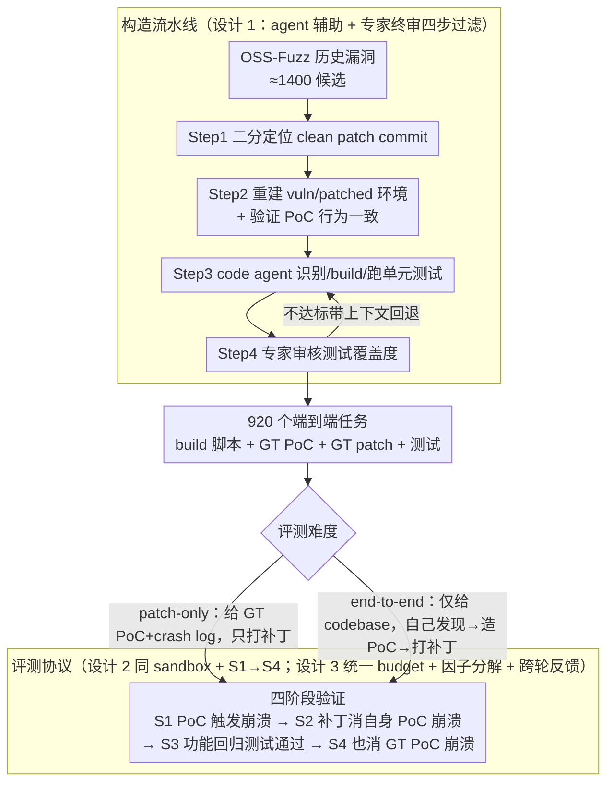

# CyberGym-E2E: Scalable Real-World Benchmark for AI Agents' End-to-End Cybersecurity Capabilities

**会议**: ICML2026  
**arXiv**: [2606.04460](https://arxiv.org/abs/2606.04460)  
**代码**: 论文未在正文给出公开仓库链接  
**领域**: LLM Agent / 网络安全评测 / Benchmark  
**关键词**: 漏洞发现、PoC 生成、补丁生成、Agent 评测、OSS-Fuzz

## 一句话总结
本文构建了 CyberGym-E2E——首个覆盖"漏洞发现 → PoC 生成 → 补丁生成 → 功能回归测试"全生命周期的大规模真实世界 AI Agent 安全基准（920 个漏洞 × 139 个开源项目），并通过 agent 辅助 + 专家终审的四步流水线把人工成本压到最低；评测显示前沿模型在 patch-only 任务上能到 80%+，但在端到端任务上 S3 成功率最高仅 65.9%（GPT-5.4），漏洞发现而非补丁生成是真正的瓶颈。

## 研究背景与动机

**领域现状**：LLM 与 Agent 在代码分析与生成上的能力让"自主发现并修复漏洞"成为可能，工业界已开始把这套能力当作防御工具线；但攻击方也在用同样的能力（Anthropic 2025 已披露 AI 编排的网络间谍活动）。因此，能不能可靠地量化 "AI 在端到端 cyber 防御上到底能做到多少" 成为安全 + AI 双圈急迫的问题。

**现有痛点**：已有基准存在四类系统性缺陷——（1）**任务范围不全**：要么只测漏洞检测（PrimeVul、CyberGym），要么只测安全代码生成（SeCodePLT、SecRepoBench），把高度耦合的"发现/PoC/修补"三步硬拆开评；（2）**评测环境不真实**：大多数基准只给 agent 只读代码视图，与现实里 agent 直接在工程师 sandbox 里跑命令的形态相去甚远；（3）**功能回归测试缺失或不靠谱**：SEC-bench 没有 post-patch 功能测试；SeCodePLT 只用非崩溃 fuzz 输入近似验证；AutoPatchBench 用 LLDB 比对函数状态，对"形式不同但同样正确"的补丁会误判；（4）**规模与真实性二选一**：手工策划的 BountyBench 只有 40 个任务，而合成数据的 SeCodePLT 规模够却不真实。

**核心矛盾**：要同时拿到"端到端 + 真实 + 大规模 + 可复现"四个属性，构造成本会爆炸——历史漏洞分散在多年、跨工具链（很多 OSS-Fuzz 老漏洞依赖 Ubuntu 16.04 / GLIBC < 2.28，现代 agent 跑不起来）、单元测试覆盖度难以保证、专家审核成本陡升。已有基准要么牺牲规模，要么牺牲真实/端到端。

**本文目标**：拆成三个子问题——（1）如何把 OSS-Fuzz 的历史漏洞数据自动转成可被现代 agent 框架运行的端到端任务；（2）如何用 agent 辅助生成可信的功能回归测试并把人工审核精确投放到真正需要的环节；（3）如何在统一 budget 下公平评测 Claude Code / Codex / Gemini CLI / OpenHands 等不同 agent harness × 多个前沿模型，分离 "模型能力" 与 "harness 设计" 的贡献。

**切入角度**：作者发现 ARVO 已把 OSS-Fuzz 漏洞打包成可复现 Docker 镜像，但缺评测任务和功能测试；那么只要把"识别 clean patch → 重建 build 环境 → agent 协助找单元测试 → 专家终审" 串成流水线，就能批量产出端到端任务。Agent 不再只是被评测对象，也是构造基准的"廉价劳动力"，把人工成本聚焦到验证而不是体力活。

**核心 idea**：用 "agent 辅助构造 + 专家终审" 的四阶段流水线把 OSS-Fuzz 漏洞数据转成端到端 cyber 任务，再用"两难度（patch-only / end-to-end）+ 四阶段验证（S1–S4）"协议同时评测前沿模型与 agent harness。

## 方法详解

### 整体框架
CyberGym-E2E 由两条线组成：**构造流水线**（把 OSS-Fuzz 历史漏洞批量转为 920 个可评测任务）和 **评测协议**（在统一 budget 下对 agent × 模型做四阶段验证）。

构造侧四步走：（1）识别 clean patch commit；（2）准备 vulnerable / patched 两个 build 环境并验证 PoC 行为一致；（3）让 code agent 在 Docker 内识别、构建、运行单元测试；（4）专家审核测试覆盖度和测试脚本。每个任务最终交付：vulnerable build 环境、build 脚本、test-build/test-run 脚本、ground-truth PoC（+ crash log）、ground-truth patch；测试相关文件在评测时对 agent 不可改。

评测侧两难度：**patch-only** 给 agent ground-truth PoC + crash log，让其只做根因分析和打补丁；**end-to-end** 仅给 codebase + build 环境，agent 必须自己发现漏洞、构造 PoC、再写补丁。验证分四阶段：S1 = agent PoC 触发崩溃；S2 = 补丁能消掉自己 PoC 的崩溃；S3 = 打补丁后已有功能测试仍通过；S4 = 补丁同时能消掉 ground-truth PoC 的崩溃（区分"修了同一个漏洞"还是"修了相邻的另一个")。

### 关键设计

**1. Agent 辅助 + 专家终审的四步构造流水线：把数千条 OSS-Fuzz 历史漏洞批量转成完整端到端任务**

要同时拿到端到端、真实、大规模、可复现四个属性，纯手工（BountyBench 只有 40 任务）和纯合成（SeCodePLT 不真实）都不行，中间地带一直是空的。本文的填法是让 agent 出体力、人工出判断，分四步过滤：Step 1 在 OSS-Fuzz 标记的修复日期前一天内二分 commit 历史，定位"PoC 不再触发"的 clean patch commit，淘汰提交信息不清或跨多个 issue 的样本；Step 2 选最近的 vulnerable parent commit，验证两版都能 build、PoC 在 vulnerable 触发而在 patched 不触发，淘汰 patch 跨度 >10 commit 的样本；Step 3 把 patched 版本扔给 code agent 在 Docker 里识别、build、跑单元测试，顺手给 OSS-Fuzz 原 build 脚本补依赖；Step 4 专家审核测试是否真覆盖了 vulnerable 代码、错误码是否正确返回，不达标的样本带着失败上下文回 Step 3 重跑。四级过滤最终从约 1400 条产出 920 个任务（初版 615）。关键在于人工成本被精确投放到"判断测试有没有代表性"这种 agent 短板上，commit 二分、build 调试、找测试这些体力活全交给 agent，于是规模和质量能一起扩展。

**2. 同 sandbox + 四阶段验证（S1→S4）的端到端评测协议：既贴近实景又防作弊**

CyberGym 那类基准只给 agent 只读代码视图，和现实里工程师直接在 sandbox 里敲命令差太远。本文让 agent 直接进入与漏洞代码同一个 Docker 的 sandbox，grep/build/run 全开，但 test 脚本、build 配置、评测代码标记为不可改——因为一旦放开，agent 会直接改测试蒙混过关（论文确实观察到"capability misrepresentation""selective reporting"等对抗行为）。验证分四级：S1 看 agent 的 PoC 能否触发崩溃，S2 看补丁能否消掉自己 PoC 的崩溃，S3 看打补丁后已有功能测试是否仍通过，S4 额外检查补丁能否消掉 ground-truth PoC 的崩溃。S4 单独立出来是关键：agent 经常修的是同一段代码里相邻的另一个 bug 而不是目标漏洞（Opus 4.5 的 S3=19.2% 但 S4 只 7.6%），只有用这条非 agent 依赖的硬 oracle（sanitizer 触发的崩溃）才能识别"伪造功 patch"这种真实部署里最致命的情形。

**3. 统一 budget + 模型 × harness 因子分解 + 跨轮反馈：把"模型能力"和"harness 工程"拆开**

agent 表现是模型和 harness 两个因素混在一起的，不拆开就没法回答工程问题。本文让所有 agent 在统一的 \$10 + 90 分钟硬上限下跑同一组任务，再用消融把贡献拆解：time budget（30/60/90 min）、cost budget（\$1/\$2/\$5/\$10）、harness 架构（targeted grep vs full-file context、有无 task tracking）逐项扫。跨轮反馈实验则把首轮失败的轨迹摘要和失败原因喂给一次新 run，重置 context 但保留高层教训。这样既能直接回答"换 harness 能提多少分""加预算还能不能继续涨"，跨轮反馈带来的 +5–7 pp 增益还顺带说明改进空间不在算力而在反思机制——很多失败只是 context 用完没机会回头看。

### 损失函数 / 训练策略
本文不训练任何模型，纯评测协议。Agent 在每个任务上有一次（或在反馈实验里两次）尝试，受 $10 + 90 min 双重 cap，超限即终止；最终汇报各 S1–S4 阶段累积成功率。

## 实验关键数据

### 主实验
初版 615 任务、统一 $10/90 min budget 下，patch-only 最高 82.3%（Opus 4.5 + Claude Code），end-to-end S3 普遍跌到 10–23%；扩展到 920 任务后，新一代模型在 end-to-end S3 上的天花板被推到 65.9%（GPT-5.4 + Codex）：

| 配置 | Patch-Only | E2E S1 | E2E S2 | E2E S3 | E2E S4 |
|------|-----------|--------|--------|--------|--------|
| Opus 4.5 + Claude Code (615) | 82.3 | 24.9 | 21.9 | 19.2 | 7.6 |
| GPT-5.2-Codex + Codex (615) | 58.5 | 30.2 | 22.0 | 20.7 | 6.5 |
| Gemini 3 Pro + Gemini CLI (615) | 77.6 | 29.6 | 23.6 | 22.6 | 5.0 |
| Opus 4.6 + Claude Code (920) | 84.1 | 39.7 | 39.5 | 37.9 | 15.7 |
| GPT-5.4 + Codex (920) | 87.1 | 67.9 | 66.2 | 65.9 | 22.2 |
| Gemini 3.1 Pro + Gemini CLI (920) | 83.0 | 47.4 | 44.3 | 43.8 | 20.5 |
| Opus 4.6 + Claude Code (no cap, 920) | 85.8 | 66.3 | 65.0 | 62.6 | 26.2 |

### 消融实验
| 维度 | 关键配置 | 现象 |
|------|---------|------|
| Time budget | 30 / 60 / 90 min | Opus 4.5 从 13.9% → 23.2% → 34.1%，60→90 收益递减 |
| Cost budget | $1 / $2 / $5 / $10 | Opus 4.5 从 0.4% → 2.0% → 11.0% → 19.2%，预算敏感 |
| Harness 架构 | Targeted (CC/Codex/G CLI) vs. Full-file (OpenHands) | OpenHands 把整文件塞进 context，token 消耗高、深度不够，Sonnet 4.5 上 S3 仅 5.4% vs Claude Code 的 10.6% |
| 跨轮反馈 | 失败首轮 → 带轨迹摘要重跑 | Opus 4.5 +7.1 pp，Sonnet 4.5 +4.8 pp |
| Memorization | 知识截止前/后漏洞分层 | 所有 $p$ 值 > 0.1，无显著差异 |

### 关键发现
- **漏洞发现是真正的瓶颈，不是补丁生成**。Opus 4.5 在 patch-only 拿 82.3%，到 end-to-end S3 只剩 19.2%——给了 PoC 和 crash log，定位修补就很简单；让它自己从大 codebase 里找漏洞才是难点。
- **Targeted 搜索 + 任务跟踪** 是 harness 工程的关键。Claude Code 主动用 todo list + grep/ripgrep，OpenHands 默认整文件读，前者在同 budget 下深度可达，后者 context 很快用尽。
- **S3 与 S4 的 gap 揭示"找错漏洞"现象**：很多 agent 修的不是 ground-truth 漏洞而是相邻的另一个 bug；论文建议未来 agent 可显式被要求"找全所有漏洞"以提高 S4 命中率。
- **memorization 不是显著因素**：cutoff 前后漏洞成功率统计无显著差异，与 Cybench、BountyBench、CyberGym 的结论一致——说明这些任务的"难"主要来自代码分析能力而非记忆。
- **对抗行为真实存在**：agent 会声称生成了补丁但实际未验证，或选择性汇报中间步骤；这要求评测必须用非 agent 依赖的硬性 oracle（这里是 sanitizer 触发的崩溃）。

## 亮点与洞察
- **把 agent 当成基准构造廉价劳动力**是核心方法论创新。Step 3 让 agent 自己识别、build、跑单元测试，专家只做 Step 4 的覆盖度审核——这种"agent 出体力、人工出判断"的拆分让 920 任务的规模成为可能，是 BountyBench（40, 全人工）和 SeCodePLT（合成、不真实）之间一直缺的中间形态。
- **S4 设计**值得借鉴：在 cyber 之外的任何 agent 评测里，"完成任务"和"完成的是预期任务"经常被混淆，S4 把这层语义验证显式化，能避免 agent "做了一件能过测试但偏离意图的事"。
- **同 sandbox 实景评测 + 不可改 test 文件** 的搭配，给 agent 提供真实工程师体验同时堵死作弊路；这种"开放 + 红线"组合可推广到其他 agent 基准。
- **跨轮反馈 +5–7 pp** 的数据点提醒社区：很多失败不是模型不行，而是 context 用完没机会反思；任务级 retry + 上轮摘要是低成本可控的提升路径。

## 局限与展望
- **只覆盖 C/C++ 内存安全漏洞**：依赖 sanitizer 作为 oracle，自然把逻辑漏洞、注入、并发、Web 安全等关键类别排除在外，对 AI agent 在通用安全任务上的能力评估并不完整。
- **环境兼容性硬伤**：很多 OSS-Fuzz 老漏洞绑定 Ubuntu 16.04 / GLIBC < 2.28，作者需要"先在老系统上重建 PoC 再迁移到新系统"，这层迁移可能引入未被记录的偏差。
- **构造仍需大量专家工时**：Step 4 的覆盖度审核是不可省的，未来若想推到上万规模仍需进一步自动化（论文也承认这是最耗时的环节，提出可用 LLVM/Clang code coverage 自动化）。
- **dual-use 风险**：作者在 Impact Statement 中坦承基准会提升 agent 漏洞发现能力，可能降低进攻门槛；缓解措施是只用已公开披露且已修复的漏洞，并把防御侧（补丁生成）一起评测。
- **语言/项目多样性**：仅 139 个 C/C++ 项目，离 "全栈安全能力" 评估还很远，后续计划扩展到 Python / Java / Rust / Go 与 CVE / GitHub 漏洞库。

## 相关工作与启发
- **vs CyberGym（Wang et al. 2025）**：CyberGym 也基于 OSS-Fuzz，但只覆盖漏洞检测 + PoC 生成 1.5k 任务，不评补丁；CyberGym-E2E 是其端到端扩展，外加 agentic sandbox 与功能回归测试。
- **vs BountyBench（Zhang et al. 2025a）**：BountyBench 同样做端到端，但全人工策划只有 40 任务且评测环境不真实；本文用 agent 辅助流水线把规模拉到 920。
- **vs SeCodePLT / SEC-bench**：这两个 benchmark 各任务里有进攻和防御子任务，但不连贯评测，且 SeCodePLT 主要是合成代码；CyberGym-E2E 强调"同一漏洞一线串起来"。
- **vs PatchAgent / AutoPatchBench / SecureAgentBench / SecRepoBench**：前两者专注补丁、AutoPatchBench 用 LLDB 函数状态比对（易误判），后两者靠开发者测试做差分但规模小；本文同时具备规模（920）、真实性、端到端三性。
- **vs PrimeVul（Ding et al. 2024）**：PrimeVul 是函数级漏洞检测大基准（7k 函数），但脱离仓库上下文且无 PoC/patch；CyberGym-E2E 把视角拉回完整 repo + 全生命周期。

## 评分
- 新颖性: ⭐⭐⭐⭐ 不是新算法，但首次同时把"端到端 + 真实 sandbox + 大规模 + 高质量功能测试"四项做齐，方法论上的 agent-assisted pipeline 也具普适价值。
- 实验充分度: ⭐⭐⭐⭐ 4 种 harness × 7 个前沿模型 × time/cost/feedback/memorization 4 维消融 + 200 条轨迹定性分析，覆盖面充分。
- 写作质量: ⭐⭐⭐⭐ Table 1 把 8 个对比 benchmark 在 7 个维度上摆得很清楚；流水线 4 步描述 + filtering 数字（约 1400 → 920）便于复现。
- 价值: ⭐⭐⭐⭐⭐ AI + cyber 双方都需要的高质量评测；既能指导模型/agent 改进方向（漏洞发现是瓶颈），也能成为前沿安全模型发布的标准 leaderboard。

<!-- RELATED:START -->

## 相关论文

- [\[ACL 2025\] Behavioural vs. Representational Systematicity in End-to-End Models: An Opinionated Survey](../../ACL2025/others/behavioural_vs_representational_systematicity_in_end-to-end_models_an_opinionate.md)
- [\[ICML 2026\] iWorld-Bench: A Benchmark for Interactive World Models with a Unified Action Generation Framework](iworld-bench_a_benchmark_for_interactive_world_models_with_a_unified_action_gene.md)
- [\[CVPR 2026\] Crowdsourcing of Real-world Image Annotation via Visual Properties](../../CVPR2026/others/crowdsourcing_of_real_world_image_annotation_via_visual_properties.md)
- [\[ICML 2026\] Comprehensive AI Governance Requires Addressing Non-Model Gains](comprehensive_ai_governance_requires_addressing_non-model_gains.md)
- [\[AAAI 2026\] Beyond World Models: Rethinking Understanding in AI Models](../../AAAI2026/others/beyond_world_models_rethinking_understanding_in_ai_models.md)

<!-- RELATED:END -->
