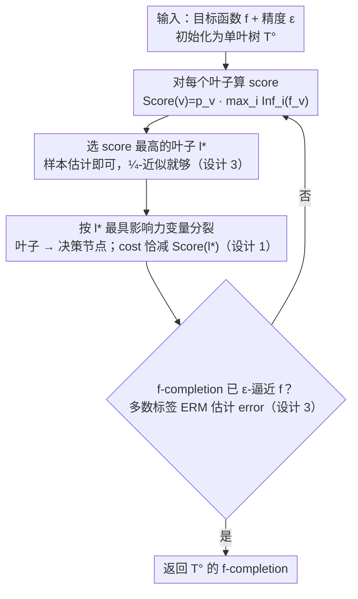

# Decision Tree Learning on Product Spaces

**会议**: ICML 2026  
**arXiv**: [2605.12983](https://arxiv.org/abs/2605.12983)  
**代码**: 无（理论论文）  
**领域**: 学习理论 / 决策树学习  
**关键词**: top-down greedy heuristic, 影响力分裂, 乘积分布, PAC 学习, parameter-free

## 一句话总结
本文把 Blanc et al. (ITCS'20) 对"top-down greedy 决策树启发式"的理论保证从均匀分布推广到**任意乘积分布**，给出 $\exp(\Delta_\mathrm{opt} D_\mathrm{opt}\log(e/\epsilon))$ 大小上界（满二叉树情形严格优于 ITCS'20），且**完全免参数**——不需要预知最优树大小或深度即可运行。

## 研究背景与动机

**领域现状**：决策树（ID3 / C4.5 / CART）以"top-down greedy + 影响力（或等价 entropy/Gini）分裂"在实践中横扫无数任务，但理论分析长期与实践脱节——Ehrenfeucht-Haussler、Mehta-Raghavan、Blanc 等的算法要么是 brute-force 暴力搜索，要么需要预知 $s$（最优树大小），与真实算法相去甚远。

**现有痛点**：(a) Blanc et al. ITCS'20 第一次给 top-down greedy 严格保证，但分析重度依赖 **uniform distribution + Boolean Fourier 分析**，限制了适用面；(b) 现实数据特征分布严重非均匀，理论保证因此对实践不构成有效解释；(c) 即便是 Blanc et al. 的算法实现也要预先知道 $s$ 才能选超参，工程上不可用。

**核心矛盾**：实践算法的"自适应、按局部最大影响力分裂、不需要全局参数"vs 理论算法的"全局优化 + 依赖均匀分布 + 需要预知 $s$"。

**本文目标**：(1) 将 top-down greedy 保证扩展到任意乘积分布 $\mu=\mu_1\times\cdots\times\mu_n$；(2) 在满二叉树情形严格收紧 Blanc et al. 的上界；(3) 给出 parameter-free 实现并提供 robust 版本（容忍样本估计误差）。

**切入角度**：避开 Fourier-analytic 工具，改用"两个深度参数"——最大深度 $D_\mathrm{opt}$（用于 total influence ≤ depth × variance 的不等式 Lemma 4.2）与平均深度 $\Delta_\mathrm{opt}$（用于 O'Donnell 2005 的 max-influence ≥ variance / 平均深度 不等式 Lemma C.1）。两个参数的乘积 $\Delta_\mathrm{opt} D_\mathrm{opt}$ 是混合驱动项。

**核心 idea**：用"cost = $\sum_\mathrm{leaves} p_v \cdot \mathrm{Inf}(f_v)$"作 potential function，证明 (a) error ≤ cost，(b) 每步 split 严格减 cost 等于该叶子的 score，(c) 在两种 cost 区间分别给出 score 下界，从而 bound 总步数。

## 方法详解

本文是纯理论论文，"方法"=算法（来自 Blanc et al. ITCS'20）+ 新的分析与 parameter-free 实现。

### 整体框架
算法 `BuildTopDownDT(f, ε)` 本身是一个**贪心迭代回环**：从单叶树出发，每轮对每个叶子计算 score = $p_v \cdot \max_i \mathrm{Inf}^\mu_i(f_v)$，选 score 最高的叶子按其最具影响力变量做分裂，再检查 $f$-completion（按多数标签补全叶子）是否已 $\epsilon$-逼近 $f$——未达标就回到打分、继续生长，达标即返回。本文的贡献不在改算法，而在为这个回环建立**分析框架**：以 cost 作势函数追踪两阶段下降——先从 $\mathrm{Inf}(f)$ 降到 $\epsilon D_\mathrm{opt}$（Phase 1，Lemma 4.6），再从 $\epsilon D_\mathrm{opt}$ 降到使 error ≤ $\epsilon$（Phase 2，Lemma 4.7）——并给出 parameter-free 的可运行实现（用样本估计 score、用 ERM 多数标签判终止）。

> 框架图画的是算法回环本身；设计 1（cost 势函数）解释「每一步 cost 怎么降、为什么 error ≤ cost」，设计 2（两深度参数）回答「这个回环要转多少轮」，设计 3 把「打分 / 判终止」落到可采样估计的实现上。

### 关键设计

**1. 乘积分布下的影响力 + cost potential：把"算法每一步在做什么"翻译成一个单调下降的标量，并连上 error ≤ cost**

ITCS'20 的分析重度依赖 uniform distribution + Boolean Fourier，换到非均匀就失效。本文不依赖 Fourier 系数，只用概率定义的影响力 $\mathrm{Inf}^\mu_i(f)=\Pr_{x\sim\mu}[f(x)\neq f(x^{(i)})]$（$x^{(i)}$ 是把第 $i$ 位按 $\mu_i$ 再抽样），leaf score 定为 $\mathrm{Score}(v)=p_v\cdot \max_i \mathrm{Inf}_i(f_v)$，tree cost 定为 $\mathrm{cost}(T^\circ)=\sum_{v\in\mathrm{leaves}} p_v\cdot \mathrm{Inf}(f_v)$。Lemma 4.1 给出 error ≤ cost 的连接，Lemma 4.3 证明分裂叶子 $v$ 后 cost 严格减少恰好 $\mathrm{Score}(v)$——这就把"贪心算法在做什么"翻译成了"cost 以什么速率下降"。因为整套量都只靠概率定义和 product 结构，分析才能自然延伸到任意乘积分布。

**2. 两深度参数混合驱动的上界：分开追踪最大深度 $D_\mathrm{opt}$ 和平均深度 $\Delta_\mathrm{opt}$，在非均匀分布下拿到指数级更紧的界**

均匀分布下 $D_\mathrm{opt}=\Delta_\mathrm{opt}$ 二者退化，先前工作没必要分开；但非均匀下二者可差 exponentially，分开追踪才是收紧的关键。$D_\mathrm{opt}$ 通过 Lemma 4.2 的 $\mathrm{Inf}(f)\le D(T)\cdot \mathrm{Var}(f)$ 进入分析，$\Delta_\mathrm{opt}$ 通过 O'Donnell 等人的 max-influence 不等式 $\max_i \mathrm{Inf}_i(f)\ge \mathrm{Var}(f)/\Delta(T)$ 进入；两个 score lower bound（Lemma 4.4 用于 cost ≤ $\epsilon D_\mathrm{opt}$ 阶段、Lemma 4.5 用于 cost ≥ $\epsilon D_\mathrm{opt}$ 阶段）分别给两阶段的步数上界，求和得到混合界 $\max\bigl((e\Delta_\mathrm{opt}/(\epsilon D_\mathrm{opt}))^{\Delta_\mathrm{opt} D_\mathrm{opt}}, e^{\Delta_\mathrm{opt} D_\mathrm{opt}}\bigr)$。在 path-like 树（$\Delta_\mathrm{opt}$ 常数、$D_\mathrm{opt}=n$）时 $\Delta_\mathrm{opt} D_\mathrm{opt}$ 远小于 $D_\mathrm{opt}^2$，比"只用 $D_\mathrm{opt}$"的界指数级更优；balanced 树（$D_\mathrm{opt}=\Delta_\mathrm{opt}=\log s$）时上界为 $s^{\log s\log(e/\epsilon)}$，也略优于 Blanc et al.。

**3. Parameter-free + 鲁棒近似实现：不需要预知 $s$ 或 $D_\mathrm{opt}$ 就能运行，且只要选到 ¼-近似最优叶子就够**

先前理论算法都要预知 $s$ 才能定终止条件和超参，工程上没法用。Theorem 5.1 证明只要每步选的叶子满足 $\mathrm{Score}(l')\ge \frac14 \max_l \mathrm{Score}(l)$，上界只退化为指数 $4\Delta_\mathrm{opt} D_\mathrm{opt}$（相当于把 $\Delta$ 当 4 倍），这一容差让 score 可以用样本无偏估计 $\widehat{\mathrm{Score}}(l,i,E_i)=\frac{1}{|E_i|}\sum_{(x,x^{(i)})}\mathbf 1[x,x^{(i)}\to l]\mathbf 1[f(x)\neq f(x^{(i)})]$ 加 Chernoff bound 来落地，每步样本复杂度 $M_S(j,\delta,\epsilon,n)=\frac{12(j+1)n}{\epsilon}\log\frac{4j^2(j+1)n}{\delta}$；终止判据则用 majority-vote ERM 估计 tree error。这是第一份可以直接运行的版本——也顺带解释了为何工程里的 CART/C4.5 在脏数据上仍 work：它们恰好落在这个"¼-近似就够"的鲁棒区间里。

### 损失函数 / 训练策略
N/A（理论论文）。算法本身的优化目标是"score 最大的叶子做 split"，等价于贪心降 cost；终止条件是 estimated error ≤ ε（ERM 多数标签 + Chernoff 样本量）。

## 实验关键数据

### 主实验（理论结果，非实验数据）

| 设置 | 上界 | 与 Blanc et al. ITCS'20 比较 |
|---|---|---|
| 任意乘积分布，一般树 | $\max((e\Delta_\mathrm{opt}/(\epsilon D_\mathrm{opt}))^{\Delta_\mathrm{opt} D_\mathrm{opt}}, e^{\Delta_\mathrm{opt} D_\mathrm{opt}})$ | 推广到非均匀分布 |
| 均匀分布 + 满二叉树 ($\Delta_\mathrm{opt}=D_\mathrm{opt}=\log s$) | $s^{\log s\cdot\log(e/\epsilon)}$ | 略紧于 $s^{O(\log(s/\epsilon)\log(1/\epsilon))}$ |
| Balanced 树 ($D_\mathrm{opt},\Delta_\mathrm{opt}\in O(\log s)$) | $s^{O(\log s\cdot\log(e/\epsilon))}$ | 同上 |
| Path-like 树 ($\Delta_\mathrm{opt}$ 常数, $D_\mathrm{opt}=n$) | 指数级地优于"仅 $D_\mathrm{opt}^2$"的 bound | 分参数追踪的本质收益 |

### 关键鲁棒性结果

| 配置 | 上界 | 说明 |
|---|---|---|
| 精确 score | $\Delta_\mathrm{opt} D_\mathrm{opt}$ 指数 | Theorem 1.1 |
| 选出 leaf score ≥ ¼ 最大值 | $4\Delta_\mathrm{opt} D_\mathrm{opt}$ 指数 | Theorem 5.1，容忍样本估计 |
| 每步采样复杂度 | $\tilde O((j+1)n/\epsilon)$ | $\delta$/总失败概率 = δ/2 |

### 关键发现
- $D_\mathrm{opt}$ 与 $\Delta_\mathrm{opt}$ 是必须分开追踪的两个量；在 path-like 树上分开追踪带来 exponential 改进，否则均匀分布的对称掩盖了这一现象。
- 贪心算法的 robustness 很强——选到 ¼-近似最优叶子即可，使样本估计自然落地；这正解释了为何工程 CART/C4.5 在脏数据上仍 work。
- Koch et al. (2023) 已证决策树学习无 poly-size 算法，故 quasi-polynomial 依赖 $s$ 在常数差距内是近紧的——本文上界已"贴住"了下界。

## 亮点与洞察
- 完全摆脱 Boolean Fourier 工具——这意味着今后乘积空间上对决策树的所有进一步理论分析（noise stability、agnostic learning 等）有了"非 Fourier 路径"可走。
- 分别用 $D_\mathrm{opt}$ 与 $\Delta_\mathrm{opt}$ 把 cost 在两个不等式中分别 bound，是少见的"混合参数指数 bound"——这种技巧可迁移到任何"按 score 贪心 + 单调势函数"的算法分析。
- Parameter-free 实现 + 1/4-近似鲁棒性把"理论算法"真正搬到了"可运行算法"——之前的理论论文里这一步往往被忽略。

## 局限与展望
- 仍是 quasi-polynomial bound（$s^{\log s}$），不是 polynomial；Koch et al. 下界证明这在最坏情况下不可避免，但实际数据可能远好于 worst-case，未给出 distribution-specific 紧界。
- 只针对乘积分布 $\mu=\mu_1\times\cdots\times\mu_n$——真实数据特征**相关**，对此本文不适用，扩展到非乘积（Markov / general）分布是 open。
- 误差度量是 0-1 loss（Boolean function $\{\pm 1\}$）；对回归树或软标签未直接覆盖。
- Sample complexity 在 worst case 仍依赖 $n$（特征数），高维稀疏场景下采样开销大。

## 相关工作与启发
- **vs Blanc et al. (ITCS'20)**: 同样分析 top-down greedy，但只支持均匀分布且依赖 Fourier；本文用 product-space 影响力 + variance-depth 不等式绕开。
- **vs Mehta-Raghavan (TCS'02)**: 提供 $n^{O(\log(s/\epsilon))}$ DP 算法，但只覆盖均匀分布且偏离实践算法。
- **vs Blanc et al. (FOCS'22)**: 设计 polylog-influential 变量算法达 $n^{O(\log\log n)}$ runtime，更复杂、非贪心；本文反过来对真实贪心做严格分析。
- **vs Koch et al. (SODA'23, COLT'24)**: 给出 superpolynomial / NP-hard 下界，证明本文 quasi-poly 上界已贴近紧。

## 评分
- 新颖性: ⭐⭐⭐⭐ 不是新算法，但用"两深度混合 + 非 Fourier"技巧把保证推到任意乘积分布，且 parameter-free 实现把理论落地。
- 实验充分度: ⭐⭐⭐ 纯理论论文，无实证实验；但理论分析与上下界都已对齐。
- 写作质量: ⭐⭐⭐⭐ Lemma 链条递进清晰，proof sketch 提供了直觉；少量符号略密。
- 价值: ⭐⭐⭐⭐ 对决策树理论是一座有意义的桥——首次给真实贪心算法在贴近真实数据分布的 setting 下严格保证。

<!-- RELATED:START -->

## 相关论文

- [\[AAAI 2026\] DFDT: Dynamic Fast Decision Tree for IoT Data Stream Mining on Edge Devices](../../AAAI2026/others/dfdt_dynamic_fast_decision_tree_for_iot_data_stream_mining_on_edge_devices.md)
- [\[ICML 2026\] Structure-Induced Information for Rerooting Levin Tree Search](structure-induced_information_for_rerooting_levin_tree_search.md)
- [\[ICLR 2026\] Active Learning for Decision Trees with Provable Guarantees](../../ICLR2026/others/active_learning_for_decision_trees_with_provable_guarantees.md)
- [\[ICML 2026\] HASTE: Hardware-Aware Dynamic Sparse Training for Large Output Spaces](haste_hardware-aware_dynamic_sparse_training_for_large_output_spaces.md)
- [\[AAAI 2026\] From Sequential to Recursive: Enhancing Decision-Focused Learning with Bidirectional Feedback](../../AAAI2026/others/from_sequential_to_recursive_enhancing_decision-focused_learning_with_bidirectio.md)

<!-- RELATED:END -->
