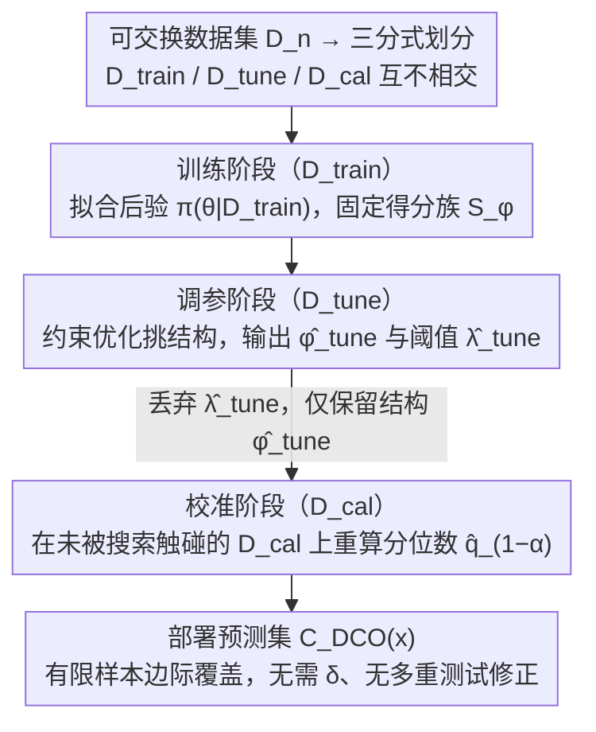

# Decoupled Conformal Optimisation: Efficient Prediction Sets via Independent Tuning and Calibration

**会议**: ICML2026  
**arXiv**: [2605.18354](https://arxiv.org/abs/2605.18354)  
**代码**: 论文未提供公开链接  
**领域**: 不确定性量化 / Conformal Prediction / 贝叶斯优化  
**关键词**: 分裂保形预测、贝叶斯优化、边际覆盖、数据划分、效率–有效性解耦

## 一句话总结
本文提出 DCO-Warmstart——一种 "训练–调参–校准" 三分式的贝叶斯保形优化范式：把效率搜索放在独立的 tuning split 上、把保形分位数留给一份未被触碰的 calibration split，从而在任意大小（甚至无穷）的候选结构类上无需置信参数 $\delta$ 也能拿到标准的有限样本边际覆盖保证，且实证上预测集尺寸通常小于 CRC/BQ 等耦合校准方法。

## 研究背景与动机

**领域现状**：保形预测（CP）以"分布无关 + 有限样本边际覆盖"成为主流不确定性量化范式。分裂式 CP 把数据切成 $D_{\text{train}}$ 与 $D_{\text{cal}}$ 两块，固定不一致性得分 $S(x,y)$ 后用经验 $(1-\alpha)$ 分位数 $\hat q_{1-\alpha}$ 给出预测集 $C(x)=\{y:S(x,y)\le \hat q_{1-\alpha}\}$。近年人们追求"更小且仍合法"的预测集，于是出现一批保形优化方法：通过搜索得分、先验、模型结构或阈值搜索规则来压尺寸。

**现有痛点**：BCP-CRC、Bayesian Quadrature 校准、Learn-then-Test 等代表性方法把"找最优阈值"和"认证覆盖率"放到**同一**份留出数据 $D_{\text{cal}}$ 上做。一旦如此，分位数就不再是在与搜索过程独立的数据上算出的，标准分裂 CP 的可交换性证明失效，必须改用 PAC 风格"以概率 $1-\delta$ 满足风险"的弱形式保证，并对多重测试做修正——尤其当候选类很大时，修正项会显著推高阈值、放大预测集。

**核心矛盾**：搜索（optimisation）与认证（calibration）在统计上是两件不同的事——前者需要在数据上反复评估候选规则，后者需要数据未被任何前置搜索"污染"。把它们绑在一份 $D_{\text{cal}}$ 上看似省数据，实际上是用一个更弱、更复杂、需要 $\delta$ 的保证去替换了一个更强、更简洁的边际覆盖保证。

**本文目标**：在贝叶斯保形优化场景下，**恢复**标准分裂 CP 的有限样本边际覆盖保证 $\mathbb P\{Y_{m+1}\in C(X_{m+1})\}\ge 1-\alpha$，同时保留对结构（得分类型、先验超参、模型架构、阈值搜索规则等）做显式效率优化的能力，并消除候选类大小对最终阈值的影响。

**切入角度**：作者注意到，"用验证集挑模型再做分裂 CP" 这件事在朴素 CP 里早已合法——只要选择不依赖 $D_{\text{cal}}$。问题在于贝叶斯保形优化把搜索和校准的边界写得很模糊。只要明确地把数据划成三份并强制 calibration split 只在最后一步用一次，整套理论就回到经典轨道。

**核心 idea**：用一个独立的 tuning split $D_{\text{tune}}$ 承担所有效率向的结构选择，calibration split $D_{\text{cal}}$ 只用来算最终的保形分位数；调参阶段得到的阈值 $\hat\lambda_{\text{tune}}$ 仅作排序工具、**部署时直接丢掉**。

## 方法详解

### 整体框架
给定可交换数据集 $D_n$，DCO-Warmstart 把它划成三份不相交的子集 $D_{\text{train}}\cup D_{\text{tune}}\cup D_{\text{cal}}$：

1. **训练阶段**：在 $D_{\text{train}}$ 上拟合后验 $\pi(\theta\mid D_{\text{train}})$，从而固定一族不一致性得分 $\{S_\phi(x,y)\}_{\phi\in\Phi}$。在 BCP 设定下，$S_\phi(x,y)=-\log p(y\mid x,D_{\text{train}})$ 为后验预测密度的负对数，$\phi$ 编码得分类型、先验超参、模型结构等结构性选择。
2. **调参阶段**：在 $D_{\text{tune}}$ 上做约束优化 $(\hat\phi_{\text{tune}},\hat\lambda_{\text{tune}})=\arg\min_{(\phi,\lambda)\in\Phi\times\Lambda}\widehat{\mathcal S}_{\text{tune}}(\phi,\lambda)$ s.t. $\widehat R_{\text{tune}}(\phi,\lambda)\le\alpha$，其中 $\widehat{\mathcal S}_{\text{tune}}$ 是经验平均预测集大小、$\widehat R_{\text{tune}}$ 是经验失覆率。利用 $\widehat R_{\text{tune}}(\phi,\cdot)$ 对 $\lambda$ 的单调性，可对每个固定 $\phi$ 走线搜索来加速。
3. **校准阶段**：**丢掉** $\hat\lambda_{\text{tune}}$，在 $D_{\text{cal}}$ 上重新计算分位数 $\hat q_{1-\alpha}=S_{(k_\alpha)}$（$k_\alpha=\lceil(m+1)(1-\alpha)\rceil$），部署预测集 $C_{\text{DCO}}(x)=\{y:S_{\hat\phi_{\text{tune}}}(x,y)\le \hat q_{1-\alpha}\}$。

关键的统计观察是：由于 $\hat\phi_{\text{tune}}$ 仅依赖 $D_{\text{train}}\cup D_{\text{tune}}$，给定该结构后 $D_{\text{cal}}$ 上的分数与测试点分数仍可交换，因此经典分裂 CP 证明可以原封不动套用，得到 $\mathbb P\{Y_{m+1}\in C_{\hat\phi_{\text{tune}},\hat q_{1-\alpha}}(X_{m+1})\}\ge 1-\alpha$。这一点对**任意候选类** $\Phi$（有限或无限）都成立，不需要置信参数 $\delta$，也不需要在 $\Phi$ 上做多重测试修正。

### 关键设计

**1. 三分式数据划分 +"调参阈值即弃"：把效率搜索和覆盖认证物理隔离**

贝叶斯保形优化失保证的根源，是它把"找最优阈值"和"认证覆盖率"塞进同一份 $D_{\text{cal}}$——一旦分位数算在被搜索污染过的数据上，可交换性就破了，只能退而求其次给 $\delta$ 风险的 PAC 弱保证。本文的做法是把这两件事拆到不同数据上：训练用 $D_{\text{train}}$ 拟模型、调参用 $D_{\text{tune}}$ 选结构、校准用 $D_{\text{cal}}$ 定阈值，三份互不相交。调参阶段解约束优化 $\min \widehat{\mathcal S}_{\text{tune}}(\phi,\lambda)$ s.t. $\widehat R_{\text{tune}}(\phi,\lambda)\le\alpha$，同时吐出结构 $\hat\phi_{\text{tune}}$ 和阈值 $\hat\lambda_{\text{tune}}$，但**后者只用来在候选里排序，部署时直接丢掉**；真正生效的阈值是事后在那份从未被搜索碰过的 $D_{\text{cal}}$ 上重算的 $\hat q_{1-\alpha}$。这一弃一算之间，$\hat\phi_{\text{tune}}$ 对 $D_{\text{cal}}$ 的可测性就显式成立，经典分裂 CP 的可交换性论证原封不动复活，拿回无需 $\delta$、无需多重测试修正的有限样本边际覆盖 $\mathbb P\{Y_{m+1}\in C(X_{m+1})\}\ge 1-\alpha$。对比 BCP-CRC 把 $\min_\lambda \mathbb E|C(X;\lambda)|$ s.t. $\mathbb P(\mathbb P(Y\notin C)\le\alpha)\ge 1-\delta$ 全压在一份 $D_{\text{cal}}$ 上，DCO 只是"再切一刀数据"，换来的却是更强、更简洁的保证。

**2. 候选类规模与最终阈值脱钩：可以无痛上更丰富的搜索空间**

CRC/BQ-style 方法要在 $D_{\text{cal}}$ 上同时认证一堆候选的风险，多重测试逼着它加一项随候选数 $K=|\Phi|$ 增长的惩罚，候选越多阈值被推得越高、预测集越大。DCO 把候选筛选整个关在 $D_{\text{tune}}$ 里完成，校准只针对已经固定下来的单个 $\hat\phi_{\text{tune}}$ 跑一次分位数，于是 Theorem 3.1 能直接声明覆盖保证对"任意有限或无限的 $\Phi$"都成立——神经网络结构、连续超参都能当候选，不必离散化也不付多重测试代价。候选规模付出的代价只落在 Proposition 3.2 的调参样本复杂度上：$m_{\text{tune}}\ge \max\{\log(4|\mathcal A|/\eta)/(2\varepsilon_R^2),\,B^2\log(4|\mathcal A|/\eta)/(2\varepsilon_S^2)\}$，也就是说候选多只影响"调参挑得好不好"，不影响"最终阈值合不合法"。

**3. 与 PAC 风格方法渐进等价 + DirectTune 反面诊断：把定位讲清楚**

DCO 不是来取代 CRC/BQ 的，所以本文特意刻画了两者的关系：有限样本下保证类型不同（边际覆盖 vs 高概率风险控制），但大样本下二者收敛到同一个总体阈值 $\lambda^\star=\inf\{\lambda:R(\lambda)\le\alpha\}$。在 $R(\lambda)$ 于 $\lambda^\star$ 邻域连续严格单调、$\hat\lambda_{\text{DCO}}\xrightarrow{p}\lambda^\star$、且 CRC 偏差项 $b_m(\lambda,\delta_m)$ 一致收敛到 0 三条件下，Proposition 3.3 证 $\hat\lambda_{\text{CRC}}-\hat\lambda_{\text{DCO}}\xrightarrow{p}0$——目标不同所以保证不同，但极限处殊途同归。为了让"省掉校准 split 的代价"看得见，作者还设了 DirectTune 当反面教材：它把 $D_{\text{cal}}$ 并进 $D_{\text{tune}}$ 直接部署 $\hat\lambda_{\text{tune}}$，没有可交换性，实验里预测集通常最小但覆盖不达标，反向坐实了最后那步 calibration 的必要性。

### 损失函数 / 训练策略
调参阶段的目标即 (9) 式：$\min_{(\phi,\lambda)} \widehat{\mathcal S}_{\text{tune}}(\phi,\lambda)$ s.t. $\widehat R_{\text{tune}}(\phi,\lambda)\le\alpha$；实践中用 $\Phi\times\Lambda$ 网格搜索 + 单调线搜索求解。若无候选满足约束，则取经验失覆最小者并以平均集大小破并列。总计算复杂度 $O(K|\Lambda|m_{\text{tune}})$（调参）+ $O(m_{\text{cal}}\log m_{\text{cal}})$（校准排序）。

## 实验关键数据

### 主实验
作者在 ImageNet-A（分类）、CIFAR-100（分类）以及 Diabetes、California Housing、Concrete（回归）上对比 DCO-Warmstart 与 CRC/BQ-style 校准的"效率"指标（平均预测集大小或区间宽度），目标覆盖水平 $1-\alpha$ 设为名义 90%。DCO 在覆盖率上紧贴 nominal，同时通常给出更紧的预测集：

| 数据集 | 指标 | CRC/BQ 风格 | DCO-Warmstart | 变化 |
|--------|------|------------|---------------|------|
| ImageNet-A | 平均集大小 | 26.52 | 25.26 | ↓ 1.26 |
| ImageNet-A | 95 分位集大小 | 58.95 | 53.73 | ↓ 5.22 |
| Diabetes（回归） | 平均区间宽度 | 2.098 | 1.914 | ↓ 0.184 |

### 消融实验
论文对候选搜索范围、split 划分比例、目标覆盖水平做了系统消融，并把 DirectTune 当作"无校准"诊断基线：

| 配置 | 覆盖率 | 集尺寸 | 说明 |
|------|--------|--------|------|
| DCO-Warmstart | 紧贴 $1-\alpha$ | 较小 | 完整方法，理论 + 经验均合格 |
| CRC/BQ-style (耦合) | $\ge 1-\alpha$ 但保守 | 较大 | 多重测试修正推高阈值 |
| DirectTune（去掉 calibration split） | 普遍 < $1-\alpha$ | 最小 | 经验阈值偏低，无可交换性，仅作诊断 |

### 关键发现
- 校准这一步**不能省**：DirectTune 虽然给出最紧的集，但失覆率超出名义水平，证实只有把分位数算在未被搜索触碰的 $D_{\text{cal}}$ 上才能拿到 $\ge 1-\alpha$ 的覆盖。
- 候选类越丰富，DCO 相对 CRC/BQ 的优势越明显——因为后者必须为更大候选类付出更重的多重测试修正，前者完全免疫。
- 在样本极少、需要给出 $\delta$ 风险证书的场景下，CRC/BQ-style 仍然更合适；DCO 的定位是"在已经能承担三分式 split 时，把目标改回经典的 marginal coverage"。

## 亮点与洞察
- **重新定位问题，而不是发明新算法**：方法本质只是"先把数据切三份再老老实实做分裂 CP"，但作者把它升格为"贝叶斯保形优化的设计原则"，并清晰区分了 marginal coverage 与 high-probability risk control 两种保证。一旦读懂这层定位，很多看似巧妙的耦合校准技巧都可以被"再切一刀数据"替代。
- **候选类无限也能要无条件覆盖**：Theorem 3.1 允许 $\Phi$ 无限的特性非常有用——可以把神经网络结构、连续超参当作候选，而不像 LTT/CRC 那样需要离散化并付多重测试代价。这在 AutoML + UQ 的工程场景里是一个直接可用的 trick。
- **DirectTune 作为反例**比单纯证理论更有说服力。把"看似有道理但缺一步"的方法实证跑出来失覆，比纯定理更能让从业者愿意为校准 split 让出 20–30% 的数据。

## 局限与展望
- 三分式 split 把数据划得更细，在小样本场景下 $D_{\text{tune}}$ 与 $D_{\text{cal}}$ 都可能不够大，调参排序的方差和最终分位数的方差都会被放大；作者用 DKW 不等式给出 $m_{\text{cal}}^{-1/2}$ 的校准浓度速率，但没有对最优 split 比例给出指导。
- 目标只覆盖 marginal coverage，并不承诺条件覆盖或风险控制；当下游真正在乎"以高概率风险不超 $\alpha$"时仍需切回 CRC/LTT。
- 实验主要落在中小规模分类/回归基准（ImageNet-A 已是其中最大），是否在 LLM 生成、结构化输出等高维任务上仍保持效率优势需要进一步验证。
- 调参阶段的约束优化仍走网格 + 线搜索，候选类很大时计算开销可能成为瓶颈，文中也只给了线性复杂度上界，未与贝叶斯优化等更聪明的搜索器结合。

## 相关工作与启发
- **vs BCP-CRC（耦合校准）**：BCP-CRC 在同一份 $D_{\text{cal}}$ 上同时做阈值优化与风险认证，给出 PAC 风格保证 $\mathbb P(\mathbb P(Y\notin C(X;\lambda))\le\alpha)\ge 1-\delta$；DCO 把这两步拆到不同 split，换来更简洁的 marginal coverage，代价是多一份 tuning split。
- **vs Learn-then-Test (LTT)**：LTT 通过假设检验在群体风险层面认证候选；与 CRC 一样需要 $\delta$ 与多重测试修正。DCO 的卖点是"不要 $\delta$、不需要修正、候选类大小无所谓"。
- **vs ROCP（Risk-Optimal CP）**：ROCP 也走"先优化后独立校准"的路子，但优化对象是整个预测集构造 + 下游决策；DCO 聚焦在贝叶斯结构 + 阈值搜索层面，可视为 ROCP 思想在 BCP pipeline 上的细化。
- **vs Score-tuned CP（如 RAPS / 自适应残差）**：这些方法已经在"先调得分再做分裂 CP"了，DCO 把同样原则推广到包括先验、模型结构和阈值搜索规则在内的全部贝叶斯结构选择，并把它写成一个统一的设计原则。

## 评分
- 新颖性: ⭐⭐⭐ 思想清晰且实用，但本质是经典分裂 CP "再切一刀" 的系统化包装。
- 实验充分度: ⭐⭐⭐⭐ 覆盖分类回归 5 个基准 + 候选/split/覆盖率三维度消融 + DirectTune 对照，足以支撑论点。
- 写作质量: ⭐⭐⭐⭐ 表 1 把六类方法在 optimisation/calibration/guarantee/confidence 四个维度上摆得很清楚，定位毫不含糊。
- 价值: ⭐⭐⭐⭐ 给保形优化社区一个"什么时候该用 PAC、什么时候该用 marginal" 的明确决策框架，工程上可直接复用。

<!-- RELATED:START -->

## 相关论文

- [\[ICLR 2026\] Measuring Uncertainty Calibration](../../ICLR2026/others/measuring_uncertainty_calibration.md)
- [\[CVPR 2026\] Adaptive Data Augmentation with Multi-armed Bandit: Sample-Efficient Embedding Calibration for Implicit Pattern Recognition](../../CVPR2026/others/adaptive_data_augmentation_with_multi-armed_bandit_sample-efficient_embedding_ca.md)
- [\[ECCV 2024\] Dropout Mixture Low-Rank Adaptation for Visual Parameters-Efficient Fine-Tuning](../../ECCV2024/others/dropout_mixture_low-rank_adaptation_for_visual_parameters-efficient_fine-tuning.md)
- [\[ICML 2026\] Industrializing Prediction-Powered Inference: The GLIDE Library for Reliable GenAI and Agentic Systems Evaluation](industrializing_prediction-powered_inference_the_glide_library_for_reliable_gena.md)
- [\[ICLR 2026\] On the Lipschitz Continuity of Set Aggregation Functions and Neural Networks for Sets](../../ICLR2026/others/on_the_lipschitz_continuity_of_set_aggregation_functions_and_neural_networks_for.md)

<!-- RELATED:END -->
