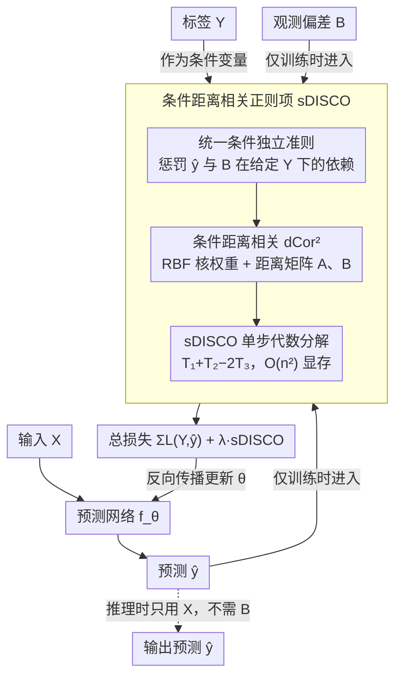

# DISCO: Mitigating Bias in Deep Learning with Conditional Distance Correlation

**会议**: ICML2026  
**arXiv**: [2506.11653](https://arxiv.org/abs/2506.11653)  
**代码**: https://github.com/yakamoz5/DISCO  
**领域**: AI 安全 / 公平性与偏差缓解 / 因果表示学习  
**关键词**: 反因果模型, 条件距离相关, 捷径学习, 因果稳定性, 单步可微估计

## 一句话总结
用反因果图把混淆/对撞/中介三类偏差统一成一个条件独立准则 $\hat{Y} \perp \mathbf{B} \mid Y$，再设计 $O(n^2)$ 显存的单步可微估计器 sDISCO，作为正则项把条件距离相关惩罚塞进任何梯度训练的网络，从而缓解多种偏差且能扩展到多偏差场景。

## 研究背景与动机
**领域现状**：数据集偏差让深度模型学到与任务无关的捷径而非真正信号——医学影像里年龄成为阿尔茨海默预测的共因，CV 中背景与 waterbirds 的虚假关联，NLP 里否定词与蕴含标签的伪相关——都是这一问题的典型案例。现有的缓解方法基本分两类：一类针对特定偏差结构（如 confounder-only、collider-only），另一类用经验性的独立性正则（IRM、GDRO、Fishr、C-MMD 等），但缺乏统一的因果理论基础。

**现有痛点**：(1) 不同偏差类型（confounder/collider/mediator）通常被分别处理，方法之间互不兼容；(2) 想用条件独立做正则的方法，比如 conditional MMD，对偏差类型和目标类型组合（二值/分类/连续）支持不全；(3) 想用条件距离相关（Wang et al. 2015）这一更强的非线性独立准则的话，它的 V-statistic 实现需要 $O(n^3)$ 显存，深度学习 batch 下直接 OOM，没法在反向传播里用；(4) 多偏差场景下大多数方法扩展性差。

**核心矛盾**：模型的"因果稳定性"应当由 $\hat{Y} \perp \mathbf{B} \mid Y$ 这一可观测的条件独立准则刻画，但所有强表达力的非参条件独立度量都太贵；要么换弱准则（线性条件协方差不适合 NN 高度非线性表征），要么换近似估计（精度/可扩展性折中）。

**本文目标**：(i) 用因果图统一说明为什么 confounder、collider、mediator 三类偏差都可以用同一个条件独立准则处理；(ii) 给出一个能在反向传播里用、且对任意目标-偏差类型组合都通用的条件距离相关估计器；(iii) 把显存从 $O(n^3)$ 压到 $O(n^2)$ 并支持精确全局估计。

**切入角度**：作者借用 Plecko & Bareinboim 的路径特异性公平分析框架，把反因果预测设定 $Y \to X$ 抽象成 Standard Anti-Causal Model (SAM)，再用反事实分解 TV = ctf-stable − ctf-IE − ctf-SE，证明只要 $\hat{Y} \perp \mathbf{B} \mid Y$ 就同时让 ctf-IE 和 ctf-SE 归零；并把 Wang et al. (2015) 的 V-statistic 展开成可批量计算的 Hadamard 形式，避免显式构造 $n \times n \times n$ 张量。

**核心 idea**：把"是哪种偏差"问题转换成单一的条件独立约束，再用一次性矩阵分解把 conditional distance correlation 估计降到 $O(n^2)$ 显存，使其能作为正则项接到任何深度模型的损失里。

## 方法详解

### 整体框架
分三层。最上层是理论：建立 SAM 因果图（target $Y$ → input $X$ → 预测 $\hat{Y}$，外加旁路变量 $\mathbf{Z}$ 和中介 $\mathbf{W}$ 统称偏差 $\mathbf{B}$），证明 $\hat{Y} \perp \mathbf{B} \mid Y$ 蕴含因果稳定性（反事实间接效应和虚假效应都为零）。中层是估计：用条件距离协方差 $\mathrm{dCov}^2(X, Y \mid Z) = \mathbb{E}_Z[\mathrm{dCov}^2(X, Y \mid Z = z)]$ 这一在强负型度量空间下能等价刻画条件独立的量，配上 RBF 核作为条件密度估计权重；提出两个可微估计器 DISCO$_m$（采样 $m$ 个参考点，省内存但近似）和 sDISCO（代数分解，全局精确 + $O(n^2)$ 内存）。最下层是训练：把 sDISCO 作为正则加进 ERM 损失 $\min_\theta \sum L(Y, \hat{Y}) + \lambda \cdot \mathrm{sDISCO}(\hat{Y}, \mathbf{B} \mid Y)$，前向和推理只用 $X$，偏差 $\mathbf{B}$ 只在训练反传计算正则项时出现。

下图按训练数据流串起三个关键设计：理论给出的「统一条件独立准则」决定要惩罚什么，「条件距离相关」是惩罚用的度量，「sDISCO 单步代数分解」负责把它压到 $O(n^2)$ 显存高效算出来；偏差 $\mathbf{B}$ 只在训练反传时进入正则项，推理只走输入 $X$。

### 关键设计

**1. SAM 反因果模型 + 统一条件独立准则：让"是哪种偏差"这个问题消失**

现有方法常按偏差类型（confounder/collider/mediator）各设计一套算法，互不兼容。作者用一张反因果图把它们统一：在 SAM 里定义反事实稳定效应 ctf-stable（沿 $Y \to X \to \hat{Y}$ 走的"健康"路径）、反事实间接效应 ctf-IE（沿 $Y \to \mathbf{W} \to \hat{Y}$ 的捷径）、反事实虚假效应 ctf-SE（沿 $Y$—$\mathbf{Z}$—$\hat{Y}$ 的非定向通路）。定理 2.3 证明：若 $\hat{Y} \perp \mathbf{W}, \mathbf{Z} \mid Y$，则 ctf-IE 和 ctf-SE 都为零、模型因果稳定；推论 2.5 进一步把 $\mathbf{W}$ 和 $\mathbf{Z}$ 合并为 $\mathbf{B}$。路径特异性分析告诉我们："是哪种偏差"在这个准则下并不重要——只要存在 ctf-stable 路径且偏差被观测到，单一独立约束 $\hat{Y} \perp \mathbf{B} \mid Y$ 就够了，方法因此不再碎片化。

**2. 条件距离相关作为非线性条件独立度量：黑盒友好、任意类型组合都成立**

NN 表征高度非线性，线性的 conditional covariance 不够用，而 C-MMD 又对偏差/目标类型组合支持不全。作者改用条件距离相关 dCov$^2(X, Y \mid Z)$，它在强负型度量空间（含欧氏空间）下"为零等价于条件独立"，能捕获任意非线性、任意维度的依赖；归一化版 $\mathrm{dCor}^2 = \mathrm{dCov}^2 / \sqrt{\mathrm{dVar}^2(X \mid Z) \mathrm{dVar}^2(Y \mid Z)} \in [0, 1]$ 更适合优化。具体对样本 $\{(X_i, Y_i, Z_i)\}$，先用 RBF 核 $K_h$ 算条件概率代理权重 $w_{ij} = K_h(Z_i, Z_j) / \sum_k K_h(Z_i, Z_k)$，再算 pairwise 距离矩阵 $A, B$；对每个参考点 $Z_i$ 用对应权重行做距离中心化得局部矩阵 $A^{(i)}, B^{(i)}$，局部 V-statistic 为 $\mathcal{V}_{XY}^{(i)} = \sum_{k\ell} w_k^{(i)} w_\ell^{(i)} A_{k\ell}^{(i)} B_{k\ell}^{(i)}$。它对 $X, Y, Z$ 任意类型组合都成立、且不需要单独建模条件分布，是黑盒友好的非参选择。

**3. sDISCO 单步代数分解：$O(n^3) \to O(n^2)$ 精确估计，能接进反向传播**

距离相关的 V-statistic 朴素实现要构造 $(n, n, n)$ 张量、$O(n^3)$ 显存，深度学习 batch 下直接 OOM。作者利用 $A^{(i)}, B^{(i)}$ 的加权边际和恰好为零这一性质：展开内积时含孤立边际均值的交叉项自动消失（Wang et al. 2015 用同样展开证理论等价，本文首次把它用作计算技巧）。先算局部行均值 $M^X = WA$、$M^Y = WB$，再算局部网格均值 $g^X = (W \circ M^X) \mathbf{1}$、$g^Y = (W \circ M^Y) \mathbf{1}$；定义 $T_1 = (W \circ (W(A \circ B))) \mathbf{1}$、$T_2 = g^X \circ g^Y$、$T_3 = (W \circ M^X \circ M^Y) \mathbf{1}$，则所有 $n$ 个参考点的局部协方差精确等于 $\mathcal{V}_{XY} = T_1 + T_2 - 2T_3$，类似算 $\mathcal{V}_{XX}, \mathcal{V}_{YY}$ 得 sDISCO = mean(local correlations)。相比需要采样 $m$ 个参考点、超参 $m$ 难调的 DISCO$_m$，sDISCO 在不放弃精度的前提下吃下整个 batch，把超参压到只剩"核带宽 $\sigma_Y$ + 正则强度 $\lambda$"两个，可直接接到 GPU 反向传播。

### 损失函数 / 训练策略
联合最小化 $\min_\theta \sum L(Y, \hat{Y}) + \lambda \cdot \mathrm{sDISCO}(\hat{Y}, \mathbf{B} \mid Y)$，$L$ 用任务对应的 MLE 损失（回归 MSE / 分类 CE）。DISCO$_m$ 默认 $m = 20\%$ batch size；sDISCO 用全 batch。前向只依赖 $X$，偏差 $\mathbf{B}$ 仅在训练反传时进入正则项，因此推理阶段不需要观测偏差变量。

## 实验关键数据

### 主实验
六个数据集覆盖回归/分类、合成/真实、视觉/NLP；标准协议是"在有偏数据训、用无偏验证集选模、在无偏测试集报告"。

| 数据集 | 任务/偏差类型 | 关键指标 | DISCO$_m$ / sDISCO | SOTA baseline |
|--------|--------------|---------|---------------------|---------------|
| dSprites | y-position 回归，X-pos 混淆 | OOD MSE ↓ | **最低或并列最低** | 与 IRM / Fishr 相当或更好 |
| Blob (synthetic) | causal intensity 回归，bias intensity mediator | OOD MSE ↓ | **最低** | C-MMD / GDRO 较高 |
| YaleB | 头部姿态分类，光照 azimuth/elevation 偏差 | OOD acc ↑ | **领先** | adversarial baselines |
| FairFace | 性别分类，肤色选择偏差 | worst-group acc ↑ | **竞争或领先** | GDRO 强 baseline |
| Waterbirds | 鸟类分类，背景虚假关联 | worst-group acc ↑ | **竞争** | GDRO/JTT 强 baseline |
| MNLI | 蕴含分类，否定关键词偏差 | worst-group acc ↑ | **竞争或领先** | GDRO 强 baseline |

跨六个数据集与七个代表性 baseline 比较，DISCO$_m$ 和 sDISCO 在大部分配置下达到 SOTA 或可比性能，且只需调"$\sigma_Y, \lambda$"两个超参，远少于 GDRO/IRM 的多超参组合。

### 消融实验
| 配置 | 关键性质 | 说明 |
|------|---------|------|
| Full sDISCO | 全局精确 + $O(n^2)$ | 多偏差场景直接扩展，无额外开销 |
| DISCO$_m$ ($m = 0.2 n$) | 近似 + 内存更省 | 在小 batch 下与 sDISCO 接近，但 $m$ 需调 |
| 线性 conditional covariance | 不能捕捉非线性 | 在 dSprites/Blob 的非线性偏差上明显掉点 |
| C-MMD | 类型组合受限 | 多偏差或连续/分类混合时退化 |
| 无 DISCO 正则 (ERM) | 直接学捷径 | OOD 显著退化，对照组 |

### 关键发现
- 在所有数据集上，DISCO 系列与最强 baseline 至少持平，多数场景下领先，且不像 GDRO/IRM 需要按数据集做大量超参搜索。
- sDISCO 在多偏差场景（如 FairFace 中同时控制肤色 + 年龄）下能无缝扩展，因为它只需把多维 $\mathbf{B}$ 作为同一个距离矩阵的输入，而 C-MMD 等方法在多偏差下要么需要逐对处理要么直接失效。
- 用 SAM 做反事实路径分析能在受控仿真上验证：DISCO 训练的模型几乎只通过 ctf-stable 路径作出决策（ctf-IE 和 ctf-SE 接近零），印证理论与方法一致。
- 计算开销：sDISCO 用一次矩阵乘法和 Hadamard 积代替三重循环，实测每 batch 增加 ~1.5–2× wall-time，但显存严格 $O(n^2)$，在常规 batch（128–512）下完全可训。

## 亮点与洞察
- 把"是哪种偏差"问题归一化成单一条件独立准则，再用"是否有 ctf-stable 路径"这一可由因果图判断的条件作为方法适用边界，这一抽象比按偏差类型穷举算法干净得多。
- 用代数分解把 V-statistic 从 $O(n^3)$ 张量降到 $O(n^2)$ 矩阵的思路，本身是个可独立复用的"算法工程"贡献——任何用到三阶距离统计量的非参方法都可能吃这一红利。
- 用反事实分解（ctf-stable / ctf-IE / ctf-SE）作为方法分析工具而不只是 motivation——在仿真数据集上直接量化每条因果路径的贡献，让"为什么 DISCO 工作"的解释变得可证伪、可检验。

## 局限与展望
- 准则 $\hat{Y} \perp \mathbf{B} \mid Y$ 依赖"positivity"假设（$P(\mathbf{B} = b \mid Y = y) > 0$）；若 $\mathbf{B}$ 是 $Y$ 的确定性函数，所有观测式 debiasing 都失效，DISCO 也不例外。
- 存在未观测混淆 $\mathbf{Z}'$ 时，约束只能屏蔽涉及已观测 $\mathbf{B}$ 的路径，无法处理通过 $\mathbf{Z}'$ 漏出的偏差；论文只能借助"输入 $X$ 不含 $\mathbf{Z}'$ 的有效代理"这一较强假设来声称近似最优。
- 把 mediator 默认当成捷径，但很多 mediator（如 disease severity → biomarker）携带真实任务信息；作者用 $\mathbf{W}_{stable}$ 子集做修补，但如何在实践中判断"哪个 mediator 是 stable 的"仍是建模者的主观选择。
- sDISCO 的 RBF 带宽 $\sigma_Y$ 对结果敏感，论文实际上是用 median heuristic 等启发式选；自动选带宽对端到端管线还是个工程负担。

## 相关工作与启发
- **vs Veitch et al. 2021 (counterfactual invariance)**：Veitch 在更严格的条件独立假设下证明反事实不变性，本文在 SAM 这一更宽设定下泛化结论，覆盖混淆/对撞/中介三种结构。
- **vs Makar & D'Amour 2023 / Puli et al. 2021**：他们经验性地用类似独立准则做公平/捷径缓解，本文用路径特异性因果分析为其有效性提供了严格理论基础。
- **vs IRM / GDRO / Fishr**：这些方法基于环境/群体划分，依赖 worst-group 等启发式且超参多；DISCO 只需观测偏差变量 $\mathbf{B}$ 和目标 $Y$，超参更少且支持连续偏差。
- **vs C-MMD**：C-MMD 对偏差/目标类型组合（连续偏差 + 分类目标等）支持不全，且没有单步精确实现；sDISCO 在类型组合通用性与精度上都更优。
- **vs Quinzan et al. 2022**：得到部分重合的独立准则结论，但未做路径特异性图分析；本文的 SAM 提供更完整的因果图基础。

## 评分
- 新颖性: ⭐⭐⭐⭐ SAM 反因果框架 + sDISCO 代数分解都是新的，把"按偏差类型设计算法"传统打通成一个统一准则，思路漂亮。
- 实验充分度: ⭐⭐⭐⭐⭐ 六个数据集横跨 vision/NLP、合成/真实、回归/分类，七个 baseline 充分对比，外加 SAM 框架下的路径特异性反事实分析。
- 写作质量: ⭐⭐⭐⭐ 因果记号严格、定理-命题铺陈清晰，sDISCO 推导一目了然；附录扎实但正文略显紧凑，前两节阅读门槛对非因果背景读者偏高。
- 价值: ⭐⭐⭐⭐⭐ 既给社区一个"为什么独立准则正则能 debiasing"的因果理论基础，又把它做成显存友好、超参少、对多偏差天然扩展的实用估计器，开源代码可直接接入既有训练管线。

<!-- RELATED:START -->

## 相关论文

- [\[ICLR 2026\] Mitigating Spurious Correlation via Distributionally Robust Learning with Hierarchical Ambiguity Sets](../../ICLR2026/others/mitigating_spurious_correlation_via_distributionally_robust_learning_with_hierar.md)
- [\[ICML 2026\] Possibilistic Predictive Uncertainty for Deep Learning](possibilistic_predictive_uncertainty_for_deep_learning.md)
- [\[ACL 2025\] Mitigating Shortcut Learning with InterpoLated Learning](../../ACL2025/others/mitigating_shortcut_learning_with_interpolated_learning.md)
- [\[ICML 2026\] Sequential Group Composition: A Window into the Mechanics of Deep Learning](sequential_group_composition_a_window_into_the_mechanics_of_deep_learning.md)
- [\[ICML 2026\] Conditional KRR: Injecting Unpenalized Features into Kernel Methods with Applications to Kernel Thresholding](conditional_krr_injecting_unpenalized_features_into_kernel_methods_with_applicat.md)

<!-- RELATED:END -->
