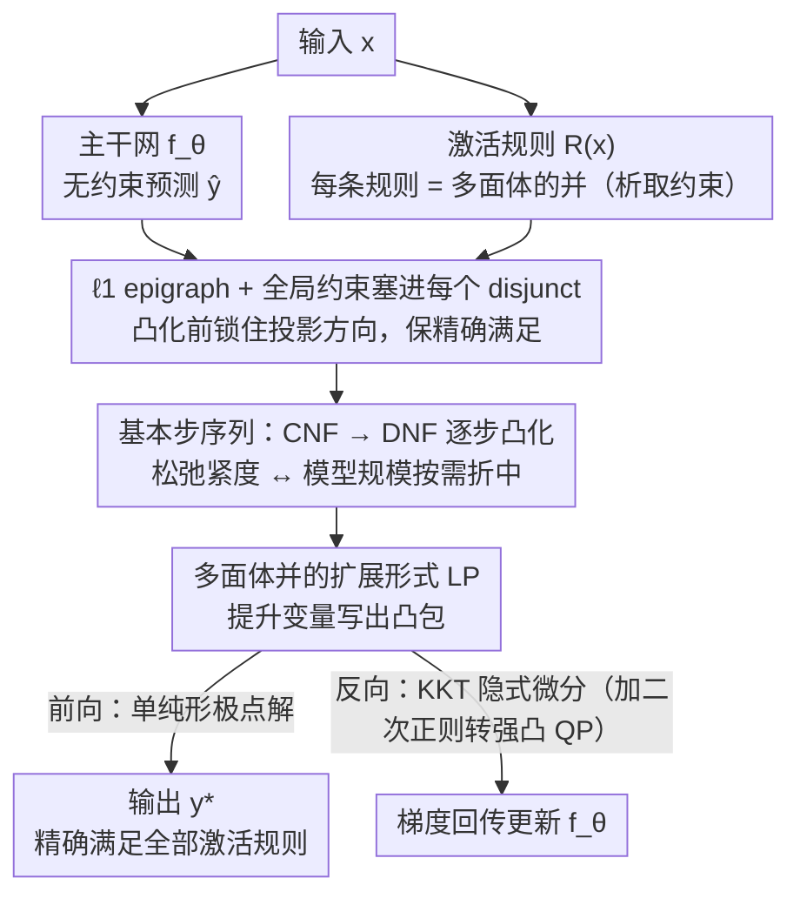

# DisjunctiveNet: Neural Symbolic Learning via Differentiable Convexified Optimization Layers

**会议**: ICML2026  
**arXiv**: [2605.30456](https://arxiv.org/abs/2605.30456)  
**代码**: https://github.com/li-group/DisjunctiveNet.jl  
**领域**: 神经符号学习 / 可微优化层  
**关键词**: 析取约束, 凸包松弛, 可微 LP 层, 硬约束满足, 输入相关规则

## 一句话总结
把"输入相关的 if-then 逻辑规则"写成多面体并的析取约束，通过基本步序列把 CNF 凸化成 DNF 的凸包，得到一个可微的 LP 投影层，神经网络输出经过这层后能在训练和推理时都精确满足原始 MILP 级别约束。

## 研究背景与动机
**领域现状**：科学和工程问题往往同时具备两个特征——数据极度稀疏，但领域知识非常丰富（物理定律、安全约束、专家启发式），这些知识通常表达为"若 $x$ 在某状态，则输出 $y$ 必须满足某线性不等式"的命题逻辑+线性不等式形式。把这种知识塞进神经网络的主流路线是神经符号学习。

**现有痛点**：现有做法基本落在三类，但都有硬伤——软惩罚类（在损失里加规则违反代价）不保证可行、惩罚系数难调；专用架构类（如 MultiplexNet）只能编码与输入无关的全局规则；后处理类则需要在推理时做不可微的 ILP 解码。可微优化层（Amos & Kolter 的 OptNet、CVXPYlayer）虽然在连续凸约束上实现了端到端硬约束，但一旦遇到逻辑算子（如 $\lor$、$\Rightarrow$）就会撞上非凸、不连通的可行域，无法直接套用。

**核心矛盾**：MILP 表达力强但其最优解对参数不可微，连续凸松弛可微但通常只是启发式，不保证精确满足原约束。如何在保留 MILP/QF-LRA 级别表达力的前提下，构造一个既可微又能精确满足约束的层，是这一问题的根本难点。

**本文目标**：(i) 给出一类能表达"输入相关的逻辑+线性不等式"的统一约束格式；(ii) 构造一个对应的可微投影层，使得 LP 极点解恰好满足原始非凸约束；(iii) 提供 CNF→DNF 之间可调的复杂度-紧度折中。

**切入角度**：作者借用 Balas (2018) 的析取规划理论——把规则写成多面体的并（disjunction），再用"基本步"逐步把合取范式（CNF）凸化成析取范式（DNF）；DNF 在提升变量空间里的凸包正好可以由扩展形式 LP 精确表示。

**核心 idea**：把"非凸的多面体并的交"通过 DNF 展开+提升变量法 (extended formulation) 重写成一个凸 LP，再用 $\ell_1$ epigraph 投影保证极点解满足原始约束，从而既可微又精确。

## 方法详解

### 整体框架
输入 $x \in \mathcal{X}$ 喂给主干网 $f_\theta$ 得到无约束预测 $\hat{y} = f_\theta(x)$；然后对 $\hat{y}$ 做一次 $\ell_1$ 投影 $y^\star(x) \in \arg\min_{y \in \mathcal{F}(x)} \|y - \hat{y}\|_1$，把它拉回到由所有激活规则定义的可行集 $\mathcal{F}(x) = \bigcap_{r \in \mathcal{R}(x)} \mathcal{C}_r(x)$。每条规则 $r$ 形式为 $\mathbb{I}[x \in \mathcal{A}_r] \Rightarrow \mathbb{I}[y \in \mathcal{C}_r(x)]$，其中 $\mathcal{C}_r(x) = \bigcup_{j=1}^{m_r} \{y: A_{rj}(x) y \le b_{rj}(x)\}$ 是 $m_r$ 个（可能输入相关的）多面体的并。文中证明该约束类与 MILP 和 QF-LRA 等表达力，因此覆盖了大部分实际场景。投影本身用扩展形式 LP 求解，反向用 KKT 条件隐式微分（CVXPYlayer / DiffOpt.jl），最终训练时还在 LP 上加二次正则使其强凸以缓解参数出现在约束右端导致的解不连续问题。

### 关键设计

**1. $\ell_1$ epigraph + 全局约束塞进每个 disjunct：在凸化之前就把投影方向锁进每一个多面体片，保住"精确满足"这条命脉**

可微优化层的核心矛盾是凸化会让 LP 极点解漂到 disjunct 之间的"伪点"上，从而不再精确满足原始逻辑规则。本文的对策是把投影目标 $\|y - \hat{y}\|_1$ 和全局可行集 $\mathcal{G}(x)$ 一起塞进每个多面体片 $\mathcal{S}_{rj}$，得到扩展集 $\widehat{\mathcal{S}}_{rj}(x; \hat{y}) = \{(y, \eta): A_{rj}(x) y \le b_{rj}(x), -\eta \le y - \hat{y} \le \eta, y \in \mathcal{G}(x)\}$。之所以选 $\ell_1$ 而不是 $\ell_2$，是因为 $\|y-\hat{y}\|_1$ 有标准 epigraph 形式 $\min \mathbf{1}^\top \eta$ s.t. $-\eta \le y-\hat{y} \le \eta$，可以纯线性表达，让整个投影问题保持 LP 结构——而这正是后面"DNF 凸包恰好等于原约束凸包"那条精确性定理的前提。如果反过来先凸化、再加 epigraph，投影方向就会在凸化后的 $y$ 空间里被定义，LP 极点解未必落回某个原始 disjunct，精确满足规则的保证当场就丢了。

**2. 基本步序列：从 CNF 一步步凸化到 DNF，让用户在"松弛紧度"和"模型规模"之间按需取舍**

约束写成多面体的并之后有两种凸松弛：CNF 松弛 $\widetilde{\mathcal{F}}_{\mathrm{CNF}} = \bigcap_r \mathrm{conv}(\widehat{\mathcal{C}}_r)$（对每条规则单独取凸包再求交）和 DNF 松弛 $\widetilde{\mathcal{F}}_{\mathrm{DNF}} = \mathrm{conv}(\bigcup_{k \in \Pi(x)} \bigcap_r \widehat{\mathcal{S}}_{r,k_r})$（先枚举所有 disjunct 组合再取凸包）。定理 3.6 证明 DNF 松弛恰好等于原始非凸集 $\widehat{\mathcal{F}}$ 的凸包，且 LP 极点解一定对应某个原始 disjunct 组合，因此精确满足所有规则；而 CNF 松弛通常严格更大，极点解可能不可行。问题是 CNF 模型规模随规则数线性增长但松弛松，DNF 紧但 disjunct 组合数 $\prod_r m_r$ 指数爆炸。本文用"基本步（basic step）"把这两端连成一条单调链——每个基本步把一条规则从 CNF 形式移到 DNF 形式：$\widetilde{\mathcal{F}}_{\mathrm{pDNF}}(\mathcal{R}_C, \mathcal{R}_D) \to \widetilde{\mathcal{F}}_{\mathrm{pDNF}}(\mathcal{R}_C \setminus \{r'\}, \mathcal{R}_D \cup \{r'\})$，得到 $\widetilde{\mathcal{F}}_{\mathrm{DNF}} \subseteq \widetilde{\mathcal{F}}_{\mathrm{pDNF}} \subseteq \widetilde{\mathcal{F}}_{\mathrm{CNF}}$。实践中只需对少数强交互的规则做 DNF 展开，就能拿到接近 DNF 的精度而规模又不爆炸。

**3. 多面体并的扩展形式 LP + 隐式微分：用提升变量把"非凸的并"写成一个可微 LP，再靠 KKT 反传梯度**

要把多面体并塞进同一套可微管线，关键是 Proposition 3.3 的提升变量法：给每个 disjunct 引入变量副本 $w_j$ 和凸组合权重 $\lambda_j$，约束 $A_j w_j \le \lambda_j b_j$、$w = \sum_j w_j$、$\sum_j \lambda_j = 1$、$\lambda_j \ge 0$，就得到 $\mathrm{conv}(\bigcup_j \mathcal{S}_j)$ 的精确表示。配上 epigraph 约束 $\eta_k \ge y_k - \lambda_k \hat{y}$、$\eta_k \ge \lambda_k \hat{y} - y_k$，预测 $\hat{y}$ 只出现在 LP 右端，前向直接调 LP solver（单纯形法天然返回极点解），反向用 KKT 条件加隐式微分拿到 $\partial y^\star / \partial \hat{y}$。相比用大 M 的 MILP 编码，扩展形式避开了二元变量，整体仍是 LP 所以可微；而单纯形极点解的性质恰好和定理 3.6 对接，让"可微"和"精确满足"两件事同时成立。唯一的小麻烦是参数若出现在 LP 左端会导致解跳变，作者在反向时给 LP 加一个小二次正则 $\mu\|y\|^2$ 转成强凸 QP 再微分来绕过。

### 损失函数 / 训练策略
基础任务损失（合成任务用 MSE、scRNA 用交叉熵） + 投影层端到端反传。所有投影模型都从已训好的 base NN 初始化，再用投影层微调，让模型专注于"把规则纳入预测"而不是"重新学预测任务"。所有方法用固定超参（不做 per-method tuning），3 个随机种子取均值。

## 实验关键数据

### 主实验
两个任务：(i) 合成冷却控制（连续控制动作，受全局约束 + 多条同时激活的安全/操作析取规则约束，oracle 是 QP）；(ii) 单细胞 RNA 测序 (scRNA-seq) 分类（marker-gene 规则编码"若某基因高表达则属于某细胞类型"）。指标：MSE / macro-F1 + CSAT (constraint satisfaction rate，分母只算无矛盾激活规则的样本)。

| 任务 | 设置 | 指标 | Base NN | Penalty (soft) | Fine-Pen | CNF | DNF |
|--------|------|------|---------|----------------|----------|-----|-----|
| 合成冷却 (n=500) | OOD MSE | ↓ | 高 | 略好 | 略好 | 显著降 | 最低 |
| 合成冷却 (n=500) | OOD CSAT | ↑ | 低 | 中 | 中 | 高 | **100%** |
| 合成冷却 (n=500) | IID CSAT | ↑ | 较低 | 较高 | 较高 | 高 | **100%** |
| scRNA-seq | macro-F1 / CSAT | ↑ | baseline | 提升有限 | 提升有限 | 显著提升 | **最佳，rule 100%** |

关键观察：DNF 在 IID 和 OOD 测试集上都做到 100% CSAT；CNF 接近但不保证；soft penalty（包括从预训练初始化的 fine-pen）即使共享同一个预训练起点也无法可靠满足约束，验证了硬投影层带来的不只是可行性保证，还提供了强归纳偏置，在 OOD 下尤其明显。

### 消融实验
基本步序列（顺序凸化）：从 CNF 出发逐步把更多规则纳入 DNF 展开（共 7 条规则，0→7）。

| 配置 | OOD CSAT | OOD MSE | LP 规模 |
|------|---------|---------|--------|
| CNF (0 条 DNF) | 低 (OOD 掉很多) | 高 | 小 |
| pDNF (1-3 条 DNF) | 单调上升 | 单调下降 | 中 |
| pDNF (4-6 条 DNF) | 接近 DNF | 接近 DNF | 较大 |
| DNF (全部 7 条) | **最高 (100%)** | **最低** | 最大 |
| 计算开销（每样本推理时间） | CNF 25.03 ms / DNF 28.62 ms | LP 变量 CNF 37.5±6.5 / DNF 44.4±14.9 | 约束 CNF 137±26 / DNF 160±63 |

### 关键发现
- 顺序凸化让 CSAT 单调上升、MSE 单调下降，且在前几次基本步后就快速逼近 DNF——大部分规则的逻辑结构只需对少量强交互规则做 DNF 展开就能捕获，验证了 pDNF 在精度-规模折中上的实用性。
- DNF 投影层在 OOD 下相对 base NN 把 MSE 拉低数倍，而 fine-pen（同样的预训练 + 软惩罚微调）几乎追不上，说明硬约束作为归纳偏置在分布外比软约束有质的优势。
- DNF 理论上 disjunct 组合数指数级，但实际很多组合不可行或不激活，LP 规模远小于最坏估计；推理时间从 base 的 <1μs 升到 ~28 ms 是可接受代价。

## 亮点与洞察
- 用析取规划这一运筹学经典工具反过来给神经网络提供"端到端可微的硬约束层"，把 MILP/QF-LRA 表达力第一次完整搬进可微框架——这一桥接本身就是漂亮的跨学科工作。
- 在凸化"之前"把 $\ell_1$ epigraph 塞进每个 disjunct，是看似细节实则关键的一步：保证了 LP 极点解一定对应原始 disjunct 而非 disjunct 之间的"伪点"，使得"凸化 + 精确满足"这一矛盾被同时解决。
- pDNF + 基本步思路非常工程友好——既保留 DNF 的精度上限，又允许使用者按算力预算选择"展开几条强相关规则"，这种"按需精确"的设计哲学可迁移到任何需要在 relaxation tightness 与模型规模之间折中的可微优化层。

## 局限与展望
- DNF disjunct 数随激活规则数 $|\mathcal{R}(x)|$ 指数增长，虽然实际中很多组合可剪枝，但规则规模一大仍会爆炸；论文也坦言"基本步的最优顺序选择"是开放问题，目前只用固定字典序。
- 每个样本需要解一个 LP，相比 base NN 的 <1μs 慢了约 4-5 个数量级（25-28 ms/样本），对延迟敏感的场景（实时控制、大批推理）压力较大。
- 实验只覆盖合成控制和 scRNA-seq 两类，规则数和维度都不算极端；在更高维问题（如视觉/语言任务里的可解释约束）下扩展性还需验证。
- 对参数出现在 LP 左端导致的不连续，靠"反向时换成强凸 QP"绕过，是有效但非严格的工程 trick；其引入的偏差与原 LP 解的偏差关系还可以更系统地分析。

## 相关工作与启发
- **vs OptNet / CVXPYlayer (Amos & Kolter; Agrawal et al.)**：他们做凸约束的可微层，本文把可微层扩展到非凸的逻辑/MILP 级约束，本质区别是 DNF 凸包+提升变量法让"非凸的多面体并"也能塞进同一套隐式微分管线。
- **vs MultiplexNet (Hoernle et al.)**：MultiplexNet 也用 disjunctive 约束但只能编码与输入无关的全局规则、并依赖变分推断"至少满足一条"；本文支持输入相关规则、精确同时满足所有激活规则，且保留端到端微分。
- **vs Soft penalty / Semantic Loss (Xu et al.; Fischer et al.)**：软惩罚类即使在 IID 上也不能保证可行，OOD 下退化更严重；本文用硬投影获得更强的 OOD 归纳偏置。
- **vs SATNet / LP relaxation (Wilder et al.; Ferber et al.)**：这些方法用启发式凸松弛，不保证精确满足；本文用最紧凸松弛（凸包）+ 单纯形极点解，提供数学上的精确满足保证。

## 评分
- 新颖性: ⭐⭐⭐⭐⭐ 第一个把析取规划的"基本步序列"系统地用于神经网络可微约束层，桥接运筹学与神经符号 AI。
- 实验充分度: ⭐⭐⭐⭐ 合成 + 真实生物两类任务、5-7 种 baseline、IID/OOD 双重测试、基本步顺序消融都有，但任务规模偏小且只在 Julia 生态。
- 写作质量: ⭐⭐⭐⭐ 定理-命题铺陈清楚，图 1/2 把 CNF/DNF/lifted projection 几何直观讲透，附录补全证明。
- 价值: ⭐⭐⭐⭐ 对科学/工程中需"硬规则 + 数据驱动"结合的场景（控制、生物、合规）有直接实用价值，开源 DisjunctiveNet.jl 降低了采用门槛。

<!-- RELATED:START -->

## 相关论文

- [\[CVPR 2025\] Locally Orderless Images for Optimization in Differentiable Rendering](../../CVPR2025/others/locally_orderless_images_for_optimization_in_differentiable_rendering.md)
- [\[NeurIPS 2025\] Scalable GPU-Accelerated Euler Characteristic Curves: Optimization and Differentiable Learning for PyTorch](../../NeurIPS2025/others/scalable_gpu-accelerated_euler_characteristic_curves_optimization_and_differenti.md)
- [\[NeurIPS 2025\] Exact Learning of Arithmetic with Differentiable Agents](../../NeurIPS2025/others/exact_learning_of_arithmetic_with_differentiable_agents.md)
- [\[ICML 2026\] Theoretical Analysis of Sparse Optimization with Reparameterization, Weight Decay, and Adaptive Learning Rate](theoretical_analysis_of_sparse_optimization_with_reparameterization_weight_decay.md)
- [\[AAAI 2026\] DS-ATGO: Dual-Stage Synergistic Learning via Forward Adaptive Threshold and Backward Gradient Optimization for Spiking Neural Networks](../../AAAI2026/others/ds-atgo_dual-stage_synergistic_learning_via_forward_adaptive_threshold_and_backw.md)

<!-- RELATED:END -->
