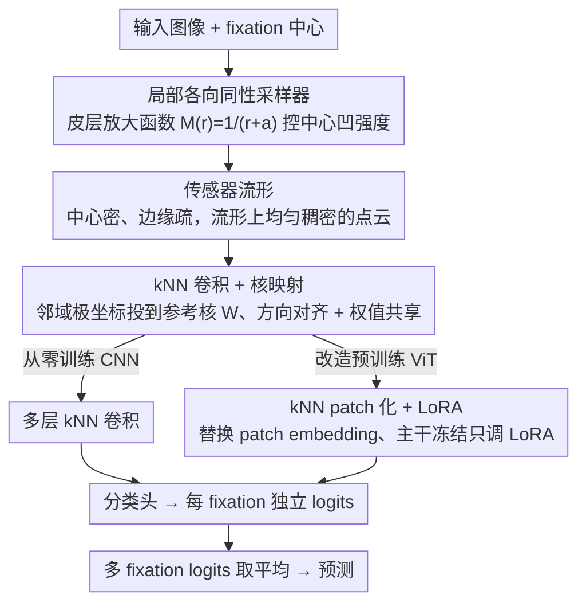

# FOVI：面向深度视觉模型的生物启发式中心凹接口

**会议**: ICML 2026  
**arXiv**: [2602.03766](https://arxiv.org/abs/2602.03766)  
**代码**: https://github.com/nblauch/fovi  
**领域**: 高效视觉架构 / 生物启发  
**关键词**: 中心凹采样, 皮层放大函数, kNN 卷积, 核映射, LoRA 适配

## 一句话总结
受人类视网膜—V1 通路启发,作者用"皮层放大函数 + 局部各向同性采样"构造出一种像素分布不均、但在传感器流形上密度均匀的中心凹输入接口 FOVI,并通过新颖的 kNN 卷积 + 核映射技术使其同时兼容 CNN 与 ViT,只用约 1/16 的像素就让 DINOv3-ViT 接近全分辨率基线的 ImageNet 精度。

## 研究背景与动机

**领域现状**:主流深度视觉模型把世界编码成一张分辨率均匀的矩形像素图,默认尺寸常年停留在 224×224。要处理高分辨率全视场图像(机器人、自动驾驶、第一人称视觉)时,CNN 的算量随像素线性增长,ViT 由于自注意力,算量随侧长**双重二次**膨胀,成本难以承受。

**现有痛点**:历史上有过中心凹视觉的尝试,但大体落入两条死路。一是 log-polar 图像模型,把半径取对数、每个半径上等角采样;二是 warped Cartesian,把 log-polar 再投回笛卡尔得到一张被"挤"过的矩形图。两类做法本质都是想强行套一个矩形网格,导致**局部各向异性采样**——同一个邻域内沿半径方向和沿极角方向的采样间距不同——出现奇怪扭曲的感受野,既不符合生物事实,也破坏了正常卷积所需的几何同构。少数能做到各向同性采样的工作(如 Killick 等)又必须用固定的高斯导数基,不支持端到端学习。

**核心矛盾**:中心凹采样要求"采样密度只随偏心率变化",这在视觉空间里天然产生一个**曲面、非矩形**的采样集合;而标准卷积/patch 化算子又要求一个**规则矩形网格**才能权值共享。两者根本上不兼容。

**本文目标**:(1) 给出一种局部各向同性、且与灵长类 V1 视网膜映射严格对齐的采样器;(2) 在这种非规则采样上发明一个能权值共享、能端到端训练的卷积算子;(3) 证明这套接口既能从零训练 CNN,也能改造一个已经预训练好的大型 ViT 基础模型(DINOv3),并把节省像素的收益落到 FLOPs/延迟/显存上。

**切入角度**:作者注意到 Rovamo & Virsu (1984) 的数学模型:如果采样密度严格按皮层放大函数 $M(r)=1/(r+a)$ 在偏心率方向上递减,并在每个半径上按"局部各向同性"原则确定角度采样数,那么这一坨在视觉空间里"中心密、边缘疏"的离散点,**在一个三维曲面流形(传感器流形)上是均匀稠密的**。一旦换到这个传感器流形上看,问题就回到了"在均匀稠密点云上做卷积"——可以用 k 近邻邻域(kNN)代替矩形窗口。

**核心 idea**:把"中心凹采样"重新表述为"在皮层式传感器流形上做均匀采样",再用 **kNN 卷积 + 核映射**这一对算子,在保持权值共享和端到端学习的前提下,统一掉 CNN 和 ViT 两种架构的几何不兼容性。

## 方法详解

### 整体框架

FOVI 接口由两块紧耦合的组件构成。第一块是**中心凹传感器**:给定视场半径 $r_{\max}$ 和放大参数 $a$,先沿"皮层距离"$w(r)=\log(r+a)+C$ 等距取若干半径 $\{r_i\}$,再在每个半径上按"邻域间距 = 径向间距"的局部各向同性约束,自动求出角度采样数,从而在视觉空间里得到一团中心密、边缘疏的采样点;这团点在 Rovamo–Virsu 流形上是均匀稠密的,经 Schwartz 的复对数模型沿垂直子午线切开摊平,就是一张可视化的"V1 平面"。第二块是**在传感器流形上做规则处理的算子**:作者用 k 近邻邻域 kNN 替代矩形窗口,把"卷积"重新定义为在传感器流形上对每个输出单元的 kNN 邻域做加权求和;再通过一个核映射技术,把"在 Cartesian 网格上学习的参考核 $W$"以方向对齐的方式采样到每个 kNN 上,实现真正的权值共享。整条 pipeline:**输入图像 → 中心凹采样器 → 传感器流形上的特征(均匀稠密点云)→ 若干层 kNN 卷积(CNN 用)或一次 kNN 卷积做 patch 化(ViT 用)→ 分类头**。

### 关键设计

**1. 基于皮层放大函数的局部各向同性采样器:把"中心凹"翻译成"流形上的均匀采样"**

中心凹采样的难点在于,它要求采样密度只随偏心率变化,这在视觉空间里天然是一坨曲面、非矩形的点集,而 log-polar / warped Cartesian 为了套矩形网格,会让同一邻域内沿径向和沿切向的采样间距不一致(局部各向异性),把感受野扭曲变形。FOVI 的做法是回到经典皮层放大函数 $M(r)=1/(r+a)$:它的积分 $w(r)=\log(r+a)+C$ 给出一个"皮层距离",在 $w$ 上等距取 $n_r$ 个值再反解出半径 $\{r_i\}$;每个半径上的角度采样数 $n_s(r_i)$ 不预设,而是由"相邻角样本间距 $\approx$ 相邻径样本间距"这一局部各向同性约束自动求解。这样得到的点在视觉空间里中心密、边缘疏,但在 Rovamo–Virsu 传感器流形上恰好均匀稠密——后续就能在流形上当成规则点云来处理。参数 $a$ 是一根连续旋钮:$a\to 0$ 是极端中心凹,$a\to\infty$ 退化成均匀采样;为公平对比不同 $a$,作者用归一化系数 $k_a=(\int_0^{r_{\max}}1/(r+a)\,\mathrm{d}r)^{-1}$ 把各模型的 CMF 面积(总分辨率)对齐。这个采样器既严格对齐灵长类 V1 的视网膜映射,又从根上绕开了局部各向异性,让感受野形状不被强行挤压。

**2. kNN 卷积 + 核映射:在非规则点集上恢复权值共享与方向对齐**

有了流形上的均匀点云,还缺一个能在它上面做卷积的算子——标准卷积要规则矩形网格,而这里是不规则的 kNN 邻域。FOVI 把卷积重新定义在 kNN 邻域上:对每个输出单元取它在传感器流形上的 $k$ 个最近邻,给每个邻域点配一对极坐标 $(r,\theta)$——$r$ 是它到中心单元在**流形上**的测地距离,$\theta$ 是它在**视觉空间**里相对中心单元的极角;再用 $x=r\cos\theta,\ y=r\sin\theta$ 投到一个公共 Cartesian 参考系,与一个学在标准网格上的参考核 $W$ 对齐,最后通过空间采样从 $W$ 上取出这个邻域真正用的核权重。核映射带来两个关键性质:一是所有邻域共享同一份 $W$,真正实现权值共享;二是因为 $\theta$ 取自视觉空间,每个邻域"卷积核"的几何尺寸虽随偏心率自动放大,但**特征方向**(如"垂直条纹")在整张图上保持一致。参考核默认取较高分辨率边长 $s=2\sqrt{k}$ 并做反走样,以缓解 kNN 邻域空间分布不规则导致的混叠——这一项约带来 +3% 的 ImageNet 增益。

**3. 基于 kNN 卷积的 patch 化 + LoRA:把预训练 ViT 无损接到中心凹传感器上**

要让一个已经训好的大型 ViT(DINOv3)吃中心凹输入,难点是既不能破坏它的特征空间,又得让它适配全新的输入几何。FOVI 只动 patch embedding:同时定义一个稠密的"传感器阵列"和一个稀疏的"patch 中心阵列",每个 patch 就是 patch 中心在传感器阵列上的 kNN;通过约束 $a$ 让 patch 数严格等于基线 ViT(如 64),transformer 主干一个权重都不用改。预训练 ViT 原来的 patch embedding 被直接当作 kNN 卷积的参考核 $W$,经核映射后作用到每个 patch 上。微调则采用 **LoRA 作用于 patch embedding + 前半段 transformer 层**:作者在 IN-100 上系统对比,这一策略比冻结适配高约 30%、比全量微调高约 10%、比只调后半段高约 15%。原因在于,ViT 的注意力本身不依赖 patch 的空间规则性,所以一个 patch embedding 就能完成几何变换;但全量微调会让大模型过拟合到小规模适配数据,完全冻结又吸收不了新几何,LoRA 恰好在容量与正则化之间取得平衡,前半段更偏底层几何、值得动,后半段更接近语义层、应当保护。

### 损失函数 / 训练策略

CNN 与 ViT 都按标准监督分类训练。每个图像的中心区域随机抽 4 个 fixation 训练(fixation 区半径取图像尺寸的 0.25),每个 fixation 独立产出 logits,然后**对 logits 取平均**再算交叉熵——作者发现这种朴素聚合比可学习的循环整合器更稳。推理阶段允许放宽到 20 个 fixation,性能通常在 20 个 fixation 附近饱和。优化器使用 cosine decay,ViT-S+ 训 100 epoch、ViT-H+ 训 25 epoch(其收敛更快、单 epoch 更贵)。数据集是 ImageNet-1K 与作者自定义的 ImageNet-100(100 类 × 500 训练/100 验证),用 FFCV 加速。

## 实验关键数据

### 主实验

| 模型 | fix. | 像素数 | patch 数 | GFLOPs | top-1 | val 延迟(ms) | val 显存(GB) |
|---|---|---|---|---|---|---|---|
| ViT-H+ uniform @224 | 1 | 50176 | 196 | 172.4 | **0.871** | 289.6 | 40.1 |
| FOVI-ViT-H+ @64 (a=2.79) | 1 | 3976 | 64 | 58.4 | 0.844 | 120.0 | 19.1 |
| FOVI-ViT-H+ @64 (a=2.79) | 3 | 11928 | 192 | 175.3 | 0.853 | 303.7 | 40.9 |
| ViT-S+ uniform @224 | 1 | 50176 | 196 | 6.16 | 0.794 | 37.9 | 4.1 |
| FOVI-ViT-S+ @64 (a=2.79) | 1 | 3976 | 64 | 2.04 | 0.700 | 27.6 | 1.7 |
| ViT-S+ uniform @64 | 1 | 4096 | 64 | 2.02 | 0.693 | 27.6 | 1.7 |
| ViT-S+ log-polar @64 (a=2.79) | 1 | 4096 | 64 | 2.02 | 0.643 | 27.9 | 1.7 |
| FOVI-ViT-S+ @64 (a=2.79) | 3 | 11928 | 192 | 6.12 | **0.735** | 46.8 | 4.3 |
| ViT-S+ uniform @64 | 3 | 12288 | 192 | 6.06 | 0.726 | 46.7 | 4.2 |

(节选自论文 Table 1;H+ 与 S+ 段内按 fixation→精度排序。)

### 消融实验

| 配置 | ImageNet-1K top-1 | 说明 |
|---|---|---|
| FOVI-CNN, $a=0.5$(中等中心凹) | 最优 | 在固定 64×64 像素预算下,作为 $a$ 函数呈倒 U 形,中等中心凹优于纯均匀模型 $a=500$ |
| FOVI-CNN, $a=50$(近均匀) | 较低 | 失去径向感受野梯度,RF 不再随偏心率线性增长 |
| 参考核分辨率 $s=\sqrt{k}$ | -3% | 改为 $s=2\sqrt{k}$ 后约 +3% top-1 增益 |
| DINOv3 LoRA(patch emb + 前半段层) | baseline | 优于全量微调 ~10%、优于纯冻结适配 ~30% |
| FOVI-ViT-S+ vs log-polar(同算量) | 0.700 vs 0.643 | 同 1 fixation 下高约 6 个百分点,验证局部各向同性的价值 |

### 关键发现

- **中心凹的"恰到好处"区间**:在受限像素预算下,中等强度中心凹($a=0.5$)击败均匀采样,呈倒 U 形——太强的中心凹会丢掉边缘信息,太弱又无法集中分辨率到 ImageNet 物体上;这与 ImageNet 数据的"中心偏置 + 中等尺度偏置"相符。
- **生物学对齐自动涌现**:FOVI-CNN 各层 RF 直径关于偏心率呈近似线性增长,层级越高斜率和截距越大,正是 Dumoulin & Wandell (2008) 在人类 V1–V3 用 fMRI 测到的 pRF 模式;而 $a=50$ 的近均匀模型完全没有这个性质,说明 RF 几何来自传感器,而非网络深度。
- **可即插即用到大模型**:FOVI-ViT-H+ 用 3 个 fixation(共 ~11.9k 像素,约为 224×224 的 1/4)就能达到 0.853 top-1,落后全分辨率仅 1.8 个百分点,但 FLOPs 与延迟与全分辨率 1-fixation 持平、显存几乎一致;ViT-S+ 段下 FOVI 在每一档算量上都击败均匀基线和 log-polar 基线。

## 亮点与洞察

- **把"非规则采样上做卷积"翻译成"在传感器流形上做规则操作"**:这一视角转换非常优雅,既保住生物可解释性,又保住了权值共享和端到端可学习,这正是 log-polar 与 warped Cartesian 长期做不到的。
- **核映射技术值得复用**:把"参考核学在标准 Cartesian 网格、然后通过空间采样映射到任意几何邻域"是一个独立的可迁移 trick——点云卷积、球面卷积、图卷积都可借用,只要邻域里能定义出一个公共的二维参考系。
- **fixation 平均的最简聚合够用**:在多次 fixation 上对 logits 直接取平均就已经接近最优,可学习整合器并不更好;这给主动视觉(active vision)系统一个非常便宜的接口。
- **LoRA + 前半段层的适配策略**:对"输入几何变了,但语义先验不该动"的迁移场景给出经验定律——动 patch embedding + 前半段是最稳的,后半段更接近语义层应当保护;这一结论可推广到其他改变输入分辨率/几何的 ViT 改造任务。

## 局限与展望

- 作者承认目前 fixation 是从图像中心区域随机抽,没有学到"看哪儿":要真正发挥中心凹的"主动感知"潜力,需要把 saccade 策略本身做成一个可学习的模块(强化学习/贝叶斯主动感知)。
- 训练阶段 fixation 数只到 4(梯度累加成本高),会限制模型学习"多次注视如何组合"的能力——一个潜在方向是用蒸馏或循环整合器在更长 fixation 轨迹上训练。
- 评测仍集中在 ImageNet 分类,这类图像本身就强中心偏置;在分布更均匀的视场(自动驾驶、街景、第一人称视频)上,中心凹的"恰到好处"点 $a$ 估计会显著不同,需要重新校准。
- 参考核分辨率提到 $s=2\sqrt{k}$ 才能稳住性能,意味着 kNN 邻域内的样本分布仍然不够规则,这暗示进一步的反走样或邻域插值方案可能继续提升精度。

## 相关工作与启发

- **vs log-polar / warped Cartesian (Weiman & Chaikin, 1979; Wang et al., 2021)**:它们都把中心凹采样塞进矩形网格,局部各向异性导致感受野扭曲;FOVI 在传感器流形上做均匀采样,从根上消除了这个病。
- **vs Killick et al. (2023)**:同样追求各向同性,但 Killick 必须用固定的高斯导数基函数,丧失端到端学习能力;FOVI 通过核映射把可学习的 Cartesian 参考核搬到任意 kNN 邻域,鱼与熊掌兼得。
- **vs Cheung et al. (2017)**:他们让采样网格自学习地涌现出中心凹,但学到的网格不规则,无法支持卷积处理;FOVI 给出了显式的、可控的、与卷积兼容的采样器。
- **vs 架构级中心凹(Kerr et al., 2025; Chuang et al., 2025)**:这些工作只在处理资源分配上偏心,沿用均匀像素输入,无法享受感知端的算力/能耗节省;FOVI 把节省落到传感器侧,更贴近真正的"高效主动视觉"。

## 评分
- 新颖性: ⭐⭐⭐⭐⭐ 把传感器流形 + kNN 卷积 + 核映射一次性贯穿到 CNN 与 ViT,几何视角和工程实现都很新。
- 实验充分度: ⭐⭐⭐⭐ ImageNet/IN-100、FOVI-CNN/FOVI-ViT、多尺度 LoRA 策略均覆盖,但缺真实高分辨率/主动视觉场景验证。
- 写作质量: ⭐⭐⭐⭐⭐ 几何动机、生物动机、工程实现层层递进,Figure 1–3 的几何示意尤其清晰。
- 价值: ⭐⭐⭐⭐ 给"如何把基础视觉大模型搬到高分辨率主动视觉系统"提供了一个可落地、可与预训练权重无缝衔接的入口,机器人与第一人称视觉社区会乐于复用。

<!-- RELATED:START -->

## 相关论文

- [\[ICML 2026\] Complexity as Advantage: A Regret-Based Perspective on Emergent Structure](complexity_as_advantage_a_regret-based_perspective_on_emergent_structure.md)
- [\[ICML 2026\] Riemannian Networks over Full-Rank Correlation Matrices](riemannian_networks_over_full-rank_correlation_matrices.md)
- [\[ICML 2026\] iWorld-Bench: A Benchmark for Interactive World Models with a Unified Action Generation Framework](iworld-bench_a_benchmark_for_interactive_world_models_with_a_unified_action_gene.md)
- [\[ICML 2026\] New Bounds for Kernel Sums via Fast Spherical Embeddings](new_bounds_for_kernel_sums_via_fast_spherical_embeddings.md)
- [\[ICML 2026\] On Revisiting Entropy for Identifying Mislabeled Images](on_revisiting_entropy_for_identifying_mislabeled_images.md)

<!-- RELATED:END -->
