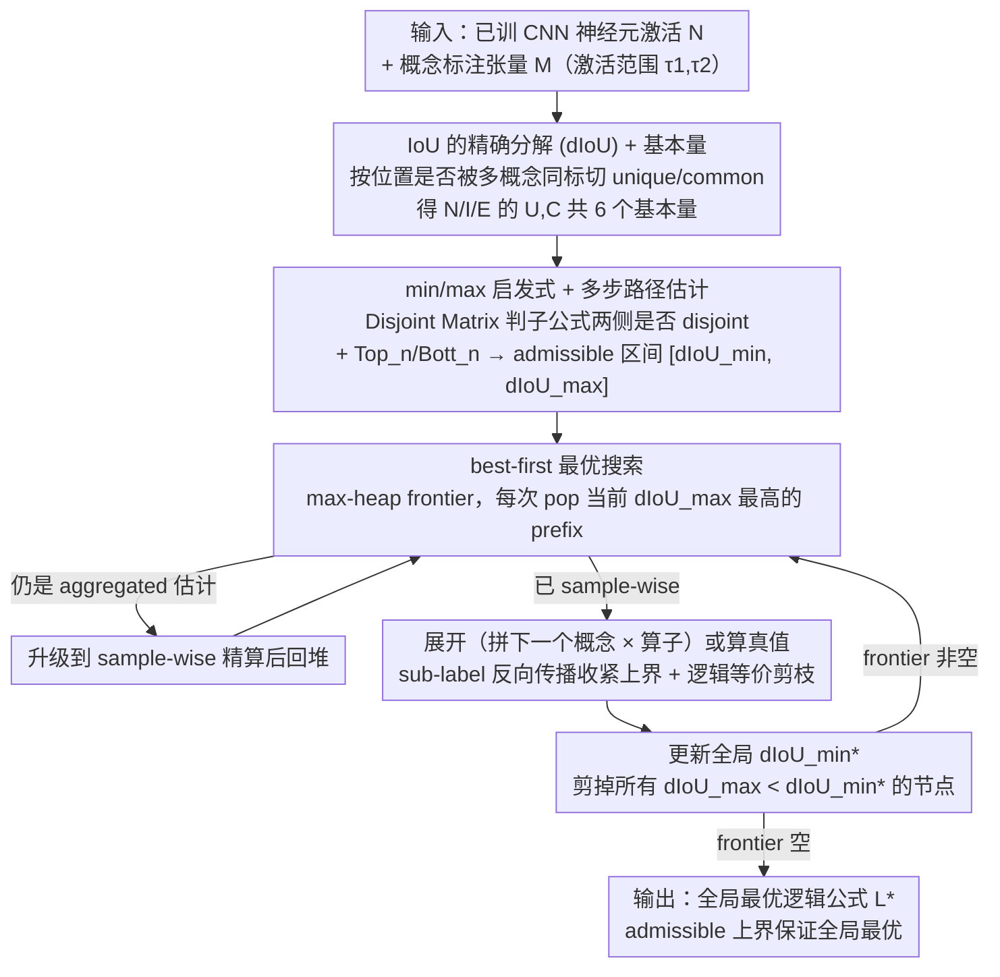

# Guaranteed Optimal Compositional Explanations for Neurons

**会议**: ICML 2026 Oral  
**arXiv**: [2511.20934](https://arxiv.org/abs/2511.20934)  
**代码**: 论文中给出（"We release the code at the following repository"，具体链接见原文）  
**领域**: 可解释性 / 神经元解释 / 组合解释  
**关键词**: 神经元解释、IoU 分解、最优组合解释、启发式搜索、束搜索  

## 一句话总结
组合解释通常用束搜索找"和神经元激活对齐最好的逻辑公式"，但束搜索没有最优性保证；本文提出 IoU 的精确分解 (dIoU) + 一个 admissible 启发式 + 一个 best-first 最优算法，在与束搜索相当的运行时间内**首次保证给出全局最优解**，并据此揭示过去文献中 10–40% 的解释其实是次优的。

## 研究背景与动机

**领域现状**：组合解释 (compositional explanations, Mu & Andreas 2020) 是一类专门刻画 CNN 神经元"在空间上和哪些概念对齐"的方法，输出是命题逻辑公式如 `((Cat OR Car) AND White)`，对齐质量用 IoU 量化。它比早期 Network Dissection 只给一个单概念标签更能反映"多义神经元"的真实行为，是机制可解释性的一个支柱方向。

**现有痛点**：完整状态空间在 $L^1$（候选概念集）和 $n$（公式长度）上的组合数是 $\sum_{k=1}^{n}n_o^{k-1}\prod_{i=0}^{k-1}(|L^1|-i)$，Mu & Andreas 给的标准设置下达 $2.8\times 10^{14}$ 次操作，根本无法穷举。过往做法只能用小 beam 的束搜索，附加诸如"概念互异"、"逐层增量拼接"等假设。束搜索的代价是**没有最优性保证**——返回的解可能既不是真正最优的，也不能告诉你和最优的差距有多大。这导致整个领域多年困在一个尴尬位置：解释看起来漂亮，但不知道是"真的就这样"还是"束搜索告诉你就这样"。

**核心矛盾**：状态空间太大无法穷举 vs 束搜索没有最优保证 → 真值未知 → 无法判断现有算法的近似质量，更无法系统性研发更好的启发式。直接做 BFS 在中-高复杂度数据集上要 $\sim 4\times 10^{8}$ 小时，显然不可行。

**本文目标**：(i) 定义一组**基本量** (fundamental quantities)，把 IoU 拆成可独立估计、可由逻辑算子组合的项；(ii) 设计一个 **admissible 启发式**给出 $[dIoU_{\min},dIoU_{\max}]$ 区间，把状态空间剪枝得足够小；(iii) 构造一个最优算法，时间复杂度和束搜索同量级。

**切入角度**：作者注意到组合解释只用三个 0-preserving 算子（OR、AND、AND NOT），且公式按 Assumption 2 总能拆成"左边子公式 ⊕ 右边原子概念"。这意味着——如果能把 IoU 表达成"沿样本 $x$ 累加的、能从子公式量推到父公式量的局部项"，就可以做经典 A* 风格的最优搜索。

**核心 idea**：把 IoU 重写为 $dIoU=\frac{\sum_x|I^U(L)_x|+|I^C(L)_x|}{|^1N|+\sum_x|E^U(L)_x|+|E^C(L)_x|}$，其中 $I^{U/C}$（unique/common intersection）和 $E^{U/C}$（unique/common extras）是按"位置是否被多个概念同时标注"切分的可分解项。基于这套分解给出 min/max 估计，套进 best-first search 实现首个**最优**组合解释算法。

## 方法详解

### 整体框架
方法分三段。第一段（Sec. 3.1）定义可分解量：把数据集的位置 $(x,j)$ 按"被几个概念同时标注"分成 **unique** $U$ 和 **common** $C$ 两类，再把神经元激活、与某概念的交集、与某概念的"非激活但被标注的剩余"分别按 $U/C$ 拆分，得到 $N^{U},N^{C},I^{U}(k),I^{C}(k),E^{U}(k),E^{C}(k)$ 六个基本量。第二段（Sec. 3.2）给启发式：基于一个**Disjoint Matrix** $D$ 判断子公式两侧是否在标注上 disjoint，对 OR/AND/AND NOT 分别推出 $I^C$ 和 $E^C$ 的 min/max 递推；再用每个概念在每个量上的 top-$n$/bottom-$n$ 估计"再拼 $n$ 个概念能带来的最大/最小增益"。第三段（Sec. 3.3）把启发式塞进 best-first search 实现最优算法。

### 关键设计

**1. IoU 的精确分解 (dIoU) + 基本量：把全局指标改写成可在 prefix 上剪枝的局部项**

原始 IoU $|^1N\cap{}^1M_L|/|^1N\cup{}^1M_L|$ 只能在公式完整组装好之后算，根本没法对未完成的 prefix 剪枝，而最优搜索恰恰需要"看一眼半截公式就能估上界"。本文的分解关键是按位置 $(x,j)$ 被几个概念同时标注，切成 unique $U$（恰一个概念）与 common $C$（$\ge2$ 个概念），再把神经元激活、与概念的交集、剩余项都按 $U/C$ 拆成 $N^U,N^C,I^U,I^C,E^U,E^C$ 六个基本量。对 0-preserving 的算子（OR、AND、AND NOT 都满足），unique 元素的行为可由 truth table 精确推出（Observation 1）：OR 把两边 unique 相加、AND 把 unique 清零、AND NOT 等于左侧 unique；common 元素则要看左右子公式在标注上是否 disjoint——disjoint 时可类比 unique 精确算、overlap 时只能给区间。最终等价性由 Lemma 3.6 保证：$dIoU=IoU$ 当且仅当算子皆 0-preserving，恰好覆盖文献里所有常用算子。"unique 可精确推 + common 可上下界"这一分离，正是后面启发式能做到 admissible（上界 $\ge$ 真值）的理论基石。

**2. min/max 启发式 + 多步路径估计：给任意 prefix 一个 admissible 的 $[dIoU_{\min},dIoU_{\max}]$**

经典 A* 要 admissible 启发式才能保证最优，这里只需 $dIoU_{\max}$ 永远不低于真值。本文分两层算它。层一是单步估计：对当前 prefix 拼一个新概念 $k$，用 Disjoint Matrix $D$ 区分 disjoint/overlap，按公式 (7)–(10) 算 $I^C/E^C$ 的 min/max，unique 部分按 Observation 1 精确算。层二是多步路径估计：对每个量预先算 $\mathrm{Top}_k$ 和 $\mathrm{Bott}_k$（每样本前/后 $k$ 大概念量累加），用公式 (11)–(14) 对 OR/AND/AND NOT 三种独占路径分别给出 $|I_{\min}|,|I_{\max}|,|\mathrm{Union}_{\min}|,|\mathrm{Union}_{\max}|$，非独占路径取各路径 max/min（admissibility 仍保留），最后

$$dIoU_{\max}=\frac{\sum_x|I_{\max}(L)_x|}{\sum_x|\mathrm{Union}_{\min}(L)_x|}$$

$dIoU_{\min}$ 对称。为了让启发式本身可负担，作者还给了一个 aggregated 省钱版：先按样本求和再做 min/max，精度略降但每个 prefix 只算一次，远便宜于 sample-wise——frontier 入队用 aggregated 粗筛、pop 出来再升级到 sample-wise 精算、最后才算真值。这种"分层精化"是把"启发式可负担"和"搜索可终止"同时拿下的关键。

**3. best-first 最优搜索 + sub-label 反向传播：把"探整个空间"压成"探一棵稀疏 A* 树"**

最优算法用 max-heap frontier 维护候选 prefix，每次 pop 当前 $dIoU_{\max}$ 最高的节点：若还是 aggregated 估计就升级精度后回堆，若已是 sample-wise 精算就展开（拼下一个 atomic concept × 算子）或评估真值，同时维护全局 $dIoU_{\min}^*$ 并剪掉所有 $dIoU_{\max}<dIoU_{\min}^*$ 的节点。四个 trick 让它真的能跑：frontier 初始化只放 $dIoU_{\max}>$ 全局下界的种子，避免一上来爆炸；aggregated → sample-wise → exact 分级精化把昂贵精算只用在有希望的节点；sub-label backpropagation 在评估完整路径时顺手把途中子公式的精确量存下来，frontier 里所有共享该子公式的节点都能用精确量替换估计、连锁收紧上界；逻辑等价剪枝 + 缓冲池去掉 `cat AND NOT cat`、`A OR A` 这类退化表达。由于 $dIoU_{\max}$ 是 admissible 上界且算法穷尽所有"上界高于当前最优下界"的节点，返回解必然全局最优（Appendix F）。这从根本上修复了束搜索"不能回溯早期决定"的毛病——反例 `(ball_pit OR flower) AND NOT dining_room` 里 `ball_pit` 和 `dining_room` 从不共现、约束实为无效，束搜索却会保留它，而 best-first 只要存在真值更高的解、它的某个 prefix 必然上界也高，绝不会被错误剪掉。

### 损失函数 / 训练策略
无训练——这是个分析/解释算法，输入是已训好的 CNN、概念标注数据集和神经元的激活范围 $[\tau_1,\tau_2]$，输出是与神经元最对齐的逻辑公式。

## 实验关键数据

### 主实验
在三种数据复杂度下评估算法的可行性。复杂度沿"概念数 + 是否有 overlap 标注"两轴划分：Cityscapes（25 概念，全 disjoint，低）；Ade20K-Detectron2（847 概念，无 overlap，中）；Broden（1198 概念，频繁 overlap，高）。每个设置抽 ResNet 末层 50 个神经元，激活范围取 top 0.5%。

| 复杂度 | 算法 | Visited | Expanded | Estimated | 秒/单元 |
|--------|------|--------:|---------:|----------:|--------:|
| 低 (Cityscapes) | Optimal (本文) | 1 | 101 | 778 | 0.08 |
| 低 | Beam (本文启发式) | 6 | 14 | 639 | 0.17 |
| 低 | MMESH beam | 121 | 15 | 697 | 10.37 |
| 低 | Vanilla beam | 716 | 15 | – | 2.77 |
| 中 (Ade20K-D2) | Optimal (本文) | 1 | 4915 | 106 | 90.57 |
| 中 | Beam (本文启发式) | 10 | 15 | 37956 | 11.55 |
| 中 | MMESH beam | 39 | 15 | 37956 | 38.42 |
| 中 | Vanilla beam | 37979 | 15 | – | 450 |
| 高 (Broden) | Optimal (本文) | 47 | 105 | 108 | 5768 |
| 高 | Beam (本文启发式) | 27 | 15 | 53752 | 123.33 |
| 高 | MMESH beam | 43 | 15 | 53752 | 102.35 |
| 高 | Vanilla beam | 53775 | 15 | – | 5929 |

**最优算法**在所有三档复杂度下都跑完了，时间和 vanilla beam search 同量级（高复杂度下二者都 $\sim$ 5800 s/unit），远小于 BFS 估算的 $4\times 10^8$ 小时。**用本文启发式制导的 beam search** 在所有设置下 visited 节点最少且 wall-clock 与 MMESH 相当或更快——一份启发式既给了最优算法，也顺手优化了束搜索。

### 消融实验
**束搜索找到的解到底有多差？**

| 模型 | 非最优比例 | Cat 1（概念+IoU 都不同） | Cat 2（同概念，连法不同 → IoU 不同） | Cat 3（同 IoU，连法不同） |
|------|----------:|------------------------:|-------------------------------------:|--------------------------:|
| ResNet | 9% | 76% | 6% | 17% |
| AlexNet | 23% | 93% | 5% | 2% |
| DenseNet | 39% | 73% | 0% | 27% |

高复杂度下 10–40% 的束搜索解释偏离最优。Cat 1（最严重）的非最优解多涉及 AND / AND NOT，说明束搜索特别难处理"需要复杂否定/交集才能精确刻画的多义神经元"。

### 关键发现
- **expanded 节点数 < 0.1% 状态空间**：最优算法的 frontier 在 Broden 高复杂度下只展开 105 个节点（vs 状态空间几亿级），证明 sub-label 反向传播 + min/max 双估计的剪枝效率，"探索整个空间"被压缩到"探索一棵稀疏 A* 树"。
- **aggregated 估计是搜索可行的关键**：估计节点数远大于展开节点数（中复杂度 37956 vs 4915），表明大量节点上界过低被一票否决，根本不需要 sample-wise 精算；这正是"用粗估筛、用精算确认"分级策略的回报。
- **本文启发式的 beam 变体超参不敏感**：解释长度从 3 增到 20、beam 从 5 增到 20，运行时只在 0.19–0.42 min/unit 间漂；MMESH 同样设置下从 0.62 飙到 25 min/unit。这意味着研究者再不需要在 beam size 和探索深度间苦苦折中。
- **DenseNet 的 39% 非最优率**最高，且 Cat 3（同 IoU 不同表达）占 27%——说明 dense 连接形成的神经元对"逻辑表达式的具体形式"特别敏感，束搜索容易给出"IoU 没问题但语义站不住"的伪解（论文给的 `(ball_pit OR flower) AND NOT dining_room` 即此类）。

## 亮点与洞察
- **首个 admissible 启发式**：组合解释领域过去并非没人想做最优搜索，是没人能写出可负担的 admissible 上界。dIoU 把"unique 部分可精确推、common 部分可上下界"的分离做到位之后，A* 才第一次可用。这是把"理论可分析"和"算法可计算"对齐的范例。
- **MMESH 用空间信息，本文只用二元位**：因此本文启发式可推广到不带空间结构的领域（NLP、tabular），而 MMESH 不能。这种"用更弱的假设换更广的适用面"在可解释性文献中是稀缺品。
- **揭示束搜索的隐疾**：`(ball_pit OR flower) AND NOT dining_room` 这个例子直接说明束搜索可以构造出"语义上荒谬但 IoU 上数字漂亮"的解释——`ball_pit` 和 `dining_room` 从不共现使得 `AND NOT dining_room` 实际上是无信息约束。这种由"搜索不能回溯"导致的虚假解释，过去没有 ground-truth 时根本看不出来。

## 局限与展望
- 算法的可行性强依赖于"unique 元素数量"足够多。在 NLP 类数据集（标注几乎全是 overlap）上，所有量都退化到 common 估计的大不确定区间，状态空间塌不下去。作者已点出这个问题但没给方案。
- 高复杂度下最优算法 ~96 min/unit，扫一层 50 个神经元就是 80 小时——可重复研究但不便交互。
- 当神经元本身不可解释（IoU < 0.04）或过度泛化时，frontier 会爆炸；论文建议"先 beam 再对可解释单元跑 optimal"的两阶段策略，但没集成进算法。
- 只在 CNN + 视觉概念上验证。Transformer 的多头多 token 结构、概念向量化（如 Probe-derived concepts）下 dIoU 如何重定义还没探索。
- 解释最大长度默认 3，足够日常用但不足以刻画极复杂的多义神经元；长度变大时 top vector 主导导致搜索退化为 BFS。

## 相关工作与启发
- **vs Mu & Andreas 2020 (vanilla beam)**：本文用同一类公式、同一组算子、同一组假设，但补上了"最优性保证"这一缺失环节。vanilla beam 在中复杂度下 visited 37979（几乎遍历状态空间）才能勉强追上结果，本文最优只 expand 4915 个节点。
- **vs MMESH (La Rosa et al., 2023)**：MMESH 是当前最强的 informed beam，靠空间结构信息加速；本文启发式只用二元信息但 wall-clock 持平或更快，且超参不敏感。两者在 ResNet 上找到相同解（受限于束搜索的状态空间），但本文揭示这个解在 9% 单元上其实非最优。
- **vs Network Dissection (Bau et al., 2017)**：Network Dissection 给单概念解释，组合解释把这个推到多概念逻辑；本文给的"最优"框架反过来可用来 audit Network Dissection 的解释是否真的是单概念最优。
- **vs IoU 的概率近似 (Nowozin 2014; Li et al. 2013)**：那条线在概率分割里用 IoU 的期望近似来做结构化预测；本文做的是确定性的精确分解，更适合搜索语境。两者的精神是相通的——把不可分解的全局量改写成可处理的局部项。
- **对机制可解释性的启示**：组合解释终于有了 ground-truth，这意味着未来研发新的启发式 / 新的算法（如 transformer 神经元解释、SAE 特征解释）有了可对照的金标准；可解释性领域从此可以像优化领域那样讨论"近似比"和"次优率"。

## 评分
- 新颖性: ⭐⭐⭐⭐⭐ 首次给出组合解释的最优性保证；dIoU 分解 + admissible 启发式是干净漂亮的理论贡献。
- 实验充分度: ⭐⭐⭐⭐ 三档复杂度 + 三种 backbone + 与两类 beam 全面对比，分析详尽；但只覆盖视觉 CNN，跨领域验证留待未来。
- 写作质量: ⭐⭐⭐⭐ 公式繁多但层次清晰，Definitions/Observation/Lemma 结构严谨；图 1 的可视化反例帮助极大。
- 价值: ⭐⭐⭐⭐⭐ 给整个组合解释方向提供了 ground-truth 标尺，回溯重审过去文献的结论，并为后续算法研究奠定基础。

<!-- RELATED:START -->

## 相关论文

- [\[AAAI 2026\] Formal Abductive Latent Explanations for Prototype-Based Networks](../../AAAI2026/others/formal_abductive_latent_explanations_for_prototype-based_networks.md)
- [\[ICLR 2026\] Compositional Diffusion with Guided Search for Long-Horizon Planning](../../ICLR2026/others/compositional_diffusion_long_horizon_planning.md)
- [\[ICML 2026\] Optimal Regularization for Performative Learning](optimal_regularization_for_performative_learning.md)
- [\[ICCV 2025\] On the Complexity-Faithfulness Trade-off of Gradient-Based Explanations](../../ICCV2025/others/on_the_complexity-faithfulness_trade-off_of_gradient-based_explanations.md)
- [\[ACL 2025\] Neuron Empirical Gradient: Discovering and Quantifying Neurons' Global Linear Controllability](../../ACL2025/others/neuron_empirical_gradient_discovering_and_quantifying_neurons_global_linear_cont.md)

<!-- RELATED:END -->
