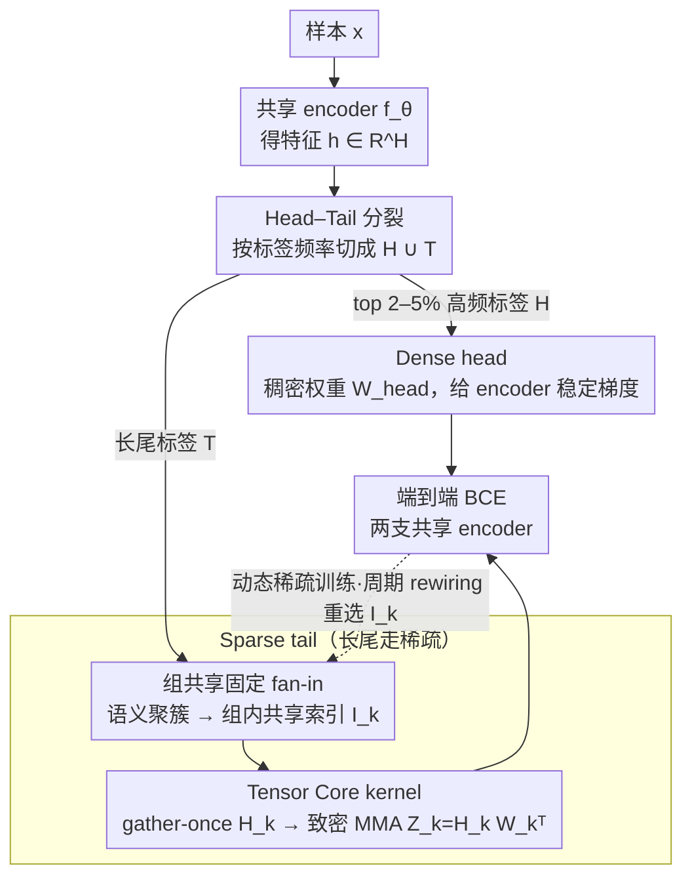

# HASTE: Hardware-Aware Dynamic Sparse Training for Large Output Spaces

**会议**: ICML 2026  
**arXiv**: [2606.01117](https://arxiv.org/abs/2606.01117)  
**代码**: https://github.com/xmc-aalto/haste  
**领域**: 模型压缩 / 极端多标签分类 / 硬件感知稀疏训练  
**关键词**: 极端多标签分类、固定 fan-in 稀疏、组共享、Tensor Core、长尾头尾分裂  

## 一句话总结
针对百万级标签的极端多标签分类，HASTE 把"每个标签独立采样 fan-in"改成"按语义分组共享 fan-in"，再配合一个吃掉高频标签的小 dense head，使得稀疏训练在 GPU 上真正跑出对应 FLOPs 的墙钟收益，前向最多 $4.4\times$、反向最多 $25\times$ 于现有稀疏基线，同时把与 dense 的精度差距收窄到几乎打平。

## 研究背景与动机

**领域现状**：极端多标签分类 (XMC) 的痛点集中在输出层——标签数 $L\sim 10^{6}$ 时，权重矩阵 $W\in\mathbb{R}^{L\times H}$ 既吃内存又吃算力。过去十年的应对路线大致分两派：一派靠标签树 / 最近邻采样（LightXML、CascadeXML、Renee 系列）压缩**计算量**但不动**显存**；另一派直接稀疏化输出层（Spartex 等），同时压缩计算和显存。

**现有痛点**：直接稀疏化看似优雅，但 GPU 不爱吃。无结构稀疏在现代 Tensor Core 上几乎是反优化——内存访问随机、不能合并、Tensor Core 用不上，FLOPs 砍了 90% 墙钟时间却不动。最近的"半结构化固定 fan-in"路线 (Spartex) 给每个标签固定 $F$ 个输入连接，至少负载均衡了；但每个标签的 fan-in 索引是**独立随机**采样的，相邻标签读完全不同的特征，cache 命中惨不忍睹，最终被内存带宽卡死。

**核心矛盾**：稀疏想拿到墙钟收益，必须同时满足**规则的访存模式**（能 coalesce）和**跨输出的特征复用**（能把同一份 $H_k$ tile 进 shared memory 重复用）。块稀疏 (BLOCK-SPARSE) 把这两件事都做到极致，但表达力被砍得太狠——所有标签都被强行绑到同一块连续特征上，精度掉 5–10 个点。另外，长尾标签下稀疏连接给 encoder 的梯度信号本身就稀薄，Spartex 不得不加一个 auxiliary loss 来补梯度通路，又引入新的调参负担。

**本文目标**：(i) 找到一个介于"每标签独立 fan-in"和"完全块稀疏"之间的中间结构，同时拿到访存规则性和表达力；(ii) 用一种数据驱动而非辅助监督的方式，在长尾下给 encoder 提供稳定梯度。

**切入角度**：作者观察到 XMC 的标签语义本身就成簇——亚马逊推荐里"无线耳机"和"蓝牙音箱"自然会用相近的特征子集。既然如此，让**语义相似的标签共享同一组 fan-in 索引**就既符合任务结构，又能把"重复读同一份特征"的开销摊到一组标签上。

**核心 idea**：用**组共享固定 fan-in 稀疏 (group-shared fixed fan-in sparsity)** 替换标签级 fan-in，把输出层拆成"少量高频标签走 dense head + 海量长尾走组共享稀疏 tail"，再写一套吃 Tensor Core 的 CUDA kernel 把这个结构落实成真正的墙钟加速。

## 方法详解

### 整体框架
输入：样本 $x$，先过共享 encoder 得 $h=f_\theta(x)\in\mathbb{R}^H$。输出层被显式拆成两条支路：

- **Dense head**：top 2–5% 高频标签 $\mathcal{H}$，过轻量投影 $h_{\text{head}}=P_{\text{head}}h$ 后接稠密权重 $W_{\text{head}}$。
- **Sparse tail**：剩余 $\mathcal{T}$ 长尾标签，过 $h_{\text{tail}}=P_{\text{tail}}h$ 后接组共享固定 fan-in 稀疏层。

标签 $\ell\in\mathcal{G}_k$ 的 logit 为 $z_\ell(x)=\langle w_\ell,\,h_{\mathcal{I}_{g(\ell)}}\rangle$，其中 $w_\ell\in\mathbb{R}^F$ 是该标签独占的权重，$\mathcal{I}_{g(\ell)}\subseteq[H]$ 是它所在组的**共享 fan-in 索引集**（$|\mathcal{I}_k|=F$）。训练用 BCE，交替进行"连续相位（参数拟合，索引冻结）"与"离散相位（rewiring，按动态稀疏训练协议周期性重选 $\mathcal{I}_k$）"。

### 关键设计

**1. 组共享固定 fan-in 稀疏：让语义相近的标签共用一组 fan-in 索引，一次解决索引内存、访存复用、任务先验三件事**

Spartex 那种"每个标签独立随机采样 fan-in"的痛点是相邻标签读完全不同的特征、cache 命中惨不忍睹。本文把标签 $\{1,\dots,L\}$ 划成 $K$ 个组 $\{\mathcal{G}_k\}$，每组大小 $|\mathcal{G}_k|=G$，组内所有标签共享同一个 fan-in 索引集 $\mathcal{I}_k$（但各自保留独立权重 $w_\ell$），索引存储从 $LF$ 降到 $(L/G)F$，量级少 $G$ 倍。分组不是随便切，而是按语义聚簇——目标 $\{\mathcal{G}_k\}=\arg\max_{\text{partition}}\sum_k\sum_{\ell\in\mathcal{G}_k}\mathrm{sim}(e_\ell,\mu(\mathcal{G}_k))$，标签嵌入 $e_\ell=\mathrm{Normalize}(\frac{1}{|\mathcal{P}_\ell|}\sum_{i\in\mathcal{P}_\ell}h_i)$ 直接取该标签正样本上 encoder 表示的均值，连 dense classifier 都不用训。百万标签下严格求解不可行，作者用两阶段近似：先 mini-batch 球面 $k$-means 聚成 $C\approx L/(\beta G)$ 个粗簇，再在簇内贪心地按 seed + top-$(G-1)$ 近邻拼成大小约 $G$ 的紧凑组。这个设计之所以一箭三雕：索引内存少 $G$ 倍；同组标签复用一份 gathered feature tile，访存被摊薄；标签按嵌入聚簇又自带 task-aligned inductive bias，让语义相近的标签自然共享特征子集。

**2. 吃 Tensor Core 的 gather-once + dense MMA kernel：把组共享结构翻译成一段命中 Tensor Core 的致密 GEMM，让 FLOPs 节省真正变成墙钟加速**

无结构稀疏在 Tensor Core 上几乎是反优化，所以光有好结构还不够，得有配套 kernel。每个 thread block 在标签维上取 $G$ 的整数倍作为 tile，前向计算变成 $Z_k=H_k W_k^\top\in\mathbb{R}^{B_t\times G}$，其中 $H_k=h_{:,\mathcal{I}_k}\in\mathbb{R}^{B_t\times F}$ 是按组一次性 gather 到 shared memory 的特征 tile、$W_k\in\mathbb{R}^{G\times F}$ 是该组所有标签的权重——这是一个**致密** GEMM，恰好命中 Tensor Core MMA 原语，而且 $H_k$ 常驻 shared memory 被组内所有 warp 反复用。反向对权重 $\nabla W_k=(\nabla Z_k)^\top H_k$ 对称，同样是致密 GEMM；反向对特征则因为多个组的 $\mathcal{I}_k$ 可能落在同一维度上需要 reduce，作者用 Split-$K$ 沿标签维并行，组大小 $G$ 直接控制 reduce 的并行度。对比 Spartex 那种每标签 thin vector dot product（没共享 tile、访存量近乎稠密却只算稀疏比例的有效操作），组共享让 $H_k$ 一次 gather 被 $G$ 个标签复用，arithmetic intensity 提升到接近 dense GEMM，省下的 FLOPs 才换得成真实的墙钟加速。

**3. Head–Tail 分裂替代辅助监督：把高频标签拉成 dense head 给 encoder 喂稳定梯度，用数据本身的长尾结构代替超参敏感的 auxiliary loss**

Spartex 在长尾下要靠 auxiliary loss 给 encoder 补梯度通路，但辅助任务可能和主任务梯度冲突，loss 权重、温度又敏感难迁移。本文换个思路：把标签集按频率切成 $\mathcal{Y}=\mathcal{H}\cup\mathcal{T}$，$\mathcal{H}$ 是 top 2–5% 高频标签走 dense head、$\mathcal{T}$ 是长尾走稀疏 tail，两条支路共享 encoder 但各用轻量投影，端到端目标 $\min_\Theta \frac{1}{n}\sum_i[\sum_{\ell\in\mathcal{H}}\mathrm{BCE}+\sum_{\ell\in\mathcal{T}}\mathrm{BCE}]$。高频标签每个 batch 都被激活，dense 通路天然给 encoder 提供稠密稳定的梯度回流；长尾的稀疏通路梯度虽稀薄，但 encoder 已被 head 端"喂饱"，长尾只需局部 fine-tune。这和 auxiliary loss 的目的一致（都是给 encoder 多一条稠密梯度通路），但实现从"额外监督任务"换成"利用数据本身的长尾结构"，只引入"切点频率"一个超参，且实验里 PSP@k（强调尾部标签的指标）反而比 Spartex 还高，说明梯度通路的改善确实惠及了尾部。

### 损失函数 / 训练策略
端到端 BCE，BF16 精度；encoder 用 Adam，输出层用带动量 SGD；动态稀疏训练沿用 RigL 思路，每隔若干步触发一次 rewiring 修改组级 $\mathcal{I}_k$（保持 $|\mathcal{I}_k|=F$），具体见 Algorithm 1/3。

## 实验关键数据

### 主实验
四个 XMC 数据集，标签数从 670K 到 8.6M。

| 数据集 | 指标 | Dense | Spartex (sparse SOTA) | block sparse | HASTE | 显存 (GiB) |
|--------|------|-------|----------------------|--------------|-------|------------|
| Amazon-670K | P@1 | 50.6 | 47.1 | 45.0 | **48.1** | 2.1 (vs Spartex 3.7) |
| AmazonTitles-670K | P@1 | 43.7 | 42.6 | 39.4 | **43.0** | 3.2 (vs Spartex 5.0) |
| Amazon-3M | P@1 | 52.6 | 50.2 | 27.9 | **52.5** | 5.67 (vs Spartex 13.5) |
| LF-Paper2Keywords-8.6M | P@1 | 43.6 | 40.7 | 22.8 | **47.5** | 12.5 (vs Spartex 18.4) |

HASTE 在所有数据集上**稳定优于 Spartex** 同时显存少 1.5–2.5 倍，epoch 时间 Amazon-3M 上从 86:38 砍到 21:39；在最大数据集 LF-Paper2Keywords-8.6M 上 P@1 甚至**反超 dense** 3.9 个点（dense 在该数据集已饱和）。

### 消融实验
| 配置 | P@1 (Amazon-670K) | 说明 |
|------|-------------------|------|
| HASTE 完整 | 48.1 | Semantic grouping + HT split |
| 换 random grouping | 46.3 | 语义分组贡献 +1.8 |
| 换 frequency grouping | 46.7 | 仅按频率分组次于语义 |
| 去掉 head–tail 分裂 | 46.8 | HT 贡献 +1.3 P@1 |
| 组大小 $G=16$ | 48.1 | 表达力最佳 |
| 组大小 $G=32$ | 47.7 | 中庸 |
| 组大小 $G=64$ | 47.5 | kernel 最快但精度最差 |

### 关键发现
- **Kernel-level micro-benchmark 才是论文的真正卖点**：前向最多 $4.4\times$、反向最多 $25\times$ 于标准固定 fan-in，且和 FLOPs-matched dense 只差几个百分点。换言之，"稀疏 FLOPs"第一次真正变成"稀疏墙钟"。
- **语义分组比频率分组更管用**（+1.4 P@1），佐证了"按任务结构共享 fan-in"的 inductive bias 假设——这是 HASTE 区别于纯硬件 trick 的核心论点。
- **PSP@k（propensity-scored，强调尾部）也涨**：Amazon-3M 上 HASTE 的 PSP@1 从 Spartex 的 14.3 涨到 15.9，LF-8.6M 从 4.0 涨到 6.7。说明 head–tail 分裂并非简单把 head 喂饱掉队的尾巴，而是因为 encoder 拿到稳定梯度后，尾巴的稀疏分类器也学得更好。
- **组大小 $G$ 是经典权衡**：$G$ 越大 kernel 越快（更多复用、更好 Split-$K$ 并行）但精度略降；论文给出 $G=16\sim 32$ 是最佳 sweet spot。

## 亮点与洞察
- **Inductive bias 与硬件 alignment 一次到位**：通常"对 GPU 友好"和"对任务友好"是 trade-off，但这里"语义相似标签共享特征"既符合任务结构（推荐场景下天然成立）又恰好提供了 Tensor Core 所需的规则访存——两边正好对齐，是设计上少有的甜区。
- **用数据结构替代辅助 loss**：Spartex 用 auxiliary loss 给 encoder 补梯度，HASTE 直接把高频标签拉出来变成 dense head。这是一种"用架构 inductive bias 代替超参敏感的辅助监督"的范式，可以迁移到其他长尾任务（如长尾分割、检索）。
- **稀疏研究的诚实标尺**：论文坚持报"墙钟时间 + 显存"而非只报 FLOPs，并明确对比 FLOPs-matched dense（即把 dense 也降到同样 FLOPs 的 bottleneck 版本），这是稀疏文献里少见的硬核做法。

## 局限与展望
- 论文只评估了单 A100 GPU 上的 kernel；多卡情形下 group-shared fan-in 与通信原语的交互未讨论，可能受 NCCL all-reduce 颗粒度影响。
- 分组依赖一份"预先算好的 encoder 表示"来生成 $e_\ell$，意味着冷启动需要先跑一遍 dense 或近似 encoder；论文用预训练 BERT 跑一次得到 $e_\ell$，但若是从头训新 encoder 时如何 bootstrap 没明说。
- $G$ 是个手调超参（与硬件 tile 大小耦合），不同 GPU 上的最优 $G$ 大概率不同；自动搜 $G$ 或与 N:M sparsity 结合是自然方向。
- Tensor Core 的优势主要在 BF16/FP16，与更激进的 FP8/INT4 量化结合时（与 ELMO 互补）是直接可走的下一步。

## 相关工作与启发
- **vs Spartex**：同源（Aalto 同一组），都是固定 fan-in；区别是 Spartex 每标签独立 fan-in + auxiliary loss，HASTE 组共享 fan-in + head–tail 分裂。HASTE 把"对每标签随机 gather"的内存墙问题彻底拆掉，并消除辅助监督依赖。
- **vs BLOCK-SPARSE (Okanovic et al., 2025)**：块稀疏强制连续 + 共享，硬件极快但精度崩（Amazon-3M 上 P@1 27.9 vs HASTE 52.5）；HASTE 选择更柔性的"组共享但索引可任意"，在硬件友好与表达力之间找到中点。
- **vs ELMO (FP8 量化)**：路线正交。ELMO 砍数值精度，HASTE 砍连接稠密度。LF-8.6M 上 HASTE 反超 ELMO 在 P@1 上 +4.1 分，表明在极大标签规模下"砍连接"比"砍精度"更省显存且不掉点；两者完全可叠加。
- **vs RigL / 动态稀疏**：HASTE 沿用动态稀疏的 rewiring 思想，但把 mask 粒度从 per-weight 升到 per-group，让 mask 更新与 kernel 设计协同——这是把 sparse training 文献中的 mask 维度和 systems 文献中的 tile 维度对齐的一次成功示范。

## 评分
- 新颖性: ⭐⭐⭐⭐ 组共享 fan-in 是 fixed fan-in 与 block sparse 之间的自然插值，但首次把语义分组、kernel 设计、head–tail 分裂三件事一起做实。
- 实验充分度: ⭐⭐⭐⭐⭐ 四个数据集（最大 8.6M 标签）+ kernel micro-benchmark + 与 dense/sparse/量化三类基线对比 + 完整消融，标杆级别。
- 写作质量: ⭐⭐⭐⭐ 公式与图表清晰，硬件细节交代充分；唯一缺点是 head–tail 切点选择缺少消融。
- 价值: ⭐⭐⭐⭐⭐ 把"稀疏 FLOPs 不等于稀疏墙钟"这个困扰稀疏研究多年的隐疾真正解决了，对工业级 XMC（广告、推荐、搜索）有直接落地价值。

<!-- RELATED:START -->

## 相关论文

- [\[ICML 2026\] AMDP: Asynchronous Multi-Directional Pipeline Parallelism for Large-Scale Models Training](amdp_asynchronous_multi-directional_pipeline_parallelism_for_large-scale_models_.md)
- [\[ACL 2025\] HATA: Trainable and Hardware-Efficient Hash-Aware Top-k Attention for Scalable Large Model Inference](../../ACL2025/others/hata_trainable_and_hardware-efficient_hash-aware_top-k_attention_for_scalable_la.md)
- [\[CVPR 2025\] Subnet-Aware Dynamic Supernet Training for Neural Architecture Search](../../CVPR2025/others/subnet-aware_dynamic_supernet_training_for_neural_architecture_search.md)
- [\[ICML 2026\] Decision Tree Learning on Product Spaces](decision_tree_learning_on_product_spaces.md)
- [\[CVPR 2025\] ZO-SAM: Zero-Order Sharpness-Aware Minimization for Efficient Sparse Training](../../CVPR2025/others/zo-sam_zero-order_sharpness-aware_minimization_for_efficient_sparse_training.md)

<!-- RELATED:END -->
