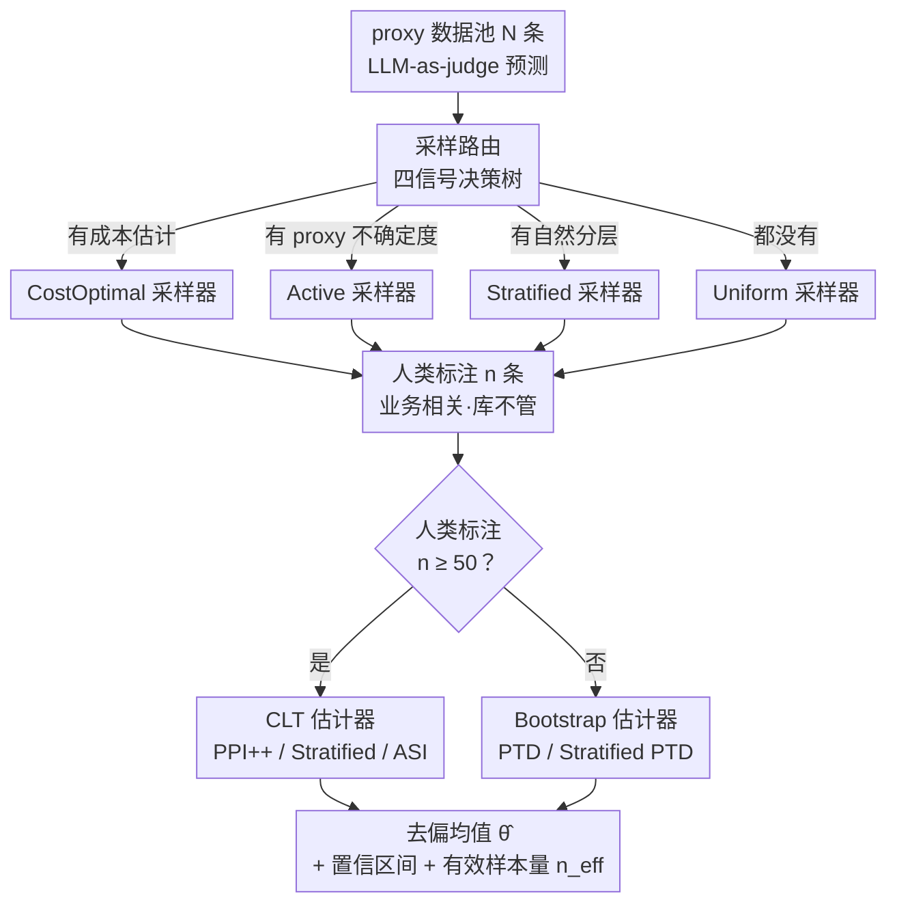

# Industrializing Prediction-Powered Inference: The GLIDE Library for Reliable GenAI and Agentic Systems Evaluation

**会议**: ICML2026  
**arXiv**: [2605.31278](https://arxiv.org/abs/2605.31278)  
**代码**: https://github.com/EmertonData/glide  
**领域**: LLM 评测 / 统计推断 / Agentic 系统  
**关键词**: Prediction-Powered Inference、LLM-as-Judge、Stratified Sampling、Active Sampling、有效样本量  

## 一句话总结
GLIDE 把 PPI（prediction-powered inference）家族的最新估计器（PPI++、Stratified PPI、PTD、ASI）与采样器（uniform、stratified、active、cost-optimal）统一封装成 scipy 风格的均值估计库，专门解决"贵的人类标注 + 便宜但有偏的 LLM-as-judge"的混合评测问题，并配套蒙特卡洛验证与一颗决策树，让 GenAI / Agentic 系统的可信评估真的能上工业化。

## 研究背景与动机

**领域现状**：评估 GenAI / Agentic 系统的"质量"通常落到一个均值估计任务上——准确率、相关率、幻觉率、毒性率、工具使用正确率等都是 $\theta^\star=\mathbb{E}[Y]$。当前两种主流做法各有缺陷：(i) 全人类标注，结果可信但贵且慢，agentic 一条轨迹（含检索、工具调用、推理、最终回答）专家审起来动辄数美元；(ii) LLM-as-judge，便宜（几美分一条）但有系统性偏差，尤其在医疗、法律、金融等领域知识密集场景。

**现有痛点**：Angelopoulos 等（2023）提出的 PPI 框架原本就是为这种"少量真值 + 大量代理预测"场景设计的——给出无偏估计 + 名义覆盖置信区间。但 (i) PPI 的扩展（PPI++、Stratified、PTD、ASI、cost-optimal）散落在各自论文里，notation 不统一，参考实现也只是片段；(ii) 现有的 `ppi_py` 库是 PPI 早期奠基实现，覆盖到 GLM / M-estimator 但对均值估计的特化深度不够、新方法没有集成；(iii) Agentic 评测有 4 个独特属性（极端成本不对称、自然分层、有可用 proxy 不确定度、关键部署场景），完美对应到 PPI 各分支，但没有任何库把它们端到端串起来。

**核心矛盾**：实际部署中工程师需要一条"既要无偏估计、又要置信区间有效、又要尽可能省标注预算"的路径，且要能根据"是否有成本估计 / 是否有 proxy 不确定度 / 是否有自然分层 / 标注预算是否足够"的具体情况自动选方法；但学术实现的碎片化让这件事工程上不可行。

**本文目标**：把 PPI 家族最近 3 年的进展工业化为单一 scipy 风格库，覆盖 (1) 估计器统一封装；(2) 采样器统一封装；(3) 可复现的蒙特卡洛验证套件；(4) 经验校准的方法选择决策树；(5) 真实 agentic benchmark 案例。

**切入角度**：作者刻意**只做均值估计**——这是部署侧 90% 评测指标的形态，砍掉 GLM/M-estimator 的一般性可以让 codebase 大幅简化，多个在一般 M-estimation 中分叉的估计器在均值场景下会塌缩成同一个，反而让 API 一致性变好。同时把"采样 / 标注 / 估计"显式分成三阶段，让采样器和估计器可独立替换组合。

**核心 idea**：用 PPI++ 风格的"少量人类标注 + 大量 LLM-as-judge 预测 → 无偏均值 + 有效置信区间"做核心，把 stratified / active / cost-optimal 当成正交插件挂上去，并强调一个工程口号——"更好的 proxy 不是替代人类标注，而是把人类标注预算放大"。

## 方法详解

### 整体框架
GLIDE 把整个评测流水线分成三步：**Sampling → Annotation → Estimation**。给定一池 $N$ 条 proxy-labeled 数据（来自 LLM-as-judge），(1) 一个采样器从中挑 $n$ 条交给人类标注；(2) 标注步骤业务相关，库不管；(3) 一个估计器把 $n$ 条人类真值 + $N$ 条 proxy 预测合并成去偏估计 $\hat\theta$ 与置信区间。这种 sampler ↔ estimator 解耦的好处是可以任意 mix-and-match，且新方法贡献者只需写一个 file。

PPI 的核心公式（PPI++，Angelopoulos 2023b）：
$$\hat\theta^{\text{PPI++}}_\lambda = \frac{1}{n}\sum_{i=1}^n Y_i + \lambda\left(\frac{1}{N}\sum_{j=1}^N f(X_j) - \frac{1}{n}\sum_{i=1}^n f(X_i)\right)$$

其中 $f$ 是 proxy（LLM-as-judge），$\lambda\in\mathbb{R}$ 是 power-tuning 参数，$\lambda^\star$ 有闭式解最小化渐近方差，保证 PPI++ 在渐近上**永远不劣于**只用人类标注的经典估计器，即使 proxy 是对抗性的。整个库的形态可以看成「一棵决策树替你在采样端和估计端各选一次方法，中间夹一个业务自管的标注步骤」：

### 关键设计

**1. 三步解耦 + scipy 风格 API：让采样和估计成为可插拔的正交对象**

PPI 文献近三年的改良各管一段——有的只改采样、有的只改估计，但散落在各自论文里没法叠加。GLIDE 把整条流水线切成 Sampling → Annotation → Estimation 三步，让前后两端独立可换：Sampler 暴露 `sample` 方法返回 $(\pi,\xi)$，其中 $\pi\in[0,1]^N$ 是每个观测被采样的概率、$\xi\in\{0,1\}^N$ 是 Bernoulli 抽出的实际包含指示符；Estimator 是有状态对象，`estimate` 返回含点估计、置信区间、有效样本量 $n_{\text{eff}}$ 和 metric 标签的 dataclass。于是一条完整 end-to-end 流（采样 + 标注 + 估计）压到 6 行 Python 就能跑。沿用 scipy / scikit-learn 这套社区最熟悉的范式几乎零学习成本，而三步解耦的真正价值是让"独立改良采样"和"独立改良估计"的工作能无缝叠加——研究者贡献新方法只需写一个文件。

**2. 5 类采样器 × 5 类估计器：把 Agentic 评测的四大特性映成方法菜单**

Agentic 评测有四个独特属性——成本极端不对称、自然分层、有可用的 proxy 不确定度、关键部署场景——每一个都对应 PPI 的一个分支，但此前没有库把它们串起来。GLIDE 把这些"如果有 X 就用 Y"摆成一张连续的菜单。采样器五类：`UniformSampler`（基线）、`StratifiedSampler`（支持 proportional 或 Neyman 分配 $n_h\propto N_h\sigma_h$，用 Hamilton 最大余数法保证整数和为 $n$）、`ActiveSampler`（按 proxy 不确定度成正比的 Bernoulli 概率独立抽取）、`CostOptimalRandomSampler` 与 `CostOptimalSampler`（基于已知 proxy/annotation 成本比 + 可选每观测不确定度算最优抽样概率）。估计器五类：`PPIMeanEstimator`（PPI++ + power tuning）、`StratifiedPPIMeanEstimator`（按层 power tuning）、`PTDMeanEstimator`（Predict-Then-Debias，bootstrap，专为 $n<50$ 小样本）、`StratifiedPTDMeanEstimator`、`ASIMeanEstimator`（IPW 去偏配合 active sampling），另加 3 个 classical baseline 提供无 proxy 的参考方差。这样实践者不必自己去翻 7 篇论文 + 7 个独立 repo。

**3. 四信号决策树：让不懂 PPI 的工程师 30 秒选对组合**

把方法摆成菜单还不够，还得替不懂统计细节的人做选择，否则工业化只完成一半。GLIDE 把方法选择内嵌成一棵决策树。上半截（采样）按三个布尔信号路由：有成本估计 → CostOptimal 系；有 proxy 不确定度 → ActiveSampler；有 heterogeneous-proxy 自然分层 → StratifiedSampler；都没有 → UniformSampler。下半截（估计）只看一个阈值：人类标注是否 ≥ 50（分层时按层计），是则用 CLT-based 估计器（PPI++ / Stratified PPI++ / ASI），否则用 bootstrap-based PTD 变体。这棵树不是拍脑袋画的，而是由 Section 5 的蒙特卡洛验证套件经验校准过——它把"应该用哪个估计器"从一个研究问题降级成一次查表，正是 PPI 真正工业化此前缺的那一环。

### 损失函数 / 训练策略
本文不涉及训练，只涉及统计推断。所有估计器都返回 `PredictionPoweredMeanInferenceResult`（含 $\hat\theta$、置信区间、$n_{\text{eff}}$、metric 标签）。有效样本量 $n_{\text{eff}}=n\cdot\widehat{\text{Var}}(\bar Y_n)/\widehat{\text{Var}}(\hat\theta^{\text{PPI++}}_\lambda)$ 是核心 KPI，其比值 $n_{\text{eff}}/n\ge 1$ 直接折算成"省下来的标注小时数"。

## 实验关键数据

### 主实验
**蒙特卡洛验证**：合成二分类任务，真值 $\theta^\star=0.55$，proxy 均值 $0.50$（有偏），按 Pearson 相关 $\rho$ 控制 proxy 质量。$N_{\text{true}}=500$、$N_{\text{proxy}}=1000$、置信水平 90%、1000 次重复、$\rho\in\{0.1,0.2,\dots,0.9\}$。

| 相关 $\rho$ | 方法 | 经验覆盖率 | 区间宽度 | 有效样本量 $n_{\text{eff}}$ |
|-------------|------|-----------|----------|------------------------------|
| 0.1 | Labeled-only | 0.90 | 0.073 | 500 |
| 0.1 | PTD | 0.90 | 0.072 | ≈ 500 |
| 0.5 | Labeled-only | 0.90 | 0.073 | 500 |
| 0.5 | PTD | 0.90 | 0.060 | ≈ 750 |
| 0.9 | Labeled-only | 0.90 | 0.073 | 500 |
| 0.9 | **PTD** | **0.90** | **0.049** | **≈ 1100 (2.2×)** |

PTD 在所有 $\rho$ 都贴合 90% 名义覆盖；proxy 越好，区间越窄、$n_{\text{eff}}$ 越大；proxy 退化到无信息时，PTD 自动塌回 labeled-only 的宽度，从不"变差"。

**Agentic 案例：R-Judge 安全评测**：568 条 user/agent 对话，5 个领域（general / programming / finance / web / IoT），真值 $\theta^\star\approx 0.525$。Proxy 用 claude-sonnet-4-6 当 LLM-as-judge，自带 1–10 verbalized confidence，整体 proxy 均值 ≈0.655（偏 +13 pp），$\rho\approx 0.59$。预算 $n=100$ 人类标注，$N=468$ 只 proxy，1000 次重复。

| 协议 | 90% 覆盖率 | 区间宽度 | $n_{\text{eff}}$ |
|------|-----------|----------|------------------|
| Labeled-only ($n=100$) | 0.90 | 0.164 | 100 |
| Proxy-only (无去偏) | <0.05 | 0.066 | — |
| PPI++ (uniform) | 0.90 | 0.137 | ≈ 143 |
| ASI (active) | 0.90 | 0.135 | ≈ 148 |
| **Stratified PPI++ (Neyman)** | **0.90** | **0.131** | **≈ 157 (1.57×)** |

### 消融实验
| 配置 | 经验覆盖率 (90%) | 平均区间宽度 | 说明 |
|------|------------------|--------------|------|
| Full：PPI++ + power tuning | 0.90 | 0.137 | 默认推荐组合 |
| w/o power tuning（$\lambda=1$） | 0.90 | 0.142 | 略微变宽，但保持覆盖 |
| w/o stratification | 0.90 | 0.137 | 退回普通 PPI++，丢掉分层增益 |
| w/o active sampling（用 uniform） | 0.90 | 0.137 | 与 PPI++ 相同 |
| Proxy 拉差（$\rho=0.1$ 仿真） | 0.90 | 0.072 ≈ baseline | proxy 退化，区间自动放宽，覆盖不破 |
| 仅 proxy（无人类标注） | < 0.05 | 0.066 | 区间窄但中心偏，覆盖崩盘 |

### 关键发现
- **"覆盖永不破"的鲁棒性**：所有 4 个带人类标注的协议在全部 $\rho$ 和全部置信水平下都贴合名义覆盖率，唯独"只用 proxy"的 baseline 把名义 95% 区间打到经验覆盖近 0——验证了 PPI 的"unconditional-on-proxy"理论保证在真实 LLM-as-judge 场景依然成立。
- **Stratification > Active**（在 R-Judge 上）：在该 benchmark 上分层（按 5 个应用域）比按 proxy 不确定度 active sample 略胜一筹，且无需额外 proxy 不确定度信号，对工程方更友好。
- **Proxy 质量 ↔ 有效样本量是单调函数**：从 $\rho=0.1$ 到 $0.9$，有效样本量 ≈500 → ≈1100（同样 500 人类标注 + 1000 proxy），把"更好的 LLM-as-judge"直接折算成 2.2× 标注预算。
- **小样本场景下必须用 PTD**：CLT-based 估计器要求 $n\gtrsim 50$ 每层，否则区间宽度低估；bootstrap 版本 PTD 是工程上稳的兜底。

## 亮点与洞察
- **"采样 / 标注 / 估计"三阶段解耦是真正能 scale 的库设计**：贡献者写 sampler 不用碰 estimator，反之亦然，让 PPI 学术圈零碎工作可被持续吸纳——这是软件工程意义上的胜利。
- **"更好的 proxy 不是替代人类标注，而是放大它"**：把投资 LLM-as-judge 的回报量化成 $n_{\text{eff}}/n$ 比值，给"该不该花钱升级 judge"这种产品决策提供了硬数字。
- **决策树嵌入库**：把"应该选哪个估计器"从研究问题降级为查表问题，这种把统计学知识封装到 API 入口的设计非常值得别的统计推断库参考。
- **专门做均值估计的取舍**：放弃 GLM / quantile / M-estimator 的一般性，换来更深的均值估计实现 + 更一致的 API；在部署侧 90% 指标都是均值的现实约束下，这个 trade-off 是对的。

## 局限与展望
- **只做均值估计**：quantile（例如 P95 延迟、最差用例毒性率）、GLM 系数、回归系数等场景仍要回到 `ppi_py`。
- **CLT-based 估计器需 $n\ge 50$**：小样本只能退到 PTD bootstrap；超小样本（$n<20$）的有效性没有给出严格上界。
- **假设单一 proxy + i.i.d. 数据**：不支持多 proxy 聚合、不支持 covariate / label shift、不支持 anytime-valid（流式监控）。
- **annotation 阶段刻意不管**：在垂直域部署里，标注流水线本身才是最难、最贵的部分；GLIDE 假设这个能力已经具备。
- **非确定性评估开放**：agentic 系统多次运行结果会有差异（一个输入多个输出），如何在"输入覆盖"和"输出复制"之间分预算是 open question。
- **多标注者真值**：当多个专家对同一条轨迹分歧时，目标已不是 population mean，而是带标注不确定度的潜在标签均值，框架待扩展。

## 相关工作与启发
- **vs `ppi_py` (Angelopoulos et al. 2023a)**：奠基库，覆盖均值 / GLM / M-estimator，但 (i) 没有 PPI++ 之后的新方法（Stratified、PTD、ASI、cost-optimal）；(ii) 没有 cross-method 验证套件；(iii) 没有决策树。GLIDE 是均值场景的"实战增强版"，二者互补而非替代。
- **vs HELM / lm-eval-harness / DeepEval / RAGAS**：那一层负责"跑评测、产 proxy 和真值"，是上游编排器；GLIDE 是下游统计层，把它们的输出转成有覆盖保证的去偏估计——两者堆叠。
- **vs Egami et al. 2023（design-based supervised learning）**：社会科学领域里类似 PPI 的想法，本文回到 CS / ML 工程语境并系统化。
- **vs Csillag et al. 2025（PPI e-values）**：anytime-valid PPI，可用作 GLIDE roadmap 里"流式监控"分支的接入点。
- **vs Cowen-Breen et al. 2026 / Shan et al. 2025（multi-proxy aggregation）**：多 judge 聚合是 GLIDE 路线图第一优先级。

## 评分
- 新颖性: ⭐⭐⭐ 单看技术是把若干已有方法整合成一个库，新方法不多，但**首次工业化 + 决策树设计 + 案例研究**这件事本身就有显著工程价值。
- 实验充分度: ⭐⭐⭐⭐ 蒙特卡洛覆盖每个估计器的覆盖率/宽度/$n_{\text{eff}}$ 三件套 + R-Judge 真实 agentic case，完整且可复现。
- 写作质量: ⭐⭐⭐⭐⭐ 把"采样 / 标注 / 估计"框架和决策树讲得极清楚，从 PPI 公式到 case study 一气呵成，是统计软件论文的范文。
- 价值: ⭐⭐⭐⭐⭐ Agentic / GenAI 评测是工业级痛点，GLIDE 是目前最贴近"开箱即用"的方案，社区影响力大概率会快速积累。

## 评分
- 新颖性: 待评
- 实验充分度: 待评
- 写作质量: 待评
- 价值: 待评

- [\[ICML 2025\] Prediction-Powered Adaptive Shrinkage Estimation](../../ICML2025/others/prediction-powered_adaptive_shrinkage_estimation.md)
- [\[ACL 2025\] Identifying Reliable Evaluation Metrics for Scientific Text Revision](../../ACL2025/others/reliable_eval_metrics_scientific.md)
- [\[NeurIPS 2025\] Prediction-Powered Semi-Supervised Learning with Online Power Tuning](../../NeurIPS2025/others/prediction-powered_semi-supervised_learning_with_online_power_tuning.md)
- [\[ICML 2026\] Inference of Online Newton Methods with Nesterov's Accelerated Sketching](inference_of_online_newton_methods_with_nesterovs_accelerated_sketching.md)
- [\[ACL 2025\] SEOE: A Scalable and Reliable Semantic Evaluation Framework for Open Domain Event Detection](../../ACL2025/others/seoe_semantic_eval.md)

<!-- RELATED:END -->

<!-- RELATED:START -->

## 相关论文

- [\[ICML 2025\] Prediction-Powered Adaptive Shrinkage Estimation](../../ICML2025/others/prediction-powered_adaptive_shrinkage_estimation.md)
- [\[ACL 2025\] SEOE: A Scalable and Reliable Semantic Evaluation Framework for Open Domain Event Detection](../../ACL2025/others/seoe_semantic_eval.md)
- [\[AAAI 2026\] MicroEvoEval: A Systematic Evaluation Framework for Image-Based Microstructure Evolution Prediction](../../AAAI2026/others/microevoeval_a_systematic_evaluation_framework_for_image-based_microstructure_ev.md)
- [\[ICML 2026\] Inference of Online Newton Methods with Nesterov's Accelerated Sketching](inference_of_online_newton_methods_with_nesterovs_accelerated_sketching.md)
- [\[ICML 2026\] Beyond Model Readiness: Institutional Readiness for AI Deployment in Public Systems](beyond_model_readiness_institutional_readiness_for_ai_deployment_in_public_syste.md)

<!-- RELATED:END -->
