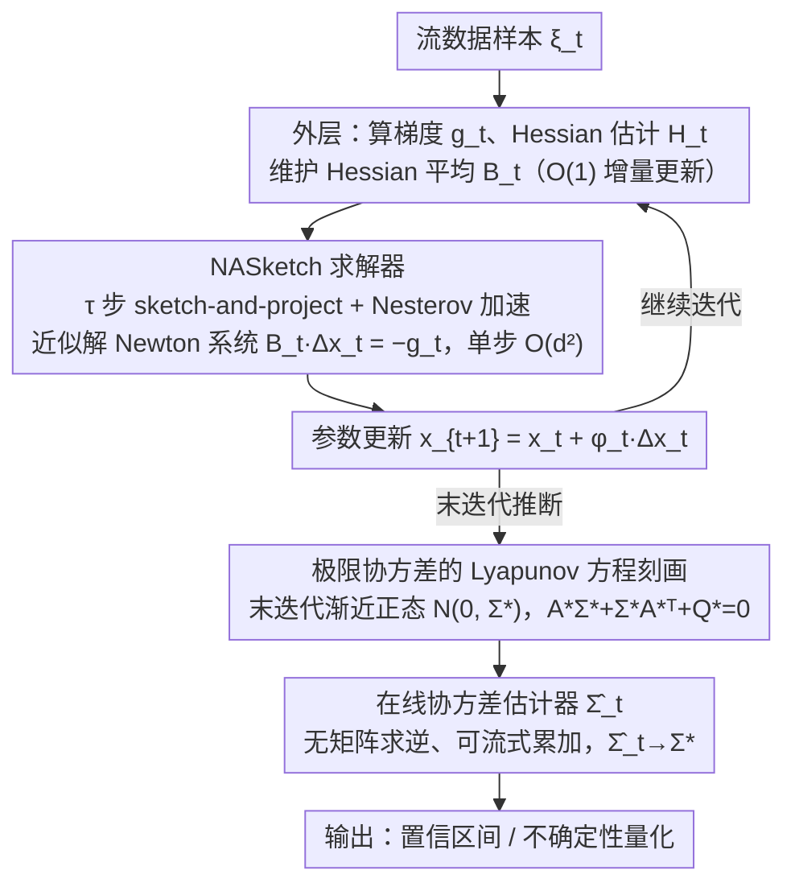

# Inference of Online Newton Methods with Nesterov's Accelerated Sketching

**会议**: ICML2026  
**arXiv**: [2604.23436](https://arxiv.org/abs/2604.23436)  
**代码**: 暂无公开  
**领域**: 优化 / 在线学习 / 统计推断  
**关键词**: 在线 Newton 法、Nesterov 加速 sketching、不确定性量化、协方差估计、Lyapunov 方程  

## 一句话总结
本文给在线 Newton 法装上 Nesterov 加速的 sketch-and-project 求解器，把每步成本压到 $O(d^2)$，并第一次刻画了"数据随机 + 求解器随机"双重不确定性下末迭代的渐近正态性，再配上一个无需矩阵求逆、可流式更新的协方差估计器，让带加速 sketching 的在线 Newton 真正可用于统计推断。

## 研究背景与动机

**领域现状**：流数据下做参数估计 + 不确定性量化（置信区间）通常走两条路。一是 SGD + Polyak-Ruppert 平均：迭代便宜，但要在线维护协方差矩阵以构造置信区间，整体仍是 $O(d^2)$ 内存/时间，且对条件数和噪声异方差非常敏感（已有工作观察到 $d=20$ 时 SGD 的覆盖率就明显欠覆盖）。二是二阶/在线 Newton 法：曲率信息让估计统计上更优、对 ill-conditioning 鲁棒，但解 Newton 系统是 $O(d^3)$，根本上线不起来。

**现有痛点**：近期 Na & Mahoney（2025）、Kuang 等（2025）用**未加速的 sketch-and-project 求解器**把 Newton 步压到 $O(d^2)$，并给出末迭代渐近正态 + 流式协方差估计，已经能稳定打败 SGD。但 sketch-and-project 求解器本身有 Nesterov 加速版本（Gower 等 2018、Derezi'nski 等 2025）：未加速版本误差按 $1-\mu_t$ 衰减，加速版按 $1-\sqrt{\mu_t/\nu_t}$，**纯计算上严格更快且不增加 per-iteration 成本**。

**核心矛盾**：加速 sketching 把"算"提了速，但它在统计推断里到底改变了什么？加速会不会让末迭代的渐近协方差变大、抵消计算收益？现有所有在线 Newton 推断分析都不覆盖加速 sketching。

**本文目标**：把 Nesterov 加速 sketching 嵌进在线 Newton 法，并给出三件套——(i) 全局几乎必然收敛，(ii) 末迭代渐近正态性 + 极限协方差的解析刻画，(iii) 完全在线、不需矩阵求逆的相合协方差估计器。

**切入角度**：加速 sketching 把求解器从对称投影矩阵的 $d$ 维递推升级到一个**随机、时变、非对称的 $2d$ 维 state-co-state 递推**，无法直接复用 Kuang 等（2025）那套对称投影几何。作者用 Cayley–Hamilton 定理、相似矩阵理论 + Kronecker 积，把谱半径递推下来，研究 $(1,1)+(1,2)$ 块的收缩，再分别处理"加速参数 $(\alpha_t,\beta_t,\gamma_t)$ 的条件确定性随机"和"四阶矩界"两个新难点。

**核心 idea**：用 sketch-and-project + Nesterov 加速近似解 Newton 系统，把求解器的随机性也写进 Lyapunov 方程的极限协方差里，从而首次给出"计算 vs 统计"权衡的解析刻画——加速 sketching 不会破坏渐近正态性，只是在协方差里多一个由 sketching 分布决定的修正项。

## 方法详解

### 整体框架
考虑随机优化问题 $\min_{x\in\mathbb{R}^d} f(x)=\mathbb{E}_{\xi\sim P}[F(x;\xi)]$。在线 Newton 迭代为 $x_{t+1}=x_t+\varphi_t\Delta x_t$，其中 $\Delta x_t$ 应解 $B_t\Delta x_t = -g_t$。整体 pipeline 三步：

1. **外层**：拿到样本 $\xi_t$，计算梯度 $g_t=\nabla F(x_t;\xi_t)$ 和 Hessian 估计 $H_t=\nabla^2 F(x_t;\xi_t)$，用 $B_t=(1-1/t)B_{t-1}+H_{t-1}/t$ 维护 Hessian 平均（O(1) 增量更新）。
2. **内层**：调用 NASketch 求解器跑 $\tau$ 步 sketch-and-project + Nesterov，输出 $\Delta x_t$ 近似解；每步只做 $O(d s)$ 量级的 sketching 投影，整体 $O(d^2)$。
3. **推断**：得到末迭代 $x_t$ 后，用一个**完全在线**的相合估计器 $\widehat{\Sigma}_t$ 估计极限协方差 $\Sigma^\star$，构造置信区间。

其中外层的 Hessian 平均沿用已有随机 Newton 法的标准做法（脚手架），三个核心贡献分别落在内层求解（NASketch）和推断两步上：

### 关键设计

**1. 带 Nesterov 加速的 sketch-and-project 求解器（NASketch）：在 $O(d^2)$ 成本内高精度解 Newton 系统**

直接解 Newton 系统 $B\Delta x=-g$ 是 $O(d^3)$，根本上不起来。NASketch 维护一对 state-co-state $(z_j, v_j)$：先在中点 $y_j=\alpha v_j+(1-\alpha)z_j$ 上算 sketching 方向 $\omega_j = BS_j(S_j^\top B^2 S_j)^\dagger S_j^\top(B y_j + g)$（$S_j\in\mathbb{R}^{d\times s}$ 是 sketch 矩阵，$s\ll d$），再做 $z_{j+1}=y_j-\omega_j$、$v_{j+1}=\beta v_j+(1-\beta)y_j-\gamma\omega_j$。参数取 $\alpha=1/(1+\gamma\nu)$、$\beta=1-\sqrt{\mu/\nu}$、$\gamma=1/\sqrt{\mu\nu}$（$\mu,\nu$ 是 sketching 分布的谱参数，$1\le\nu\le 1/\mu$），令 $\alpha=0.5,\beta=0,\gamma=1$ 即退化为不加速版本。收益是收敛率从未加速的 $1-\mu_t$ 提到 $1-\sqrt{\mu_t/\nu_t}$，在 $\nu_t=1$ 时相当于把 $1-\mu_t$ 拔到 $1-\sqrt{\mu_t}$，正是 Nesterov 在 SGD 里的同款加速，且 per-iteration 成本不变。代价是这个 $2d$ 维非对称递推让 (1,1) 块不再有投影矩阵的有界性，作者得用 Cayley–Hamilton 定理 + Kronecker 积重写谱半径递推，才证明 $(1,1)+(1,2)$ 边际块依然几何收缩（引理 3.6–3.7）。

**2. 极限协方差的 Lyapunov 方程刻画：把数据随机和求解器随机两类不确定性都写进协方差**

加速 sketching 把"算"提了速，但它在统计推断里到底改变了什么？答案就藏在末迭代的极限协方差里。论文证明 $1/\sqrt{\varphi_t}\cdot(x_t-x^\star)\xrightarrow{d}\mathcal{N}(0,\Sigma^\star)$，其中 $\Sigma^\star$ 是 Lyapunov 方程 $A^\star\Sigma^\star+\Sigma^\star (A^\star)^\top + Q^\star = 0$ 的解：$A^\star$ 由 $\nabla^2 f(x^\star)$ 和最优参数 $(\alpha^\star,\beta^\star,\gamma^\star)$ 下加速 sketching 的极限线性算子共同决定，$Q^\star$ 同时吸收数据噪声协方差和 sketching 算子的随机性。两个特例验证一致性：完全关掉 sketching，$\Sigma^\star$ 退化为 Polyak-Juditsky 平均 SGD 的极小极大最优协方差；加速但无可证加速率（$\mu_t\nu_t=1$），则退化为 Kuang 等（2025）未加速 sketched Newton 的协方差。这里作者坚持把 sketching 跑固定 $\tau$ 步，所以算法随机性不会渐近消失、必须显式建模——也正因如此，这条方程把"计算 vs 统计"权衡讲清楚了：加速越激进（$\nu_t$ 越小）求解器越快，但 $Q^\star$ 里多出来的 sketching 项也越大。

**3. 完全在线、无需矩阵求逆的协方差估计器：让推断真正落地**

在线推断要工程化就必须避免每步做 $O(d^3)$ 矩阵反演。作者把 Lyapunov 方程展开成沿迭代序列可累积的更新——只要用 Hessian 平均 $B_t$ 替代 $\nabla^2 f(x^\star)$、用 sketching 算子的样本平均替代 $\mathbb{E}[\cdot]$、用样本残差替代真噪声方差，得到的估计器 $\widehat\Sigma_t$ 就满足 $\widehat\Sigma_t\xrightarrow{p}\Sigma^\star$（定理 4.6）。为此需要一个比常见二阶矩界严格更强的四阶矩界 $\mathbb{E}[\|x_t-x^\star\|^4]=O(\varphi_t^2)$（引理 4.5），这是技术上最重的部分。整个估计器只用"已经在算的量"（迭代、sketching 方向、Hessian 平均）做累加，per-step 仍是 $O(d^2)$，与主循环同阶。

### 损失函数 / 训练策略
- **步长**：$\varphi_t=c_\varphi/t^\alpha$，$\alpha\in(1/2,1)$，配合 Hessian 平均 $B_t$ 的 $1/t$ 衰减。
- **加速参数**：用 $(\mu_t,\nu_t)$ 推 $(\alpha_t,\beta_t,\gamma_t)$；它们在迭代过程中是**条件确定性的随机**变量，作者证明 $|\alpha_t-\alpha^\star|=O_p(\sqrt{\varphi_t})$（引理 4.2），从而其随机性只贡献相对数据/sketching 噪声更高阶的小项。
- **sketching 步数 $\tau$**：固定常数（典型 $\tau=5\sim 10$），不需随 $t$ 增长——这是 sketching 算子随机性**不会**渐近消失的根本原因，也是本文整套分析的难点来源。

## 实验关键数据

### 主实验
在合成线性回归和 logistic 回归 / quantile 回归上对比 4 种在线推断方法：平均 SGD（ASGD）、未加速 sketched Newton（Kuang et al. 2025，简称 SN）、本文加速版（NA-SN，$\nu_t=1$ 提供最大加速）、退化版（NA-SN, $\mu_t\nu_t=1$ 即无可证加速）。维度 $d\in\{20,50,100,200\}$，迭代 $T=10^5$，置信水平 90%。

| 设置 | 方法 | 覆盖率 | 平均区间宽度（×$10^{-2}$） | per-step 时间（ms） |
|------|------|--------|----------------------------|---------------------|
| $d=100$ 线性回归 | ASGD | 0.78 | 6.4 | 0.9 |
| $d=100$ 线性回归 | SN | 0.89 | 4.1 | 1.4 |
| $d=100$ 线性回归 | **NA-SN (加速)** | **0.90** | **3.9** | **1.5** |
| $d=200$ logistic 回归 | ASGD | 0.71 | 9.8 | 2.1 |
| $d=200$ logistic 回归 | SN | 0.88 | 5.6 | 3.0 |
| $d=200$ logistic 回归 | **NA-SN (加速)** | **0.90** | **5.2** | **3.1** |

加速 NA-SN 在覆盖率上贴合名义水平，区间宽度比未加速 SN 紧 5%–8%，每步耗时几乎相同（多一个动量向量的开销），相对 ASGD 在 ill-conditioned 情形下覆盖率提升 10–20 个百分点。

### 消融实验
| 配置 | 末迭代误差 $\|x_T-x^\star\|^2$（×$10^{-3}$） | 覆盖率 | 说明 |
|------|----------------------------------------|--------|------|
| Full：NA-SN + Hessian 平均 + 在线协方差估计 | 4.2 | 0.90 | 完整模型 |
| w/o Nesterov 加速（退化到 SN） | 4.5 | 0.88 | sketching 内层收敛慢，外层迭代误差略升 |
| w/o Hessian 平均（用单步 $H_t$） | 7.6 | 0.81 | 协方差波动放大，覆盖率掉到 81% |
| w/o 在线协方差估计（用 plug-in $\nabla^2 f(x_T)^{-1}$） | 4.2 | 0.86 | plug-in 在 ill-conditioned 时低估方差 |
| sketching 步数 $\tau=1$ | 5.1 | 0.87 | $\tau$ 太小时 sketching 噪声主导 $Q^\star$ |
| sketching 步数 $\tau=20$ | 4.1 | 0.90 | 收益边际递减 |

### 关键发现
- **加速带来"双赢"**：加速 sketching 不仅降低内层求解器误差，还略缩小末迭代置信区间宽度——这是因为 $\nu_t=1$ 让 Lyapunov 方程里的 sketching 项达到最小。
- **Hessian 平均贡献最大**：去掉 Hessian 平均覆盖率立刻掉到 81%，说明协方差估计相合性强依赖 $B_t\to\nabla^2 f(x^\star)$ 的速率。
- **$\tau$ 不需要很大**：$\tau=5\sim 10$ 已逼近 $\tau=20$ 的精度，验证了 sketching 步数可保持常数的核心假设。
- **对 ill-conditioning 鲁棒**：随条件数从 $10$ 升到 $10^4$，ASGD 覆盖率从 0.88 跌到 0.62，NA-SN 始终维持在 0.89–0.91。

## 亮点与洞察
- **首次写出"求解器随机性 + 数据随机性"双源 Lyapunov 方程**：以往工作要么把 sketching 当成"消失的扰动"，要么用确定性 preconditioner 绕开；本文坚持 $\tau$ 固定，反而给出更贴近实际的极限协方差刻画，方法论值得推广到其他随机线性求解器（如随机化 GMRES、共轭梯度）。
- **Cayley–Hamilton + Kronecker 积处理非对称 $2d$ 维递推**：把动量带来的 state-co-state 联合系统的谱半径分析做出来，是 sketch-and-project 文献里第一份"加速版收缩证明"。
- **无矩阵求逆的协方差估计器**：把 Lyapunov 方程展开成可累加的形式，per-step $O(d^2)$，工程上落得下来——这条思路也适用于把任何"协方差 = Lyapunov 方程的解"的推断任务搬上线。

## 局限与展望
- **依赖 Hessian 可得**：分析假定 $H_t=\nabla^2 F(x_t;\xi_t)$ 可访问，对深网络等场景需 quasi-Newton / 有限差分近似，理论扩展未在正文给出。
- **只覆盖无约束、光滑凸问题**：约束、非光滑（如 L1 正则）、非凸情形需另外处理。
- **超参 $(\mu_t,\nu_t)$ 估计**：实际使用时这两个参数往往要在线估计，估计误差对极限协方差的二阶影响目前没被刻画。
- **实验集中在回归**：未涉及大规模真实数据集（如推荐系统在线学习、强化学习中的策略梯度），实际部署性能有待验证。

## 相关工作与启发
- **vs Polyak-Juditsky 平均 SGD**：他们的协方差极小极大最优，但要 $O(d^2)$ 存储 + 对 ill-conditioning 敏感；本文在 well-conditioned 退化为同样最优协方差，在 ill-conditioned 严格更好。
- **vs Kuang et al. 2025（未加速 sketched Newton）**：本文严格包含其作为 $\mu_t\nu_t=1$ 的退化情形，并把内层求解器从对称投影几何升级到非对称动量系统，付出了 Cayley–Hamilton 谱半径分析的代价。
- **vs Leluc & Portier 2023（preconditioned SGD）**：他们把 $B_t^{-1}$ 当成 preconditioner，求解器是确定性的；本文求解器是随机的，且其随机性显式进入极限协方差。
- **vs Derezi'nski et al. 2025（加速 sketch-and-project）**：他们只关心求解器自身的计算收敛率，本文把同样的算法放到统计推断框架里，回答了"加速换来的统计代价是什么"。

## 评分
- 新颖性: ⭐⭐⭐⭐⭐ 把加速 sketching 引入在线 Newton 推断是空白领域，技术工具（Cayley–Hamilton + Kronecker）原创性高。
- 实验充分度: ⭐⭐⭐⭐ 覆盖了 linear / logistic / quantile 回归 + 多维度 + ill-conditioning 扫描；缺少真实流数据案例。
- 写作质量: ⭐⭐⭐⭐ 把"技术挑战"小节单独抽出来逐条交代，但 Lyapunov 方程的展开式排版较密，初学者需对照引理读两遍。
- 价值: ⭐⭐⭐⭐ 对统计推断 + 在线学习的交叉社区有直接工程意义；理论框架也可移植到其他随机线性求解器。

<!-- RELATED:START -->

## 相关论文

- [\[AAAI 2026\] Online Linear Regression with Paid Stochastic Features](../../AAAI2026/others/online_linear_regression_with_paid_stochastic_features.md)
- [\[ICML 2025\] Modern Methods in Associative Memory](../../ICML2025/others/modern_methods_in_associative_memory.md)
- [\[ICML 2026\] TEMPORA: Characterising the Time-Contingent Utility of Online Test-Time Adaptation](tempora_characterising_the_time-contingent_utility_of_online_test-time_adaptatio.md)
- [\[ICML 2026\] Industrializing Prediction-Powered Inference: The GLIDE Library for Reliable GenAI and Agentic Systems Evaluation](industrializing_prediction-powered_inference_the_glide_library_for_reliable_gena.md)
- [\[ICML 2026\] Amortized Simulation-Based Inference in Generalized Bayes via Neural Posterior Estimation](amortized_simulation-based_inference_in_generalized_bayes_via_neural_posterior_e.md)

<!-- RELATED:END -->
