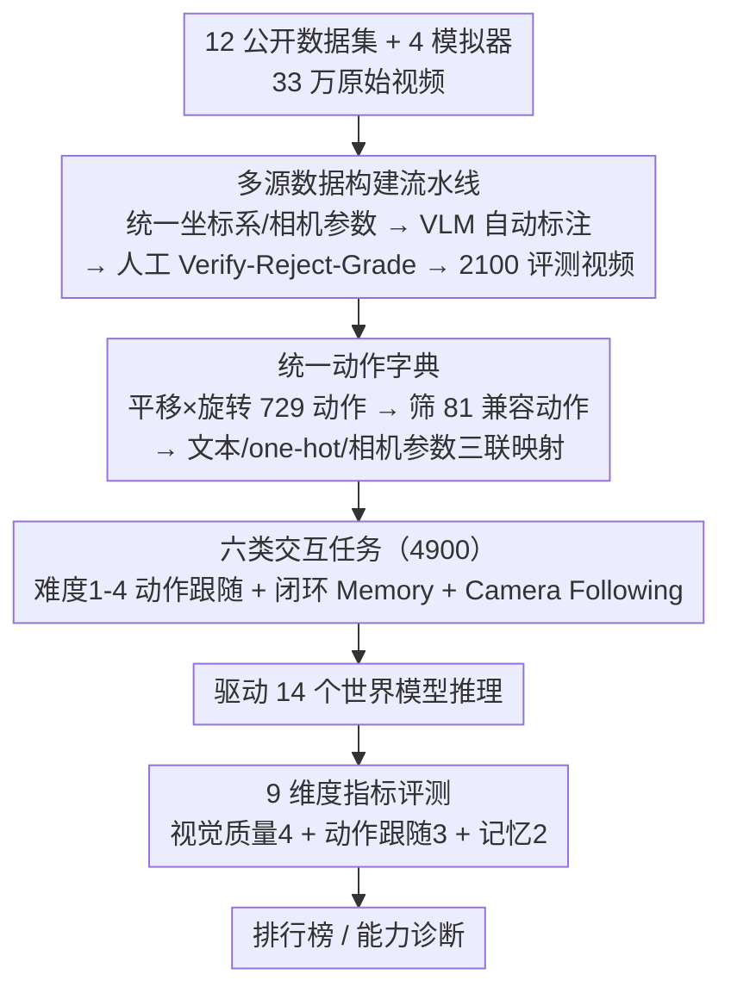

# iWorld-Bench: A Benchmark for Interactive World Models with a Unified Action Generation Framework

**会议**: ICML 2026  
**arXiv**: [2605.03941](https://arxiv.org/abs/2605.03941)  
**代码**: iWorld-Bench.com（项目主页）  
**领域**: 交互式世界模型 / Benchmark / 视频生成评测  
**关键词**: 世界模型, 动作可控视频生成, 相机控制, 记忆能力, 跨模态评测

## 一句话总结
iWorld-Bench 是首个专门为"交互式世界模型"设计的统一评测基准，提出一套能把文本 / one-hot / 相机内外参三种动作输入折算到同一指令空间的 Action Generation Framework，并基于 330K 视频精挑 4.9K 任务、9 项指标，对 14 个主流模型做了全维度对比。

## 研究背景与动机
**领域现状**：世界模型（Genie、HunyuanVideo、Wan、Matrix-Game、CameraCtrl 等）正在向"既会预测未来又能响应外部动作指令"的交互式方向演进，其潜在应用覆盖游戏引擎、自动驾驶、具身智能。

**现有痛点**：(1) 现有 benchmark 几乎都是单视角、单场景，多采自行人街景；(2) 不同模型用的"动作"模态完全不同 — 文本指令、one-hot 按键、相机内外参 — 同一句"前进"在不同模型里对应几十种不同低层信号，没法直接比；(3) 现有 benchmark 大多是为通用 T2V 或具身操作设计的，缺乏对交互响应、相机跟随、记忆能力的考察。

**核心矛盾**：跨模态动作语义对齐缺失 + 任务体系不覆盖"交互性"这一核心维度，导致世界模型评测目前是"水果跟蔬菜在比"。

**本文目标**：(1) 构建一个多场景、多视角、全天候的世界模型数据集；(2) 给出一个跨模态统一的动作编码框架；(3) 设计能区分"动作跟随能力"和"记忆能力"的任务集，并给出 9 个对应指标。

**切入角度**：作者注意到第一人称相机运动可以分解为正交的平移和旋转两个子空间，把每个子空间离散到 27 个动作 → 总共 729 个组合 → 再筛出与多数模型兼容的 81 个，作为统一的"动作字典"。所有模态都被映射到这个字典上。

**核心 idea**：用"统一动作字典"把异构模态的世界模型拉到同一评测面上，再叠加多场景多天气数据和包含闭环任务的设计，让评测覆盖动作跟随、视觉质量、空间记忆三类能力。

## 方法详解

### 整体框架
iWorld-Bench 由三块组成：(1) 数据流水线 — 从 12 个公开数据集（KITTI、NCLT、TartanAir、SpatialVid 等）+ 4 个模拟器（AerialVLN、UAV_ON、Openfly、EmbodiedCity）中收集 33 万视频，统一坐标系/相机参数格式，用 VLM 自动打标 + 人工校验后选出 2100 条评测视频；(2) Action Generation Framework — 定义 729 维动作空间，映射到 81 个跨模态兼容动作，每个动作配一组文本 / one-hot / 相机参数三联表示；(3) 6 类评测任务 — Difficulty 1-4 动作跟随（共 4000 任务）+ Memory（200 任务，闭环路径要求模型记得回到原点）+ Camera Following（700 任务，专测相机参数模型），合计 4900 任务，配 9 个指标。最后用这套任务驱动 14 个主流世界模型推理，按 9 维指标打分排行。

### 关键设计

**1. 多源数据构建流水线：把异构数据集"洗"成世界模型可训练的统一格式**

现有带高质量相机内外参的数据集大多没法直接拿来训/评世界模型——各家坐标系、内外参格式互不相同，硬拼会让轨迹物理上对不上。作者搭了一条标准化流水线把这件事补齐：先从 12 个公开数据集（KITTI、NCLT、TartanAir、SpatialVid 等）+ 4 个模拟器（AerialVLN、UAV_ON、Openfly、EmbodiedCity）汇集 33 万视频，统一校正到同一右手坐标系（用对角校正矩阵让平移/旋转分量物理一致），把连续轨迹切成定长 81 帧片段、配上内参与行主序 3×4 投影矩阵；再用 VLM 自动打标后，由标注员按"Verify-Reject-Grade"协议（先验证首帧、剔除幻觉/歧义样本、人工修正场景与实体标签、并标注记忆任务与 4 级难度）逐条把关，最终从 33 万里精选 2100 条高质量评测视频。这条流水线让数据覆盖 UGV / UAV / 人 / 机器人四种视角 + 9 种户外天气 + 5 种室内光照，比以往单源、单视角的 benchmark 全面得多——它是后续动作字典与任务设计能立得住的地基。

**2. 统一动作字典（Action Generation Framework）：把异质模态的动作拉到同一公共子空间**

世界模型评测最大的障碍是"动作"模态各说各话——同一句"前进"在文本、one-hot 按键、相机内外参三种模型里对应几十种完全不同的低层信号，根本没法直接比。作者的破题点是把第一人称相机运动正交分解成平移 $T$ 和旋转 $R$ 两个子空间，各 27 个原子动作，组合空间 $|T|\times|R|=729$；再根据"多数模型不支持上下平移 / 摆头滚转"的现实，筛出 $9\times9=81$ 个核心动作，给每个动作配一组 (text, one-hot, camera intrinsics+extrinsics) 三联映射表，并标上难度 $D\in\{1,\dots,6\}$ 与有效性 $V\in\{0,1\}$。这等于把所有模型都投影到 81 维的公共子空间上比较——直接拿文本 prompt 去对比相机参数模型会让低自由度模型吃亏，统一字典则把这种不公平消掉，而且天然可扩展：未来出新模态只需补一份映射表。

**3. 六类交互任务（含闭环 Memory 任务）：用"走出去再走回来"逼出空间记忆短板**

基于统一动作字典，作者设计了 6 类任务共 4900 条：难度 1-4 的动作跟随任务（4000 条，难度由首帧的遮挡、背景杂乱程度决定）、专测相机参数模型的 Camera Following（700 条）、以及最见功力的闭环 Memory 任务（200 条）。其中 Memory 任务是整套设计的点睛之笔——以往 benchmark 只测开环跟随，模型哪怕是"金鱼脑"也能拿高分，看不出有没有空间记忆。作者构造闭合相机轨迹（出发点 = 终点），要求模型一次性推理完整序列，再用两个指标度量回到原点时画面与几何能否复现：Memory Symmetry（轨迹中点对称帧的像素一致性）和 Trajectory Alignment（瞬时位移向量的镜像相似度）。这个设计简单却杀伤力大——闭环路径会直接暴露 KV-cache 截断、注意力衰减这类真实问题，结果一半以上模型 Symmetry < 0.5，14 个模型里没有一个 > 0.85，"金鱼记忆"问题被一眼看穿。

**4. 9 维度评测指标体系：把"好不好用"拆成互不冗余的三类九分**

单一总分会把"画质好但不听话"和"听话但画崩"两种截然不同的 trade-off 混成一个数字。作者把评测拆成视觉质量（4 项）+ 动作跟随（3 项）+ 记忆（2 项）共 9 个子分：视觉质量用 MUSIQ、亮度/色温时间一致性、HSV 色温漂移、Tenengrad+BRISQUE 联合锐度度量；动作跟随用 ViPE 提取生成视频的相机轨迹后与 GT 比对，并刻意把"内在估计误差"和"模型执行误差"分离开（Trajectory Accuracy 比命令、Trajectory Tolerance 比 GT 视频过同一估计器后的轨迹，从而抵消 ViPE 自带噪声）；记忆指标如上。每一项都做了人类偏好对齐验证。这套拆分让 trade-off 显形——表 3 里 CogVideoX 视觉质量第一却相机跟随只有 0.595，正是被单一分数会掩盖掉的典型。

### 损失函数 / 训练策略
本文是评测 benchmark，没有训练。评测协议：所有 14 个模型在 NVIDIA A800 上跑原始推理设定（默认采样、不做集成），每任务用同一组初始帧 + 同一组动作序列驱动；9 个指标都经过人工偏好实验校准（与人类判断相关性显著）。

## 实验关键数据

### 主实验
14 个模型在 4 类动作跟随 + 记忆任务上的总分对比（节选）：

| 控制方式 | 模型 | Avg | Trajectory Acc | Memory Sym | 排名 |
|----------|------|-----|----------------|------------|------|
| One-hot | HY-World 1.5 | **0.787** | 0.747 | **0.848** | 1 |
| Camera | videox-fun-Wan | 0.747 | 0.717 | **0.901** | 2 |
| Text | HunyuanVideo-1.5 | 0.719 | 0.684 | 0.634 | 3 |
| Camera | AC3D | 0.715 | 0.579 | 0.907 | 4 |
| Text | CogVideoX-I2V | 0.696 | 0.595 | 0.601 | 5 |
| Camera | MotionCtrl | 0.549 | 0.673 | 0.310 | 14 |

700 条相机参数任务上的 Camera Following 单独排名：AC3D 以 Trajectory Tolerance 0.909、Motion Smoothness 0.992 大幅领先，早期方法 ASTRA 只有 0.428。

### 消融实验
跨模态对照表（同一动作语义在不同输入模态上的执行差异）：

| 维度 | Text 控制 (5 模型均值) | One-hot (2 模型均值) | Camera (7 模型均值) | 解读 |
|------|------------------------|----------------------|---------------------|------|
| 图像质量 | 0.64 (高) | 0.58 | 0.51 | 文本模型继承了 T2V 的视觉先验 |
| 轨迹准确度 | 0.62 | **0.72** | 0.62 | one-hot 离散信号最强可控 |
| 记忆对称性 | 0.51 | 0.59 | 0.59 | 文本模型最易"忘路" |

### 关键发现
- **存在普遍的视觉质量 ↔ 可控性 trade-off**：CogVideoX-I2V 视觉一致性 0.899（最高）但轨迹准确度只 0.595；从 CogVideoX 微调出来的 AC3D 反过来 — 控制能力大涨但视觉指标退化，说明专门 fine-tune for camera control 是有代价的。
- **One-hot 离散动作整体最优可控**：HY-World 1.5 和 Matrix-Game 2.0 这种用键盘式编码的模型在动作跟随上压过了文本模型，提示"动作信号要离散且强对齐"才能学好物理。
- **记忆能力是普遍短板**：14 个模型中没有一个 Memory Symmetry > 0.85；闭环回到原点时几乎所有模型都偏离了初始画面。
- **强 encoder 让早层就形成清晰特征**：早期方法（MotionCtrl, CameraCtrl）的 Trajectory Tolerance 大幅落后，反映出新一代相机控制注入机制带来的真实进步。

## 亮点与洞察
- "729→81 动作字典"的设计是论文最巧妙之处：用维度对齐的方式把不可比的模态强行可比，且字典本身可扩展，未来新模态只需补充一份映射表。
- 把记忆能力做成闭环路径任务，是个简单但杀伤力大的设计 — 直接暴露了所有现有世界模型的"金鱼记忆"问题。
- 将 Trajectory Accuracy 和 Trajectory Tolerance 拆开（前者比对相机命令、后者比对 GT 视频经同一估计器后的轨迹），有效抵消了 ViPE 估计器自带的噪声，是值得借鉴的评测设计 trick。
- 数据上覆盖 UGV / UAV / 人 / 机器人四种视角 + 9 种户外天气 + 5 种室内光照，比 WorldScore（3000 例）和 EWMBench（2100 例机械臂）都更全面。

## 局限与展望
- 评测主要用单次推理结果，没有跑多次平均或 ensemble；某些采样敏感的模型可能被低估。
- 81 个动作仍然是离散字典，对真正连续的细粒度操作（如微小转向角）覆盖有限。
- 评测指标里相机轨迹依赖 ViPE 提取器，若 ViPE 本身在某些场景误差大，会同时影响多个分数。
- 没评测实时性与长程一致性（>10s 视频），作者把这两项列入未来工作。
- 整个数据集 330K 视频 + 4 模拟器渲染采集成本极高，复现门槛不低。

## 相关工作与启发
- **vs WorldScore (Duan 2025)**：WorldScore 关注通用 world generation，没有 interactive / memory 任务设计；iWorld-Bench 显式把"交互"作为一等公民。
- **vs EWMBench / WorldEval**：都聚焦机械臂具身策略评测，是另一条赛道；iWorld-Bench 关注第一人称运动型世界模型。
- **vs VBench (Huang 2024)**：VBench 是通用视频生成质量评测，未涉及动作可控性；iWorld-Bench 与之互补。
- **vs MovBench / WorldBench**：这些 benchmark 都是单模态评测，本文用 Action Generation Framework 第一次实现跨模态可比。

## 评分
- 新颖性: ⭐⭐⭐⭐ — 跨模态动作字典 + 闭环记忆任务是真正的概念创新，弥补了世界模型评测的关键空白。
- 实验充分度: ⭐⭐⭐⭐⭐ — 14 个模型 × 4900 任务 × 9 指标 × 三类输入模态，深度和广度都很罕见。
- 写作质量: ⭐⭐⭐⭐ — 故事线清晰、表格信息密度高，但子任务设计部分的层级有点冗余，初读容易迷路。
- 价值: ⭐⭐⭐⭐ — 给"交互式世界模型"这一新兴方向提供了第一个公认标尺，对后续评测和模型迭代都有锚定作用。

<!-- RELATED:START -->

## 相关论文

- [\[CVPR 2026\] PAI-Bench: A Comprehensive Benchmark For Physical AI](../../CVPR2026/others/pai-bench_a_comprehensive_benchmark_for_physical_ai.md)
- [\[CVPR 2026\] 4DWorldBench: A Comprehensive Evaluation Framework for 3D/4D World Generation Models](../../CVPR2026/others/4dworldbench_a_comprehensive_evaluation_framework_for_3d4d_world_generation_mode.md)
- [\[ICLR 2026\] DA-AC: Distributions as Actions — A Unified RL Framework for Diverse Action Spaces](../../ICLR2026/others/distributions_as_actions_a_unified_framework_for_diverse_action_spaces.md)
- [\[CVPR 2026\] CAD-Refiner: A Unified Framework for CAD Generation and Iterative Editing](../../CVPR2026/others/cad-refiner_a_unified_framework_for_cad_generation_and_iterative_editing.md)
- [\[AAAI 2026\] Beyond World Models: Rethinking Understanding in AI Models](../../AAAI2026/others/beyond_world_models_rethinking_understanding_in_ai_models.md)

<!-- RELATED:END -->
