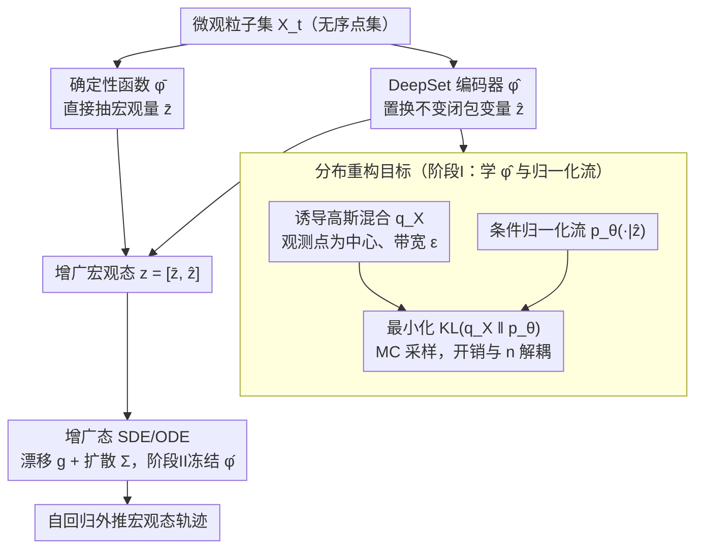

# Learning Permutation-Invariant Macroscopic Dynamics

**会议**: ICML2026  
**arXiv**: [2605.30812](https://arxiv.org/abs/2605.30812)  
**代码**: 暂未公开  
**领域**: 科学计算 / 闭包建模 / 集合表示学习  
**关键词**: 置换不变闭包变量, 分布重构, DeepSet 编码器, 条件归一化流, 宏观动力学

## 一句话总结
本文针对粒子系统这类天然无序的微观状态，提出"重构密度而非重构粒子"的自编码器框架——用 DeepSet 编码器得到置换不变的闭包变量 $\hat{\bm{z}}$，再用条件归一化流把以观测点为中心的高斯混合密度作为重构目标，从而绕开点云匹配，并和宏观可观测量一起被一个 SDE/ODE 学到。

## 研究背景与动机

**领域现状**：科学计算中常需要把高维微观态 $X_t = \{\bm{x}_t^1,\dots,\bm{x}_t^n\}$ 压成低维"闭包变量"，再去预测某个宏观量（能量、混合比、聚合物拉伸度）的演化。主流做法是 MLP/CNN 自编码器 + 逐点 MSE 重构损失，把潜变量当作闭包变量。

**现有痛点**：这类做法默认输入有固定排序——对网格化 PDE 还合适，但对相互作用粒子系统就坏了：同一物理构型在不同编号下被视作不同向量，逐点 MSE 会区别对待 $(\hat{\bm{x}}^1,\hat{\bm{x}}^2,\hat{\bm{x}}^3)$ 和 $(\hat{\bm{x}}^3,\hat{\bm{x}}^2,\hat{\bm{x}}^1)$，潜变量自然不是置换不变的。

**核心矛盾**：编码端可以换成 DeepSet / Set Transformer 来强制不变，但解码端没有"自然顺序"可言——如果让解码器吐出一个有序点集再算逐点损失，本质上又把 $n!$ 个等价排列硬塞进同一目标，要么靠 Hungarian 显式匹配（昂贵），要么靠 Chamfer/EMD 等置换不变距离（不稳定，且会模糊掉点级监督）。

**本文目标**：(i) 学到对输入排序严格不变的闭包变量；(ii) 不依赖任何点对点匹配；(iii) 联合学到宏观可观测量的随机动力学，并能在不同粒子数下泛化。

**切入角度**：与其重构"哪个粒子在哪儿"，不如重构"粒子整体在空间中的密度分布"。对每个集合 $X$ 诱导一个以观测点为中心的高斯混合 $q_X(\mathbf{x})$，再用条件归一化流去拟合它；密度本身天然对粒子标号不变，从而完全绕开匹配问题。

**核心 idea**：把"重构集合"换成"重构集合诱导的分布"——这一目标天然置换不变，且解码器复杂度与 $n$ 解耦。

## 方法详解

### 整体框架
输入为时刻 $t$ 的微观粒子集 $X_t \in \mathcal{X}$。一个**预先给定的确定性函数** $\bar{\bm{\varphi}}$ 直接抽出感兴趣的宏观量 $\bar{\bm{z}}_t$（如系统平均能量、A-B 邻居比 $(R_{AB},R_{BA})$）；一个**学习得到的 DeepSet 编码器** $\hat{\bm{\varphi}}$ 抽出置换不变的闭包变量 $\hat{\bm{z}}_t$；二者拼成增广宏观态 $\bm{z}_t = [\bar{\bm{z}}_t, \hat{\bm{z}}_t]$。在 $\bm{z}_t$ 上学一个 SDE（或 ODE）滚动预测未来宏观态。训练分两阶段：先用分布重构损失学 $(\hat{\bm{\varphi}}, \bm{\psi})$，再冻结 $\hat{\bm{\varphi}}$、学动力学 $(\bm{g}, \bm{\Sigma})$。

### 关键设计

**1. DeepSet 编码器 → 置换不变闭包变量：把不变性写进架构，而不是靠数据增广去近似**

粒子集天然无序，逐点 MSE 会把 $(\hat{\bm{x}}^1,\hat{\bm{x}}^2,\hat{\bm{x}}^3)$ 和它的任意置换当成不同向量，潜变量自然就不是置换不变的。本文在编码端直接用 DeepSet 范式——每个粒子先独立过一个 MLP，再做对称池化（求和/平均），再过一个 MLP——把无序集 $X = \{\bm{x}^i\}_{i=1}^n$ 映成 $\hat{\bm{z}} = \hat{\bm{\varphi}}(X)$，严格满足 $\hat{\bm{\varphi}}(\sigma X) = \hat{\bm{\varphi}}(X), \forall \sigma \in S_n$，复杂度只有 $\mathcal{O}(n)$（也可换成 Set Transformer）。关键在于不变性是架构层面保证的硬性质，而不是靠随机排序增广去"学个大概"：现有同类工作要么对 MLP 编码器做排序增广（AE-Aug，作者实测不严格不变），要么换 DeepSet 但仍配 MSE 解码器（AE-InvE，解码端又会把不变性破坏掉），本文要的是端到端从结构上不变。

**2. 分布重构目标 → 替代点对点匹配：与其重构"哪个粒子在哪儿"，不如重构"粒子整体的密度"，让被重构的对象本身就置换不变**

传统点云重构要么靠 Hungarian 匹配（$\mathcal{O}(n^3)$），要么靠 Chamfer/EMD（梯度噪声大、优化不稳），都很别扭。本文换了被重构的对象：对每个集合 $X$ 诱导一个以观测点为中心、带宽 $\epsilon$ 的高斯混合 $q_X(\mathbf{x}) = \frac{1}{|X|}\sum_{\bm{x}^i \in X}\delta_\epsilon(\mathbf{x} - \bm{x}^i)$，再用条件归一化流 $p_\theta(\mathbf{x}\mid\hat{\bm{z}})$ 去拟合它，最小化 $\mathcal{L}_{\mathrm{rec}} = \mathbb{E}_X[\mathrm{KL}(q_X \,\|\, p_\theta(\cdot\mid\hat{\bm{z}}))]$。密度天然对粒子标号不变，匹配问题就被彻底绕开，损失只用普通 KL。KL 用从 $q_X$ 采的 MC 样本估计——因为 $q_X$ 是等权同方差的高斯混合，可以先均匀挑分量再从局部高斯采，完全并行，而且解码复杂度与 $n$ 解耦，粒子越多反而越省（采样数固定）。带宽 $\epsilon$ 还顺手充当"分辨率旋钮"：小 $\epsilon$ 保细节但要更大 $\hat{z}_{\mathrm{dim}}$，大 $\epsilon$ 平滑、小维度就够。

**3. 增广态 SDE + 两阶段训练 → 联合宏观动力学：把目标宏观量和学到的闭包变量拼起来学随机动力学，再用重构损失防表征坍塌**

直接用感兴趣的宏观量 $\bar{\bm{z}}$ 不闭合——"宏观演化依赖微观自由度"正是闭包建模的核心难点——所以必须搭一个能代表微观信息的 $\hat{\bm{z}}$。本文把二者拼成增广态 $\bm{z}_t = [\bar{\bm{z}}_t, \hat{\bm{z}}_t]$，让漂移 $\bm{g}$ 和扩散 $\bm{\Sigma}$（都用 MLP）学一步条件分布 $p_{\bm{g},\bm{\Sigma}}(\bm{z}_{t+1}\mid\bm{z}_t) = \mathcal{N}(\bm{z}_t + \bm{g}\Delta t,\,\Delta t\,\bm{\Sigma}\bm{\Sigma}^\top)$，通过 Euler-Maruyama 离散化的高斯条件似然 $\mathcal{L}_{\mathrm{dyn}}$ 训练（确定性情形退化为 ODE，损失变成一步 MSE）。但纯 reconstruction-free 的端到端训练容易表征坍塌——潜变量退化成常数（实验里 InvE 基线即如此，效果最差），所以保留重构损失作为防坍塌正则。两阶段训练（先 $\mathcal{L}_{\mathrm{rec}}$ 学 $(\hat{\bm{\varphi}}, \bm{\psi})$、再冻结 $\hat{\bm{\varphi}}$ 学动力学）则避免两个目标互相干扰。

### 损失函数 / 训练策略
总损失 $\mathcal{L} = \mathcal{L}_{\mathrm{rec}} + \lambda_{\mathrm{dyn}}\mathcal{L}_{\mathrm{dyn}}$，实际两阶段顺序训练。KL 估计用从 $q_X$ 抽出的固定数目 MC 样本，因此训练 / 推理代价对 $n$ 不敏感。推理时编码器只用一次（构造 $\bm{z}_0$），随后由动力学模型自回归外推。

## 实验关键数据

### 主实验

三个微观场景：(i) 二维相互作用粒子系统能量演化（确定性，ODE，MRE 评估）；(ii) Lennard-Jones 二元粒子混合（随机，SDE，MMD 评估）；(iii) 聚合物在拉伸流场中的形变（视频输入，确定性 ODE）。每个场景设三个测试制式：in-dst（同分布）、diff-init（初始模式偏移）、diff-N（粒子数偏移）。

| 任务 | 制式 | AE-Aug | AE-InvE | AE-InvE-CD | InvE | 本文 |
|------|------|--------|---------|------------|------|------|
| 粒子能量 (MRE ↓) | in-dst | $1.25 \times 10^{-3}$ | $2.41 \times 10^{-4}$ | $6.14 \times 10^{-5}$ | $6.01 \times 10^{-5}$ | $\mathbf{5.19 \times 10^{-5}}$ |
| 粒子能量 (MRE ↓) | diff-N | N/A | $2.49 \times 10^{-4}$ | $6.43 \times 10^{-5}$ | $6.13 \times 10^{-5}$ | $\mathbf{5.22 \times 10^{-5}}$ |
| 混合比 (MMD ↓) | in-dst | $1.91 \times 10^{-2}$ | $2.60 \times 10^{-2}$ | $2.24 \times 10^{-2}$ | $1.43 \times 10^{-1}$ | $\mathbf{1.09 \times 10^{-2}}$ |
| 混合比 (MMD ↓) | diff-N | N/A | $5.26 \times 10^{-2}$ | $2.16 \times 10^{-2}$ | $1.41 \times 10^{-1}$ | $\mathbf{9.64 \times 10^{-3}}$ |

AE-Aug 在 diff-N 上直接 N/A——因为 MLP 自编码器尺寸绑死粒子数，根本没法处理不同 $n$；这正是 DeepSet 编码器的天然好处。

### 消融实验

| 配置 | 关键差别 | 表现 |
|------|---------|------|
| 本文（DeepSet + 分布重构） | 完整模型 | 所有 in-dst / diff-N 最优 |
| AE-InvE (DeepSet + 逐点 MSE) | 解码端非不变 | 比本文掉 1 个数量级 |
| AE-InvE-CD (DeepSet + Chamfer) | 置换不变但点级匹配 | 接近本文，但 diff-init 上差距明显 |
| InvE（无重构，直接 joint 训练） | 去掉 $\mathcal{L}_{\mathrm{rec}}$ | 混合任务上 MMD 比本文高一个数量级，作者归因为"表征坍塌" |
| AE-Aug (MLP + 随机排序增广) | 用增广近似不变性 | 三随机排列下能量预测曲线肉眼可分，本文三条曲线完全重合 |

### 关键发现
- **严格不变 vs 近似不变**：AE-Aug 即便加了排序增广，对同一构型的三次随机置换给出明显不同的能量预测；本文方法因架构和损失双重保证，三条曲线在 Fig 4(c) 中完全重合——这是"从结构上不变"对"靠数据学不变"的最直观胜利。
- **重构损失不可去**：去掉重构（InvE 基线）在所有混合任务上崩盘，说明 reconstruction-free closure 容易陷入"潜变量退化为常数"的坍塌局部最优。
- **粒子数泛化**：训练用 300 粒子、测试用 400 粒子（diff-N），本文 MRE 几乎不掉点（$5.19 \to 5.22 \times 10^{-5}$），归功于 DeepSet 的 $\mathcal{O}(n)$ 性质和分布损失对 $n$ 解耦。
- **带宽 $\epsilon$ 与潜变量维度的耦合**：小 $\epsilon$ 要更大 $\hat{z}_{\mathrm{dim}}$ 才能拟合多模态；大 $\epsilon$ 反而能用小维度就达近完美——给闭包变量"压缩率"提供了一个清晰的调节杆。

## 亮点与洞察
- **把对称性从损失搬进了目标本身**：以往点云生成靠 Chamfer/EMD 让损失置换不变，本文直接让"被重构的对象"（密度）置换不变，损失只用普通 KL。这种"换被重构对象"的思路在分子构象、点云生成、3D 形状重建里都可迁移。
- **分布重构作为隐式正则**：把 $\epsilon$ 当 bottleneck——同等 $\hat{z}_{\mathrm{dim}}$ 下，大 $\epsilon$ 强迫编码器只记宏观结构、丢弃微观噪声。这相当于在闭包模型里嵌了一个尺度自适应的信息瓶颈，比 KL-VAE 的瓶颈更物理。
- **OnsagerNet-friendly**：动力学网络可以无缝换成 OnsagerNet 等结构化漂移网络，因此该框架其实是一个通用 closure modeling 后端，前端编码不限场景。

## 局限与展望
- **依赖确定性宏观量 $\bar{\bm{\varphi}}$**：方法假设关心的宏观量（能量、邻居比）能写成显式确定性函数；对未知或仅观测部分宏观量的场景如何外推未讨论。
- **带宽 $\epsilon$ 是超参**：尽管附录给了敏感性分析，但还没有自适应或学习 $\epsilon$ 的机制；多尺度系统可能需要逐场景调。
- **图像/视频实验仍较窄**：聚合物视频任务只是一个改造场景（把 3D 坐标渲染成高斯团），方法对真正的非结构化视频（多物体、遮挡）效果尚未验证。
- **理论保证缺失**：分布重构能否唯一恢复（identifiability）那些与宏观动力学相关的潜变量？KL + 高斯核的选择对结果的稳健性还偏经验。
- **正向改进**：可以引入可学的多带宽（mixture of $\epsilon$）、把 $q_X$ 换成更尖锐的核（Cauchy/Laplace），或把分布重构和 score matching 结合，避开归一化流的雅可比开销。

## 相关工作与启发
- **vs Champion et al. (2019, SINDy autoencoder)**：他们做闭包是 MLP 自编码器 + 逐点 MSE，假设输入是有序坐标向量；本文专攻无序情形，并把损失从"点级"提升到"分布级"。
- **vs Chen et al. (2023b, Polymer dynamics)**：相同实验场景（聚合物拉伸），但他们用 MLP 处理有序 bead 坐标；本文从图像输入出发用相同分布重构思路达到可比效果，证明框架对模态相对鲁棒。
- **vs Achlioptas et al. (2018) / 点云自编码器系列**：同样要置换不变的潜变量，但他们重构点集 + 算 Chamfer/EMD；本文重构密度 + 算 KL，避开匹配步骤，复杂度 $\mathcal{O}(1)$ vs $\mathcal{O}(n^2)$。
- **vs Kilgour et al. (2025) 软匹配高斯混合**：思路最接近——也把输入/输出都看成高斯混合——但他们仍要算分量间两两重叠（pairwise），本文用 MC 采样把分布重构开销与 $n$ 完全解耦。
- **可迁移的启发**：(i) 在分子图、社交网络这类天然无序输入的生成 / 重构任务中，把目标换成密度可能比死磕匹配更优；(ii) 闭包建模 + 显式 reconstruction 仍是防止潜变量坍塌的实用范式；(iii) 用 $\epsilon$ 调控"分辨率"，可借鉴到 score-based 模型的噪声 schedule 设计。

## 评分
- 新颖性: ⭐⭐⭐⭐ "重构密度不重构点"的视角清晰且少见，但 Kilgour 2025 已沿同方向有所探索。
- 实验充分度: ⭐⭐⭐⭐ 三个差异化场景 + 三类制式 + 五个基线，且都有粒子数泛化测试。
- 写作质量: ⭐⭐⭐⭐ 动机推导一气呵成，公式紧凑，唯一缺憾是图 1 的 LaTeX 排版略糙。
- 价值: ⭐⭐⭐⭐ 对粒子系统、分子模拟、流体闭包建模都有直接价值，社区里这类工具正缺。

<!-- RELATED:START -->

## 相关论文

- [\[ICML 2026\] Continual Learning of Domain-Invariant Representations](continual_learning_of_domain-invariant_representations.md)
- [\[CVPR 2025\] Sufficient Invariant Learning for Distribution Shift](../../CVPR2025/others/sufficient_invariant_learning_for_distribution_shift.md)
- [\[ICLR 2026\] SONIC: Spectral Oriented Neural Invariant Convolutions](../../ICLR2026/others/sonic_spectral_oriented_neural_invariant_convolutions.md)
- [\[CVPR 2026\] Dynamics: Language-Based Representation for Inferring Rigid-Body Dynamics From Videos](../../CVPR2026/others/dynamics_language-based_representation_for_inferring_rigid-body_dynamics_from_vi.md)
- [\[NeurIPS 2025\] Learning Dynamics of RNNs in Closed-Loop Environments](../../NeurIPS2025/others/learning_dynamics_of_rnns_in_closed-loop_environments.md)

<!-- RELATED:END -->
