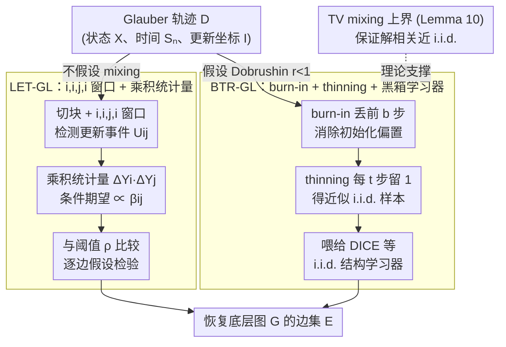

# Local and Mixing-Based Algorithms for Gaussian Graphical Model Selection from Glauber Dynamics

**会议**: ICML 2026  
**arXiv**: [2412.18594](https://arxiv.org/abs/2412.18594)  
**代码**: 暂未公开  
**领域**: 概率图模型 / 结构学习 / Glauber 动力学  
**关键词**: Gaussian Graphical Model、Glauber Dynamics、Dobrushin Condition、Burn-in/Thinning、Total Variation Mixing

## 一句话总结
作者首次研究"从单条 Gaussian Glauber 动力学轨迹"中学习高斯图模型结构的问题，提出两种互补算法：LET-GL（基于 i,i,j,i 窗口的局部边检测、完美并行）和 BTR-GL（在 Dobrushin 条件下用 burn-in/thinning 把轨迹"解相关"成近似 i.i.d. 样本再喂给现成 i.i.d. 学习器），并给出有限样本恢复保证 + 信息论下界 + 一个独立有用的随机扫描高斯 Gibbs sampler 的 TV mixing 上界。

## 研究背景与动机

**领域现状**：高斯图模型（GGM）的结构学习长期假设独立同分布样本——penalized likelihood（GLASSO）、neighborhood regression（Meinshausen-Bühlmann）、信息论最优的 DICE 都建立在这一假设上。但很多实际数据其实来自动力学过程：传染病、coordination game、MCMC 采样的中间结果——i.i.d. 样本根本不存在。

**现有痛点**：(1) Bresler 2014 开创了"从 Glauber 学 Ising"的研究，但 Ising 变量有界（$\{-1,+1\}$），到 Gaussian 上不能直接照搬；(2) 这篇文章的早期版本（TRD25）用"i,j,i 三步窗口 + 比率统计量"，但 Mahbod Majid 指出 ratio 的分子分母不独立——条件 i 的更新与之前的噪声不解耦，必须强假设才能成立；(3) 想用现成 i.i.d. 学习器（如 DICE）但缺少把轨迹"解相关"成 i.i.d. 样本的工具。

**核心矛盾**：Gaussian 变量取实数域无界，传统 Ising 风格的"sign flip 概率"估计完全失效；Glauber 轨迹强相关，又没有把它转成 i.i.d. 的高维 TV bound（Wasserstein bound 用 Kantorovich-Rubinstein 走不到 TV，因为高斯 Gibbs 转移核不全局 Lipschitz）。

**本文目标**：(i) 修复 ratio 估计量的依赖漏洞，给出真正可用的局部边检测算法；(ii) 在 Dobrushin 条件下证明 burn-in/thinning 后轨迹与 i.i.d. 高斯样本的联合 TV 接近，从而把"动力学结构学习"reduce 到 i.i.d. 结构学习；(iii) 证明信息论下界，定位算法的 minimax 位置。

**切入角度**：作者把"i,j,i"换成"i,i,j,i"——多插一次 i 更新作为缓冲，让后续 i 的变化与前面 i 的噪声解耦；同时用"乘积"而非"比率"统计量，得到条件期望为 $\beta_{ij}\theta_{jj}^{-1}$ 的可控估计。另一方面利用 Gaussian Gibbs 在 Dobrushin 条件下的 Wasserstein 收缩 + 一个新颖的"thresholded Lipschitz"技巧把 Wasserstein bound 提升为 TV bound。

**核心 idea**：两条路线同等重要——"不等链 mix 就 testify"（LET-GL）和"等链 mix 再 reduce 到 i.i.d."（BTR-GL）；二者权衡截然不同（前者无 Dobrushin 假设但样本复杂度高、可完美并行；后者需要 Dobrushin 但样本复杂度近极小极大最优）。

## 方法详解

### 整体框架
观测一条连续时间 Glauber 轨迹 $\{\mathbf{Y}^{(t)}\}_{t=0}^T$，每个时间 $S_n$ 随机选一个坐标 $I^{(n)} \in [p]$ 按条件高斯 $\mathcal{N}(\sum_{j\in N(i)} \beta_{ij}X_j^{(n-1)}, \sigma_{X_i|N(i)}^2)$ 更新。数据集 $\mathcal{D} = \{(\mathbf{X}^{(n)}, S_n, I^{(n)})\}_{n=0}^N$。算法目标是恢复底层图 $G$ 的边集 $E$。同一条轨迹下作者给出两条对偶路线：LET-GL 不假设链已 mix，直接在轨迹上对每条候选边做假设检验；BTR-GL 假设 Dobrushin 条件成立，先 burn-in 丢掉前 $\mathfrak{b}$ 步、再每 $\mathfrak{t}$ 步保留一个样本 $\mathbf{Y}^{(s)} := \mathbf{X}^{(\mathfrak{b}+s\mathfrak{t})}$，把"解相关"后的 $\{\mathbf{Y}^{(s)}\}$ 当作近似 i.i.d. 高斯样本喂给 DICE 等现成 i.i.d. 结构学习器；而这条 reduce 路线能否成立，全压在 Lemma 10 给出的高维 TV mixing 上界上。

### 关键设计

**1. LET-GL：i,i,j,i 窗口 + 乘积统计量，无需 mixing 的局部边检测**

第一条路线是"不等链 mix，直接对每条候选边做假设检验"，时间复杂度可完美并行到每核心 $\tilde{\mathcal{O}}(d^2 p)$，与 Meinshausen-Bühlmann 同级。做法是把整条轨迹切成长度 $\tau$ 的 $k_\max=\lfloor T/\tau\rfloor$ 块，每块再四等分 $W_1,W_2,W_3,W_4$，定义更新事件 $U_{ij}^k$（$W_1,W_2$ 各至少一次 i 更新且无 j，$W_3$ 有 j 无 i，$W_4$ 有 i 无 j）。在 $U_{ij}^k\cap Q_{ij}^k$（"邻居安静"）发生时记录两段增量乘积 $\Delta Y_i^k\cdot\Delta Y_j^k$，Lemma 1 给出其条件期望有边时 $|E[\cdot]|\ge |\beta_{ij}|\theta_{jj}^{-1}$、无边时为 0，于是统计量 $T_{ij}=|\frac{1}{k_\max}\sum_k \mathbb{1}_{U_{ij}^k}\Delta Y_i^k \Delta Y_j^k|$ 与阈值 $\rho$ 比较即可判边。关键改进有两处：一是把早期的 $i,j,i$ 换成 $i,i,j,i$，多插一次 i 更新当"buffer"，让最后那次 i 的变化与之前 i 的噪声条件独立——这正是修复早期 ratio 估计量依赖漏洞的命门；二是用乘积而非比率，因为高斯变量在无界域上比率会爆炸，乘积更稳。窗口长度 $\tau$ 则用来平衡一对矛盾事件：$\tau$ 大则 $U_{ij}^k$ 频繁但 $Q_{ij}^k$ 难成立，$\tau$ 小则相反。

**2. 高维随机扫描 Gaussian Gibbs 的 TV mixing 上界（Lemma 10，技术核心）**

第二条路线要先把轨迹解相关成 i.i.d. 样本，而这一步成立与否全压在一个 TV mixing bound 上。结论是：在 Dobrushin 半径 $r=\max_i\sum_{j\neq i}|\beta_{ij}|<1$ 下，$\|K^t(x,\cdot)-\pi\|_\mathrm{TV}\le\varepsilon$ 只需

$$t\ge C\cdot\frac{p}{1-r}\log(p^{3/2}/\varepsilon)$$

步，归一化后 mixing time 关于维度 $p$ 仅多项式对数，且与 spectral gap 或 $\Theta$ 的条件数无关。难点在于高斯 Gibbs 转移核不全局 Lipschitz，标准 Kantorovich-Rubinstein 把 Wasserstein 转 TV 的路线直接失败。作者的破法是引入"thresholded（approximate）Lipschitz"性质——平滑后的核在高概率集上 Lipschitz，失败事件作为显式加性 defect 出现——再结合 burn-in/thinning 分解和已知的随机扫描 Gibbs Wasserstein 收缩，得到 subsampled 轨迹与 $\pi^{\otimes m}$ 在联合 TV 上的接近。这个不依赖条件数的高维 TV bound 本身对 MCMC 社区也是独立贡献。

**3. BTR-GL：burn-in + thinning + 黑箱 i.i.d. 学习器**

有了 Lemma 10 的 TV 接近，BTR-GL 就能把"动力学结构学习"整体 reduce 到"i.i.d. 结构学习"：丢掉前 $\mathfrak{b}$ 步消除初始化偏置，之后每 $\mathfrak{t}$ 步保留一个样本 $\mathbf{Y}^{(s)}$，把得到的 $\{\mathbf{Y}^{(s)}\}$ 当作近似 i.i.d. 高斯样本喂给 DICE 这类现成 i.i.d. 学习器。Lemma 10 保证 $(\mathbf{Y}^{(0)},\dots,\mathbf{Y}^{(m-1)})$ 与 $\pi^{\otimes m}$ 在 TV 上 $\varepsilon$-接近，所以 DICE 的 $1-\delta$ 高概率保证可以原样迁移过来，代价只是 $\varepsilon$ 进入 union bound。当底层选 DICE 时总观测时间 $\mathcal{O}(dp\,\mathrm{polylog}(p/\delta)/(\kappa^2(1-r)))$（$\kappa=\min_{\{i,j\}\in E}|\beta_{ij}\beta_{ji}|^{1/2}$ 是最小归一化边强）。和 LET-GL 形成鲜明对偶：BTR-GL 需要 Dobrushin 假设、是串行的，但把 mixing 时间也摊进观测时间后能逼近 minimax 下界，在相关性严重时比 LET-GL 省得多；LET-GL 则无 mixing 假设、可 per-edge 并行，但样本复杂度更高。

### 损失函数 / 训练策略
本文是理论 + 算法论文，无传统训练。LET-GL 的关键超参为 $\tau$（窗口长度，需平衡 $\mathbb{P}[U_{ij}^k] = [(1-e^{-\tau/4})e^{-\tau/4}]^4$ 和 $\mathbb{P}[Q_{ij}^k] \geq e^{-\tau d}$）和 $\rho$（边阈值）。算法还引入了高概率有界事件 $B_\delta = \{\max |Y_i^{(t)}| \leq y_\max\}$（其中 $y_\max = C_1 \sigma_\max\sqrt{\log(p/\delta)}$），确保测试统计量在条件概率下几乎必然有界 $|T_{ij}^k| \leq 4 y_\max^2$，由此可用 martingale 集中不等式。

## 实验关键数据

### 主实验（合成 d-regular GGM，固定 $\delta$）

| 算法 | 观测时间复杂度 | 是否需 Dobrushin | 计算并行性 |
|------|----------------|------------------|-------------|
| **LET-GL** | $\mathcal{O}(d^3 p\,\mathrm{polylog}\,p / \beta_\min^5)$ | 否 | 完美并行，per-edge $\tilde{\mathcal{O}}(d^2 p)$ |
| **BTR-GL + DICE** | $\mathcal{O}(d p\,\mathrm{polylog}(p/\delta) / (\kappa^2(1-r)))$ | 是 | 继承 DICE 的复杂度 $\mathcal{O}(p^{2d+1})$ |
| GLASSO | — | — | $\mathcal{O}(p^3)$ |
| PC algorithm | — | — | $\mathcal{O}(p^{d+2})$ |
| Meinshausen neighborhood | — | — | per-node 并行 |
| **下界（本文）** | $\Omega(\log(p-d)/\beta_\min^2)$；当 $\beta_\min = \Theta(1/d)$ 时 $\Omega(d^2 \log p)$ | — | — |

### 理论结果对比

| 关键定理 | 内容 | 意义 |
|----------|------|------|
| Theorem 1 | LET-GL 在 $T = \mathcal{O}(d^3 p\,\mathrm{polylog}\,p / \beta_\min^5)$ 下高概率恢复 E | 无 mixing 假设下的可证保证 |
| Lemma 10 | 高维随机扫描 Gaussian Gibbs 在 Dobrushin 下 TV mixing 时间 $\tilde{\mathcal{O}}(p/(1-r))$ | 与条件数无关，独立 MCMC 价值 |
| BTR-GL 主定理 | 在 Dobrushin 下 $T = \mathcal{O}(dp/(\kappa^2(1-r)))$ + polylog 即可 | 在 $\kappa \asymp \beta_\min$、$d$ 有界时近似 minimax 最优 |
| 信息论下界 | 任何算法 $T \geq \Omega(\log(p-d)/\beta_\min^2)$ | 给出整个问题类的极限 |

### 关键发现
- **乘积统计量胜过比率统计量**：早期 TRD25 的 i,j,i 比率因依赖漏洞失败，本文 i,i,j,i 乘积形式既修复了依赖问题又适配高斯无界域。
- **Dobrushin 条件下 BTR-GL 接近 minimax**：在 $\kappa \asymp \beta_\min$、$d$ 有界、$1-r$ 常数下，BTR-GL 的样本复杂度匹配 $\Omega(d^2\log p)$ 下界（差 polylog）。
- **LET-GL 的并行优势独一无二**：每个 candidate edge 完全独立，$\binom{p}{2}$ 条边可在 $\binom{p}{2}$ 核心上并行，per-core 成本 $\tilde{\mathcal{O}}(d^2 p)$——这是 GLASSO/PC 等无法做到的。
- **TV mixing bound 不依赖条件数**：传统 spectral gap 给出的 mixing time 受 $\kappa(\Theta)$ 拖累，本文 transport-side 路线绕开了这点，对高维稀疏 GGM 尤其有用。
- **与并发工作 SWMM26 互补**：SWMM26 用 i,i,j,i 窗口 + ratio + 鲁棒聚合，本文用 i,i,j,i 窗口 + product + martingale 集中；两条独立路径互相佐证窗口选择正确，且 BTR-GL 提供了 SWMM26 没有的 Dobrushin 路线。

## 亮点与洞察
- **i,i,j,i 窗口的"buffer 思想"非常优雅**：通过多插一次更新作为条件独立的"绝缘带"，把 ratio→product 的同时去掉了依赖污染，这种"靠 update schedule 设计来净化估计量"的思路可以推广到其他动力学模型。
- **thresholded Lipschitz 是 transport theory 的小创新**：在概率论里把"在高概率集上 Lipschitz + 失败事件加性 defect"这套技巧形式化，可能对其他非全局 Lipschitz 核的 TV mixing 分析有用。
- **两种算法的对偶性很有教育意义**：一边"不等 mix 就 test"（local, 无假设，复杂度高，并行强），一边"等 mix 再 reduce"（global, 需 Dobrushin，复杂度低，串行）；这种"local/global 二元对偶"在动力学结构学习里反复出现，值得后续工作参考。
- **信息论下界让定位清晰**：$\Omega(d^2\log p)$ 不仅是结果，更是"路标"——告诉社区在 Dobrushin 下大致到天花板了，未来精进只能在 polylog 上找 1-2 倍因子。

## 局限与展望
- LET-GL 的样本复杂度对 $\beta_\min$ 多项式很高（5 次方），实际中边强很弱时观测时间膨胀。
- BTR-GL 假设 Dobrushin $r < 1$，这在某些密图、强耦合 GGM 上不成立，需要更弱条件下的 mixing 分析。
- TV mixing bound 的常数 $C$ 没有显式给出，工程实现时要靠经验调；burn-in 长度 $\mathfrak{b}$ 和 thinning $\mathfrak{t}$ 的具体取值缺指南。
- 没有真实数据集实验，只有合成 d-regular GGM；金融、神经科学等应用上的表现待验证。
- 没有处理 mis-specification 情形——如果实际数据不是高斯或不是 Glauber 动力学生成，算法行为未知。
- BTR-GL 的 i.i.d. 黑箱依赖 DICE，而 DICE 本身是 $\mathcal{O}(p^{2d+1})$ 的组合复杂度，计算上仍然贵；用 GLASSO 或 neighborhood regression 替换 base learner 的复杂度-精度权衡未充分讨论。

## 相关工作与启发
- **vs Bresler 2014（Ising from Glauber）**：本文是其 Gaussian 推广；从有界离散到无界连续的跨越带来新挑战（无界统计量、连续噪声），用"事件 $B_\delta$ + 条件期望"技巧处理。
- **vs SWMM26（Shen-Wu-Majid-Moitra 并发工作）**：两者都识别出 i,j,i 的依赖问题、都用 i,i,j,i 窗口；SWMM26 用 ratio + robust aggregation 无需 Dobrushin，本文 product + Dobrushin 路线提供 BTR-GL 这条额外路线，二者方法不同但互补。
- **vs DICE（Misra 2020）**：DICE 是 i.i.d. 设定下信息论最优的 GGM 学习器，本文把它当 BTR-GL 的黑箱，间接把 DICE 的能力延伸到动力学数据。
- **vs Meinshausen-Bühlmann neighborhood selection**：MB 用 Lasso 做 per-node 回归，本文 LET-GL 做 per-edge test；都是 per-X 并行思想，但本文不需要 i.i.d. 假设。
- **vs Wang 2014/2017 (Wasserstein contraction for Gibbs)**：本文借用其 Wasserstein 收缩，关键贡献是把 Wasserstein → TV 的 reduction 跑通，从而对接 i.i.d. 学习器。

## 评分
- 新颖性: ⭐⭐⭐⭐⭐ 首次在 Gaussian Glauber 动力学上给出 GGM 结构学习算法 + 信息论下界 + 独立有用的高维 TV mixing bound，三件套都新。
- 实验充分度: ⭐⭐⭐ 合成实验验证理论，但缺真实数据；理论很扎实但实验深度一般。
- 写作质量: ⭐⭐⭐⭐ 引言把"先前版本的漏洞 + 修复 + 与 SWMM26 关系"交代得很坦诚；定理陈述清晰、proof sketch 给出关键思路。
- 价值: ⭐⭐⭐⭐ 对图模型理论社区是重要进展，对实际应用（MCMC 诊断、流行病建模）也有潜在价值；TV mixing bound 可独立用于 MCMC 社区。

<!-- RELATED:START -->

## 相关论文

- [\[ICLR 2026\] Distributed Algorithms for Euclidean Clustering](../../ICLR2026/others/distributed_algorithms_for_euclidean_clustering.md)
- [\[ICML 2025\] Optimal Sensor Scheduling and Selection for Continuous-Discrete Kalman Filtering with Auxiliary Dynamics](../../ICML2025/others/optimal_sensor_scheduling_and_selection_for_continuous-discrete_kalman_filtering.md)
- [\[AAAI 2026\] Reward Redistribution via Gaussian Process Likelihood Estimation](../../AAAI2026/others/reward_redistribution_via_gaussian_process_likelihood_estimation.md)
- [\[ICML 2026\] Learning Permutation-Invariant Macroscopic Dynamics](learning_permutation-invariant_macroscopic_dynamics.md)
- [\[CVPR 2026\] Dynamics: Language-Based Representation for Inferring Rigid-Body Dynamics From Videos](../../CVPR2026/others/dynamics_language-based_representation_for_inferring_rigid-body_dynamics_from_vi.md)

<!-- RELATED:END -->
