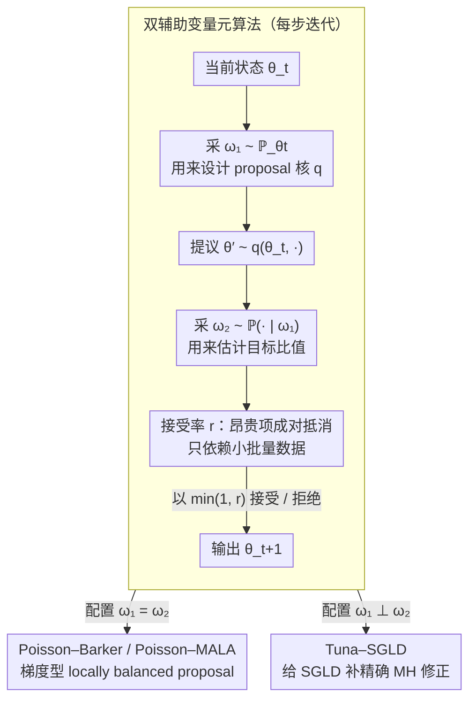

# Markov Chain Monte Carlo without Evaluating the Target: An Auxiliary Variable Approach

**会议**: ICML 2026 Oral  
**arXiv**: [2406.05242](https://arxiv.org/abs/2406.05242)  
**代码**: https://github.com/ywwes26/Auxiliary-MCMC  
**领域**: 采样 / 贝叶斯推断 / MCMC  
**关键词**: 辅助变量, 小批量 MCMC, 梯度型 proposal, doubly-intractable, Peskun 序  

## 一句话总结
作者把 exchange、PoissonMH、TunaMH 三类"不算目标分布也能采样"的 MCMC 统一成一个用辅助变量的元算法，并在 proposal 与接受率两处同时引入辅助随机性，从而设计出小批量数据下仍保持精确平稳分布的梯度型 MCMC（Poisson–Barker、Poisson–MALA、Tuna–SGLD），实证显著超过 PoissonMH/TunaMH/SGLD 等基线。

## 研究背景与动机

**领域现状**：贝叶斯后验 $\pi(\theta\mid x)\propto\pi(\theta)\prod_{i=1}^N \mathsf{p}_\theta(x_i)$ 的采样在两种情形下变得昂贵——一是 doubly-intractable，似然里有依赖 $\theta$ 的归一化常数 $Z(\theta)$；二是 tall data，$N$ 极大、每步都要扫一遍数据。Exchange 算法 (Murray 2006) 处理前者，PoissonMH (Zhang & De Sa 2019) 与 TunaMH (Zhang et al. 2020) 用 Poisson 小批量处理后者。

**现有痛点**：这三类算法看起来各搞各的——一个生成合成数据来抵消 $Z(\theta)$，一个把 likelihood 拆成 Poisson 因子，另一个用 minorization 技巧——但它们都只能用随机游走 proposal，在高维下混合极慢；而能利用梯度的 MALA / HMC 又必须扫全数据集，跟"少看数据"的初衷冲突。SGLD 试图绕过 MH 接受步、直接做带噪 SGD，但有持久的固定步长偏差，"基于小批量做 MH 修正"长期是开放问题。

**核心矛盾**：要保证精确平稳分布，传统 MH 必须计算 $\pi(\theta'\mid x)/\pi(\theta\mid x)$ 这种昂贵比值；但要 scalable 又必须只看部分数据/合成样本。三种现有算法分别用了"换变量""泊松抽稀""无偏估计"等技巧来回避，却各自只解了一半问题（要么接受率不评目标、要么 proposal 不用梯度）。

**本文目标**：(i) 找出 exchange / PoissonMH / TunaMH 背后的公共结构；(ii) 把这个结构扩到 proposal 也能用辅助变量上，使梯度型 proposal 在小批量下也能保持精确平稳分布；(iii) 建立配套理论，说明新框架与"理想全数据链"的差距。

**切入角度**：把每一步 MH 的随机性显式拆成两路辅助变量 $\omega_1,\omega_2$——$\omega_1$ 决定 proposal，$\omega_2$ 估计目标比值——再用 involutive MCMC 的视角统一证明 detailed balance。

**核心 idea**：用"廉价估计"同时替代 proposal 设计与接受率计算里所有昂贵的项，只要联合分布 $\mathbb{P}_{\theta,\theta'}(\omega_1,\omega_2)$ 在角标互换时进入接受率分子分母按规则匹配，就仍以 $\pi$ 为不变分布。

## 方法详解

### 整体框架

作者先在 Section 2 给出一个**公共子结构**：任何"用辅助变量代替 $\pi(\theta'\mid x)/\pi(\theta\mid x)$"的 MH 步骤，都可以写成"采 $\omega\sim P_{\theta\to\theta'}$ → 用 $R_{\theta\to\theta'}(\omega)$ 当作比值估计 → 以 $\min\{1,r\}$ 接受"。命题 1 给出充要条件：若 $R_{\theta\to\theta'}(\omega)\pi(\theta\mid x)P_{\theta\to\theta'}(\omega)=\pi(\theta'\mid x)P_{\theta'\to\theta}(\omega)$，则 $R$ 关于真比值无偏，并且链关于 $\pi$ 可逆。Exchange、PoissonMH、TunaMH 都满足这个条件。

然后 Section 3 把这一架构扩成"**双辅助变量元算法**" (Algorithm 1)：

1. 从 $\mathbb{P}_{\theta_t}(\cdot)$ 采 $\omega_1$，决定 proposal 核 $q_{\omega_1}(\theta_t,\cdot)$；
2. 提议 $\theta'\sim q_{\omega_1}(\theta_t,\cdot)$；
3. 从 $\mathbb{P}_{\theta_t,\theta'}(\cdot\mid\omega_1)$ 采 $\omega_2$，用于估计目标比值；
4. 用接受率 $r=\dfrac{\pi(\theta'\mid x)\mathbb{P}_{\theta',\theta_t}(\omega_1,\omega_2)}{\pi(\theta_t\mid x)\mathbb{P}_{\theta_t,\theta'}(\omega_1,\omega_2)}\cdot\dfrac{q_{\omega_1}(\theta',\theta_t)}{q_{\omega_1}(\theta_t,\theta')}$ 决定是否接受。

设 $\Omega_1$ 或 $\Omega_2$ 为单点空间 $\mathsf{NULL}$ 即可"关闭"对应辅助变量：(Null,Null) 是普通 MH；(Null,有) 退化为 Section 2 的旧框架（含 exchange/PoissonMH/TunaMH）；$\omega_1=\omega_2$ 是 Metropolis-within-Gibbs 视角的辅助 MH (Titsias & Papaspiliopoulos 2018)，对应下面的 Poisson–Barker/MALA；$\omega_1\perp\omega_2$ 则让"设计 proposal"和"估计比值"用两组独立的小批量，对应下面的 Tuna–SGLD。命题 2 通过把 $(\theta,\omega_1,\theta',\omega_2)$ 视为 involutive MCMC 中的对合 $(\theta',\omega_1,\theta,\omega_2)$，给出统一的 detailed balance 证明。下图把元算法每步的数据流，以及"如何配置 $\omega_1,\omega_2$"分岔出的两类新算法画在一起：

### 关键设计

**1. 双辅助变量元算法：让梯度型 proposal 和小批量比值估计第一次共存**

现有小批量 MCMC 都是"两步走"——要么 proposal 用梯度但接受率扫全数据，要么接受率用小批量但 proposal 只能随机游走。本文把每步 MH 的全部随机性显式写成 $(\omega_1,\theta',\omega_2)$：$\omega_1$ 决定 proposal、$\omega_2$ 估计目标比值，并把它们一起塞进对合 $f(\theta,\omega_1,\theta',\omega_2)=(\theta',\omega_1,\theta,\omega_2)$（雅可比为 1）。接受率写成

$$r=\frac{\pi(\theta'\mid x)\,\mathbb{P}_{\theta',\theta_t}(\omega_1,\omega_2)}{\pi(\theta_t\mid x)\,\mathbb{P}_{\theta_t,\theta'}(\omega_1,\omega_2)}\cdot\frac{q_{\omega_1}(\theta',\theta_t)}{q_{\omega_1}(\theta_t,\theta')}$$

关键在于只要 $\omega_1,\omega_2$ 的联合密度在 $(\theta,\theta')$ 互换时能成对抵消昂贵项——比如 PoissonMH 里 $\mathbb{P}_\theta(\omega_1)$ 的 likelihood 部分被 $\pi(\theta\mid x)$ 消掉、只剩小批量贡献——整个 $r$ 就只依赖小批量数据，命题 2 用 involutive MCMC 视角一行证完 detailed balance。把 $\Omega_1$ 或 $\Omega_2$ 设成单点 $\mathsf{NULL}$ 即可"关闭"对应辅助变量：(Null,Null) 是普通 MH，(Null,有) 退化为旧框架（含 exchange/PoissonMH/TunaMH），$\omega_1=\omega_2$ 与 $\omega_1\perp\omega_2$ 则对应下面两类新算法。这样梯度估计和比值估计共享同一份小批量，每步成本不增反降。

**2. Poisson–Barker / Poisson–MALA：给 PoissonMH 换上梯度型 locally balanced proposal**

PoissonMH 已能用 Poisson 小批量抵消归一化项，但 proposal 仍是随机游走、高维混合慢。这对应元算法里 $\omega_1=\omega_2$ 的情形：先按 PoissonMH 抽 $\omega_1=(s_1,\dots,s_N)\sim\bigotimes_i\mathsf{Poi}(\lambda M_i/L+\phi_i(\theta;x))$ 形成小批量 $S=\{i\mid s_i>0\}$，proposal 用一维分解

$$q_{\omega_1,i}^{(g)}\propto g\big(e^{\partial_{\theta_i}\log(\pi(\theta\mid x)\mathbb{P}_\theta(\omega_1))(\theta_i'-\theta_i)}\big)\mu_i(\theta_i'-\theta_i)$$

$g(t)=t/(1+t)$ 得 Poisson–Barker、$g(t)=\sqrt{t}$ 得 Poisson–MALA。妙处在于代理函数 $\pi(\theta\mid x)\cdot\mathbb{P}_\theta(\omega_1)$ 只依赖小批量 $S$——看上去只是给梯度多加了一项 $\log\mathbb{P}_\theta(\omega_1)$，却因此让梯度只扫几千个点、成本和 PoissonMH 一致。locally balanced proposal（Zanella 2020）在全数据下已被证明比 MALA 更鲁棒，本文把这套"用梯度信息塑形 proposal"的好处搬进小批量场景，并靠把 $\omega_1$ 同时塞进 proposal 与接受率两边来抵消所有全数据计算。

**3. Tuna–SGLD：用辅助变量给 SGLD 补上精确 MH 修正**

SGLD 直接做带噪 SGD、绕过 MH，但有持久的固定步长偏差，"用小批量数据做 MH 修正"是 Welling & Teh (2011) 留下的开放问题。这对应元算法里 $\omega_1\perp\omega_2$ 的情形：proposal 用 SGLD 风格 $q_{\omega_1}(\theta,\cdot)\sim\mathcal{N}(\theta-\tfrac{\epsilon^2}{2}\tfrac{N}{K}\sum_{i\in B}\nabla_\theta U_i(\theta;x),\epsilon^2 I)$，其中 $\omega_1=B$ 是 size-$K$ 的均匀小批量，再用 TunaMH 的 Poisson 小批量 $\omega_2$ 估计目标比值。由于 $\omega_1$ 的边缘分布不依赖 $\theta$，接受率里 $\omega_1$ 那部分被消掉，最终

$$r=\frac{\pi(\theta'\mid x)\,\mathbb{P}_{\theta',\theta_t}(\omega_2)}{\pi(\theta_t\mid x)\,\mathbb{P}_{\theta_t,\theta'}(\omega_2)}\cdot\frac{q_{\omega_1}(\theta',\theta_t)}{q_{\omega_1}(\theta_t,\theta')}$$

每步只看小批量。这是第一个仅用小批量数据就把 SGLD 变成关于 $\pi$ 精确平稳采样器的方案——TunaMH 的辅助变量在这里充当了"修正器"。

### 损失函数 / 训练策略

无显式损失——所有算法都是迭代采样器。需调的超参是 PoissonMH 系列的 $\lambda$（控制小批量期望大小，文中常用 $\lambda=0.0005L^2$ 到 $0.01L^2$）、Tuna–SGLD 的批量大小 $K$ 与步长 $\epsilon$、以及 locally balanced 类的 $g$。Pilot run 把步长调到目标接受率 0.25 / 0.4 / 0.55。

## 实验关键数据

### 主实验

实验包含三类任务：(i) 20 维异质截断高斯，$N=10^5$、$\Sigma=\mathrm{diag}(1,0.95,\dots,0.05)$、tempered posterior（$\beta=10^{-5}$）；(ii) 10 维 robust Student-$t$ 线性回归，$N=10^5$、$\nu=4$；(iii) MNIST 上的 Bayesian logistic regression。指标用 MSE 随时间曲线和按维度 ESS/s 的 min/median/max。

| 任务 | 方法 | Best ESS/s (Min, Med, Max) |
|------|------|------|
| 异质 Gaussian | MH | (0.05, 0.08, 0.47) |
| 异质 Gaussian | MALA | (0.10, 0.19, 2.77) |
| 异质 Gaussian | Barker | (0.12, 0.22, 1.53) |
| 异质 Gaussian | PoissonMH | (0.40, 0.66, 4.67) |
| 异质 Gaussian | Poisson–Barker | (0.91, 1.65, 12.16) |
| 异质 Gaussian | Poisson–MALA | (0.84, 1.65, 23.84) |

Poisson–Barker 在异质 Gaussian 上相对 PoissonMH 提升 1.37–7.12×，对 MALA 4.39–9.80×，对 Barker 6.58–15.58×，对随机游走 MH 13.62–70.12×；在 robust 线性回归任务上 Poisson–{MALA,Barker} 相对 PoissonMH 提升 1.80–8.79×，对全数据法接近或超过 100× 量级；SGLD 早期 MSE 下降快但很快进入由固定步长偏差导致的平台；MNIST Bayesian logistic regression 上 Tuna–SGLD 最快收敛且没有 SGLD 的偏差平台。

### 消融实验

| 配置 | 关键现象 | 说明 |
|------|---------|------|
| Full Poisson–Barker | 全梯度型小批量 MH，最佳 ESS/s | 同时受益于梯度 proposal 与 Poisson 小批量比值估计 |
| 去掉梯度（= PoissonMH） | ESS/s 掉 1.4–7× | 验证 locally balanced proposal 的贡献 |
| 去掉 MH 修正（= SGLD） | MSE 早期降快但收敛到有偏分布 | 没有辅助变量纠偏就回到 SGLD 老问题 |
| 用 MALA 替换 Barker | 高接受率匹配最佳；低接受率（0.25）反而比 PoissonMH 差 | MALA 对步长更敏感，Barker 更鲁棒，与 Livingstone & Zanella 2022 一致 |
| 不同 $\lambda$（小批量大小） | 接受率/ESS 单调变化 | 偏小的 $\lambda$ 噪声大但廉价，偏大则成本接近全数据 |

### 关键发现

- 关键贡献是"梯度 proposal"与"小批量接受率"的耦合；任何一边缺失都退化（缺梯度 = PoissonMH/TunaMH，缺修正 = SGLD）。
- Poisson–Barker 对接受率最不敏感，是默认推荐；Poisson–MALA 在高接受率下匹配但低接受率下变脆。
- Tuna–SGLD 首次给出"用小批量数据修正 SGLD"的可行方案，回答 Welling & Teh (2011) 留下的开放问题。
- Peskun 序 $\mathbb{P}_{\mathsf{aux}}\prec\mathbb{P}_{\mathsf{MwG}}\prec\mathbb{P}_{\mathsf{ideal}}$ 保证：理想全数据链的渐近方差永远是新链的下界，没有"瞎赚"。

## 亮点与洞察

- **统一视角**：把表面看上去毫不相干的三类算法（doubly-intractable 的 exchange、tall-data 的 PoissonMH 与 TunaMH）归约到同一个 detailed balance 等式 $R\cdot\pi P=\pi' P'$，并指出它们对应 $\omega_1=\mathsf{Null}$ 的特殊情形——这本身就是个干净的概念性贡献。
- **involutive MCMC 视角**：通过把 $(\omega_1,\theta',\omega_2)$ 一起对合，validity 证明压缩到一行，给后续扩展（如 $a(t)$ 一般化接受函数、$\varphi$ 非平凡对合）留了空间。
- **代理函数巧思**：Poisson–Barker 里把梯度 $\partial_\theta\log\pi$ 替换为 $\partial_\theta\log(\pi\cdot\mathbb{P}_\theta(\omega_1))$，看上去只是加了一项 $\log\mathbb{P}_\theta(\omega_1)$，但因为 $\pi(\theta\mid x)\mathbb{P}_\theta(\omega_1)$ 只依赖小批量 $S$，梯度计算成本和 PoissonMH 一致——这种"加一项让昂贵变廉价"的代理设计是可迁移到其他 minibatch 算法的 trick。
- **理论副产品**：用统一框架重证 PoissonMH 与 TunaMH 的谱隙，PoissonMH 的界 $\mathrm{Gap}(\mathbb{P}_{\mathsf{aux}})\ge \max\{\tfrac12 e^{-L^2/(\lambda+L)},e^{-1/e}e^{-L^2/(2\lambda)}\}\mathrm{Gap}(\mathbb{P}_{\mathsf{ideal}})$ 在 $\lambda>L$ 时严格优于 Zhang & De Sa (2019)，TunaMH 的 $e^{-1/(2\chi)}$ 也严格优于 $e^{-1/\chi-2\sqrt{\log 2/\chi}}$。

## 局限与展望

- **依赖 PoissonMH/TunaMH 的技术假设**：似然要可写成可被 Poisson 小批量抵消的形式（如 bounded Lipschitz $U_i$），并非任意 likelihood 都适用；非指数族或重尾 likelihood 上能否同样高效未验证。
- **实验规模偏小**：最大数据集 MNIST + Bayesian logistic regression，没有评估 deep Bayesian neural network 或 LLM scale 的后验，距离实际大模型贝叶斯推断还有距离。
- **梯度估计方差**：Tuna–SGLD 的 proposal 用的是普通 minibatch 梯度，方差大时接受率会下降；引入控制变量、SVRG 风格梯度估计、preconditioning 是自然延伸。
- **理论给的是相对界**：所有谱隙界都是相对于 $\mathbb{P}_{\mathsf{ideal}}$ 的乘性常数，理想链本身的混合速度仍要单独分析；与 PDMP 类样本器（Bouncy Particle、Zig-Zag）的实证比较缺失。

## 相关工作与启发

- **vs Exchange / PoissonMH / TunaMH**: 它们都是本框架在 $\omega_1=\mathsf{Null}$ 时的特例；本文的扩展是允许 $\omega_1$ 进入 proposal，从而首次让梯度信息进入小批量 MH。
- **vs Pseudo-marginal MCMC (Andrieu & Roberts 2009)**: pseudo-marginal 把估计器值并入链状态，本文只保留 $\theta$，每步重新生成辅助变量，因此是不同的 augmentation 构造。
- **vs Involutive MCMC (Neklyudov et al. 2020)**: 本文给出 involutive MCMC 的一个具体且实用的实例族，并明确给出"双辅助变量"的具体应用（locally balanced + minibatch）。
- **vs PDMP 子采样 (Bouchard-Côté et al. 2018; Bierkens et al. 2019)**: 它们用连续时间 + Poisson thinning 回避全数据，本文走离散 MH 路线，两条路在工程上互补。
- **vs SGLD (Welling & Teh 2011)**: Tuna–SGLD 是 SGLD 的精确化版本，直接回答原文留下的"基于小批量数据做 MH 修正"开放问题。

## 评分
- 新颖性: ⭐⭐⭐⭐⭐ 第一次把 doubly-intractable 与 tall-data 两条 MCMC 路线统一进同一个双辅助变量框架，并由此构造出小批量梯度型精确 MCMC。
- 实验充分度: ⭐⭐⭐⭐ 三个任务覆盖合成与真实数据，多基线对比充分；缺深度模型规模的后验实验。
- 写作质量: ⭐⭐⭐⭐⭐ 框架介绍清晰，命题 1–2 简洁有力，Case 1/2/3 与 Algorithm 2/3 的映射很容易跟。
- 价值: ⭐⭐⭐⭐⭐ 既是统一旧算法的概念性贡献，又给出可立刻替换 PoissonMH/TunaMH/SGLD 的实用算法，理论上还顺手收紧了两个已有谱隙界。

<!-- RELATED:START -->

## 相关论文

- [\[ICML 2026\] NonZero: Interaction-Guided Exploration for Multi-Agent Monte Carlo Tree Search](nonzero_interaction-guided_exploration_for_multi-agent_monte_carlo_tree_search.md)
- [\[AAAI 2026\] Extreme Value Monte Carlo Tree Search for Classical Planning](../../AAAI2026/others/extreme_value_monte_carlo_tree_search_for_classical_planning.md)
- [\[ICML 2026\] Target-Agnostic Calibration under Distribution Shift with Frequency-Aware Gradient Rectification](target-agnostic_calibration_under_distribution_shift_with_frequency-aware_gradie.md)
- [\[AAAI 2026\] Learning Network Dismantling Without Handcrafted Inputs](../../AAAI2026/others/learning_network_dismantling_without_handcrafted_inputs.md)
- [\[AAAI 2026\] Faster Certified Symmetry Breaking Using Orders With Auxiliary Variables](../../AAAI2026/others/faster_certified_symmetry_breaking_using_orders_with_auxiliary_variables.md)

<!-- RELATED:END -->
