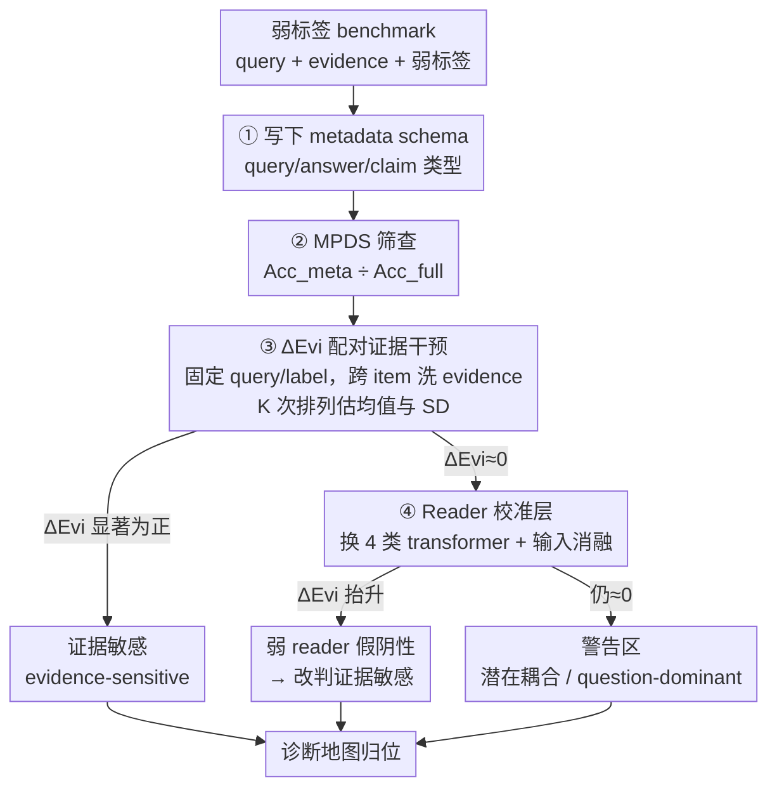

# Metadata Predictability Is Not Evidence Dependence: An Intervention-Based Audit for Weak-Label Benchmarks

**会议**: ICML 2026 Workshop on Hypothesis Testing  
**arXiv**: [2605.23701](https://arxiv.org/abs/2605.23701)  
**代码**: 待确认  
**领域**: Benchmark 审计 / 弱标签评测 / 假设检验  
**关键词**: MPDS、ΔEvi、shortcut detection、weak-label benchmark、reader calibration

## 一句话总结
作者指出「输出能被元数据预测」≠「输出依赖证据」，提出双统计量审计协议：用 MPDS 测元数据可预测性、用证据洗牌 ΔEvi 测证据敏感性，再加 stronger-reader 校准层和输入消融，构成一个 4 步可复用的弱标签 benchmark 体检方案。

## 研究背景与动机

**领域现状**：NLP/QA/NLI 大量使用弱标签 benchmark（HotpotQA、SNLI、FEVER 等）做评测；传统 audit 多半只跑「metadata-only 基线」——只看 question type、answer type 等元数据就能多准——以揭示 shortcut。Bowman & Dahl、Gururangan、McCoy 等都做过类似工作。

**现有痛点**：metadata-only 高准确率确实揭露了 shortcut，但**反过来不成立**——metadata-only 准确率中等并不能证明 benchmark 真的需要证据。问题在于，metadata 测的是「输出能否从先验恢复」，而 evidence-based 评估真正想问的是「输出是否依赖给定的证据」。两者是不同的 hypothesis，混用会让一些「悄悄绕过证据」的协议侥幸过关。

**核心矛盾**：评测的 validity 概念是「protocol 是否真的在做它声称做的事」，但目前没有 hypothesis-test 工具直接检验「protocol 行为在证据 identity 上不变」这一 null。弱 reader（如 TF-IDF+LR）也会因为模型容量不足造成「证据不敏感」的假阴性，进一步混淆诊断。

**本文目标**：把 benchmark 审计本身当成结构化假设检验任务，输出一张能区分「直接耦合 / 潜在耦合 / 证据敏感 / 警告区」的诊断地图，而非单一 pass/fail。

**切入角度**：除了原有的 metadata-only 统计量之外，额外引入一个**配对干预统计量** ΔEvi——保持 query 和 label 不动、只把 evidence 跨 item 洗牌，看 accuracy 跌多少。这是对「protocol 对 evidence identity 不变」这一 null 的直接检验。

**核心 idea**：把 audit 拆成三层——MPDS 做 metadata 筛查、ΔEvi 做证据干预、stronger-reader 做 calibration——并要求一个 audit packet 同时报告这三层加输入消融，才能避免「弱 reader 假阴性」和「metadata 假安全」。

## 方法详解

### 整体框架
给定一个 evidence-based weak-label benchmark，audit 流程是 4 步「检测包」：(1) 写下 protocol 使用的 metadata schema（query/answer/claim 类型等）；(2) 训一个 metadata-majority 预测器，记其准确率 $\mathrm{Acc}_\text{meta}$，与 full system 准确率 $\mathrm{Acc}_\text{full}$ 算比值 $\mathrm{MPDS}=\mathrm{Acc}_\text{meta}/\mathrm{Acc}_\text{full}$，作为元数据可预测性的 screening；(3) 做 $K$ 次跨 item 证据洗牌（query/label 不动），算 $\mathrm{Acc}_\text{shuf}$ 的均值与 per-permutation 总体 SD $\sigma_\text{shuf}$，得到 $\Delta\text{Evi}=\mathrm{Acc}_\text{full}-\mathrm{Acc}_\text{shuf}$，对应 null $H_0:\mathrm{Acc}_\text{full}=\mathrm{Acc}_\text{shuf}$；(4) 对 lightweight reader (TF-IDF+LR) 上 ΔEvi 接近 0 的项，换 stronger transformer reader (BERT/DistilBERT/ELECTRA-small/SciBERT) 重跑并加输入消融，输出落在诊断地图哪一格。

输出不是单一指标，而是「区域归类」：(direct coupling) MPDS 高、ΔEvi≈0；(latent coupling) MPDS 中等、ΔEvi≈0——这是最危险的「警告区」；(evidence-sensitive) ΔEvi 显著为正。

### 关键设计

**1. MPDS 只做分层 screening 而非终审**

$\mathrm{MPDS}=\mathrm{Acc}_\text{meta}/\mathrm{Acc}_\text{full}$ 越接近 1，protocol 越像一个 metadata-only 预测器，因此适合在审计入口快速找出"metadata 一招就能干掉大半"的直接耦合案例。但它单看不足以下结论：这个比值会把"metadata 强度"和"任务难度"搅在一起——$(0.5,0.5)$ 和 $(0.8,0.8)$ 都给 MPDS=1.0；存在 chance-corrected 变体能解耦，但需要明确随机率，且方向一致，所以作者保留更简单的 ratio。最关键的反例是 synthetic HotpotQA：MPDS=0.643 看着中等温和，ΔEvi 却为 0（证据完全无关）。这种"latent coupling"只靠 metadata 筛查必然漏掉，必须靠下一步的 ΔEvi 揭穿，正说明双统计量缺一不可。

**2. 配对证据干预统计量 ΔEvi：直接检验协议对证据 identity 是否不变**

MPDS 测的是"输出能否从先验恢复"，绕不开相关性话题；而审计真正想问的是"输出是否依赖给定证据"，这是另一个 hypothesis。ΔEvi 用一个干净的配对干预把后者变成可计算的检验：保持 $(q_i,y_i)$ 不动，只把 evidence $e_i$ 按排列 $\pi$ 替换成 $e_{\pi(i)}$，让 reader 重跑一遍得 $\mathrm{Acc}_\text{shuf}$，定义 $\Delta\mathrm{Evi}=\mathrm{Acc}_\text{full}-\mathrm{Acc}_\text{shuf}$，对应 null $H_0:\mathrm{Acc}_\text{full}=\mathrm{Acc}_\text{shuf}$。重复 $K$ 次独立排列估均值和 SD（论文 $K=8$，建议 production 用 $K\ge 20$）。因为洗牌后的样本和原 evidence 共享同一 query/label，accuracy 差只能由 evidence identity 解释，这正是 paired 设计的妙处——统计上方差也比独立比较低很多。"near-zero"是个操作性概念：点估计可忽略、跨洗牌稳定、且换 reader 后仍不变，三条都满足才算。

**3. Reader-calibration 层：把"弱 reader 学不动"从"协议不依赖证据"里拆出来**

lightweight reader（TF-IDF+LR）上 ΔEvi 近 0 有两种完全不同的成因：可能是 protocol 真的不用证据，也可能是 reader 容量太小学不动而假装为 0。作者不让这种结果直接下结论，而是触发 calibration——换 4 类 transformer reader（BERT/DistilBERT/ELECTRA-small/SciBERT）用 multishuffle 重测。若 ΔEvi 在 stronger reader 下显著抬升，原结论"证据无关"就是 reader-limited 假阴性；若仍接近 0，则进入"警告区"，再查 question-only baseline 是否塌缩。配套的输入消融（如 SciBERT 上 hypothesis-only、premise-only）用来区分残余的非证据信号。SNLI 是教科书反例：LR 上 ΔEvi=0、四类 transformer 上 ΔEvi=0.26–0.37，结论从"证据无关"翻成"证据敏感但带 hypothesis-side 残余信号"——这一层直接修掉了一类长期被忽视的审计 bug：把 reader 弱当成 benchmark 干净。

### 损失函数 / 训练策略
本文不训练新模型，而是把 audit 当成「针对既有 reader 家族的统计检验」。所有 transformer reader 都用各自标准微调（fine-tune on the benchmark），每个家族跑 8 次独立证据排列、估 mean + population SD（不是 SE，避免低估变异）。reconstructed HotpotQA 用 HuggingFace fullwiki（train=2000, eval=600），label 用「question type + answer type + supporting-fact count」启发式生成，正是典型 weak-label 设定。

## 实验关键数据

### 主实验
论文用 1 个合成 benchmark + 3 个真实 benchmark 给出 4 类典型诊断结果（即论文表 1 的「Decision view」）：

| Benchmark | Lightweight (LR) ΔEvi | Transformer ΔEvi | MPDS / 备注 | 诊断 |
|-----------|-----------------------|------------------|-------------|------|
| HotpotQA (synthetic) | 0 | 0 | MPDS=0.643 | **Latent coupling 反例** |
| SNLI | 0 | 0.26–0.37 (BERT 0.3671±0.0036) | hypothesis-only=0.5975 | Calibration reversal |
| FEVER | 0.13 | 0.63–0.68 (BERT 0.6813±0.0022) | — | 强证据敏感 positive control |
| HotpotQA (recon.) | — | ≤0.002 (BERT/DistilBERT/ELECTRA) | question-only=0.975，label 严重倾斜 | Question-dominant 警告区 |

合成端点：synthetic NQ-style (MPDS=1.0, ΔEvi=0) 是 direct coupling 上限，synthetic TriviaQA-style (ΔEvi=0.808) 是 evidence-sensitive 下限——两端把诊断地图的尺度撑出来。

### 校准与消融

| 案例 | 现象 | 解读 |
|------|------|------|
| SNLI LR vs 4× transformer | LR ΔEvi=0；transformer ΔEvi=0.26–0.37 | 弱 reader 假阴性，calibrate 后结论翻转 |
| SNLI SciBERT 输入消融 | full=0.5975；premise-only=0.3365 | hypothesis-side 残余信号显著 |
| FEVER LR vs transformer | LR=0.13；transformer 0.63–0.68，两 SciBERT seed 0.6580/0.6338 | 大幅、稳定为正，positive control 通过 |
| Recon HotpotQA | 578 full vs 22 conflict（96% 多数）；q-only=0.975 | ΔEvi≈0 来自 question 端塌缩，不是真证据无关 |
| OOD answer-type shift | synthetic NQ 全塌；SNLI、HotpotQA 都退化 | shortcut 在分布偏移下放大 |
| Counterfactual metadata flip | synthetic NQ 翻 answer-type 改全部 label；HotpotQA 弱 | metadata-coupling 强度可直接被反事实测出 |
| MPDS-gated 过滤 | 在 synthetic HotpotQA 上反而扩大 OOD gap | post-hoc 删 high-risk 样本无法治标 |

### 关键发现
- **MPDS 中等 + ΔEvi=0 是最该警惕的「潜在耦合」**：synthetic HotpotQA 是论文构造出来专门给 metadata-only audit「打脸」的反例。
- **弱 reader 完全可能造出假阴性**：SNLI 在 LR 下「证据无关」、在 BERT 家族下 ΔEvi=0.26–0.37，结论反转——证明 calibration 不能省。
- **ΔEvi≈0 可能来自 question-dominant 塌缩而非证据无关**：reconstructed HotpotQA 因 label 96% 倾斜，q-only 准确率 0.975，单看 ΔEvi 会误判，必须配合 input ablation 才能定性「警告区」。
- **shortcut 不能靠删数据修**：在 synthetic HotpotQA 上做 MPDS-gated filtering 反而让 OOD gap 变大，说明 shortcut 一旦写进 protocol 就是协议级问题，要回到 benchmark 设计端修。

## 亮点与洞察
- 把 benchmark audit 重新框成「带 null 的假设检验」，把社区一直在做的 metadata-only 基线和 evidence shuffle 测试整合进同一报告范式——是方法论级的贡献，而不是新模型。
- ΔEvi 的「配对干预」设计很干净：query/label 不变只洗 evidence，干净到结果只能由 evidence identity 解释；同时统计上 paired，方差比独立比较低很多。
- 用「合成 + 真实」混合体系：合成端给两个理想极端做地图坐标系，真实端落 4 个典型案例填进去；这种「合成定标 + 真实示例」的实验设计值得评估类工作借鉴。
- 明确点名「弱 reader 假阴性」并强制 calibration 层，能直接修掉一类长期被忽视的审计 bug——这类「弱基线导致 benchmark 看起来干净」在过去十年的 NLP 评测里恐怕是普遍现象。

## 局限与展望
- 计算预算有限：只跑了 4 个 transformer reader 家族、$K=8$ 次洗牌，统计稳定性不够；作者本人推荐 production audit 用 $K\ge 20$。
- Metadata feature 是手工设计：作者承认高阶 / 隐式 metadata 耦合可能完全逃过 MPDS。
- MPDS 比值形式会把「metadata 强度」和「任务难度」搅在一起；chance-corrected 版本未来值得对比。
- 三区域诊断地图只是「示意」而非穷举，warning region 内还可以再分（question-dominant 塌缩、reader-limited 假阴性、reweighting 失败等），未来可细化。
- Synthetic HotpotQA 反例是为揭示 latent coupling 专门构造的，真实世界出现频率有待大规模 audit 统计；reconstructed HotpotQA 又被 label 倾斜污染。
- 框架检的是「证据 identity 敏感性」，并不验证 reader 的 semantic reasoning 质量——一个 protocol 可以 ΔEvi 大却仍靠 spurious lexical cue。

## 相关工作与启发
- **vs Gururangan et al. 2018（annotation artifacts）/ McCoy et al. 2019（HANS）**: 那些工作是「dataset-artifact」或「model-shortcut」分析——前者问数据有没有 cue、后者问模型有没有走 cue；本文加入第三层：**protocol 本身是否奖励 shortcut**，这是评测协议层而非样本/模型层的检验。
- **vs Bowman & Dahl 2021、Kiela et al. 2021（Dynabench）**: 同样关切 benchmark validity，但本文给出了可执行的两统计量+四步检测包，把「benchmark 是不是坏掉了」从口号变成数字。
- **vs Csillag et al. 2025（prediction-powered e-values）、Nie et al. 2025（FactTest）**: 都是把 evaluation 当假设检验，本文走 audit-protocol 方向，可与 e-value/factuality test 互补做 evaluation stack。
- **vs Calamai et al. 2025 reproducibility audit**: 本文聚焦评测 integrity 而非可复现性，是同一伞下不同支柱，可以串起来跑联合 audit。

## 评分
- 新颖性: ⭐⭐⭐⭐ 思路并不诡异（metadata audit + 证据干预），但把它们提炼成「双统计量 + reader calibration + 输入消融」的标准化检测包是新的，且 latent-coupling 反例的呈现方式很扎眼。
- 实验充分度: ⭐⭐⭐ 合成 + 4 个真实 benchmark + 4 个 transformer reader + 8 次洗牌覆盖了主要 case，但 $K=8$ 和 reader 数量都偏小，作者自承 production 应放大。
- 写作质量: ⭐⭐⭐⭐ 结构清晰、定义严格，给出 4-step 检测包和 decision-view 表，对从业者直接可用。
- 价值: ⭐⭐⭐⭐ 提供了一套可立即采纳的 benchmark audit 规范，对 NLP/QA/NLI 整个评测生态都有方法论意义；尤其是把「弱 reader 假阴性」「latent coupling」这两个常被忽视的陷阱标准化检测出来，值得纳入 benchmark 发布的默认 checklist。

<!-- RELATED:START -->

## 相关论文

- [\[CVPR 2026\] Prototype-based Causal Intervention for Multi-Label Image Classification](../../CVPR2026/others/prototype-based_causal_intervention_for_multi-label_image_classification.md)
- [\[AAAI 2026\] Measuring Model Performance in the Presence of an Intervention](../../AAAI2026/others/measuring_model_performance_in_the_presence_of_an_intervention.md)
- [\[ICML 2026\] Position: Age Estimation Models Do Not Process Biometric Data](position_age_estimation_models_do_not_process_biometric_data.md)
- [\[ICML 2025\] Revisiting the Predictability of Performative, Social Events](../../ICML2025/others/revisiting_the_predictability_of_performative_social_events.md)
- [\[ACL 2025\] A Measure of the System Dependence of Automated Metrics](../../ACL2025/others/a_measure_of_the_system_dependence_of_automated_metrics.md)

<!-- RELATED:END -->
