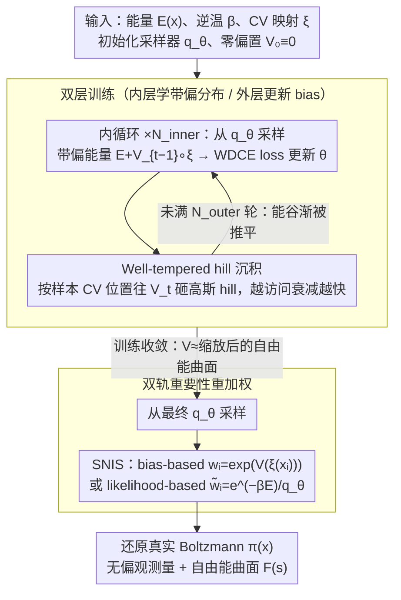

# MetaDNS: Enhancing Exploration in Discrete Neural Samplers via Well-Tempered Metadynamics

**会议**: ICML 2026  
**arXiv**: [2605.21722](https://arxiv.org/abs/2605.21722)  
**代码**: https://github.com/xiaochendu/metadns  
**领域**: 统计物理 / 神经采样器 / 增强采样  
**关键词**: 离散扩散、Metadynamics、模式塌缩、自由能重构、Boltzmann 采样

## 一句话总结
把分子动力学里的「well-tempered metadynamics」搬进离散神经采样器，用一个沿低维 collective variable 累积的历史相关偏置势 $V_t(s)$ 推平已访问的能谷，强迫 MDNS 类模型跨越能垒、覆盖多模态 Boltzmann 分布，并用重要性重加权保留无偏估计。

## 研究背景与动机

**领域现状**：在材料科学和统计物理里，预测合金有序/无序相变、磁性序参量等都要从离散 Boltzmann 分布 $\pi(x)\propto e^{-\beta E(x)}$ 中采样。传统手段是 MCMC（Metropolis–Hastings、Glauber、Swendsen–Wang），近两年兴起的「离散神经采样器」（MDNS、PDNS、LEAPS、DNFS 等）用 CTMC 或 any-order autoregressive 模型从能量函数学习采样器，号称能 scale 到高维。

**现有痛点**：用反向 KL 训练的离散神经采样器在低温下严重「模式塌缩」——概率质量都堆到训练早期发现的某一个能谷，跨能垒的高能区根本采不到样本。这带来两个致命问题：(i) 漏掉其它模态，equilibrium 观测量估计有偏；(ii) 没有 barrier-crossing 构型，根本算不出自由能曲面 $F(s)$。MDNS 即使加倍训练步数或在高温下 warm-start，也无法解决；PDNS 用 proximal point 缓解但仍缺乏显式 exploration 机制。

**核心矛盾**：现有方法靠「初始 prior → 目标分布」自然收敛或固定退火路径来探索，**没有任何机制鼓励生成器主动离开已访问区域**。同时材料体系里 $E(x)$ 评估极贵（DFT 几分钟到几小时一次、MLFF 也不便宜），浪费一次能量评估在已知低能区就是错过一次发现新相的机会。

**本文目标**：在不依赖 MCMC 链、不破坏 Boltzmann 渐近正确性的前提下，让离散神经采样器主动跨越能垒、覆盖所有模态，并顺便重构自由能曲面。

**切入角度**：连续空间分子动力学里的 well-tempered metadynamics（WT-MetaD）正是干这件事的经典工具——沿 CV 累积「越访问越高」的高斯型 bias hills，把能量 landscape 推平。但 WT-MetaD 是序贯 MCMC 范式，受限于 chain 自相关；如果把 bias 机制嫁接到能并行生成独立样本的神经采样器上，理论上可以两头通吃。

**核心 idea**：维护一个沿低维 CV $s=\xi(x)$ 的偏置势 $V_t(s)$，让神经采样器在「带偏 Boltzmann」$\pi_{V_t}(x)\propto e^{-\beta[E(x)+V_t(\xi(x))]}$ 上训练；外层根据当前样本的 CV 分布以 well-tempered 速率向 $V_t$ 添加高斯 hill；推断时用 $w_i=\exp(V(\xi(x_i)))$ 做自归一化重要性采样还原真实 Boltzmann。

## 方法详解

### 整体框架
MetaDNS 把训练拆成嵌套的双层循环。给定能量 $E(x)$、逆温度 $\beta$、人工选好的 CV 映射 $\xi:\mathcal{X}\to\mathcal{S}$（如 Ising 的上自旋比例、Potts 的各类占据分数、Cu-Au 的 Au 原子分数），初始化神经采样器 $q_\theta$ 和零偏置 $V_0\equiv 0$。

外循环每跑一轮：(1) 内循环固定 $V_{t-1}$，从 $q_\theta$ 采 $M_\text{inner}$ 个构型，按带偏能量 $E_\text{biased}(x)=E(x)+V_{t-1}(\xi(x))$ 计算 WDCE 等 MDNS 风格 loss 并梯度更新 $\theta$，跑 $N_\text{inner}$ 步；(2) 外循环再从更新后的 $q_\theta$ 采 $M_\text{outer}$ 个构型，用它们的 CV 位置往 $V_t$ 上「砸 hill」。这样训练结束时 $V_{N_\text{outer}}$ 已经把能谷推平，$q_\theta$ 学到的是平整化后的分布。推断阶段直接从 $q_\theta$ 采样，再用 $w_i=\exp(V(\xi(x_i)))$ 重加权回真实 Boltzmann。

整套设计对底座 sampler 无关：CTMC-based 离散扩散（MDNS、LEAPS、DNFS）和 any-order autoregressive 模型都能直接套用，只要把 loss 里的 $E$ 替换成 $E_\text{biased}$。

### 关键设计

**1. Well-tempered hill 沉积规则：往偏置势上砸历史相关的高斯 bump，越访问越衰减，顺手还把自由能曲面拟合出来**

要推平已访问的能谷又不让 bias 无限增长，关键在沉积规则。第 $t$ 轮对每个 CV 桶 $s$ 做更新 $V_t(s)\leftarrow V_{t-1}(s)+\sum_j h\,\exp(-V_{t-1}(s)/(\gamma k_B T))\,K(s,\xi(x_j))$，其中 $h$ 是 hill 高度、$K$ 是离散高斯核、$\gamma>1$ 是 bias factor。那个指数因子保证 $V$ 越高、再加的 hill 越小，渐近满足 $V^\star(s)\approx-(1-1/\gamma)F(s)+c$——也就是说训练结束时 $V$ 本身就是（缩放后的）自由能曲面。相比往 $V$ 上无差别堆 hill，这种 well-tempered 形式既保证收敛，又把 $F(s)$ "免费"拟合出来；高斯核比 delta 核在经验上也更稳定（Dama et al. 2014）。

**2. 离散神经 metadynamics 的双层训练：把 WT-MetaD 的"sample-bias-resample"循环改造成"内层学带偏分布 / 外层更新 bias"**

经典 WT-MetaD 是序贯 MCMC，每次更新 bias 后都要重新 burn-in 长链。本文把它改造成嵌套双层循环：内循环用 MDNS 的 WDCE 等基于 path-measure 对齐的 loss 把 $q_\theta$ 推向带偏 Boltzmann $\pi_{V_{t-1}}$；外循环只做一次前向采样然后更新 $V$。神经采样器一次采的样本之间独立，不像 MCMC 链有强自相关，所以外循环每次 hill 沉积的信息含量更高，同一 $V$ 下 amortize 多步训练后又能继续推进。这正是 MetaDNS 相对 MCMC-based WT-MetaD 的根本优势——后者要重 mix 长链，前者只是一次前向推理。代价是非遍历性问题：若 $q_\theta$ 没学到位，bias-based 重加权会有偏，作者在 Appendix A 给了缓解方案。

**3. 双轨重要性重加权：训练完成后必须把带偏分布还原回真实 Boltzmann，针对不同 sampler 给两种 SNIS 权重**

从平整化后的 $q_\theta$ 采样的构型必须还原 $\pi(x)$ 才有物理意义。本文给两种权重：Bias-based weights $w_i=\exp(V(\xi(x_i)))$ 适用于一切 sampler，权重只依赖低维 CV、方差小、不用额外能量评估，但对 sampler 误差敏感；Likelihood-based weights $\tilde w_i=\exp(-\beta E(x_i))/q_\theta(x_i)$ 渐近无偏，但要求 sampler 能算 likelihood——autoregressive 模型天生支持，MDNS 也能通过 path-likelihood 分解 $\log q_\theta(x_T)=\sum_t\log p_\theta(X_t\mid X_{<t})$ 算出，代价是每个样本一次额外能量评估。两套权重让 MetaDNS 各取所长：全局观测量（能量、磁化、CV 边缘、NESS）用 bias-based，Ising/Potts 的两点关联用 likelihood-based 以贴近 reference，必要时后者还能当 MCMC 的 informed proposal 保证统计精确。

### 损失函数 / 训练策略
内循环 loss 用 MDNS 原始的 weighted denoising cross-entropy（WDCE），把目标分布的 $E$ 替换为 $E_\text{biased}=E+V_{t-1}\circ\xi$；hyperparams 主要是 bias factor $\gamma$、初始 hill 高度 $h$、高斯核宽度 $\sigma$、$N_\text{inner}/N_\text{outer}$ 和 batch 大小。CV 选择是人工设定：Ising 用 $x_\uparrow$（上自旋占比），Potts 用各类占据分数构成二维 CV，Cu-Au 用 $x_\text{Au}$。

## 实验关键数据

### 主实验
作者覆盖 Ising、Potts、Cu-Au 三套体系，统一对照 MDNS（SOTA 神经采样器）和 MCMC-based WT-MetaD（金标准），并用 Swendsen–Wang / 长 MCMC 作 ground truth。代表性数字（$L=16$ Ising，主表 1 的 $x_\uparrow$ JS 散度，越低越好）：

| 设置（$L=16$ Ising） | MDNS | MDNS warm-start | **MetaDNS** | SW ground truth |
|----------------------|------|-----------------|-------------|------------------|
| 高温 $\beta=0.28$，$x_\uparrow$ JS↓ | 1.7e-2 | — | 1.7e-2 | — |
| 临界 $\beta=0.4407$，$x_\uparrow$ JS↓ | 3.6e-2 | — | 4.2e-2 | — |
| 低温 $\beta=0.60$，$x_\uparrow$ JS↓ | **2.2e-1（塌缩）** | 4.8e-3 | **4.6e-2** | — |
| 低温 $\beta=0.60$，磁化 | 0.974 | 0.972 | 0.974 | 0.973 |

低温 $x_\uparrow$ JS 散度 MetaDNS 比 vanilla MDNS 低约 5×，且磁化、两点关联都贴住 SW；MDNS 看似 NESS 高（0.979）只是因为塌缩到窄峰，不能说明分布对。Potts ($q=3,L=16$) 在低/临界/高温下，MetaDNS 达到 1 $k_BT$ RMSE 自由能精度所需 bias 沉积步数分别是 50k / 14k / 40k，而 MCMC-based WT-MetaD 要 94.5k / 36k / 107k，达 ~2× 加速。Cu-Au $4\times4\times4$ supercell 在 500K：MDNS 漏掉 Cu$_3$Au 相，MetaDNS 能量/$x_\text{Au}$ JS 散度从 1.3e-1 降到 7.9e-2 / 8.5e-2，并以 16k vs 33.8k bias 步达到 $<0.3\,k_BT$ RMSE。

### 消融 / 资源分析

| 维度 | MDNS | MetaDNS | MCMC WT-MetaD |
|------|------|---------|---------------|
| Ising/Potts/Cu-Au 低温模式覆盖 | 塌缩 | 全模态 | 全模态 |
| Potts 收敛 bias 沉积步数 | — | 14k–50k | 36k–107k |
| Cu-Au 训练 wall-time（A100） | — | 1.5 h | 1.75 h |
| Potts 训练 wall-time（A100） | — | 20 h | 1 h |
| 10k 样本生成时间 | — | <1 min | ≈30–40 min（链需重 mix） |

### 关键发现
- 模式塌缩只在 $L\ge 8$ 且 $\beta>\beta_\text{crit}$ 时显现，$L=4$ 看不到——这解释了为什么早期 MDNS 论文没暴露问题。
- Warm-start MDNS 能部分救 $x_\uparrow$ JS，但两点关联和能量 JS 反而变差，说明 warm-start 是「副作用换准确度」的妥协。
- 训练 wall-time 的胜负完全由 $E(x)$ 评估成本决定：Potts 解析能量极便宜，WT-MetaD 反而更快；Cu-Au 用 cluster expansion 一次评估贵，MetaDNS 既快训练又快推理。
- 推断阶段 MetaDNS 是 amortized——10k 样本一次前向几十秒，而 WT-MetaD 在收敛 bias 下重采样仍要长链，>30–40× 推断加速，随能量评估成本继续放大。

## 亮点与洞察
- 把分子动力学的「记忆型偏置势」第一次完整移植到离散神经采样器，且 sampler 不限类型，CTMC / autoregressive 都能套——这是「思想迁移」级别的贡献，而不是堆模块。
- $V^\star(s)\approx-(1-1/\gamma)F(s)+c$ 让 training 副产物天然就是自由能曲面，免费打通「采样—热力学分析」的最后一公里。
- 把「神经采样独立样本」和「MCMC 受限于自相关」摆在同一张 bias 沉积步数图上对比，是一种很有说服力的「资源单位」（per energy evaluation），值得其它 sampling 工作借鉴。
- 引入 Cu-Au 二元合金 benchmark 给 ML 社区，配合 cluster expansion 力场，是连接 ML sampling 与真实材料科学的重要一步——比堆 Ising/Potts 更有现实意义。

## 局限与展望
- CV 仍需人工设计，是最大软肋：作者明说复杂体系（高熵合金、金属氧化物）的 CV 不显然，未来要走 auto-CV discovery（如从 sampler 访问统计或表示学习中提取）。
- Bias 维度受 CV 维度+桶数指数压制，超过 2–3 维就难处理，限制了同时跟踪多个序参量的体系。
- $q_\theta$ 不遍历的话 bias-based 重加权有偏，论文给出经验性 mitigation 但没硬证明；理论收敛保证仍是 open。
- Potts 上神经训练 wall-time 比 WT-MetaD 高 20×——只有当 $E$ 评估极贵时该方法才在 wall-clock 上赢，应用范围被框定在「贵能量」体系。

## 相关工作与启发
- **vs MDNS / PDNS / LEAPS / DNFS**: 这些方法靠 KL/path-measure 对齐隐式驱动 exploration，没有显式 anti-revisit 机制；MetaDNS 直接加 history-dependent bias，是对它们的正交增强，并已经在 MDNS 上验证可即插即用。
- **vs Boltzmann Generators / 连续 Schrödinger bridge WT-ASBS (Nam et al. 2026)**: WT-ASBS 在连续空间做同一件事，本文是它在离散空间的对偶，但 CTMC 训练目标、CV 离散化、convergence intuition 都得重做。
- **vs 经典 WT-MetaD (Laio & Parrinello 2002; Barducci et al. 2008)**: 沿用 well-tempered hill 沉积和自由能恢复公式，但把基础 sampler 从 MCMC/MD 换成 neural sampler，把链上的「sequential bias deposition」改成 batched 神经训练，bias 沉积步数 ~2× 减少。

## 评分
- 新颖性: ⭐⭐⭐⭐ 跨学科思想迁移，离散神经采样器 + WT-MetaD 的首篇组合，思路自然但工程化与对应理论需要原创。
- 实验充分度: ⭐⭐⭐⭐⭐ 三套体系（Ising/Potts/Cu-Au）、多 lattice 多温度、对照 MDNS warm-start 与 MCMC WT-MetaD，且报告 wall-time、bias 步数、JS、NESS、自由能 PMF 等多维度指标。
- 写作质量: ⭐⭐⭐⭐ 动机—方法—实验链条清晰，附录给了收敛性讨论和 hyperparam 敏感性，但主文略偏算法描述，部分技术抉择（如 bias vs likelihood 权重选择）解释稍简。
- 价值: ⭐⭐⭐⭐ 解决了离散神经采样器最痛的低温塌缩问题，提供 Cu-Au benchmark，对计算材料学社区有直接落地价值，对 generative sampling 研究者提供可复用的 exploration 模板。

<!-- RELATED:START -->

## 相关论文

- [\[ICML 2025\] Discrete Neural Algorithmic Reasoning](../../ICML2025/others/discrete_neural_algorithmic_reasoning.md)
- [\[ICML 2026\] NonZero: Interaction-Guided Exploration for Multi-Agent Monte Carlo Tree Search](nonzero_interaction-guided_exploration_for_multi-agent_monte_carlo_tree_search.md)
- [\[ICML 2025\] Improved Exploration in GFlowNets via Enhanced Epistemic Neural Networks](../../ICML2025/others/improved_exploration_in_gflownets_via_enhanced_epistemic_neural_networks.md)
- [\[ICML 2026\] On the Epistemic Uncertainty of Overparametrized Neural Networks](on_the_epistemic_uncertainty_of_overparametrized_neural_networks.md)
- [\[ICML 2026\] Torus Graphs for Large-Scale Neural Phase Analysis](torus_graphs_for_large_scale_neural_phase_analysis.md)

<!-- RELATED:END -->
