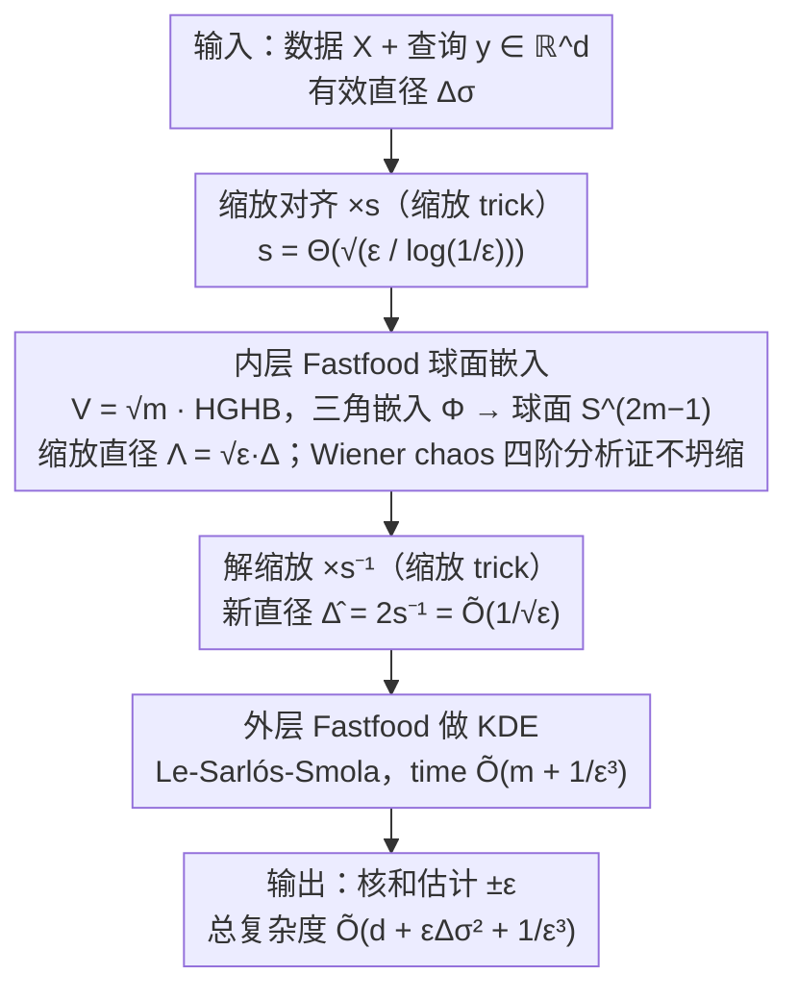

# New Bounds for Kernel Sums via Fast Spherical Embeddings

**会议**: ICML 2026  
**arXiv**: [2605.01263](https://arxiv.org/abs/2605.01263)  
**代码**: 无  
**领域**: 算法理论 / 核密度估计 / 随机投影  
**关键词**: KDE、Gaussian kernel、Fastfood、随机化 Hadamard 变换、Wiener chaos

## 一句话总结
通过把 Bartal-Recht-Schulman 2011 的"随机 Nash 装置"球面嵌入定理用迭代 Fastfood 变换做成快速版（time $\widetilde{O}(d + \Lambda^2 + \varepsilon^{-2})$），再把它作为 Gaussian KDE 的预处理把直径压到 $\widetilde{O}(1/\sqrt{\varepsilon})$，得到新的 Gaussian KDE 查询时间界 $\widetilde{O}(d + \varepsilon \Delta_\sigma^2 + 1/\varepsilon^3)$，在小 $\varepsilon$ 中等直径的体制下优于 RFF / FJLT+RFF / Fastfood。

## 研究背景与动机

**领域现状**：核密度估计（KDE）是 ML 的基本工具，目标是给查询 $y$ 估计 $\frac{1}{|X|} \sum_{x \in X} \mathbf{k}(x, y)$ 到精度 $\pm \varepsilon$（高概率）。高维 Gaussian KDE 的查询时间在过去十几年被三大方法刷过：(i) RFF $O(d/\varepsilon^2)$，(ii) FJLT + RFF $\widetilde{O}(d + 1/\varepsilon^4)$，(iii) Fastfood $\widetilde{O}(d + \Delta_\sigma^2/\varepsilon^2)$。三者互不可比，依赖维度 $d$、误差 $\varepsilon$、有效直径 $\Delta_\sigma = \Delta/\sigma$ 的具体取值。

**现有痛点**：每种方法都有"不被覆盖"的参数区间。Fastfood 在直径小时最优，但 $\Delta_\sigma^2 / \varepsilon^2$ 中直径出现在分子上（直径越大越糟）；RFF/FJLT 不依赖直径但 $\varepsilon$ 的依赖很重。能不能造一个 bound 让直径以"更友好"的方式（比如 $\varepsilon \Delta_\sigma^2$，$\varepsilon$ 越小越好）出现？

**核心矛盾**：Fastfood 的瓶颈是输出维度 $d' = O(\Delta_\sigma^2 / \varepsilon^2)$，必须由 data 所在区域的直径决定。如果能在 Fastfood 之前做一次"压缩直径"的预处理，让 Fastfood 看到的有效直径变小，整体复杂度就能改善。但这个预处理本身不能慢，也不能扭曲距离影响 kernel 估计精度。

**本文目标**：构造一个 $\widetilde{O}(d + \Lambda^2 + \varepsilon^{-2})$ 时间复杂度的"快速球面嵌入"——把点送到单位球，保留"小"距离 $\leq \sqrt{\varepsilon}$ 到 $(1 \pm \varepsilon)$，防止"大"距离 collapse 到 $\Omega(\sqrt{\varepsilon})$ 以下，把直径压到 $1/\sqrt{\varepsilon}$。然后再叠一层 Fastfood 做 KDE。

**切入角度**：注意一个关键观察——对 Gaussian KDE，距离 $\geq \sqrt{\log(1/\varepsilon)}$ 时 $e^{-\|x-y\|^2} \leq \varepsilon$，所以这些"大"距离不需要精确保留，只要别 collapse 到比 $\sqrt{\log(1/\varepsilon)}$ 还小即可。这种"小距离精确、大距离不 collapse"的需求恰好对应 BRS 2011 引入的球面嵌入定理，但他们的实现是全 Gaussian 矩阵，$O(d/\varepsilon^2)$，没法快。

**核心 idea**：用迭代 Fastfood $\psi(H D_2 H D_1 x)$（两层随机化 Hadamard 变换）当作"快速版的 BRS 球面嵌入"，证明它满足球面嵌入的三个性质，然后把它作为 Gaussian KDE 的预处理拼到 Fastfood 之上得到两层 Fastfood: $\psi(H D_4 H D_3 \cdot s^{-1} \psi(H D_2 H D_1 (s x)))$。

## 方法详解

### 整体框架
两阶段嵌入。第一阶段 **快速球面嵌入** $\Phi: \mathbb{R}^d \to \mathbb{S}^m$，$m = \widetilde{O}(d + \Lambda^2 + \varepsilon^{-2})$，把数据 + 查询缩放 $s = \Theta(\sqrt{\varepsilon / \log(1/\varepsilon)})$ 后送进 **内层 Fastfood**，输出已经在 $\mathbb{S}^{2m-1}$ 上，缩放直径 $\Lambda = s\Delta = \widetilde{O}(\sqrt{\varepsilon} \Delta)$。第二阶段 **解缩放 + 外层 Fastfood** 做 KDE：解缩放后点位于半径 $s^{-1}$ 球面，新直径 $\widehat{\Delta} = 2 s^{-1} = \widetilde{O}(1/\sqrt{\varepsilon})$。再走标准 Fastfood (Le-Sarlós-Smola 2013) 做 KDE 近似，复杂度 $\widetilde{O}(m + \widehat{\Delta}^2/\varepsilon^2) = \widetilde{O}(m + 1/\varepsilon^3)$。两层加起来正好 $\widetilde{O}(d + \varepsilon \Delta_\sigma^2 + 1/\varepsilon^3)$。整条 pipeline 就是「缩放对齐 → 内层 Fastfood 球面嵌入（压直径）→ 解缩放 → 外层 Fastfood 做 KDE」的双层级联，三个关键设计分别对应内层嵌入的构造、证明这个嵌入成立的分析工具、以及把两个尺度对齐的缩放。

### 关键设计

**1. 把 Fastfood 当作快速球面嵌入：用结构化矩阵换掉全 Gaussian 矩阵**

BRS 2011 早已给出一个"球面嵌入"工具，能把点映到单位球、小距离精确保留、大距离不 collapse，正合 Gaussian KDE"近处要准、远处只要别坍缩"的需求——但他们用的是全 Gaussian 矩阵 $W$，时间 $O(d/\varepsilon^2)$，太慢。本文的核心替换是用迭代 Fastfood 顶上去：映射 $\Phi$ 把任意 $x\in\mathbb{R}^m$ 经 Fastfood 矩阵 $V=\sqrt{m}\cdot HGHB$（$H$ 归一化 Hadamard、$G=\text{diag}(g)$ 高斯对角、$B$ Rademacher 符号对角）后送进三角嵌入

$$\Phi(x)_{2j-2}=\tfrac{1}{\sqrt m}\cos((Vx)_j),\quad \Phi(x)_{2j-1}=\tfrac{1}{\sqrt m}\sin((Vx)_j),$$

输出落在 $\mathbb{S}^{2m-1}$ 上由 $\sin^2+\cos^2=1$ 自动保证。$Vx$ 靠 Walsh-Hadamard 变换 $O(m\log m)$ 算出，于是整个球面嵌入从 $O(d/\varepsilon^2)$ 降到 $O(m\log m)$，同时靠 RHT 充当 Gaussian "近似版"保住了原定理需要的统计性质（Theorem 1.3 的三条距离条件）。

**2. 第四阶 Wiener chaos 分析做距离收缩控制：证"小距离不被压扁"的硬核技术**

要证 $\Phi$ 不把小距离收缩超过 $(1-\varepsilon)$ 倍（Theorem 1.3 的 item 2），二阶矩分析不够用。作者从 Taylor 下界 $1-\cos(\theta)\ge\tfrac12\theta^2-\tfrac{1}{24}\theta^4$ 出发，得到

$$\|\Phi(x)-\Phi(y)\|^2 \ge Q(z)-\tfrac{1}{12}W(z),\quad Q(z)=\tfrac1m\|Vz\|^2,\ W(z)=\tfrac1m\sum_j (Vz)_j^4.$$

二阶项 $Q(z)$ 用 Bernstein 不等式压住即可，难的是四阶项 $W(z)$——它是高斯 chaos 函数，作者用恒等式 $t^4-3=6h_2(t)+h_4(t)$ 把它拆成第 2 和第 4 阶 Wiener chaos，分别用 Bernstein 和 Wiener chaos 超收缩（Theorem 3.6）控制。这一步是全文最核心的技术创新：Le-Sarlós-Smola 2013 的 Fastfood 分析只用 Lipschitz Gaussian 集中、只能给二阶矩，而证 collapse 下界必须看到 $(Vz)_j^4$ 的方差，那就非得动用 chaos 分解和超收缩不可。

**3. 缩放 trick 把"小距离阈值"对齐到 Gaussian KDE 的有效距离**

BRS 嵌入精确保留的是 $\le\sqrt{\varepsilon}$ 的小距离，但 Gaussian KDE 真正在乎的阈值是 $\sqrt{\log(1/\varepsilon)}$（再远 $e^{-\|x-y\|^2}\le\varepsilon$ 可忽略），两个尺度对不上。作者用一个干净的缩放把它们对齐：输入先放大 $s=\Theta(\sqrt{\varepsilon/\log(1/\varepsilon)})$ 倍进入嵌入，输出再缩回 $s^{-1}$ 倍。于是原始距离 $\le\sqrt{\log(1/\varepsilon)}$ 的点对在嵌入空间被精确保留，$\ge\sqrt{\log(1/\varepsilon)}$ 的点对至少保持 $\Omega(\sqrt{\log(1/\varepsilon)})$、对应的 Gaussian 项都小于 $\varepsilon$ 可以丢掉。反缩放后点落在半径 $s^{-1}$ 的球面上、新直径 $\widehat\Delta=2s^{-1}=\widetilde O(1/\sqrt\varepsilon)$，正好把直径压到能让外层 Fastfood 跑出 $\widetilde O(1/\varepsilon^3)$ 的程度——这就是新 bound 里直径项变成"乘 $\varepsilon$"而非"除 $\varepsilon$"的来源。

### 损失函数 / 训练策略
本文是纯理论文章，没有训练或优化目标。所有"参数"（嵌入维度 $m$、缩放因子 $s$、Hadamard 阶数）都由理论分析显式确定。

## 实验关键数据
本文是纯理论文章，没有实验表格。复杂度对比可视化在 Table 1 和 Figure 1。

### 主实验

| 方法 | 查询时间 | 最优体制 |
|------|----------|----------|
| RFF | $O(d / \varepsilon^2)$ | $d \lesssim \varepsilon^{-2}$ 且 $\Delta_\sigma \gtrsim \sqrt{d} \varepsilon^{-1.5}$ |
| FJLT + RFF | $\widetilde{O}(d + 1/\varepsilon^4)$ | $d \gtrsim \varepsilon^{-2}$ 且 $\Delta_\sigma \gtrsim \varepsilon^{-2.5}$ |
| Fastfood | $\widetilde{O}(d + \Delta_\sigma^2/\varepsilon^2)$ | $\Delta_\sigma \lesssim \min\{\sqrt{d}, \varepsilon^{-0.5}\}$ |
| **本文 (Theorem 1.2)** | $\widetilde{O}(d + \varepsilon \Delta_\sigma^2 + 1/\varepsilon^3)$ | $\varepsilon^{-0.5} \lesssim \Delta_\sigma \lesssim \min\{\sqrt{d} \varepsilon^{-1.5}, \varepsilon^{-2.5}\}$ |

四种方法互不可比，每种在自己的参数区间内最优。本文新增的方法占据"中等直径 + 小 $\varepsilon$"区间，这是之前没人覆盖的体制。

### 消融实验

| 推广 | 核 | 查询时间 |
|------|------|----------|
| Theorem 1.4 | Inverse Multi-Quadratic $\mathbf{k}_\beta^{\text{IMQ}}(x,y) = (1 + \|x-y\|^2/\sigma^2)^{-\beta}$ | $\widetilde{O}(d + \varepsilon (\beta \Delta_\sigma)^2 + 1/\varepsilon^3)$ |
| Theorem 1.5 | Gaussian + 差分隐私（function release） | 同 Theorem 1.2，前提 $|X| \geq \widetilde{O}(1/(\varepsilon^2 \varepsilon_{\text{DP}}))$ |

两个扩展验证了主定理的核心技术（fast 球面嵌入）不止对 Gaussian KDE 适用——IMQ 通过 Cherapanamjeri-Silwal-Woodruff 2024 的函数近似嫁接；DP 通过控制 RHT 输出坐标间的概率依赖（这是 Fastfood 和本文都需要而 RFF 不需要的额外步骤）拿到。

### 关键发现
- 本文新 bound 中 $\varepsilon$ 在直径项 $\varepsilon \Delta_\sigma^2$ 的位置是 **乘** 而非 **除**——这意味着小 $\varepsilon$ 反而让直径项更小，对比 Fastfood 的 $\Delta_\sigma^2/\varepsilon^2$ 是个根本性的极性翻转。
- 关键是第四阶 chaos 控制：当用 Bernstein 二阶分析时只能给上界（distance expansion），证 distance contraction 必须看到 $(Vz)_j^4$ 的方差，而那是 Wiener 4 阶 chaos 量，需要超收缩。
- 两层 Fastfood 的复合结构在算法上和 SORF 2017、Andoni et al. LSH 2015 用 3 层 RHT 的启发式做法呼应，但本文给了第一个理论保证的双层版本。
- 嵌入定理 1.3 的应用面可能远超 KDE——只要某类应用需要"小距离精确、大距离不 collapse"的快速嵌入，都能直接用，作者把它当独立 contribution 单列。

## 亮点与洞察
- "用 fast 嵌入压缩直径再 cascade Fastfood"这种 algorithmic re-composition 思路特别经济——不发明全新算法，只是把已有 block 重新串接，但通过精细的尺度对齐拿到新 bound。
- Wiener chaos 分解 + 超收缩做 RHT 四阶项控制是个值得 ML 社区学的硬功夫：Gaussian 多项式的 hypercontractivity 是个老工具但很少在 random projection 文献里见到，本文给了一个干净示范，未来分析 SORF / 多层 RHT / structured sketch 时这套工具会再次出现。
- 把 BRS 2011 的概念性结果（"randomized Nash device"）翻译成 fast 版本，让一个原本只活在 metric embedding 圈子里的工具进入 KDE / kernel approximation 主流，是个 nice bridging contribution。

## 局限与展望
- 上界只在很窄的 $\Delta_\sigma$ 区间最优（$\varepsilon^{-0.5} \lesssim \Delta_\sigma \lesssim \varepsilon^{-2.5}$），区间外仍由前人 bound 主导。
- 没有实验验证常数因子大小，$\widetilde{O}$ 中隐藏的对数因子（特别是 Wiener chaos 部分）实际可能很大。
- 只针对 additive error KDE，relative error KDE（Backurs et al. 系列）应用本文嵌入需要额外工作。
- 球面嵌入定理本身可能有独立应用（Bartal et al. 用 BRS 嵌入做 Lipschitz extension 和 small distortion embedding），但本文只用它做 KDE。

## 相关工作与启发
- **vs RFF / FJLT + RFF**: 都不依赖直径，本文显式依赖 $\Delta_\sigma$，但是以更友好的 $\varepsilon \Delta_\sigma^2$ 形式出现。
- **vs Fastfood**: 本文相当于 Fastfood 套 Fastfood，前者做球面嵌入压缩，后者做实际 KDE 估计。
- **vs Charikar-Siminelakis 2017 系列（importance sampling-based KDE）**: 那条线给 relative error 但 polynomial 复杂度更高；本文专注 additive error 这条赛道。
- **vs SORF (Yu et al. 2016) / 多层 RHT LSH**: 都用多个 RHT 串起来，但 SORF 是启发式经验最优、缺理论；本文用 Wiener chaos 给双层 RHT 第一次理论保证。
- 启发：球面嵌入 + Wiener chaos 工具可能能用到 attention sketching / transformer KV-cache 压缩等 ML 系统问题，那里也需要"小距离精确、大距离允许误差"的 kernel-like 操作。

## 评分
- 新颖性: ⭐⭐⭐⭐ 算法上是 block re-composition，分析上引入 Wiener chaos 是新工具
- 实验充分度: ⭐⭐ 纯理论，没有实测常数因子也没和 Fastfood/RFF 跑过对比
- 写作质量: ⭐⭐⭐⭐⭐ 概念图 + 表格 + 复杂度区间分析三件套把"新 bound 比之前好在哪"讲得清清楚楚
- 价值: ⭐⭐⭐⭐ 给 kernel approximation 理论社区填上了一个特定参数区间的空白，球面嵌入定理 1.3 有独立应用潜力

<!-- RELATED:START -->

## 相关论文

- [\[ICLR 2026\] Probabilistic Kernel Function for Fast Angle Testing](../../ICLR2026/others/probabilistic_kernel_function_for_fast_angle_testing.md)
- [\[ICML 2026\] Polaris: Coupled Orbital Polar Embeddings for Hierarchical Concept Learning](polaris_coupled_orbital_polar_embeddings_for_hierarchical_concept_learning.md)
- [\[ICML 2025\] K²IE: Kernel Method-based Kernel Intensity Estimators for Inhomogeneous Poisson Processes](../../ICML2025/others/k2ie_kernel_method-based_kernel_intensity_estimators_for_inhomogeneous_poisson_p.md)
- [\[AAAI 2026\] A New Strategy for Verifying Reach-Avoid Specifications in Neural Feedback Systems](../../AAAI2026/others/a_new_strategy_for_verifying_reach-avoid_specifications_in_neural_feedback_syste.md)
- [\[ICLR 2026\] Characterizing and Optimizing the Spatial Kernel of Multi Resolution Hash Encodings](../../ICLR2026/others/characterizing_and_optimizing_the_spatial_kernel_of_multi_resolution_hash_encodi.md)

<!-- RELATED:END -->
