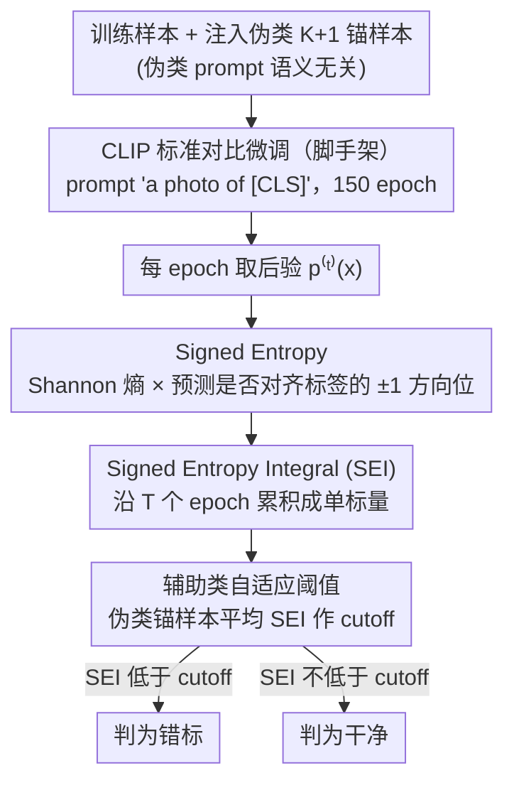

# On Revisiting Entropy for Identifying Mislabeled Images

**会议**: ICML 2026  
**arXiv**: [2605.31090](https://arxiv.org/abs/2605.31090)  
**代码**: https://github.com/MedAITech/SEI  
**领域**: 噪声标签 / 鲁棒学习 / 表示学习 / 训练动力学  
**关键词**: 错误标签检测, 训练动力学, 符号熵, CLIP, 医学图像

## 一句话总结
作者发现"错标样本的预测熵在整个训练中持续偏高"这一现象不足以区分错标样本和困难干净样本，于是把熵乘上一个"预测是否对齐给定标签"的符号位得到 **signed entropy**，并沿训练 epoch 累积成 **SEI** 统计量，在 ISIC/DeepDRiD/PANDA/CheXpert 等多个医学数据集和 CIFAR-100N 上以纯插拔方式刷新错标检测 SOTA（最高领先 11%+）。

## 研究背景与动机

**领域现状**：错标样本检测主要走两条路。一是**损失类**方法（O2U-Net、CORES、AUM）——错标样本损失更高；二是**预测统计类**方法（Confident Learning、SIMIFEAT、DEFT、LEMoN）——靠预训练模型在特征空间或图文对齐空间里跑 kNN/聚类。这些方法要么得改训练流程（多阶段、特殊损失、记忆模块），要么强依赖通用预训练模型的泛化能力。

**现有痛点**：在**医学影像**这种"图像之间长得很像、专家也会标错"的领域，通用 CLIP 这种判别能力下降很多，导致基于预训练特征的方法（DEFT、LEMoN）水土不服；而损失/置信度类方法对训练抖动极敏感，单一 epoch 抓的信号不稳。最关键的痛点是：**hard clean 样本和错标样本在熵/损失上几乎不可区分**——它们都会让模型"想不明白"，单纯按熵阈值刷会一起被冤枉。

**核心矛盾**：熵只刻画"分布的不确定性"，是一个**无方向**的量；它无法告诉你"模型到底信不信你给的这个标签"。错标 vs 困难干净的本质区别不是"不确定程度"，而是"模型预测和给定标签之间的一致性方向"。

**本文目标**：设计一个**插拔式、单一标量**的错标检测指标，要求：(a) 不改训练流程；(b) 同时利用熵的幅度和方向；(c) 跨 epoch 累积以抗抖动；(d) 不依赖通用预训练模型在目标域的迁移效果。

**切入角度**：作者把训练动力学拆成两个信号——**熵随训练演化的轨迹** 和 **预测与给定标签的一致性轨迹**——并观察到一个干净的事实：易学干净样本的预测大部分时间与标签对齐、熵单调下降；困难干净样本前期错、后期对，熵先高后低；而错标样本几乎从头到尾"模型说不是你说的那个"，且熵长期居高不下。这就把"一致性"这条额外信号天然注入了熵里。

**核心 idea**：给 Shannon 熵乘上一个由"预测 argmax 是否等于给定标签"决定的符号位 $(-1)^{1[y=\arg\max p]}$，得到 **signed entropy**；再沿训练 epoch 累积得到 SEI——错标样本得到强负积分，干净样本得到正积分，一条单参数就能 rank 全部样本。

## 方法详解

### 整体框架
SEI 不改训练，只在标准训练流程外面挂一个"统计探针"：用 CLIP 把类名做成 prompt `"a photo of [CLS]"`、按 cosine similarity 跑常规的对比分类微调，每个 epoch 结束顺手记下每个样本的一个带方向的熵值，训练 150 epoch 后把这条轨迹沿 $t$ 积分成单个标量 SEI，再用一个自校准阈值把低分样本判为错标。一句话：**把"熵的大小"和"预测是否对齐标签"这两个训练动力学信号融成一个可排序的分数**，错标样本天然落到数轴的一端。

### 关键设计

**1. Signed Entropy：给无方向的熵补上一个 ±1 的方向位**

Shannon 熵只刻画分布有多不确定，是个恒非负的无方向量——错标样本和困难干净样本都"想不明白"、都高熵，单看熵根本分不开。作者的做法是给熵乘上一个由"当前预测的 argmax 是否等于给定标签"决定的符号位：对当前 epoch 的后验 $\bm{p}(\bm{x})$，定义 $\mathcal{H}(\bm{p}(\bm{x}), y) = (-1)^{\mathbb{1}[y=\arg\max_k p_k(\bm{x})]} \sum_k p_k(\bm{x})\log p_k(\bm{x})$。读者按"预测与标签**对齐取正、不对齐取负**、无符号的 $-\sum p\log p\ge 0$ 当幅度"来理解即可（作者明确写 easy clean → 大正 SEI、mislabeled → 强负 SEI，这与符号位的字面指数约定差一个整体翻转，但语义就是方向位）。补上这个方向位之后，错标样本（长期不对齐）和困难干净样本（早期不对齐、后期对齐）就会沿训练 epoch 走出**方向完全相反**的轨迹，给后面的积分留出可分性。

**2. Signed Entropy Integral：把整条训练轨迹积分掉抖动**

单个 epoch 的预测/损失值噪声大、对超参敏感（AUM、O2U-Net 早就观察到），靠某一轮的切片做判断不稳。SEI 把每个样本那条长度为 $T$ 的 signed entropy 曲线直接沿训练求和压成一个标量：$\mathrm{SEI}(\bm{x},y) = \sum_{t=1}^T \mathcal{H}(\bm{p}^{(t)}(\bm{x}), y)$。三类样本因此天然落在数轴的三段：易学干净样本几乎每轮都对齐，累出一个大的同号积分；困难干净样本早期反号、后期同号，**正负相消**落在中段；错标样本从头错到尾、符号始终一致，累出一个绝对值很大的相反号积分。积分等于把轨迹"自然平均"，消融（Table 4）显示单 epoch 切片 SE@T/SE@T/2 比 SEI 差 8–15 个 F1，而 SEI 又比无符号积分 EI 平均高 10+ 点——符号和时序两个设计缺一不可。

**3. 辅助类自适应阈值：用伪类锚把判定阈值自校准**

有了 SEI 排序还得有一条 cutoff，但固定阈值换个数据集/换个噪声率就失效，留干净 hold-out 集又违背"无干净数据"假设。作者的办法是注入一批**必然错标**的锚样本：随机抽 $N/(K+1)$ 张图，把标签改成原数据集里根本不存在的伪类 $K+1$（CLIP 下把伪类 prompt 写成语义无关的话术，如皮肤镜数据里的 "a dermoscopic image showing other lesions"），这些样本的行为就是真实错标的代理，于是直接取它们的平均 SEI 当 cutoff，低于它的判错标。抽 $N/(K+1)$ 张是为了让伪类频率和原来 $K$ 个真类一致、不引入类不平衡污染校准。这一招思路来自 AUM 的"植入已知坏样本当锚"，但换成 CLIP 友好的伪类 prompt 而非随机翻转标签，更贴合"类名即 text prompt"的范式。

### 损失函数 / 训练策略
SEI 本身不引入任何新 loss——训练就是 CLIP 标准的图像-文本对比 loss（按 prompt `"a photo of [CLS]"` 把每张图与 $K$ 个类的 text embedding 对齐），所有错标检测动作都在 forward 算出 $\bm{p}^{(t)}(\bm{x})$ 之后离线完成、不反传到模型。实现细节：SGD + momentum 0.9 + weight decay $1\times 10^{-4}$，batch 128，lr $1\times 10^{-3}$，150 epoch，lr 在 75/115 epoch 衰减 10×，图像 resize 到 $224\times 224$。

## 实验关键数据

### 主实验
医学三数据集（ISIC-7类皮肤镜、DeepDRiD-5级糖网、PANDA-4类病理切片）+ 两种噪声（symmetric / confusion-calibrated）+ 5 个噪声率 $\eta\in\{0.1...0.5\}$，对比 10 个 baseline（INCV/BMM/GMM/AUM/CORES/CL/SIMIFEAT/DEFT/ReCoV/LEMoN），评测 F1。

| 数据集 | 噪声 | $\eta$ | SEI | 第二名 | 提升 |
|--------|------|--------|------|---------|------|
| ISIC | symmetric | 0.5 | **83.93** | CORES 82.67 | +1.26 |
| ISIC | confusion | 0.4 | **74.98** | AUM 64.54 | **+10.44** |
| DeepDRiD | symmetric | 0.5 | **78.19** | AUM 75.75 | +2.44 |
| DeepDRiD | confusion | 0.5 | **73.04** | LEMoN 66.82 | +6.22 |
| PANDA | symmetric | 0.3 | **81.46** | AUM 75.95 | +5.51 |
| PANDA | confusion | 0.1 | **73.17** | AUM 61.30 | **+11.87** |
| CheXpert（真实临床噪声） | — | — | **83.59** | AUM 80.34 | +3.25 |

confusion-calibrated 噪声下 SEI 优势远大于 symmetric，说明它对"模型容易混淆的近邻类"更鲁棒——这正是真实临床错标的形态。

### 消融实验
| 配置 | ISIC@0.4 | DeepDRiD@0.4 | PANDA@0.4 | 说明 |
|------|----------|--------------|-----------|------|
| EI（去符号位） | 60.77 | 59.28 | 67.26 | 退化成无符号熵积分 |
| SE@T（去时序，只取末轮） | 57.89 | 57.93 | 62.91 | 单 epoch 切片 |
| SE@T/2（去时序，取中段） | 63.72 | 62.84 | 66.26 | 单 epoch 切片 |
| **SEI（完整）** | **74.98** | **68.35** | **81.96** | 符号 + 累积都要 |

### 关键发现
- **符号位贡献 > 时序积分**：去掉符号位（EI）平均掉 10+ F1；去掉时序（SE@T/T2）平均掉 8-15 F1。两个设计**都必要**且**符号位更关键**——这佐证了作者"熵的方向比熵的大小更能区分错标"这一动机。
- **架构无关**：表 5 显示 ResNet-50、ViT-B/16 普通分类网络上 SEI 也涨点，但搭 CLIP 涨得最多——CLIP 的图文对齐让伪类阈值校准更准。
- **confusion noise 优势放大**：在更难的 confusion 噪声上，SEI 相对 baseline 的领先幅度比 symmetric 更大（PANDA@0.1 +11.87，ISIC@0.4 +10.44）；这是因为 confusion noise 制造的错标在特征上与真类更接近，SIMIFEAT/DEFT 这类靠"特征空间近邻"的方法被骗，而 SEI 看的是"整条训练轨迹的方向一致性"，骗不动。
- **真实临床数据可用**：CheXpert 用 5 位放射科医师 majority vote 当 clean label、原报告抽取标签当 noisy label，SEI F1 83.59 比第二名 AUM 高 3.25，证明在没人为注入噪声的真实场景下也 work。

## 亮点与洞察
- **"给熵加方向"是一个极简但击中要害的操作**：整个核心创新就是 $(-1)^{\mathbb{1}[y=\arg\max p]}$ 这一个符号位，没有任何新模块、新 loss、新阶段，却把过去"熵无法区分错标 vs 困难干净"这个根本盲区直接补掉。把噪声标签问题从"分布层面"提到"分布 + 方向"层面，是一个值得迁移到其他不确定性度量任务（OOD detection、active learning sample selection）的设计思路。
- **辅助类阈值校准**比 AUM 那种"植入已知翻转样本"更优雅：用 CLIP prompt 注入一个"语义无关"的伪类，既不污染原类、又给阈值一个合理 anchor。这个 trick 可以直接搬到任何 CLIP-style 的 zero-shot/few-shot 框架做不确定性校准。
- **训练动力学的双信号视角**——熵幅度 + 标签对齐——给"看模型训练历史能学到什么"这个老话题加了新视角：单看 loss/entropy 是单维度信号，而预测-标签 alignment 序列是一条互补的、带方向的二值序列，两者合起来能区分易/难/错三类样本。这种"幅度 × 方向"的拆解可以泛化到任何需要从训练轨迹做样本筛选的场景（curriculum learning、coreset selection）。

## 局限与展望
- 作者承认辅助类阈值是**启发式的**——伪类 prompt 的具体措辞会影响校准结果，没给出系统的 prompt 敏感性分析；不同数据集的 prompt 需要人工设计。
- 必须**完整训练 150 epoch** 才能得到完整的 SEI 轨迹，比单次 forward pass 的检测方法（SIMIFEAT/DEFT）贵很多，作者没讨论"早停 + 部分积分"是否还能保持性能。
- 评测全部在医学（+ CIFAR-100N）数据集上，**没在自然图像大规模噪声 benchmark（如 Clothing1M、WebVision、Animal-10N）上比较**，无法判断在自然域是否还领先 LEMoN/DEFT 等通用方法。
- 用了 CLIP 作为骨干，但医学领域 CLIP 的 zero-shot 已知较弱；如果换成医学专用 BiomedCLIP/PMC-CLIP 是否会进一步提升、伪类阈值是否还稳定，没消融。
- 检测后只做**丢弃**，没尝试 re-labeling 或 sample re-weighting，未充分利用错标信息（虽然作者说"compatible with re-use methods"但没实测）。

## 相关工作与启发
- **vs AUM (Pleiss et al., 2020)**：AUM 用 "logit margin" 沿训练累积、靠**植入已知错标样本**作阈值锚，SEI 用 "signed entropy" 沿训练累积、靠**伪类**作阈值锚。SEI 的优势是把"熵幅度 × 标签方向"两个信号融在一个标量里，AUM 只看 margin 这一维。
- **vs O2U-Net / CORES (loss-based)**：它们靠 loss 高低区分错标，但 hard clean 也会高 loss；SEI 用方向位天然区分这两者。
- **vs SIMIFEAT / DEFT / LEMoN (pre-trained feature based)**：这类方法靠 CLIP 等预训练模型的特征空间近邻关系做检测，**完全不训练**目标模型；在通用域有效但在医学这种 CLIP 表示弱的特化域显著掉点。SEI 把 CLIP 当**可微调骨干**而非冻结特征器，并利用整条 fine-tune 轨迹的动力学，因此在医学域反超。
- **启发：把方向位塞进度量**：这个"$(-1)^{\text{某 indicator}}$ × 标量度量"的设计 pattern 可以迁移到 active learning 的 acquisition function、OOD detection 的 score、curriculum learning 的 difficulty score——任何"幅度本身不够、需要方向"的场景。

## 评分
- 新颖性: ⭐⭐⭐⭐ 不是革命性突破，但"给熵加符号位"这一刀切得极准、解决了一个被忽视的根本盲区。
- 实验充分度: ⭐⭐⭐⭐ 三个医学数据集 × 两种噪声 × 5 噪声率 + 真实 CheXpert + CIFAR-100N + 完整消融 + 架构泛化；但缺自然图像大规模 noisy label benchmark。
- 写作质量: ⭐⭐⭐⭐ 动机层层推进（熵→失败→引入方向→引入时序→引入阈值），公式简洁，图 1-4 把"为什么 SEI 能分离三类样本"画得很清楚。
- 价值: ⭐⭐⭐⭐ 插拔式、零额外组件、SOTA、代码开源；对医学影像数据清洗有直接工程价值，对错标检测领域贡献了"signed dynamics"的新视角。

<!-- RELATED:START -->

## 相关论文

- [\[ICML 2026\] Rectified LpJEPA: Joint-Embedding Predictive Architectures with Sparse and Maximum-Entropy Representations](rectified_lpjepa_joint-embedding_predictive_architectures_with_sparse_and_maximu.md)
- [\[ECCV 2024\] HiEI: A Universal Framework for Generating High-quality Emerging Images from Natural Images](../../ECCV2024/others/hiei_a_universal_framework_for_generating_high-quality_emerging_images_from_natu.md)
- [\[ACL 2025\] Entropy-UID: A Method for Optimizing Information Density](../../ACL2025/others/entropy-uid_a_method_for_optimizing_information_density.md)
- [\[ICML 2025\] Revisiting the Predictability of Performative, Social Events](../../ICML2025/others/revisiting_the_predictability_of_performative_social_events.md)
- [\[CVPR 2026\] A Difference-in-Difference Approach to Detecting AI-Generated Images](../../CVPR2026/others/a_difference-in-difference_approach_to_detecting_ai-generated_images.md)

<!-- RELATED:END -->
