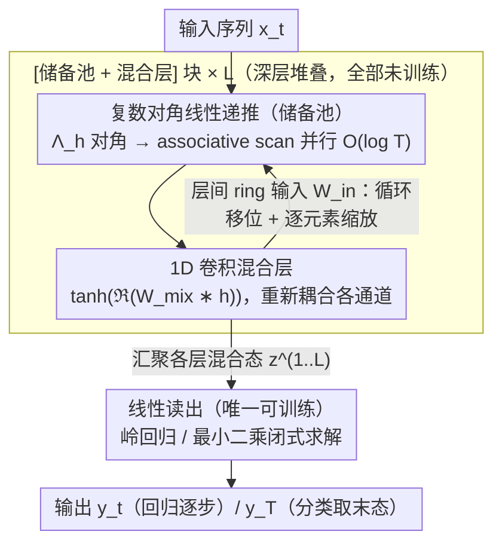

# ParalESN: Enabling Parallel Information Processing in Reservoir Computing

**会议**: ICML2026  
**arXiv**: [2601.22296](https://arxiv.org/abs/2601.22296)  
**代码**: https://github.com/nennomp/paralesn (有)  
**领域**: 序列建模 / 储备池计算 / 状态空间模型  
**关键词**: 回声状态网络, 线性循环, 并行扫描, 对角复数矩阵, 衰退记忆

## 一句话总结
将 LRU 风格的复数对角线性递推注入到 Echo State Network 的"未训练储备池"中，让传统 RC 的序列时间可并行化、维度可扩展到 10 万级，同时严格保持 Echo State Property 与衰退记忆滤波器的普适逼近性质。

## 研究背景与动机

**领域现状**：储备池计算（Reservoir Computing, RC）通过冻结一个高维随机非线性递推系统、只训练线性读出，规避了 RNN 训练中的梯度消失/爆炸问题，长期作为时序信号处理的轻量级方案存在。其代表 Echo State Network（ESN）依赖一个状态转移矩阵 $W_h$，初始化时把谱半径压在 1 以内即可触发 Echo State Property（ESP），保证状态最终只由输入决定。

**现有痛点**：传统 RC 有两条死结。第一条是**串行性**：状态更新 $h_t = (1-\tau)h_{t-1} + \tau\sigma(W_h h_{t-1} + W_{in} x_t)$ 必须沿时间逐步推进，无法在现代加速器上并行；这让训练时间随序列长度线性增长，对长序列任务几乎不可用。第二条是**显存爆炸**：稠密的 $W_h \in \mathbb{R}^{N_h \times N_h}$ 让储备池规模 $N_h$ 增大到 $10^5$ 量级时直接 OOM，而 RC 的能力本就高度依赖储备池维度。

**核心矛盾**：RC 的"动力学丰富性"来自 $W_h$ 的非线性激活复合，而"可并行 + 显存友好"则需要把递推退化成可关联扫描（associative scan）的结构化线性形式。这两件事在 ESN 经典框架里互相矛盾——一旦把 $\sigma$ 拿掉，先前的非线性表达力似乎也跟着消失。

**本文目标**：分解为三个子问题——(i) 设计一种结构化线性递推，使其能用 associative scan 并行；(ii) 证明这种线性储备池仍满足 ESP，并且与任意线性 ESN 等价表达；(iii) 在不牺牲精度的前提下把训练成本压低数个数量级。

**切入角度**：作者注意到，深度状态空间模型（S4、S5、Mamba）和 Linear Recurrent Unit（LRU）已经证明，**复数域对角线性递推 + 非线性读出**足以匹敌甚至超越传统 RNN/Transformer。同时，Grigoryeva 与 Ortega 的衰退记忆滤波器理论保证，只要读出层足够富有表达力，线性递推 ESN 即是普适逼近器。两件事拼在一起意味着：完全可以把 ESN 的"未训练高维递推"换成 LRU 风格的对角复数线性形式，把非线性留给一个共享的轻量混合层。

**核心 idea**：用复数对角线性递推 + ring 输入矩阵 + 1D 卷积混合层重构未训练储备池，使递推可并行扫描、显存随 $N_h$ 线性而非二次增长，并理论证明其 ESP 与表达力等价于经典 ESN。

## 方法详解

### 整体框架

ParalESN 把一个块拆成两段：(i) **储备池**——复数域线性递推，未训练；(ii) **混合层**——1D 卷积非线性，未训练；最后串一个**线性读出**作为唯一可训练组件。深层版本（ParalESN deep）把多个 [储备池 + 混合层] 块堆叠起来，每一层用 ring 拓扑输入矩阵接收前一层混合后的实值状态。整条链条只有最后一层做岭回归/最小二乘闭式求解。

形式上，第 $\ell$ 层第 $t$ 步的递推为：

$h^{(\ell)}_t = (1-\tau^{(\ell)}) h^{(\ell)}_{t-1} + \tau^{(\ell)}\left(\Lambda^{(\ell)}_h h^{(\ell)}_{t-1} + W^{(\ell)}_{in} z^{(\ell-1)}_t + b^{(\ell)}\right)$

其中 $\Lambda^{(\ell)}_h \in \mathbb{C}^{N_h \times N_h}$ 是**对角复数转移矩阵**，$h^{(\ell)}_t \in \mathbb{C}^{N_h}$，混合后 $z^{(\ell)}_t \in \mathbb{R}^{N_h}$。由于递推线性，泄漏系数可以吸收进等效转移矩阵 $\bar{\Lambda}^{(\ell)}_h = (1-\tau^{(\ell)})I + \tau^{(\ell)}\Lambda^{(\ell)}_h$，整段更新可写成 first-order 线性递推，符合 associative scan 的代数前提，时间复杂度从 $O(T)$ 降到 $O(\log T)$。读出层最终汇聚所有 $L$ 层的混合态 $z^{(1)}_t, \dots, z^{(L)}_t$。

### 关键设计

**1. 复数对角转移矩阵 + LRU 风格初始化：让递推既能并行又省显存**

传统 ESN 的痛点全在那个稠密随机 $W_h$ 上——它既逼着状态更新串行推进，又让显存随 $N_h^2$ 爆炸。ParalESN 把它换成对角矩阵 $\bar{\Lambda}_h = \text{diag}(\lambda_1, \dots, \lambda_{N_h})$，每个特征值 $\lambda_i = \rho_i e^{i\theta_i}$ 在初始化时直接采样模长 $\rho_i \sim \mathcal{U}[\rho_{min}, \rho_{max}]$ 与相位 $\theta_i \sim \mathcal{U}[\theta_{min}, \theta_{max}]$。这一步换来两件事：对角形式让谱半径直接等于最大模长 $\max_i |\lambda_i|$，于是 Echo State Property 的充要条件干脆退化成 $|\lambda_i| < 1$ ∀$i$；同时对角递推自然分解成 $N_h$ 个独立的标量一阶递推，每条都满足 associative scan 的可结合性，整段序列能在 $O(\log T)$ 时间内吃完，参数也只剩 $N_h$ 个而非 $N_h^2$。模长与相位解耦的参数化继承自 LRU，允许精细控制衰退记忆窗口与振荡频率。

**2. Ring 拓扑输入矩阵 + 卷积混合层：把通道重新耦合起来又不爆显存**

对角递推有个副作用——各通道独立演化，深层堆叠就等于一堆互不相干的通道，必须有个非线性机制把它们重新耦合。ParalESN 用两个稀疏结构同时解决"耦合"和"显存"：层间输入矩阵 $W^{(\ell>1)}_{in}$ 取环状结构，把输入向量循环移位一位再逐元素缩放，只需存 $N_h$ 个缩放系数，乘法等价于"shift + element-wise"，不必显式构造稠密矩阵；混合层 $f_{mix}$ 用一个共享的 1D 卷积核 $W^{(\ell)}_{mix} \in \mathbb{C}^k$（$k \ll N_h$）沿隐藏维度滑窗、取实部再施加 $\tanh$，参数量仅 $k+1$，与序列长度和隐藏大小都无关。正是这套"ring 输入 + 共享卷积核"让储备池能真正推到 $10^5$ 维。

**3. ESP 与普适性理论保证：证明对角约束不损失表达力**

把 RC 退化成线性递推，最核心的质疑就是"会不会丧失表达力"。论文用三层论证钉死这一点：定理 4.1 给出 ESP 的充要条件 $|\lambda_i| < 1$；命题 4.2 对任意 $W_h \in \mathbb{C}^{N_h \times N_h}$ 做对角化，证明它几乎处处可被某个 ParalESN 表示（特征值 + 重参数化的输入/读出权重）；最后借 Grigoryeva–Ortega 关于"线性储备池 + 非线性 MLP 读出"的普适性结论，把普适逼近性传递到 ParalESN。结论很干脆：对角约束只带来计算与显存优势，不带来表达力损失，这就是把 ParalESN 当作经典 ESN 直接替代品的理论凭据。

### 损失函数 / 训练策略

只有读出层可训。分类任务取最后时刻状态 $y = f_{readout}(z^{(1)}_T, \dots, z^{(L)}_T)$ 经岭回归一次性求解；回归任务则在每个时刻输出 $y_t$。无 BP、无梯度，整个模型一次前向 + 一次闭式求解即可训完。超参数包括每层的 $\rho_{min/max}$、$\theta_{min/max}$、$\tau$、输入尺度 $\omega_{in}$、卷积核尺寸 $k$，按层独立调。

## 实验关键数据

### 主实验

| 任务类型 | 数据集 | ParalESN | 传统 ESN/SOTA | 备注 |
|----------|--------|----------|--------------|------|
| 时序回归 | MemCap / ctXOR / Mackey-Glass | 与 ESN/Deep ESN/Res ESN 持平或更优 | 同档位 | 关键差距在效率 |
| 序列分类 | sMNIST（$N_h=10^5$） | 正常收敛 | 传统 ESN OOM | ParalESN 可塞入显存 |
| 长序列 | Long Range Arena (LRA) | 与全可训序列模型竞争 | — | 见附录 G |
| 复杂度 | seq len $4^4 \to 4^8$（128 神经元 5 层） | 时间随 $\log T$ 增长 | 传统 ESN 随 $T$ 线性增长 | 长序列下加速数量级 |

### 消融 / 关键比较

| 配置 | 储备池规模 | 显存表现 | 关键发现 |
|------|------------|----------|----------|
| 传统 ESN | $10^5$ 神经元 | OOM | 稠密 $W_h$ 显存爆炸 |
| ParalESN | $10^5$ 神经元 | 正常运行 | 对角 + ring 把显存压到线性 |
| ParalESN（浅层） | — | — | 显著优于 shallow ESN（统计显著） |
| ParalESN（深层） | — | — | 与 Deep ESN 性能持平，但递推速度接近单层 ESN |

### 关键发现
- **logarithmic vs linear**：在 5 层 128 神经元配置下，序列长度从 $4^4$ 增到 $4^8$，传统 ESN 递推时间线性增长，ParalESN 几乎只增 $\log T$ 倍——这是 associative scan 的直接收益
- **OOM 边界**：sMNIST 上把储备池推到约 10 万神经元，传统 ESN 直接显存溢出，而 ParalESN 仍能正常前向；这把 RC 的可扩展边界往上推了一个数量级
- **深层版本几乎免费**：Deep ParalESN 性能匹配 Deep ESN 但速度接近 single-layer ESN，意味着堆深度不再带来线性的额外延迟，深层 RC 的实用性被重新打开

## 亮点与洞察
- **理论桥梁**：用一个干净的对角化论证把"RC 经典 ESN"和"现代 SSM/LRU"接到同一框架下——之前 SSM 圈和 RC 圈基本独立演化，这篇论文展示了它们其实可以互相蚕食对方的工具箱
- **未训练 + 并行**：RC 流派最大的卖点是"训练成本几乎为零"，但此前一直被串行性拖累；ParalESN 把"无需 BP"和"associative scan 加速"叠在一起，得到了一个非常罕见的组合——零梯度训练 + GPU 友好
- **可迁移设计**：ring 拓扑输入矩阵 + 共享卷积混合层这一套显存压缩策略，对任何想把循环层推到极高隐藏维度（如长上下文 SSM、超大 RNN）都直接可用，不局限于 RC

## 局限与展望
- 当前混合层只是一个固定的随机卷积核，没有探索更复杂的耦合机制（如门控、注意力）；混合层的表达力可能是 ParalESN 与全可训模型在最难任务上仍存在差距的原因
- 实验主要在中小规模序列任务（LRA、sMNIST、时序回归），对真实大规模文本/语音/时间序列基础模型规模的验证缺失
- 复数域参数化虽然带来效率优势，但实现层面对工程化部署（量化、推理硬件）的影响未做系统分析；与 hardware-friendly RC（如光学 / 电子 reservoir）的结合是自然的下一步

## 相关工作与启发
- **vs 传统 ESN / Deep ESN / Res ESN**: 它们维持稠密非线性递推保证表达力，但训练串行 + 显存二次增长；ParalESN 用"对角线性 + 卷积混合"得到等价表达力且并行 + 线性显存
- **vs LRU / S4 / S5 / Mamba**: 这些模型对角线性递推 + 非线性读出在思想上同源，但都是全可训模型，需要 BPTT 优化复杂初始化（HiPPO 等）；ParalESN 把这一套搬到"完全未训练 + 闭式读出"的极简训练范式下
- **vs Structured RC / Simple Cycle Reservoir**: 早期结构化 RC 用 Hadamard、ring 等稀疏结构压缩 $W_h$，但仍是实数串行递推；ParalESN 通过复数对角化第一次让结构化 RC 同时享受并行性

## 评分
- 新颖性: ⭐⭐⭐⭐ 把 LRU 的对角复数递推嫁接到 RC，思路清晰但属于跨领域组合而非全新机制
- 实验充分度: ⭐⭐⭐⭐ 覆盖回归/分类/LRA + 复杂度曲线 + OOM 边界对比，理论与经验互相印证
- 写作质量: ⭐⭐⭐⭐ 动机、理论、架构图、复杂度分析层次分明，便于读者复现
- 价值: ⭐⭐⭐⭐ 为储备池计算提供了一条进入现代深度学习景观的可扩展路径，对硬件友好 RC 和长序列建模都有启发

<!-- RELATED:START -->

## 相关论文

- [\[ICML 2026\] Coupled Training with Privileged Information and Unlabeled Data](coupled_training_with_privileged_information_and_unlabeled_data.md)
- [\[ICML 2026\] Networked Information Aggregation for Binary Classification](networked_information_aggregation_for_binary_classification.md)
- [\[ICML 2026\] Structure-Induced Information for Rerooting Levin Tree Search](structure-induced_information_for_rerooting_levin_tree_search.md)
- [\[CVPR 2026\] MV-Fashion: Towards Enabling Virtual Try-On and Size Estimation with Multi-View Paired Data](../../CVPR2026/others/mv-fashion_towards_enabling_virtual_try-on_and_size_estimation_with_multi-view_p.md)
- [\[AAAI 2026\] ParaRevSNN: A Parallel Reversible Spiking Neural Network for Efficient Training and Inference](../../AAAI2026/others/pararevsnn_a_parallel_reversible_spiking_neural_network_for_efficient_training_a.md)

<!-- RELATED:END -->
