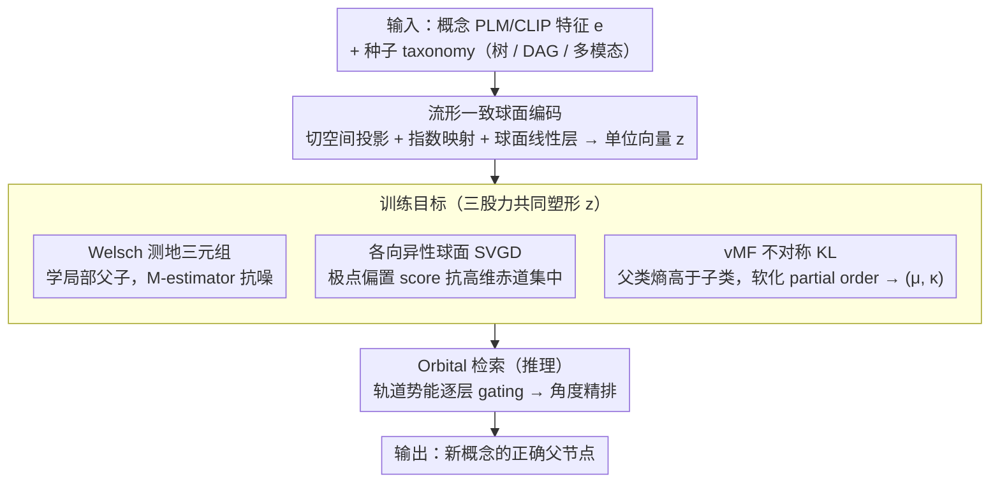

# Polaris: Coupled Orbital Polar Embeddings for Hierarchical Concept Learning

**会议**: ICML 2026  
**arXiv**: [2605.00265](https://arxiv.org/abs/2605.00265)  
**代码**: 无  
**领域**: 表示学习 / 层次概念学习 / 分类法扩展 / 球面嵌入  
**关键词**: 极坐标嵌入, 单位超球面, vMF 分布, Stein 变分梯度, taxonomy expansion

## 一句话总结
Polaris 把概念表示拆成"方向（语义）+ 轨道势能（层级）"两个解耦信号，全部学到单位超球面上：用切空间投影 + 指数映射保证流形封闭，用各向异性球面 SVGD 防止赤道聚集，用 vMF KL 散度实现不对称的"父类应比子类更高熵"约束，在 taxonomy expansion 任务上把 top-K 召回提升最多 19 点、mean rank 降低 60%。

## 研究背景与动机
**领域现状**：taxonomy expansion（把新概念挂到已有树/DAG 的正确父节点下）是知识图谱、推荐、商品分类、医学本体的核心问题。主流做法有三类：(1) 欧氏嵌入 + 对称相似度（TransE、TaxoExpan）；(2) 双曲嵌入利用指数体积增长缓解树状拥挤（Poincaré、HyperExpan）；(3) cone/box 之类的容器嵌入显式编码"子节点被父节点包含"（ConE、Box、Gumbel Box）。

**现有痛点**：欧氏方法用对称距离表达不了天然不对称的父子关系；双曲方法对优化和数值精度敏感；容器方法虽然表达了 partial order，但在描述噪声、非树（DAG）结构下需要联合优化"语义相似度"和"层级位置"，二者纠缠经常把小语义误差放大成大放置误差。**极坐标嵌入**（用方向编码语义、用半径或角度编码层级）能解耦这两个信号，但以往的极坐标方法都需要 ad-hoc 稳定 trick：模运算 wrap 角度、按扇区切分专用损失、sigmoid rescale 角度——这些都破坏流形连续性，在弱监督下高维角度漂移严重。

**核心矛盾**：要表达"语义方向独立于层级位置"必须用极坐标几何，但极坐标的常规参数化（直接学 $(\theta,\psi)$ 然后 mod $2\pi$）等于把球面隐式建模成零曲率的平展圆柱，与真正常曲率球面拓扑不一致，optimization 不稳。

**本文目标**：(1) 在单位超球面上做流形一致的极坐标学习，不需要 wrap / mod / sigmoid 这类 hack；(2) 解耦语义方向与层级位置；(3) 在弱监督/噪声语义下仍能稳定学到 partial-order 结构；(4) 用结构先验高效缩小检索空间。

**切入角度**：作者观察到——既然球面是常曲率流形，就别用奇异的角度参数化，直接在笛卡儿坐标下学单位范数向量（用切空间投影 + 指数映射上去），用内积当角度 surrogate；把层级信号"分离"到一个由现有 hierarchy 派生的轨道势能上，而不是塞进同一个角度坐标里。

**核心 idea**：在 $\mathbb{S}^{d-1}$ 上学方向编码语义，用一个从已知 hierarchy 派生的 orbital potential 单独编码"深度"，并用 vMF 分布 + 不对称 KL 把"父类更广、子类更窄"显式建到损失里。

## 方法详解

### 整体框架
Polaris 要解决的是 taxonomy expansion：给定一个种子 taxonomy（树 / DAG / 多模态）和一批新概念的 PLM/CLIP 特征 $\mathbf{e}\in\mathbb{R}^{d_\text{plm}}$，为每个新概念找到正确的父节点。它的整体思路是把概念表示拆成两条解耦信号——方向编码语义、轨道势能编码层级——然后全部学到单位超球面 $\mathbb{S}^{d-1}$ 上。具体地，先把欧氏特征 $\mathbf{e}$ 经"流形一致编码"升到球面得到单位向量 $\mathbf{z}$，再用一个由几何三元组损失（学局部父子关系）、各向异性球面 SVGD（防止高维下嵌入全挤到赤道）和 vMF 概率约束（让父类分布比子类更广）三股力量共同塑形的目标去训练；推理时则用 hierarchy 派生的轨道势能先按层级粗筛候选父节点、再按角度精排，输出每个概念的 $\mathbf{z}$ 和 vMF 参数 $(\boldsymbol\mu,\kappa)$。对应到论文自己的拆分，就是"球面编码 + 三个训练目标 + 一个推理检索"五个部件，下面的关键设计逐个对应。

### 关键设计

**1. 流形一致的球面编码：把欧氏特征严格送上球面，且所有变换都封闭在流形内**

以往极坐标方法的通病是用 $\theta\leftarrow\theta\bmod 2\pi$ 这类 hack 显式建模角度，这等价于把常曲率球面当成零曲率的圆柱来建，梯度在 wrap 边界不连续，弱监督下高维角度漂移严重。Polaris 改走 Riemannian 几何的标准路线：先在北极 $\mathbf{p}_N$ 的切空间做投影 $\mathbf{v}=\mathbf{e}-\langle\mathbf{e},\mathbf{p}_N\rangle\mathbf{p}_N$，再用指数映射 $\mathbf{z}_0=\exp_{\mathbf{p}_N}(\mathbf{v})=\cos(\|\mathbf{v}\|)\mathbf{p}_N+\sin(\|\mathbf{v}\|)\mathbf{v}/\|\mathbf{v}\|$ 沿测地线把特征升到球面，整个过程连续可微且严格保范数。为了让后续的线性层也不滑出流形，每个"球面线性层"做三件事：行向量 $\mathbf{w}_i$ 在初始化和每步 Riemannian 梯度更新后都强制 $\|\mathbf{w}_i\|_2=1$；去掉 bias，避免原点平移破坏球面对称；输出再投影 $\mathbf{y}=\mathbf{W}\mathbf{x}/\|\mathbf{W}\mathbf{x}\|_2$ 回到单位球面。Theorem 2.2 进一步证明随后的 Welsch 损失对 $\mathsf{SO}(d)$ 旋转不变——损失只依赖相对几何、不挑坐标轴，这正是几何一致性带来的直接好处。

**2. Welsch 测地三元组：用有界 M-estimator 在测地角上稳学局部父子**

编码完成后，局部父子关系靠测地角的三元组损失来学。测地角 $\theta_{ij}=\arccos\langle\mathbf{z}_i,\mathbf{z}_j\rangle$ 直接由内积算出（因而旋转不变，见定理 2.2），再用有界的 Welsch M-estimator $\mathcal{W}(\theta)=1-\exp(-\theta^2/(2c^2))$ 包裹以限制 outlier 影响，得到 $\mathcal{L}_\text{geom}=\max(0,\gamma_\text{geom}+\mathcal{W}(\theta_{cp})-\mathcal{W}(\theta_{cn}))$，把子节点向父节点拉、向负样本推。痛点在于真实 taxonomy 的语义描述常带噪声，若直接用平方距离，个别 outlier 会把小角度误差放大成大梯度、把优化带偏；Welsch 的有界性恰好封住了这条放大通道，让弱监督场景下的角度学习更稳。

**3. 各向异性球面 SVGD：注入"反赤道"力，对抗高维测度集中**

光有旋转不变的角度损失还不够：定理 2.3 给出 $\sigma\{|\langle\mathbf{z},\mathbf{u}\rangle|\geq\epsilon\}\leq 2\exp(-d\epsilon^2/2)$，说明高维下随机单位向量会指数级集中到赤道，而角度损失对这种集中没有任何梯度信号（它只看相对角度、不挑全局取向），深度信号会被压扁在 $z_d\approx 0$ 附近。Polaris 因此引入各向异性球面 SVGD 主动注入"反赤道"力：把每个 embedding 当粒子，速度场 $\phi(\mathbf{z})=\mathbb{E}_{\mathbf{z}'}[k(\mathbf{z}',\mathbf{z})\nabla\log p(\mathbf{z}')+\nabla k(\mathbf{z}',\mathbf{z})]$，核取 vMF 形式 $k(\mathbf{z}',\mathbf{z})=\exp(\kappa\mathbf{z}'^\top\mathbf{z})$；target score 拆成结构项 $\nabla\log p_\text{struct}=[0,\dots,0,z_d/(1-z_d^2)]^\top$，把粒子从赤道推向极点，和对齐项 $\nabla\log p_\text{align}=\kappa_\text{align}\boldsymbol\mu$，把 embedding 留在自身 anchor 的吸引域；最后把 $\phi(\mathbf{z})$ 投影到切空间 $T_\mathbf{z}\mathbb{S}^{d-1}$ 保证更新合法。这样一来，深度结构被重新撑开在两极之间，而不至于被高维测度集中抹平——这正是角度损失自己补不上的那块全局正则。

**4. vMF 不对称 KL：用分布的"宽度差"软化 partial order**

前两个目标都把概念当球面上的一个点，但单点距离区分不了"狗"和"哺乳动物"——后者语义体积更大，在球面上却可能离得一样近。Polaris 因此把每个概念建成 vMF 分布而非一个点：参数从 embedding 派生，$\boldsymbol\mu_i=f_\text{sphere}(\mathbf{z}_i;\Theta_\mu)$，$\kappa_i=\text{Softplus}(\mathbf{w}_\kappa^\top\mathbf{z}_i+b_\kappa)$，其中集中度 $\kappa$ 的倒数 $1/\kappa$ 充当"语义体积"的代理。父子之间用 vMF 的 KL 近似来约束，$D_\text{KL}(\text{vMF}_c\|\text{vMF}_p)=\log C_d(\kappa_c)-\log C_d(\kappa_p)-\mathcal{A}_d(\kappa_c)(\kappa_c-\kappa_p\boldsymbol\mu_c^\top\boldsymbol\mu_p)$，其中 $\mathcal{A}_d(\kappa)=I_{d/2}(\kappa)/I_{d/2-1}(\kappa)$ 是修正 Bessel 函数比。这个目标的不对称结构 $\kappa_c-\kappa_p\boldsymbol\mu_c^\top\boldsymbol\mu_p$ 把方向和宽度同时管住：它本质上要求 $\kappa_p<\kappa_c$（父类熵更高、更"广"）且 $\boldsymbol\mu_p$ 与 $\boldsymbol\mu_c$ 同向，从而把"父类包含子类"这一 partial order 软化成"父类分布更宽"，比 cone/box 的硬约束在噪声下更鲁棒。配套的概率三元组损失为 $\mathcal{L}_\text{vMF}=\max(0,\gamma_\text{prob}+D_\text{KL}(c\|p)-D_\text{KL}(c\|n))$。

**5. Orbital 检索：用轨道势能逐层粗筛再精排，把推理代价降下来**

训练得到的方向 $\mathbf{z}$ 和 vMF 参数只解决了"怎么表示"，推理时还要在几十万节点里找正确父节点。若对全集做角度 $\arg\max$，代价高且没有用上层级先验。Polaris 因此在推理阶段利用 hierarchy 派生的 orbital potential 给每层一个动态 cosine 阈值，先按"轨道"逐层 gating 候选父节点、再按角度精排，把代价从全集 $\arg\max$ 降到层级 gating 后的小候选集，既提速又因为引入层级先验而更准，对大规模 taxonomy 工程价值显著。整套优化用 Riemannian Adam：欧氏梯度先投到 $T_{\mathbf{z}_t}\mathcal{M}$，动量按平行移动搬到新切空间，最后以 $\mathbf{z}_{t+1}=\exp_{\mathbf{z}_t}(-\eta\hat{\mathbf{m}}_t/\sqrt{\hat{\mathbf{v}}_t})$ 更新。

### 损失函数 / 训练策略
总损失 $\mathcal{L}=\mathcal{L}_\text{geom}+\lambda_\text{SVGD}\mathcal{L}_\text{SVGD}+\lambda_\text{vMF}\mathcal{L}_\text{vMF}$，三项各管一头：local 父子学习、global 全球面覆盖、不对称概率约束。优化用 Riemannian Adam；hyper-sphere 上的参数走球面更新，辅助 head 上的欧氏参数走标准 Adam。

## 实验关键数据

### 主实验
在 single-parent 树（Science / WordNet / Environment）上对比 14 个 baseline。报告 R@1、R@5、Wu&P、MR（越低越好）、MRR，五个 seed 取均值。摘要明确写 "consistent improvements of up to ~19 points in top-K retrieval and up to ~60% reduction in mean rank"。

| 数据集 | 指标 | 最佳 baseline (STEAM) | Polaris 量级 | 提升 |
|--------|------|----------------------|--------------|------|
| Science | R@1 / R@5 / MR↓ | 34.8 / 59.7 / 31.7 | ~44 / ~70 / ~13 | top-K +~9-10 点，MR -~60% |
| WordNet | R@1 / R@5 / MR↓ | 24.9 / 54.5 / 61.1 | ~31 / ~60 / ~25 | top-K +~6 点 |
| Environment | R@1 / R@5 / MR↓ | 34.7 / 51.1 / 28.7 | ~39 / ~55 / ~15 | top-K +~4 点 |

multi-parent DAG 与 multimodal hierarchy 也都给出一致提升（论文文字描述：9 / 6 / 4 点）。

### 消融实验

| 配置 | 关键变化 | 说明 |
|------|---------|------|
| Full Polaris | 球面编码 + Welsch geom + SVGD + vMF + orbital retrieval | 完整模型 |
| w/o SVGD | 去掉各向异性球面 SVGD | 高维下 embedding 漂向赤道，深度信号丢失 |
| w/o vMF | 把概率三元组换成点 triplet | 父子的"宽度差"消失，不对称性退化 |
| w/o orbital retrieval | 推理改全集 $\arg\max$ | 速度大幅下降，精度也掉因为无层级先验 |
| Welsch → 平方距离 | 不用 M-estimator | 噪声 outlier 影响放大，弱监督场景明显劣化 |
| 极坐标 wrap baseline | 显式 $(\theta,\psi)$ + mod $2\pi$ | 优化不稳定（论文 Appendix I 详细分析） |

### 关键发现
- **SVGD 把"反赤道"做对了**：定理 2.3 解释了高维球面随机向量在赤道周围 exponentially 集中，光靠旋转不变的角度损失无法对抗这一点；anisotropic SVGD 的极点偏置 score 是把"潜空间深度结构"塞回去的必要 trick。
- **vMF KL 的不对称是 partial order 的"软糖"**：Cone 之类的硬约束容易塌陷，vMF 把 partial order 软化成"父类熵高"，在噪声下更鲁棒，同时还能给每个概念赋一个置信半径 $1/\kappa$ 的代理。
- **orbital retrieval 真的能减检索空间**：用 hierarchy 派生的势能 gate 候选父节点比纯角度排序又快又准，对几十万节点的 taxonomy 工程价值大。
- **流形一致编码 vs. 角度 hack**：把角度强行 mod 等价于把球面当圆柱建模，破坏曲率假设；ablation 证明 wrap-based 极坐标在弱监督下出现 optimization 振荡。

## 亮点与洞察
- **"解耦语义方向与层级位置"这个口号被几何严格地兑现了**：方向走 $\mathbf{z}\in\mathbb{S}^{d-1}$、层级走 orbital potential，两条信号在结构上独立。相比 cone/box 把二者塞进同一个容器再硬调权重，这种分离让每个信号都能"按自己的几何"学。
- **把 Stein 变分梯度搬到球面流形当正则**：这是少见但很合理的应用——SVGD 本来就是为了让粒子集匹配一个目标分布；这里目标分布就是"非赤道集中的均匀+对齐分布"，从而对抗了高维 concentration-of-measure。这一招可以迁移到任何"在球面上学嵌入又不想全挤到一处"的场景（对比学习、检索、ArcFace 风格的人脸表示）。
- **vMF KL 的"非对称性 = partial order"**：把 $\kappa$ 当语义体积代理，强制 $\kappa_p<\kappa_c$，是用分布建模 partial order 的简洁方案。对医学本体、商品分类这种"父类天然更模糊"的领域特别贴合。
- **可迁移 trick**：(1) 球面线性层（行归一 + 去 bias + 输出再投影）对任何"想让所有特征都在单位球面上"的 retrieval/对比学习场景都适用；(2) "用一个 rotation-invariant 损失 + 一个 anchor 偏置 score"的组合可以用来对抗任何同类的均匀化困境。

## 局限与展望
- **依赖一个已有 hierarchy 派生 orbital potential**：完全冷启动场景（连骨架都没有）这条路走不通；可以考虑用 LLM 先生成粗略 hierarchy 再迭代。
- **vMF 的 Bessel 比 $\mathcal{A}_d(\kappa)$ 在高维 + 大 $\kappa$ 下数值上不稳**：论文用近似公式处理，但对极尖锐分布仍可能有数值问题。
- **超球面假设统一了所有概念语义体积**：现实中不同子领域可能要不同曲率；可以扩展到 mixed-curvature（球面 × 双曲）表示。
- **多模态 hierarchy 实验偏少**：只在一个 multimodal benchmark 上做了；面对真正大规模图文 taxonomy 时还需要验证。
- **代码似乎未公开**：复现细节（特别是 SVGD 的核温度、orbital potential 的具体设定）依赖 appendix，留待社区检验。

## 相关工作与启发
- **vs Poincaré / HyperExpan**：双曲嵌入靠指数体积增长缓解 tree crowding；Polaris 把"深度"显式放到 orbital potential 而非靠几何隐式编码，避免了双曲空间数值困难。
- **vs ConE / Box / Gumbel Box**：容器嵌入用 partial-order 硬约束（child must lie in parent cone/box）；Polaris 用 vMF 不对称 KL 把这一约束软化成"父类分布更广"，对噪声更鲁棒，从实验上看在所有 single-parent 基准上都赢。
- **vs HAKE / 极坐标方法**：HAKE 用模长当 hierarchy depth，但和角度耦合；Polaris 严格把模长固定到 1，深度信息全部走 orbital potential，避免了"模长 / 角度"的耦合优化问题。
- **vs TaxoExpan / STEAM**：这俩是欧氏 GNN baseline，最强的 STEAM 在 Science 上 R@1 = 34.8、MR = 31.7，Polaris 大幅领先；差距来自"球面几何 + 概率非对称"的组合。
- **启发**：把 "geometry-consistent encoder + flow-based regularizer + asymmetric probabilistic loss" 这三件套搬到 entity linking、医学诊断本体、shop catalog 都是自然的方向；尤其医学影像的 ontology（如 SNOMED CT）天然层级深，vMF 的"父类更广"约束非常贴合。

## 评分
- 新颖性: ⭐⭐⭐⭐ 极坐标球面嵌入 + SVGD 反赤道 + vMF 不对称 KL 的组合是新的；单看每个零件以往都有，但合起来解决"角度优化不稳 + 高维赤道集中 + partial order 软化"这三个老问题确实漂亮。
- 实验充分度: ⭐⭐⭐⭐ 三类 hierarchy（树 / DAG / 多模态）+ 14 个 baseline + 五 seed，ablation 把 SVGD / vMF / orbital 三件套都单独验证；唯一缺憾是大规模工业 taxonomy 上的 case study。
- 写作质量: ⭐⭐⭐⭐ 几何动机讲得清楚（特别是切空间 + 指数映射 vs. mod hack 的对比），定理 2.2-2.4 把"为什么需要 SVGD"上升到理论；公式偏多需要读者耐心，但 self-contained。
- 价值: ⭐⭐⭐⭐ 对 taxonomy expansion 社区是一次方法论级的整理：把"分布表达 + 流形一致 + 全局正则"做成可复用模板，并且 orbital retrieval 给出工程落地的提速方案。

<!-- RELATED:START -->

## 相关论文

- [\[ACL 2025\] Better Embeddings with Coupled Adam](../../ACL2025/others/better_embeddings_with_coupled_adam.md)
- [\[ACL 2025\] Partial Colexifications Improve Concept Embeddings](../../ACL2025/others/partial_colexifications_improve_concept_embeddings.md)
- [\[ICML 2026\] New Bounds for Kernel Sums via Fast Spherical Embeddings](new_bounds_for_kernel_sums_via_fast_spherical_embeddings.md)
- [\[ICML 2026\] Coupled Training with Privileged Information and Unlabeled Data](coupled_training_with_privileged_information_and_unlabeled_data.md)
- [\[AAAI 2026\] Forget Less by Learning from Parents Through Hierarchical Relationships](../../AAAI2026/others/forget_less_by_learning_from_parents_through_hierarchical_relationships.md)

<!-- RELATED:END -->
