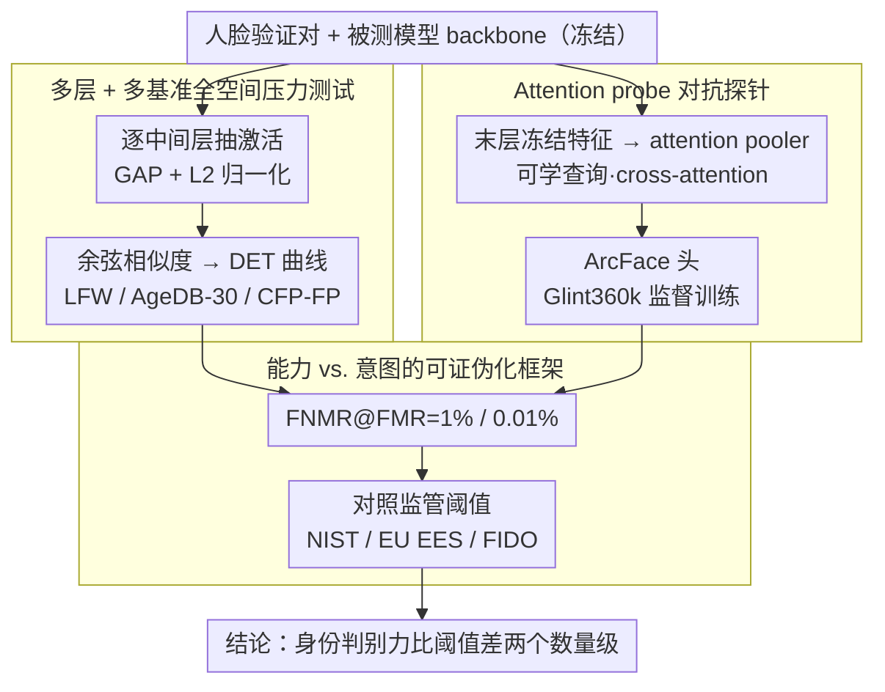

# Position: Age Estimation Models Do Not Process Biometric Data

**会议**: ICML 2026  
**arXiv**: [2605.17347](https://arxiv.org/abs/2605.17347)  
**代码**: 暂无  
**领域**: AI安全 / AI 治理 / 人脸分析  
**关键词**: Biometric Data, Age Estimation, GDPR, Face Verification, AI Regulation  

## 一句话总结
本文是一篇 position paper，用 14 个模型 × 3 个人脸验证基准的实证证据论证：人脸年龄估计模型在身份判别能力上比监管阈值低两个数量级，因此不应被自动归类为 GDPR / BIPA / EU AI Act 意义上的"生物特征数据处理"。

## 研究背景与动机

**领域现状**：当一个神经网络从人脸照片估计年龄时，它到底"处理"了生物特征数据 (biometric data) 吗？这不是哲学问题——它直接决定了运营方是否要在 GDPR 第 9 条下取得明示同意、是否在伊利诺伊 BIPA 下每次违规面临 $1,000–$5,000 法定赔偿、是否在 EU AI Act 下被划为"高风险 AI"。GDPR 第 4(14) 条定义生物特征数据为"允许或确认"自然人唯一识别的数据，第 9 条又加了"以唯一识别为目的"的限制；BIPA 走能力路线（只要提取面部几何就算），EU AI Act 又另起一套定义。

**现有痛点**：监管侧并没有给出统一答案。英国 ICO 在 Yoti 沙盒里说人脸年龄估计不构成"特殊类别数据"，但 2024 年指南又承认"即使不是你的本意，只要能识别就可能算"；EDPB 2019 的视频指南为"只做分类、不生成识别模板"的系统开了豁免口子，但 2022 年人脸识别指南把口子收窄了。法律界用的判定标准不统一，工程界面对的是"功能能力 (capability)" 还是"使用意图 (purpose)" 之争。

**核心矛盾**：在前向传播过程中确实产生了中间表征，这些表征瞬时存在、不输出、不储存，但理论上可能"编码了身份判别信息"。如果按能力派解释，凡是中间张量"可能编码身份"的系统都成了生物特征处理；如果按意图派解释，年龄估计因为目的不是识别就完全豁免。两派都有合理性，但都缺数据。

**本文目标**：用实证回答"年龄估计模型在功能上是否具备唯一识别能力"，把可经验测量的部分从法学辩论中剥离出来。

**切入角度**：作者引用 ICO 自己的精确表述——"unique identification 需要以精度准确地单挑出某人"——指出这个精度是可量化的，于是把"是否生物特征"转化为"在人脸验证基准上的 FNMR@FMR 是否达到监管阈值"。

**核心 idea**：评测 14 个模型 (4 个真年龄估计器 + 多个其他属性 + 1 个 ArcFace 基线 + 3 个通用视觉模型) 在 LFW / AgeDB-30 / CFP-FP 上的验证表现，对比 NIST SP 800-63-4、EU EES、FIDO 三套监管阈值；并加一个"对抗式"二级实验——用 attention probe 在冻结特征上重训人脸识别头，逼出特征中潜在的识别力。

## 方法详解

### 整体框架

把每个被测模型 $M$ 看作特征提取器，对人脸图像 $x$ 抽出某一中间层激活，做 global average pooling + L2 归一化得到嵌入 $e(x)$；对验证对 $(x_a,x_b)$ 计算余弦相似度 $s = \langle e(x_a), e(x_b) \rangle$；对 6,000 对评测对画 DET 曲线，报告固定误匹配率 $\text{FMR}$ 下的漏匹配率 $\text{FNMR}$。主报告 $\text{FNMR}@\text{FMR}=1\%$（统计可靠），辅助报告 $\text{FNMR}@\text{FMR}=0.01\%$（监管参照）。所有评测对每个模型的每一层都跑一遍，画"FNMR vs. 网络深度"曲线，证明"任何层都不行"，避免被反驳"也许更早/更晚的层才编码身份"。

整套评测分两条互补支路：① **读取实验**——就用上面这套 average pooling 直接测特征里"现成可读"的身份泄露；② **对抗探针**——在冻结特征上重训一个 attention pooler + ArcFace 头，逼出特征里"理论上限"的身份信息。两条支路得到的 $\text{FNMR}@\text{FMR}$ 最终统一对照 NIST / EU EES / FIDO 三套监管阈值，看是否够得上"可用识别"水平。

### 关键设计

**1. 能力 vs. 意图的可证伪化框架：把法律二元问题转成 FNMR@FMR 的连续量化**

监管争论卡在"中间表征是否可能识别"这种二元、不可测的问题上，本文的第一步是把它翻译成一个能测的连续量。参照 ISO/IEC 19795 的 1:1 验证术语——FMR 是不同人被错判为同人的比例（安全性），FNMR 是同一人被错判为不同人的比例（可用性）——再把三套监管阈值摆到一起：NIST SP 800-63-4 IAL2 要 $\text{FMR}\le 0.01\%$ 且 $\text{FNMR}<5\%$，EU EES 要 $\text{FMR}=0.05\%$ 且 $\text{FNMR}<1\%$，FIDO 要 $\text{FMR}\le 0.01\%$ 且 $\text{FNMR}<5\%$。于是命题变成可证伪的：当一个模型连在 LFW（最简单的 in-the-wild 基准）上都比这些阈值差两个数量级时，几乎可以排除它具备"可用的识别能力"。这一步的关键是把测试目标精确对齐到监管侧真正担心的东西——ICO 自己写的"with accuracy, with a level of precision 单挑某人"——而不是"特征里有没有可能残留信息"，从而让结论能被监管直接采纳。

**2. 多层 + 多基准的"全空间"压力测试：堵住所有"也许某层某基准其实能识别"的反驳通道**

position paper 最大的风险是被一句"那是你测得不够"反驳，所以本文刻意把测试铺满。对每个模型抽 4–N 个中间层而非只看末层，画"FNMR vs 网络深度"曲线证明任何层都不行；同时选三个互补难度的基准：LFW（in-the-wild，易）→ AgeDB-30（同一人 30 年跨度）→ CFP-FP（正脸 vs 侧脸）。其中 AgeDB-30 是设计精髓——如果年龄估计模型真的"顺带学到了身份"，跨年龄识别正该是它的潜在长板；结果恰恰相反，年龄估计模型在 AgeDB-30 上反而最差（96–98% FNMR），说明为年龄优化得到的特征与身份特征近乎正交，而不是隐含 leak 了身份。这个反向证据几乎杜绝了"年龄模型暗藏识别力"的猜想。

**3. Attention probe：对抗式上界估计，检验"身份信息只是被摊平了"**

读取实验（average pooling）只能说明现实泄露，但反方还能争"也许身份信息存在于特征里，只是被池化摊平了"。为堵这个口，本文加一个对抗探针：冻住被测模型 backbone 的末层特征，挂一个 attention pooler（用可学查询通过 cross-attention 聚合特征 tokens），再接 ArcFace 头在 Glint360k 上训练。这已经不是原来的年龄估计器，而是一个以其特征为输入、专门为识别新建的系统；如果连它都识别不好，就说明特征本身缺少可被合理探出的身份信息。结果是：商用年龄估计器在 LFW 上 FNMR 从 27% 降到 2%（看着可观），但 AgeDB-30 上仍有 67%、CFP-FP 上仍有 28%，远不及 ArcFace 的 2.4% / 1.2%。读取实验测现实泄露、对抗探针测特征理论上限，两层一起把结论从"现在不会"加强到"理论也很难"。

### 损失函数 / 训练策略

无监督评测部分无损失。Attention probe 用 ArcFace loss $\mathcal{L} = -\log \frac{e^{s\cos(\theta_y+m)}}{e^{s\cos(\theta_y+m)} + \sum_{j\ne y}e^{s\cos\theta_j}}$ 在 Glint360k 上微调 pooler 与 projection 头，backbone 全冻；评测对每个模型的每一层报告 $\text{FNMR}@\text{FMR}=1\%$ 与 $\text{FNMR}@\text{FMR}=0.01\%$ 两档。

## 实验关键数据

### 主实验：14 个模型在 LFW 上的验证能力

ImageNet-style 截取数据集 LFW，主报告 $\text{FNMR}@\text{FMR}=1\%$，下表抽取代表性模型：

| 模型 | 类型 | LFW @1% (%) | LFW @.01% (%) | 与 ArcFace 差距 |
|------|------|-------------|---------------|------------------|
| ArcFace (ResNet-100) | 真识别 | 0.23 | 0.3 | 1× |
| Commercial age estimator | 年龄估计 | 26.8 | 63.7 | ~100× |
| FairFace age+gender+race | 年龄属性 | 57.4 | 85.8 | ~250× |
| Age+gender ViT | 年龄属性 | 67.3 | 87.5 | ~290× |
| Age estimation PyTorch | 年龄估计 | 94.6 | 99.7 | ~410× |
| SSR-Net | 紧凑年龄估计 | 95.0 | 99.4 | ~410× |
| DINOv3 (通用视觉) | 自监督 | 37.5 | 70.7 | 仅作参照 |

最强年龄估计器 (Commercial) 的 27% FNMR 已经比 FIDO/NIST 的 5% FNMR 要求高 5 倍以上；最弱的 SSR-Net 几乎等同于随机分类。监管阈值在 FMR=0.01% 处所有年龄估计模型 FNMR 都在 64%–99% 之间。

### 二级实验：Attention probe 加持后

冻结特征 + ArcFace 头在 Glint360k 上训练，最佳层结果对比：

| 模型 | LFW (前 → 后) | AgeDB-30 (前 → 后) | CFP-FP (前 → 后) |
|------|---------------|---------------------|-------------------|
| ArcFace | 0.23 | 2.4 | 1.2 |
| Commercial age estimator | 27 → 2 | 97 → 67 | 80 → 28 |
| Perception Encoder | 21 → 3 | 98 → 73 | 80 → 33 |
| DINOv3 | 37 → 3 | 96 → 68 | 81 → 36 |
| FairFace age+gender+race | 57 → 20 | 98 → 97 | — |

**关键发现**：

- **年龄估计 ≠ 残留身份**：年龄估计模型在跨年龄的 AgeDB-30 上反而最差 (96–98% FNMR)，说明优化年龄学到的特征与身份判别特征本质正交，而不是"顺带学了点身份"。
- **任何层都不达标**：FNMR vs. 深度曲线表明所有年龄估计模型从早期层 ~95% FNMR 缓慢下降到末层 27–95%，最佳层与 NIST 5% 阈值仍隔两个数量级。
- **对抗式探针仍救不回来**：即便用 Glint360k 的身份监督逼出特征中的身份信号，年龄估计模型在 AgeDB-30 上仍有 67% FNMR；在 FMR=0.01% 下最强探针在 LFW/AgeDB-30/CFP-FP 上仍 17/91/68%，远不及监管识别系统。
- **通用视觉模型可比年龄估计器强**：DINOv3、Perception Encoder 在 LFW @1% 上 21–37% FNMR，比部分年龄估计器更接近识别，凸显"自监督的通用表征 vs. 任务特化的年龄表征"在身份信息保留上的差异——这意味着监管不能仅按"是否处理人脸"划线。

## 亮点与洞察
- **把法学不确定性翻译成 ML 可证伪命题**：position paper 最容易写成纯思辨，本文用 ISO 19795 的量化指标 + 14×3 的网格实验把"功能能力"做成可重复实验，是少见的"立场 + 实证"双轮驱动论文，可作为未来 AI 治理类研究的范式。
- **AgeDB-30 这个反向证据特别巧**：直觉上同一人跨年龄正是年龄估计模型的"主场"，如果它真有副作用地学了身份，这里应当占优。结果反而最差，是一个非常硬的反例，几乎杜绝了"年龄模型隐含 leak 身份"的猜想。
- **Attention probe 作为"上界探测"是范式贡献**：未来评估任何"系统是否具备某能力 X"的位置文章都可以借鉴这个两层结构（读取实验测现实泄露 + 对抗探针测特征上限），把结论从"现在不会"加强为"理论也很难"。

## 局限与展望
- **作者隶属利益相关方需透明**：作者来自 Sumsub，该公司的商业年龄估计器也是 14 个被测模型之一，且确实是表现最强的；尽管声明仅代表个人观点、且使用了公开评测，但读者仍需对结论的潜在偏向保持警惕。
- **结论受限于 ViT/CNN 主流架构**：14 个模型几乎全是当前公开常见的 backbone，对未来更大规模或多模态的年龄估计器是否依然结论成立没有保证；尤其大规模视觉-语言基础模型可能在年龄微调后仍保有显著的通用身份能力。
- **法律层面仅给"经验输入"**：作者明确说自己不解决法律问题，但 BIPA 是"提取面部几何即触发"的能力路线，本文的"功能上不识别"无法回应——这意味着即便经验证据再硬，BIPA 司法管辖区仍可能把年龄估计列入监管。
- **LFW 等基准本身偏 anglosphere 公众人物**：基准的人口分布偏差可能让某些少数群体的实际身份识别风险被低估，监管视角下的"公平性 25% within-group" 条款没有被深究。

## 相关工作与启发
- **vs ICO Yoti Sandbox (2022) 报告**: ICO 只回答了"用途不是识别 → 不构成 Article 9 特殊类别数据"，明确把"是否构成 Article 4(14) 生物特征数据"留空；本文正面承接了这个空缺，并给出 ICO 自己"with accuracy, with precision"标准下的量化检验。
- **vs Clearview AI 案例 (Garante 2022, CNIL 2022)**: 这些案例证实存储型人脸 embedding 是生物特征数据；本文区分了"瞬时中间表征 + 不存储 + 无识别能力"与"存储型识别模板"，论证两者不应同等监管，为"transient processing"在条款层面争取一个独立类别。
- **vs EDPB Guidelines 3/2019 (分类豁免)**: EDPB 已经在原则上为"只做属性分类、不生成识别模板"的系统开了豁免口；本文相当于为这个豁免补上了 ML 可验证的判定标准，使其能在 2022 facial recognition 指南收紧之后仍然站住脚。

<!-- RELATED:START -->

## 相关论文

- [\[AAAI 2026\] Reward Redistribution via Gaussian Process Likelihood Estimation](../../AAAI2026/others/reward_redistribution_via_gaussian_process_likelihood_estimation.md)
- [\[ACL 2025\] Do not Abstain! Identify and Solve the Uncertainty](../../ACL2025/others/do_not_abstain_identify_and_solve_the_uncertainty.md)
- [\[CVPR 2026\] Do Vision Models Perceive Illusory Motion in Static Images Like Humans?](../../CVPR2026/others/do_vision_models_perceive_illusory_motion_in_static_images_like_humans.md)
- [\[ICML 2026\] Amortized Simulation-Based Inference in Generalized Bayes via Neural Posterior Estimation](amortized_simulation-based_inference_in_generalized_bayes_via_neural_posterior_e.md)
- [\[ICML 2026\] Cascaded Flow Matching for Heterogeneous Tabular Data with Mixed-Type Features](cascaded_flow_matching_for_heterogeneous_tabular_data_with_mixed-type_features.md)

<!-- RELATED:END -->
