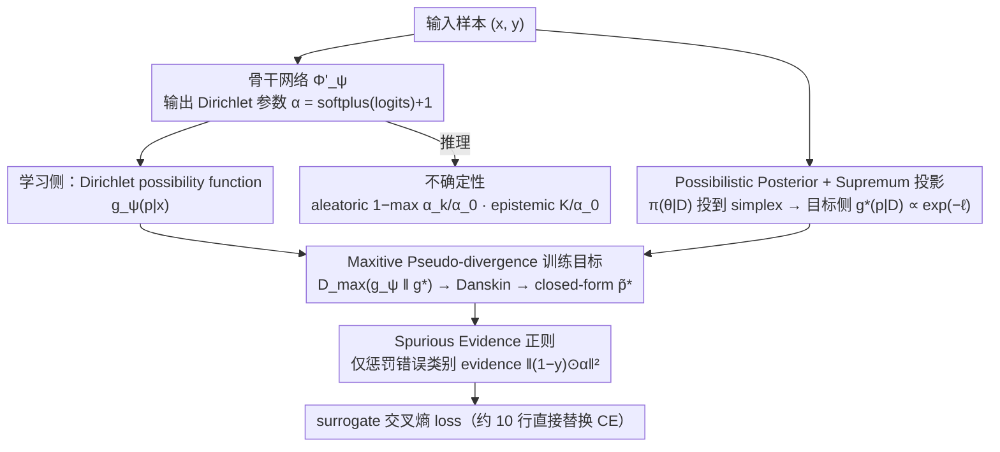

# Possibilistic Predictive Uncertainty for Deep Learning

**会议**: ICML 2026  
**arXiv**: [2605.00600](https://arxiv.org/abs/2605.00600)  
**代码**: https://github.com/MaxwellYaoNi/DAPPr  
**关键词**: 认知不确定性、可能性理论、Dirichlet、second-order predictor、EDL

## 一句话总结
本文用 possibility theory 替代 Bayes 概率框架，提出 DAPPr——把参数空间的 possibilistic 后验通过 supremum 投影到预测空间，再用可学习的 Dirichlet possibility function 拟合，最终得到一个仅 10 行代码、可直接替换交叉熵、且在 OOD 检测上超越 EDL 家族的认知不确定性建模方法。

## 研究背景与动机
**领域现状**：深度网络在分布外样本上 overconfident 是众所周知的痛点，目前主流认知不确定性建模分两条路：Bayesian deep learning（BNN / MC Dropout / Deep Ensemble），以及 second-order predictor（EDL / PostNet / Prior Networks）。

**现有痛点**：Bayesian 路线理论严谨但要在高维参数空间做后验边缘化，计算昂贵且难 scale；second-order predictor 高效但 objective 多是启发式的，缺乏从概率公理出发的严格推导。EDL 甚至已经被指出存在 "数据越多不确定性越高" 的病态行为。

**核心矛盾**：理论严谨与计算可行之间存在 trade-off——Bayes 严谨但贵，second-order 便宜但 ad hoc。作者认为根本原因是大家都把 epistemic uncertainty 当作 probability 处理，而概率分布的 "sum to 1" 约束本来就更适合刻画 aleatoric 随机性，不适合刻画 "无知"。

**本文目标**：(1) 找一个严谨但不需要参数空间积分的不确定性表示框架；(2) 推导出有 closed-form 的训练目标；(3) 在标准 benchmark 上与 EDL 家族正面对比。

**切入角度**：作者从 1978 年 Zadeh 提出但深度学习里几乎被忽视的 possibility theory 出发——它用 supremum 替代 integration、用 max-normalization 替代 sum-to-1，天然适合表达 "哪些假设不能被排除" 这种认知信息。

**核心 idea**：把模型参数的 possibilistic posterior 通过 supremum 投影到 simplex 上，再用 Dirichlet possibility function 在 simplex 上做参数化逼近，整个 pipeline 用 cross-entropy 就能 close 出 closed-form 解。

## 方法详解
DAPPr 的优雅之处在于：一个本来需要在高维参数空间做约束优化的 "投影后验"，通过 over-parameterized assumption + Dirichlet 参数化 + Danskin 定理三件套，被压缩成 10 行 PyTorch 代码。

### 整体框架
输入是普通分类样本 $(\bm{x}, \bm{y})$；模型 $\Phi'_{\bm{\psi}}$ 输出 Dirichlet 参数 $\bm{\alpha} = \mathrm{softplus}(\mathrm{logits}) + 1$，由此定义一个**学习侧**的 Dirichlet possibility function $g_{\bm{\psi}}(\bm{p}|\bm{x})$。训练的核心是个"对齐"问题：另起一条**目标侧**支路，把参数空间的 possibilistic 后验 $\pi(\bm{\theta}|\mathcal{D})$ 经 supremum 投影到 simplex 得到投影后验 $g^*_{\bm{x}}(\bm{p}|\mathcal{D}) \propto \exp(-\ell)$，再用 maxitive pseudo-divergence 把学习侧 $g_{\bm{\psi}}$ 逼近目标侧 $g^*$。这个 min-max 目标经 Danskin 定理 + Dirichlet 参数化在 cross-entropy 下塌缩成 closed-form 的 surrogate loss，外加一个 spurious evidence 正则。推理时直接用 $\bm{\alpha}$：$1 - \max_k \alpha_k / \alpha_0$ 算 aleatoric uncertainty、$K / \alpha_0$ 算 epistemic uncertainty（$\alpha_0 = \sum_k \alpha_k$ 即总 evidence）。

### 关键设计

**1. Possibilistic Posterior + Supremum 投影：把昂贵的参数空间积分换成约束优化**

Bayesian 方法贵就贵在要对高维参数空间做 marginalization 积分。possibility theory 的本质差异是用 supremum 替代 integration：在均匀先验下定义参数空间 possibilistic posterior $\pi(\bm{\theta}|\mathcal{D}) = \exp(-L(\bm{\theta};\mathcal{D})) / \sup_{\bm{\theta}'}\exp(-L(\bm{\theta}';\mathcal{D}))$，loss 越小 plausibility 越高；再用 possibilistic change-of-variable 把它投到 simplex 上：$g^*_{\bm{x}}(\bm{p}|\mathcal{D}) = \sup\{\pi(\bm{\theta}|\mathcal{D}) : \Phi_{\bm{\theta}}(\bm{x}) = \bm{p}\}$。接着用 over-parameterized assumption（足够大的网络可以拟合任一单点而不影响其他样本）证明 $\inf_{\Phi_{\bm{\theta}}(\bm{x})=\bm{p}} L(\bm{\theta}; \mathcal{D} \setminus \{(\bm{x},\bm{y})\}) \approx c_{\bm{x}}$ 与 $\bm{p}$ 几乎无关，于是投影后验简化成 $g^*_{\bm{x}}(\bm{p}|\mathcal{D}) \propto \exp(-\ell(\bm{p}, \bm{y}))$。两阶段简化——用 supremum + over-parameterization 把参数积分换成 sample-wise 的 leave-one-out infimum，再用 capacity 假设把它近似为常数——正是把昂贵的 Bayesian marginalization 绕掉的关键。

**2. Maxitive Pseudo-divergence 训练目标：把抽象框架变成可微 loss**

有了投影后验还得有个能训练的目标。作者用 $D_{\mathrm{max}}(f\|g) = \max_{\theta} \log(f(\theta)/g(\theta))$ 衡量两个 possibility function 的偏差，定义训练目标 $\mathcal{L}(\bm{\psi}; \mathcal{D}) = \mathbb{E}_{\bm{x}}[\max_{\bm{p}}(\log g_{\bm{\psi}}(\bm{p}|\bm{x}) - \log g^*_{\bm{x}}(\bm{p}|\mathcal{D}))]$，本质是惩罚学习函数对投影后验的最大 pointwise 高估。这是个 min-max 问题，inner max 的 maximizer $\bm{p}^*$ 依赖 $\bm{\psi}$，作者用 Danskin 定理把外层梯度等同于在 inner maximizer 处对 $\bm{\psi}$ 求导，避免了 GAN-style 对抗训练的不稳定。在 Dirichlet 参数化下，cross-entropy 损失的 inner max 还有 closed-form 解 $\tilde{\bm{p}}^* = (\bm{\alpha} - \bm{y}) / (\alpha_0 - 1)$（要求 $\alpha_k > 1$，用 softplus + 1 强制满足）。"maxitive divergence 替 KL + Danskin 解 min-max + Dirichlet 得 closed-form"这三连击，是把抽象 possibility 框架落成 simple loss 的核心工程贡献。

**3. Spurious Evidence 正则：用一个简洁 mask + L2 限制错误类别的过度自信**

surrogate objective 鼓励每个样本被任意精确拟合，会让 total evidence $\alpha_0$ 无界增长，对应不切实际的过高 evidence。作者加一个正则 $\mathcal{R}(\bm{x}) = \|(\bm{1} - \bm{y}) \odot \bm{\alpha}\|_2^2$，只惩罚分配给错误类别的 evidence，让 total evidence 受控但不阻碍正确类别 evidence 的增长。EDL 系列控制 evidence 通常要上复杂的 Fisher 正则，这里用一个 mask + L2 就直接把 wrong-class 上的过度自信压住了。

### 损失函数 / 训练策略
最终训练目标如下（10 行 PyTorch 即可实现）：

$\ell_{\bm{\psi}}(\bm{x}) = \alpha_0 \log \alpha_0 + \sum_k \alpha_k \log(\tilde{p}^*_k / \alpha_k) + \lambda \|(\bm{1} - \bm{y}) \odot \bm{\alpha}\|_2^2$

其中 $\tilde{\bm{p}}^* = (\bm{\alpha} - \bm{y} + \epsilon) / (\alpha_0 - 1)$ 被 detach 防止梯度回传。$\lambda$ 控制正则强度，是唯一显式超参。

## 实验关键数据

### 主实验
在 MNIST / CIFAR-10 / CIFAR-100 上对比 SOTA EDL 家族（$\mathcal{I}$-EDL / R-EDL / $\mathcal{F}$-EDL）+ Bayesian baseline（MC Dropout / DUQ / PostNet）：

| 数据集 | 指标 | DAPPr | $\mathcal{F}$-EDL | R-EDL | $\mathcal{I}$-EDL | EDL |
|------|------|------|------|------|------|------|
| MNIST Test Acc | ↑ | 99.26 | 99.30 | 99.33 | 99.21 | 98.22 |
| MNIST Conf AUPR | ↑ | 99.99 | 99.93 | 99.99 | 99.98 | 99.99 |
| MNIST→KMNIST OOD | ↑ | **98.81** | 98.74 | 98.69 | 98.33 | 96.31 |
| MNIST→FMNIST OOD | ↑ | **99.55** | 99.31 | 99.29 | 98.86 | 98.08 |

DAPPr 在 OOD 检测上稳定优于 EDL 家族最强变体，accuracy 与 confidence 校准持平。

### 消融实验
论文做了 over-parameterization 假设的经验验证、spurious evidence 正则强度 $\lambda$ 扫描、在长尾分布 / 分布偏移检测 / 细粒度分类等更复杂 benchmark 上的对比：

| 配置 | 关键效果 | 说明 |
|------|------|------|
| 无正则 $\lambda = 0$ | $\alpha_0$ 无界增长 | 拟合每个样本任意精确，破坏不确定性表达 |
| 大 $\lambda$ | evidence 被压制 | 不确定性总体偏高，acc 略降 |
| 适中 $\lambda$ | 最佳 trade-off | OOD AUPR 最高 |
| Eq. (11) 近似验证 | leave-one-out loss 几乎与 $\bm{p}$ 无关 | 实证支持 over-param 假设 |

### 关键发现
- 在 OOD 检测这个 epistemic uncertainty 真正重要的任务上，DAPPr 持续超越所有 EDL 变体，说明 possibility theory 推导出的 objective 在 OOD scenario 比启发式 EDL 更敏感。
- spurious evidence 正则不仅是工程 trick，而是从理论上 cap 住 over-fitting 单样本的 unbound 行为，因此对最终 calibration 影响显著。
- closed-form $\tilde{\bm{p}}^*$ 让训练成本与普通 cross-entropy 完全一样，没有引入 ensemble / sampling overhead，可直接替换现有 pipeline。

## 亮点与洞察
- 把 possibility theory 引入 deep uncertainty 是这篇论文最大的概念贡献——过去几十年学界几乎只在 probability theory 框架里思考不确定性，而 possibility 的 max 算子天然契合 "无法排除" 的 epistemic 语义。
- Danskin 定理在这里被用得非常优雅：把一个 min-max 问题在 inner-maximizer 上 collapse 成单层梯度，避免了 GAN-style 对抗训练的不稳定。
- 10 行 PyTorch 代码就能 drop-in 替换 cross-entropy 是非常工程友好的设计，几乎零迁移成本，可大幅推动学界使用。
- over-parameterized 假设作为简化 trick 非常 powerful——它把一个 leave-one-out 优化问题近似为常数，这种思路可以迁移到其它涉及参数空间积分的方法（如 influence function、data attribution）。

## 局限与展望
- over-parameterization 假设在 underparameterized 或对样本敏感的场景下可能失效（如小样本 / 多任务相互冲突），论文虽给了经验验证但缺少理论上的边界刻画。
- spurious evidence 正则强度 $\lambda$ 是唯一显式超参，在新数据集上仍需调优，未来可考虑 adaptive 版本。
- 当前只在分类任务的 simplex 上做 Dirichlet 逼近；推广到 regression、structured prediction 等更复杂输出空间需要找新的 possibility function 族。
- 与 conformal prediction 等校准方法的对比缺失，目前不清楚 DAPPr 的不确定性是否能直接转化为有保证的覆盖区间。

## 相关工作与启发
- **vs EDL 家族**：EDL 基于 subjective logic / Dempster-Shafer 理论，objective 是启发式的；DAPPr 从 possibility theory 严格推导出 objective，并在 OOD 上持续超越 EDL 最强变体。
- **vs Bayesian deep learning（BNN/MC Dropout/Deep Ensemble）**：Bayesian 路线需要 ensemble 或 sampling；DAPPr 单模型推理，成本与普通分类一致，但仍能表达 epistemic uncertainty。
- **vs PostNet / Natural Posterior Networks**：那些方法用 normalizing flow 拟合后验，复杂且需要额外组件；DAPPr 用 Dirichlet 参数化 + closed-form maximizer，简洁很多。

## 评分
- 新颖性: ⭐⭐⭐⭐⭐ 首次把 possibility theory 系统引入深度认知不确定性，理论基础新颖。
- 实验充分度: ⭐⭐⭐⭐ MNIST / CIFAR / 长尾 / 分布偏移 / 细粒度多个 benchmark 覆盖完整。
- 写作质量: ⭐⭐⭐⭐ 推导严谨清晰，从 possibility 基础概念到 closed-form 一步步建立。
- 价值: ⭐⭐⭐⭐⭐ 10 行代码替换 cross-entropy 即可获得 SOTA OOD，工程价值极高。

<!-- RELATED:START -->

## 相关论文

- [\[ICML 2026\] On the Epistemic Uncertainty of Overparametrized Neural Networks](on_the_epistemic_uncertainty_of_overparametrized_neural_networks.md)
- [\[CVPR 2026\] Evidential Deep Partial Label Learning to Quantify Disambiguation Uncertainty](../../CVPR2026/others/evidential_deep_partial_label_learning_to_quantify_disambiguation_uncertainty.md)
- [\[NeurIPS 2025\] Uncertainty Estimation by Flexible Evidential Deep Learning](../../NeurIPS2025/others/uncertainty_estimation_by_flexible_evidential_deep_learning.md)
- [\[ICML 2026\] Sequential Group Composition: A Window into the Mechanics of Deep Learning](sequential_group_composition_a_window_into_the_mechanics_of_deep_learning.md)
- [\[ICML 2026\] Rectified LpJEPA: Joint-Embedding Predictive Architectures with Sparse and Maximum-Entropy Representations](rectified_lpjepa_joint-embedding_predictive_architectures_with_sparse_and_maximu.md)

<!-- RELATED:END -->
