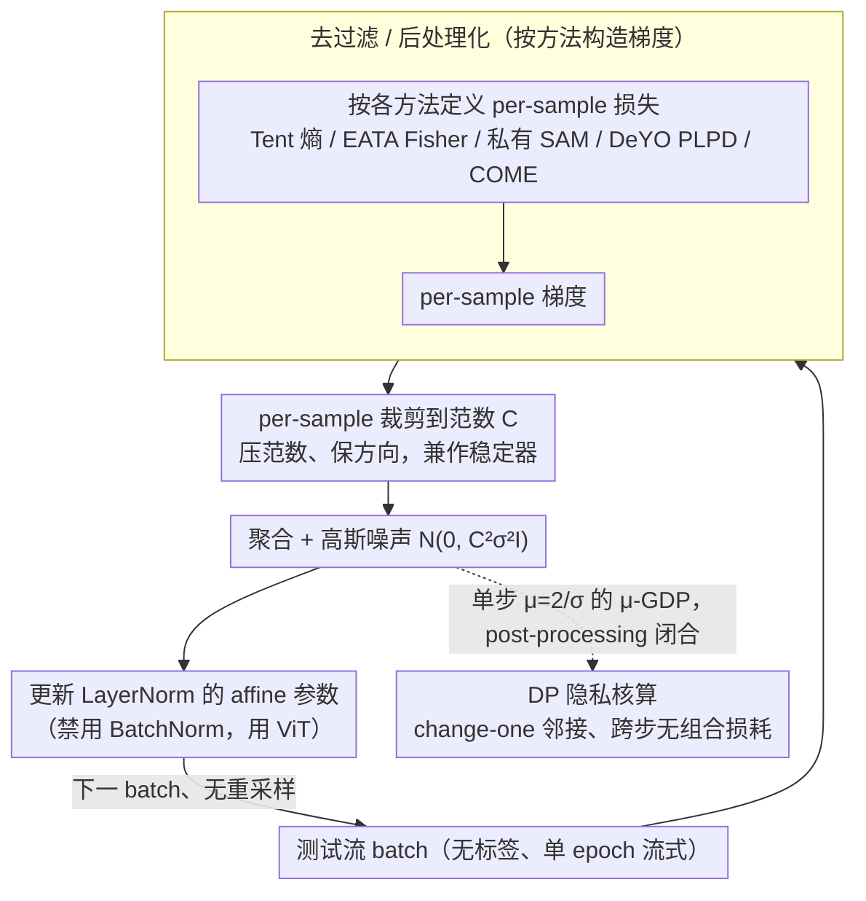

# Private and Stable Test-Time Adaptation with Differential Privacy

**会议**: ICML 2026  
**arXiv**: [2606.01908](https://arxiv.org/abs/2606.01908)  
**代码**: 暂无  
**领域**: AI安全 / 差分隐私 / 测试时自适应  
**关键词**: Test-Time Adaptation, Differential Privacy, DP-SGD, Per-Sample Clipping, ImageNet-C  

## 一句话总结
本文首次指出测试时自适应 (TTA) 会让模型参数泄露测试数据隐私，并把 Tent / EATA / SAR / DeYO / COME 五种主流 TTA 方法系统改造为带 per-sample 梯度裁剪 + 高斯噪声的 DP 版本，在 ImageNet-C 上既给出可证明的 $(\epsilon,\delta)$-DP 保证，又意外发现"裁剪本身"就能让 TTA 精度提升 $0.1\%$–$4.1\%$。

## 研究背景与动机

**领域现状**：TTA 在部署阶段用无标签测试样本继续更新模型（通常只更新归一化层的 affine 参数），用熵最小化、过滤、重加权等手段对抗分布漂移。Tent 是最小化预测熵的代表；EATA 加可靠性过滤与 Fisher 正则；SAR 用 sharpness-aware 优化；DeYO 用 patch shuffle 计算伪标签置信差 (PLPD)；COME 用 Dirichlet 不确定度替换熵。

**现有痛点**：所有这些方法都默认了一个隐含假设——测试数据本身不需要保护。但事实上，测试图像可能是医疗影像、人脸、定位轨迹，而 TTA 把这些样本"焊"进了参数。一旦模型或其输出被查询、共享，攻击者就能像针对训练数据那样发动成员推断 (membership inference) 或重建攻击 (reconstruction)，从更新里反推单个测试样本。

**核心矛盾**：把 DP-SGD 直接套到 TTA 上并不能解决问题：(1) TTA 的 batch 经常小到 1，DP 噪声相对信号被放大；(2) TTA 方法严重依赖数据相关的过滤/重加权，每一步动态决定哪些样本被用、权重多少，这些都是隐私意义上的"查询"，朴素实现既破坏 DP，又破坏稳定性；(3) DP-SGD 经典分析建立在采样 + leave-one-out 邻接关系上，而 TTA 是单 epoch 流式、每个样本只见一次，需要换一套核算。

**本文目标**：(a) 给出 TTA 的 DP 化通用配方；(b) 把它落地到五个具有代表性的 TTA 方法；(c) 系统刻画"隐私预算 vs. 自适应精度"曲线，并找出哪些 TTA 设计天然更亲 DP。

**切入角度**：作者意识到 TTA 的流式特性反而能让 DP 分析更干净——每个样本只在一步里被处理一次，因此跨步骤无须组合 (composition)，只要单步控制好敏感度即可由 post-processing 闭合到全局。

**核心 idea**：把"逐样本梯度裁剪 + 高斯噪声"作为 TTA 的强制隐私接口，并把那些不亲 DP 的过滤/重加权要么删掉、要么改成 DP-后处理形式；同时发现 per-sample clipping 在零噪声下也是 TTA 的免费午餐。

## 方法详解

### 整体框架

记源模型为 $f_{\theta_0}$，测试流为 $\{B_t\}_{t=1}^T$，可适应参数为归一化层 affine 子集 $\theta^a \subset \theta$。标准 TTA 更新为 $\theta_{t+1} = \theta_t - \eta \Delta_t$，其中 $\Delta_t = \frac{1}{|B_t|}\sum_{x_i \in B_t} w_t^i g_t(x_i)$，$g_t(x_i) = \nabla_\theta \ell_\text{tta}(x_i,\theta_t)$。DP-TTA 用以下替换：先对每个样本梯度做 $L_2$ 裁剪 $\bar g_t(x_i) = g_t(x_i)/\max(1,\|g_t(x_i)\|_2/C)$，再注入高斯噪声 $\Delta_t^{DP} = \frac{1}{|B_t|}(\sum_i \bar g_t(x_i) + \mathcal{N}(0,C^2\sigma^2 I_d))$。架构层面禁用 BatchNorm（梯度跨样本耦合违反 per-sample 敏感度假设），统一采用 LayerNorm 的 ViT-Base/16。整条流水线如下图：每个测试 batch 先按各方法定义构造 per-sample 损失与梯度（去过滤/后处理化），再逐样本裁剪、聚合加噪、更新 LayerNorm 的 affine 参数；而流式 + change-one 邻接的隐私核算从侧面闭合在加噪那一步上，跨步无须组合。

### 关键设计

**1. DP-TTA 隐私分析：用流式 + change-one 邻接省掉跨步组合损耗**

直接把 DP-SGD 的核算搬过来会很亏——它建立在多 epoch、子采样、leave-one-out 邻接的训练假设上，组合损耗很重。本文抓住 TTA 的一个结构性事实：它是单 epoch、流式的，每个样本只在一步里被处理一次。于是一旦单步保证了 $\mu$-GDP，后续所有步骤都只是 DP 结果的 post-processing，跨步根本不需要 composition。邻接关系改用 "change-one"（替换一个样本）而非 "leave-one-out"——流式批大小固定，删一个样本不自然——代价是敏感度从 $C$ 翻倍到 $2C$，因此 DP-Tent 满足 $\mu=2/\sigma$ 的 $\mu$-GDP，进而

$$\delta(\epsilon)=\Phi(-\sigma\epsilon/2+1/\sigma)-e^\epsilon\Phi(-\sigma\epsilon/2-1/\sigma)$$

这套分析让核算跟着 TTA 的真实使用方式走，并把"流式 + 无重采样"从劣势翻成优势——省掉了昂贵的组合损耗，这也是后面 $\epsilon=10$ 几乎免费的根源。

**2. 去过滤 / 后处理化：把五个 TTA 方法的"数据相关算子"逐一搬出隐私边界**

每个非平凡 TTA 方法都有一两个"擅自查询测试集"的算子，DP 化的核心就是辨认哪些可以挪到 DP 结果之后（免费）、哪些必须吞进裁剪（涨噪声）、哪些代价太大干脆删掉。EATA 的熵阈值过滤和多样性过滤会让有效 batch size 漂移、需要私有统计量，作者直接删掉两个 filter，但保留只依赖参数和源参数的 Fisher 正则 $\mathcal{R}(\theta_t,\theta_0)$（它是 DP post-processing），更新写成 $g_t(x_i)=\nabla_\theta(e^{H_0-H(x_i,\theta)}H(x_i,\theta_t))$ 后照常裁剪加噪。SAR 的两点 sharpness 更新会双倍消耗隐私预算，改用 Park 等的私有 SAM：用上一轮私有梯度 $\tilde g_{t-1}$ 构造扰动方向 $\tilde\epsilon_t=\rho\tilde g_{t-1}/\|\tilde g_{t-1}\|_2$，只评一次梯度。DeYO 把 PLPD 项 $e^{\text{PLPD}_\theta(x_i,x_i')}$ 塞进损失、走 per-sample 裁剪通道；COME 用 Dirichlet 不确定度 $\ell_\text{COME}=-\sum_k b_k\log b_k-u\log u$ 替换熵，本身就无须改造。这套"删过滤、保正则、内化加权"的三档处理，恰好也回答了"哪些 TTA 设计天然亲 DP"。

**3. Per-sample clipping 作为 TTA 的免费稳定器：裁剪本身就能涨点**

过去的认知是 per-batch clipping 对 TTA 无效（Niu et al., 2023），所以裁剪一直被当成纯粹的隐私成本。本文把粒度细化到 per-sample——保留每个样本各自的梯度方向、只压它的范数——发现即便在零噪声（$\sigma=0$）下单独加裁剪，平均自适应增益就从 $0.1\%$ 提到 $4.1\%$、ImageNet-R 上甚至 14%。背后的道理是 TTA 的伪标签梯度本就高方差、易被异常样本主导，逐样本裁剪相当于一种硬性的方向稀疏化与异常压制，让坏样本不至于在持续（continual）流里诱发模型坍缩。这一发现独立于 DP 也有价值，可以被非隐私 TTA 工作直接当成一个近乎零代价的稳定 trick 采用。

### 损失函数 / 训练策略

仅更新归一化层的 affine 参数；DP-EATA 保留 $\lambda \nabla_\theta \mathcal{R}(\theta_t,\theta_0)$ 项（Fisher 正则不进裁剪通道）；超参在 $\eta \in \{10^{-4}, 5\cdot 10^{-4}, \dots, 1\}$、$C \in \{1,5,10,15\}$ 中做交叉验证选取；batch size 固定 64，按 Tent 惯例。噪声层级 $\sigma \in \{8.594,1.966,1.084,0.777,0.619\}$ 对应 $\epsilon = 1,5,10,15,20$ ($\delta=10^{-6}$)。

## 实验关键数据

### 主实验

ImageNet-C severity 5、continual 设置、ViT-B/16，5 seed 平均，DP-Tent 在不同隐私预算下的精度表现：

| 设置 | $\epsilon$ | 平均 Top-1 (%) | 说明 |
|------|------------|----------------|------|
| 非私有 Tent | $\infty$ | 60.8 | 原始 baseline |
| DP-Tent | 20 | 62.9 | 反而比非私有高 2.1% |
| DP-Tent | 15 | 62.6 | 仍超非私有 |
| DP-Tent | 10 | 62.1 | 仍超非私有 |
| DP-Tent | 1 | 58.5 | 强隐私下只掉 2.3% |

其他方法在 $\epsilon=20$ 时相对非私有的精度差距：DP-EATA $-2.9\%$、DP-SAR $-1.2\%$、DP-DeYO $-2.4\%$、DP-DeYO-COME $-1.7\%$，远小于 DP-SGD 训练场景常见的精度损失。

### 消融实验：Per-sample clipping 单独的贡献

ImageNet-C continual、ViT-B/16，比较"是否加 per-sample clipping"（无 DP 噪声）：

| 配置 | 平均增益 | 关键发现 |
|------|----------|----------|
| 原版 TTA（无 clip） | $+0.1\%$ | 五法平均，相对源模型 |
| 原版 TTA + per-sample clip | $+4.1\%$ | 全部方法中四个上升，仅一个轻微 $-0.3\%$ |
| DeYO-COME + clip | $67.5\%$ 绝对精度 | continual 设置下最高 |
| Tent / EATA + clip (ConvNeXt) | $+1\%$ 到 $+5\%$ | continual & episodic 一致 |
| ImageNet-R + clip | 最高 $+14\%$ | 更难数据上裁剪收益更大 |

### 关键发现

- **per-sample clipping 是 TTA 的免费午餐**：在没有 DP 需求的场景下，单独加裁剪就能稳定 continual TTA、抑制崩溃，这是过往工作（用 per-batch clipping 试过失败）漏掉的层级粒度。
- **流式 TTA 让 DP 代价异常便宜**：因为单 epoch + change-one 邻接 + post-processing 闭合，跨步无组合损耗，让 $\epsilon=10$ 这种"中等隐私"在 ImageNet-C 上几乎是免费的，甚至小于非私有 baseline 的精度。
- **过滤越多越不亲 DP**：EATA / SAR / DeYO 的精巧过滤器在 DP 化时大多得删掉（要么破坏敏感度界，要么需要昂贵的私有统计），反而是最朴素的 Tent 最经得起 DP 化考验。
- **架构约束很硬**：BatchNorm 在 per-sample 裁剪下违反敏感度独立性，必须换成 LayerNorm 的 ViT，意味着实践部署时模型选择本身就是隐私决策。

## 亮点与洞察
- **把"威胁模型"前移到 TTA 是真正的范式补洞**：过去 TTA 论文只讨论精度和稳定性，本文第一次说明部署阶段的参数更新本身就是隐私 surface，且给了可证明的解决方案，使 TTA 与 DP-SGD / DP fine-tuning 形成完整谱系。
- **"删过滤、保正则、内化加权"三档分类法可复用**：当任何新 TTA 方法想 DP 化时，作者这套"对数据相关算子按敏感度代价做三档处理"的范式可以直接套用，是一个清晰的 DP-化工程模板。
- **per-sample clipping 的副产物结论独立有价值**：可以直接被非隐私 TTA 工作引用，作为一个"几乎零代价"的稳定 continual TTA 的 trick，这比主线的 DP 贡献更容易被社区采纳。

## 局限与展望
- **删过滤是有代价的**：把 EATA / DeYO 的可靠性过滤删掉换 DP，看似精度只掉 1–3%，但在更长的 continual 序列或更分布外的场景下，过滤器的长期稳定贡献可能被低估，需要长时序评估。
- **batch=1 仍未真正解决**：虽然作者说 DP-TTA 对 batch size 鲁棒，但实验固定 64，对真实流式部署常见的 batch=1 极端情况只在附录扫了一下，强隐私 + 小 batch 的真实 trade-off 还没充分量化。
- **缺乏经验性隐私审计**：DP 给的是上界，本文未用 membership inference 攻击验证下界，无法说明实际泄露程度是否远低于 $\epsilon$ 暗示的水平。
- **架构限定 LayerNorm 模型**：把 BatchNorm 模型整片排除限制了适用范围，未来需要研究 ghost normalization 或私有 BN 估计是否能放宽这一约束。

## 相关工作与启发
- **vs DP-SGD (Abadi et al., 2016)**: DP-SGD 假设训练阶段、多 epoch、子采样、leave-one-out；本文证明流式单 epoch 的 TTA 反而能省掉跨步组合，并且必须改用 change-one 邻接（代价 $2C$ 敏感度）。
- **vs 原始 Tent / EATA / SAR / DeYO / COME**: 这些方法把精度和稳定性当唯一目标；本文为它们加一个隐私维度，并发现 Tent 这个最朴素的方法在 DP 化后反而最坚挺，说明结构性精巧不等于鲁棒于隐私化。
- **vs Park et al. (2023) 的 DP-SAM**: 本文借用其"用上一轮私有梯度做扰动方向"的技巧把 DP-SAR 的双梯度评估降到一次，是一个跨场景的算法迁移示范。

<!-- RELATED:START -->

## 相关论文

- [\[ICML 2026\] TEMPORA: Characterising the Time-Contingent Utility of Online Test-Time Adaptation](tempora_characterising_the_time-contingent_utility_of_online_test-time_adaptatio.md)
- [\[ICML 2026\] On the Learnability of Test-Time Adaptation: A Recovery Complexity Perspective](on_the_learnability_of_test-time_adaptation_a_recovery_complexity_perspective.md)
- [\[CVPR 2026\] Neural Collapse in Test-Time Adaptation](../../CVPR2026/others/neural_collapse_in_test-time_adaptation.md)
- [\[ICML 2026\] MMD-Balls as Credal Sets: A PAC-Bayesian Framework for Epistemic Uncertainty in Test-Time Adaptation](mmd-balls_as_credal_sets_a_pac-bayesian_framework_for_epistemic_uncertainty_in_t.md)
- [\[NeurIPS 2025\] Test-Time Adaptation by Causal Trimming](../../NeurIPS2025/others/test-time_adaptation_by_causal_trimming.md)

<!-- RELATED:END -->
