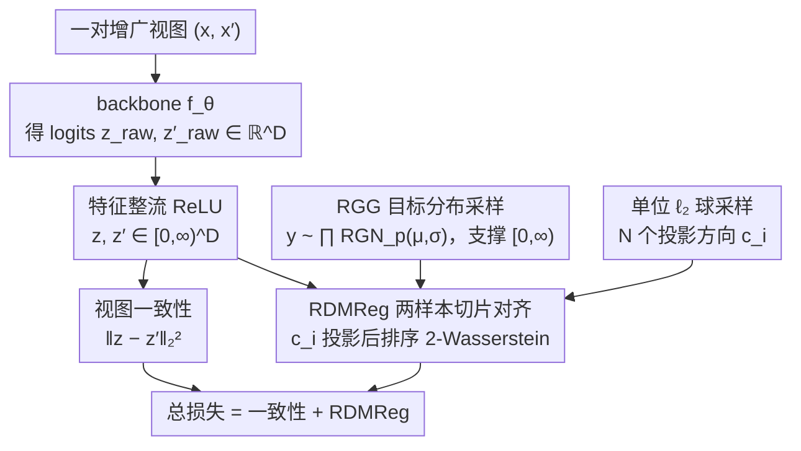

# Rectified LpJEPA: Joint-Embedding Predictive Architectures with Sparse and Maximum-Entropy Representations

**会议**: ICML 2026  
**arXiv**: [2602.01456](https://arxiv.org/abs/2602.01456)  
**代码**: https://github.com (作者主页链接，仓库未直接给出)  
**领域**: 自监督学习 / JEPA / 稀疏表示  
**关键词**: JEPA, 稀疏表示, 最大熵分布, Rectified Generalized Gaussian, 切片 Wasserstein  

## 一句话总结
作者把 LeJEPA 的"投影后向各向同性高斯对齐"推广为"投影后向 Rectified Generalized Gaussian (RGG) 分布对齐"，通过整流 + 截断广义高斯获得显式可控的期望 $\ell_0$ 稀疏度，在 ImageNet-100 上 ResNet 编码器线性探针达到 $85.08\%$ 同时把 $\ell_0$ 稀疏度维持在 $\sim 73\%$，明显优于 LeJEPA 的全密集表示。

## 研究背景与动机

**领域现状**：JEPA 系列（I-JEPA、LeJEPA 等）通过在隐空间强制多视图一致性来学自监督表示，避免在像素空间做重建。LeJEPA (Balestriero & LeCun 2025) 在此基础上用 SIGReg 正则把每个一维随机投影后的边缘对齐到一元高斯，依赖 Cramér–Wold 定理近似把整个表示分布"拉成"各向同性高斯，从而防崩塌。

**现有痛点**：把表示拉成各向同性高斯天然导致 dense（全维度均匀活跃）表示，丢掉了神经科学、信号处理、深度学习里反复出现的关键先验——稀疏 + 非负。LeJEPA 在 ImageNet-100 上 $\ell_0$ 稀疏度恒为 $1.0$（全密集），与 sparse coding / ReLU / NMF 这一脉的"高效编码"假说南辕北辙。

**核心矛盾**：要稀疏就要在表示分布里塞一个 $\ell_0$ 约束或 Dirac 质量；可一旦目标分布带 Dirac 质量，它就不再是稳定分布（不在线性组合下闭合），SIGReg 那套"投影后仍是同族分布"的解析推理立刻失效。如何在保留 Cramér–Wold 切片框架的同时让目标分布既"稀疏可控"又"最大熵"？

**本文目标**：(i) 构造一个新分布族，让期望 $\ell_p$ 和期望 $\ell_0$ 都可解析控制；(ii) 设计一个对应的切片正则项，绕开"投影非闭合"问题；(iii) 验证由此得到的表示既可控稀疏又保持下游精度。

**切入角度**：作者从最大熵原理出发——给定支撑 $S$ 和约束 $\mathbb{E}[\|\mathbf{x}\|_p^p]$，最大熵分布是截断广义高斯 $\mathcal{TGN}_p$；再把 $\mathcal{TGN}_p$ 与 Dirac $\delta_0$ 在 0 点处混合，就得到 Rectified Generalized Gaussian (RGG)，其期望 $\ell_0$ 由 $(\mu, \sigma, p)$ 解析给出。

**核心 idea**：把 LeJEPA 里的"投影后高斯对齐"替换为"投影后两样本切片 Wasserstein 对齐到 RGG"，并对特征显式加 ReLU 整流，使得目标分布和模型输出共享 $[0, \infty)$ 支撑——这就同时拿到了非负、稀疏可控、最大熵和一致性。

## 方法详解

### 整体框架
对一对增广视图 $(\mathbf{x}, \mathbf{x}')$ 输入 backbone $f_{\boldsymbol{\theta}}$ 得到 logits $\mathbf{z}_{\text{raw}}, \mathbf{z}'_{\text{raw}} \in \mathbb{R}^D$，再做 ReLU 得到 $\mathbf{z} = \mathrm{ReLU}(\mathbf{z}_{\text{raw}})$、$\mathbf{z}' = \mathrm{ReLU}(\mathbf{z}'_{\text{raw}})$。同时从目标分布 $\prod_{i=1}^D \mathcal{RGN}_p(\mu, \sigma)$ 采样 $\mathbf{y}$，从单位 $\ell_2$ 球 $\mathbb{S}^{D-1}_{\ell_2}$ 上均匀采样 $N$ 个投影方向 $\mathbf{c}_i$。损失由两部分构成：视图一致性 $\|\mathbf{z}-\mathbf{z}'\|_2^2$ 和切片分布匹配 $\sum_i \mathcal{L}(\mathbb{P}_{\mathbf{c}_i^\top \mathbf{z}} \,\|\, \mathbb{P}_{\mathbf{c}_i^\top \mathbf{y}})$，其中 $\mathcal{L}$ 取一维切片 2-Wasserstein 的排序差形式。整套流程仍是"backbone + projector + 投影后对齐"的 LeJEPA 骨架，但目标分布从高斯换成 RGG，并强制对特征整流。

### 关键设计

**1. Rectified Generalized Gaussian (RGG) 目标分布：把"稀疏强度"做成可解析调的旋钮**

LeJEPA 把表示拉成各向同性高斯，天然导致全密集激活，丢掉了"稀疏 + 非负"这个反复被验证有效的先验。本文要的是一个既稀疏可控、又不丢信息的目标分布。RGG 的构造是把 Dirac $\delta_0$ 与截断广义高斯 $\mathcal{TGN}_p(\mu,\sigma,(0,\infty))$ 在 0 处混合，等价于先采 $\mathcal{GN}_p(\mu,\sigma)$ 再 ReLU。它的妙处在于期望 $\ell_0$ 有闭式

$$\mathbb{E}[\|\mathbf{x}\|_0] = D \cdot \Phi_{\mathcal{GN}_p(0,1)}(\mu/\sigma),$$

于是负 $\mu$ 直接对应高稀疏（$\mu=-3$ 把激活率压到 $\sim 1\%$）。连续部分则继承"在期望 $\ell_p$ 范数约束下熵最大"的性质（Prop 3.3）：$p=2$ 退化为 Rectified Gaussian、$p=1$ 为 Rectified Laplace、$0<p<1$ 给出更尖锐的稀疏先验。同时拿到稀疏和不丢信息，必须既有 0 处点质量（产生硬零）又有连续部分最大熵（保任务信息）——RGG 是把这两件事用混合分布在解析上结合的最简结构，所有旋钮都能写成已知特殊函数 $\Phi$、$\Gamma$、$P(\cdot,\cdot)$ 的闭式。

**2. 两样本切片分布匹配 (RDMReg)：绕开"RGG 投影非闭合"这个致命问题**

SIGReg 之所以能直接写一元高斯密度的 NLL，是因为高斯在线性组合下闭合，投影后还是高斯。可一旦目标分布带 Dirac 质量，它就不再闭合，$\mathbf{c}^\top \mathbf{y}$ 的一维边缘没有闭式族成员，解析推理立刻失效。RDMReg 的破法是放弃闭合、改走两样本路线：从目标 RGG 实采 $\mathbf{Y}\in\mathbb{R}^{B\times D}$，对每个投影方向 $\mathbf{c}_i$ 用排序后的一维 2-Wasserstein 平方做对齐，

$$\mathcal{L}(\cdot)=\tfrac{1}{B}\big\|(\mathbf{Z}\mathbf{c}_i)^\uparrow-(\mathbf{Y}\mathbf{c}_i)^\uparrow\big\|_2^2.$$

理论上严格等价于全分布匹配要无穷多投影，但实验显示一个与维度无关的小 $N$ 就够。把对齐降到一维、再用非参 2-Wasserstein 做样本对齐，是唯一既能兼容任意目标分布、又抗维度灾难的折衷——这也是用稀疏换掉投影闭合后必须付的代价。

**3. 特征整流 + 目标整流的配对：让模型输出空间和目标支撑严格一致**

稀疏-精度 trade-off 能不能立起来，关键在于对齐发生在同一个支撑上。作者在 backbone 末端显式加 ReLU，让 $\mathbf{z}\in[0,\infty)^D$，与 RGG 的 $[0,\infty)$ 支撑相同。图 3(a) 把四种组合全试一遍——$(\mathcal{RGN}_p \mid \mathbf{z}^+)$（本文，两边都整流）、$(\mathcal{GN}_p \mid \mathbf{z})$（基线，都不整流）、$(\mathcal{GN}_p \mid \mathbf{z}^+)$、$(\mathcal{RGN}_p \mid \mathbf{z})$——结果只有"两边都整流"这一档能同时拿到高精度和高稀疏，其余要么塌成全密集要么精度大跌。道理在于：若对齐发生在不同支撑上，切片 Wasserstein 永远到不了 0，模型只能在"妥协精度"和"放弃稀疏"之间二选一；只有支撑对齐后，连续映射定理才能让 $\mathbf{z}_{\text{raw}}$ 收敛到 $\mathcal{GN}_p$、并自动让 $\mathrm{ReLU}(\mathbf{z}_{\text{raw}})$ 收敛到 RGG。

### 损失函数 / 训练策略
完整 loss 为
$\min_{\boldsymbol{\theta}} \mathbb{E}\big[\|\mathbf{z}-\mathbf{z}'\|_2^2\big] + \mathbb{E}_{\mathbf{c}}\big[\mathcal{L}(\mathbb{P}_{\mathbf{c}^\top \mathbf{z}} \,\|\, \mathbb{P}_{\mathbf{c}^\top \mathbf{y}}) + \mathcal{L}(\mathbb{P}_{\mathbf{c}^\top \mathbf{z}'} \,\|\, \mathbb{P}_{\mathbf{c}^\top \mathbf{y}})\big]$，
其中 $\mathcal{L}$ 为切片 2-Wasserstein。投影方向除均匀采样外，作者在附录里给出"用 $\mathbf{Z}$ 的协方差特征向量作投影"的变体，可加快二阶依赖去除速度（与 VICReg 形成条件等价）。Backbone 采用 ResNet/ViT/ConvNeXt + MLP projector 的标准配置，线性探针同时在 encoder 输出 $f_{\boldsymbol{\theta}_1}(\mathbf{x})$ 和 projector 输出 $\mathbf{z}$ 上做。

## 实验关键数据

### 主实验
ImageNet-100 线性探针（top-1 acc% / 越高越好，$\ell_0$ 稀疏度越低越好）。

| 方法 | Encoder Acc1 | Projector Acc1 | $\ell_1$ 稀疏 | $\ell_0$ 稀疏 |
|------|-------------:|---------------:|--------------:|--------------:|
| Rectified LpJEPA $\mathcal{RGN}_{2.0}(0, \sigma_{\text{GN}})$ | **85.08** | 80.00 | 0.341 | 0.730 |
| Rectified LpJEPA $\mathcal{RGN}_{2.0}(1.0, \sigma_{\text{GN}})$ | **85.08** | 80.54 | 0.628 | 0.867 |
| Rectified LpJEPA $\mathcal{RGN}_{1.0}(0.25, \sigma_{\text{GN}})$ | 84.98 | **80.76** | 0.375 | 0.744 |
| Rectified LpJEPA $\mathcal{RGN}_{1.0}(-3.0, \sigma_{\text{GN}})$ | 82.72 | 71.88 | **0.006** | **0.010** |
| LeJEPA (基线, 全密集) | 84.80 | 79.52 | 0.637 | 1.000 |
| VICReg | 84.18 | 78.88 | 0.795 | 1.000 |
| SimCLR | 83.44 | 77.90 | 0.634 | 1.000 |
| NCL-ReLU (sparse 基线) | 82.58 | 76.88 | 0.004 | 0.009 |
| NVICReg-ReLU (sparse 基线) | 84.48 | 77.74 | 0.521 | 0.712 |

在精度和 LeJEPA 持平甚至更高的同时，把 $\ell_0$ 稀疏度从 $1.000$ 降到 $0.730$（即 $\sim 27\%$ 维度永久为零），与 NVICReg-ReLU 比则在更稀疏档上同时高 $\sim 0.6\%$ 精度。

### 消融实验

| 配置 | 关键指标 | 说明 |
|------|---------|------|
| $(\mathcal{RGN}_p \mid \mathbf{z}^+)$（本文） | 最佳精度-稀疏 trade-off | 特征与目标都整流，唯一兼顾两者的设置 |
| $(\mathcal{GN}_p \mid \mathbf{z})$（无整流） | 精度高但全密集 | $\ell_0$ 稀疏度恒为 0，退化为 LeJEPA |
| $(\mathcal{GN}_p \mid \mathbf{z}^+)$ | 精度大跌 | 特征整流而目标未整流→支撑不匹配 |
| $(\mathcal{RGN}_p \mid \mathbf{z})$ | 精度大跌 | 目标整流而特征未整流，对齐失败 |
| $\mu$ 从 $1.0$ 扫到 $-3.0$ | 实证 $\ell_0$ 与 Prop 3.5 预测高度吻合 | $\mathbb{E}[\|\mathbf{x}\|_0] = D \cdot \Phi(\mu/\sigma)$ 解析公式实测成立 |
| Pareto 前沿 (稀疏 vs 精度) | 精度仅在 $> 95\%$ 维度为零时塌陷 | 大量稀疏可利用余地 |
| nHSIC 独立性 | RGG 系列显著低于 VICReg/NVICReg | RDMReg 抑制高阶依赖、不只是协方差 |

### 关键发现
- 实证 $\ell_0$ 与理论解析公式 $D \cdot \Phi_{\mathcal{GN}_p(0,1)}(\mu/\sigma)$ 在多种 backbone 上几乎重合，说明 RGG 不仅是动机层面的"看起来稀疏"，而是真的让模型按解析旋钮去稀疏化。
- 表示稀疏化非常"廉价"：在 $\ell_0$ 稀疏度达到 $\sim 95\%$ 之前，精度几乎不下降；只有更激进时才出现悬崖式下跌。
- 与只惩罚二阶统计量的 VICReg / NVICReg 相比，Rectified LpJEPA 的 nHSIC 明显更低，说明切片 Wasserstein 对齐捕捉到了二阶以上的依赖。
- 不同下游数据集上 Rectified LpJEPA 表现出"数据自适应"的稀疏度（图 3(c)），稀疏统计本身可用作 OOD 提示信号。

## 亮点与洞察
- 把 LeJEPA 的"投影闭合 + 一元高斯密度"思路用"放弃闭合 + 两样本切片 Wasserstein"严格扩展到任意目标分布，是 JEPA 正则项设计的一次接口级抽象——之后想要任何"带先验形状"的表示（重尾、非负、分层…）都可以套同一个框架。
- 把"稀疏度"从"靠 ReLU / $\ell_1$ 间接得到"变成"由分布超参 $(\mu, \sigma, p)$ 解析定准"，对工程上做能耗/带宽预算的具身模型尤其实用——可以在不重训的情况下解析估算激活率。
- "稀疏 + 最大熵 + 互独立"这三件事很难同时拿到，作者通过把熵改写成 d-维 Rényi 熵 $\mathbb{H}_d$（避开 Dirac 处微分熵无定义问题）给出形式化论证，这套熵记法对将来分析"带硬零"的离散-连续混合表示是个有用的工具盒。

## 局限与展望
- 评测以 ImageNet-100 为主，ImageNet-1K 仅放附录；要确认稀疏 + 高精度的 trade-off 是否在更大规模上仍成立还需更多证据。
- 训练侧引入了切片 Wasserstein，每步要 $O(N \cdot B \log B)$ 排序开销，作者承认对超大 batch / 高维 projector 仍有效率开销。
- 目标 $\sigma$ 的选择（$\sigma_{\text{GN}}$ vs $\sigma_{\text{RGN}}$）需要二分搜索得到，超参选择面变大；尽管作者给出默认配方，但跨数据集是否仍需要重新调有待验证。
- 论文只讨论了图像分类下游任务，未触及 dense prediction（检测/分割）等真正需要"非零位置语义有意义"的任务，稀疏表示的真正价值还没被充分压测。

## 相关工作与启发
- **vs LeJEPA (Balestriero & LeCun 2025)**: LeJEPA 是 RGG 当 $\mu \to +\infty$（无 Dirac 质量、特征不整流）的退化情形；本文形式上严格泛化，并在 $\mu = 0$ 邻域同时取回了稀疏与精度。
- **vs VICReg / NVICReg**: VICReg 只做协方差/方差/不变性二阶匹配，无法消除高阶依赖；本文证明切片 2-Wasserstein 即使只用协方差特征向量作投影也能严格蕴含 VICReg 的二阶部分，且在 nHSIC 上明显更低。
- **vs NCL-ReLU 等纯稀疏对比**: 纯稀疏对比方法精度差 $\sim 2\%$；Rectified LpJEPA 通过把稀疏写成"分布先验"而非"硬正则"，把精度与 LeJEPA 拉平。
- **vs Sparse Coding / NMF 传统**: 把"非负 + 稀疏"从工程偏置升级为 JEPA 正则项的目标分布形态，给经典稀疏编码一条"端到端深度自监督"的新落地路径。

## 评分
- 新颖性: ⭐⭐⭐⭐⭐ 把投影分布族从高斯扩到 RGG，并配套两样本切片 Wasserstein，是 JEPA 防崩塌设计的明确推广。
- 实验充分度: ⭐⭐⭐⭐ ImageNet-100 + 多 backbone + 多稀疏档 + nHSIC / 熵 / OOD 自适应；ImageNet-1K 仅附录是唯一遗憾。
- 写作质量: ⭐⭐⭐⭐ 理论 / 直觉 / 实验三层叙事清晰，公式与配图配合得当。
- 价值: ⭐⭐⭐⭐ 给"既要表达力又要稀疏"的自监督表示提供了一条解析可调的工程模板，可直接被具身/低功耗场景复用。

<!-- RELATED:START -->

## 相关论文

- [\[ICML 2026\] Possibilistic Predictive Uncertainty for Deep Learning](possibilistic_predictive_uncertainty_for_deep_learning.md)
- [\[ICML 2026\] On Revisiting Entropy for Identifying Mislabeled Images](on_revisiting_entropy_for_identifying_mislabeled_images.md)
- [\[ICML 2026\] Continual Learning of Domain-Invariant Representations](continual_learning_of_domain-invariant_representations.md)
- [\[ICML 2026\] HASTE: Hardware-Aware Dynamic Sparse Training for Large Output Spaces](haste_hardware-aware_dynamic_sparse_training_for_large_output_spaces.md)
- [\[CVPR 2026\] Consensus vs. Controversy: Mapping the Decision Space Where Architectures Diverge](../../CVPR2026/others/consensus_vs_controversy_mapping_the_decision_space_where_architectures_diverge.md)

<!-- RELATED:END -->
