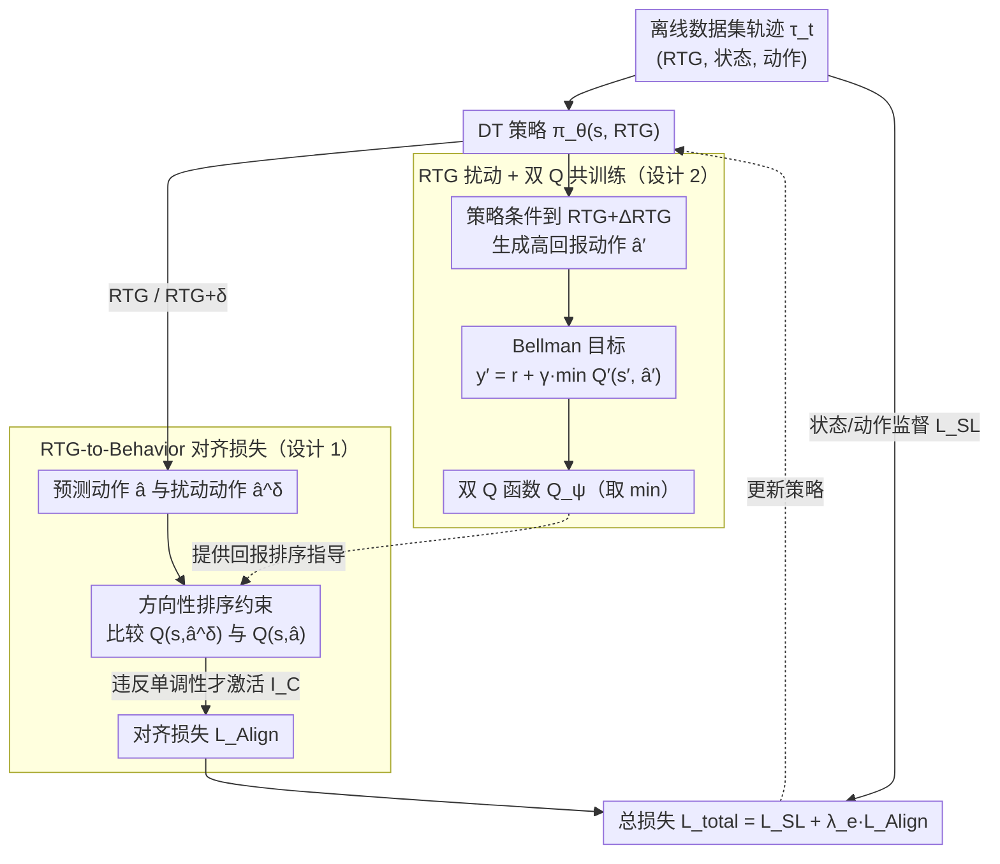

# Return-to-Go is More Than a Number: Q-Guided Alignment for Return-Conditioned Supervised Learning

**会议**: ICML 2026  
**arXiv**: [2605.29028](https://arxiv.org/abs/2605.29028)  
**代码**: 待确认  
**领域**: 强化学习 / 决策 Transformer  
**关键词**: 离线强化学习, 条件序列模型, 回报对齐, Q 学习, Decision Transformer

## 一句话总结
本文针对条件序列模型（如 Decision Transformer）中 return-to-go (RTG) 对齐不足的问题，提出 Q-align DT 框架——通过 RTG-to-behavior 对齐损失（强制 RTG 单调对应 Q 值变化）+ Q 函数的 RTG 扰动训练（共训练形成正反馈循环），在 D4RL 上达到 SOTA 性能且对齐误差大幅下降（HalfCheetah-medium 上 68.9 vs QCS 102.3）。

## 研究背景与动机

**领域现状**：条件序列模型（CSMs）如 Decision Transformer (DT) 把离线 RL 转化为监督学习问题，用 return-to-go (RTG) 作为条件信号指导策略生成特定回报水平的轨迹，在 D4RL 上取得不错经验性能。

**现有痛点**：RTG 理论上应控制策略生成的轨迹回报水平，但**许多 CSMs 对 RTG 严重不敏感**——改变输入 RTG 时实际生成轨迹的回报几乎不变（如 HalfCheetah），意味着模型本质在忽视 RTG 信号。原有方法要么直接复制行为策略的回报分布，要么把 RTG 当普通 token，没在结构上建立 RTG 与策略行为之间的对应关系。

**核心矛盾**：CSMs 缺乏对 RTG-行为映射的明确约束。理想情况下更高 RTG 应对应更高回报的轨迹（偏序关系），但现有方法无法强制单调性；离线 RL 数据集固定，直接构造满足全序关系的轨迹不可行。

**本文目标**：让单个 CSM 学到一族 RTG 条件化策略，使不同 RTG 条件下生成的轨迹回报能精确跟踪目标 RTG 值，同时保持竞争力的任务性能。

**切入角度**：作者观察到辅助 Q 函数可以提供回报估计信息，从而指导 CSM 学 RTG-行为对齐。关键创新是用 Q 函数的**单调性**作为约束目标，而不是**绝对值**——避免离线 RL 中常见的 over-optimization 问题。

**核心 idea**：通过 RTG-to-behavior 对齐损失显式约束策略在 RTG 变化时的行为变化必须与 Q 函数估计的回报变化方向一致，同时用 RTG 扰动技术共训练 Q 函数，使两者在正反馈循环中相互促进。

## 方法详解

### 整体框架
两个核心组件联合优化、互为师友：（1）DT 策略网络 $\pi_\theta(s, \text{RTG})$；（2）双 Q 函数 $Q_\psi(s, a)$。策略接收序列 $\tau_t = (\text{rtg}_{t-k+1}, s_{t-k+1}, a_{t-k+1}, \ldots, \text{rtg}_t, s_t)$，推理时所有 RTG token 可被修改为 $\tau_t^g$（加偏移 $g$），实现对策略行为的细粒度控制。训练时方法落到两件事上：**RTG-to-Behavior 对齐损失**用 Q 函数给的回报排序，逼策略在 RTG 升高时输出回报更高的行为（与标准监督损失一起更新策略）；**RTG 扰动 + 双 Q 共训练**则反过来让 Q 函数从「策略在更高 RTG 下生成的高回报动作」里学到更准的值估计。两者接成一个 actor-critic 正反馈环——Q 越准、对齐越好；对齐越好、策略生成的高回报演示越多、Q 又学得更准。

### 关键设计

**1. RTG-to-Behavior 对齐损失：只约束相对排序，不碰绝对 Q 值**

CSM 对 RTG 不敏感，根子在于没人逼着"更高的 RTG 必须对应更高回报的行为"。本文用一个约束优化把这个偏序关系写死：$\min_\theta L_{SL}(\theta)$ s.t. $\frac{\partial Q_\psi(s,\pi_\theta(s,\text{RTG}))}{\partial \text{RTG}}\ge 0$。直接算这个梯度太贵，于是改用零阶估计 $\frac{\partial Q}{\partial \text{RTG}}\approx \frac{Q(s,\hat{a}^\delta)-Q(s,\hat{a})}{\delta}$（$\hat{a}^\delta$ 是把 RTG 加扰动 $\delta$ 后预测的动作），再转成方向性排序约束 $\text{sgn}(\delta)\,(Q(s,\hat{a}^\delta)-Q(s,\hat{a}))\ge 0$，落到损失上是

$$L_{\text{Align}}=\sum_{i=t-k+1}^{t} I_\mathcal{C}\cdot \big|Q_\psi(s_i,\hat{a}_i^\delta)-Q_\psi^\perp(s_i,\hat{a}_i)\big|,$$

指示函数 $I_\mathcal{C}$ 只在约束被违反时才激活，$Q_\psi^\perp$ 是带停止梯度的参考 Q 值。关键拿捏在于"只管相对顺序、不管绝对大小"：离线 RL 里直接优化绝对 Q 值会把策略推向数据分布外的高价值动作（over-optimization 的老毛病），而单调性约束更保守，既建立了 RTG 与行为的对应又不越界。对齐损失最终以拉格朗日乘子的形式并进标准 CSM 训练，总损失为 $\mathcal{L}_{\text{total}}(\theta)=L_{SL}(\theta)+\lambda_e L_{\text{Align}}(\theta)$，其中监督损失 $L_{SL}(\theta)=\sum_i \|s_i-\hat{s}_i\|^2+\|a_i-\hat{a}_i\|^2$ 联合预测状态和动作、把策略锚在数据集上，$\lambda_e$ 调节对齐约束的权重——既模仿数据又能被 RTG 系统性地操控。

**2. RTG 扰动 + 双 Q 共训练：让 Q 函数能评估整个 RTG 频谱上的行为**

对齐损失依赖 Q 函数给出靠谱的回报排序，但若 Q 只在数据集静态分布上训练，它的视野会被锁死在数据覆盖的回报范围内，没法为"更高 RTG 条件下的策略"提供指导，对齐也就无从谈起。本文的解法是在 Bellman 一致性里注入 RTG 扰动：Q 函数学的目标是 $y_i'=r_i+\gamma\min_{m=1,2}Q_{\psi_m'}^\perp(s_{i+1},\hat{a}_{i+1}^{',\Delta\text{RTG}})$，其中 $\hat{a}_{i+1}^{',\Delta\text{RTG}}$ 是目标策略在 RTG 加固定偏移 $\Delta\text{RTG}$ 后预测的动作。也就是说，把策略条件到更高 RTG 去生成更高回报的动作候选，反过来给 Q 函数喂高质量的 Bellman 目标。这样就接成了一个 actor-critic 正反馈环：Q 更准 → 对齐损失把策略改好 → 更好的策略经 RTG 扰动生成更高质量演示 → Q 学到更准的值估计 → 再回馈策略。Q 函数侧沿用 Double Q-learning 的成熟做法——两个 Q 取 min 压过估计偏差——再配合停止梯度让目标 Q 值保持稳定，保证训练不因 RTG 扰动和对齐-监督的联合优化而失稳。

## 实验关键数据

### 主实验（D4RL Gym 域）

| 数据集 | IQL | TD3+BC | DT | RADT | QT | QCS | **Q-align DT** |
|--------|-----|--------|-----|------|-----|-----|---------------|
| HalfCheetah-medium | 47.4 | 48.3 | 42.6 | — | 51.4 | 59.0 | **65.3 ± 0.63** |
| HalfCheetah-medium-replay | 44.1 | 44.6 | 36.6 | 41.3 | 48.9 | 54.1 | **57.1 ± 0.74** |
| Hopper-medium | 63.8 | 59.3 | 67.6 | — | 96.9 | 96.4 | **102.1 ± 0.74** |
| Hopper-medium-replay | 92.1 | 60.9 | 82.7 | 95.7 | 102.0 | 100.4 | **102.2 ± 0.64** |
| Walker2d-medium | 79.9 | 83.7 | 74.0 | — | 88.8 | 88.2 | **94.7 ± 0.67** |
| Walker2d-medium-replay | 73.7 | 81.8 | 79.4 | 75.9 | 98.5 | 94.1 | **101.3 ± 0.73** |
| **总分** | 688.8 | 677.4 | 685.4 | — | 808.6 | 812.3 | **856.9** |

### 对齐性能（保持目标 RTG 时测实际轨迹回报跟踪误差 RMSE ↓）

| 数据集 | DC | DT | QT | QCS | **Q-align DT** |
|--------|----|----|-----|-----|---------------|
| HalfCheetah-medium | 155.4 | 161.2 | 138.6 | 102.3 | **68.9** |
| Hopper-medium | 89.7 | 45.2 | 22.1 | 18.3 | **12.4** |
| Walker2d-medium | 102.3 | 97.8 | 52.4 | 51.2 | **31.5** |

### 关键发现
- **对齐能力大幅提升**：HalfCheetah-medium 上 Q-align DT 对齐误差 68.9 vs 次优 QCS 102.3，直观体现解决 RTG 不敏感问题。
- **性能与对齐兼得**：Gym 域总分 856.9 vs 次优 QCS 812.3 提升 5.5%，对齐改进同时不牺牲任务性能。
- **RTG 扰动影响**：消融显示 $\Delta\text{RTG} = 0$ 性能下降——充分扰动对 Q 函数学习至关重要；过大引入不稳定，需平衡。
- **零样本泛化**：HalfCheetah-Vel（速度控制）任务上仅通过改 RTG 值就能实现不同速度的控制，无需重训——证明模型学到真正的结构化策略族。

## 亮点与洞察
- **从相对排序到单调性约束**：指示函数 $I_\mathcal{C}$ 只在违反偏序时加惩罚，既保证单调性又避免过度约束；相比直接用绝对 Q 梯度更稳定（解决 over-optimization）。
- **RTG 扰动的双重作用**：直观看是为 Q 函数学习生成高质量目标，但实际上通过改变策略在高 RTG 条件下的行为反过来改进对齐损失的有效性，形成紧密的 actor-critic 正反馈。
- **理论与实证的统一**：理论上证明对齐约束能减小假设类 $\Pi$ 复杂度（从 $O(|S| |G| \log |A|)$ 降到 $O(|S| |G|)$），解释了为什么约束会改进样本效率和对齐性。
- **可迁移的设计**：方法完全通用，对任何 CSM 架构适用；RTG 扰动技术可推广到其他条件化建模问题（动态控制、目标条件 RL）。

## 局限与展望
- 要求预训练 Q 函数 + 双 Q 维护，增加计算成本。
- 极稀疏奖励任务（如 AntMaze）改进幅度相对有限——稀疏信号限制 Q 函数学习。
- $\Delta\text{RTG}$ 需要人工调参，不同任务最优值差异大，缺自适应机制。
- 假设离线数据集有合理覆盖；在极不均匀分布（只有高 / 低回报轨迹）下可能失效。
- 改进方向：学 $\Delta\text{RTG}$ 而非固定 / 元学习动态调整；结合数据覆盖度自动降低对齐约束权重；扩展到离散 / 混合动作空间。

## 相关工作与启发
- **vs DT**：DT 只把 RTG 当数值 token 缺结构化约束；本文显式建立 RTG 与回报的单调对应，是 DT 的重要改进。
- **vs QT**（Hu 2024）：QT 直接最大化 Q 值改进性能，但导致策略坍缩到数据分布内的高值区域，对齐性变差；本文通过对齐约束 + RTG 扰动平衡，既对齐又避免过度乐观。
- **vs RADT**（Tanaka 2025）：RADT 通过增加 Attention 层增强 RTG 敏感性，参数量大；本文更轻量（仅加对齐损失 + RTG 扰动）实现更好对齐和性能。
- **vs IQL / CQL**：继承保守离线 RL 设计哲学，但通过 RTG 这一核心条件改进适配，为条件化策略学习开辟新方向。

## 评分
- 新颖性: ⭐⭐⭐⭐⭐  把 RTG 对齐从经验观察上升到结构化约束；相对排序的指示函数 + RTG 扰动双重机制都是创新。
- 实验充分度: ⭐⭐⭐⭐⭐  D4RL 全套 + AntMaze + 消融 + 对齐指标 + 对齐曲线图，证据链完整。
- 写作质量: ⭐⭐⭐⭐  逻辑清晰，动机充分，理论分析严谨；RTG 扰动部分的直觉解释可再深化。
- 价值: ⭐⭐⭐⭐⭐  既解决实际问题（CSM 对 RTG 不敏感）又开启新研究方向（条件化策略学习的对齐），应用潜力大。

<!-- RELATED:START -->

## 相关论文

- [\[AAAI 2026\] More Than Irrational: Modeling Belief-Biased Agents](../../AAAI2026/others/more_than_irrational_modeling_belief-biased_agents.md)
- [\[ACL 2025\] PopAlign: Diversifying Contrasting Patterns for a More Comprehensive Alignment](../../ACL2025/others/popalign_diversifying_contrasting_patterns_for_a_more_comprehensive_alignment.md)
- [\[ACL 2025\] Are Any-to-Any Models More Consistent Across Modality Transfers Than Specialists?](../../ACL2025/others/are_any-to-any_models_more_consistent_across_modality_transfers_than_specialists.md)
- [\[ICML 2026\] Over-Alignment vs Over-Fitting: The Role of Feature Learning Strength in Generalization](over-alignment_vs_over-fitting_the_role_of_feature_learning_strength_in_generali.md)
- [\[ICML 2026\] Semi-Supervised Noise Adaptation: Transferring Knowledge from Noise Domain](semi-supervised_noise_adaptation_transferring_knowledge_from_noise_domain.md)

<!-- RELATED:END -->
