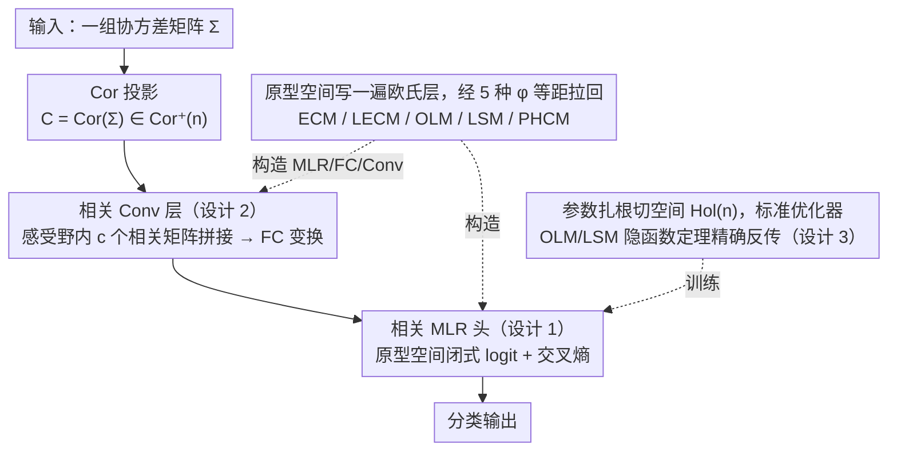

# Riemannian Networks over Full-Rank Correlation Matrices

**会议**: ICML 2026  
**arXiv**: [2605.19073](https://arxiv.org/abs/2605.19073)  
**代码**: 待确认  
**领域**: 几何深度学习 / 流形神经网络  
**关键词**: 相关矩阵流形, 黎曼网络, Log-Euclidean 度量, Cholesky 分解, Poincaré 球

## 一句话总结
本文把 MLR、FC、Conv 三种基础层系统地推广到满秩相关矩阵流形 $\mathrm{Cor}^+(n)$ 上的五种黎曼几何（ECM、LECM、OLM、LSM、PHCM），并为 OLM 与 LSM 推导出精确的反传，构造的 CorNet 在 Radar、HDM05、FPHA、NTU120 上一致超过同体量的 SPDNet / Grassmann 网络。

## 研究背景与动机

**领域现状**：在协方差类特征驱动的任务（EEG、雷达、骨骼动作）里，SPD 流形神经网络已经形成了一条成熟的路线——从 SPDNet、SPDNetBN，到基于 gyrovector 与 Riemannian 几何的各种新层，几何先验被反复证明能提升判别力。

**现有痛点**：相关矩阵 $C = D(\Sigma)^{-1/2} \Sigma\, D(\Sigma)^{-1/2}$ 虽然是协方差的归一化版本、统计上更紧凑，却几乎没有专门的深度网络去吃这种输入。把它直接喂给 SPDNet 会忽略掉对角恒为 1、自由度只剩 $n(n-1)/2$ 这个核心约束；而早期把相关矩阵当作 SPD 的商流形又得不到唯一的 Riemannian log 与 Fréchet mean 闭式解。

**核心矛盾**：相关矩阵流形 $\mathrm{Cor}^+(n)$ 的几何最近才刚刚被工具化——ECM、LECM、PHCM（Thanwerdas & Pennec, 2022）以及置换不变的 OLM、LSM（Thanwerdas, 2024）凑齐了五套带闭式表达的度量，但深度学习侧还没人去消费这些工具。

**本文目标**：把欧氏深度学习里最常用的三件套（MLR、FC、Conv）整体搬到 $\mathrm{Cor}^+(n)$ 上，覆盖四个零曲率 Log-Euclidean 度量加一个由 Poincaré 球乘积构成的非零曲率度量 PHCM，并解决 OLM、LSM 下隐式算子的精确反传。

**切入角度**：所有 Log-Euclidean 度量都通过微分同胚 $\phi$ 等距到欧氏原型空间，于是只要把 MLR 的"到边界超平面的有符号距离"形式（Lebanon & Lafferty）按 $\phi$ 拉回，FC 层就能从 MLR 隐式定义出来，避免对每条几何各写一套手工层。

**核心 idea**：在原型空间里写出来的欧氏层，可以通过五种 $\phi$ 拉回得到五套对应的相关层；再用切空间扎根（trivialization）规避过参数化、用闭式表达式替代 Riemannian trigonometry 近似，把整个 CorNet 训练流程"欧氏化"。

## 方法详解

### 整体框架
输入是一组协方差矩阵，先按 $\mathrm{Cor}(\Sigma)$ 投到 $\mathrm{Cor}^+(n)$ 上得到相关矩阵；然后堆叠"相关 Conv 层 → 相关 MLR 头"两段。Conv 层对每个 receptive field 内拼起来的多通道相关矩阵做 FC 变换，FC 又由对应度量下的 MLR logit 隐式定义。所有可学习参数都被参数化在切空间 $T_E M \cong \mathrm{Hol}(n)$（对称且对角为零的矩阵）里，因此可以用标准 PyTorch 优化器直接训练，几何只体现在前向的 $\phi$、$\phi^{-1}$ 与必要的 Newton/iteration。整套层不是逐条几何手撸，而是"在原型空间写一遍欧氏层 → 经五种微分同胚 $\phi$ 等距拉回"统一产出。

### 关键设计

**1. 统一 MLR：在原型空间上写一次，五套度量一次性拿到**

如果给每条几何都手撸一套 MLR 公式，工作量会爆炸，还得忍受 Riemannian trigonometry 的近似误差。作者的做法是只在原型空间写一遍。对每个 Log-Euclidean 度量，先证明 $\phi(I) = 0$，所以单位阵 $I$ 可以当流形原点；再用 Thm. 3.1 的等距性，把 Chen et al. (2024c) 的流形 MLR logit 退化成原型空间里熟悉的 $v_k(X) = \langle \phi(X), \phi_{*,E}(Z_k)\rangle - \gamma_k \|\phi_{*,E}(Z_k)\|$。代入 Prop. 3.2 给出的四个微分（ECM/LECM 取严格下三角 $\lfloor V\rfloor$、OLM 取 $V$ 本身、LSM 取 $V - \mathrm{diag}(V\mathbf{1})$）就拿到四个 Log-Euclidean 几何下的 MLR；PHCM 则通过 Cholesky 等同到 $n-1$ 个 Poincaré 半球乘积 $\mathrm{PHS}^{n-1}$ 来复用 Ganea / Shimizu 的 Poincaré MLR。所有 logit 都是闭式，参数 $(Z_k, \gamma_k) \in \mathrm{Hol}(n)\times\mathbb{R}$ 永远活在欧氏空间，新增一条几何只需要算一次 $\phi_{*,E}$。

**2. FC / Conv 层：用 MLR 反向定义，按度量一次性给出闭式解**

Shimizu et al. (2021) 在 Poincaré 球上有个漂亮视角——FC 层就是"多个 MLR 的有符号距离堆出来"。作者把它推广到相关流形：FC 层 $F: \mathrm{Cor}^+(n)\to\mathrm{Cor}^+(m)$ 通过 $d = m(m-1)/2$ 条方程 $s_k\, d(Y, H_{O_k, I}) = v_k(X; Z_k, \gamma_k)$ 隐式定义，在 Log-Euclidean 度量下能解出闭式（Thm. 3.5），例如 ECM 下 $Y = \mathrm{Cor}\circ \mathrm{Chol}^{-1}(V^{EC} + I_m)$，LECM 多套一层 $\exp$，OLM 走 $\mathrm{Exp}^\circ$，LSM 走 $\mathrm{Cor}\circ\exp$，矩阵元 $V^{*}_{ij}$ 按 $\lfloor\cdot\rfloor$ / $\mathrm{Hol}$ / $\mathrm{Row}_0$ 的子空间结构填进去。Conv 层就是把每个 receptive field 内的 $c$ 个相关矩阵拼成 $(\mathrm{Cor}^+(n))^c$ 再喂同一个 FC，等价于欧氏卷积"每个感受野上做一次仿射"。这套统一定义让 FC、MLR、Conv 共享同一套度量与参数空间，组合时不会几何错配，Conv 也省掉单独的卷积理论。

**3. OLM/LSM 的精确反传：把隐式算子写成显式 Jacobian**

OLM 与 LSM 里出现两个没有闭式的算子——$D(H)$（让 $\exp(D+H)$ 落回相关矩阵的唯一对角修正）和 $D^\star(C)$（让 $D^\star C D^\star$ 取 log 后行和为零的唯一正对角缩放），原本只能让 autograd 透过指数收敛迭代 $D_{k+1} = D_k - \log(D(\exp(D_k + H)))$ 与阻尼 Newton 反传。但 autograd 透传迭代既不准也慢，对这两个需要数值求根的置换不变度量尤其要命。作者把两个不动点条件 $f(D,H)=0$、$g(D^\star,C)=0$ 对参数做隐函数定理，直接解出 Jacobian 闭式（Sec. E），训练时只需在迭代收敛后调用一次显式公式，反传精度不依赖迭代步数，也跳过了反向再走一遍迭代的开销——这是 OLM/LSM 能稳定训练大网络的前提。

### 损失函数 / 训练策略
分类用 MLR 头接交叉熵；所有可学习参数都通过 trivialization 放在切空间 $\mathrm{Hol}(n)$（或 LSM 下的 $\mathrm{Row}_0(n)$），用标准 Adam/SGD 直接更新，不需要 Riemannian 优化器；卷积 + MLR 都用同一个度量是默认配置，混合度量在消融里给出。

## 实验关键数据

### 主实验
评测协议：Radar（3000 条雷达信号 3 类）、HDM05（动捕骨架动作）、FPHA（手部动作）、NTU120（大规模骨架动作）四个标准 SPD 任务，五折平均准确率（%）。

| 流形 | 方法 | Radar | HDM05 | FPHA | NTU120 |
|--------|------|------|------|------|------|
| Grassmann | GrNet | 90.48 | 63.19 | 85.31 | 57.59 |
| SPD | SPDNet | 93.25 | 64.57 | 85.59 | 51.25 |
| SPD | SPDNetBN | 94.85 | 71.28 | 89.33 | 54.35 |
| SPD | SPDNetLieBN-AIM | 95.47 | 71.83 | 90.39 | 58.20 |
| SPD | GyroSPD++ | 95.20 | 69.82 | 89.50 | 61.57 |
| Correlation | CorNet-ECM | **97.71** | 81.35 | **92.17** | **65.04** |
| Correlation | CorNet-LECM | **98.40** | 78.05 | 91.17 | 65.03 |
| Correlation | CorNet-OLM | 97.57 | 81.46 | 91.63 | 64.41 |
| Correlation | CorNet-PHCM | 96.56 | **82.26** | 90.03 | 60.01 |

CorNets 相对最经典的 SPDNet 在四个数据集上分别 +5.15% / +17.69% / +6.58% / +13.79%；相对 GyroSPD++（同款架构）仍然全面占优；在最大的 NTU120 上 CorNet-ECM/LECM 还是 top-2 最快的方法之一（单 epoch ~12 s）。

### 消融实验
| 配置 | 关键观察 | 说明 |
|------|---------|------|
| Conv 与 MLR 用相同度量 (Tab. 3 对角线) | HDM05/FPHA 上几乎都是最优 | 跨度量混合一般会掉点，几何一致性重要 |
| SPDNet 输入：协方差 vs 相关 (Tab. 4) | HDM05: 64.57→66.81；FPHA: 85.59→83.37；Radar: 93.25→89.49 | 相关有时更好，但**忽略相关流形几何就可能掉点**，论证"必须有专门的 CorNet" |
| CorMLR vs SPDMLR-Trivlz (Tab. 5) | HDM05/FPHA CorMLR 领先；Radar 略输；ECM/PHCM 速度有明显优势 | 单层 MLR 都能体现相关嵌入的判别力，且 ECM 类几何便宜 |
| 反传：autograd vs 精确 Jacobian (OLM/LSM) | 精度与稳定性更好（Sec. E） | 对置换不变度量是训练必要条件 |

### 关键发现
- **不同任务的最优度量不同**：Radar 偏好 LECM、HDM05 偏好 PHCM、FPHA/NTU120 偏好 ECM，说明几何也是一种"超参数"，CorNet 把它做成可切换组件本身就是贡献。
- **相关 vs 协方差的可解释收益**：HDM05 上协方差对角方差变异系数大、对角远大于非对角，相关矩阵把对角拉平到 1，迫使网络看真正信息密度高的非对角相关项，所以收益最大。
- **效率反而不弱**：CorNet-ECM/LECM 在 NTU120 上比 GyroSPD++ 快 ~17×，比 GyroAI 快 ~8×，说明几何更"轻"的相关流形不是负担。

## 亮点与洞察
- **"原型空间一遍 + 五次拉回"的范式**：以前每提出一个新流形度量都要手撸一套层，这里用 $\phi$ 等距把所有 Log-Euclidean 几何合并到欧氏 MLR 的同一个证明里，新增度量只需要算一次 $\phi_{*, I}$，可复用性极高。
- **trivialization 是连接黎曼几何与 PyTorch 的桥**：把可学习参数永远放在切空间，再用 $\mathrm{Exp}$ 推回流形参数，既避免过参数化又能直接用欧氏优化器，对工程落地友好。
- **隐式算子的精确反传**：把迭代算子写成隐函数后用 implicit function theorem 求 Jacobian，这套套路在 OT / fixed-point layer / DEQ 也通用，是几何深度学习里值得复用的训练 trick。

## 局限与展望
- 只覆盖了五种现成度量，对 $\mathrm{Cor}^+(n)$ 上其它带非平凡曲率的几何（如商度量、affine-invariant 的相关版本）还没层化。
- 实验仍集中在中等 $n$（信号/骨架）的传统 SPD benchmark 上，没碰更大规模、图像级的协方差/相关任务（如视觉 second-order pooling）。
- 度量必须由人手工指定，未来若能用 hypernetwork 或 learned metric 自动选 ECM/LECM/OLM/LSM/PHCM 之一，可省掉显式调参。
- PHCM 走 Poincaré 球乘积，半球数随 $n$ 线性增长，超大 $n$ 时可能不如 ECM 那么 scalable。

## 相关工作与启发
- **vs SPDNet 系列（Huang & Van Gool 2017, Brooks et al. 2019, Chen et al. 2024）**：他们做协方差侧的几何层，本文换到相关侧；优势是相关流形维度小、几何选择多、对 EEG/动作这类对角变异大的任务收益明显，劣势是必须重新搭一套度量目录。
- **vs Poincaré 网络（Ganea et al. 2018, Shimizu et al. 2021）**：他们在单个 Poincaré 球上做层，本文 PHCM 部分相当于把它直接复用到乘积空间 $\mathrm{PPS}^{n-1}$ 上的相关流形，几何复用得很干净。
- **vs Chen et al. (2024c) 的统一流形 MLR**：他们用 Riemannian trigonometry 近似解超平面距离，本文在 Log-Euclidean 度量下直接闭式解 Eq. (4)，避免近似误差，结构上也更整齐。
- **vs Grassmann 网络（GrNet, GyroGr）**：Grassmann 用子空间表达，本文用相关结构表达；后者保留了更多的二阶统计信息，在 HDM05/NTU120 这种长序列动作上判别力更强。

<!-- RELATED:START -->

## 相关论文

- [\[ICLR 2026\] Consistent Low-Rank Approximation](../../ICLR2026/others/consistent_low-rank_approximation.md)
- [\[ICML 2026\] DISCO: Mitigating Bias in Deep Learning with Conditional Distance Correlation](disco_mitigating_bias_in_deep_learning_with_conditional_distance_correlation.md)
- [\[ICML 2026\] On the Epistemic Uncertainty of Overparametrized Neural Networks](on_the_epistemic_uncertainty_of_overparametrized_neural_networks.md)
- [\[AAAI 2026\] Improved Differentially Private Algorithms for Rank Aggregation](../../AAAI2026/others/improved_differentially_private_algorithms_for_rank_aggregation.md)
- [\[ICLR 2026\] Fast and Stable Riemannian Metrics on SPD Manifolds via Cholesky Product Geometry](../../ICLR2026/others/fast_and_stable_riemannian_metrics_on_spd_manifolds_via_cholesky_product_geometr.md)

<!-- RELATED:END -->
