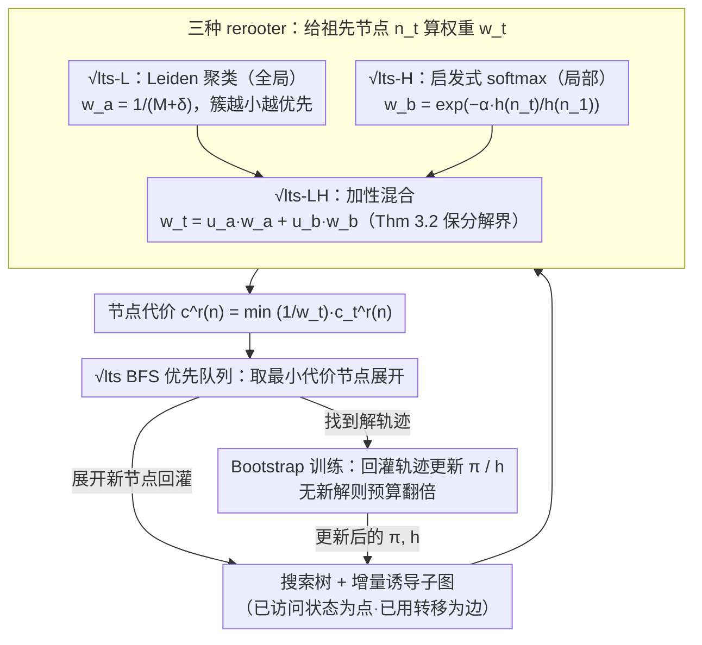

# Structure-Induced Information for Rerooting Levin Tree Search

**会议**: ICML 2026  
**arXiv**: [2605.30664](https://arxiv.org/abs/2605.30664)  
**代码**: 暂未公开  
**领域**: 强化学习 / 学习引导的搜索 / 规划  
**关键词**: Levin Tree Search、rerooting、Leiden 聚类、启发式、子任务分解

## 一句话总结
在 $\sqrt{\mathrm{lts}}$ 框架中，作者提出三种"rerooter"——全局 Leiden 聚类、局部启发式 cost-to-go、二者加性混合——把搜索努力自动按状态空间结构和目标距离分配给隐式子任务，避免了 HIPS-$\varepsilon$ / SGPS 那种昂贵的显式子目标生成模型，在 BoulderDash、CraftWorld 等复杂域上的在线训练样本效率和测试展开数都达到 SOTA。

## 研究背景与动机

**领域现状**：策略引导的树搜索（policy tree search）用学到的策略 $\pi$ 把概率质量倾注到有希望的分支。Levin Tree Search (LTS, 2018) 用 $\varphi_{\mathrm{LTS}}(n)=\tfrac{d(n)+1}{\pi(n)}$ 当节点代价，给出严格上界 "在找到首个解节点之前最多展开 $(d(n^*)+1)/\pi(n^*)$ 个节点"。PHS* (2021) 把启发式 $h$ 也并入这个上界并可学习策略以最小化界。

**现有痛点**：LTS/PHS* 在复杂域（BoulderDash、CraftWorld）会力不从心，因为它们没有任何"子目标分解"机制。HIPS-$\varepsilon$ (2024) 与 SGPS (2025) 通过显式子目标生成（VQ-VAE 之类的高容量生成模型）来分解问题、扩展搜索半径——效果好，但调用子目标网络的算力开销随域复杂度暴涨；BoulderDash 30% 难度下 PHS*($\pi^{\mathrm{SG}}$) 还能解 11 个，到 40% 已经全部超时。

**核心矛盾**：要规模化到复杂域必须分解子任务；但显式子目标重建 = 高容量生成模型 = 训练 / 推理双重昂贵；二者之间存在算力-效果 trade-off。

**本文目标**：在 $\sqrt{\mathrm{lts}}$（Orseau et al. 2024）的"隐式子任务"机制基础上，回答 Orseau 留下的开放问题——怎么自动从搜索树结构本身派生 rerooting 权重 $w_t$，而**不**调用单独的子目标网络？

**切入角度**：$\sqrt{\mathrm{lts}}$ 在每个节点 $n_t$ 上隐式启动一个 LTS 子搜索，节点代价改为 $c^r(n)=\min_{n_t\prec n}\tfrac{1}{w_t}c_t^r(n)$，$w_t$ 决定每个子搜索分得的时间份额。Orseau et al. 证明只要 rerooter "选对了"子任务边界，$\sqrt{\mathrm{lts}}$ 可以指数级好于 LTS。作者观察：rerooting 权重既可以从**全局状态空间连通性**（Leiden 聚类把状态空间切成"房间"）派生，也可以从**局部启发式 cost-to-go** $h(n_t)$ 派生，两者天然互补。

**核心 idea**：用三种轻量结构信号——(L) Leiden 聚类 + (H) softmax 启发式 + (LH) 二者加性混合——动态生成 $w_t$，把"显式子目标生成"换成"隐式结构感知"，并配套证明加性 rerooter 也能保持 $\sqrt{\mathrm{lts}}$ 的子任务分解界。

## 方法详解

### 整体框架
搜索过程沿用 $\sqrt{\mathrm{lts}}$ 的 BFS 框架：节点 $n$ 的代价
$$c^r(n)=\min_{n_t\prec n}\tfrac{1}{w_t}c_t^r(n),\quad c_t^r(n)=\sum_{n_t\prec n'\preceq n}\tfrac{1}{\pi(n'\mid n_t)}.$$

唯一被作者重新定义的是"如何给祖先节点 $n_t$ 算权重 $w_t$"。三个 rerooter ($\sqrt{\mathrm{lts}}$-L / -H / -LH) 各自给出 $w_t$ 公式，搜索其余部分（优先级队列、policy/heuristic 神经网络、bootstrap 训练循环）完全保持原样。

训练侧用 Arfaee et al. (2011) 的 Bootstrap：随机初始化策略/启发式网络，按当前预算扫训练集，把解到的轨迹拿来更新网络；一遍解不出新问题就把展开预算翻倍再扫，验证集 95% 通过即停训。

### 关键设计

**1. $\sqrt{\mathrm{lts}}$-L：基于 Leiden 聚类的全局结构 rerooter**

人类规划里"进入新房间"或"拿到钥匙"通常是关键子目标边界，恰好对应状态空间聚类的切换。这个 rerooter 就让 $w_t$ 反映"当前节点所在簇还剩多少未开发空间"，自动把搜索努力推向新簇。搜索过程中增量构造状态空间的诱导子图 $G_0$（节点=已访问状态，边=已用过的转移），在搜索步 $t=\gamma^i$（几何调度，$\gamma>1+1/\epsilon$）跑一次 Leiden 算法得层级聚类，取第 $k$ 层给每个树节点染色 $c$。设 $M_{\tau,c}$ 为第 $\tau$ 次染色后颜色 $c$ 的节点数、$\delta_{\tau,c}$ 为自此后又展开的同色节点数，则 $w_t=\tfrac{1}{M_{\tau,c_t}+\delta_{\tau,c_t}}$——簇越小 $w_t$ 越大、代价越低、越优先展开；继续展开同色节点会让分母涨、$w_t$ 衰减，自动转向新簇。Leiden 用 modularity 自动找这种结构，无须任何外部子目标标注；几何调度 + 不回溯改写已展开节点权重 + 子节点继承父颜色作 proxy，把聚类开销摊销到 $O(bN\log N + DN)$，与 BFS 同阶（Theorem 3.1）。

**2. $\sqrt{\mathrm{lts}}$-H：基于启发式 cost-to-go 的局部 rerooter**

全局聚类分不清两个"结构对称"子树里哪个更近目标，而启发式天然带这个信息。这个 rerooter 用启发式 $h(n_t)$ 直接决定权重：$w_1=1$，$w_t=\exp\!\left(-\alpha\,\tfrac{h(n_t)}{h(n_1)}\right)$。除以 $h(n_1)$ 让权重对启发式数值的乘法缩放不变；指数严格正保留所有节点的非零质量；$\alpha$ 是逆温度——小则保守、大则集中向低启发分节点；对一组候选 rerooting 节点 $I$，$\tfrac{w_t}{\sum_{i\in I}w_i}$ 恰好是 $-\alpha h/h(n_1)$ 上的 softmax。softmax 形式让 rerooter 平滑地把搜索时间分给"看起来更有戏"的祖先，而不是简单 hard pick，对启发式噪声更鲁棒。

**3. $\sqrt{\mathrm{lts}}$-LH：加性混合并配套理论保证**

纯启发式 rerooter 在启发式失效的区域会把搜索带偏，纯聚类 rerooter 又对"哪个房间更接近终点"无感，于是把两者加性混合：$w_t=u_a\,\tfrac{1}{M_{\tau,c_t}+\delta_{\tau,c_t}}+u_b\,\exp\!\left(-\alpha\,\tfrac{h(n_t)}{h(n_1)}\right)$（默认 $u_a=u_b=1$），先用全局结构定粗粒度时间分配、再用启发式在簇内细化优先级。Theorem 3.2 证明任意加性 rerooter $w=u_a w_a+u_b w_b$ 在 cumulative 权重比保持 $1/C\le \tfrac{u_a w_{a,<T}}{u_b w_{b,<T}}\le C$ 时，仍满足子任务分解界 $T\le 1+(C+1)\min_D\max_i\min\{\tfrac{w_{a,<T}}{w_{a,T_i}},\tfrac{w_{b,<T}}{w_{b,T_i}}\}c^r_{T_i}(n_{T_{i+1}})$——意味着搜索能在任一信号信息量更高的区域 fall back 到该信号。$\min$ 项天然取两条 bound 里更紧的那条，$u_a,u_b$ 则把"两个 rerooter 互相吞掉对方时间"的风险关进可调常数 $C$ 里。

### 损失函数 / 训练策略
策略 $\pi$ 与启发式 $h$ 都是从零初始化的神经网络，用 Bootstrap 训练：跑当前算法 → 解到的轨迹回灌作监督样本 → 更新网络；连续一轮无新增解则展开预算翻倍。所有实验都用 $\ell(n)=1$（即代价 = 展开数），训练预算上限 $10^6$ 秒（约 11.5 CPU-day），验证集 95% 解出即停。Leiden 调用频率 $\gamma$、聚类层级 $k$、$\alpha$、$u_a$、$u_b$ 为关键超参（默认 $u_a=u_b=1$）。

## 实验关键数据

### 主实验
四个域、$\sqrt{\mathrm{lts}}$ 三变体 vs LTS / SGPS 系 / PHS* / WA*，测试预算 $5.12\times10^5$ 展开，平均 5 个种子。

| 域 | 算法 | Solved | Expansions | Time (s) |
|----|------|--------|-----------:|---------:|
| BoulderDash | LTS | 10 | 195 451 | 119.86 |
| BoulderDash | PHS*($\pi^{\mathrm{SG}}$) | 100 | 359.86 | 2.70 |
| BoulderDash | **$\sqrt{\mathrm{lts}}$-H** | 100 | **92.37** | **0.60** |
| BoulderDash | **$\sqrt{\mathrm{lts}}$-LH** | 100 | 92.68 | **0.58** |
| CraftWorld | LTS | 100 | 306 224 | 373.44 |
| CraftWorld | PHS*($\pi^{\mathrm{SG}}$) | 100 | 1 413 | 8.67 |
| CraftWorld | **$\sqrt{\mathrm{lts}}$-LH** | 100 | **1 347.5** | **4.59** |
| Sokoban | PHS*($\pi^{\mathrm{SG}}$) | 1 000 | 1 630.6 | 1.56 |
| Sokoban | $\sqrt{\mathrm{lts}}$-LH | 1 000 | 1 736.0 | 1.10 |
| TSP (Gridworld) | PHS*($\pi^{\mathrm{SG}}$) | 100 | **46.31** | 0.49 |
| TSP (Gridworld) | $\sqrt{\mathrm{lts}}$-H | 100 | 55.44 | 0.37 |

### BoulderDash 难度阶梯（在线训练）
逐步把"墙体填充率"从 10% → 40%，记录解完 10 000 训练题所需展开 / 时间。

| 难度 | PHS*($\pi^{\mathrm{SG}}$) Exp / Time(h) | $\sqrt{\mathrm{lts}}$-H Exp / Time(h) | 备注 |
|------|----------------------------------------:|-------------------------------------:|------|
| 10% | $3.07\times10^7$ / 10.63 | $1.77\times10^7$ / **5.00** | 已小幅领先 |
| 20% | $3.00\times10^8$ / 137.12 | $1.99\times10^7$ / **5.99** | 算力 15× 优势 |
| 30% | $4.29\times10^8$ / 278.23 (只解 11 题) | $2.80\times10^7$ / **8.37** (解 9 996 题) | 基线已经崩 |
| 40% | — (超时) | $3.85\times10^7$ / **11.94** (解 9 994 题) | 唯一能完成的方法 |

### 关键发现
- 在 BoulderDash 30% / 40% 这种高难度域，基于子目标生成的 PHS*($\pi^{\mathrm{SG}}$) 直接崩盘（30% 只解 11 题、40% 超时）；而所有 $\sqrt{\mathrm{lts}}$ 变体仍能保持 99% 解题率，**说明显式子目标重建是 SGPS 的扩展性瓶颈**，rerooting 用隐式子任务绕开了它。
- $\sqrt{\mathrm{lts}}$-H（局部启发式）单独就已经在 BoulderDash 击败 SGPS，**意味着即便没有任何全局结构信号，只用学到的启发式 + softmax 权重就足以提供有效的子任务分解**；这与"必须显式生成子目标"的传统假设相反。
- $\sqrt{\mathrm{lts}}$-LH 在多数域兼具 -L 的鲁棒性和 -H 的速度（CraftWorld 上 1 347 次展开就把基线打掉，比 PHS* 少 5%、时间砍半），印证 Theorem 3.2 的加性互补效应。
- Sokoban 这种偏组合困难、子目标定义不明显的域里，rerooting 的提升幅度小于 BoulderDash/CraftWorld（与 PHS* 持平），说明"隐式结构感知"的收益和域结构的可分簇性高度相关。

## 亮点与洞察
- **把"子目标生成"问题转化成"权重分配"问题**：原来要训练 VQ-VAE 输出子目标 → 现在直接由搜索树+启发式现成信号算权重；省掉了一整个生成网络的训练+推理成本，工程上是巨大解放。
- **Leiden 聚类 + 几何调度 + 颜色继承 proxy**：三个 trick 联手把"每步都聚类"的 $O(N^2)$ 退化成 $O(bN\log N + DN)$，让聚类型 rerooter 有了产线可行性；这一套"动态图聚类摊销"模式可迁移到任何需要在线社区检测的搜索算法。
- **softmax 启发式 rerooter 的"温度参数 $\alpha$" 是个被忽视的实用接口**：以前启发式总是 hard 影响代价；这里用逆温度连续插值"信任启发式 vs 保留探索"，是把启发式不确定性显式纳入搜索的简洁方式。
- **加性 rerooter 的子任务分解界**（Theorem 3.2）是理论亮点：它告诉你只要权重比有界 $C$，混合 rerooter 不会破坏 $\sqrt{\mathrm{lts}}$ 的指数级优势——为今后接入更多互补 rerooter（例如对抗扰动信号、模型不确定性）提供了理论模板。

## 局限与展望
- 全局 rerooter 依赖增量构造的状态空间子图——在状态空间不可枚举或转移函数为黑盒的设定下，Leiden 聚类直接失效；论文未给出"近似聚类"或"隐空间聚类"的替代方案。
- 启发式 rerooter 要求启发式至少与目标距离弱相关，启发式严重失校（如稀疏奖励 RL 早期）时 -H 会被骗；论文中 $\alpha$ 是手调，没有自动温度退火。
- BoulderDash/CraftWorld 这种带"房间-钥匙"结构的域天然契合聚类信号；在 Sokoban 这类组合困难没有明显空间分簇的域里收益就接近持平。
- 所有实验都在单步代价 $\ell(n)=1$ 下进行；变成非均匀代价的真实规划（如机器人能耗最优）时 $\sqrt{\mathrm{lts}}$ 本身是否仍指数优于 LTS 还需重新验证。
- $u_a,u_b$ 控制 Theorem 3.2 里的常数 $C$，但作者没给出自适应调整 $C$ 的算法；如何在线学习这两个混合系数是显然的下一步。

## 相关工作与启发
- **vs LTS / PHS* (Orseau & Lelis)**：基础策略/启发式搜索，无任何子任务分解；在复杂域被卡。本文证明只需简单结构 rerooter 就能在它们之上拿到指数级或数量级收益，且不引入子目标网络。
- **vs HIPS-$\varepsilon$ (Kujanpää 2024) / SGPS (Tuero 2025)**：用 VQ-VAE 显式生成子目标，效果好但训练/推理昂贵；BoulderDash 30%+ 直接崩。本文用"隐式子任务"实现同等甚至更好分解效果且开销低 10× 量级。
- **vs $\sqrt{\mathrm{lts}}$ (Orseau et al. 2024) 原版**：原版只给了理论框架和 generic 边界，没回答"实践中 rerooter 怎么定"。本文是首个完整实例化并配合 BoulderDash/CraftWorld 等域的实证证明。
- **vs Louvain/Leiden + RL 用法 (Evans & Şimşek 2023)**：他们用 Louvain 找 RL 状态空间的"房间"做选项发现；本文沿用 Leiden 的"找房间"能力但用途变了——不是选项 (option) 而是 rerooting 权重，更轻量、可在搜索过程在线计算。
- **vs WA*（带权 A*）**：纯启发式无策略；在 TSP 等域被 rerooter 系列吊打十几倍展开数，再次证明"策略 + rerooting"路线比"纯启发式"更有规模化潜力。

## 评分
- 新颖性: ⭐⭐⭐⭐ 第一次系统化回答 $\sqrt{\mathrm{lts}}$ 的 rerooter 自动化问题，并给出加性混合的子任务分解界；rerooter 单个组件都是已有工具（Leiden / softmax）的巧用而非全新。
- 实验充分度: ⭐⭐⭐⭐ 四域 + 三变体 vs 五基线 + BoulderDash 难度阶梯 + 5 个种子；缺连续控制域和真实机器人规划的对照。
- 写作质量: ⭐⭐⭐⭐ Pipeline 清晰，三个 rerooter 各占一节并附图；某些定理细节挤到附录读起来有点跳。
- 价值: ⭐⭐⭐⭐⭐ 把昂贵的"子目标生成网络"换成一行权重公式，并能扩到子目标方法直接崩盘的难度档；对学习引导搜索社区有立竿见影的工程价值。

<!-- RELATED:START -->

## 相关论文

- [\[ICML 2026\] NonZero: Interaction-Guided Exploration for Multi-Agent Monte Carlo Tree Search](nonzero_interaction-guided_exploration_for_multi-agent_monte_carlo_tree_search.md)
- [\[ACL 2025\] The Harmonic Structure of Information Contours](../../ACL2025/others/the_harmonic_structure_of_information_contours.md)
- [\[ICML 2026\] Decision Tree Learning on Product Spaces](decision_tree_learning_on_product_spaces.md)
- [\[AAAI 2026\] Extreme Value Monte Carlo Tree Search for Classical Planning](../../AAAI2026/others/extreme_value_monte_carlo_tree_search_for_classical_planning.md)
- [\[ICML 2026\] Complexity as Advantage: A Regret-Based Perspective on Emergent Structure](complexity_as_advantage_a_regret-based_perspective_on_emergent_structure.md)

<!-- RELATED:END -->
