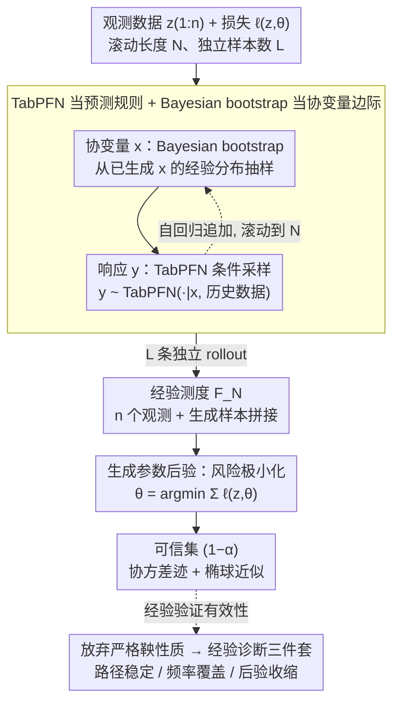

# TabMGP: Martingale Posterior with TabPFN

**会议**: ICML 2026  
**arXiv**: [2510.25154](https://arxiv.org/abs/2510.25154)  
**代码**: 暂未公开  
**领域**: 自监督 / 表格基础模型 / 贝叶斯不确定性  
**关键词**: 鞅后验、TabPFN、表格基础模型、广义贝叶斯、可信集

## 一句话总结
把 TabPFN 这种预训练表格 Transformer 直接当作鞅后验（MGP）的预测规则，通过 in-context 前向滚动采样得到任意损失函数下参数 $\theta$ 的可信集，避免了手工设计先验/似然和拷贝拉超参，且在 30 个真实/合成场景下覆盖率与可信集面积同时优于手工 MGP 与经典贝叶斯。

## 研究背景与动机

**领域现状**：经典贝叶斯推断给参数 $\theta$ 提供不确定性，但要求显式指定先验和似然；鞅后验（MGP, Fong et al. 2023）改用"预测规则" $(P_i)_{i\ge 0}$ 代替先验-似然，再配合一个损失函数 $\ell(z,\theta)$ 来定义感兴趣的功能量 $\theta(F)=\arg\min_\vartheta \int \ell(z,\vartheta)\,\mathrm{d}F(z)$，绕开了先验设定。

**现有痛点**：MGP 文献几乎都使用"手工"预测规则（Bayesian bootstrap、bivariate copula、autoregressive GP、vine copula 等），每个都引入 1+ 个平滑/带宽超参，必须针对每个数据集重新调；而且只在低维或特定分布族表现良好，难以承接现代表格数据的复杂结构。

**核心矛盾**：手工预测规则之所以普遍存在，是因为社区把"严格满足鞅性质 $\mathbb{E}[P_{i+1}(A)\mid Z_{1:i}]=P_i(A)$"当成必要条件，并据此设计每一个新的预测规则。作者论证：鞅性质只是 $F_\infty$ 存在的充分而非必要条件；过度强调它反而阻挡了高容量预测器的接入。

**本文目标**：能否把一个已经在大规模合成表格数据上预训练、近似贝叶斯 PPD 的基础模型（TabPFN）直接当作 MGP 的预测规则？由此（i）省去手工设计；（ii）享受预训练的覆盖能力；（iii）经验上即使违反严格鞅性质，仍能给出近名义覆盖率。

**切入角度**：TabPFN 三个天然特性恰好契合 MGP：① in-context 学习，新数据无需微调即可输出 $y\mid x$ 的预测分布；② 架构本身行置换不变，不像 copula 还要手动平均所有排列；③ 训练目标就是逼近贝叶斯 PPD，而 PPD 正是 MGP 中的理想预测规则。

**核心 idea**：用 TabPFN 提供 $Y\mid X$ 条件分布、贝叶斯 bootstrap 提供 $X$ 的边际分布，把"前向滚动采样 + 损失最小化"映射成 Transformer 的自回归推理，得到 $\theta(F_N^{(l)})$ 作为 $\theta(F_\infty)\mid z_{1:n}$ 的近似后验样本。

## 方法详解

### 整体框架
输入：观测数据 $z_{1:n}=(x_i,y_i)_{i=1}^n$、损失函数 $\ell(z,\theta)$、滚动长度 $N$（一般取 $N=n+T$，$T=500$）、样本数 $L$。
输出：$L$ 个近似后验样本 $\{\theta^{(l)}\}_{l=1}^L \sim \theta(F_\infty)\mid z_{1:n}$，进而构造可信集 $\widehat{C}_{1-\alpha}(z_{1:n})$。

Pipeline 三段：
1. **前向滚动**：对每个 $l\in\{1,\dots,L\}$，从 $z_{1:n}$ 出发自回归生成 $z_{n+1:N}^{(l)}$；$x_{i+1}^{(l)}$ 来自 $x_{1:i}^{(l)}$ 的经验分布（贝叶斯 bootstrap），$y_{i+1}^{(l)}\sim \mathrm{TabPFN}(\cdot\mid x_{i+1}^{(l)}, z_{1:i}^{(l)})$。
2. **风险极小化**：对每个 rollout 形成经验测度 $F_N^{(l)}=\tfrac1N\sum_{i=1}^N\delta_{z_i^{(l)}}$，求 $\theta^{(l)}=\arg\min_\theta\sum_i\ell(z_i^{(l)},\theta)$。
3. **可信集**：用 $\{\theta^{(l)}\}$ 的协方差迹和椭球近似得到 $(1-\alpha)$ 联合可信集。

所有 $l$ 之间相互独立，天然嵌入并行。

### 关键设计

**1. TabPFN 当预测规则 + Bayesian bootstrap 当协变量边际：把硬骨头分给各自擅长的部件**

MGP 在监督场景下需要建 $(X,Y)$ 联合分布，但高维 $X$ 的无条件建模极难，传统 copula 预测规则还得显式平均所有数据排列、手调带宽。作者用一招"分而治之"绕开：沿用 Fong et al. (2023) 的 joint method，让 TabPFN 只管它最擅长的条件分布 $y_{i+1}\sim P_i(\cdot\mid x_{i+1},z_{1:i})$，而协变量边际 $x_{i+1}\sim\mathrm{Empirical}(x_{1:i})$ 交给贝叶斯 bootstrap。这样 TabPFN 的强项（监督预测）被精确利用、弱项（无条件协变量建模）被 bootstrap 接管，同时 TabPFN 在架构层面天然行置换不变、无需调参——copula 框架最大的两个工程痛点（手动平均排列、手调带宽）被一次性消掉。

**2. 放弃"严格鞅性质"，用经验诊断三件套验证：把不可证的理论门槛换成可观测的实用属性**

MGP 社区普遍把"严格满足鞅性质 $\mathbb{E}[P_{i+1}(A)\mid Z_{1:i}]=P_i(A)$"当成接入新预测规则的必要条件，这恰恰挡住了 TabPFN——它既不满足鞅、也不满足放宽的 a.c.i.d. 条件，而高容量神经网络的鞅性质用现有理论工具根本无法证明。作者的破局论点是：鞅性质只是 $F_\infty$ 存在的充分而非必要条件，与其卡在不可证的条件上拒绝高容量预测器，不如用三个经验诊断闭环验证有效性——(a) 路径稳定性：监控 $\mathbb{E}_{F_N}[\tfrac1p\|\theta(F_n)-\theta(F_N)\|_1]$ 随 $N$ 是否在非零常数上 plateau；(b) 频率覆盖率：多次抽 $z_{1:n}\sim F^\star$，看 $(1-\alpha)$ 可信集是否以 $\ge 1-\alpha$ 频率包住 $\theta(F^\star)$；(c) 后验收缩：随 $n$ 增大可信集应向 $\theta(F^\star)$ 收紧。实验里 30 个 setup 全部 plateau、覆盖率近名义，印证了这条"理论门槛降级、经验诊断把关"的路线可行。

**3. 生成参数后验而非生成预测：让任意损失定义的科学量都能拿到可信集**

用户拿来 TabPFN 时真正关心的科学估计量 $\theta$（如线性回归系数）通常和 Transformer 的隐式潜在模型毫无关系，如果只能拿到样本预测分布，就做不出关于 $\theta$ 的可信集。TabMGP 把 MGP 看成贝叶斯预测推断（BPI，用预测规则换掉先验/似然）与广义贝叶斯（GB，把推断对象从"似然下的参数"换成"任意损失的极小值"）的合流，同时落地两者：预测规则用 TabPFN，损失用任意 $\ell(z,\theta)$（线性回归的平方损失、logistic 的交叉熵），前向滚动采样 + 风险极小化后产物就是 $\theta(F_\infty)\mid z_{1:n}$ 的后验样本。正是这套"功能量后验"结构，填补了"只有预测分布、没有参数可信集"的缺口。

### 损失函数 / 训练策略
TabMGP **本身没有训练阶段**——TabPFN 已经在大规模合成表格上预训练完毕，作为推断引擎只跑前向。损失函数 $\ell$ 由用户在推断阶段自由指定：线性回归用 $\ell(x,y,\theta)=(y-[1\ x^\top]\theta)^2$，$K$ 类分类用 $\ell(x,y,\theta)=-\log\Pr(y=k)$（softmax）。关键超参：滚动长度 $T=500$（少数收敛慢的场景到 $T=1000$）、独立 rollout 数 $L$（实验默认 $100\sim 1000$）。

## 实验关键数据

### 主实验
30 个 setup（11 合成 + 19 真实数据集，来自 OpenML/UCI），目标覆盖率 0.95，下表为线性回归节选；越接近 1.00 越好，Size 是后验协方差矩阵的迹（越小越好，前提是覆盖率达标）。

| Setup | TabMGP Rate / Size | BB Rate / Size | Copula Rate / Size | Bayes Rate / Size | Asymptotic Rate / Size |
|-------|--------------------|----------------|--------------------|-------------------|------------------------|
| $\mathcal{N}(0,1)$ | **1.00 / 0.45** | 0.55 / 0.09 | 0.99 / 0.35 | 1.00 / 0.65 | 1.00 / 1.31 |
| $t_3$（重尾） | **1.00 / 0.48** | 0.66 / 0.14 | 0.97 / 0.35 | 0.98 / 0.65 | 0.98 / 1.31 |
| heterosc. $s_3$ | **1.00 / 0.33** | 0.53 / 0.02 | 1.00 / 0.37 | 1.00 / 0.65 | 1.00 / 1.31 |
| concrete (真实) | 0.91 / **0.06** | 0.80 / 0.05 | 1.00 / 0.12 | 0.87 / 0.05 | 1.00 / 0.10 |
| airfoil (真实) | 0.96 / **0.08** | 0.93 / 0.05 | 0.97 / 0.11 | 0.96 / 0.06 | 1.00 / 0.12 |
| energy (真实) | **1.00 / 0.04** | 0.80 / 0.01 | 1.00 / 0.06 | — | — |

### 消融与诊断
| 配置 / 诊断 | 关键指标 | 说明 |
|-------------|---------|------|
| TabMGP $T=500$ | 30 个 setup 全部 plateau | 路径稳定性 $\mathbb{E}[\tfrac1p\|\theta(F_n)-\theta(F_N)\|_1]$ 在 $T=500$ 内收敛 |
| TabMGP $T=1000$ | 慢收敛 setup 也 plateau | 没有出现路径发散，间接说明 $F_\infty$ 存在 |
| 鞅性质检测 | 视觉检查偏离鞅 / a.c.i.d. | TabPFN 不满足严格鞅，也不满足 a.c.i.d.，但覆盖率仍近名义 |
| 替代 baseline (Copula+TabPFN init) | 在多数 setup 不如 TabMGP | 印证"放弃 copula 平滑、直接保留 TabPFN 作预测规则"是有效路径 |

### 关键发现
- TabMGP 的覆盖率最稳定：在所有合成场景下都 $\ge 0.97$；BB 严重欠覆盖（$n=20$ 时 forward 多样性不足），Bayes/Asymptotic 因低 $n$ 渐近近似失败而过覆盖、可信集巨大。
- TabMGP 后验形状常呈现偏度和多峰，而 BB/Copula/Bayes 几乎都是 Gauss 形状——表明 Transformer 学到的隐式潜在模型携带了非高斯结构信息。
- Copula 在近高斯场景有优势，但一旦数据偏离高斯（kin8nm 严重欠覆盖、quake 严重过覆盖）就崩坏，说明手工预测规则对结构假设非常脆弱；TabMGP 凭借大规模预训练具备更强的鲁棒性。

## 亮点与洞察
- **"鞅性质是充分非必要"这一论断是全文最关键的破局点**：作者用经验诊断三件套把"不可证的理论条件"和"可观测的实用属性"解耦，从而合法地引入任何高容量预测器；这一思路可迁移到任何"理论门槛挡住工程落地"的方向。
- **TabPFN + Bayesian bootstrap 的"分而治之"很巧妙**：把高维 $X$ 的边际建模这块硬骨头让给 bootstrap，TabPFN 只做自己擅长的 $Y\mid X$；既保住了不变性和合理性，又避免了让 TabPFN 去模拟它没训练过的 $X$ 分布。
- **后验形状的"非高斯化"是免费红利**：手工 MGP 与 Bayes 大多输出高斯形可信集，TabMGP 直接给出偏态/多峰；对真实数据这往往更如实。
- **架构层面的行置换不变性 = MGP 框架最贵的工程优惠券**：copula MGP 必须显式平均所有排列、慢且复杂；TabPFN 把这条 cost 直接归零。

## 局限与展望
- 不提供严格理论保证；只有路径稳定性的经验 plateau 作为 $F_\infty$ 存在的弱证据，对追求严格覆盖证明的场景仍不够。
- TabPFN 的 in-context 上下文长度有上限（$10^3\sim 10^4$ 行），$N$ 超过该上限时滚动采样会退化或需要分块策略，论文未深究。
- 仅覆盖线性可解释模型与中小 $n$；高维非线性 $\theta$（如神经网络权重的科学解释）下损失最小化本身已经病态，TabMGP 能否扩展尚未验证。
- 用 bootstrap 抽 $X$ 在协变量分布极端不均衡或类别极少的场景下会限制 forward 多样性，可与生成式协变量模型（VAE / 扩散）组合替代。

## 相关工作与启发
- **vs Fong et al. (2023) 原版 MGP**：他们用手工 copula 预测规则保证严格鞅性质并需调带宽；本文用预训练 TabPFN 牺牲严格鞅性质，换来零调参 + 跨数据集鲁棒。
- **vs Nagler & Rügamer (2025)**：同样想用 TabPFN，但发现它非鞅后选择把 TabPFN 只用作 copula 的初始化、随后回到 copula 框架；本文相反，一路保留 TabPFN，并主张"非鞅不影响实用有效性"。
- **vs 经典 Bayes（diffuse $\mathcal{N}(0,10^2)$ 先验）**：经典方法在低 $n/p$ 下被先验主导，TabMGP 用预训练知识作为隐式先验，更鲁棒。
- **vs Fortini et al. (2026) 的预测 CLT**：他们专注 $F_\infty\mid z_{1:n}$ 自身的渐近正态推断，但不涵盖广义贝叶斯的"任意损失函数 $\theta$"；将 predictive CLT 推广到 $\theta(F_\infty)$ 是未来工作。

## 评分
- 新颖性: ⭐⭐⭐⭐⭐ 首次把"基础模型作预测规则"落地到 MGP，并系统挑战了"鞅性质必要论"。
- 实验充分度: ⭐⭐⭐⭐ 30 个 setup + 5 个 baseline + 三件套诊断；但 $\theta$ 仅限低维线性模型，未推到分类多类与非线性场景的极限。
- 写作质量: ⭐⭐⭐⭐⭐ 概念分层（BPI、GB、MGP、TabMGP）干净；Algorithm 1 + Figure 1 让 forward sampling 一目了然。
- 价值: ⭐⭐⭐⭐⭐ 把 TabPFN 这一已经被广泛采用的模型直接接入贝叶斯工具箱，工程意义大，可立即被实践者复用。

<!-- RELATED:START -->

## 相关论文

- [\[ICML 2026\] Amortized Simulation-Based Inference in Generalized Bayes via Neural Posterior Estimation](amortized_simulation-based_inference_in_generalized_bayes_via_neural_posterior_e.md)
- [\[ICML 2026\] Position: Age Estimation Models Do Not Process Biometric Data](position_age_estimation_models_do_not_process_biometric_data.md)
- [\[ICML 2026\] Less Data, Faster Training: Repeating Smaller Datasets Speeds Up Learning via Sampling Biases](less_data_faster_training_repeating_smaller_datasets_speeds_up_learning_via_samp.md)
- [\[ICML 2026\] Adaptive Multi-Round Allocation with Stochastic Arrivals](adaptive_multi-round_allocation_with_stochastic_arrivals.md)
- [\[ICML 2026\] Mapping Human Anti-collusion Mechanisms to Multi-agent AI Systems](mapping_human_anti-collusion_mechanisms_to_multi-agent_ai_systems.md)

<!-- RELATED:END -->
