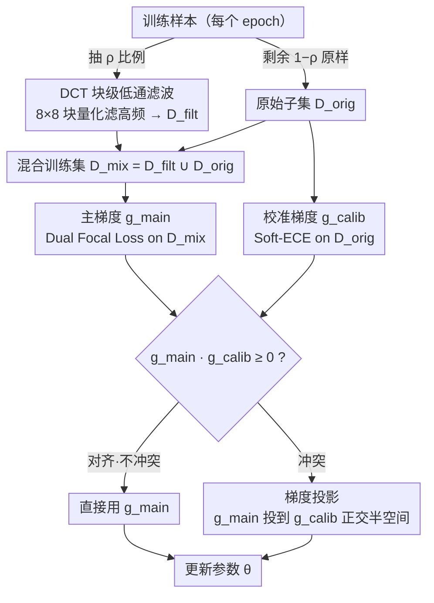

# Target-Agnostic Calibration under Distribution Shift with Frequency-Aware Gradient Rectification

**会议**: ICML 2026  
**arXiv**: [2508.19830](https://arxiv.org/abs/2508.19830)  
**代码**: https://github.com/YilinZhang107/FGR-Calib (有)  
**领域**: 可解释性 / 置信度校准 / 分布偏移鲁棒性  
**关键词**: 校准、分布偏移、DCT 低通滤波、梯度投影、域不变特征

## 一句话总结
FGR 用 DCT 低通滤波去掉训练图像里的高频虚假捷径来在 OOD 上校准更准，再把「校准要变好」与「ID 不能塌」之间的梯度冲突用一次几何投影按硬约束方式解决，无需调权重就同时压住 OOD 的 ECE 和保住 ID 表现。

## 研究背景与动机

**领域现状**：深度模型部署时不仅要预测准，更要把置信度报准——医疗、自动驾驶等高风险场景里，「以 0.9 置信度预测错」远比「以 0.5 置信度预测错」危险得多。校准方法分两条主流路线：后验式 (Temperature Scaling、isotonic regression 等) 在固定模型上拟合一个置信度变换；训练时式 (Focal Loss / MMCE / Soft-ECE / Dual Focal Loss / Label Smoothing / Mixup 等) 在损失里加正则压低过自信。

**现有痛点**：上述方法在 ID 上工作良好，但一旦遇到分布偏移 (天气 / 光照 / 传感器变化、医院 / 设备差异、地理域差异)，置信度就崩——典型 ResNet 在 ImageNet-C 上从 76% 跌到 18% 而置信度仍然高得离谱。已有「分布偏移下校准」方法又被迫依赖目标域信息：要么需要多域训练数据来训练输入条件温度回归器，要么需要合成验证集模拟目标域，要么需要 Bayesian / 特征密度等额外假设，部署时哪有这种好事。

**核心矛盾**：要在未知 OOD 上保持校准就得让模型只依赖跨分布稳定的特征，但抹掉不稳定信号 (如高频纹理) 必然损失 ID 上的精细决策边界，导致欠自信——这是「OOD 校准 vs ID 校准」之间不可调和的目标冲突，常规多任务加权和无法清晰处理「ID 不能掉」这种硬约束。

**本文目标**：(1) 不访问任何目标域信息的前提下让 OOD 校准变好；(2) 不引入额外 loss 权衡系数的前提下保住 ID 校准。

**切入角度**：从频域看分布偏移——已有证据 (Yin et al. 2019 / Fridovich-Keil et al. 2022 / Li et al. 2023) 表明模型常常把高频统计当作分类捷径，分布偏移也主要扰动高频成分。如果在训练时主动遮蔽掉一部分高频信号，模型就被推着去抓「形状 / 语义」这种跨域稳定的特征；遮蔽副作用 (ID 欠自信) 则交给优化器层面的硬约束机制去消化。

**核心 idea**：「频域过滤造域不变特征 + 梯度投影把 ID 校准当硬约束」——前者是数据侧的鲁棒性来源，后者是优化侧的安全网，二者解耦但耦合工作。

## 方法详解

FGR 是一个训练时框架，由「低通滤波生成混合训练集」与「梯度投影」两部分组合而成，整套训练流程在常规分类训练之后追加 (作者实测从 200 epoch 起插入)。

### 整体框架
每个 epoch 开始时按比例 $\rho$ 随机抽取训练样本做 DCT 低通滤波形成 $\mathcal{D}_{\text{filt}}$，剩余 $(1-\rho)$ 保持原样形成 $\mathcal{D}_{\text{orig}}$，二者并集是混合训练集 $\mathcal{D}_{\text{mix}}=\mathcal{D}_{\text{filt}}\cup\mathcal{D}_{\text{orig}}$。每一步训练算两个梯度：主梯度 $\mathbf{g}_{\text{main}}=\nabla_\theta\mathcal{L}_{\text{main}}(\theta;\mathcal{D}_{\text{mix}})$ 在混合集上算 Dual Focal Loss、校准梯度 $\mathbf{g}_{\text{calib}}=\nabla_\theta\mathcal{L}_{\text{calib}}(\theta;\mathcal{D}_{\text{orig}})$ 仅在原始数据上算 Soft-ECE；当两者冲突时把主梯度投影到与 $\mathbf{g}_{\text{calib}}$ 正交的半空间上再更新。

### 关键设计

**1. DCT 块级低通滤波（Robust Feature Builder）：在不知道目标域的前提下抹掉训练样本里的高频细节，逼模型用形状和大局结构作分类依据**

分布偏移主要扰动高频成分，而模型又常把高频统计当分类捷径。本文于是在训练时主动遮蔽掉一部分高频信号：把图像转 YCbCr，每通道切成 $8\times 8$ 非重叠块 $\bm{x}_b$，2D-DCT 得到 $\mathbf{F}_b$ 后按强度参数 $\lambda$ 的 JPEG 量化表 $\mathbf{Q}_\lambda$ 量化 $\mathbf{F}_b^{(q)}=\text{round}(\mathbf{F}_b/\mathbf{Q}_\lambda)$，再反量化反变换 $\hat{\bm{x}}_b=\text{DCT}^{-1}(\mathbf{F}_b^{(q)}\cdot\mathbf{Q}_\lambda)$ 拼回 RGB，$\lambda$ 越小过滤越激进。选 DCT 而非 Fourier，是因为它的能量集中性让低频系数承载主要语义、丢掉的高频恰是 spurious texture，块级处理又避免了全局 ringing、对常见纹理失真更鲁棒。一个有意识的折中是"只滤一部分样本而非全部"——全滤会让 ID 完全欠自信，混合输入既施加了域不变压力又不彻底毁掉判别边界。

**2. 梯度投影机制（FGR Rectification，核心创新）：把"OOD 校准要变好"和"ID 校准不能塌"从两个加权 loss 改写成"主目标 + 硬约束"**

抹掉高频必然损失 ID 上的精细决策边界，导致欠自信——这是"OOD 校准 vs ID 校准"之间不可调和的目标冲突，常规多任务加权和无法清晰处理"ID 不能掉"这种硬约束。本文把可行半空间定义为 $\mathcal{C}_\text{ID}=\{\mathbf{g}\mid \mathbf{g}^\top\mathbf{g}_{\text{calib}}\ge 0\}$（所有"在 ID 校准方向上不退步"的更新方向）：若 $\mathbf{g}_{\text{main}}\cdot\mathbf{g}_{\text{calib}}\ge 0$ 直接用 $\mathbf{g}_{\text{main}}$，否则做欧氏投影 $\mathbf{g}_\text{final}=\mathbf{g}_{\text{main}}-\frac{\mathbf{g}_{\text{main}}\cdot\mathbf{g}_{\text{calib}}}{\|\mathbf{g}_{\text{calib}}\|^2+\epsilon}\mathbf{g}_{\text{calib}}$。Proposition 4.1 证明这正是 $\mathbf{g}_{\text{main}}$ 到 $\mathcal{C}_\text{ID}$ 的欧氏投影，从而对足够小步长有 $\mathcal{L}_{\text{calib}}(\theta-\eta\mathbf{g}_\text{final})\le\mathcal{L}_{\text{calib}}(\theta)+\mathcal{O}(\eta^2)$。和 PCGrad / CAGrad 这种"对称多任务"方法不同，FGR 的关键是**不对称**——它只在 $\mathbf{g}_{\text{main}}$ 上做最小修正、绝不去动 $\mathbf{g}_{\text{calib}}$，把 ID 校准当成"红线"而非"另一个可妥协的目标"，于是无需在 OOD 收益和 ID 表现之间靠人手调系数。

**3. 损失函数选择（Dual Focal Loss + Soft-ECE 配对）：主损失学鲁棒预测分布、约束损失提供 ID 校准的几何方向，二者通过投影松耦合**

主损失用 Dual Focal Loss $\mathcal{L}_{\text{main}}=-\sum_k y_k(1-\hat{p}_k+\hat{p}_j)^\gamma\log\hat{p}_k$（$j$ 为最高错类），它同时惩罚过自信与欠自信，比 CE / Focal 的单边惩罚更适合校准；约束损失用 Soft-ECE，把不可导的 ECE 用温度软分桶写成可微近似 $\mathcal{L}_{\text{calib}}=(\sum_m\frac{|S_m|}{N}|\text{acc}(S_m)-\text{conf}(S_m)|^2)^{1/2}$。DFL 在混合集上学鲁棒预测分布、Soft-ECE 在原始数据上提供 ID 校准的几何方向，二者靠投影机制协作、没有任何加权超参。作者明确说这套组合只是"投影机制 + 任意校准导向损失"的一个实例，原则上可以替换——选 DFL 是因为它本身就有较好的校准潜力，与投影机制叠加能产生超线性增益。

### 损失函数 / 训练策略
ResNet-50/110、DenseNet-121、Wide-ResNet-26 从头训 350 epoch，前 200 epoch 标准训练让分类边界先稳住，从 200 epoch 起插入 DCT 滤波 + 梯度投影；WILDS 数据集走官方协议微调 ImageNet 预训练模型；总训练时间相对标准训练只多 18%。同时给出 two-stage 微调接口供已有模型增量校准。

## 实验关键数据

### 主实验
合成偏移 (CIFAR / Tiny-ImageNet -C，DenseNet-121，15 corruption × 5 严重度平均) 与真实偏移 (WILDS) 上的关键校准指标：

| 数据集 | 方法 | Acc.↑ | ECE↓ | w/ TS ECE↓ | CECE↓ | ACE↓ |
|--------|------|-------|------|-----------|-------|------|
| CIFAR-10-C | DFL | 70.18 | 16.19 | 15.12 | 4.28 | 4.23 |
| CIFAR-10-C | MaxEnt | 71.98 | 11.62 | 13.63 | 3.62 | 3.62 |
| CIFAR-10-C | **FGR** | **75.12** | **9.02** | 9.90 | **3.12** | **3.09** |
| CIFAR-100-C | DFL | 50.17 | 9.99 | 8.82 | 0.51 | 0.49 |
| CIFAR-100-C | **FGR** | 52.66 | **8.53** | **7.57** | **0.47** | **0.46** |
| Camelyon17 (病理) | DFL | 88.03 | 2.74 | 2.12 | 9.957 | 9.956 |
| Camelyon17 | **FGR** | **89.19** | **2.36** | **1.82** | **5.714** | **5.691** |
| iWildCam (野生动物) | **FGR** | 76.11 | 3.34 | **2.97** | 0.155 | 0.152 |
| FMoW (遥感) | **FGR** | 51.95 | **25.06** | 3.84 | **0.92** | **0.74** |

Office-Home 语义偏移 (leave-one-domain-out 平均)：

| 方法 | OOD Acc.↑ | OOD ECE↓ | OOD TS-ECE↓ | OOD CECE↓ | OOD ACE↓ |
|------|----------|---------|------------|----------|----------|
| CE | 34.20 | 36.45 | 15.11 | 1.429 | 1.238 |
| DFL | 34.17 | 22.91 | 14.51 | 1.061 | 0.975 |
| BSCE-GRA | 32.55 | 21.09 | 15.29 | 1.052 | 0.991 |
| **FGR** | 34.03 | **20.41** | **13.93** | **1.018** | **0.971** |

### 消融实验

| 配置 | 关键发现 |
|------|---------|
| Full FGR | OOD ECE / CECE / ACE 全面最优 |
| 只用 DCT 低通滤波 | OOD 提升但 ID 欠自信、ECE 反弹 |
| 只用梯度投影 | 没有 OOD 鲁棒性来源，效果接近 DFL baseline |
| FGR vs PCGrad (对称多任务) | FGR 更优——硬约束 vs 软折中 |
| FGR vs CAGrad (对称多任务) | 同上，验证「不对称投影」是关键 |
| 滤波强度 $\lambda$ 扫描 | $\lambda$ 越低 OOD 越鲁棒、ID 越欠自信，验证了 trade-off 存在 |

### 关键发现
- **滤波 + 投影必须配套**：单独用滤波在 Camelyon17 把 ECE 从 12.23 (CE) 砍到接近 DFL 水平，但 ID 校准会被破坏；单独用投影没有 OOD 来源；两者合起来才能 Camelyon17 ECE 2.36 / CECE 5.71 (相对 DFL 9.96 砍掉 43%)。
- **对称多任务方法救不了这个问题**：PCGrad / CAGrad 把两个目标当对等加权折中，会持续让 ID 退步；FGR 的不对称投影直接把 ID 锁住、让 OOD 在剩余可行方向上前进。
- **完全兼容后验校准**：所有数据集上 w/ TS 列 FGR 都进一步降低，说明它学到的是「特征侧」的鲁棒性而不是与 TS 抢同一个空间。

## 亮点与洞察
- **「ID 校准当硬约束 + 几何投影」**是这篇论文最可迁移的设计——任何「主目标 vs 红线目标」的训练场景 (公平性约束、安全约束、稀疏度约束) 都可以套这套不对称投影模板，比 PCGrad / CAGrad 更适合「不可妥协的副目标」情境。
- **从频域归因 OOD 鲁棒性**给「域不变特征」一个具体可操作的工程接口——以前讲 invariant features 多停在抽象层面，FGR 通过 DCT 块级低通直接施加先验，块级处理还顺带保留了局部空间结构，比 Fourier 全局滤波更可控。
- **混合数据策略巧妙**：只滤一部分而非全部样本，让模型既看到「干净的精细边界」也看到「鲁棒的粗糙特征」，比单纯数据增强更符合「ID 不掉、OOD 涨」的目标分工。

## 局限与展望
- **任务范围限制**：所有实验都是图像分类 + CNN/DenseNet 主干，DCT 8×8 块级滤波是经典 JPEG 路径；换到 Transformer / ViT、分割、检测、视频是否仍然奏效需要验证 (ViT 的 patch 与 DCT 块尺寸交互可能不平凡)。
- **强假设：高频 = 虚假捷径**：作者引用了支持这一论点的文献，但医学图像 (病理高频信息可能本来就是判别信号) 或细粒度识别场景下，简单低通可能把任务相关信号也滤掉，从 Camelyon17 上 FGR ID 精度还能上升来看这点目前没暴露问题，但在更高频判别任务上需要谨慎。
- **投影机制只保一阶**：Proposition 4.1 只给出 $\mathcal{O}(\eta^2)$ 的一阶非增保证，不保证在大学习率或长训练动态下 ID 校准不会缓慢漂移；作者用「200 epoch 后才插入」的工程选择间接缓解，但缺乏长期稳定性的理论。
- **可改进方向**：把 DCT 替换为可学习的频域 mask 让模型自适应决定滤掉多少；把硬约束扩展到多个 (例：ID 校准 + ID 精度同时硬约束) 形成多约束投影；与 TTA 结合做训练-测试两阶段联合校准。

## 相关工作与启发
- **vs Adaptive Temperature Scaling (Yu et al. 2022 / Wang et al. 2024)**: 他们必须访问或模拟目标域来训温度回归器，FGR 完全 target-agnostic，部署门槛低得多。
- **vs Focal / MaxEnt / Dual Focal Loss**: 这些只在损失里做正则，没有显式的 OOD 来源；FGR 的频域滤波直接造出「分布偏移压力」，相当于在训练时模拟了偏移。
- **vs PCGrad (Yu et al. 2020) / CAGrad (Liu et al. 2021)**: 对称多任务方法，FGR 用「不对称投影」把 ID 升级为硬约束，去掉了 loss 权重超参。
- **vs AugMix (Hendrycks et al. 2020)**: 数据增强路线，在合成偏移上很强但 WILDS 真实偏移上掉得很惨；FGR 在两类偏移上都稳，说明频域先验比像素级混合更通用。

## 评分
- 新颖性: ⭐⭐⭐⭐ 「频域滤波 + 硬约束投影」组合是新的，单独看每部分都有先例 (DCT 鲁棒性 / PCGrad)，但「不对称投影把 ID 升级为硬约束」是真正的概念升级。
- 实验充分度: ⭐⭐⭐⭐⭐ 合成 (CIFAR-C / Tiny-ImageNet-C) + 真实 (Camelyon17 / iWildCam / FMoW) + 语义 (Office-Home) 全覆盖，并与 PCGrad / CAGrad / 后验 TS 都做了对比。
- 写作质量: ⭐⭐⭐⭐ 公式与几何直觉清楚，特别是 Proposition 4.1 的形式化把方法的「优化语义」讲透；个别地方略简 (DCT 与 JPEG 量化表的关系)。
- 价值: ⭐⭐⭐⭐ 直接解决了「分布偏移校准必须依赖目标域信息」这个部署痛点，加 18% 训练时间换来 OOD 校准显著改善，工程上易落地、易复现。

<!-- RELATED:START -->

## 相关论文

- [\[CVPR 2025\] Sufficient Invariant Learning for Distribution Shift](../../CVPR2025/others/sufficient_invariant_learning_for_distribution_shift.md)
- [\[CVPR 2026\] FAST: Topology-Aware Frequency-Domain Distribution Matching for Coreset Selection](../../CVPR2026/others/fast_topology-aware_frequency-domain_distribution_matching_for_coreset_selection.md)
- [\[CVPR 2025\] Open Set Label Shift with Test Time Out-of-Distribution Reference](../../CVPR2025/others/open_set_label_shift_with_test_time_out-of-distribution_reference.md)
- [\[ECCV 2024\] Rebalancing Using Estimated Class Distribution for Imbalanced Semi-Supervised Learning under Class Distribution Mismatch](../../ECCV2024/others/rebalancing_using_estimated_class_distribution_for_imbalanced_semi-supervised_le.md)
- [\[ICML 2026\] Markov Chain Monte Carlo without Evaluating the Target: An Auxiliary Variable Approach](markov_chain_monte_carlo_without_evaluating_the_target_an_auxiliary_variable_app.md)

<!-- RELATED:END -->
