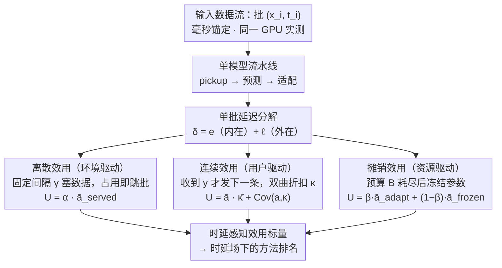

# TEMPORA: Characterising the Time-Contingent Utility of Online Test-Time Adaptation

**会议**: ICML 2026  
**arXiv**: [2602.06136](https://arxiv.org/abs/2602.06136)  
**代码**: https://github.com/sudotensor/tempora (有)  
**领域**: 自监督 / 测试时自适应 / 评测框架  
**关键词**: TTA、时延约束、排名不稳定、效用分解、边缘部署

## 一句话总结
TEMPORA 把 TTA 评测从「无时延上限的离线精度」改写为「时延受限下的可服务效用」，用离散 / 连续 / 摊销三类时间约束 + 可分解的效用指标，在 ImageNet-C × ResNet-50 上跑 750+ 次实验证明：离线榜首方法在 87.9% 的时延场景下输掉冠军，且越接近真实部署越不预测。

## 研究背景与动机

**领域现状**：全测试时自适应 (Fully TTA) 假设只能用预训练参数 $\theta$ 与来流无标签样本 $x_i\sim\mathcal{T}$ 校正分布漂移，主流路线是冻结主干、只更新 BN 仿射参数 (Tent / ETA / SAR / CMF / DeYO 等)。社区按 ImageNet-C 离线平均精度排名，CMF 通常被视为 SOTA。

**现有痛点**：离线评测把 TTA 当成「静态映射 $f_\theta:\mathcal{X}\to\mathcal{Y}$」，默认下一批数据要等当前批适配完成才能到达。但是真实系统里，慢一拍的预测就是无用预测——手机拍照分类晚 200 ms 用户已经划走、巡检无人机晚 1 s 已经撞树、监控视频晚一帧就丢掉这一帧。论文实测一个常用方法 (扩散式输入适配) 比标准推理慢 $810\times$，离线榜单完全藏起了这件事。

**核心矛盾**：「适配带来的精度增益」与「适配本身吃掉的 wall-clock 时间」之间存在 trade-off，但现有评测只测前者、把后者当 footnote。Alfarra et al. 2024 首次试图建模时延，可他们的速度单位是「相对于本模型的推理 FLOPs」而不是物理毫秒，导致同一个阈值在不同硬件 / 模型上含义漂移；同时 ceiling 算子把任意 $\delta\in(k\gamma,(k+1)\gamma]$ 都映射到同一个 miss 率，把方法内的优化抹平。

**本文目标**：把 TTA 评测改造成「在给定物理时延约束 (ms) 下，方法到底交付了多少可用预测」，并把这个新维度拆成可诊断的子项，回答「为什么排名变了」而不只是「排名变没变」。

**切入角度**：作者把部署场景按时间压力来源分成三类原型——环境驱动 (传感器按帧率往里塞) / 用户驱动 (用户等响应) / 资源驱动 (电池或算力总预算)，分别对应离散、连续、摊销三种效用度量；每种度量都设计成可解析分解的乘积或加权和，把「精度本身」与「时间惩罚」拆开。

**核心 idea**：用「物理毫秒锚定 + 三档时间原型 + 可分解效用」把 TTA 从「离线榜上跑得快」重新定义为「在你手上那块硬件 + 你客户能忍的延迟内跑得出」。

## 方法详解

TEMPORA 不是一个新 TTA 方法，而是一套评测框架，由三部分组成：(i) 时间场景刻画部署约束、(ii) 评测协议把约束落地成 wall-clock 仿真、(iii) 时延感知的效用度量把精度与时延耦合成单一标量。

### 整体框架
数据流被形式化为 $\{(\mathbf{x}_i,t_i)\}_{i=1}^N$，$t_i$ 是第 $i$ 批的真实到达时刻。每个批走完「pickup → 预测 → 后续适配」一条流水线，作者按预测时刻把单批延迟拆成 $\delta_i=e_i+\ell_i$：$e_i$ 是 pickup 到预测出来的内在 (intrinsic) 部分、$\ell_i$ 是预测之后还在反传更新参数从而阻塞下一批的外在 (extrinsic) 部分。框架在这一条公共时间轴上跑三种不同的「到达-排队-效用结算」规则，并要求所有时延都用毫秒、用同一台 GPU 实测得到，不再用 FLOPs 代理。

### 关键设计

**1. 离散效用（环境驱动）：建模传感器按固定节奏强塞数据的场景，让"跳批"从 wall-clock 仿真里自然涌现而不是预先算出来**

摄像头、雷达这类场景以固定间隔 $\gamma$ 往里塞数据，单模型流水线跟不上节奏的批就被永久丢弃。TEMPORA 用递归 $s_{j+1}=\max(f_j,t_{p_{j+1}})$、$f_{j+1}=s_{j+1}+\delta_{p_{j+1}}$ 模拟流水线的开始与结束时刻，下一批指针 $p_{j+1}=\max(p_j+1,\lfloor f_j/\gamma\rfloor+1)$ 让跳批从仿真里自然出现，而不是像前作那样用 ceiling 算子预先离散化。效用 $U_{\text{discrete}}=\alpha\cdot\bar{a}_{\text{served}}$，其中 $\alpha=|\mathcal{Q}|/N$ 是可用性、$\bar{a}_{\text{served}}$ 是被服务批的平均精度——两个因子可以独立诊断"系统错误（跳批）"与"模型错误（分类错）"。这一设计修掉了 Alfarra et al. 的三个缺陷：加 batch-sized buffer 消除 forced idling、用真实毫秒消除 stepped penalties、去掉零成本 fallback 模型避免"丢批仍有 prediction"的乐观掩盖，从而能显式暴露"ETA 即使 served accuracy 涨 1.5 倍也追不上 AdaBN"这种由可用性天花板导致的算力破产。

**2. 连续效用（用户驱动）：建模"用户给了答案才发下一条"的交互场景，对慢响应做软惩罚而不是直接丢**

交互式系统里用户给 $y_i$ 之后才发 $x_{i+1}$，慢一拍的预测虽然没被丢但价值打折。用户感知的等待时间是 $w_i=\ell_{i-1}+e_i$，有效响应延迟 $d_i=\max(0,w_i-\lambda)$，再用 HCI 文献里的双曲折扣 $\kappa_i=(1+d_i/(T-\lambda))^{-1}$ 把精度乘上一个 $[0,1]$ 的时延权重（$T$ 是"半衰"阈值，$w_i=T$ 时效用减半）。效用 $U_{\text{continuous}}=\bar{a}\cdot\bar{\kappa}+\mathrm{Cov}(a,\kappa)$，拆成"平均精度 × 平均响应度"加一个"对齐项"，对齐项为负就说明高精度恰恰发生在慢响应那一批。选双曲衰减而非线性/指数，是因为它更贴合心理学实验里的主观时间感（100 ms 处的延迟感知远强于 1 s 处的同样延迟），又单调、连续、有界，能保留细粒度排序梯度；同时把内在 overhead $e_i$ 和外在 overhead $\ell_i$ 分开，让作者发现"梯度类方法的外在 overhead 高达 56–154 ms，正是它们在用户场景全军覆没的根因"。

**3. 摊销效用（资源驱动）：建模总预算受限的设备，对单批延迟无所谓但限制累计 overhead**

无人机电量、过夜推理这类场景不在乎单批快慢，只限制累计 overhead $\sum c_i\le B$。TEMPORA 定义切点 $m=\max\{j:\sum_{i=1}^{j}c_i\le B\}$，前 $m$ 批正常适配、之后冻结参数 $\theta_m$ 继续只做前向；效用 $U_{\text{amortised}}=\beta\cdot\bar{a}_{\text{adapt}}+(1-\beta)\cdot\bar{a}_{\text{frozen}}$，$\beta=m/N$ 是适配占比。这个指标的妙处是 $\bar{a}_{\text{frozen}}<a_0$ 会直接暴露"有害适配"——预算耗尽后留下的模型竟比从没适配过还差。方法之间通过扫不同预算的 Pareto 前沿来比较，而不是只在一个时延点上 PK；正是这个指标揭示了 SHOT-IM（保留 source running statistics）在冻结后仍能保住精度，而 Tent / ETA / CMF / SAR / DeYO 全部跌到 0.1%。

### 损失函数 / 训练策略
TEMPORA 不训练模型，只跑评测。框架在 RTX 4080 上对 9 个 Fully TTA 方法 (AdaBN / LAME / NEO / Tent / ETA / SHOT-IM / CMF / DeYO / SAR) + 标准推理基线测 ImageNet-C severity 5 的 15 种 corruption，每方法用作者默认超参，单 seed (2025)；标准推理基线延迟 $\lambda=39.9$ ms (用 $6\sigma$ 余量取 five-nines 可用性)。

## 实验关键数据

### 主实验
方法在三种时间度量下的分解结果 (15 corruption 平均，11,715 批)：

| 方法 | 离散 $U(\rho{=}100\%)$ | 连续 $U(T{=}50\,\text{ms})$ | 摊销 $U(B{=}1\,\text{s})$ | 离线精度 |
|------|-----------------------|--------------------------|--------------------------|---------|
| Standard | 18.2 | 18.16 | 18.16 | 18.2 |
| AdaBN | 30.8 | 28.42 | 31.72 | ≈26 |
| NEO | 22.1 | 22.14 | 22.14 | ≈22 |
| ETA | 18.7 | 7.22 | 0.87 | 高 (offline #3) |
| CMF | 11.5 | 3.84 | 0.48 | 离线榜首 (10/15) |
| SAR | 7.8 | 2.73 | 0.40 | ≈32 |
| SHOT-IM | 13.5 | 4.73 | **32.22** | 13.15-67.62 |

每批延迟分解 ($\lambda=39.9$ ms)：

| 方法 | $\bar{\delta}$ (ms) | $\bar{e}-\lambda$ (内在) | $\bar{\ell}$ (外在) | 减速 |
|------|---------------------|------------------------|--------------------|------|
| AdaBN | 41.1 | 1.1 | 0.0 | 1.03× |
| Tent | 97.1 | 1.2 | 56.1 | 2.43× |
| ETA | 97.7 | 1.2 | 56.6 | 2.45× |
| SHOT-IM | 121.0 | 1.2 | 79.8 | 3.03× |
| CMF | 160.1 | 1.2 | 119.0 | 4.01× |
| SAR | 195.2 | 1.2 | 154.1 | 4.89× |

### 消融实验

| 配置 | 关键发现 | 说明 |
|------|---------|------|
| 离线 vs $\rho=100\%$ | CMF 离线 10/15 第一 → 时延下仅赢 29/240 (12.1%) | 排名不稳定的直接证据 |
| 不同 $T$ (50→1000 ms) | Spearman $r_s$ 从 -0.19 升到 0.97 | 时延越宽松越接近离线 |
| ETA at $\rho=100\%$ | served acc 45.6%，但 $\alpha=0.41$ → 18.7% | 可用性天花板，需要 75.1% served acc 才追平 AdaBN |
| SAR at $\rho=100\%$ | 追平 AdaBN 需要 149.5% 精度 | 数学上不可能 = 算力破产 |
| 摊销 $B=1$ s | 梯度类前 ~20 批耗光预算，之后 97% 冻结到 0.1% | 「有害适配」失效模式 |
| SHOT-IM 异常 | 冻结后保持 32.2%，因为保留 source running stats | 离线评测看不到这种鲁棒性 |

### 关键发现
- **「外在 overhead」才是杀手**：所有方法的内在 overhead 只有 0–1.2 ms，但梯度方法 56–154 ms 的反传 overhead 全部压在 $\ell_i$ 上，正是它在用户驱动 / 环境驱动场景把可用性和响应度拖到地下室。
- **离线榜首是时延场最大输家**：CMF 在 240 次时延评测里输了 211 次 (87.9%)，平均比赢家低 15% 效用；ETA 离线无冠军、时延赢了 42.9%，集中在中等压力档 ($35\%\le\rho\le 70\%$、$T\ge 100$ ms、$8\le B\le 16$ s)。
- **三种失效模式各有几何解释**：离散下是可用性 $\alpha$ 给效用乘上天花板 (加法挤出)、连续下是 $\bar{\kappa}$ 给精度打折 (乘法贴现)、摊销下是冻结后参数漂走变成负贡献 (累积反向)；三者都源于「overhead 没有被同等的精度增益偿付」。

## 亮点与洞察
- **物理毫秒锚定**让一个数 (50 ms 阈值) 在不同硬件 / 模型上语义一致，从此可以跨论文、跨硬件比较时延评测——前作 Alfarra 的「单位=本模型 FLOPs」做不到这一点，这是评测可重复性的实质性进步。
- **效用可分解** ($U_{\text{discrete}}=\alpha\cdot\bar{a}_{\text{served}}$、$U_{\text{continuous}}=\bar{a}\cdot\bar{\kappa}+\mathrm{Cov}$、$U_{\text{amortised}}=\beta\bar{a}_{\text{adapt}}+(1-\beta)\bar{a}_{\text{frozen}}$) 把「为什么输了」直接显式化，论文据此从 9 个方法身上抽出 3 条「可部署适配」的必要条件 (按 corruption 难度调算力 / 时间感知缩放 / anytime 表现)，可以直接当未来方法的设计 spec。
- **batch-sized buffer + wall-clock 仿真** 让 missed batch 是结果而不是输入，这种「仿真而非分析式打分」的评测姿态值得迁移到 streaming continual learning、online RL 等所有「精度-延迟 trade-off」场景。

## 局限与展望
- **范围限制**：只在 ImageNet-C × ResNet-50 一个 backbone 上跑主实验 (附录扩到 ViT-B/16、ImageNet-R/V2、Pi 5 CPU)，模态只有图像分类；分割、翻译、语音、医疗等场景需要 case-by-case 重新校准 $\lambda$、$T$、$B$ 的物理意义。
- **方法覆盖**：剔除了 DDA / MEMO 等「极慢但偶有亮点」的方法、以及组合空间爆炸的 wrapper 方法，这意味着「时延约束下哪类方法整体更强」的结论暂时只对中等开销的 fully TTA 方法成立。
- **单 seed + 默认超参**：作者承认 hyperparameter sweep 仍可能扭转某些方法对，但对那些已经接近算力破产的方法，单批延迟天花板是调超参也救不回来的——这一论断有点强，需要更多证据支撑。
- **可改进方向**：把三种效用组合成混合度量 (例：电池供电的入侵检测同时受环境到达 + 用户响应 + 总能耗约束)；把 TEMPORA 与 BoTTA / UniTTA 的「分布真实性」评测拼起来，模拟非 i.i.d. 真实流。

## 相关工作与启发
- **vs Alfarra et al. (ICML 2024)**: 他们首次把单模型 latency 作为评测维度，但用 FLOPs 代理、ceiling 离散化、fallback 模型三大设计选择让评测无法跨硬件复用；TEMPORA 全数修掉，并把单一离散场景扩成三档原型。
- **vs BoTTA / UniTTA / TTAB (2023-2025)**: 这些工作改善的是「测试流的分布真实性」(non-i.i.d. / Markov 状态切换 / hyperparameter 选择)；TEMPORA 攻的是「测试流的时间真实性」，两者正交、可叠加。
- **vs Ghunaim et al. (2023, 在线持续学习)**: 同样观察到 sample starvation 会改变排名，但单位是 FLOPs；TEMPORA 把这个观察推广到 TTA 并物理化、可分解化。

## 评分
- 新颖性: ⭐⭐⭐⭐ 不是新方法，但「物理毫秒 + 三档原型 + 可分解效用」这套评测设计是该方向缺失的工程化范式。
- 实验充分度: ⭐⭐⭐⭐⭐ 9 方法 × 15 corruption × 16 时间场景 = 750+ 评测，再加附录 ViT / 多数据集 / Pi 5 跨硬件验证，覆盖密度罕见。
- 写作质量: ⭐⭐⭐⭐⭐ 三档原型的形式化与失效模式诊断写得极清晰，每个度量都给「方法要赢基线需要满足什么条件」的解析式，读完即用。
- 价值: ⭐⭐⭐⭐⭐ 直接动摇了「离线榜越高越好」的社区惯性，给 TTA 后续方法设计 (corruption-conditioned 算力 / time-aware scaling / anytime) 设了明确目标，影响面会很大。

<!-- RELATED:START -->

## 相关论文

- [\[ICML 2026\] Private and Stable Test-Time Adaptation with Differential Privacy](private_and_stable_test-time_adaptation_with_differential_privacy.md)
- [\[CVPR 2026\] Neural Collapse in Test-Time Adaptation](../../CVPR2026/others/neural_collapse_in_test-time_adaptation.md)
- [\[ICML 2026\] Test-Time Training with KV Binding Is Secretly Linear Attention](test-time_training_with_kv_binding_is_secretly_linear_attention.md)
- [\[NeurIPS 2025\] Test-Time Adaptation by Causal Trimming](../../NeurIPS2025/others/test-time_adaptation_by_causal_trimming.md)
- [\[CVPR 2026\] WiTTA-Bench: Benchmarking Test-Time Adaptation for WiFi Sensing](../../CVPR2026/others/witta-bench_benchmarking_test-time_adaptation_for_wifi_sensing.md)

<!-- RELATED:END -->
