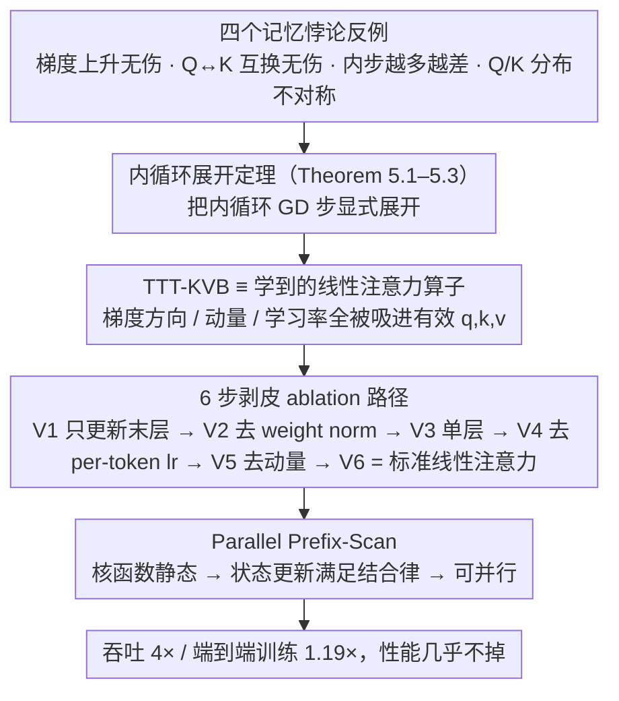

# Test-Time Training with KV Binding Is Secretly Linear Attention

**会议**: ICML 2026  
**arXiv**: [2602.21204](https://arxiv.org/abs/2602.21204)  
**代码**: https://research.nvidia.com/labs/sil/projects/tttla/ (有)  
**领域**: 序列建模 / Transformer 替代 / 线性注意力  
**关键词**: 测试时训练、TTT-KVB、线性注意力、并行化、架构简化

## 一句话总结
本文用四个「记忆悖论」反例 + 一套严格的展开定理，证明带 KV-binding 内循环的 TTT（如 LaCT、ViTTT）即便用多层 MLP + 动量也只是「学到的线性注意力算子」，并据此把它简化、并行化为标准线性注意力，吞吐提升 4× 而性能几乎不掉。

## 研究背景与动机
**领域现状**：TTT-KVB（带 KV-binding 内循环的测试时训练）被当作 softmax attention 的替代序列建模层，主流解读是「online meta-learning / 测试时记忆」——把 key-value 关系存进一个 MLP 快权重 $f_\theta$ 里，查询时用 query 检索。LaCT、Titans、ViTTT 等近期工作都沿这个解读引入了多层 MLP、Muon 风格梯度正交化、动量、weight normalization、per-token learnable lr 等复杂设计，全为提升「记忆保真度」。

**现有痛点**：作者发现「测试时记忆」解读与实证现象系统性地矛盾：
- **优化-性能反向**：增加内循环 GD 步数能降 inner loss（记得更准），但下游任务反而变差（图 1）；
- **梯度上升仍能 work**：把 inner loop 改成梯度上升（专门搞坏记忆）retrain 后性能几乎不掉甚至略升（Table 1）；
- **Q-K 分布不对称**：t-SNE 显示 Q 和 K 在表征空间显著分离，这与「用 Q 检索由 K 训出的 $f_\theta$」假设直接冲突；
- **Q→K 替换无伤**：把 query 直接换成 key 来计算 TTT 输出，PPL / PSNR / acc 几乎不变。

这四个现象任意一个都已经够让人怀疑记忆解读，凑齐之后基本就是反证。

**核心矛盾**：现有理论框架（test-time memorization）和实证现象（梯度方向无关、Q-K 角色对调无伤、记忆质量与性能反向）根本对不上；继续按记忆思路加复杂模块只是「无效的精细化」。

**本文目标**：(i) 给 TTT-KVB 找一个能解释所有反例的统一理论框架；(ii) 据此判断哪些复杂设计是冗余的；(iii) 把序列结构从 recurrent 解锁成 parallel 以拿到工程加速。

**切入角度**：把内循环的 GD 步骤显式展开。Sun 2025 已证明「单层 + 零初始化 + 线性 inner loop」时 TTT = 线性注意力，作者把这个结论推广到「多层 MLP + 动量 + 非零初始化」的一般情形。

**核心 idea**：TTT-KVB 的内循环并不是 meta-learning 存检索表，而是把原始 $(q,k,v)$ 通过 $\phi$ 等映射成一个「学到的结构化 $(q,k,v)$」，整个机制等价于线性注意力算子。

## 方法详解

### 整体框架
论文分三步：(1) 实证给出四个与记忆解读冲突的反例（Section 4）；(2) 用三条定理把 TTT-KVB 严格化为线性注意力的形式（Section 5）；(3) 沿这个理论提出一条把 LaCT/ViTTT 逐步剥成标准线性注意力的 ablation 路径（Variants 1-6），最终把 recurrent 实现替换为 parallel prefix-scan（Section 6）。整条逻辑是「反例祛魅 → 展开定理 → 逐步剥皮 → 并行加速」的因果链，下面三个关键设计正好对应链条中段到末端的三个贡献节点。

### 关键设计

**1. 内循环展开定理：把"在测试时记忆"这套叙事拆开，发现底下其实只是一个线性注意力算子**

四个反例之所以集中爆发，是因为"记忆"解读根本对不上现象，所以必须先有一个不依赖记忆假设的形式化表征。本文的做法是把内循环的 GD 步骤显式展开。设内循环 $f(x)=\phi(x;\Theta)W$ 最后一层是无偏置线性，Theorem 5.1 给出单步 GD 更新后 $o=\phi_{t+1}(q)(W_t+\phi_t(k)^\top g_t(k))$，其中 $g_t(k)=-\eta\,\partial\mathcal{L}/\partial f_t(k)$——这恰好是线性注意力的形式 $o=\hat q(S_0+\hat k^\top\hat v)$，对应 $\hat q=\phi_{t+1}(q)$、$\hat k=\phi_t(k)$、$\hat v=g_t(k)$、$S_0=W_t$。Theorem 5.2 把它沿序列展开成 $o_t=\phi_{t+1}(q_t)(W_0+\sum_{i=0}^t\phi_i(k_i)^\top g_i(k_i))$，Theorem 5.3 再把带动量的 GD 写成动量加权的有效 value $v^\text{eff}_i=g_i(k_i)\cdot\sum_{j=i}^t\beta_i^j$，结构仍是线性注意力。这个视角一下子把四个反例全解释通了：梯度方向被吸进有效 value（所以改成梯度上升 retrain 后照样 work），Q 和 K 不需要语义对称（所以 Q→K 互换无伤），内循环步数对应的是不同的有效算子而非"记得更牢"（所以多走几步反而下游变差）。

**2. 把复杂 TTT 逐步剥成线性注意力的 ablation 路径：用 6 步消融给每个流行设计标价**

直接抛出"TTT 等价于线性注意力"是个抽象主张，没人会立刻信。本文于是给出一条 6 步消融路径，把 LaCT 和 ViTTT 一层层还原成标准线性注意力，每一步都有定理或推导支撑"为什么可以去掉"：Step 1 只更新最后一层（让 $\phi$ 静态化）；Step 2 移除 weight norm（让状态更新可并行）；Step 3 把多层 MLP 砍成单层线性；Step 4 移除 per-token learnable lr（被有效 value 吸收）；Step 5 移除动量；Step 6 移除梯度正交化 $\mathcal{M}(\cdot)$，最终落到 $o=q(W+\sum_i k_i^\top v_i)$。这样一来，每个被去掉的模块都和具体的性能、速度数字挂上钩，抽象的等价性主张就变成了可落地的工程决策——读者能直接看到 weight norm、per-token lr、动量、多层 MLP 各贡献了多少（答案是几乎都没用）。

**3. Parallel Prefix-Scan 形式：认清是线性注意力之后，并行化就成了顺理成章的事，吞吐直接 4×**

之前所有 TTT 实现都默认 sequential，因为它们把内循环当成真在"时间上更新参数"。但一旦看清本质，这个假设就站不住了：当 weight normalization 被移除且只更新最后一层时，核函数 $\phi_t\equiv\phi(\cdot;\Theta)$ 与历史无关，状态更新变成 associative 的，于是可以用 parallel prefix scan 替代逐 token 累加。论文在 Appendix H 给了完整的等价性证明，并在 Appendix I 显示加回 weight norm 或动态核就会破坏 associativity——这也反过来印证了"recurrent 性是个误解"：它只是把内循环当真在更新参数的副产物。

### 损失函数 / 训练策略
论文不改损失，只改架构理解。在 LaCT-LLM、LaCT-NVS、ViTTT 三个任务上分别评估 ablation；并行实现在 LaCT-LLM 上端到端训练加速 1.19×。

## 实验关键数据

### 主实验：6 步 ablation 路径

| 配置 | LaCT-LLM PPL ↓ | LaCT-NVS PSNR ↑ | ViTTT Top-1 ↑ | 吞吐 (recurrent) | 吞吐 (parallel) |
|------|---------------|-----------------|----------------|-------------------|-----------------|
| Baseline (full TTT) | 16.43 | 25.94 | 79.34% | 4.30M tok/s | — |
| V1 只更新最后一层 | **15.93** | **25.97** | 79.63% | 10.60M | — |
| V2 去掉 weight norm | 16.31 | 25.93 | 79.63% | 11.02M | 30.18M |
| V3 多层 MLP→单层 | 16.23 | 25.71 | 79.39% | 12.95M | 49.69M |
| V4 去掉 per-token lr | 16.12 | 25.70 | 79.39% | 13.31M | 53.99M |
| V5 去掉动量 | 15.97 | 25.70 | 79.39% | 14.40M | 57.28M |
| V6 去掉梯度正交化 (= 标准线性注意力) | 16.80 | 25.73 | **79.54%** | **89.67M** | **124.6M** |

Variant 1（只更新最后一层）反而是最佳；Variant 6（纯线性注意力）相比 baseline 只增加 +0.37 PPL / -0.21 dB，却换来 21× recurrent + 29× parallel 吞吐。

### 反例消融（Table 1）

| 设定 | LaCT-LLM PPL ↓ | LaCT-NVS PSNR ↑ | ViTTT Top-1 ↑ |
|------|---------------|-----------------|----------------|
| Baseline | 16.43 | 25.94 | 79.34% |
| 内循环 GD → 梯度上升 (retrain) | **16.19** | 25.85 | **79.61%** |
| 把 Q 换成 K 算 TTT 输出 | **16.18** | 25.95 | 79.18% |

性能基本不变，记忆解读彻底站不住。

### 关键发现
- **「只更新最后一层」反而最好**：和 LoRA 的「冻 backbone 调 head」直觉一致；动 $\phi$ 内部参数让 effective kernel 变成动态历史相关函数，反而难训。
- **weight norm / per-token lr / 动量 / 多层 MLP 都几乎无用**：理论上它们都被吸进了 effective $q,k,v$，工程上加上去主要是开销。
- **梯度正交化在 LLM 上有用、NVS / 图像上没用**：唯一保留下来仍有意义的「TTT 独有设计」，但也只剩一点点。
- **并行实现端到端训练加速 1.19×**，PPL 几乎不变，说明 TTT 的 recurrent 性是个误解。

## 亮点与洞察
- **「悖论驱动的祛魅」叙事极强**：四个反例都很简单且与现有理论冲突明显，足以让读者立刻接受作者的重构。这是「先打破，再重建」的经典范式。
- **展开定理把直觉数学化**：单纯说「TTT 是线性注意力」不会有人信，但 Theorem 5.1-5.3 提供了机械可验证的展开，让结论可推广到 Titans 等未实验的方法。
- **理论 → ablation → 工程加速 → 端到端速度**的因果链非常干净，是「理论指导工程」的标准模板。
- **Q-K 分布不对称 + Q→K 互换无伤**是个让人惊讶的现象，说明 TTT 里 $q,k$ 已经不是语义对称的 key/query 角色，而只是 effective query/key 的输入素材。

## 局限与展望
- 理论假设内循环最后一层是无偏置线性，对非线性输出层（如带 softmax/normalization 的）不直接适用。
- 实证主要在 LaCT / ViTTT 两个开源实现上，Titans / Atlas 等满足理论假设但未做实验验证。
- 没有讨论「梯度正交化为什么在 LLM 上有用」的更深机制，可能涉及对梯度噪声/秩的隐式正则，是未来工作。
- 「只更新最后一层」反而最优这个发现，对最近一波「越来越复杂内循环」的工作几乎是直接打脸，需要社区共同复现验证。

## 相关工作与启发
- **vs Sun 2025**: 已证明单层线性 inner loop = 线性注意力；本文严格推广到多层 MLP + 动量，并诱导出大量实证后果。
- **vs Linear Attention / DeltaNet / Mamba**: 把 TTT-KVB 系列方法纳入线性注意力大家族，说明它们的「学习能力」并不比标准 LA 多多少，复杂内循环只是冗余包装。
- **vs LaCT / ViTTT / Titans**: 提供了一个统一的剥皮工具，可用来评估任意新 TTT 变体到底是「真的新东西」还是「换皮线性注意力」。
- **vs Linear Transformers Are Secretly Fast Weight Programmers**: 类似「以为是 A，实际是 B」的祛魅型论文，本文是其在 TTT 方向上的延续。
- **启发**: 对「测试时优化」「meta-learning」类工作，应该先做展开 + 等价性分析再决定增加复杂度；否则容易陷入「优化指标改善但下游性能不动」的陷阱。

## 评分
- 新颖性: ⭐⭐⭐⭐⭐ 把整条 TTT-KVB 研究路线祛魅，理论+实证+工程一气呵成
- 实验充分度: ⭐⭐⭐⭐ 三个任务覆盖 LLM/NVS/分类，反例和 ablation 都到位
- 写作质量: ⭐⭐⭐⭐⭐ 「悖论→定理→简化→加速」叙事极强，每个 claim 都有数字背书
- 价值: ⭐⭐⭐⭐⭐ 直接影响一整条研究路线的方法论选择，并给出可落地的并行实现

<!-- RELATED:START -->

## 相关论文

- [\[CVPR 2026\] ViT3: Unlocking Test-Time Training in Vision](../../CVPR2026/others/vit3_unlocking_test_time_training_in_vision.md)
- [\[ICML 2026\] TEMPORA: Characterising the Time-Contingent Utility of Online Test-Time Adaptation](tempora_characterising_the_time-contingent_utility_of_online_test-time_adaptatio.md)
- [\[ICML 2026\] Private and Stable Test-Time Adaptation with Differential Privacy](private_and_stable_test-time_adaptation_with_differential_privacy.md)
- [\[CVPR 2026\] Neural Collapse in Test-Time Adaptation](../../CVPR2026/others/neural_collapse_in_test-time_adaptation.md)
- [\[NeurIPS 2025\] Alias-Free ViT: Fractional Shift Invariance via Linear Attention](../../NeurIPS2025/others/alias-free_vit_fractional_shift_invariance_via_linear_attention.md)

<!-- RELATED:END -->
