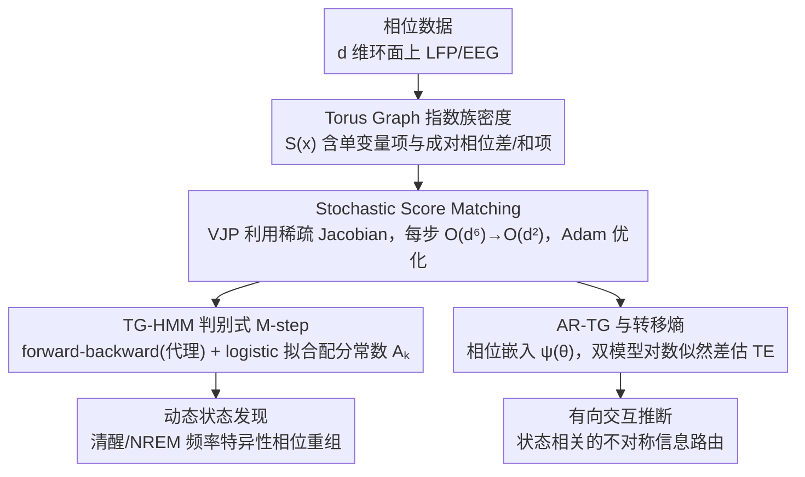

# Torus Graphs for Large-Scale Neural Phase Analysis

**会议**: ICML 2026  
**arXiv**: [2606.00496](https://arxiv.org/abs/2606.00496)  
**代码**: https://github.com/jackgoffinet/torus-graphs  
**领域**: 神经科学 / 概率图模型 / 圆形统计  
**关键词**: torus graph, score matching, phase coupling, hidden Markov model, transfer entropy

## 一句话总结
作者把 Torus Graph (TG)——定义在 $d$-环面 $\mathbb{T}^d$ 上的指数族相位图模型——用随机化分数匹配把每步推断复杂度从 $\mathcal{O}(d^6)$ 砍到 $\mathcal{O}(d^2)$，由此首次支持上千个相位变量，并据此搭出 TG-HMM 与自回归 TG 两套动态/有向扩展，应用到小鼠 LFP 数据上揭示了清醒-NREM 之间的频率特异性相位重组。

## 研究背景与动机

**领域现状**：EEG/LFP 记录通常被描述为多个振荡分量的叠加，每个分量都有一个不断推进的相位 (phase)，相位关系被认为是脑区间通信的核心计算变量。然而主流脑电相位分析仍停留在 Phase Locking Value (PLV) 这种成对 (pairwise) 指标上：$PLV_{X,Y}=|\mathbb{E}\,e^{i(X-Y)}|$。Torus Graph 是 Klein et al. (2020) 提出的圆变量指数族模型，其单变量势函数与成对势函数都推广自 von Mises 分布，能直接做条件独立推断，从而把「直接耦合」和「中介导致的虚假耦合」区分开。

**现有痛点**：TG 的归一化常数解析不可得，所以推断走分数匹配 (score matching)，闭式解需要解一个 $2d^2\times 2d^2$ 的线性系统并存储 $\Gamma\in\mathbb{R}^{2d^2\times 2d^2}$，时间 $\mathcal{O}(d^6)$、内存 $\mathcal{O}(d^4)$。实测在单卡 24GB 上 $d\approx 100$ 就崩盘。而现代 LFP/EEG 单次实验就有 $d=O(10^3)$ 个相位变量（数十通道 × 数十频率 bin）。

**核心矛盾**：成对指标 (PLV、coherence) 算得起但分不清「直接 vs 间接」；TG 分得清却算不起。研究者面对高维相位数据时被迫退回成对分析，丢掉了条件独立信息，而 Kuramoto/Granger 这类模型又主要建模幅度或线性 Gauss 结构，不适合纯相位变量的环形几何。

**本文目标**：(i) 把 TG 推断的每步复杂度降到 $\mathcal{O}(d^2)$；(ii) 在此基础上做出能捕捉「时间状态切换」的动态版本；(iii) 给出能推断「方向性」的自回归版本，配套相位变量的转移熵估计。

**切入角度**：TG 的充分统计 $S(\mathbf{x})$ 中每一项最多只依赖两个相位变量，所以 Jacobian $\nabla_{\mathbf{x}}S(\mathbf{x})$ 虽形式上是 $\mathcal{O}(d^3)$，但稀疏到只有 $\Theta(d^2)$ 个非零元。这意味着 $\bm{\phi}^\top\nabla_{\mathbf{x}}S(\mathbf{x})$ 可用反向模式自动微分的 vector-Jacobian product 在 $\mathcal{O}(d^2)$ 时间内直接算出来，根本无需显式构造 Jacobian。

**核心 idea**：把 TG 的分数匹配目标改写成只依赖 VJP 的随机优化形式，配 Adam 即可在数千维相位变量上做无偏推断；其上叠加 HMM 与自回归结构，得到首个可扩展到千维的相位图模型家族。

## 方法详解

### 整体框架
方法分三层叠加：(1) 静态 TG 用 stochastic score matching；(2) 动态扩展 TG-HMM 用 EM + 判别式 M-step 绕过对数配分函数；(3) 有向扩展 AR-TG 把历史相位通过 $\psi(\theta)=[\cos\theta;\sin\theta]^\top$ 嵌入到 TG 参数里，再用两套 AR-TG 的预测对比估计转移熵 (transfer entropy)。

TG 密度写为 $p(\mathbf{x};\bm{\phi})\propto\exp(\bm{\phi}^\top S(\mathbf{x}))$，$S(\mathbf{x})$ 包含单变量项 $\cos x_j,\sin x_j$ 与成对相位差/和项 $\cos(x_j\pm x_k),\sin(x_j\pm x_k)$，参数维度 $2d^2$。配置上用 JAX，端到端跑在单卡 A5000 24GB 上。

### 关键设计

**1. Stochastic Score Matching：用 VJP 把每步推断从 $\mathcal{O}(d^6)$ 砍到 $\mathcal{O}(d^2)$**

TG 卡在大规模上的瓶颈是分数匹配的闭式解要解一个 $2d^2\times 2d^2$ 线性系统、存储 $\Gamma\in\mathbb{R}^{2d^2\times2d^2}$，时间 $\mathcal{O}(d^6)$、内存 $\mathcal{O}(d^4)$，单卡 24GB 上 $d\approx100$ 就 OOM。本文的关键观察是：$\Gamma=\nabla_{\mathbf{x}}S(\nabla_{\mathbf{x}}S)^\top$ 看着是大矩阵，但 TG 的每个充分统计量最多只依赖两个相位变量，Jacobian 稀疏到只有 $\Theta(d^2)$ 个非零元，所以根本不必显式构造它。把目标里的二次型改写成范数形式 $\bm{\phi}^\top\Gamma(\mathbf{x})\bm{\phi}=\|\bm{\phi}^\top\nabla_{\mathbf{x}}S(\mathbf{x})\|_2^2$ 后，只需对标量 $\bm{\phi}^\top S(\mathbf{x})$ 做一次反向模式自动微分（vector-Jacobian product）就能在 $\mathcal{O}(d^2)$ 内算出。于是整个目标变成

$$J(\bm{\phi})=\mathbb{E}_{\mathbf{x}}\Big[\tfrac{1}{2}\|\bm{\phi}^\top\nabla_{\mathbf{x}}S(\mathbf{x})\|_2^2-\bm{\phi}^\top\mathbf{h}(\mathbf{x})\Big]$$

可以 minibatch 无偏估计、Adam 更新，并兼容 $L_2$ 与诱导稀疏图结构的 group-$\ell_1$ 正则；同一改写平移到条件 TG 上就得到 $\bm{\phi}(y)$ 可由神经网络参数化的版本。换句话说，原闭式分数匹配完全浪费了 TG 的稀疏物理结构，VJP 直接"点中"这层稀疏，把方法学瓶颈一次性打掉。

**2. TG-HMM 的判别式 M-step：把不可解析的配分常数退化成一次 softmax 拟合**

要让 TG 在隐状态 $z_t\in\{1,\dots,K\}$ 间动态切换（比如捕捉 NREM 睡眠的纺锤波耦合），每个状态发射模型 $p(x_t|z_t=k)=\exp(\bm{\phi}_k^\top S(x_t)-A(\bm{\phi}_k))$ 里的对数归一化常数 $A(\bm{\phi}_k)$ 不可解析，是标准 EM 过不去的坎。本文干脆永远不算 $A(\bm{\phi}_k)$，而是引入自由参数 $A_k\in\mathbb{R}$ 加轻量 ridge 正则，构造代理联合模型 $\log\tilde{p}(z,x)=\sum_t\log\Pi_{z_{t-1},z_t}+\sum_t[\bm{\phi}_{z_t}^\top S(x_t)-A_{z_t}]$。E-step 在代理模型上跑标准 forward-backward 得到软责任 $\gamma_{t,k},\xi_{t,i,j}$；M-step 把 $A_k$ 当作可训练的类别截距，其目标 $Q'(A)$ 恰好等价于以 $\gamma_{t,k}$ 为软标签、$S(x_t)$ 为特征、$\{\bm{\phi}_k\}$ 为固定权重的多项 logistic 回归——一个凸优化。作者进一步证明（式 18-22），在 TG 族正确指定、有限样本矩估计良好、$\sum_t r_{t,k}\approx\sum_t\gamma_{t,k}$ 三条假设下，$\nabla A(\bm{\phi}_k)\approx\hat{\mu}_k(\gamma)=\sum_t\gamma_{t,k}S(x_t)/\sum_t\gamma_{t,k}$，即近似满足精确 M-step 的驻点条件。相比直接对每个状态做 NCE / MCMC 估常数会引入额外噪声与超参，这个判别式视角让"估常数"无缝接进 forward-backward、复杂度可控。

**3. AR-TG 与转移熵估计：用相位嵌入把方向性推断做成可闭环的圆变量 Granger**

相位变量的方向性推断历来难，朴素 Granger 用线性高斯会破坏相位的周期性。本文把 TG 扩展成自回归形式 $p(y_t|\mathbf{x}_{<t},y_{<t})\propto\exp[\bm{\phi}(\mathbf{x}_{<t},y_{<t})^\top S(y_t)]$，参数化为

$$\bm{\phi}(\mathbf{x}_{<t},y_{<t})=\mathbf{b}+\sum_{\ell=1}^L\big(\mathbf{W}^{(y)}_\ell\psi(y_{t-\ell})+\mathbf{W}^{(x)}_\ell\psi(\mathbf{x}_{t-\ell})\big)$$

其中嵌入 $\psi(\theta)=[\cos\theta;\sin\theta]^\top$ 把相位映到 $\mathbb{R}^2$、既保住周期性又把参数量压到 $\mathcal{O}(L)$。估转移熵 $TE_{X\to Y}=\mathbb{H}(Y_t|Y_{<t})-\mathbb{H}(Y_t|Y_{<t},X_{<t})$ 时拟合两个 AR-TG——只看历史 $y$ 的 $\hat{p}_1$ 与额外看 $\mathbf{x}$ 的 $\hat{p}_2$——再在独立测试集上算对数似然差 $\widehat{TE}_{X\to Y}=\tfrac{1}{T-L}\sum_t[\log\hat{p}_2-\log\hat{p}_1]$。多变量场景不去训 $\mathcal{O}(C^2)$ 个模型，而是只训一个完整模型加一个高斯插补模型，用 Monte Carlo 把 $p(Y_t|Y_{<t},Z_{<t})\approx\mathbb{E}_{X_{<t}}[\hat{p}(Y_t|X_{<t},Y_{<t},Z_{<t})]$ 估出来，把训练开销压回常数个模型。之所以能闭环，关键在于单变量 von Mises 条件的 $A$ 可解析，于是测试时对数似然能直接精确评估——这是 TE 估计成立的前提。

### 损失函数 / 训练策略
全部在 JAX 上实现；TG/conditional TG 用 stochastic score matching + Adam；TG-HMM 用「forward-backward (代理) + 判别式 M-step (logistic)」交替；AR-TG 用 score matching 估计参数，TE 在独立测试集上算对数似然差。

## 实验关键数据

### 主实验
在 4 维与 64 维合成 TG 数据上验证 stochastic score matching 的参数恢复，再在 $d=1860$ 的小鼠 LFP 真实数据上做大尺度可视化与状态发现。

| 维度 $d$ | 推断方式 | 时间复杂度 / 步 | 最大可处理 | 参数恢复 $R^2$ |
|---------|---------|----------------|-----------|---------------|
| 4 | exact score matching | $\mathcal{O}(d^6)$ | OK | 与 stochastic 持平 |
| 64 | exact | $\mathcal{O}(d^6)$ | OK，但慢 | 与 stochastic 持平 |
| $\sim$100 | exact | $\mathcal{O}(d^6)$ | 24GB GPU 已 OOM | — |
| $\sim$1000+ | **stochastic (本文)** | **$\mathcal{O}(d^2)$** | **OK** | 与 exact 在低维持平 |
| 1860 | stochastic (本文) | $\mathcal{O}(d^2)$ | LFP 真实数据 | 揭示 Wake/NREM 频率特异性重组 |

### 消融实验
| 配置 | 关键观测 | 说明 |
|------|---------|------|
| TG-HMM 完整 | 1334 个 spindle 上稳定提取 6 个状态，其中 1 个时间锁定到 spindle 中心 | 判别式 M-step 不破坏状态恢复 |
| TG-HMM (exact) | $d\lesssim 100$ 准确，>100 OOM | 不可扩展，但低维与本文方法精度一致 |
| AR-TG vs Multivariate Granger | $d=64$ 后 Granger 30h 超时，AR-TG 每跑 <1h 仍准确 | 因果发现层面优势显著 |
| AR-TG (score matching) vs AR-TG (MLE) | score matching 在双向 TE 估计上更稳 | 配分函数处理方式带来的稳定性差异 |

### 关键发现
- 把推断瓶颈从 $\mathcal{O}(d^6)$ 砍到 $\mathcal{O}(d^2)$ 是数量级跃迁：同样硬件下可处理变量数从 $\sim$100 跳到 $\sim$1860，且时间还快一个量级 (Table 1)。
- 应用到 48 小时小鼠 LFP（62 通道 × 30 频率 = 1860 维）后，Wake 状态高频 (>30 Hz) 耦合更强、NREM 状态低频 (<30 Hz) 耦合更强，与已知睡眠生理学一致——是方法验证。
- TG 参数比经验 PLV 显著更稀疏，说明大量 pairwise 同步其实是「经第三方间接耦合」的伪边；这是 PLV 这种成对方法本质无法识别的。
- TG-HMM 在 sleep spindle 上找出一个「空间稀疏的纺锤波状态」，与 PLV 给出的「弥漫式同步增强」形成对照——证明条件独立建模可以剔除中介虚假边。
- AR-TG 多变量 TE 在 Wake/NREM 间揭示 prelimbic→striatum、infralimbic→prelimbic/cingulate、VTA→SNr 三组不对称方向性交互，是 PLV/coherence 看不到的状态相关「路由」。

## 亮点与洞察
- **稀疏结构 + VJP 是把 PGM 推到大规模的通用秘方**：TG 的 $\Gamma$ 看似 $\mathcal{O}(d^4)$ 个元素，但物理上每个统计量只看两个变量，VJP 直接落到这层稀疏上；这种「写出闭式后看其稀疏模式再 VJP 化」的套路可迁移到其他指数族 PGM（如离散 Markov random field、相位树）。
- **判别式 M-step 取代 NCE / MCMC**：用 logistic regression 直接拟合每个状态的对数配分常数 $A_k$，把不可解析常数变成可学超参，这一招对所有「带不可解析配分函数的隐状态模型」都有借鉴价值。
- **相位变量的几何感**：$\psi(\theta)=[\cos\theta;\sin\theta]$ 这个 2 维嵌入贯穿全文，既保了周期性又让 von Mises 条件解析可算——它解释了为什么 TG 家族能同时支持稀疏推断、动态状态切换、有向交互三种扩展，而朴素 Granger 因果（线性高斯）做不到。

## 局限与展望
- AR-TG 的转移熵估计仍要求目标 $y_t$ 是单变量（因为依赖 von Mises 的解析配分函数），多变量目标暂未支持。
- TG-HMM 的判别式 M-step 只是「近似一致」，更严格的统计性质（一致性收敛速度、模型误指定下的行为）作者承认还需后续工作。
- TG 参数虽然给出条件独立结构，但跨频率耦合与频率内通道间耦合都被建成同质节点，神经科学家直接读参数会有解释门槛；作者建议在不关心 cross-frequency 时把模型限制到 within-frequency。
- 跟所有 Granger 类方法一样，AR-TG 的方向性只是预测性 (predictive) 而非干预性 (interventional) 因果，需谨慎解释。

## 相关工作与启发
- **vs PLV / coherence (Lachaux et al., 1999; Srinath & Ray, 2014)**：成对、无法剔除间接边、不可扩展到条件独立分析；本文给出可扩展到千维的条件独立替代。
- **vs Klein et al. (2020) 原版 TG**：他们用闭式分数匹配，$\mathcal{O}(d^6)$ 卡在 100 维；本文用 VJP 化的 stochastic 版本推到 1860 维并补齐动态/有向扩展。
- **vs Kuramoto 模型 (Kuramoto, 1984; Breakspear et al., 2010)**：动力学模型擅长描述大尺度协同，但不是概率模型、不便做条件独立推断；TG 家族走互补的概率统计路线。
- **vs 多变量 Granger 因果**：Granger 用线性高斯破坏相位周期性，且 $d>64$ 后计算超时；AR-TG 在更宽维度/稀疏度区间内稳定恢复因果边。
- **启发**：脑电以外的其他圆形变量任务（蛋白质 backbone torsion 角、地球科学的风向时序、机器人姿态）都可以套用「指数族 + VJP score matching + judgmental M-step」这套组合拳。

## 评分
- 新颖性: ⭐⭐⭐⭐ stochastic score matching 思路朴素但首次系统应用到 TG，并把 HMM/AR 扩展打包，整体性强。
- 实验充分度: ⭐⭐⭐⭐ 合成数据覆盖参数恢复、状态恢复、TE 估计；真实数据用到 1860 维 LFP，并与 PLV、Granger 多方对照。
- 写作质量: ⭐⭐⭐⭐ 把统计推断 + 神经科学应用串起来，公式推导紧凑，章节脉络清晰。
- 价值: ⭐⭐⭐⭐ 给神经科学相位分析交付一套可直接落地的可扩展统计工具栈（含开源代码），方法论上对圆形变量 PGM 社区也有溢出价值。

<!-- RELATED:START -->

## 相关论文

- [\[ICML 2026\] AMDP: Asynchronous Multi-Directional Pipeline Parallelism for Large-Scale Models Training](amdp_asynchronous_multi-directional_pipeline_parallelism_for_large-scale_models_.md)
- [\[CVPR 2026\] MSPT: Efficient Large-Scale Physical Modeling via Parallelized Multi-Scale Attention](../../CVPR2026/others/mspt_efficient_large-scale_physical_modeling_via_parallelized_multi-scale_attent.md)
- [\[CVPR 2026\] Large-scale Robust Enhanced Ensemble Clustering via Outlier Decoupling](../../CVPR2026/others/large-scale_robust_enhanced_ensemble_clustering_via_outlier_decoupling.md)
- [\[CVPR 2026\] Efficient Unrolled Networks for Large-Scale 3D Inverse Problems](../../CVPR2026/others/efficient_unrolled_networks_for_large-scale_3d_inverse_problems.md)
- [\[ACL 2025\] Code-Switching and Syntax: A Large-Scale Experiment](../../ACL2025/others/code-switching_and_syntax_a_large-scale_experiment.md)

<!-- RELATED:END -->
